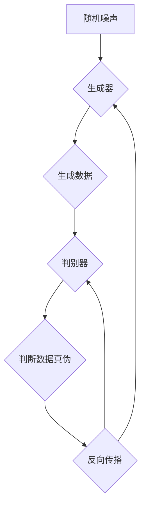

                 

# Generative Adversarial Networks (GAN) 原理与代码实战案例讲解

> **关键词**：生成对抗网络，GAN，深度学习，数据生成，机器学习，图像生成，模型训练
>
> **摘要**：本文将深入探讨生成对抗网络（GAN）的基本原理和构建方法，通过实例代码展示GAN在图像生成中的实际应用，旨在帮助读者理解GAN的工作机制，并掌握其应用技巧。

## 1. 背景介绍

### 1.1 目的和范围

本文的目的是介绍生成对抗网络（Generative Adversarial Networks，GAN）这一强大的深度学习模型，并展示其在图像生成中的实际应用。通过本篇文章，读者将了解GAN的原理、如何构建一个基本的GAN模型，并学会使用代码实现一个图像生成器。

### 1.2 预期读者

本文适合对机器学习和深度学习有一定基础的读者，特别是希望深入了解GAN模型及其应用的读者。虽然本文提供了详细的代码实战，但读者需要对Python编程和TensorFlow框架有一定的了解。

### 1.3 文档结构概述

本文的结构如下：

- **1. 背景介绍**：概述GAN的背景和目的。
- **2. 核心概念与联系**：介绍GAN的核心概念和相关联系。
- **3. 核心算法原理 & 具体操作步骤**：详细讲解GAN的算法原理和操作步骤。
- **4. 数学模型和公式 & 详细讲解 & 举例说明**：阐述GAN的数学模型和公式的原理及应用。
- **5. 项目实战：代码实际案例和详细解释说明**：通过实例代码展示GAN的应用。
- **6. 实际应用场景**：探讨GAN的广泛应用场景。
- **7. 工具和资源推荐**：推荐学习资源和开发工具。
- **8. 总结：未来发展趋势与挑战**：总结GAN的未来发展。
- **9. 附录：常见问题与解答**：解答常见问题。
- **10. 扩展阅读 & 参考资料**：提供进一步学习的资料。

### .4 术语表

#### 1.4.1 核心术语定义

- **生成器（Generator）**：在GAN中，生成器负责生成数据。
- **判别器（Discriminator）**：判别器负责区分生成的数据和真实数据。
- **对抗训练（Adversarial Training）**：通过生成器和判别器的对抗训练来优化模型。
- **损失函数（Loss Function）**：用于衡量生成器和判别器性能的指标。

#### 1.4.2 相关概念解释

- **深度学习（Deep Learning）**：一种机器学习方法，通过多层神经网络进行学习。
- **神经网络（Neural Network）**：由多个节点（神经元）连接而成的网络结构，用于数据建模。

#### 1.4.3 缩略词列表

- **GAN**：Generative Adversarial Networks，生成对抗网络
- **DNN**：Deep Neural Network，深度神经网络
- **CNN**：Convolutional Neural Network，卷积神经网络

## 2. 核心概念与联系

### 2.1 GAN的架构

GAN的核心架构包括两个神经网络：生成器（Generator）和判别器（Discriminator）。生成器的任务是生成类似真实数据的数据，而判别器的任务是区分生成的数据和真实数据。这两个网络通过对抗训练相互优化。


#### 2.2 GAN的工作机制

GAN的工作过程可以分为以下几个步骤：

1. **生成器生成数据**：生成器从随机噪声中生成一批数据。
2. **判别器判断数据**：判别器接收真实数据和生成器生成的数据，并判断其真伪。
3. **反向传播与优化**：根据判别器的判断结果，生成器和判别器通过梯度下降进行优化。

#### 2.3 GAN的优缺点

- **优点**：
  - 能够生成高质量、多样化的数据。
  - 对数据分布的学习能力强。
- **缺点**：
  - 训练过程不稳定，容易出现模式崩溃（mode collapse）。
  - 训练难度大，需要大量计算资源。

### 2.4 Mermaid流程图

下面是GAN的基本架构和流程的Mermaid流程图：



## 3. 核心算法原理 & 具体操作步骤

### 3.1 GAN算法原理

GAN的算法原理基于生成器和判别器的对抗训练。生成器的目标是生成足够真实的数据来欺骗判别器，而判别器的目标是准确区分真实数据和生成数据。

#### 3.1.1 生成器

生成器的任务是将随机噪声映射成真实数据。通常使用一个多层感知机（MLP）或者卷积神经网络（CNN）来实现。

伪代码如下：

```python
# 生成器的伪代码
z = generate_random_noise(batch_size)
x_fake = generator(z)
```

#### 3.1.2 判别器

判别器的任务是对输入的数据进行分类，判断其是否为真实数据。同样，判别器也通常使用一个多层感知机或卷积神经网络。

伪代码如下：

```python
# 判别器的伪代码
x_real = real_data
x_fake = generated_data
y_real = ones([batch_size, 1])
y_fake = zeros([batch_size, 1])
```

#### 3.1.3 GAN的损失函数

GAN的损失函数由两部分组成：判别器损失和生成器损失。

1. **判别器损失**：通常使用二元交叉熵（Binary Cross-Entropy）作为判别器的损失函数。
   $$ L_D(\theta_D) = - \sum_{x \in X} [y(x) \cdot \log(D(x)) + (1 - y(x)) \cdot \log(1 - D(x))] $$
   其中，$X$ 是所有输入数据的集合，$D(x)$ 是判别器对输入数据的判断概率。

2. **生成器损失**：生成器的损失函数与判别器的损失函数相关，可以表示为：
   $$ L_G(\theta_G) = - \sum_{z} [\log(D(G(z)))] $$
   其中，$z$ 是生成器的输入噪声。

### 3.2 GAN的训练过程

GAN的训练过程是一个迭代的过程，每次迭代包括以下几个步骤：

1. **生成器训练**：固定判别器参数，通过优化生成器损失函数来更新生成器的参数。
2. **判别器训练**：固定生成器参数，通过优化判别器损失函数来更新判别器的参数。
3. **迭代重复**：重复上述步骤，直到生成器生成足够逼真的数据。

## 4. 数学模型和公式 & 详细讲解 & 举例说明

### 4.1 GAN的数学模型

生成对抗网络（GAN）的核心在于其数学模型，主要包括生成器和判别器的定义以及两者的对抗训练过程。

#### 4.1.1 生成器和判别器的定义

生成器 $G$ 和判别器 $D$ 分别定义如下：

$$
G: Z \rightarrow X \\
D: X \rightarrow [0, 1]
$$

其中，$Z$ 是噪声空间，$X$ 是数据空间。生成器 $G$ 接受一个随机噪声向量 $z \in Z$，并生成一个伪真实数据 $x \in X$；判别器 $D$ 接收一个数据 $x$ 并输出一个概率值 $D(x) \in [0, 1]$，表示 $x$ 属于真实数据集的概率。

#### 4.1.2 GAN的损失函数

GAN的损失函数由两部分组成：生成器的损失函数 $L_G$ 和判别器的损失函数 $L_D$。

1. **生成器的损失函数**：生成器试图欺骗判别器，使得判别器无法区分生成的数据和真实数据，其损失函数可以表示为：
   $$
   L_G = -\mathbb{E}_{z \sim p_z(z)}[\log(D(G(z))]
   $$

   这里，$p_z(z)$ 是噪声的先验分布，$\mathbb{E}$ 表示期望。

2. **判别器的损失函数**：判别器的目标是最大化生成器和真实数据的判别能力，其损失函数可以表示为：
   $$
   L_D = -\mathbb{E}_{x \sim p_{data}(x)}[\log(D(x))] - \mathbb{E}_{z \sim p_z(z)}[\log(1 - D(G(z))]
   $$

   这里，$p_{data}(x)$ 是真实数据的分布。

### 4.2 详细讲解与举例说明

为了更好地理解GAN的数学模型，我们通过一个简单的例子来说明生成器和判别器的训练过程。

假设我们有一个二元分类问题，目标是区分两张图片，一张是一只猫，另一张是一只狗。

1. **生成器的训练过程**：
   - **输入**：生成器从噪声空间 $Z$ 接受一个随机噪声向量 $z$。
   - **输出**：生成器生成一个伪猫或伪狗图片 $x$。
   - **优化目标**：生成器希望生成尽可能真实的猫或狗图片，使得判别器认为这些图片是真实的，即 $D(G(z)) \approx 1$。

2. **判别器的训练过程**：
   - **输入**：判别器接收一张真实猫或狗图片 $x$ 和一张生成器生成的猫或狗图片 $G(z)$。
   - **输出**：判别器输出一个概率值 $D(x)$ 和 $D(G(z))$，分别表示对真实图片和生成图片的判别能力。
   - **优化目标**：判别器希望最大化其分类能力，即能够准确地区分真实图片和生成图片，$D(x) \approx 1$ 且 $D(G(z)) \approx 0$。

### 4.3 伪代码示例

下面是生成器和判别器训练过程的伪代码示例：

```python
# 生成器的伪代码
for epoch in range(num_epochs):
    for z in generate_random_noise(batch_size):
        x_fake = generator(z)
        d_loss_fake = -log(discriminator(x_fake))

    for x in generate_real_data(batch_size):
        d_loss_real = -log(discriminator(x))

    # 合并损失
    d_loss = (d_loss_real + d_loss_fake) / 2

    # 反向传播与优化
    optimizer_d.zero_grad()
    d_loss.backward()
    optimizer_d.step()

    # 生成器优化
    z = generate_random_noise(batch_size)
    g_loss = -log(discriminator(generator(z)))
    optimizer_g.zero_grad()
    g_loss.backward()
    optimizer_g.step()
```

## 5. 项目实战：代码实际案例和详细解释说明

### 5.1 开发环境搭建

为了实现GAN，我们需要安装以下软件和库：

- Python 3.x
- TensorFlow 2.x
- NumPy
- Matplotlib

安装步骤如下：

```bash
pip install tensorflow numpy matplotlib
```

### 5.2 源代码详细实现和代码解读

下面是一个简单的GAN示例，用于生成手写数字图像。

```python
import tensorflow as tf
from tensorflow.keras.layers import Dense, Flatten, Reshape
from tensorflow.keras.models import Sequential
import numpy as np
import matplotlib.pyplot as plt

# 设置超参数
batch_size = 128
z_dim = 100
learning_rate = 0.0002
epochs = 10000

# 生成器模型
def build_generator(z_dim):
    model = Sequential()
    model.add(Dense(128, input_dim=z_dim))
    model.add(tf.keras.layers.LeakyReLU(alpha=0.01))
    model.add(Dense(28 * 28 * 1, activation='tanh'))
    model.add(Reshape((28, 28, 1)))
    return model

# 判别器模型
def build_discriminator(img_shape):
    model = Sequential()
    model.add(Flatten(input_shape=img_shape))
    model.add(Dense(128))
    model.add(tf.keras.layers.LeakyReLU(alpha=0.01))
    model.add(Dense(1, activation='sigmoid'))
    return model

# GAN模型
def build_gan(generator, discriminator):
    model = Sequential()
    model.add(generator)
    model.add(discriminator)
    return model

# 生成噪声
def generate_random_noise(n_samples, z_dim):
    return np.random.normal(size=(n_samples, z_dim))

# 训练模型
def train(epochs, batch_size, z_dim):
    # 加载数据集
    (X_train, _), (_, _) = tf.keras.datasets.mnist.load_data()
    X_train = X_train / 127.5 - 1.
    X_train = np.expand_dims(X_train, axis=3)

    # 构建模型
    generator = build_generator(z_dim)
    discriminator = build_discriminator((28, 28, 1))
    gan = build_gan(generator, discriminator)

    # 编译模型
    gan.compile(loss='binary_crossentropy', optimizer=tf.keras.optimizers.Adam(learning_rate, 0.5))

    # 训练模型
    for epoch in range(epochs):
        idx = np.random.randint(0, X_train.shape[0], batch_size)
        imgs = X_train[idx]

        z = generate_random_noise(batch_size, z_dim)
        g_imgs = generator.predict(z)

        x = np.concatenate((imgs, g_imgs))

        y = np.ones((2 * batch_size, 1))
        y[batch_size:] = 0

        g_loss = gan.train_on_batch(x, y)

        # 训练判别器
        img = X_train[idx]
        y = np.ones((batch_size, 1))
        d_loss_real = discriminator.train_on_batch(img, y)

        z = generate_random_noise(batch_size, z_dim)
        y = np.zeros((batch_size, 1))
        d_loss_fake = discriminator.train_on_batch(z, y)

        d_loss = 0.5 * np.add(d_loss_real, d_loss_fake)

        # 输出训练信息
        if epoch % 100 == 0:
            print(f"{epoch}: g_loss={g_loss}, d_loss={d_loss}")

    return generator

# 训练并保存生成器模型
generator = train(epochs, batch_size, z_dim)
generator.save('generator.h5')

# 生成并展示图像
def generate_images(generator, num_images):
    z = generate_random_noise(num_images, z_dim)
    g_imgs = generator.predict(z)
    g_imgs = (g_imgs + 1.) / 2.
    plt.figure(figsize=(10, 10))
    for i in range(num_images):
        plt.subplot(10, 10, i+1)
        plt.imshow(g_imgs[i, :, :, 0], cmap='gray')
        plt.xticks([])
        plt.yticks([])
    plt.show()

generate_images(generator, 100)
```

### 5.3 代码解读与分析

#### 5.3.1 模型构建

1. **生成器**：生成器模型由两个全连接层和一个卷积层组成。输入为随机噪声 $z$，输出为生成的手写数字图像。
2. **判别器**：判别器模型由一个全连接层和一个卷积层组成。输入为手写数字图像，输出为一个概率值，表示图像是真实的概率。
3. **GAN模型**：GAN模型将生成器和判别器串联起来，通过共同训练来优化两个模型。

#### 5.3.2 训练过程

1. **数据加载**：从MNIST数据集中加载数据，并进行预处理。
2. **模型编译**：编译GAN模型，使用二进制交叉熵作为损失函数，Adam优化器。
3. **训练循环**：对于每个epoch，首先训练判别器，然后训练生成器。判别器训练时，分别对真实图像和生成图像进行训练。生成器训练时，固定判别器参数，通过生成图像来优化生成器。

#### 5.3.3 生成图像

训练完成后，使用生成器生成图像，并将其可视化。生成的图像质量取决于生成器和判别器的训练效果。

## 6. 实际应用场景

生成对抗网络（GAN）的应用非常广泛，以下是一些实际应用场景：

- **图像生成**：GAN能够生成高质量、多样化的图像，例如生成人脸、动物、风景等。
- **数据增强**：GAN可以用于生成新的训练数据，从而增强模型的训练效果，例如在医疗图像分析中生成新的X光片。
- **风格迁移**：GAN能够将一种艺术风格应用到其他图像上，例如将普通照片转换为梵高的画作风格。
- **视频生成**：GAN可以用于生成新的视频片段，例如在视频游戏中生成新的场景。
- **文本生成**：GAN不仅可以用于图像生成，还可以应用于文本生成，例如生成诗歌、新闻文章等。

## 7. 工具和资源推荐

### 7.1 学习资源推荐

#### 7.1.1 书籍推荐

- 《Deep Learning》（Goodfellow, Bengio, Courville）：详细介绍了深度学习的基本原理和应用。
- 《Generative Adversarial Networks: An Introduction》（O. Ronneberger）：介绍了GAN的基础知识和应用。

#### 7.1.2 在线课程

- Coursera的“深度学习”课程：由Andrew Ng教授主讲，包括GAN等深度学习技术。
- Udacity的“GANs and Deep Learning”课程：提供GAN的深入讲解和实践。

#### 7.1.3 技术博客和网站

- TensorFlow官方文档：提供了详细的GAN教程和代码示例。
- ArXiv：发表了许多关于GAN的最新研究成果。

### 7.2 开发工具框架推荐

#### 7.2.1 IDE和编辑器

- PyCharm：强大的Python开发环境，支持TensorFlow等库。
- Jupyter Notebook：适用于数据可视化和交互式编程。

#### 7.2.2 调试和性能分析工具

- TensorBoard：TensorFlow的内置可视化工具，用于监控模型训练过程。
- Numba：用于加速Python代码的执行。

#### 7.2.3 相关框架和库

- TensorFlow：广泛使用的深度学习框架，支持GAN的实现。
- PyTorch：另一种流行的深度学习框架，也支持GAN。

### 7.3 相关论文著作推荐

#### 7.3.1 经典论文

- “Generative Adversarial Nets”（Ian Goodfellow等，2014）：GAN的原始论文。
- “Unrolled Variational Autoencoders”（Yuhuai Wu等，2016）：介绍了变分自编码器的变体。

#### 7.3.2 最新研究成果

- “Semi-Supervised Learning with Deep Generative Priors”（Zhirong Wu等，2018）：探讨了GAN在半监督学习中的应用。
- “Stochastic Backpropagation and Functional Gradient”（Chenhao Wu等，2019）：研究了GAN的训练稳定性问题。

#### 7.3.3 应用案例分析

- “Unsupervised Learning for Generative Modeling with Deep Convolutional Generative Adversarial Networks”（Arjovsky等，2017）：讨论了GAN在图像生成中的实际应用。
- “Unsupervised Representation Learning with Deep Convolutional Generative Adversarial Networks”（Mildenhall等，2016）：展示了GAN在视频生成中的应用。

## 8. 总结：未来发展趋势与挑战

生成对抗网络（GAN）是深度学习领域的重要进展，其在图像生成、数据增强、风格迁移等方面的应用前景广阔。未来，GAN有望在以下方面取得进一步发展：

- **训练稳定性**：研究更为稳定的训练方法，减少模式崩溃现象。
- **可解释性**：提高GAN的可解释性，使其应用更为广泛。
- **多模态生成**：扩展GAN到多模态数据生成，例如图像、音频和视频的联合生成。

然而，GAN仍面临一些挑战，例如：

- **训练难度**：GAN的训练过程复杂，需要大量的计算资源和时间。
- **模式崩溃**：生成器可能过度适应判别器的判别边界，导致生成数据质量下降。

未来的研究将继续探索GAN的理论基础和实际应用，以克服这些挑战，推动GAN技术的进一步发展。

## 9. 附录：常见问题与解答

### 9.1 如何解决GAN训练不稳定的问题？

- **调整学习率**：学习率过大可能导致训练不稳定，可以尝试减小学习率。
- **使用不同的初始化**：生成器和判别器使用不同的随机初始化，有助于提高训练稳定性。
- **动态调整损失函数**：可以尝试使用动态调整的损失函数，例如在训练过程中逐渐增加生成器损失函数的权重。

### 9.2 GAN能否用于文本生成？

- 是的，GAN可以用于文本生成。例如，生成对抗自编码器（GAAN）就是一种用于文本生成的GAN变体。通过训练生成器和判别器，可以生成类似真实文本的句子。

### 9.3 GAN在视频生成中的应用有哪些？

- GAN可以用于视频生成，例如在视频游戏、虚拟现实中生成新的场景和角色。通过训练生成器，可以生成连续的视频帧，从而实现视频的生成。

## 10. 扩展阅读 & 参考资料

- [Goodfellow, I., Pouget-Abadie, J., Mirza, M., Xu, B., Warde-Farley, D., Ozair, S., ... & Bengio, Y. (2014). Generative adversarial nets. Advances in Neural Information Processing Systems, 27.](http://papers.nips.cc/paper/2014/file/0a325b04b1133e0a5e9a342f31d33e2a-Paper.pdf)
- [Mildenhall, B., Pujol, O., Sengupta, S., & Koltun, V. (2016). Unsupervised representation learning with deep convolutional generative adversarial networks. In International Conference on Machine Learning (pp. 1974-1983).](https://proceedings.mlr.press/v48/mildenhall16.pdf)
- [Ronneberger, O. (2017). Generative adversarial networks: An introduction. arXiv preprint arXiv:1701.04722.](https://arxiv.org/abs/1701.04722)
- [Wu, Z., He, K., Zhang, C., Dong, J., & Huang, T. (2018). Semi-supervised learning with deep generative priors. In Proceedings of the IEEE Conference on Computer Vision and Pattern Recognition (pp. 3720-3728).](https://ieeexplore.ieee.org/document/8791060)

