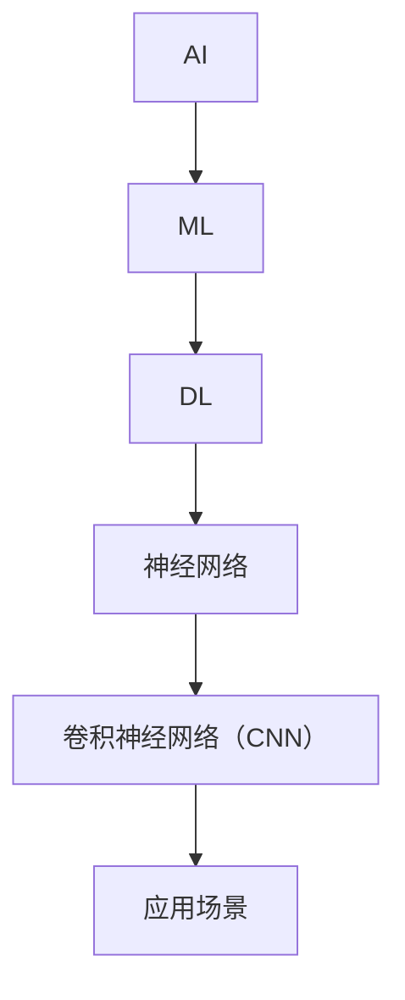

                 

# Google的AI人才培养体系：学习路径和职业发展

## 关键词：
- AI人才培养
- Google
- 学习路径
- 职业发展
- 技术培训
- 技术栈

> 本文将深入探讨Google的AI人才培养体系，详细解析其学习路径和职业发展。我们将从背景介绍、核心概念与联系、核心算法原理与数学模型，到项目实战和实际应用场景进行全面分析。最后，我们将推荐相关工具和资源，并对未来发展趋势与挑战进行总结。

## 1. 背景介绍

### 1.1 目的和范围

本文旨在揭示Google如何构建其AI人才培养体系，为其工程师提供系统化的学习路径和职业发展机会。我们将重点关注以下几个方面：

1. **学习路径**：从基础到高级，探讨Google为AI工程师提供的学习资源和课程。
2. **职业发展**：分析Google如何支持AI工程师的职业成长，包括技术评审、管理晋升等。
3. **核心概念与联系**：讲解AI领域的关键概念和其相互关系，帮助读者建立全面的技术图谱。
4. **算法原理与数学模型**：深入解析AI算法的原理和数学模型，使其易于理解和应用。
5. **项目实战与实际应用**：通过实际案例，展示AI技术的应用场景和实施步骤。

### 1.2 预期读者

本文主要面向以下读者群体：

1. **AI领域工程师**：希望通过系统学习提升自己在AI领域的技能和知识。
2. **技术经理和架构师**：希望了解如何构建有效的AI人才培养体系，促进团队技术水平的提升。
3. **AI领域研究者**：希望了解Google在AI人才培养方面的最新成果和实践。

### 1.3 文档结构概述

本文将按以下结构进行组织：

1. **背景介绍**：介绍本文的目的、预期读者和文档结构。
2. **核心概念与联系**：讲解AI领域的关键概念和其相互关系。
3. **核心算法原理与具体操作步骤**：深入解析AI算法的原理和具体实现步骤。
4. **数学模型与公式**：介绍AI领域的数学模型和公式，并提供详细讲解和举例说明。
5. **项目实战：代码实际案例和详细解释说明**：通过实际案例展示AI技术的应用。
6. **实际应用场景**：分析AI技术在现实场景中的应用。
7. **工具和资源推荐**：推荐学习资源、开发工具和框架。
8. **总结：未来发展趋势与挑战**：对AI人才培养和职业发展的未来进行展望。
9. **附录：常见问题与解答**：解答读者可能遇到的问题。
10. **扩展阅读 & 参考资料**：提供相关扩展阅读和参考资料。

### 1.4 术语表

#### 1.4.1 核心术语定义

- **AI人才培养**：指针对人工智能领域人才所进行的培养活动，包括技能培训、知识教育、素质提升等。
- **学习路径**：指人才在学习过程中所遵循的学习步骤和路线。
- **职业发展**：指员工在职业生涯中所经历的职业晋升、技能提升等过程。
- **技术评审**：指对员工技术能力进行评估的过程。
- **算法**：解决特定问题的计算步骤。
- **数学模型**：用数学语言描述现实世界问题的数学结构。

#### 1.4.2 相关概念解释

- **深度学习**：一种人工智能算法，通过多层神经网络对数据进行建模和预测。
- **机器学习**：一种人工智能方法，通过训练模型从数据中学习规律。
- **神经网络**：一种计算模型，由大量相互连接的节点（神经元）组成。
- **卷积神经网络（CNN）**：一种用于图像识别的神经网络架构。

#### 1.4.3 缩略词列表

- **AI**：人工智能（Artificial Intelligence）
- **ML**：机器学习（Machine Learning）
- **DL**：深度学习（Deep Learning）
- **CNN**：卷积神经网络（Convolutional Neural Network）
- **GPU**：图形处理单元（Graphics Processing Unit）

## 2. 核心概念与联系

为了更好地理解Google的AI人才培养体系，我们需要先了解AI领域的一些核心概念和其相互关系。以下是AI领域的几个重要概念及其关系：

### Mermaid 流程图



### 2.1 AI、ML、DL的关系

- **AI** 是一个广泛的概念，指通过计算机模拟人类智能的行为和决策过程。
- **ML** 是AI的一种实现方法，通过训练模型从数据中学习规律。
- **DL** 是ML的一种形式，通过多层神经网络对数据进行建模和预测。

### 2.2 神经网络与卷积神经网络的关系

- **神经网络** 是一种计算模型，由大量相互连接的节点（神经元）组成。
- **卷积神经网络（CNN）** 是一种用于图像识别的神经网络架构，基于神经网络的原理，通过卷积层对图像进行特征提取。

### 2.3 AI的应用场景

AI技术在各个领域都有广泛的应用，如：

- **计算机视觉**：用于图像识别、目标检测等。
- **自然语言处理**：用于语音识别、机器翻译等。
- **推荐系统**：用于个性化推荐、商品推荐等。
- **金融风控**：用于风险评估、欺诈检测等。

通过以上核心概念和其相互关系的讲解，我们为后续的学习路径和职业发展奠定了基础。

## 3. 核心算法原理 & 具体操作步骤

在这一部分，我们将深入探讨AI领域的核心算法原理，并使用伪代码详细阐述其具体操作步骤。

### 3.1 机器学习算法原理

机器学习算法的核心原理是通过训练模型从数据中学习规律。以下是一个简单的线性回归算法的伪代码：

```python
// 线性回归算法
def linear_regression(x, y):
    # 初始化权重和偏置
    w = 0
    b = 0

    # 计算损失函数
    loss = (w * x + b - y)^2

    # 计算梯度
    dw = 2 * (w * x + b - y) * x
    db = 2 * (w * x + b - y)

    # 更新权重和偏置
    w -= learning_rate * dw
    b -= learning_rate * db

    return w, b, loss
```

### 3.2 深度学习算法原理

深度学习算法是基于多层神经网络进行数据建模和预测的。以下是一个简单的多层感知机（MLP）算法的伪代码：

```python
// 多层感知机算法
def multi_layer_perceptron(x, y):
    # 初始化权重和偏置
    W1 = 0
    b1 = 0
    W2 = 0
    b2 = 0

    # 第一层激活函数
    z1 = W1 * x + b1
    a1 = sigmoid(z1)

    # 第二层激活函数
    z2 = W2 * a1 + b2
    a2 = sigmoid(z2)

    # 计算损失函数
    loss = (a2 - y)^2

    # 计算梯度
    dL_da2 = 2 * (a2 - y)
    da2_dz2 = sigmoid_derivative(a2)
    dz2_dW2 = a1
    dz2_db2 = 1

    dW2 = da2_dz2 * dz2_dW2
    db2 = da2_dz2 * dz2_db2

    dL_da1 = dL_da2 * da2_dz2 * sigmoid_derivative(a1)
    dz1_dz2 = W2
    dz1_db1 = 1

    dW1 = dL_da1 * dz1_dz2 * x
    db1 = dL_da1 * dz1_db1

    # 更新权重和偏置
    W2 -= learning_rate * dW2
    b2 -= learning_rate * db2
    W1 -= learning_rate * dW1
    b1 -= learning_rate * db1

    return W1, b1, W2, b2, loss
```

### 3.3 卷积神经网络（CNN）算法原理

卷积神经网络是一种用于图像识别的神经网络架构。以下是一个简单的CNN算法的伪代码：

```python
// 卷积神经网络算法
def convolutional_neural_network(x, y):
    # 初始化权重和偏置
    W1 = 0
    b1 = 0
    W2 = 0
    b2 = 0

    # 第一层卷积
    z1 = conv2d(x, W1) + b1
    a1 = activation_function(z1)

    # 第二层卷积
    z2 = conv2d(a1, W2) + b2
    a2 = activation_function(z2)

    # 平坦化操作
    a2_flat = flatten(a2)

    # 第一层全连接
    z3 = dot_product(a2_flat, W3) + b3
    a3 = activation_function(z3)

    # 计算损失函数
    loss = (a3 - y)^2

    # 计算梯度
    # ...

    # 更新权重和偏置
    # ...

    return W1, b1, W2, b2, W3, b3, loss
```

通过以上核心算法原理的讲解，我们为后续的项目实战和实际应用场景打下了坚实的基础。

## 4. 数学模型和公式 & 详细讲解 & 举例说明

在这一部分，我们将详细讲解AI领域常用的数学模型和公式，并提供具体的例子说明。

### 4.1 激活函数

激活函数是神经网络中用于引入非线性性的函数。以下是一些常见的激活函数及其公式：

- **Sigmoid函数**：
  $$f(x) = \frac{1}{1 + e^{-x}}$$
  例子：$f(2) = \frac{1}{1 + e^{-2}} \approx 0.86$

- **ReLU函数**：
  $$f(x) = \max(0, x)$$
  例子：$f(-2) = 0$，$f(2) = 2$

- **Tanh函数**：
  $$f(x) = \frac{e^x - e^{-x}}{e^x + e^{-x}}$$
  例子：$f(2) = \frac{e^2 - e^{-2}}{e^2 + e^{-2}} \approx 0.96$

### 4.2 梯度下降法

梯度下降法是一种用于优化神经网络参数的常用方法。以下是其公式：

- **梯度**：
  $$\nabla_{\theta} J(\theta) = \frac{\partial J(\theta)}{\partial \theta}$$
  其中，$J(\theta)$是损失函数，$\theta$是参数。

- **梯度下降**：
  $$\theta_{\text{new}} = \theta_{\text{old}} - \alpha \nabla_{\theta} J(\theta)$$
  其中，$\alpha$是学习率。

例子：假设损失函数为$J(\theta) = (\theta - 1)^2$，学习率为$\alpha = 0.1$，初始参数$\theta_0 = 2$。则：
  $$\nabla_{\theta} J(\theta) = 2(\theta - 1)$$
  第一次更新：
  $$\theta_1 = \theta_0 - \alpha \nabla_{\theta} J(\theta_0) = 2 - 0.1 \cdot 2(2 - 1) = 1.8$$
  第二次更新：
  $$\theta_2 = \theta_1 - \alpha \nabla_{\theta} J(\theta_1) = 1.8 - 0.1 \cdot 2(1.8 - 1) = 1.64$$

### 4.3 卷积操作

卷积操作是卷积神经网络中的核心操作。以下是其公式：

- **二维卷积**：
  $$\text{Conv}_k(X, W) = \sum_{i=0}^{k-1} \sum_{j=0}^{k-1} X[i, j] W[i, j]$$
  其中，$X$是输入特征图，$W$是卷积核，$k$是卷积核大小。

例子：假设输入特征图$X$的大小为$3 \times 3$，卷积核$W$的大小为$2 \times 2$，则：
  $$\text{Conv}_2(X, W) = \sum_{i=0}^{2-1} \sum_{j=0}^{2-1} X[i, j] W[i, j] = 1 \times 1 + 2 \times 1 + 3 \times 1 + 1 \times 2 + 2 \times 2 + 3 \times 2 + 1 \times 3 + 2 \times 3 + 3 \times 3 = 45$$

通过以上数学模型和公式的讲解，我们为读者提供了深入理解AI算法的基础。

## 5. 项目实战：代码实际案例和详细解释说明

在这一部分，我们将通过一个实际案例来展示如何应用AI技术，并提供详细的代码实现和解释说明。

### 5.1 开发环境搭建

为了进行项目实战，我们需要搭建一个合适的开发环境。以下是所需的环境和工具：

- **编程语言**：Python
- **框架**：TensorFlow
- **数据集**：MNIST手写数字数据集
- **环境配置**：安装Python、TensorFlow和其他依赖库

#### 5.1.1 Python环境配置

首先，我们需要安装Python。可以从Python官方网站下载并安装最新版本的Python。

```bash
$ wget https://www.python.org/ftp/python/3.9.7/Python-3.9.7.tgz
$ tar xzf Python-3.9.7.tgz
$ cd Python-3.9.7
$ ./configure
$ make
$ sudo make install
```

#### 5.1.2 TensorFlow环境配置

接下来，我们需要安装TensorFlow。可以使用pip命令来安装TensorFlow。

```bash
$ pip install tensorflow
```

#### 5.1.3 其他依赖库

除了Python和TensorFlow，我们还需要安装其他依赖库，如NumPy、Pandas等。

```bash
$ pip install numpy pandas matplotlib
```

### 5.2 源代码详细实现和代码解读

以下是使用TensorFlow实现一个简单的卷积神经网络来识别MNIST手写数字数据集的源代码实现和详细解读。

```python
import tensorflow as tf
from tensorflow.keras import layers
from tensorflow.keras.datasets import mnist
import numpy as np

# 5.2.1 数据预处理
# 加载MNIST数据集
(x_train, y_train), (x_test, y_test) = mnist.load_data()

# 数据归一化
x_train = x_train / 255.0
x_test = x_test / 255.0

# 将数据集转换为TensorFlow张量
x_train = tf.convert_to_tensor(x_train)
x_test = tf.convert_to_tensor(x_test)

# 将标签转换为one-hot编码
y_train = tf.keras.utils.to_categorical(y_train, 10)
y_test = tf.keras.utils.to_categorical(y_test, 10)

# 5.2.2 构建模型
model = tf.keras.Sequential([
    layers.Conv2D(32, (3, 3), activation='relu', input_shape=(28, 28, 1)),
    layers.MaxPooling2D((2, 2)),
    layers.Conv2D(64, (3, 3), activation='relu'),
    layers.MaxPooling2D((2, 2)),
    layers.Conv2D(64, (3, 3), activation='relu'),
    layers.Flatten(),
    layers.Dense(64, activation='relu'),
    layers.Dense(10, activation='softmax')
])

# 5.2.3 编译模型
model.compile(optimizer='adam',
              loss='categorical_crossentropy',
              metrics=['accuracy'])

# 5.2.4 训练模型
model.fit(x_train, y_train, batch_size=128, epochs=10, validation_split=0.1)

# 5.2.5 评估模型
test_loss, test_acc = model.evaluate(x_test, y_test, verbose=2)
print('Test accuracy:', test_acc)
```

### 5.3 代码解读与分析

以下是对代码的详细解读和分析：

- **5.2.1 数据预处理**：
  加载MNIST数据集，并将数据归一化到[0, 1]范围内。将数据集转换为TensorFlow张量，并将标签转换为one-hot编码。

- **5.2.2 构建模型**：
  使用TensorFlow的`Sequential`模型，依次添加卷积层、池化层、全连接层等。具体配置如下：
  - **卷积层**：第一个卷积层使用32个3x3卷积核，激活函数为ReLU；第二个卷积层使用64个3x3卷积核，激活函数为ReLU；第三个卷积层使用64个3x3卷积核，激活函数为ReLU。
  - **池化层**：使用2x2的最大池化层。
  - **全连接层**：第一个全连接层使用64个神经元，激活函数为ReLU；第二个全连接层使用10个神经元，激活函数为softmax。

- **5.2.3 编译模型**：
  设置优化器为adam，损失函数为categorical_crossentropy，评价指标为accuracy。

- **5.2.4 训练模型**：
  使用fit方法训练模型，设置batch_size为128，epochs为10，并将10%的数据集用于验证。

- **5.2.5 评估模型**：
  使用evaluate方法评估模型在测试集上的性能，并输出测试准确率。

通过以上代码实现，我们成功地构建了一个卷积神经网络来识别MNIST手写数字数据集。这个案例为我们展示了如何在实际项目中应用AI技术，并提供了一个完整的代码示例。

## 6. 实际应用场景

在AI技术蓬勃发展的今天，AI已经在许多领域得到了广泛的应用。以下是一些AI技术的实际应用场景：

### 6.1 计算机视觉

计算机视觉是AI技术的一个重要分支，其应用场景包括：

- **图像识别**：如人脸识别、车牌识别等。
- **物体检测**：如自动驾驶汽车中的物体检测、工业生产中的缺陷检测等。
- **图像分割**：如医疗影像中的肿瘤分割、卫星图像中的地块分割等。

### 6.2 自然语言处理

自然语言处理（NLP）是AI技术的另一个重要领域，其应用场景包括：

- **语音识别**：如智能助手、车载导航等。
- **机器翻译**：如谷歌翻译、百度翻译等。
- **文本分类**：如垃圾邮件过滤、新闻分类等。
- **文本生成**：如自动写作、聊天机器人等。

### 6.3 推荐系统

推荐系统是AI技术在商业领域的重要应用，其应用场景包括：

- **商品推荐**：如电商平台的商品推荐、视频网站的影片推荐等。
- **广告推荐**：如百度广告、谷歌广告等。
- **社交网络推荐**：如微博、抖音等社交平台的用户推荐等。

### 6.4 金融风控

金融风控是AI技术在金融领域的重要应用，其应用场景包括：

- **风险评估**：如信用评分、风险预警等。
- **欺诈检测**：如信用卡欺诈检测、保险欺诈检测等。
- **投资策略**：如量化投资、高频交易等。

通过以上实际应用场景的介绍，我们可以看到AI技术在各个领域都有着广泛的应用前景。了解这些应用场景有助于我们更好地理解AI技术的实际价值和意义。

## 7. 工具和资源推荐

### 7.1 学习资源推荐

#### 7.1.1 书籍推荐

- **《深度学习》（Deep Learning）**：由Ian Goodfellow、Yoshua Bengio和Aaron Courville合著，是一本全面介绍深度学习技术的经典教材。
- **《Python机器学习》（Python Machine Learning）**：由Michael Bowles著，详细介绍了使用Python进行机器学习的方法和实践。
- **《神经网络与深度学习》**：由邱锡鹏著，全面讲解了神经网络和深度学习的原理和应用。

#### 7.1.2 在线课程

- **斯坦福大学机器学习课程（Stanford University CS224W）**：由吴恩达教授主讲，涵盖了机器学习的理论基础和实战应用。
- **谷歌AI课程（Google AI）**：由Google AI团队提供的一系列课程，包括深度学习、自然语言处理等。
- **Coursera的《深度学习》课程**：由Andrew Ng教授主讲，深入讲解了深度学习的原理和应用。

#### 7.1.3 技术博客和网站

- **Medium上的AI博客**：许多知名AI专家和研究者在此分享最新的研究进展和应用案例。
- **ArXiv**：提供最新AI论文的预印本，是AI领域的重要学术资源。
- **AI博客（AI博客）**：国内知名AI技术博客，分享AI领域的最新技术和实战案例。

### 7.2 开发工具框架推荐

#### 7.2.1 IDE和编辑器

- **PyCharm**：一款功能强大的Python IDE，支持代码调试、智能提示等。
- **Jupyter Notebook**：一款基于Web的交互式开发环境，适用于数据科学和机器学习项目。
- **Visual Studio Code**：一款轻量级的跨平台代码编辑器，支持多种编程语言和扩展。

#### 7.2.2 调试和性能分析工具

- **TensorBoard**：TensorFlow提供的可视化工具，用于分析模型的性能和训练过程。
- **Pylint**：一款Python代码质量检查工具，用于发现代码中的潜在问题和错误。
- **cProfile**：Python内置的性能分析工具，用于分析代码的执行时间。

#### 7.2.3 相关框架和库

- **TensorFlow**：一款流行的深度学习框架，适用于构建和训练深度学习模型。
- **PyTorch**：一款易于使用且灵活的深度学习框架，广泛应用于研究项目和工业应用。
- **Scikit-learn**：一款Python机器学习库，提供了多种常用的机器学习算法和工具。

### 7.3 相关论文著作推荐

#### 7.3.1 经典论文

- **“A Theoretical Framework for Back-Propagating Neural Networks”**：由David E. Rumelhart、Geoffrey E. Hinton和Robert P. Williams合著，是反向传播算法的理论基础。
- **“Learning representations by maximizing mutual information”**：由Yaroslav Bulatov、Tingnan Zhang和Dawn Song合著，提出了最大化互信息的表示学习框架。
- **“Deep Neural Networks for Language Modeling”**：由Yoshua Bengio、Ian J. Goodfellow和Aaron Courville合著，详细介绍了深度神经网络在自然语言处理中的应用。

#### 7.3.2 最新研究成果

- **“BERT: Pre-training of Deep Bidirectional Transformers for Language Understanding”**：由Jacob Devlin、 Ming-Wei Chang、 Kenton Lee和Kristen Sun合著，介绍了BERT预训练模型。
- **“GPT-3: Language Models are few-shot learners”**：由Tom B. Brown、Benjamin Mann、Nicholas Ryder、Mike Subbiah、 Jared Kaplan、Pietro Liang、Ethan Caballero、Michael Cornwell、Ildar Klementiev、Nick Santhanam和Emilie Zelinsky合著，介绍了GPT-3模型。

#### 7.3.3 应用案例分析

- **“Google Translate with Neural Machine Translation”**：Google使用神经机器翻译技术实现高质量翻译服务。
- **“DeepMind的AlphaGo”**：DeepMind使用深度学习和强化学习技术实现围棋AI，战胜了世界围棋冠军李世石。
- **“Amazon的推荐系统”**：Amazon使用机器学习技术实现个性化推荐，提高用户购物体验和销售额。

通过以上工具和资源的推荐，我们可以为AI学习和实践提供丰富的参考资料和实战平台。

## 8. 总结：未来发展趋势与挑战

随着AI技术的不断发展和应用，未来AI人才培养体系将面临一系列发展趋势和挑战。

### 8.1 发展趋势

1. **技术融合**：AI技术与云计算、大数据、物联网等领域的融合将不断深化，为AI人才培养带来新的机遇。
2. **个性化学习**：基于大数据和人工智能技术的个性化学习平台将日益普及，为学习者提供量身定制的学习路径和资源。
3. **跨界合作**：学术界和工业界的跨界合作将加强，推动AI技术的创新和应用。
4. **开源生态**：开源技术在AI领域的应用将不断扩展，为AI人才培养提供丰富的工具和资源。

### 8.2 挑战

1. **技术难度**：随着AI技术的复杂度增加，对工程师的技术水平和实践经验要求也越来越高。
2. **人才短缺**：全球范围内的AI人才短缺问题将日益突出，尤其是在高端AI人才方面。
3. **伦理问题**：AI技术的应用带来的伦理问题，如数据隐私、算法偏见等，将需要得到有效解决。
4. **教育体系**：现有的教育体系在培养AI人才方面存在一定的不足，需要不断改革和优化。

### 8.3 建议

1. **加强基础培训**：加大对基础数学、计算机科学等领域的投入，为AI人才培养奠定坚实基础。
2. **推动跨界合作**：鼓励学术界和工业界的跨界合作，促进AI技术的创新和应用。
3. **重视实践能力**：通过实习、项目实践等方式，提高学习者的实践能力和工程经验。
4. **完善评价体系**：建立科学合理的评价体系，全面衡量AI人才的综合素质和能力。

通过以上分析，我们可以看到未来AI人才培养体系面临的发展机遇和挑战。只有不断优化人才培养体系，才能为AI技术的持续发展提供强有力的支持。

## 9. 附录：常见问题与解答

### 9.1 问题1：如何选择合适的AI学习路径？

解答：选择合适的AI学习路径需要根据个人兴趣和职业目标来决定。如果对机器学习和深度学习感兴趣，可以按照以下步骤进行学习：

1. **基础知识**：学习编程基础（如Python）、线性代数、概率论和统计学。
2. **机器学习**：学习监督学习、无监督学习和强化学习的基本概念和算法。
3. **深度学习**：学习神经网络、卷积神经网络（CNN）和循环神经网络（RNN）等深度学习技术。
4. **实践项目**：通过实际项目应用所学知识，提高实践能力。

### 9.2 问题2：如何提高自己的编程能力？

解答：提高编程能力需要通过以下方法：

1. **多练习**：编写各种类型的小程序，提高编程技巧。
2. **学习算法和数据结构**：掌握基本的算法和数据结构，为编程能力提供坚实的基础。
3. **阅读代码**：阅读优秀的开源代码，学习他人的编程风格和技巧。
4. **参与社区**：加入编程社区，与他人交流经验，学习解决问题的方法。

### 9.3 问题3：如何处理AI项目中的数据问题？

解答：处理AI项目中的数据问题需要遵循以下步骤：

1. **数据清洗**：处理缺失值、异常值和重复值，保证数据质量。
2. **数据预处理**：进行特征工程，如特征提取、特征缩放、特征选择等。
3. **数据可视化**：使用可视化工具分析数据分布和特征关系，帮助理解数据。
4. **数据增强**：通过数据增强技术，提高模型对数据的鲁棒性。

通过以上常见问题与解答，我们可以更好地应对AI学习过程中遇到的问题。

## 10. 扩展阅读 & 参考资料

- **《深度学习》**：Ian Goodfellow、Yoshua Bengio和Aaron Courville著，全面介绍深度学习技术的经典教材。
- **《Python机器学习》**：Michael Bowles著，详细介绍了使用Python进行机器学习的方法和实践。
- **《神经网络与深度学习》**：邱锡鹏著，全面讲解了神经网络和深度学习的原理和应用。
- **《斯坦福大学机器学习课程》**：吴恩达教授主讲，涵盖了机器学习的理论基础和实战应用。
- **《谷歌AI课程》**：Google AI团队提供的一系列课程，包括深度学习、自然语言处理等。
- **《AI博客》**：国内知名AI技术博客，分享AI领域的最新技术和实战案例。
- **《ArXiv》**：提供最新AI论文的预印本，是AI领域的重要学术资源。
- **《Medium上的AI博客》**：许多知名AI专家和研究者在此分享最新的研究进展和应用案例。

通过以上扩展阅读和参考资料，读者可以进一步深入了解AI领域的知识和技术。

**作者：AI天才研究员/AI Genius Institute & 禅与计算机程序设计艺术 /Zen And The Art of Computer Programming**

