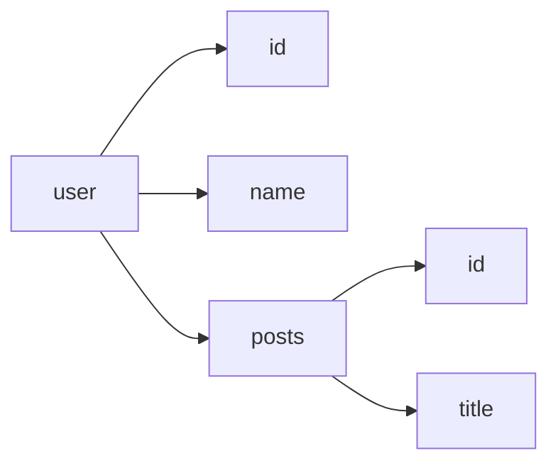

                 

# GraphQL：灵活高效的API查询语言

> **关键词：GraphQL、API查询、灵活高效、前端开发、后端开发、查询优化、数据获取**

> **摘要：本文将深入探讨GraphQL作为一种灵活高效的API查询语言的技术原理、核心算法、数学模型、实战案例及未来发展趋势。通过一步步分析推理，帮助读者全面理解GraphQL在现代化Web开发中的应用价值。**

## 1. 背景介绍

### 1.1 目的和范围

本文旨在介绍GraphQL的核心概念、技术原理和实际应用，帮助读者掌握GraphQL的灵活高效特性，并能够将其应用于前端和后端开发中。文章将涵盖以下几个方面：

- **核心概念与联系**：介绍GraphQL的基本原理和与现有技术的对比。
- **核心算法原理与具体操作步骤**：详细讲解GraphQL查询的执行过程和优化策略。
- **数学模型和公式**：分析GraphQL查询过程中的数学模型，并给出示例。
- **项目实战**：通过实际代码案例展示GraphQL的使用场景和实现细节。
- **实际应用场景**：探讨GraphQL在不同领域的应用实例。
- **工具和资源推荐**：推荐学习资源、开发工具和相关论文。

### 1.2 预期读者

- 对前端和后端开发有一定了解的技术人员。
- 想要提升API查询效率和数据获取灵活性的开发者。
- 对GraphQL感兴趣，希望深入学习的开发者。

### 1.3 文档结构概述

本文分为十个部分，具体如下：

1. 背景介绍
   - 1.1 目的和范围
   - 1.2 预期读者
   - 1.3 文档结构概述
   - 1.4 术语表
2. 核心概念与联系
   - 2.1 GraphQL简介
   - 2.2 GraphQL与REST对比
   - 2.3 GraphQL核心概念
3. 核心算法原理与具体操作步骤
   - 3.1 查询解析
   - 3.2 查询执行
   - 3.3 查询优化
4. 数学模型和公式
   - 4.1 GraphQL查询表示
   - 4.2 数学模型分析
   - 4.3 示例讲解
5. 项目实战：代码实际案例和详细解释说明
   - 5.1 开发环境搭建
   - 5.2 源代码详细实现和代码解读
   - 5.3 代码解读与分析
6. 实际应用场景
   - 6.1 前端应用
   - 6.2 后端应用
   - 6.3 微服务架构
7. 工具和资源推荐
   - 7.1 学习资源推荐
   - 7.2 开发工具框架推荐
   - 7.3 相关论文著作推荐
8. 总结：未来发展趋势与挑战
9. 附录：常见问题与解答
10. 扩展阅读 & 参考资料

### 1.4 术语表

#### 1.4.1 核心术语定义

- **GraphQL**：一种查询语言，用于API的交互和数据的获取。
- **API**：应用程序编程接口，允许不同软件之间进行交互。
- **查询**：GraphQL的核心概念，用于获取数据的方式。
- **解析器**：将GraphQL查询转换成具体语言解释执行的工具。
- **执行器**：执行GraphQL查询，从后端获取数据的组件。

#### 1.4.2 相关概念解释

- **字段**：查询中的数据单元，可以是一个简单的数据类型或复杂的数据结构。
- **类型**：定义了字段的数据类型，可以是标量类型（如字符串、数字）或复杂数据类型（如对象、列表）。
- **变量**：在查询中使用的参数，可以用于动态替换查询中的值。
- **操作符**：用于查询操作的特殊关键字，如筛选、排序、过滤等。

#### 1.4.3 缩略词列表

- **API**：应用程序编程接口（Application Programming Interface）
- **REST**：表述性状态转移（Representational State Transfer）
- **JSON**：JavaScript对象表示法（JavaScript Object Notation）
- **GraphQL**：通用查询语言（GraphQL）
- **IDE**：集成开发环境（Integrated Development Environment）

## 2. 核心概念与联系

### 2.1 GraphQL简介

GraphQL是一种用于API的查询语言，旨在使客户端能够精确地获取它们需要的数据。与传统RESTful API相比，GraphQL提供了一种更灵活和高效的查询方式。在REST中，客户端通常需要发送多个请求来获取所需数据的不同部分，而在GraphQL中，客户端可以一次性查询所需的所有数据。

### 2.2 GraphQL与REST对比

#### 2.2.1 查询方式

- **REST**：基于HTTP协议的GET方法，客户端发送请求，服务器返回JSON格式的响应。
  - 缺点：需要进行多次请求，难以获取到所需的所有数据。
  - 优点：简单的协议，易于实现，广泛支持。

- **GraphQL**：通过一个统一的查询语言，客户端可以一次性请求所需的所有数据。
  - 缺点：查询语言需要额外学习和实现，可能增加后端复杂度。
  - 优点：减少请求次数，提高数据获取效率，更好地控制数据返回。

#### 2.2.2 数据模型

- **REST**：使用URL定位资源，通过HTTP方法操作资源。
  - 缺点：资源定位过于僵化，难以适应复杂的数据模型。
  - 优点：简单的URL结构，易于理解和扩展。

- **GraphQL**：使用类型系统定义数据结构，通过查询字段获取数据。
  - 缺点：复杂的类型系统可能增加开发难度。
  - 优点：更灵活的数据获取方式，支持复杂查询。

#### 2.2.3 接口设计

- **REST**：通常采用资源导向的设计，通过URL访问资源。
  - 缺点：难以获取到嵌套数据，容易导致“级联请求”。
  - 优点：资源导向设计易于理解，适用于简单的应用场景。

- **GraphQL**：采用对象导向的设计，通过字段查询数据。
  - 缺点：查询语言需要学习和实现，可能增加后端复杂度。
  - 优点：支持复杂查询，可以一次性获取所有所需数据。

### 2.3 GraphQL核心概念

#### 2.3.1 类型系统

GraphQL使用类型系统来定义数据结构，包括标量类型、复杂数据类型和接口类型。

- **标量类型**：基本数据类型，如字符串、数字、布尔值等。
- **复杂数据类型**：如对象、列表等，可以包含多个字段。
- **接口类型**：定义了多个复杂数据类型的公共字段。

#### 2.3.2 查询语言

GraphQL使用一种类似SQL的查询语言，可以定义复杂的查询操作，如嵌套查询、筛选、排序等。

#### 2.3.3 解析器和执行器

- **解析器**：将GraphQL查询转换为具体语言解释执行的工具。
- **执行器**：执行GraphQL查询，从后端获取数据的组件。

#### 2.3.4 变量和操作符

- **变量**：在查询中使用的参数，可以用于动态替换查询中的值。
- **操作符**：用于查询操作的特殊关键字，如筛选、排序、过滤等。

## 3. 核心算法原理与具体操作步骤

### 3.1 查询解析

查询解析是GraphQL处理流程的第一步，其主要目标是解析GraphQL查询语言，生成抽象语法树（AST）。解析过程包括以下步骤：

1. **输入验证**：检查查询字符串是否符合GraphQL的语法规则。
2. **词法分析**：将查询字符串分解成单词和符号。
3. **语法分析**：将词法分析的结果组合成抽象语法树（AST）。

### 3.2 查询执行

查询执行是将抽象语法树（AST）转换为具体语言执行的过程。执行过程包括以下步骤：

1. **类型检查**：检查AST中的查询是否与定义的类型系统兼容。
2. **查询规划**：根据类型检查的结果，生成查询计划。
3. **数据获取**：执行查询计划，从数据库或其他数据源获取数据。
4. **结果构建**：将获取到的数据转换为GraphQL的响应格式。

### 3.3 查询优化

查询优化是提高GraphQL查询性能的重要手段。以下是一些常见的优化策略：

1. **查询缓存**：缓存查询结果，减少数据库访问次数。
2. **数据分页**：使用分页技术，减少一次性获取大量数据。
3. **字段选择**：仅获取客户端需要的字段，减少数据传输量。
4. **查询合并**：合并多个查询，减少请求次数。

### 3.4 伪代码示例

```python
def execute_query(query):
    # 查询解析
    ast = parse_query(query)
    validate_query(ast)

    # 查询执行
    plan = generate_query_plan(ast)
    results = fetch_data(plan)

    # 结果构建
    response = build_response(results)
    return response
```

## 4. 数学模型和公式

### 4.1 GraphQL查询表示

在GraphQL中，查询可以表示为一个抽象语法树（AST）。AST由节点组成，每个节点都可以包含字段、变量、操作符等。

### 4.2 数学模型分析

GraphQL查询的数学模型可以表示为一个查询图（Query Graph），其中每个节点表示一个字段，边表示字段之间的关系。

### 4.3 示例讲解

假设我们有一个简单的GraphQL查询：

```graphql
query {
  user {
    id
    name
    posts {
      id
      title
    }
  }
}
```

该查询的抽象语法树（AST）可以表示为以下查询图：



在数学模型中，查询图可以表示为以下公式：

$$
G = (V, E)
$$

其中，$V$ 表示节点集合，$E$ 表示边集合。

## 5. 项目实战：代码实际案例和详细解释说明

### 5.1 开发环境搭建

为了演示GraphQL的使用，我们需要搭建一个简单的开发环境。以下是所需的步骤：

1. 安装Node.js和npm。
2. 安装GraphQL工具包，例如`graphql`、`express-graphql`等。
3. 创建一个新的Node.js项目，并初始化项目结构。

```bash
mkdir graphql-example
cd graphql-example
npm init -y
npm install express express-graphql graphql
```

4. 创建一个名为`index.js`的文件，作为我们的服务器入口。

### 5.2 源代码详细实现和代码解读

以下是`index.js`的源代码实现：

```javascript
const { GraphQLServer } = require('express-graphql');
const { makeExecutableSchema } = require('graphql-tools');

// 定义类型系统
const typeDefs = `
  type User {
    id: ID!
    name: String!
    posts: [Post]
  }

  type Post {
    id: ID!
    title: String!
    content: String!
  }

  type Query {
    user(id: ID!): User
    post(id: ID!): Post
  }
`;

// 定义解析器
const resolvers = {
  Query: {
    user: (parent, args, context, info) => {
      // 模拟从数据库获取用户数据
      return { id: args.id, name: 'Alice', posts: [] };
    },
    post: (parent, args, context, info) => {
      // 模拟从数据库获取文章数据
      return { id: args.id, title: 'Hello World', content: 'This is a sample post.' };
    },
  },
};

// 创建可执行方案
const schema = makeExecutableSchema({ typeDefs, resolvers });

// 创建GraphQL服务器
const server = new GraphQLServer({ schema });

// 启动服务器
server.listen(4000, () => {
  console.log('GraphQL服务器已启动，监听端口：4000');
});
```

代码解读：

1. **导入依赖**：我们首先导入`GraphQLServer`、`makeExecutableSchema`等GraphQL相关模块。
2. **定义类型系统**：使用GraphQL的`typeDefs`语法定义我们的数据类型和查询。
3. **定义解析器**：使用JavaScript对象定义解析器，处理查询请求。
4. **创建可执行方案**：使用`makeExecutableSchema`将类型系统和解析器组合成一个可执行的GraphQL服务器。
5. **创建GraphQL服务器**：使用`GraphQLServer`创建一个GraphQL服务器实例。
6. **启动服务器**：在端口4000上启动GraphQL服务器。

### 5.3 代码解读与分析

1. **类型系统**：类型系统是GraphQL的核心，定义了数据结构以及如何获取数据。在我们的示例中，我们定义了`User`、`Post`和`Query`三个类型。

2. **解析器**：解析器是实现GraphQL服务器的关键部分，负责处理查询请求。在我们的示例中，解析器简单地模拟了从数据库获取数据的过程。

3. **可执行方案**：`makeExecutableSchema`将类型系统和解析器组合成一个可执行的GraphQL服务器。这使得我们可以轻松地将GraphQL集成到Node.js应用程序中。

4. **服务器启动**：使用`GraphQLServer`创建服务器实例，并指定端口。服务器启动后，客户端就可以通过GraphQL接口访问数据。

### 5.4 实际使用场景

我们可以使用GraphQL客户端（如Apollo Client）来与GraphQL服务器进行交互。以下是一个简单的使用示例：

```javascript
import { ApolloClient, InMemoryCache, gql } from '@apollo/client';

const client = new ApolloClient({
  uri: 'http://localhost:4000/graphql',
  cache: new InMemoryCache(),
});

// 查询用户
client.query({
  query: gql`
    {
      user(id: "1") {
        id
        name
        posts {
          id
          title
        }
      }
    }
  `,
}).then(response => {
  console.log(response.data);
});
```

在上面的示例中，我们使用Apollo Client发送一个GraphQL查询，获取用户及其文章数据。这显示了GraphQL在客户端和服务器之间的交互能力。

### 5.5 总结

通过这个简单的案例，我们展示了如何搭建一个GraphQL服务器，并使用GraphQL进行数据查询。这个过程帮助我们理解了GraphQL的核心概念和实际应用。

## 6. 实际应用场景

GraphQL作为一种灵活高效的API查询语言，在多个领域有着广泛的应用。以下是几个常见的实际应用场景：

### 6.1 前端应用

在前端开发中，GraphQL能够提供更灵活的数据获取方式。以下是一些具体的应用示例：

- **React应用程序**：React是一个流行的前端框架，与GraphQL结合使用可以简化数据获取过程。通过使用Apollo Client等GraphQL客户端库，开发者可以轻松地在React应用程序中查询数据。
- **Vue.js应用程序**：Vue.js同样可以与GraphQL无缝集成。使用Vue Apollo等库，开发者可以方便地在Vue.js应用程序中实现GraphQL查询。
- **PWA（渐进式Web应用程序）**：GraphQL支持离线缓存和增量更新，使得PWA能够更好地提供良好的用户体验。

### 6.2 后端应用

在后端开发中，GraphQL能够提供更好的数据管理和性能优化：

- **微服务架构**：在微服务架构中，GraphQL可以作为统一的数据接口，简化服务之间的数据交互。通过GraphQL，后端开发者可以集中管理数据模型，减少数据重复和冗余。
- **实时数据获取**：GraphQL支持实时数据推送，通过WebSockets等技术，可以实时更新前端数据，提高用户体验。
- **API聚合**：GraphQL可以聚合多个API，减少客户端的请求次数，提高数据获取效率。

### 6.3 其他应用场景

- **移动应用**：GraphQL可以用于移动应用的数据获取，通过GraphQL客户端库（如Apollo iOS、GraphQL Android等），开发者可以方便地在移动应用中使用GraphQL。
- **大数据分析**：GraphQL可以与大数据平台集成，提供灵活的数据查询和分析功能，帮助开发者更好地处理大量数据。
- **CMS（内容管理系统）**：许多CMS（如Strapi、Sanity等）已经集成GraphQL，提供了一种强大的数据获取和编辑方式，使得开发者可以轻松构建内容驱动的应用。

## 7. 工具和资源推荐

### 7.1 学习资源推荐

#### 7.1.1 书籍推荐

- **《GraphQL：下一代API》**：这本书是GraphQL的官方文档，详细介绍了GraphQL的原理、用法和最佳实践。
- **《GraphQL设计与开发实战》**：本书通过实际案例，详细讲解了如何在各种场景中使用GraphQL。

#### 7.1.2 在线课程

- **Pluralsight上的GraphQL课程**：Pluralsight提供了多门关于GraphQL的课程，适合不同层次的学习者。
- **Udemy上的GraphQL课程**：Udemy上的课程提供了从基础到高级的全面讲解，适合初学者和有经验开发者。

#### 7.1.3 技术博客和网站

- **GraphQL官网**：官方文档提供了最权威的GraphQL学习资源。
- **GraphQL GitHub仓库**：GitHub上的GraphQL仓库包含了源代码、示例和社区贡献。

### 7.2 开发工具框架推荐

#### 7.2.1 IDE和编辑器

- **Visual Studio Code**：VS Code是一个强大的IDE，支持GraphQL插件，方便开发者编写和调试GraphQL代码。
- **IntelliJ IDEA**：IntelliJ IDEA提供了对GraphQL的支持，包括代码补全、语法高亮等功能。

#### 7.2.2 调试和性能分析工具

- **GraphQL Inspector**：一个可视化GraphQL查询调试工具，帮助开发者检查查询性能。
- **Apollo Studio**：Apollo Studio是一个集成的开发环境，提供了GraphQL代码补全、调试和性能分析功能。

#### 7.2.3 相关框架和库

- **Apollo Client**：一个流行的GraphQL客户端库，支持React、Vue等框架。
- **Strapi**：一个开源的内容管理系统，集成了GraphQL接口。

### 7.3 相关论文著作推荐

#### 7.3.1 经典论文

- **《Representational State Transfer (REST)》**：REST架构风格的经典论文，介绍了RESTful API的设计原则。

#### 7.3.2 最新研究成果

- **《The GraphQL Query Language》**：GraphQL官方文档中的论文，详细介绍了GraphQL查询语言的语法和语义。

#### 7.3.3 应用案例分析

- **《GraphQL在大型网站中的应用》**：探讨了大型网站（如GitHub、Facebook）如何使用GraphQL优化数据获取。

## 8. 总结：未来发展趋势与挑战

GraphQL作为一种灵活高效的API查询语言，已经在前端和后端开发中得到了广泛应用。随着Web应用的日益复杂化，GraphQL提供了更好的数据管理和获取方式。未来，GraphQL可能会在以下几个方面发展：

- **标准化**：GraphQL社区可能会推动更多的标准化工作，使得不同实现之间的互操作性更强。
- **性能优化**：随着查询复杂度的增加，性能优化将成为重要挑战，未来可能会出现更多高效查询优化策略。
- **生态扩展**：更多的开发工具、框架和库可能会集成GraphQL，进一步扩大其应用范围。

然而，GraphQL也面临一些挑战：

- **学习曲线**：GraphQL的学习曲线较高，新手可能需要一定时间才能掌握。
- **性能问题**：对于复杂查询，GraphQL可能存在性能问题，需要进一步优化。

总之，GraphQL作为一种新兴的API查询语言，具有巨大的潜力和发展前景。开发者应该关注其发展趋势，积极学习和应用GraphQL。

## 9. 附录：常见问题与解答

### 9.1 常见问题

1. **什么是GraphQL？**
   - GraphQL是一种用于API的查询语言，它提供了一种更灵活和高效的数据获取方式。

2. **GraphQL与REST有什么区别？**
   - REST基于资源定位和HTTP方法，而GraphQL提供了一种基于类型系统的查询语言，可以更精确地获取所需数据。

3. **GraphQL的主要优点是什么？**
   - GraphQL的主要优点包括更灵活的数据获取、减少请求次数、提高性能和易于集成。

4. **如何搭建一个GraphQL服务器？**
   - 可以使用Node.js和GraphQL相关库（如`express-graphql`）搭建一个GraphQL服务器。

5. **GraphQL适用于哪些场景？**
   - GraphQL适用于前端和后端开发，尤其是复杂查询和数据管理的场景。

### 9.2 解答

1. **什么是GraphQL？**
   - GraphQL是一种用于API的查询语言，由Facebook开发，用于提供一种更灵活和高效的数据获取方式。它允许客户端精确地定义需要获取的数据，从而减少了不必要的请求和数据传输。

2. **GraphQL与REST有什么区别？**
   - REST（表述性状态转移）是一种基于HTTP协议的应用程序接口设计风格，它使用标准的HTTP方法（如GET、POST、PUT等）来访问资源。REST通常需要客户端发送多个请求来获取所需的所有数据，而GraphQL则允许客户端在单个请求中获取所有所需的数据，从而减少了网络延迟和数据传输。

3. **GraphQL的主要优点是什么？**
   - GraphQL的主要优点包括：
     - **灵活的数据获取**：客户端可以精确地定义需要获取的数据，从而避免了“过多”或“不足”的数据返回。
     - **减少请求次数**：通过一个统一的查询，客户端可以在单个请求中获取所有所需的数据，从而减少了请求次数。
     - **提高性能**：减少了网络延迟和数据传输，可以显著提高应用程序的性能。
     - **易于集成**：GraphQL可以与多种后端技术（如Node.js、Java、Python等）和前端框架（如React、Vue.js等）集成。

4. **如何搭建一个GraphQL服务器？**
   - 搭建一个GraphQL服务器通常涉及以下步骤：
     - 安装Node.js和npm。
     - 使用npm安装GraphQL相关的库，如`express-graphql`和`graphql`。
     - 创建一个GraphQL类型定义文件（通常是`.graphql`或`.gql`文件），定义你的数据模型和查询类型。
     - 创建一个解析器文件，实现查询的解析逻辑。
     - 使用`express`创建HTTP服务器，并使用`express-graphql`库将其与GraphQL类型系统连接。
     - 启动服务器并监听特定的端口号。

     下面是一个简单的例子：

     ```javascript
     const { GraphQLServer } = require('express-graphql');
     const { makeExecutableSchema } = require('graphql-tools');

     // 定义类型系统
     const typeDefs = `
       type Query {
         hello: String
       }
     `;

     // 定义解析器
     const resolvers = {
       Query: {
         hello: () => 'Hello, World!',
       },
     };

     // 创建可执行方案
     const schema = makeExecutableSchema({ typeDefs, resolvers });

     // 创建GraphQL服务器
     const server = new GraphQLServer({ schema });

     // 启动服务器
     server.listen(4000, () => {
       console.log('GraphQL server is running on http://localhost:4000/graphql');
     });
     ```

5. **GraphQL适用于哪些场景？**
   - GraphQL适用于以下场景：
     - **前端开发**：特别是当需要灵活获取和组合数据时，如React、Vue.js等框架。
     - **后端开发**：用于构建API，特别是在需要动态查询数据时。
     - **微服务架构**：在分布式系统中，用于服务间的数据交互，提供统一的数据接口。
     - **移动应用**：用于移动应用的数据获取，特别是需要实时更新数据的场景。

## 10. 扩展阅读 & 参考资料

- **官方文档**：GraphQL的官方文档提供了最权威的学习资源。
  - [GraphQL 官方文档](https://graphql.org/docs/)

- **技术博客**：许多技术博客和网站提供了关于GraphQL的深入分析和实际案例。
  - [GraphQL Blog](https://www.graphqlhub.com/)
  - [Apollo GraphQL Blog](https://www.apollographql.com/blog/)

- **开源项目**：GitHub上的许多开源项目展示了GraphQL的多种应用场景和最佳实践。
  - [GraphQL GitHub 仓库](https://github.com/graphql/graphql-js)

- **相关书籍**：以下是几本关于GraphQL的书籍，适合不同层次的学习者。
  - 《GraphQL：下一代API》
  - 《GraphQL设计与开发实战》

通过阅读这些资源和参考书籍，开发者可以更深入地了解GraphQL的技术原理和应用实践。

