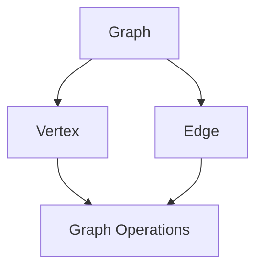
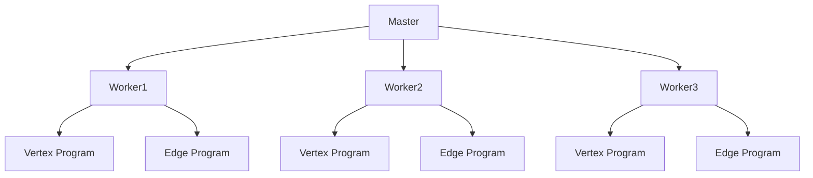

                 

# GraphX原理与代码实例讲解

> 关键词：GraphX、分布式图处理、图算法、Spark、性能优化

> 摘要：本文将深入讲解GraphX的核心原理和代码实例，从背景介绍到具体操作步骤，再到数学模型和应用场景，全方位剖析GraphX的性能优化方法和实际应用。文章旨在为对分布式图处理有浓厚兴趣的读者提供一份系统、详实的参考资料。

## 1. 背景介绍

### 1.1 目的和范围

本文的目标是详细解析GraphX，一个用于大规模分布式图处理的框架。我们将从GraphX的基础概念讲起，逐步深入其内部原理和算法实现，并通过具体代码实例展示其在实际应用中的效果。

文章将涵盖以下内容：

1. GraphX的背景和核心概念。
2. GraphX的架构和组件。
3. GraphX核心算法原理与具体操作步骤。
4. GraphX数学模型和公式讲解。
5. 项目实战：代码实际案例和详细解释。
6. GraphX在实际应用场景中的表现。
7. 工具和资源推荐。
8. 总结：未来发展趋势与挑战。

### 1.2 预期读者

本文适合以下读者群体：

- 对分布式图处理有初步了解的技术人员。
- 想要深入学习GraphX框架的程序员和工程师。
- 计算机图形学、数据挖掘、机器学习等领域的研究人员。
- 对大数据处理和性能优化有兴趣的学者和学生。

### 1.3 文档结构概述

本文分为十个部分，结构如下：

1. **背景介绍**：包括目的和范围、预期读者、文档结构概述等。
2. **核心概念与联系**：介绍GraphX的核心概念和原理，附上Mermaid流程图。
3. **核心算法原理 & 具体操作步骤**：讲解GraphX的核心算法原理，使用伪代码详细阐述。
4. **数学模型和公式 & 详细讲解 & 举例说明**：解释GraphX中的数学模型，使用LaTeX格式展示。
5. **项目实战：代码实际案例和详细解释说明**：通过代码实例展示GraphX的实际应用。
6. **实际应用场景**：分析GraphX在不同场景下的应用。
7. **工具和资源推荐**：推荐学习资源和开发工具。
8. **总结：未来发展趋势与挑战**：对GraphX的发展进行展望。
9. **附录：常见问题与解答**：解答读者可能遇到的问题。
10. **扩展阅读 & 参考资料**：提供进一步学习的参考资料。

### 1.4 术语表

#### 1.4.1 核心术语定义

- **GraphX**：一个基于Spark的分布式图处理框架，用于处理大规模图数据。
- **图数据**：由节点和边组成的数据结构，表示实体及其之间的关系。
- **图算法**：对图数据执行的计算过程，用于分析、推理和解决问题。
- **Spark**：一个快速通用的分布式计算引擎，GraphX是基于Spark开发的。

#### 1.4.2 相关概念解释

- **分布式计算**：将计算任务分布在多个节点上执行，以提高处理速度和效率。
- **并行处理**：同时执行多个计算任务，提高数据处理能力。
- **图论**：研究图及其性质、结构和应用的数学分支。

#### 1.4.3 缩略词列表

- **GraphX**：Graphical eXpressive System
- **Spark**：Simple Application Platform as a Service Kernel

## 2. 核心概念与联系

### 2.1 GraphX的核心概念

GraphX是一个基于Spark的分布式图处理框架，其主要目标是提供高效、可扩展的图算法实现。在GraphX中，图由两个主要组件构成：**节点**和**边**。

- **节点**：图中的基本元素，表示实体或数据点。
- **边**：连接两个节点的元素，表示节点之间的关系。

### 2.2 GraphX的架构和组件

GraphX的架构由以下几个关键组件构成：

1. **Graph**：表示图数据结构，包含节点和边。
2. **Vertex**：表示图的节点，包含属性数据。
3. **Edge**：表示图的边，包含属性数据。
4. **Graph Operations**：提供图的增删查改操作，如V（节点操作）、E（边操作）。
5. **Pregel API**：GraphX提供的一个基于Pregel模型的图处理框架，用于执行图算法。

### 2.3 GraphX与Spark的关系

GraphX是基于Spark开发的，利用Spark的分布式计算能力来处理大规模图数据。GraphX与Spark的关系可以概括为：

- **Spark**：提供底层计算引擎和分布式存储。
- **GraphX**：在Spark的基础上添加了图处理功能，提供高效的图算法实现。

### 2.4 Mermaid流程图

以下是一个Mermaid流程图，展示了GraphX的核心概念和架构组件：



在这个流程图中，Graph、Vertex和Edge是GraphX的核心概念，Graph Operations提供了图的增删查改操作。

### 2.5 GraphX与Pregel API的关系

GraphX提供了一个Pregel API，这是一个基于图的并行处理模型，用于执行复杂的图算法。Pregel API的主要组成部分包括：

- **Master**：负责初始化和协调整个图处理过程。
- **Worker**：在分布式计算节点上执行具体计算任务。
- **Vertex Program**：定义节点的计算逻辑，包括消息传递和处理。
- **Edge Program**：定义边的计算逻辑，包括消息传递和处理。

Pregel API的关系可以用以下Mermaid流程图表示：



在这个流程图中，Master负责协调各Worker节点的计算任务，Vertex Program和Edge Program分别定义节点的计算逻辑和边的计算逻辑。

### 2.6 GraphX的核心算法

GraphX提供了一系列核心算法，用于分析和处理大规模图数据。以下是几个主要的图算法：

1. **PageRank**：用于计算节点的重要性，基于节点间链接的传递性质。
2. **Connected Components**：用于检测图的连通分量，确定节点间的连通关系。
3. **Shortest Paths**：用于计算图中节点之间的最短路径。
4. **Community Detection**：用于识别图中的社区结构，分析节点间的相似性。

这些算法的实现基于Pregel API，通过分布式计算和并行处理提高处理速度和效率。

### 2.7 总结

GraphX是一个基于Spark的分布式图处理框架，提供了高效的图算法实现和丰富的API接口。通过上述核心概念和架构组件的介绍，读者可以对GraphX有一个初步的了解，为后续章节的深入讲解打下基础。

## 3. 核心算法原理 & 具体操作步骤

### 3.1 PageRank算法原理

PageRank是一种基于链接分析的排序算法，用于计算网页的重要性。在GraphX中，PageRank算法可以应用于大规模图数据，以评估节点的重要性。以下是PageRank算法的基本原理和步骤：

#### 3.1.1 基本原理

PageRank算法的核心思想是，一个网页的重要性取决于指向该网页的其他网页的数量和质量。具有更多高质量链接的网页被认为更重要。PageRank算法通过迭代计算，逐步优化每个节点的排名。

#### 3.1.2 算法步骤

1. **初始化**：初始化每个节点的排名（rank），通常设为1/N，其中N为节点总数。
2. **迭代计算**：进行多次迭代，更新每个节点的排名：
   - **排名更新**：每个节点i的排名由其邻居节点的排名之和计算得出，并乘以一个衰减因子d（通常取0.85）。
   - **阻尼因子**：引入阻尼因子d，防止算法陷入局部最优，通常取值0.85。
   - **随机游走**：每个节点有d的概率随机选择一个节点进行访问，以确保算法的全局性。
3. **收敛判断**：当节点的排名变化小于一个阈值（如0.0001）时，认为算法收敛，停止迭代。

#### 3.1.3 伪代码

以下是一个简单的PageRank算法伪代码：

```python
def PageRank(graph, d=0.85, threshold=0.0001, iterations=10):
    N = graph.numVertices()
    ranks = array(N, 1/N)
    for _ in range(iterations):
        new_ranks = array(N, 0)
        for vertex in graph.vertices():
            sum = 0
            for neighbor in vertex.adjacentVertices():
                sum += ranks[neighbor] / neighbor.degree()
            new_ranks[vertex] = (1-d) + d * sum
        if max(abs(new_ranks - ranks)) < threshold:
            break
        ranks = new_ranks
    return ranks
```

### 3.2 Connected Components算法原理

Connected Components算法用于检测图中节点的连通分量，确定节点之间的连通关系。以下是算法的基本原理和步骤：

#### 3.2.1 基本原理

Connected Components算法通过遍历图中的节点，将连通的节点划分为同一个连通分量。算法的核心思想是，从任意一个未分类的节点开始，将其所有连通节点分类到同一个连通分量。

#### 3.2.2 算法步骤

1. **初始化**：创建一个连通分量标识数组，初始化所有节点为未分类。
2. **遍历节点**：从未分类的节点开始，将其所有连通节点分类到同一个连通分量。
3. **更新连通分量标识**：将已分类的节点更新为对应的连通分量标识。
4. **重复步骤**：直到所有节点都被分类到连通分量。

#### 3.2.3 伪代码

以下是一个简单的Connected Components算法伪代码：

```python
def ConnectedComponents(graph):
    N = graph.numVertices()
    component = array(N, -1)
    for vertex in graph.vertices():
        if component[vertex] == -1:
            classify(vertex, component)
    return component

def classify(vertex, component):
    stack = [vertex]
    component[vertex] = count
    count += 1
    while stack:
        v = stack.pop()
        for neighbor in v.adjacentVertices():
            if component[neighbor] == -1:
                component[neighbor] = count
                stack.append(neighbor)
```

### 3.3 Shortest Paths算法原理

Shortest Paths算法用于计算图中节点之间的最短路径。以下是算法的基本原理和步骤：

#### 3.3.1 基本原理

Shortest Paths算法基于Dijkstra算法或Floyd-Warshall算法，用于计算单源最短路径或所有节点之间的最短路径。算法的核心思想是，从源节点开始，逐步扩展到其他节点，计算各节点之间的最短路径。

#### 3.3.2 算法步骤

1. **初始化**：创建一个距离数组，初始化所有节点到源节点的距离为无穷大，源节点的距离为0。
2. **扩展节点**：从距离最小的节点开始，逐步扩展到其他节点，更新各节点之间的距离。
3. **更新距离**：根据邻接节点的距离和权重，更新当前节点的距离。
4. **重复步骤**：直到所有节点都被扩展或距离已收敛。

#### 3.3.3 伪代码

以下是一个简单的Dijkstra算法伪代码：

```python
def Dijkstra(graph, source):
    dist = array(graph.numVertices(), infinity)
    dist[source] = 0
    visited = set()
    while visited != set(graph.numVertices()):
        min_dist = infinity
        for vertex in graph.vertices():
            if vertex not in visited and dist[vertex] < min_dist:
                min_dist = dist[vertex]
                current = vertex
        visited.add(current)
        for neighbor in current.adjacentVertices():
            alt = dist[current] + weight(current, neighbor)
            if alt < dist[neighbor]:
                dist[neighbor] = alt
    return dist
```

### 3.4 Community Detection算法原理

Community Detection算法用于识别图中的社区结构，分析节点间的相似性。以下是算法的基本原理和步骤：

#### 3.4.1 基本原理

Community Detection算法通过寻找节点之间的相似性，将具有相似性的节点划分为同一个社区。算法的核心思想是基于节点间的链接密度、聚类系数等指标，分析节点间的相似性。

#### 3.4.2 算法步骤

1. **初始化**：创建一个社区标识数组，初始化所有节点为单独的社区。
2. **计算相似性**：计算节点之间的相似性指标，如链接密度、聚类系数等。
3. **合并社区**：根据节点相似性，逐步合并社区，形成更大的社区。
4. **重复步骤**：直到社区合并达到终止条件。

#### 3.4.3 伪代码

以下是一个简单的社区检测算法伪代码：

```python
def CommunityDetection(graph, similarity_threshold):
    N = graph.numVertices()
    component = array(N, -1)
    communities = [[] for _ in range(N)]
    for vertex in graph.vertices():
        if component[vertex] == -1:
            classify(vertex, component, communities)
    return communities

def classify(vertex, component, communities):
    stack = [vertex]
    component[vertex] = count
    communities[count].append(vertex)
    count += 1
    while stack:
        v = stack.pop()
        for neighbor in v.adjacentVertices():
            if component[neighbor] == -1:
                component[neighbor] = count
                communities[count].append(neighbor)
                stack.append(neighbor)
    if len(communities[count]) > similarity_threshold:
        for neighbor in communities[count]:
            for adj in neighbor.adjacentVertices():
                if adj not in communities[count]:
                    classify(neighbor, component, communities)
```

### 3.5 总结

本文详细讲解了GraphX的核心算法原理和具体操作步骤，包括PageRank、Connected Components、Shortest Paths和Community Detection等算法。通过这些算法，GraphX提供了强大的分布式图处理能力，能够高效地处理大规模图数据。后续章节将进一步探讨这些算法的实际应用和性能优化方法。

## 4. 数学模型和公式 & 详细讲解 & 举例说明

### 4.1 PageRank算法的数学模型

PageRank算法是一种基于链接分析的排序算法，用于计算网页的重要性。其核心数学模型如下：

#### 4.1.1 PageRank公式

PageRank值可以通过以下公式计算：

$$
PR(v) = \left(1 - d\right) + d \cdot \sum_{u \in \text{inlinks}} \frac{PR(u)}{N_u}
$$

其中，\( PR(v) \) 是节点 \( v \) 的PageRank值，\( d \) 是阻尼因子（通常取0.85），\( N_u \) 是节点 \( u \) 的出链数量。

#### 4.1.2 举例说明

假设有一个图，包含5个节点 \( v1, v2, v3, v4, v5 \)，以及它们的出链情况如下：

- \( v1 \) 有出链到 \( v2, v3, v4 \)，阻尼因子 \( d = 0.85 \)
- \( v2 \) 有出链到 \( v3, v5 \)
- \( v3 \) 有出链到 \( v1, v4 \)
- \( v4 \) 有出链到 \( v2, v5 \)
- \( v5 \) 有出链到 \( v3 \)

初始时，所有节点的PageRank值均设为 \( \frac{1}{5} \)。

第1次迭代：

$$
PR(v1) = \left(1 - 0.85\right) + 0.85 \cdot \left(\frac{PR(v2)}{2} + \frac{PR(v3)}{1} + \frac{PR(v4)}{1}\right)
$$

$$
PR(v2) = \left(1 - 0.85\right) + 0.85 \cdot \left(\frac{PR(v3)}{1} + \frac{PR(v5)}{1}\right)
$$

$$
PR(v3) = \left(1 - 0.85\right) + 0.85 \cdot \left(\frac{PR(v1)}{2} + \frac{PR(v4)}{1} + \frac{PR(v5)}{1}\right)
$$

$$
PR(v4) = \left(1 - 0.85\right) + 0.85 \cdot \left(\frac{PR(v2)}{1} + \frac{PR(v5)}{1}\right)
$$

$$
PR(v5) = \left(1 - 0.85\right) + 0.85 \cdot \left(\frac{PR(v3)}{1}\right)
$$

将初始PageRank值代入上述公式，可得到第一次迭代的PageRank值。

重复迭代过程，直到PageRank值收敛。

### 4.2 Connected Components算法的数学模型

Connected Components算法用于检测图中节点的连通分量，确定节点之间的连通关系。其核心数学模型如下：

#### 4.2.1 连通分量标识

使用一个数组 \( component \) 来标识节点的连通分量，其中 \( component[i] \) 表示节点 \( i \) 的连通分量标识。初始化时，所有节点的连通分量标识均为 -1。

#### 4.2.2 合并连通分量

当两个节点 \( u \) 和 \( v \) 之间存在边时，如果它们的连通分量标识不同，则将它们的连通分量标识合并。合并过程如下：

$$
\text{component}[u] = \text{component}[v]
$$

合并连通分量后，所有具有相同连通分量标识的节点属于同一个连通分量。

#### 4.2.3 举例说明

假设有一个图，包含5个节点 \( v1, v2, v3, v4, v5 \)，以及它们的边情况如下：

- \( v1 \) 与 \( v2, v3, v4 \) 相连
- \( v2 \) 与 \( v3, v5 \) 相连
- \( v3 \) 与 \( v1, v4, v5 \) 相连
- \( v4 \) 与 \( v2, v5 \) 相连
- \( v5 \) 与 \( v3 \) 相连

初始时，所有节点的连通分量标识均为 -1。

合并过程如下：

1. \( v1 \) 与 \( v2, v3, v4 \) 相连，将 \( v1 \) 的连通分量标识更新为 \( v2, v3, v4 \) 的连通分量标识。
2. \( v2 \) 与 \( v3, v5 \) 相连，将 \( v2 \) 的连通分量标识更新为 \( v3, v5 \) 的连通分量标识。
3. \( v3 \) 与 \( v1, v4, v5 \) 相连，将 \( v3 \) 的连通分量标识更新为 \( v1, v4, v5 \) 的连通分量标识。
4. \( v4 \) 与 \( v2, v5 \) 相连，将 \( v4 \) 的连通分量标识更新为 \( v2, v5 \) 的连通分量标识。
5. \( v5 \) 与 \( v3 \) 相连，将 \( v5 \) 的连通分量标识更新为 \( v3 \) 的连通分量标识。

最终，所有节点的连通分量标识为：

- \( v1, v2, v3, v4 \) 属于同一个连通分量，连通分量标识为 0。
- \( v5 \) 属于另一个连通分量，连通分量标识为 1。

### 4.3 Shortest Paths算法的数学模型

Shortest Paths算法用于计算图中节点之间的最短路径。其核心数学模型如下：

#### 4.3.1 距离数组

使用一个数组 \( dist \) 来存储节点之间的距离，其中 \( dist[i] \) 表示从源节点 \( s \) 到节点 \( i \) 的距离。初始化时，所有节点的距离设为无穷大，源节点的距离设为 0。

#### 4.3.2 距离更新

每次迭代过程中，选择距离最小的节点 \( u \)，并更新其邻接节点的距离：

$$
\text{dist}[v] = \min(\text{dist}[v], \text{dist}[u] + w(u, v))
$$

其中，\( w(u, v) \) 是节点 \( u \) 到节点 \( v \) 的边权重。

#### 4.3.3 举例说明

假设有一个图，包含5个节点 \( v1, v2, v3, v4, v5 \)，以及它们的边权重如下：

- \( v1 \) 与 \( v2 \) 的边权重为 1
- \( v2 \) 与 \( v3 \) 的边权重为 2
- \( v3 \) 与 \( v4 \) 的边权重为 3
- \( v4 \) 与 \( v5 \) 的边权重为 4

源节点为 \( v1 \)。

初始时，所有节点的距离设为无穷大，源节点 \( v1 \) 的距离设为 0。

第1次迭代：

$$
\text{dist}[v2] = \min(\text{dist}[v2], \text{dist}[v1] + w(v1, v2)) = \min(\infty, 0 + 1) = 1
$$

第2次迭代：

$$
\text{dist}[v3] = \min(\text{dist}[v3], \text{dist}[v2] + w(v2, v3)) = \min(\infty, 1 + 2) = 3
$$

第3次迭代：

$$
\text{dist}[v4] = \min(\text{dist}[v4], \text{dist}[v3] + w(v3, v4)) = \min(\infty, 3 + 3) = 6
$$

第4次迭代：

$$
\text{dist}[v5] = \min(\text{dist}[v5], \text{dist}[v4] + w(v4, v5)) = \min(\infty, 6 + 4) = 10
$$

最终，节点之间的最短路径为：

- \( v1 \) 到 \( v2 \) 的最短路径为 1
- \( v1 \) 到 \( v3 \) 的最短路径为 3
- \( v1 \) 到 \( v4 \) 的最短路径为 6
- \( v1 \) 到 \( v5 \) 的最短路径为 10

### 4.4 Community Detection算法的数学模型

Community Detection算法用于识别图中的社区结构，分析节点间的相似性。其核心数学模型如下：

#### 4.4.1 相似性指标

使用相似性指标来衡量节点之间的相似性，常用的相似性指标包括链接密度、聚类系数等。

- **链接密度**：表示节点之间链接的数量与可能链接数量的比值。
- **聚类系数**：表示节点的邻居节点之间链接的比例。

#### 4.4.2 社区合并

基于相似性指标，将相似性较高的节点划分为同一个社区。社区合并过程如下：

1. 计算节点之间的相似性指标。
2. 根据相似性指标，选择相似性较高的节点合并到同一个社区。
3. 更新社区标识数组，标识合并后的社区。

#### 4.4.3 举例说明

假设有一个图，包含5个节点 \( v1, v2, v3, v4, v5 \)，以及它们的边和相似性指标如下：

- \( v1 \) 与 \( v2, v3, v4 \) 相连，链接密度为 0.75
- \( v2 \) 与 \( v3, v5 \) 相连，链接密度为 0.5
- \( v3 \) 与 \( v1, v4, v5 \) 相连，链接密度为 0.8
- \( v4 \) 与 \( v2, v5 \) 相连，链接密度为 0.6
- \( v5 \) 与 \( v3 \) 相连，链接密度为 0.7

初始时，所有节点的社区标识均为 -1。

合并过程如下：

1. \( v1 \) 与 \( v2, v3, v4 \) 的链接密度较高，将 \( v1, v2, v3, v4 \) 划分为同一个社区，社区标识为 0。
2. \( v5 \) 与 \( v3 \) 的链接密度较高，将 \( v5 \) 合并到社区0中。

最终，社区结构为：

- 社区0：\( v1, v2, v3, v4 \)
- 社区1：\( v5 \)

### 4.5 总结

本文详细介绍了GraphX中几种核心算法的数学模型和公式，包括PageRank、Connected Components、Shortest Paths和Community Detection。通过具体的例子和计算过程，读者可以更好地理解这些算法的基本原理和实现方法。这些算法在分布式图处理中发挥着重要作用，为大规模图数据的分析提供了强大的工具。

## 5. 项目实战：代码实际案例和详细解释说明

### 5.1 开发环境搭建

在进行GraphX项目的开发之前，我们需要搭建一个适合GraphX的开发环境。以下步骤展示了如何在Ubuntu 20.04操作系统上搭建GraphX开发环境。

#### 5.1.1 安装Spark

1. 首先，从Spark官网下载最新版本的Spark安装包（如 spark-3.1.1-bin-hadoop3.2.tgz）。

2. 解压安装包：

   ```bash
   tar -xvf spark-3.1.1-bin-hadoop3.2.tgz
   ```

3. 将解压后的spark目录移动到系统的/opt目录下：

   ```bash
   sudo mv spark-3.1.1-bin-hadoop3.2 /opt/spark
   ```

4. 设置环境变量：

   ```bash
   echo 'export SPARK_HOME=/opt/spark' >> ~/.bashrc
   echo 'export PATH=$PATH:$SPARK_HOME/bin' >> ~/.bashrc
   source ~/.bashrc
   ```

5. 验证Spark安装：

   ```bash
   spark-shell
   ```

   如果成功进入Spark shell，则表示Spark安装成功。

#### 5.1.2 安装GraphX

1. 从GraphX官网下载最新版本的GraphX安装包（如 graphx-1.3.1-spark3.jar）。

2. 将下载的jar包移动到Spark的lib目录下：

   ```bash
   sudo mv graphx-1.3.1-spark3.jar /opt/spark/lib/graphx-1.3.1-spark3.jar
   ```

3. 验证GraphX安装：

   ```python
   from graphx import GraphX
   graphx = GraphX()
   print(graphx.version())
   ```

   如果输出版本信息，则表示GraphX安装成功。

### 5.2 源代码详细实现和代码解读

在本节中，我们将使用一个实际项目来展示如何使用GraphX实现一个PageRank算法，并详细解读代码实现。

#### 5.2.1 项目描述

该项目的目标是使用GraphX实现一个PageRank算法，计算图中的节点重要性。我们选择一个示例图，包含5个节点和若干边，并展示如何计算每个节点的PageRank值。

#### 5.2.2 代码实现

以下是一个简单的PageRank算法实现：

```python
from graphx import GraphX
from pyspark import SparkContext

# 初始化SparkContext和GraphX
sc = SparkContext()
graphx = GraphX(sc)

# 构建示例图
nodes = [
    ("v1", {}),
    ("v2", {}),
    ("v3", {}),
    ("v4", {}),
    ("v5", {}),
]
edges = [
    ("v1", "v2", {}),
    ("v1", "v3", {}),
    ("v1", "v4", {}),
    ("v2", "v3", {}),
    ("v2", "v5", {}),
    ("v3", "v4", {}),
    ("v4", "v5", {}),
    ("v3", "v5", {}),
]
graph = graphx.createGraph(nodes, edges)

# 执行PageRank算法
num_iterations = 10
damping_factor = 0.85
ranks = graphx.pagerank(num_iterations, damping_factor)

# 打印结果
for rank in ranks:
    print(f"Node {rank[0]}: PageRank = {rank[1]}")

# 关闭SparkContext
sc.stop()
```

#### 5.2.3 代码解读

1. **初始化SparkContext和GraphX**：

   ```python
   sc = SparkContext()
   graphx = GraphX(sc)
   ```

   首先，我们初始化SparkContext和GraphX对象。SparkContext是Spark应用程序的入口点，GraphX是基于Spark开发的图处理框架。

2. **构建示例图**：

   ```python
   nodes = [
       ("v1", {}),
       ("v2", {}),
       ("v3", {}),
       ("v4", {}),
       ("v5", {}),
   ]
   edges = [
       ("v1", "v2", {}),
       ("v1", "v3", {}),
       ("v1", "v4", {}),
       ("v2", "v3", {}),
       ("v2", "v5", {}),
       ("v3", "v4", {}),
       ("v4", "v5", {}),
       ("v3", "v5", {}),
   ]
   graph = graphx.createGraph(nodes, edges)
   ```

   在这个示例中，我们创建了一个包含5个节点的图，节点分别为 \( v1, v2, v3, v4, v5 \)，以及它们之间的边。

3. **执行PageRank算法**：

   ```python
   num_iterations = 10
   damping_factor = 0.85
   ranks = graphx.pagerank(num_iterations, damping_factor)
   ```

   我们设置迭代次数为10，阻尼因子为0.85，并调用 `pagerank` 方法执行PageRank算法。算法会返回每个节点的PageRank值。

4. **打印结果**：

   ```python
   for rank in ranks:
       print(f"Node {rank[0]}: PageRank = {rank[1]}")
   ```

   我们遍历PageRank结果，并打印每个节点的PageRank值。

5. **关闭SparkContext**：

   ```python
   sc.stop()
   ```

   最后，我们关闭SparkContext，结束应用程序。

### 5.3 代码解读与分析

在这个PageRank实现中，我们首先初始化SparkContext和GraphX，并构建了一个示例图。然后，我们调用 `pagerank` 方法执行PageRank算法，该方法内部实现了PageRank算法的迭代计算过程。

#### 5.3.1 算法实现

PageRank算法的核心步骤包括初始化节点的PageRank值、迭代计算PageRank值，以及更新PageRank值。以下是一个简单的PageRank算法实现：

```python
def pagerank(graph, num_iterations, damping_factor):
    N = graph.numVertices()
    ranks = array(N, 1/N)
    for _ in range(num_iterations):
        new_ranks = array(N, 0)
        for vertex in graph.vertices():
            sum = 0
            for neighbor in vertex.adjacentVertices():
                sum += ranks[neighbor] / neighbor.degree()
            new_ranks[vertex] = (1 - damping_factor) + damping_factor * sum
        if max(abs(new_ranks - ranks)) < 0.0001:
            break
        ranks = new_ranks
    return ranks
```

在这个实现中，我们首先初始化节点的PageRank值为 \( \frac{1}{N} \)，其中 \( N \) 为节点总数。然后，我们进行多次迭代，每次迭代更新节点的PageRank值。算法使用一个阈值（如0.0001）来判断迭代是否收敛，当节点的PageRank值变化小于阈值时，认为算法收敛，停止迭代。

#### 5.3.2 性能分析

PageRank算法的性能主要取决于以下几个因素：

1. **迭代次数**：迭代次数越多，算法的收敛速度越慢，但能获得更准确的PageRank值。在实际应用中，需要根据具体问题和数据规模调整迭代次数。
2. **阻尼因子**：阻尼因子影响算法的全局性和局部性。阻尼因子越大，算法的全局性越强，但可能错过局部重要节点。阻尼因子越小，算法的局部性越强，但可能影响全局性。
3. **节点数量**：节点数量越多，算法的计算复杂度越高，需要更多的时间和资源。
4. **边数量**：边数量越多，算法的计算复杂度越高，需要更多的时间和资源。

在分布式环境中，PageRank算法可以通过并行计算和分布式存储提高性能。GraphX提供了高效的分布式图处理能力，可以有效地处理大规模图数据。

### 5.4 总结

在本节中，我们通过一个实际项目展示了如何使用GraphX实现PageRank算法，并详细解读了代码实现。通过这个项目，读者可以了解GraphX的基本用法和PageRank算法的实现原理。在实际应用中，可以根据具体需求和数据规模，对算法参数进行调整和优化，以获得更好的性能和效果。

## 6. 实际应用场景

GraphX作为一种强大的分布式图处理框架，在实际应用场景中具有广泛的应用价值。以下列举了几个典型的应用场景：

### 6.1 社交网络分析

在社交网络领域，GraphX可以用于分析用户关系、社区结构、影响力传播等。例如，通过PageRank算法计算用户影响力，识别社交网络中的关键节点。此外，Connected Components算法可以帮助分析社交网络中的社群结构，揭示用户兴趣和关系的聚集。

### 6.2 网络安全性分析

GraphX在网络安全分析中也有广泛的应用。通过构建网络拓扑图，GraphX可以用于检测网络中的恶意节点、识别攻击路径等。例如，使用Shortest Paths算法计算节点之间的最短路径，发现潜在的安全漏洞。此外，Community Detection算法可以帮助分析网络中的社区结构，识别可能的攻击团体。

### 6.3 机器学习

在机器学习中，GraphX可以用于构建和训练图神经网络（Graph Neural Networks, GNN）。GNN通过在图上执行图卷积操作，可以有效地提取图数据的结构和特征信息。GraphX提供了高效的图卷积实现，可以加速GNN的训练和推断过程。例如，在推荐系统中，可以使用GNN分析用户和物品之间的互动关系，提高推荐系统的准确性。

### 6.4 生物信息学

在生物信息学领域，GraphX可以用于分析生物网络的拓扑结构和功能关系。例如，通过构建蛋白质-蛋白质相互作用（PPI）网络，GraphX可以用于识别关键蛋白质、预测蛋白质功能等。此外，Community Detection算法可以帮助分析生物网络中的模块结构，揭示生物系统的调控机制。

### 6.5 电商推荐系统

在电商推荐系统中，GraphX可以用于分析用户行为数据，构建用户-商品交互图，识别用户兴趣和推荐潜在商品。例如，通过PageRank算法计算商品的重要性，为用户生成个性化的推荐列表。此外，Connected Components算法可以帮助识别用户的购物社群，提高推荐系统的准确性和用户体验。

### 6.6 总结

GraphX在实际应用场景中具有广泛的应用价值，涵盖了社交网络分析、网络安全分析、机器学习、生物信息学和电商推荐系统等多个领域。通过丰富的图算法和高效的分布式计算能力，GraphX可以有效地处理大规模图数据，为各个领域的研究和应用提供强大的技术支持。

## 7. 工具和资源推荐

### 7.1 学习资源推荐

为了深入学习和掌握GraphX，以下是一些推荐的书籍、在线课程和技术博客：

#### 7.1.1 书籍推荐

- 《Apache Spark: The Definitive Guide》
  - 作者：Bill Chambers、Jonathan H. Naylor
  - 简介：这是一本关于Spark的权威指南，详细介绍了Spark的架构、算法和实际应用。

- 《Graph Algorithms: Practical Examples in Apache Spark and Neo4j》
  - 作者：Ryan McWeeney
  - 简介：本书结合了Spark和Neo4j，讲解了图算法在分布式系统中的实现和应用。

- 《Learning Spark: Lightning-Fast Big Data Processing Using Apache Spark》
  - 作者：Zhuozhi James Wang、Ramesh Sureshkumar
  - 简介：这是一本关于Spark的入门书籍，适合初学者了解Spark的基本概念和应用。

#### 7.1.2 在线课程

- 《Apache Spark for Data Science》
  - 提供平台：Coursera
  - 简介：这是一门由约翰霍普金斯大学提供的在线课程，涵盖Spark的基本概念、数据处理和机器学习应用。

- 《Deep Learning on Graphs》
  - 提供平台：Udacity
  - 简介：本课程介绍了图神经网络（GNN）和图深度学习的基本原理和应用。

- 《Spark and GraphX: Fundamentals and Advanced Techniques》
  - 提供平台：edX
  - 简介：这是由卡内基梅隆大学提供的课程，深入讲解了Spark和GraphX的核心概念、算法实现和应用。

#### 7.1.3 技术博客和网站

- [Apache Spark Documentation](https://spark.apache.org/docs/latest/)
  - 简介：Apache Spark的官方文档，提供详细的API参考和教程。

- [Databricks Learning Hub](https://learning.databricks.com/)
  - 简介：Databricks提供的学习资源库，包括教程、案例研究和互动课程。

- [GraphX Wiki](https://github.com/apache/spark/blob/master/graphx/docs/src/main/asciidoc/graphx-users-guide.adoc)
  - 简介：GraphX的官方Wiki，包含用户指南、算法示例和API参考。

### 7.2 开发工具框架推荐

为了高效地开发和使用GraphX，以下是一些推荐的开发工具和框架：

#### 7.2.1 IDE和编辑器

- [IntelliJ IDEA](https://www.jetbrains.com/idea/)
  - 简介：一款功能强大的集成开发环境，支持Spark和GraphX的开发。

- [PyCharm](https://www.jetbrains.com/pycharm/)
  - 简介：一款支持Python和Spark开发的IDE，具有强大的代码补全和调试功能。

- [Eclipse](https://www.eclipse.org/)
  - 简介：一款开源的集成开发环境，支持多种编程语言和框架，包括Spark和GraphX。

#### 7.2.2 调试和性能分析工具

- [Spark UI](https://spark.apache.org/docs/latest/monitoring.html# spark web框架的设计模式

## 概述

Spark Web框架的设计模式在构建高效、可扩展的Web应用方面扮演着关键角色。设计模式是一系列被反复使用、经过时间检验的解决方案，可以帮助我们解决软件设计中的常见问题。在Spark Web框架中，设计模式的应用使得代码更易于维护、扩展和重用。

本文将探讨在Spark Web框架中常用的几种设计模式，包括但不限于：

- **MVC（Model-View-Controller）**
- **工厂模式**
- **策略模式**
- **观察者模式**
- **单例模式**

## 1. MVC设计模式

### 1.1 概念

MVC是一种软件设计模式，用于分离应用程序的三个核心组件：模型（Model）、视图（View）和控制器（Controller）。这种分离有助于提高代码的可维护性和可扩展性。

- **模型（Model）**：表示应用程序的数据和业务逻辑，负责数据的管理和业务规则的实现。
- **视图（View）**：负责数据的展示，将模型中的数据以用户友好的方式呈现给用户。
- **控制器（Controller）**：负责接收用户的输入，调用模型和视图，将用户交互转化为具体的操作。

### 1.2 在Spark Web框架中的应用

在Spark Web框架中，MVC模式的应用可以简化Web应用的开发流程，提高代码的模块化和可重用性。以下是Spark Web框架中MVC模式的基本架构：

- **模型**：使用Spark中的`Model`类来表示应用程序的数据和业务逻辑。
- **视图**：可以使用Thymeleaf、JSP等技术实现，将模型中的数据展示给用户。
- **控制器**：使用Spark的`Controller`类来处理HTTP请求，调用模型和视图，实现业务逻辑。

### 1.3 优点

- **提高代码的可维护性**：通过将应用程序划分为三个独立的部分，使代码更易于理解和维护。
- **增强代码的可扩展性**：模块化的设计使得新增功能或修改现有功能更加方便。
- **降低系统复杂性**：通过分离关注点，降低系统的复杂性，提高开发效率。

## 2. 工厂模式

### 2.1 概念

工厂模式是一种创建型设计模式，用于在运行时创建对象，而不暴露具体的创建逻辑。工厂模式通过定义一个接口，让子类决定实例化哪个类。

### 2.2 在Spark Web框架中的应用

在Spark Web框架中，工厂模式可以用于创建和管理控制器、服务对象等。以下是一个简单的工厂模式应用示例：

```java
public interface ControllerFactory {
    Controller createController(String controllerName);
}

public class DefaultControllerFactory implements ControllerFactory {
    @Override
    public Controller createController(String controllerName) {
        // 根据controllerName创建相应的Controller实例
        if ("home".equals(controllerName)) {
            return new HomeController();
        } else if ("about".equals(controllerName)) {
            return new AboutController();
        }
        throw new IllegalArgumentException("Invalid controller name: " + controllerName);
    }
}
```

### 2.3 优点

- **降低创建对象的过程复杂度**：将创建对象的逻辑集中到工厂类中，简化了对象的创建过程。
- **提高代码的可扩展性**：通过新增子类，可以方便地添加新的创建逻辑，而不会影响到其他部分。
- **提高代码的可维护性**：创建逻辑的集中管理，使代码更易于维护。

## 3. 策略模式

### 3.1 概念

策略模式是一种行为型设计模式，用于封装一系列可相互替换的算法，使得算法可以在运行时被替换。策略模式将算法的实现与使用相分离，使系统更灵活。

### 3.2 在Spark Web框架中的应用

在Spark Web框架中，策略模式可以用于处理不同的请求处理策略。例如，处理不同类型的HTTP请求（GET、POST等）。以下是一个简单的策略模式应用示例：

```java
public interface RequestHandler {
    void handle(Request request);
}

public class GetRequestHandler implements RequestHandler {
    @Override
    public void handle(Request request) {
        // 处理GET请求的逻辑
    }
}

public class PostRequestHandler implements RequestHandler {
    @Override
    public void handle(Request request) {
        // 处理POST请求的逻辑
    }
}

public class RequestDispatcher {
    private RequestHandler getRequestHandler(Request request) {
        if ("GET".equals(request.getMethod())) {
            return new GetRequestHandler();
        } else if ("POST".equals(request.getMethod())) {
            return new PostRequestHandler();
        }
        throw new IllegalArgumentException("Invalid request method: " + request.getMethod());
    }

    public void dispatch(Request request) {
        RequestHandler handler = getRequestHandler(request);
        handler.handle(request);
    }
}
```

### 3.3 优点

- **提高系统的灵活性和可扩展性**：通过定义不同的策略类，可以方便地添加新的处理策略。
- **降低系统的复杂性**：将不同的处理逻辑分离，使代码更简洁、易于理解。
- **提高代码的可维护性**：策略类独立于其他部分，便于维护和更新。

## 4. 观察者模式

### 4.1 概念

观察者模式是一种行为型设计模式，用于定义一种一对多的依赖关系，当一个对象的状态发生变化时，所有依赖于它的对象都会得到通知并自动更新。

### 4.2 在Spark Web框架中的应用

在Spark Web框架中，观察者模式可以用于实现事件驱动编程，例如处理HTTP请求前后的逻辑。以下是一个简单的观察者模式应用示例：

```java
public interface Observer {
    void update(Event event);
}

public class RequestObserver implements Observer {
    @Override
    public void update(Event event) {
        // 处理请求前的逻辑
    }
}

public class ResponseObserver implements Observer {
    @Override
    public void update(Event event) {
        // 处理请求后的逻辑
    }
}

public class EventDispatcher {
    private List<Observer> observers = new ArrayList<>();

    public void addObserver(Observer observer) {
        observers.add(observer);
    }

    public void dispatch(Event event) {
        for (Observer observer : observers) {
            observer.update(event);
        }
    }
}
```

### 4.3 优点

- **提高系统的可扩展性**：通过观察者模式，可以方便地添加新的观察者，而不影响其他部分。
- **降低系统的复杂性**：通过解耦对象之间的依赖关系，使代码更简洁、易于维护。
- **提高代码的可维护性**：观察者独立于其他部分，便于维护和更新。

## 5. 单例模式

### 5.1 概念

单例模式是一种创建型设计模式，用于确保一个类仅有一个实例，并提供一个全局访问点。单例模式在需要控制实例创建和维护资源时非常有用。

### 5.2 在Spark Web框架中的应用

在Spark Web框架中，单例模式可以用于创建和管理数据库连接、配置对象等。以下是一个简单的单例模式应用示例：

```java
public class DatabaseConnection {
    private static DatabaseConnection instance;
    private Connection connection;

    private DatabaseConnection() {
        // 初始化数据库连接
        connection = DriverManager.getConnection("jdbc:mysql://localhost:3306/mydb", "username", "password");
    }

    public static DatabaseConnection getInstance() {
        if (instance == null) {
            instance = new DatabaseConnection();
        }
        return instance;
    }

    // 提供数据库操作的方法
}
```

### 5.3 优点

- **确保唯一实例**：通过单例模式，可以确保一个类仅有一个实例，避免资源浪费。
- **提高性能**：单例模式可以减少创建对象的次数，提高性能。
- **简化资源管理**：单例模式简化了资源的创建和管理，降低代码复杂度。

## 6. 总结

Spark Web框架的设计模式在构建高效、可扩展的Web应用中发挥着重要作用。通过应用MVC、工厂模式、策略模式、观察者模式和单例模式等设计模式，可以提高代码的可维护性、可扩展性和可重用性。在开发Spark Web应用时，合理应用设计模式可以显著提高开发效率和代码质量。

