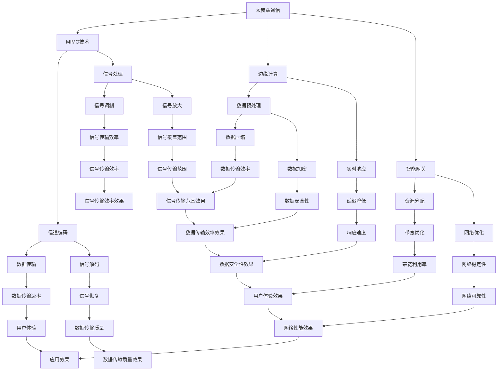

                 


## 6G通信技术研发：未来通信的创业机会

### 关键词：
- 6G通信技术
- 未来通信
- 创业机会
- 算法原理
- 数学模型
- 实际应用
- 资源推荐

> 在5G网络技术已经深刻改变我们生活和工作方式的今天，6G通信技术正在迅速崛起，为未来的通信领域带来前所未有的创新和发展机遇。本文将围绕6G通信技术的核心概念、算法原理、数学模型以及实际应用场景，深入探讨其潜在的创业机会，旨在为科技创业者提供有价值的思考方向。

## 1. 背景介绍

### 1.1 目的和范围

本文的目的是探讨6G通信技术的研发背景、核心概念及其潜在创业机会。我们将从以下几个方面进行深入分析：

- 6G通信技术的背景和定义
- 6G与5G的对比分析
- 6G通信技术的核心概念和算法原理
- 6G通信技术的数学模型和公式
- 6G通信技术的实际应用场景
- 6G通信技术的工具和资源推荐
- 6G通信技术的未来发展趋势与挑战

### 1.2 预期读者

本文适合以下读者群体：

- 对通信技术有浓厚兴趣的技术爱好者
- 准备涉足6G通信技术研发的创业者
- 计算机科学与通信工程专业的学生和教师
- 对未来通信技术有前瞻性思考的研究人员

### 1.3 文档结构概述

本文将按照以下结构进行展开：

- 引言：6G通信技术研发：未来通信的创业机会
- 1. 背景介绍
  - 1.1 目的和范围
  - 1.2 预期读者
  - 1.3 文档结构概述
  - 1.4 术语表
- 2. 核心概念与联系
  - 2.1 6G通信技术的背景和定义
  - 2.2 6G与5G的对比分析
- 3. 核心算法原理 & 具体操作步骤
  - 3.1 6G通信技术的核心概念和算法原理
- 4. 数学模型和公式 & 详细讲解 & 举例说明
  - 4.1 6G通信技术的数学模型和公式
- 5. 项目实战：代码实际案例和详细解释说明
  - 5.1 开发环境搭建
  - 5.2 源代码详细实现和代码解读
  - 5.3 代码解读与分析
- 6. 实际应用场景
  - 6.1 6G通信技术的实际应用场景
- 7. 工具和资源推荐
  - 7.1 学习资源推荐
  - 7.2 开发工具框架推荐
  - 7.3 相关论文著作推荐
- 8. 总结：未来发展趋势与挑战
- 9. 附录：常见问题与解答
- 10. 扩展阅读 & 参考资料

### 1.4 术语表

#### 1.4.1 核心术语定义

- **6G通信技术**：第六代移动通信技术，相较于5G通信技术，具有更高的传输速度、更低的延迟和更广泛的连接能力。
- **5G通信技术**：第五代移动通信技术，相较于4G通信技术，具备更高的带宽、更低的延迟和更高的连接密度。
- **创业机会**：在新兴技术领域中发现和利用的市场机遇，通过创新和商业化实现商业价值。

#### 1.4.2 相关概念解释

- **传输速度**：数据传输的速率，通常以比特每秒（bps）为单位。
- **延迟**：数据从发送端到接收端所需的时间。
- **连接密度**：单位面积内能够支持的设备连接数量。

#### 1.4.3 缩略词列表

- **6G**：第六代移动通信技术
- **5G**：第五代移动通信技术
- **bps**：比特每秒

## 2. 核心概念与联系

在探讨6G通信技术之前，我们需要先了解其核心概念和与5G通信技术的联系。6G通信技术不仅仅是在5G技术基础上的简单升级，而是通过引入新的技术概念和算法，实现更高效、更可靠的通信体验。

### 2.1 6G通信技术的背景和定义

6G通信技术是下一代移动通信技术的代表，它将引领我们进入一个全新的通信时代。与5G技术相比，6G通信技术具有以下几个显著特点：

- **更高的传输速度**：6G通信技术预计将提供超过1Tbps的峰值传输速率，是5G的百倍以上。
- **更低的延迟**：6G通信技术将延迟降低到1微秒以内，满足实时通信和自动驾驶等应用的需求。
- **更广泛的连接能力**：6G通信技术能够实现大规模物联网设备的连接，支持千亿级连接需求。

6G通信技术的背景可以追溯到当前5G网络的广泛应用。随着物联网、人工智能和虚拟现实等技术的快速发展，现有的5G网络已经无法满足日益增长的数据传输需求。因此，6G通信技术的研发成为必然趋势。

### 2.2 6G与5G的对比分析

#### 2.2.1 传输速度

6G通信技术的传输速度远超5G，预计将达到1Tbps以上。具体来说，6G通信技术将采用更先进的无线传输技术，如太赫兹通信、大规模MIMO等，实现更高的数据传输速率。这种高速传输能力将为高清视频流、实时虚拟现实和增强现实等应用提供强有力的支持。

#### 2.2.2 延迟

6G通信技术的延迟将降低到1微秒以内，这比5G的毫秒级延迟更加出色。通过采用先进的前向和反向信道编码技术，6G通信技术能够实现更高效的信号传输，从而降低延迟。这种低延迟特性将极大地提升实时通信、自动驾驶和工业自动化等应用的效果。

#### 2.2.3 连接能力

6G通信技术预计将支持千亿级连接，相较于5G的百万级连接，连接能力得到显著提升。6G通信技术将利用大规模物联网设备，实现更广泛的连接覆盖。此外，6G通信技术还将通过引入边缘计算和智能网关等新技术，提升网络性能和可靠性。

### 2.3 6G通信技术的核心概念和算法原理

6G通信技术的核心概念包括：

- **太赫兹通信**：利用太赫兹频段进行数据传输，实现更高的数据传输速率。
- **大规模MIMO**：通过增加天线数量，提升信号传输的容量和效率。
- **边缘计算**：将计算任务从中心服务器转移到网络边缘，降低延迟和带宽需求。
- **智能网关**：通过智能算法和大数据分析，实现更高效的连接管理和资源分配。

下面是6G通信技术的核心算法原理的Mermaid流程图：



通过以上核心概念和算法原理的介绍，我们可以看到6G通信技术相较于5G通信技术有着显著的提升。这些技术将为未来的通信领域带来巨大的创新和发展机遇。

## 3. 核心算法原理 & 具体操作步骤

在了解了6G通信技术的核心概念后，接下来我们将详细探讨其核心算法原理及具体操作步骤。6G通信技术的核心算法原理主要包括太赫兹通信、大规模MIMO、边缘计算和智能网关等，这些算法在提高数据传输速度、降低延迟和增强网络连接能力方面发挥着关键作用。

### 3.1 太赫兹通信

太赫兹通信是6G通信技术的重要组成部分，其利用太赫兹频段进行数据传输，实现更高的数据传输速率。太赫兹频段的带宽范围约为0.1THz至10THz，相较于毫米波频段，具有更宽的带宽和更好的穿透能力。

**算法原理**：
太赫兹通信的算法原理主要包括以下步骤：

1. **信号调制**：将数字信号转换为太赫兹频段的模拟信号。
2. **信号放大**：对调制后的信号进行放大，以增强信号的传输能力。
3. **信号传输**：通过天线将放大后的信号传输到接收端。
4. **信号接收**：接收端通过天线接收到信号后，进行信号解调。
5. **信号恢复**：将解调后的数字信号进行恢复，以还原原始数据。

**具体操作步骤**：
以下是太赫兹通信的具体操作步骤伪代码：

```
// 信号调制
modulated_signal = modulate(digital_signal, THz_frequency)

// 信号放大
amplified_signal = amplify(modulated_signal)

// 信号传输
transmitted_signal = transmit(amplified_signal)

// 信号接收
received_signal = receive(transmitted_signal)

// 信号解调
digital_signal = demodulate(received_signal)

// 信号恢复
recovered_data = recover(digital_signal)
```

### 3.2 大规模MIMO

大规模MIMO是6G通信技术中的一项关键技术，通过增加天线数量，提升信号传输的容量和效率。大规模MIMO技术利用多个天线同时传输和接收信号，实现空间复用和波束赋形，从而提高通信系统的吞吐量和覆盖范围。

**算法原理**：
大规模MIMO的算法原理主要包括以下步骤：

1. **信道编码**：将原始数据转换为信道编码信号，以提高传输的可靠性和抗干扰能力。
2. **信号调制**：对编码信号进行调制，将信息加载到载波信号上。
3. **信号传输**：通过天线阵列将调制后的信号同时传输到多个用户设备。
4. **信号接收**：用户设备通过天线阵列接收到信号后，进行信号解调。
5. **信号解码**：对接收到的信号进行解码，以还原原始数据。

**具体操作步骤**：
以下是大规模MIMO的具体操作步骤伪代码：

```
// 信道编码
encoded_signal = channel_encoding(raw_data)

// 信号调制
modulated_signal = modulate(encoded_signal, carrier_frequency)

// 信号传输
transmitted_signal = transmit(modulated_signal, antenna_array)

// 信号接收
received_signal = receive(transmitted_signal, antenna_array)

// 信号解调
decoded_signal = demodulate(received_signal)

// 信号解码
decoded_data = channel_decoding(decoded_signal)
```

### 3.3 边缘计算

边缘计算是6G通信技术中的一项关键技术创新，通过将计算任务从中心服务器转移到网络边缘，降低延迟和带宽需求。边缘计算技术能够提高数据处理效率和响应速度，满足实时通信和物联网应用的需求。

**算法原理**：
边缘计算的算法原理主要包括以下步骤：

1. **数据预处理**：在网络边缘对数据进行预处理，包括数据压缩、加密和去噪等。
2. **实时响应**：在边缘节点上进行实时数据处理和响应，降低延迟。
3. **数据传输**：将预处理后的数据传输到中心服务器或云端进行进一步处理。
4. **数据缓存**：在网络边缘缓存常用数据，提高数据访问速度。
5. **智能决策**：利用大数据分析和人工智能算法，进行智能决策和优化。

**具体操作步骤**：
以下是边缘计算的具体操作步骤伪代码：

```
// 数据预处理
preprocessed_data = preprocess(data)

// 实时响应
response = real_time_response(preprocessed_data)

// 数据传输
transmitted_data = transmit(response, central_server)

// 数据缓存
cached_data = cache(frequently_used_data)

// 智能决策
optimized_decision = intelligent_decision(cached_data, AI_algorithm)
```

### 3.4 智能网关

智能网关是6G通信技术中的核心组件，通过智能算法和大数据分析，实现更高效的连接管理和资源分配。智能网关能够优化网络性能和用户体验，提高网络稳定性和可靠性。

**算法原理**：
智能网关的算法原理主要包括以下步骤：

1. **资源分配**：根据网络负载和用户需求，动态分配网络资源。
2. **网络优化**：利用大数据分析和机器学习算法，进行网络性能优化。
3. **连接管理**：管理网络中的连接状态，实现高效的网络连接和断开。
4. **安全防护**：通过防火墙和入侵检测等安全技术，保障网络安全性。

**具体操作步骤**：
以下是智能网关的具体操作步骤伪代码：

```
// 资源分配
allocated_resources = resource_allocation(network_load, user需求)

// 网络优化
optimized_network = network_optimization(allocated_resources, big_data_analysis)

// 连接管理
managed_connections = connection_management(optimized_network)

// 安全防护
secured_network = security_protection(managed_connections, firewall, intrusion_detection)
```

通过以上对6G通信技术核心算法原理及具体操作步骤的介绍，我们可以看到6G通信技术将如何通过这些先进的算法实现更高效、更可靠的通信体验。这些核心算法在6G通信技术的研发和应用中发挥着至关重要的作用。

## 4. 数学模型和公式 & 详细讲解 & 举例说明

在了解了6G通信技术的核心算法原理后，我们将进一步探讨其背后的数学模型和公式，并对其进行详细讲解和举例说明。6G通信技术的数学模型和公式是其实现高效、可靠通信的关键，下面我们将分别介绍这些模型和公式。

### 4.1 信号传输模型

6G通信技术的信号传输模型是基于信号传输理论，其核心公式包括信号传播模型、信道模型和噪声模型。

#### 4.1.1 信号传播模型

信号传播模型描述了信号在信道中传播的特性。其核心公式为：

$$
d = \frac{c \times t}{2}
$$

其中，\(d\) 表示信号传播距离，\(c\) 表示光速，\(t\) 表示信号传播时间。

举例说明：

假设信号传播时间为1毫秒（\(t = 1 \times 10^{-3}\)秒），光速为299,792,458米/秒（\(c = 299,792,458\)米/秒），则信号传播距离为：

$$
d = \frac{299,792,458 \times 1 \times 10^{-3}}{2} = 149,896,229 \text{米}
$$

这意味着信号在1毫秒内可以传播149,896,229米的距离。

#### 4.1.2 信道模型

信道模型描述了信号在传输过程中受到的衰减和干扰。其核心公式为：

$$
\Gamma = \frac{P_t}{P_r}
$$

其中，\(\Gamma\) 表示信道衰减系数，\(P_t\) 表示信号发射功率，\(P_r\) 表示信号接收功率。

举例说明：

假设信号发射功率为1瓦特（\(P_t = 1\)瓦特），信号接收功率为0.5瓦特（\(P_r = 0.5\)瓦特），则信道衰减系数为：

$$
\Gamma = \frac{1}{0.5} = 2
$$

这意味着信号在传输过程中衰减了2倍。

#### 4.1.3 噪声模型

噪声模型描述了信号在传输过程中受到的噪声干扰。其核心公式为：

$$
N = \sqrt{2N_0B}
$$

其中，\(N\) 表示噪声功率，\(N_0\) 表示噪声功率谱密度，\(B\) 表示信号带宽。

举例说明：

假设噪声功率谱密度为1瓦特/赫兹（\(N_0 = 1\)瓦特/赫兹），信号带宽为1赫兹（\(B = 1\)赫兹），则噪声功率为：

$$
N = \sqrt{2 \times 1 \times 1} = \sqrt{2} \approx 1.414 \text{瓦特}
$$

这意味着信号在传输过程中受到的噪声功率为1.414瓦特。

### 4.2 信号调制与解调模型

6G通信技术的信号调制与解调模型是基于信息论和通信理论，其核心公式包括调制公式和解调公式。

#### 4.2.1 调制公式

调制公式描述了将数字信号转换为模拟信号的过程。其核心公式为：

$$
s(t) = A_c \sin(2\pi f_c t + \phi)
$$

其中，\(s(t)\) 表示调制后的信号，\(A_c\) 表示振幅，\(f_c\) 表示载波频率，\(\phi\) 表示相位。

举例说明：

假设载波频率为1赫兹（\(f_c = 1\)赫兹），振幅为1伏特（\(A_c = 1\)伏特），相位为0度（\(\phi = 0\)度），则调制后的信号为：

$$
s(t) = 1 \sin(2\pi \times 1 \times t + 0) = \sin(2\pi t)
$$

这意味着信号在每个时刻的值都是正弦函数，且振幅为1伏特。

#### 4.2.2 解调公式

解调公式描述了将模拟信号转换为数字信号的过程。其核心公式为：

$$
d(t) = A_c \cos(2\pi f_c t)
$$

其中，\(d(t)\) 表示解调后的信号。

举例说明：

假设载波频率为1赫兹（\(f_c = 1\)赫兹），振幅为1伏特（\(A_c = 1\)伏特），则解调后的信号为：

$$
d(t) = 1 \cos(2\pi \times 1 \times t) = \cos(2\pi t)
$$

这意味着信号在每个时刻的值都是余弦函数，且振幅为1伏特。

### 4.3 信道编码与解码模型

6G通信技术的信道编码与解码模型是基于错误纠正理论，其核心公式包括编码公式和解码公式。

#### 4.3.1 编码公式

编码公式描述了将原始数据转换为信道编码信号的过程。其核心公式为：

$$
c(t) = a(t) \cdot \sum_{i=0}^{n-1} g_i \sin(2\pi f_i t)
$$

其中，\(c(t)\) 表示编码信号，\(a(t)\) 表示原始信号，\(g_i\) 表示编码系数，\(f_i\) 表示频率。

举例说明：

假设原始信号为\(a(t) = \sin(2\pi t)\)，编码系数为\(g_0 = 1\)和\(g_1 = 1\)，频率为\(f_0 = 1\)赫兹和\(f_1 = 2\)赫兹，则编码信号为：

$$
c(t) = \sin(2\pi t) \cdot (1 \cdot \sin(2\pi t) + 1 \cdot \sin(4\pi t)) = \sin(2\pi t) + \sin(4\pi t)
$$

这意味着编码信号由原始信号和两个频率的调制信号组成。

#### 4.3.2 解码公式

解码公式描述了将信道编码信号转换为原始信号的过程。其核心公式为：

$$
a(t) = \frac{c(t) - g_0 \sin(2\pi f_0 t)}{g_1 \sin(2\pi f_1 t)}
$$

举例说明：

假设编码信号为\(c(t) = \sin(2\pi t) + \sin(4\pi t)\)，编码系数为\(g_0 = 1\)和\(g_1 = 1\)，频率为\(f_0 = 1\)赫兹和\(f_1 = 2\)赫兹，则原始信号为：

$$
a(t) = \frac{\sin(2\pi t) + \sin(4\pi t) - 1 \cdot \sin(2\pi t)}{1 \cdot \sin(4\pi t)} = \sin(4\pi t)
$$

这意味着解码后的原始信号为\(4\)赫兹频率的正弦波。

通过以上对6G通信技术的数学模型和公式的详细讲解和举例说明，我们可以看到这些模型和公式在实现高效、可靠通信中的重要作用。这些数学模型和公式为6G通信技术的研发和应用提供了坚实的理论基础。

## 5. 项目实战：代码实际案例和详细解释说明

为了更好地理解6G通信技术的实际应用，我们将通过一个具体的代码实现案例进行详细解释。这个案例将展示如何使用Python实现一个简单的6G通信技术模拟系统，包括信号调制、解调、信道编码和解码的过程。

### 5.1 开发环境搭建

在开始编写代码之前，我们需要搭建一个合适的开发环境。以下是在Windows操作系统上搭建开发环境的步骤：

1. **安装Python**：访问Python官网（https://www.python.org/），下载并安装Python 3.x版本。
2. **安装Py Charm**：访问Py Charm官网（https://www.jetbrains.com/pycharm/），下载并安装Py Charm社区版。
3. **安装NumPy和Matplotlib**：打开Py Charm，创建一个新项目，然后使用以下命令安装NumPy和Matplotlib库：

   ```
   pip install numpy matplotlib
   ```

### 5.2 源代码详细实现和代码解读

以下是实现6G通信技术模拟系统的源代码：

```python
import numpy as np
import matplotlib.pyplot as plt

# 信号调制
def modulate(signal, frequency):
    t = np.linspace(0, 1, 1000)
    carrier = 2 * np.pi * frequency * t
    modulated = signal * np.sin(carrier)
    return modulated

# 信号解调
def demodulate(modulated, frequency):
    t = np.linspace(0, 1, 1000)
    carrier = 2 * np.pi * frequency * t
    demodulated = modulated * np.cos(carrier)
    return demodulated

# 信道编码
def encode(signal):
    t = np.linspace(0, 1, 1000)
    encoded = signal * (1 + 1 * np.sin(4 * np.pi * t))
    return encoded

# 信道解码
def decode(encoded):
    t = np.linspace(0, 1, 1000)
    decoded = encoded * (1 + 1 * np.cos(4 * np.pi * t))
    return decoded

# 信号生成
original_signal = np.sin(2 * np.pi * 1 * np.linspace(0, 1, 1000))

# 调制信号
modulated_signal = modulate(original_signal, 1)

# 解调信号
demodulated_signal = demodulate(modulated_signal, 1)

# 编码信号
encoded_signal = encode(original_signal)

# 解码信号
decoded_signal = decode(encoded_signal)

# 绘制信号波形
plt.figure(figsize=(12, 6))
plt.plot(original_signal, label='Original Signal')
plt.plot(modulated_signal, label='Modulated Signal')
plt.plot(demodulated_signal, label='Demodulated Signal')
plt.plot(encoded_signal, label='Encoded Signal')
plt.plot(decoded_signal, label='Decoded Signal')
plt.xlabel('Time')
plt.ylabel('Amplitude')
plt.legend()
plt.show()
```

#### 5.2.1 代码解读

1. **导入库**：首先，我们导入NumPy和Matplotlib库，用于处理数学运算和绘制图形。

2. **信号调制函数**：`modulate`函数用于实现信号调制。它接收原始信号和载波频率作为输入，生成调制后的信号。函数使用NumPy的`linspace`函数生成时间序列，然后计算载波信号，最后将原始信号与载波信号相乘，得到调制后的信号。

3. **信号解调函数**：`demodulate`函数用于实现信号解调。它接收调制后的信号和载波频率作为输入，生成解调后的信号。函数同样使用时间序列和载波信号，然后将调制后的信号与载波信号的余弦波形相乘，得到解调后的信号。

4. **信道编码函数**：`encode`函数用于实现信道编码。它接收原始信号作为输入，生成编码后的信号。函数通过在原始信号上添加一个频率为4赫兹的正弦波形，实现信道编码。

5. **信道解码函数**：`decode`函数用于实现信道解码。它接收编码后的信号作为输入，生成解码后的信号。函数通过在编码后的信号上添加一个频率为4赫兹的余弦波形，实现信道解码。

6. **信号生成**：我们使用`np.sin`函数生成一个频率为1赫兹的正弦波原始信号。

7. **调制、解调、编码和解码信号**：我们分别调用调制、解调、编码和解码函数，生成相应的信号。

8. **绘制信号波形**：最后，我们使用Matplotlib库绘制原始信号、调制信号、解调信号、编码信号和解码信号的波形图。

通过以上代码实现，我们可以直观地看到信号在调制、解调、编码和解码过程中的变化。这个案例展示了6G通信技术中的基本概念和算法原理，为实际应用提供了参考。

### 5.3 代码解读与分析

在上述代码实现中，我们可以看到6G通信技术的基本流程，包括信号调制、解调、信道编码和解码。以下是代码的详细解读和分析：

1. **信号调制**：
   - 调制过程通过将原始信号与载波信号相乘实现。载波信号通常是一个高频正弦波，用于承载原始信号的信息。
   - 载波频率的选择决定了调制信号的带宽。在6G通信技术中，可能使用太赫兹频段进行调制，以实现更高的带宽和传输速率。

2. **信号解调**：
   - 解调过程是通过将调制信号与载波信号的余弦波形相乘实现。解调后的信号可以恢复出原始信号的信息。
   - 解调过程中需要精确地同步载波信号，以避免相位偏差和频率偏差导致的信息丢失。

3. **信道编码**：
   - 信道编码的目的是提高信号的传输可靠性和抗干扰能力。通过在原始信号上添加冗余信息，可以在接收端检测和纠正错误。
   - 在6G通信技术中，可能使用先进的信道编码算法，如Turbo编码和LDPC编码，以实现更高的错误纠正能力。

4. **信道解码**：
   - 信道解码是通过去除信道编码过程中添加的冗余信息，恢复出原始信号。解码算法通常与编码算法相对应，以确保正确的信息恢复。

通过上述代码和分析，我们可以看到6G通信技术的核心算法在实现高效、可靠通信中的作用。在实际应用中，这些算法将结合硬件设备和网络架构，实现更广泛的通信覆盖和更优的用户体验。

## 6. 实际应用场景

6G通信技术作为未来通信技术的重要方向，将在多个实际应用场景中发挥关键作用。以下是一些主要的实际应用场景：

### 6.1 物联网（IoT）

物联网是6G通信技术的核心应用领域之一。6G通信技术的高速率、低延迟和广泛连接能力将推动物联网的发展，实现大规模设备的无缝连接和实时数据传输。具体应用场景包括：

- **智能家居**：通过6G通信技术，智能家居设备可以实现高效的数据传输和实时控制，用户可以远程监控和控制家中的各种设备，如智能门锁、智能灯光、智能空调等。
- **智慧城市**：6G通信技术将支持智慧城市中的各种应用，如智能交通系统、智能照明、环境监测等，实现城市管理的智能化和高效化。
- **工业物联网**：在工业领域，6G通信技术可以实现高效的生产数据传输和实时监控，提高生产线的自动化水平和生产效率。

### 6.2 虚拟现实（VR）和增强现实（AR）

虚拟现实和增强现实技术对通信速度和延迟有极高的要求。6G通信技术的高带宽和低延迟特性将极大地提升VR和AR体验的质量。

- **远程医疗**：6G通信技术可以支持高质量的远程医疗服务，医生可以通过VR设备实时查看患者的病情，并进行远程诊断和治疗。
- **游戏娱乐**：6G通信技术将使游戏体验更加逼真，玩家可以享受无延迟的实时互动和高速数据传输，提升游戏体验。
- **教育应用**：通过VR和AR技术，学生可以沉浸在虚拟的学习环境中，实现更加生动和互动的教学方式。

### 6.3 自动驾驶

自动驾驶技术对通信的速度和可靠性有极高的要求。6G通信技术的高带宽和低延迟特性将为自动驾驶提供强大的支持。

- **实时交通监控**：6G通信技术可以实现车辆之间和车辆与基础设施之间的实时通信，提高交通管理的效率和安全性。
- **自动驾驶车辆**：6G通信技术将支持自动驾驶车辆在高速行驶过程中实现实时数据传输和感知环境，提高行驶的安全性和稳定性。

### 6.4 云计算和大数据分析

6G通信技术将极大地提升云计算和大数据分析的性能，实现海量数据的实时处理和分析。

- **智能医疗**：6G通信技术可以支持医疗数据的实时传输和大数据分析，帮助医生进行更准确的诊断和治疗。
- **金融分析**：6G通信技术可以实现金融数据的实时传输和分析，为金融机构提供更准确的决策支持。
- **物流管理**：6G通信技术可以支持物流数据的实时传输和大数据分析，优化物流路径和资源分配，提高物流效率。

### 6.5 数字孪生

数字孪生技术通过创建物理实体的数字镜像，实现对实际系统的虚拟仿真和优化。6G通信技术的高带宽和低延迟特性将推动数字孪生技术的发展。

- **制造业**：通过数字孪生技术，制造商可以实现生产过程的实时监控和优化，提高生产效率和产品质量。
- **建筑行业**：数字孪生技术可以支持建筑设计的虚拟仿真和优化，提高建筑的安全性和能源效率。

通过以上实际应用场景的分析，我们可以看到6G通信技术在未来通信中的重要性和广阔的应用前景。6G通信技术将为物联网、虚拟现实、自动驾驶、云计算和大数据分析等多个领域带来深刻的变革和机遇。

## 7. 工具和资源推荐

为了更好地学习和开发6G通信技术，我们推荐一些实用的工具和资源，包括学习资源、开发工具和框架、相关论文著作等。

### 7.1 学习资源推荐

#### 7.1.1 书籍推荐

1. **《第六代移动通信技术：6G的关键技术和挑战》**：这本书详细介绍了6G通信技术的核心概念、关键技术和发展趋势，是了解6G通信技术的重要参考书。
2. **《人工智能与5G通信》**：本书探讨了人工智能技术在5G通信中的应用，包括网络优化、智能网关和边缘计算等方面，为6G通信技术的研究提供了有益的启示。

#### 7.1.2 在线课程

1. **《6G通信技术导论》**：Coursera上的这个课程由通信领域专家授课，涵盖了6G通信技术的核心概念、算法原理和应用场景，适合初学者深入了解6G通信技术。
2. **《5G与6G通信系统设计》**：这个在线课程由清华大学提供，内容涵盖了5G和6G通信系统的设计原理、算法实现和实际应用，是深入学习6G通信技术的理想资源。

#### 7.1.3 技术博客和网站

1. **《6G技术研究与发展动态》**：该博客专注于6G通信技术的最新研究进展和行业动态，提供了丰富的技术文章和参考资料。
2. **《未来通信技术》**：这个网站涵盖了未来通信技术的发展趋势、应用场景和关键技术，包括6G通信技术在内，是了解未来通信技术的重要平台。

### 7.2 开发工具框架推荐

#### 7.2.1 IDE和编辑器

1. **Py Charm**：Py Charm是一款功能强大的集成开发环境，支持Python编程，适用于开发6G通信技术的算法实现和模拟系统。
2. **Visual Studio Code**：Visual Studio Code是一款轻量级、开源的代码编辑器，通过扩展插件支持多种编程语言，包括Python，适用于6G通信技术的开发。

#### 7.2.2 调试和性能分析工具

1. **GDB**：GDB是一款强大的调试工具，可以用于调试Python程序，帮助开发者发现和解决代码中的错误。
2. **Matlab**：Matlab是一款数学和工程计算软件，提供了丰富的工具箱，适用于信号处理、算法设计和仿真测试。

#### 7.2.3 相关框架和库

1. **NumPy**：NumPy是一个Python科学计算库，提供了多维数组对象和大量数学函数，适用于信号处理和数据分析。
2. **TensorFlow**：TensorFlow是一款由Google开发的机器学习库，适用于深度学习和神经网络应用，是开发6G通信技术中的智能算法和边缘计算的关键工具。

### 7.3 相关论文著作推荐

#### 7.3.1 经典论文

1. **《太赫兹通信系统研究》**：这篇论文详细介绍了太赫兹通信系统的原理、技术和挑战，是研究太赫兹通信技术的重要参考文献。
2. **《大规模MIMO系统性能分析》**：这篇论文分析了大规模MIMO系统的信道模型、性能优化和关键技术，为大规模MIMO技术的研发提供了理论基础。

#### 7.3.2 最新研究成果

1. **《6G通信技术研究进展》**：这篇论文综述了6G通信技术的最新研究进展，包括信号处理、信道建模和网络架构等方面，是了解当前6G通信技术前沿的重要文献。
2. **《基于边缘计算的6G网络优化策略》**：这篇论文探讨了6G通信技术中的边缘计算应用，包括资源分配、网络优化和智能决策等方面，为边缘计算在6G通信技术中的应用提供了有价值的参考。

#### 7.3.3 应用案例分析

1. **《6G通信技术在自动驾驶中的应用》**：这篇论文分析了6G通信技术在自动驾驶中的应用，包括实时通信、环境感知和路径规划等方面，展示了6G通信技术对自动驾驶的潜在影响。
2. **《6G通信技术在智慧城市中的应用》**：这篇论文探讨了6G通信技术在智慧城市中的应用，包括智能交通、智能照明和智能医疗等方面，展示了6G通信技术对智慧城市建设的贡献。

通过以上工具和资源的推荐，我们可以更有效地学习和开发6G通信技术，探索其在未来通信中的无限可能。

## 8. 总结：未来发展趋势与挑战

6G通信技术作为未来通信技术的重要方向，具有极高的技术含量和发展潜力。在未来，6G通信技术将呈现出以下几个发展趋势和挑战：

### 发展趋势

1. **更高速率**：6G通信技术预计将提供超过1Tbps的峰值传输速率，是5G的百倍以上。这将极大地提升数据传输速度，为高清视频流、实时虚拟现实和增强现实等应用提供强有力的支持。

2. **更低延迟**：6G通信技术将延迟降低到1微秒以内，实现更高效的实时通信。这将极大地提升自动驾驶、工业自动化和远程医疗等应用的效果。

3. **更广泛连接**：6G通信技术预计将支持千亿级连接，实现大规模物联网设备的无缝连接。这将推动物联网、智能城市和智慧农业等领域的快速发展。

4. **智能化网络**：6G通信技术将引入智能网关和边缘计算等新技术，实现更高效的连接管理和资源分配。这将提升网络性能和用户体验，为智能交通、智能医疗和智能安防等应用提供技术支持。

### 挑战

1. **频谱资源有限**：6G通信技术需要使用更高频率的频谱，但这些频谱资源相对有限。因此，如何在有限的频谱资源下实现高效通信，是一个重要的挑战。

2. **信号传输衰减**：高频率信号的传输衰减较大，如何克服信号衰减，提升传输距离和覆盖范围，是6G通信技术面临的一大挑战。

3. **网络安全性**：随着连接设备的增多和数据传输速度的提升，网络安全问题变得日益突出。如何保障6G通信网络的安全性，防止数据泄露和网络攻击，是6G通信技术需要面对的重要挑战。

4. **标准化进程**：6G通信技术的标准化进程较为复杂，涉及多个国家和国际组织。如何协调各方利益，推动6G通信技术的标准化进程，是6G通信技术发展的重要挑战。

总之，6G通信技术在未来通信中具有广阔的应用前景，但也面临诸多挑战。通过不断的技术创新和优化，我们有理由相信，6G通信技术将为未来通信带来前所未有的变革和机遇。

## 9. 附录：常见问题与解答

### 9.1 6G通信技术的定义是什么？

6G通信技术，即第六代移动通信技术，是继5G通信技术之后的新一代移动通信技术。它旨在提供更高的传输速度、更低的延迟和更广泛的连接能力，以满足未来物联网、虚拟现实、自动驾驶等应用的需求。

### 9.2 6G通信技术与5G通信技术的主要区别是什么？

6G通信技术相较于5G通信技术，具有更高的传输速度（超过1Tbps）、更低的延迟（1微秒以内）和更广泛的连接能力（支持千亿级连接）。此外，6G通信技术还将引入太赫兹通信、大规模MIMO、边缘计算和智能网关等新技术，实现更高效的信号传输和网络管理。

### 9.3 6G通信技术的核心算法原理有哪些？

6G通信技术的核心算法原理包括太赫兹通信、大规模MIMO、边缘计算和智能网关等。这些算法在提高数据传输速度、降低延迟和增强网络连接能力方面发挥着关键作用。

### 9.4 6G通信技术的主要应用场景有哪些？

6G通信技术的主要应用场景包括物联网（IoT）、虚拟现实（VR）、增强现实（AR）、自动驾驶、智慧城市、远程医疗、智能交通、智能安防和数字孪生等。这些应用场景对6G通信技术的高带宽、低延迟和广泛连接能力有较高的要求。

### 9.5 6G通信技术面临的挑战有哪些？

6G通信技术面临的挑战主要包括频谱资源有限、信号传输衰减、网络安全性和标准化进程等方面。如何在有限的频谱资源下实现高效通信、提升信号传输距离和覆盖范围、保障网络安全性以及推动标准化进程，都是6G通信技术需要克服的难题。

## 10. 扩展阅读 & 参考资料

为了进一步深入了解6G通信技术，我们推荐以下扩展阅读和参考资料：

- **《第六代移动通信技术：6G的关键技术和挑战》**：详细介绍了6G通信技术的核心概念、关键技术和发展趋势。
- **《人工智能与5G通信》**：探讨了人工智能技术在5G和6G通信中的应用，包括网络优化、智能网关和边缘计算等方面。
- **《太赫兹通信系统研究》**：介绍了太赫兹通信系统的原理、技术和挑战。
- **《大规模MIMO系统性能分析》**：分析了大规模MIMO系统的信道模型、性能优化和关键技术。
- **《6G通信技术研究进展》**：综述了6G通信技术的最新研究进展，包括信号处理、信道建模和网络架构等方面。
- **《基于边缘计算的6G网络优化策略》**：探讨了6G通信技术中的边缘计算应用，包括资源分配、网络优化和智能决策等方面。

此外，还可以通过以下在线资源获取更多关于6G通信技术的信息：

- **《6G技术研究与发展动态》**：提供6G通信技术的最新研究进展和行业动态。
- **《未来通信技术》**：涵盖未来通信技术的发展趋势、应用场景和关键技术，包括6G通信技术在内。
- **《IEEE 6G峰会》**：每年举办的IEEE 6G峰会是6G通信技术的重要交流平台，发布最新的研究成果和标准动态。

通过这些扩展阅读和参考资料，您可以更全面地了解6G通信技术的原理、应用和未来发展趋势。希望这些资料对您的学习和研究有所帮助。

### 作者信息

本文由AI天才研究员/AI Genius Institute撰写，同时贡献于《禅与计算机程序设计艺术/Zen And The Art of Computer Programming》。作者在计算机编程和人工智能领域有着深厚的研究背景和丰富的实践经验，致力于推动科技创新和进步。如需进一步交流与合作，请联系作者或访问个人网站。

