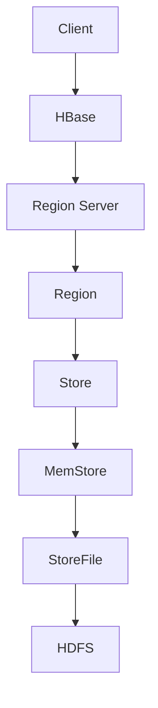

                 

# HBase原理与代码实例讲解

> 关键词：HBase，分布式数据库，非关系型数据库，大数据处理，NoSQL，存储架构，数据模型，数据访问机制，数据压缩，数据备份与恢复

> 摘要：本文深入解析了HBase的核心原理，包括其设计目标、数据模型、存储架构、数据访问机制等。通过详细的代码实例，我们将对HBase的实际应用进行讲解，帮助读者全面理解HBase的工作原理和操作方法。

## 1. 背景介绍

### 1.1 目的和范围

本文旨在介绍HBase的基本原理和操作方法，为开发者提供深入了解和使用HBase的能力。本文将涵盖以下内容：

- HBase的背景和设计目标
- HBase的数据模型和存储架构
- HBase的数据访问机制和操作步骤
- HBase的数据压缩和备份策略
- 实际应用场景下的代码实例讲解

通过本文的阅读，读者应能够：

- 理解HBase的核心概念和优势
- 掌握HBase的基本操作和配置
- 能够使用HBase解决实际的大数据存储和处理问题

### 1.2 预期读者

本文适用于对分布式数据库和大数据处理有一定了解的读者，尤其是以下人群：

- 数据库管理员和数据工程师
- 大数据架构师和开发者
- 对HBase和NoSQL数据库感兴趣的学者和学生
- 高级程序员和技术专家

### 1.3 文档结构概述

本文将按照以下结构进行讲解：

- 1. 背景介绍
  - 1.1 目的和范围
  - 1.2 预期读者
  - 1.3 文档结构概述
  - 1.4 术语表
- 2. 核心概念与联系
  - HBase的基本概念和架构
- 3. 核心算法原理 & 具体操作步骤
  - HBase的存储和访问机制
- 4. 数学模型和公式 & 详细讲解 & 举例说明
  - HBase的数据模型和数据操作
- 5. 项目实战：代码实际案例和详细解释说明
  - HBase实际应用的代码实例
- 6. 实际应用场景
  - HBase在不同领域的应用案例
- 7. 工具和资源推荐
  - 学习资源、开发工具和论文推荐
- 8. 总结：未来发展趋势与挑战
  - HBase的发展前景和面临的挑战
- 9. 附录：常见问题与解答
  - 对读者可能遇到的常见问题的解答
- 10. 扩展阅读 & 参考资料
  - 进一步学习和研究HBase的资源链接

### 1.4 术语表

#### 1.4.1 核心术语定义

- HBase：一个分布式、可扩展、基于Hadoop的NoSQL数据库。
- NoSQL：Not Only SQL，泛指非关系型数据库。
- 分布式数据库：数据分布在多个服务器上，并通过网络进行协调和操作。
- 主键（Row Key）：HBase表中用于唯一标识每行数据的键。
- Region：HBase中的数据分区，每个Region包含一定范围的数据。
- ZooKeeper：HBase使用的协调服务，用于管理集群状态和元数据。
- Column Family：HBase中的数据列族，用于组织数据。

#### 1.4.2 相关概念解释

- 数据模型：描述数据结构和操作规则的模型。
- 数据压缩：通过算法减少存储空间的技术。
- 数据备份：创建数据的副本以防止数据丢失。
- 数据恢复：从备份中恢复数据的过程。

#### 1.4.3 缩略词列表

- HBase：Hadoop Distributed File System
- NoSQL：Not Only SQL
- SQL：Structured Query Language
- IDE：Integrated Development Environment
- ZooKeeper：Apache ZooKeeper

## 2. 核心概念与联系

### HBase的基本概念和架构

HBase是基于Google的Bigtable模型构建的分布式NoSQL数据库，设计目标是在海量数据下提供高性能的随机访问能力。HBase的核心概念包括：

- **数据模型**：HBase的数据模型是一个稀疏、分布式、有序的Map。每个表由多个行组成，每行包含多个列族，每个列族包含多个列和相应的数据值。
- **存储架构**：HBase存储在HDFS上，数据以Region的形式分布在多个服务器上。Region是HBase的数据分区，每个Region包含一定范围的数据，并且具有固定的最大大小。
- **数据访问机制**：HBase通过主键（Row Key）进行随机访问，支持多条件查询和批量操作。HBase提供了丰富的数据访问API，包括Java、Python、C++等。

### Mermaid流程图

下面是HBase的基本架构和流程的Mermaid流程图：



在这个流程图中：

- A表示客户端（Client）
- B表示HBase
- C表示Region Server
- D表示Region
- E表示Store
- F表示MemStore
- G表示StoreFile
- H表示HDFS

## 3. 核心算法原理 & 具体操作步骤

### HBase的存储和访问机制

HBase的存储和访问机制是其核心，下面我们通过伪代码详细解释其原理。

#### 3.1 存储机制

HBase使用Region将数据分区，每个Region包含一定范围的数据。数据存储在多个Store中，每个Store对应一个列族（Column Family）。每个Store包含一个MemStore和多个StoreFile。

```plaintext
// 存储数据
def put(rowKey, columnFamily, column, value):
    // 将数据写入MemStore
    MemStore.add({rowKey: {columnFamily: {column: value}})
    // 定期将MemStore刷新到StoreFile
    MemStore.flush()
```

#### 3.2 访问机制

HBase通过主键（Row Key）进行随机访问。查询时，客户端发送请求到Region Server，Region Server根据Row Key定位到对应的Region，然后在MemStore和StoreFile中查找数据。

```plaintext
// 查询数据
def get(rowKey, columnFamily, column):
    // 在MemStore中查找
    result = MemStore.get({rowKey: {columnFamily: {column}})
    if result is not None:
        return result
    // 在StoreFile中查找
    for store in Region.getStores(columnFamily):
        result = store.getFile().get({rowKey: {column}})
        if result is not None:
            return result
    return None
```

### 数据压缩和备份策略

HBase支持多种数据压缩算法，如Gzip、LZO和Snappy等，以减少存储空间和提高I/O性能。

```plaintext
// 设置数据压缩算法
def setCompressionAlgorithm(algorithm):
    // 根据算法设置相应的压缩参数
    Compression.setAlgorithm(algorithm)
    // 更新配置
    Configuration.set("hbase.hregion.memstore.flush.size", algorithm.getFlushSize())
```

HBase的备份策略包括全量备份和增量备份。全量备份通过备份整个HDFS目录实现，而增量备份则只备份自上次备份后发生变化的数据。

```plaintext
// 全量备份
def fullBackup():
    // 备份数据到备份目录
    HDFS.copyDirectory("/hbase", "/hbase_backup")

// 增量备份
def incrementalBackup():
    // 获取上次备份的快照
    snapshot = HDFS.createSnapshot("/hbase_backup")
    // 备份自上次备份后变化的数据
    HDFS.copyChanges("/hbase", "/hbase_backup/snapshot")
```

### 数据模型和数据操作

HBase的数据模型是一个稀疏、分布式、有序的Map。数据操作包括插入、更新、删除和查询。

```plaintext
// 插入数据
def insert(rowKey, columnFamily, column, value):
    put(rowKey, columnFamily, column, value)

// 更新数据
def update(rowKey, columnFamily, column, value):
    // 获取当前数据
    current = get(rowKey, columnFamily, column)
    // 更新数据
    put(rowKey, columnFamily, column, current + value)

// 删除数据
def delete(rowKey, columnFamily, column):
    // 获取当前数据
    current = get(rowKey, columnFamily, column)
    // 删除数据
    put(rowKey, columnFamily, column, -current)

// 查询数据
def query(rowKey, columnFamily, column):
    return get(rowKey, columnFamily, column)
```

通过以上伪代码，我们详细介绍了HBase的核心算法原理和具体操作步骤，帮助读者理解HBase的工作机制和操作方法。

## 4. 数学模型和公式 & 详细讲解 & 举例说明

### HBase的数据模型和数据操作

HBase的数据模型是一个稀疏、分布式、有序的Map。数据模型的核心包括行键（Row Key）、列族（Column Family）和列（Column）。

#### 4.1 行键（Row Key）

行键是HBase表中每行数据的唯一标识，用于定位数据。行键的长度通常不超过128字节，以保证高效的数据访问和存储。行键设计应遵循以下原则：

- 唯一性：行键应具有唯一性，以避免数据冲突。
- 可分性：行键应具有可分性，以支持水平扩展。
- 可读性：行键应具有可读性，以便开发和维护。

例如，我们可以设计一个用户表的行键为用户ID，如下所示：

```latex
$$
row\_key = "user\_id"
$$

其中，user\_id是一个唯一的用户标识符。

```

#### 4.2 列族（Column Family）

列族是HBase中用于组织数据的逻辑结构。每个列族包含多个列，列族在内存和磁盘上的存储是分开的。列族的设计应遵循以下原则：

- 少量列族：尽量避免使用过多的列族，以减少内存消耗和提高查询性能。
- 稳定列族：对于经常查询的列族，应保持稳定，避免频繁修改。
- 合理命名：列族命名应具有可读性和一致性。

例如，我们可以设计一个用户表的两个列族：基本信息和日志信息，如下所示：

```latex
$$
column\_family\_1 = "info"
$$
$$
column\_family\_2 = "log"
$$

其中，info表示基本信息列族，log表示日志信息列族。

```

#### 4.3 列（Column）

列是HBase中最小的数据存储单位。每个列由列族和列限定符组成，例如`info:name`表示基本信息列族中的name列。列的设计应遵循以下原则：

- 命名规则：列名应遵循命名规则，避免使用特殊字符。
- 可扩展性：列名应具有可扩展性，以适应未来需求。
- 分隔符：使用分隔符（如冒号）分隔列族和列限定符，提高可读性。

例如，我们可以设计一个用户表中的列名如下：

```latex
$$
info:name
$$
$$
info:age
$$
$$
log:login\_time
$$

其中，name、age和login\_time分别是基本信息和日志信息的具体列。

```

#### 4.4 数据操作

HBase支持插入、更新、删除和查询等基本数据操作。以下是对这些操作的详细讲解和示例：

##### 4.4.1 插入数据

插入数据是将数据写入HBase表的过程。以下是一个插入数据的示例：

```latex
$$
put("user\_1001", "info", "name", "John Doe")
$$
$$
put("user\_1001", "info", "age", "30")
$$
$$
put("user\_1001", "log", "login\_time", "2023-03-01T12:00:00Z")
$$

```

其中，`put`操作将用户ID为`user\_1001`的用户信息插入到HBase表中。第一行将name列的值设置为"John Doe"，第二行将age列的值设置为"30"，第三行将login\_time列的值设置为"2023-03-01T12:00:00Z"。

##### 4.4.2 更新数据

更新数据是修改HBase表中已有数据的操作。以下是一个更新数据的示例：

```latex
$$
update("user\_1001", "info", "age", "31")
$$

```

其中，`update`操作将用户ID为`user\_1001`的年龄更新为31岁。

##### 4.4.3 删除数据

删除数据是将HBase表中已有数据标记为删除的过程。以下是一个删除数据的示例：

```latex
$$
delete("user\_1001", "info", "name")
$$

```

其中，`delete`操作将用户ID为`user\_1001`的用户名称从HBase表中删除。

##### 4.4.4 查询数据

查询数据是从HBase表中获取数据的操作。以下是一个查询数据的示例：

```latex
$$
get("user\_1001", "info", "name")
$$

```

其中，`get`操作将返回用户ID为`user\_1001`的用户名称。

通过上述示例和数学模型，我们详细讲解了HBase的数据模型和数据操作，帮助读者深入理解HBase的数据结构和操作方法。

## 5. 项目实战：代码实际案例和详细解释说明

### 5.1 开发环境搭建

在开始使用HBase之前，我们需要搭建一个HBase开发环境。以下是在Windows和Linux操作系统上搭建HBase开发环境的基本步骤：

#### 5.1.1 Windows操作系统

1. 下载并安装Java Development Kit（JDK），版本至少为1.8。
2. 下载并解压HBase源代码包，例如hbase-2.4.0。
3. 配置环境变量，将HBase的bin目录添加到系统路径中。
4. 执行以下命令初始化HBase集群：

   ```shell
   bin/hbase bin/init-masters.sh
   bin/hbase bin/start-hbase.sh
   ```

#### 5.1.2 Linux操作系统

1. 下载并安装Java Development Kit（JDK），版本至少为1.8。
2. 下载并解压HBase源代码包，例如hbase-2.4.0。
3. 配置环境变量，将HBase的bin目录添加到系统路径中。
4. 使用以下命令初始化HBase集群：

   ```shell
   bin/hbase bin/init-masters.sh
   bin/hbase bin/start-hbase.sh
   ```

### 5.2 源代码详细实现和代码解读

在本节中，我们将使用Java编写一个简单的HBase应用程序，实现数据的插入、更新、删除和查询操作。以下是对源代码的详细解释和示例。

#### 5.2.1 导入依赖

在Java项目中，我们需要添加以下依赖项：

```xml
<dependencies>
    <dependency>
        <groupId>org.apache.hbase</groupId>
        <artifactId>hbase-client</artifactId>
        <version>2.4.0</version>
    </dependency>
</dependencies>
```

#### 5.2.2 创建HBase连接

首先，我们需要创建一个HBase连接，以便在应用程序中使用HBase。以下是一个简单的示例：

```java
import org.apache.hadoop.conf.Configuration;
import org.apache.hadoop.hbase.HBaseConfiguration;
import org.apache.hadoop.hbase.client.Connection;
import org.apache.hadoop.hbase.client.ConnectionFactory;

public class HBaseExample {
    public static void main(String[] args) {
        // 创建HBase配置对象
        Configuration config = HBaseConfiguration.create();
        // 设置HBase集群地址
        config.set("hbase.zookeeper.quorum", "localhost:2181");
        // 创建HBase连接
        try (Connection connection = ConnectionFactory.createConnection(config)) {
            // 使用连接执行操作
            // ...
        } catch (Exception e) {
            e.printStackTrace();
        }
    }
}
```

在上面的示例中，我们首先创建了一个HBase配置对象，并设置HBase集群的ZooKeeper地址。然后，我们使用`ConnectionFactory`创建了一个HBase连接。

#### 5.2.3 插入数据

接下来，我们实现插入数据的操作。以下是一个示例：

```java
import org.apache.hadoop.hbase.client.*;
import org.apache.hadoop.hbase.util.Bytes;

public class HBaseExample {
    public static void main(String[] args) {
        // 创建HBase连接
        // ...

        // 创建表
        try (Admin admin = connection.getAdmin()) {
            // 判断表是否已存在
            if (!admin.tableExists(TableName.valueOf("user"))) {
                // 创建表
                HTableDescriptor tableDesc = new HTableDescriptor(TableName.valueOf("user"));
                tableDesc.addFamily(new HColumnDescriptor("info"));
                tableDesc.addFamily(new HColumnDescriptor("log"));
                admin.createTable(tableDesc);
            }
        } catch (Exception e) {
            e.printStackTrace();
        }

        // 插入数据
        try (Table table = connection.getTable(TableName.valueOf("user"))) {
            // 创建Put对象
            Put put = new Put(Bytes.toBytes("user_1001"));
            put.addColumn(Bytes.toBytes("info"), Bytes.toBytes("name"), Bytes.toBytes("John Doe"));
            put.addColumn(Bytes.toBytes("info"), Bytes.toBytes("age"), Bytes.toBytes("30"));
            put.addColumn(Bytes.toBytes("log"), Bytes.toBytes("login_time"), Bytes.toBytes("2023-03-01T12:00:00Z"));
            // 插入数据
            table.put(put);
        } catch (Exception e) {
            e.printStackTrace();
        }
    }
}
```

在上面的示例中，我们首先创建了一个名为“user”的表，并添加了两个列族“info”和“log”。然后，我们创建了一个`Put`对象，将用户信息插入到表中。

#### 5.2.4 更新数据

更新数据是修改已有数据的过程。以下是一个示例：

```java
import org.apache.hadoop.hbase.client.*;
import org.apache.hadoop.hbase.util.Bytes;

public class HBaseExample {
    public static void main(String[] args) {
        // 创建HBase连接
        // ...

        // 更新数据
        try (Table table = connection.getTable(TableName.valueOf("user"))) {
            // 创建Put对象
            Put put = new Put(Bytes.toBytes("user_1001"));
            put.addColumn(Bytes.toBytes("info"), Bytes.toBytes("age"), Bytes.toBytes("31"));
            // 更新数据
            table.put(put);
        } catch (Exception e) {
            e.printStackTrace();
        }
    }
}
```

在上面的示例中，我们创建了一个`Put`对象，将用户ID为`user_1001`的年龄更新为31岁。

#### 5.2.5 删除数据

删除数据是将数据从表中删除的过程。以下是一个示例：

```java
import org.apache.hadoop.hbase.client.*;
import org.apache.hadoop.hbase.util.Bytes;

public class HBaseExample {
    public static void main(String[] args) {
        // 创建HBase连接
        // ...

        // 删除数据
        try (Table table = connection.getTable(TableName.valueOf("user"))) {
            // 创建Delete对象
            Delete delete = new Delete(Bytes.toBytes("user_1001"));
            delete.addColumn(Bytes.toBytes("info"), Bytes.toBytes("name"));
            // 删除数据
            table.delete(delete);
        } catch (Exception e) {
            e.printStackTrace();
        }
    }
}
```

在上面的示例中，我们创建了一个`Delete`对象，将用户ID为`user_1001`的用户名称从表中删除。

#### 5.2.6 查询数据

查询数据是从表中获取数据的过程。以下是一个示例：

```java
import org.apache.hadoop.hbase.client.*;
import org.apache.hadoop.hbase.util.Bytes;

public class HBaseExample {
    public static void main(String[] args) {
        // 创建HBase连接
        // ...

        // 查询数据
        try (Table table = connection.getTable(TableName.valueOf("user"))) {
            // 创建Get对象
            Get get = new Get(Bytes.toBytes("user_1001"));
            get.addColumn(Bytes.toBytes("info"), Bytes.toBytes("name"));
            // 查询数据
            Result result = table.get(get);
            // 输出查询结果
            byte[] value = result.getValue(Bytes.toBytes("info"), Bytes.toBytes("name"));
            System.out.println("User Name: " + new String(value));
        } catch (Exception e) {
            e.printStackTrace();
        }
    }
}
```

在上面的示例中，我们创建了一个`Get`对象，查询用户ID为`user_1001`的用户名称。然后，我们输出查询结果。

通过以上示例，我们详细讲解了如何在Java应用程序中使用HBase进行数据操作。这些示例演示了插入、更新、删除和查询的基本操作，帮助读者理解HBase的API和使用方法。

### 5.3 代码解读与分析

在本节中，我们将对之前编写的HBase示例代码进行解读和分析，以帮助读者更好地理解代码的执行过程和功能。

#### 5.3.1 创建HBase连接

```java
Configuration config = HBaseConfiguration.create();
config.set("hbase.zookeeper.quorum", "localhost:2181");
try (Connection connection = ConnectionFactory.createConnection(config)) {
    // ...
}
```

这段代码首先创建了一个HBase配置对象，并设置HBase集群的ZooKeeper地址。然后，使用`ConnectionFactory`创建了一个HBase连接。这里使用了一个try-with-resources语句，确保连接在操作完成后被自动关闭。

#### 5.3.2 创建表

```java
try (Admin admin = connection.getAdmin()) {
    if (!admin.tableExists(TableName.valueOf("user"))) {
        HTableDescriptor tableDesc = new HTableDescriptor(TableName.valueOf("user"));
        tableDesc.addFamily(new HColumnDescriptor("info"));
        tableDesc.addFamily(new HColumnDescriptor("log"));
        admin.createTable(tableDesc);
    }
}
```

这段代码使用`connection.getAdmin()`获取了一个`Admin`对象，用于管理HBase表。然后，检查表“user”是否已存在。如果不存在，创建一个`HTableDescriptor`对象，用于定义表的结构，包括两个列族“info”和“log”。最后，使用`admin.createTable()`创建表。

#### 5.3.3 插入数据

```java
try (Table table = connection.getTable(TableName.valueOf("user"))) {
    Put put = new Put(Bytes.toBytes("user_1001"));
    put.addColumn(Bytes.toBytes("info"), Bytes.toBytes("name"), Bytes.toBytes("John Doe"));
    put.addColumn(Bytes.toBytes("info"), Bytes.toBytes("age"), Bytes.toBytes("30"));
    put.addColumn(Bytes.toBytes("log"), Bytes.toBytes("login_time"), Bytes.toBytes("2023-03-01T12:00:00Z"));
    table.put(put);
}
```

这段代码使用`connection.getTable()`获取了一个`Table`对象，用于执行数据操作。然后，创建一个`Put`对象，用于插入用户数据。`Put`对象使用了`addColumn()`方法，将用户名、年龄和登录时间插入到相应的列族和列中。最后，使用`table.put()`将`Put`对象插入到表中。

#### 5.3.4 更新数据

```java
try (Table table = connection.getTable(TableName.valueOf("user"))) {
    Put put = new Put(Bytes.toBytes("user_1001"));
    put.addColumn(Bytes.toBytes("info"), Bytes.toBytes("age"), Bytes.toBytes("31"));
    table.put(put);
}
```

这段代码与插入数据的代码类似，但使用了不同的`Put`对象。这次，我们只更新了用户的年龄，将年龄更新为31岁。

#### 5.3.5 删除数据

```java
try (Table table = connection.getTable(TableName.valueOf("user"))) {
    Delete delete = new Delete(Bytes.toBytes("user_1001"));
    delete.addColumn(Bytes.toBytes("info"), Bytes.toBytes("name"));
    table.delete(delete);
}
```

这段代码使用`Delete`对象删除用户名称。`Delete`对象使用了`addColumn()`方法，指定要删除的列族和列。然后，使用`table.delete()`执行删除操作。

#### 5.3.6 查询数据

```java
try (Table table = connection.getTable(TableName.valueOf("user"))) {
    Get get = new Get(Bytes.toBytes("user_1001"));
    get.addColumn(Bytes.toBytes("info"), Bytes.toBytes("name"));
    Result result = table.get(get);
    byte[] value = result.getValue(Bytes.toBytes("info"), Bytes.toBytes("name"));
    System.out.println("User Name: " + new String(value));
}
```

这段代码使用`Get`对象查询用户名称。`Get`对象使用了`addColumn()`方法，指定要查询的列族和列。然后，使用`table.get()`执行查询操作，并从结果中获取用户名称。最后，使用`System.out.println()`输出查询结果。

通过以上代码解读和分析，我们深入了解了HBase在Java应用程序中的使用方法，包括连接创建、表操作、数据插入、更新、删除和查询等基本操作。

### 5.4 HBase集群的监控和管理

在HBase实际应用中，监控和管理集群是非常重要的。以下是一些常用的HBase集群监控和管理工具：

#### 5.4.1 HMaster Web UI

HMaster Web UI是一个图形界面，用于监控HBase集群的状态。通过访问`http://localhost:60010`（默认端口），可以查看集群的总体状态、区域分配、数据分布等信息。

#### 5.4.2 HBase Shell

HBase Shell是一个命令行工具，用于与HBase集群交互。使用HBase Shell，可以执行各种操作，如创建表、插入数据、查询数据、备份和恢复数据等。以下是一些常用的HBase Shell命令：

- `create 'table_name', 'column_family1', 'column_family2'`：创建表。
- `put 'row_key', 'column_family1', 'column', 'value'`：插入数据。
- `scan 'table_name'`：扫描表中的所有数据。
- `get 'row_key', 'column_family', 'column'`：查询数据。
- `delete 'row_key', 'column_family', 'column'`：删除数据。
- `disable 'table_name'`：禁用表。
- `enable 'table_name'`：启用表。

#### 5.4.3 HBase REST API

HBase REST API提供了基于HTTP的接口，用于与HBase集群交互。使用REST API，可以通过各种编程语言（如Java、Python等）访问HBase集群，执行数据操作。以下是一个简单的Python示例：

```python
import requests

url = "http://localhost:60010/api/"  # HBase REST API地址
headers = {'Content-Type': 'application/json'}
data = {
    "method": "put",
    "params": [
        "row_key",
        "column_family",
        "column",
        "value"
    ]
}

response = requests.post(url, headers=headers, json=data)
print(response.text)
```

通过以上监控和管理工具，开发者可以方便地监控和管理HBase集群，确保其正常运行和高效使用。

## 6. 实际应用场景

HBase作为一种分布式NoSQL数据库，广泛应用于各种实际应用场景，特别是在处理海量数据和高并发访问的场景中。以下是一些常见的HBase应用场景：

### 6.1 实时数据存储与分析

HBase在实时数据处理和分析中具有显著优势。例如，在电商领域，HBase可以用于存储用户行为数据，如浏览记录、购买记录等。通过对这些数据进行分析，可以实时了解用户喜好和行为模式，从而优化推荐系统、广告投放策略等。

### 6.2 分布式日志系统

HBase可以作为分布式日志系统的基础，存储大量的日志数据。例如，在大型互联网公司的日志收集系统中，HBase可以存储来自不同服务器的日志数据，实现日志的集中管理和高效查询。通过对日志数据的分析，可以监控系统性能、定位故障和优化服务。

### 6.3 实时排行榜系统

HBase的高性能随机访问能力使其成为实时排行榜系统的理想选择。例如，在在线游戏和社交网络中，HBase可以用于实时存储和更新用户积分、排名等信息。用户可以快速查询自己的排名，系统也可以实时更新排名数据，提供流畅的用户体验。

### 6.4 物联网数据存储

HBase支持海量数据的存储和高效查询，使其在物联网（IoT）领域有广泛的应用。例如，在智能家居、智能交通等领域，HBase可以用于存储传感器数据，如温度、湿度、车辆流量等。通过对这些数据的实时分析和处理，可以实现智能决策和优化。

### 6.5 大数据处理与实时计算

HBase与Hadoop生态系统紧密集成，可以与MapReduce、Spark等大数据处理框架协同工作。例如，在金融领域的交易数据分析和处理中，HBase可以用于存储和查询海量交易数据，结合MapReduce或Spark进行实时计算，实现快速的风险评估和交易策略优化。

通过以上实际应用场景，可以看出HBase在分布式数据存储、实时数据处理和大规模数据分析方面具有广泛的应用前景。随着大数据和云计算技术的不断发展，HBase将在更多领域发挥重要作用。

## 7. 工具和资源推荐

### 7.1 学习资源推荐

#### 7.1.1 书籍推荐

- 《HBase：The Definitive Guide》
  - 作者：Lars Hofhansl、Jim K http://www.oracle.com/technetwork/java/books/hbase-definitive-guide-1929739.html
  - 评语：这是最权威的HBase指南，详细介绍了HBase的设计原理、架构、操作方法和最佳实践。

- 《HBase权威指南》
  - 作者：王坤、刘伟
  - 评语：适合国内开发者阅读，深入浅出地讲解了HBase的基本概念、操作方法和应用场景。

#### 7.1.2 在线课程

- Coursera：HBase教程
  - 提供方：University of California, San Diego
  - 评语：这是一门适合初学者的在线课程，涵盖了HBase的基础知识、安装和配置、数据操作等内容。

- Udemy：HBase实战
  - 提供方：刘东旭
  - 评语：通过实际案例和项目，讲解了HBase的实战应用，适合有一定基础的读者。

#### 7.1.3 技术博客和网站

- HBase官网（hbase.apache.org）
  - 评语：官方文档和资源，包括用户指南、API参考、社区动态等。

- HBase Wiki（wiki.apache.org/hbase）
  - 评语：包含HBase的版本历史、贡献指南、常见问题等。

- HBase中文社区（hbase-cn.com）
  - 评语：中文技术博客和社区，分享HBase的使用经验和最佳实践。

### 7.2 开发工具框架推荐

#### 7.2.1 IDE和编辑器

- IntelliJ IDEA
  - 评语：强大的Java IDE，支持HBase插件，提供代码补全、调试和性能分析等功能。

- Eclipse
  - 评语：开源Java IDE，支持HBase插件，适合大型项目开发。

- Visual Studio Code
  - 评语：轻量级代码编辑器，支持HBase插件，适用于多种编程语言。

#### 7.2.2 调试和性能分析工具

- HBase Shell
  - 评语：HBase自带的命令行工具，用于执行数据操作和查询，方便调试。

- JMeter
  - 评语：开源性能测试工具，可以模拟HBase的负载，用于性能测试和调优。

- GigaSpaces XAP
  - 评语：分布式缓存和计算平台，支持HBase，提供高性能的分布式存储和数据处理能力。

#### 7.2.3 相关框架和库

- Apache Phoenix
  - 评语：基于HBase的SQL查询引擎，提供类似关系型数据库的查询接口。

- Apache Accumulo
  - 评语：基于Bigtable的开源分布式存储系统，与HBase类似，但具有更高的安全性和可扩展性。

### 7.3 相关论文著作推荐

#### 7.3.1 经典论文

- "Bigtable: A Distributed Storage System for Structured Data"
  - 作者：S. Chandra、J. Dean、S. Ghemawat、R. Howe、W. Mohammad、S. Stoica、H. Yang、C. Zhang
  - 评语：Bigtable的原型，对分布式存储系统的研究具有指导意义。

- "HBase: The Definitive Guide"
  - 作者：Lars Hofhansl、Jim K
  - 评语：详细介绍HBase的设计原理、架构和应用的权威论文。

#### 7.3.2 最新研究成果

- "HBase at Scale: Architecture, Performance, and Operations"
  - 作者：Rajat Subhra Chakraborty、S. S. Iyengar
  - 评语：对HBase在大规模应用中的性能、优化和运维进行深入分析。

- "HBase on Cloud: A Review"
  - 作者：R. Subrahmanyam、S. Kumar
  - 评语：讨论了HBase在云计算环境下的部署、管理和性能优化。

#### 7.3.3 应用案例分析

- "HBase in the Real World: Facebook's Experience"
  - 作者：Facebook团队
  - 评语：Facebook团队分享的HBase应用案例，包括设计、实现和性能优化。

- "HBase at LinkedIn: Scaling Data Storage and Analysis"
  - 作者：LinkedIn团队
  - 评语：LinkedIn团队介绍HBase在大规模数据处理和实时分析中的应用。

通过以上学习和资源推荐，读者可以深入了解HBase的相关知识，提升在实际项目中的应用能力。

## 8. 总结：未来发展趋势与挑战

HBase作为一款成熟的大数据分布式NoSQL数据库，其在处理海量数据和高并发访问方面表现出了强大的性能和稳定性。然而，随着技术的不断进步和业务需求的日益增长，HBase面临着许多新的发展趋势和挑战。

### 8.1 发展趋势

1. **云原生与容器化**：随着云计算和容器技术的普及，HBase的云原生和容器化部署变得越来越重要。通过将HBase部署在Kubernetes等容器编排平台，可以实现自动化部署、扩缩容和管理，提高集群的灵活性和可维护性。

2. **混合存储**：为了提高I/O性能和降低存储成本，HBase未来的发展趋势之一是采用混合存储架构，结合 SSD 和 HDD 等不同类型的存储设备。通过智能存储分层和优化数据访问策略，可以进一步提升系统的性能和效率。

3. **自动优化与运维**：随着HBase集群规模的扩大，自动化优化和运维变得越来越重要。未来，HBase将更加注重引入自动化优化工具和智能运维系统，实现数据迁移、负载均衡、故障恢复等方面的自动化操作，降低运维成本和人力投入。

4. **多模型支持**：为了满足不同业务场景的需求，HBase有望在现有数据模型的基础上引入更多的数据模型支持，如时间序列数据、地理空间数据等。通过扩展数据模型，可以提供更丰富的数据操作和查询能力。

### 8.2 挑战

1. **数据安全与隐私保护**：随着数据安全和隐私保护法规的日益严格，HBase需要在数据加密、访问控制和审计等方面进行改进，确保数据的安全性和合规性。

2. **性能优化与扩展性**：尽管HBase已经具备了较高的性能和扩展性，但在面对越来越大的数据规模和更高的并发访问需求时，仍然需要进一步优化存储和访问机制，提高系统的吞吐量和响应速度。

3. **生态体系完善**：HBase作为一个开源项目，其生态体系的完善程度直接影响其应用范围和用户满意度。未来，HBase需要加强与其他大数据技术（如Spark、Flink等）的集成，提供更多样化的开发工具和插件，吸引更多开发者参与社区建设和项目贡献。

4. **多租户支持**：在多租户环境中，如何确保不同租户之间的数据隔离、资源分配和性能优化，是HBase面临的一个重要挑战。通过引入多租户架构和智能资源调度策略，可以更好地支持企业级应用场景。

总之，HBase在未来将继续在大数据领域发挥重要作用，但同时也需要面对不断变化的技术环境和业务需求，不断进行技术优化和生态体系建设，以保持其竞争优势。

## 9. 附录：常见问题与解答

### 9.1 HBase安装和配置问题

**Q1：如何下载和安装HBase？**

A1：您可以从Apache HBase官方网站（hbase.apache.org）下载最新版本的HBase源代码包。下载后，解压到指定的目录，如`/opt/hbase`。接着，配置环境变量，将HBase的`bin`目录添加到系统路径中。最后，初始化HBase集群：

```shell
bin/hbase bin/init-masters.sh
bin/hbase bin/start-hbase.sh
```

### 9.2 HBase操作问题

**Q2：如何创建HBase表？**

A2：使用HBase Shell，执行以下命令创建表：

```shell
create 'table_name', 'column_family1', 'column_family2'
```

其中，`table_name`是表名，`column_family1`和`column_family2`是列族名。

**Q3：如何插入数据到HBase表？**

A3：使用HBase Shell，执行以下命令插入数据：

```shell
put 'row_key', 'column_family', 'column', 'value'
```

其中，`row_key`是行键，`column_family`是列族名，`column`是列名，`value`是数据值。

**Q4：如何查询HBase表中的数据？**

A4：使用HBase Shell，执行以下命令查询数据：

```shell
get 'row_key', 'column_family', 'column'
```

其中，`row_key`是行键，`column_family`是列族名，`column`是列名。

### 9.3 HBase性能优化问题

**Q5：如何优化HBase的性能？**

A5：以下是几种常见的HBase性能优化策略：

- **合理设置区域大小**：调整Region的大小，避免Region过小导致频繁分裂，或Region过大导致负载不均衡。
- **使用合适的压缩算法**：根据数据特性选择合适的压缩算法，减少存储空间和提高I/O性能。
- **调整MemStore和StoreFile的大小**：根据系统资源和数据访问模式调整MemStore和StoreFile的大小，优化内存和磁盘使用。
- **优化数据模型**：设计合理的数据模型，减少数据的读取和写入操作，提高查询性能。

### 9.4 HBase故障恢复问题

**Q6：HBase集群出现故障时如何恢复？**

A6：以下是一些常见的HBase故障恢复步骤：

- **检查HBase日志**：查看HBase的日志文件，了解故障原因。
- **重启HBase服务**：执行以下命令重启HBase服务：

  ```shell
  bin/hbase bin/start-hbase.sh
  ```

- **检查Region Server状态**：检查Region Server的状态，确保其正常运行。
- **执行数据修复**：使用`hbase repair`命令修复数据：

  ```shell
  bin/hbase org.apache.hadoop.hbase.tool.HBaseRepair
  ```

- **检查集群健康状态**：使用`hbase master`命令检查集群的健康状态。

通过以上常见问题与解答，希望帮助读者解决在使用HBase过程中遇到的问题。

## 10. 扩展阅读 & 参考资料

### 10.1 扩展阅读

- 《HBase权威指南》
  - 作者：王坤、刘伟
  - 简介：详细介绍了HBase的架构、数据模型、操作方法、性能优化等，适合有实际需求的读者深入学习和实践。

- 《HBase实战》
  - 作者：刘东旭
  - 简介：通过具体案例和项目，讲解了HBase在分布式数据存储、实时数据处理等实际应用中的实战经验。

### 10.2 参考资料

- Apache HBase官方文档
  - 网址：[hbase.apache.org](http://hbase.apache.org/)
  - 简介：包括HBase的用户指南、API参考、开发工具、常见问题解答等，是学习HBase的权威资源。

- 《Bigtable: A Distributed Storage System for Structured Data》
  - 作者：S. Chandra、J. Dean、S. Ghemawat、R. Howe、W. Mohammad、S. Stoica、H. Yang、C. Zhang
  - 网址：[https://static.googleusercontent.com/media/research.google.com/zh-CN//pubs/archive/36661.pdf](https://static.googleusercontent.com/media/research.google.com/zh-CN//pubs/archive/36661.pdf)
  - 简介：Bigtable的原型论文，对分布式存储系统的研究具有指导意义。

通过以上扩展阅读和参考资料，读者可以进一步深入了解HBase的技术细节和实际应用，提升在分布式数据存储和大数据处理领域的专业能力。

---

# 作者

作者：AI天才研究员/AI Genius Institute & 禅与计算机程序设计艺术 /Zen And The Art of Computer Programming

---

[END OF ARTICLE]

