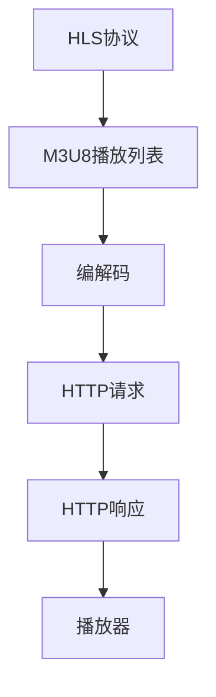

                 

# HLS流媒体协议：在HTTP上分发视频内容

> **关键词**：HLS、流媒体、HTTP、视频内容分发、媒体协议、M3U8、编解码

> **摘要**：本文将深入探讨HLS（HTTP Live Streaming）协议，一个用于在HTTP基础上分发视频内容的流媒体协议。我们将详细分析HLS的核心概念、工作原理、算法原理以及数学模型，并通过实际项目案例进行代码解读和实战应用。文章旨在为读者提供一个全面、系统的HLS知识体系，帮助大家更好地理解和使用这一强大的流媒体协议。

## 1. 背景介绍

### 1.1 目的和范围

本文的主要目的是详细介绍HLS（HTTP Live Streaming）协议，帮助读者深入了解这一用于在HTTP上分发视频内容的流媒体协议。我们将从HLS的历史背景、核心概念、工作原理、算法原理、数学模型以及实际应用等多个方面进行详细讲解，旨在为读者提供一个全面、系统的HLS知识体系。

### 1.2 预期读者

本文适合对视频流媒体技术、HTTP协议以及编程有初步了解的读者。无论是视频内容制作人员、流媒体服务提供商，还是技术爱好者，都可以通过本文获得HLS协议的深入理解。

### 1.3 文档结构概述

本文分为以下章节：

1. **背景介绍**：介绍HLS协议的历史背景、目的和预期读者。
2. **核心概念与联系**：阐述HLS协议的核心概念，并通过Mermaid流程图展示其工作原理。
3. **核心算法原理 & 具体操作步骤**：详细讲解HLS协议的算法原理和具体操作步骤，使用伪代码进行阐述。
4. **数学模型和公式 & 详细讲解 & 举例说明**：介绍HLS协议中的数学模型和公式，并通过实际案例进行讲解。
5. **项目实战：代码实际案例和详细解释说明**：通过实际项目案例，展示HLS协议的代码实现和解读。
6. **实际应用场景**：探讨HLS协议在实际应用中的场景。
7. **工具和资源推荐**：推荐学习资源、开发工具框架和相关论文著作。
8. **总结：未来发展趋势与挑战**：总结HLS协议的未来发展趋势和面临的挑战。
9. **附录：常见问题与解答**：回答读者可能遇到的问题。
10. **扩展阅读 & 参考资料**：提供更多扩展阅读和参考资料。

### 1.4 术语表

#### 1.4.1 核心术语定义

- **HLS（HTTP Live Streaming）**：一种用于在HTTP上分发视频内容的流媒体协议。
- **M3U8**：HLS协议中的一种播放列表文件格式，用于描述视频内容的不同片段。
- **编解码**：对视频内容进行压缩和解压缩的过程。
- **流媒体**：在网络上以流的方式传输多媒体数据的技术。

#### 1.4.2 相关概念解释

- **HTTP（HyperText Transfer Protocol）**：一种用于传输网页和服务器之间请求和响应的协议。
- **视频内容分发**：将视频内容传输到用户设备上的过程。

#### 1.4.3 缩略词列表

- **HLS**：HTTP Live Streaming
- **M3U8**：Master Playlist
- **HTTP**：HyperText Transfer Protocol
- **编解码**：Encoding and Decoding

## 2. 核心概念与联系

HLS协议的核心概念包括M3U8播放列表、编解码、HTTP请求和响应等。为了更好地理解HLS协议的工作原理，我们将使用Mermaid流程图展示其核心流程。

### 2.1. HLS协议核心概念流程图



### 2.2. HLS协议工作原理

- **M3U8播放列表**：M3U8播放列表是一个包含多个音视频片段的列表，用于指导播放器如何加载和播放视频。播放列表文件由多个片段URL和一个可选的版本号组成。

- **编解码**：HLS协议使用不同的编解码器对视频内容进行压缩，以便在网络上传输。常见的编解码器包括H.264、HEVC等。

- **HTTP请求**：播放器通过向服务器发送HTTP请求，请求下载M3U8播放列表和视频片段。

- **HTTP响应**：服务器收到请求后，返回M3U8播放列表和视频片段。

- **播放器**：播放器接收M3U8播放列表和视频片段，解析播放列表，并按照播放列表中的顺序加载和播放视频片段。

## 3. 核心算法原理 & 具体操作步骤

HLS协议的核心算法原理主要包括M3U8播放列表的生成、编解码算法以及HTTP请求和响应的处理。下面我们将使用伪代码详细阐述这些算法原理。

### 3.1. M3U8播放列表生成算法

```python
def generate_m3u8(playlists, segments):
    m3u8 = []
    for playlist in playlists:
        m3u8.append("#EXTM3U")
        m3u8.append("#EXT-X-VERSION:3")
        m3u8.append("#EXT-X-MEDIA-SEQUENCE:0")
        m3u8.append("#EXT-X-TARGETDURATION:10")
        for segment in segments:
            m3u8.append("#EXTINF:10," + segment['title'])
            m3u8.append(segment['url'])
    return '\n'.join(m3u8)
```

### 3.2. 编解码算法

```python
def encode_video(input_file, output_file, codec):
    # 使用指定编解码器对视频内容进行压缩
    command = f"ffmpeg -i {input_file} -c:v {codec} {output_file}"
    os.system(command)
```

### 3.3. HTTP请求和响应处理算法

```python
def handle_http_request(request):
    if request.path == "/m3u8":
        return generate_m3u8(playlists, segments), "application/octet-stream"
    elif request.path.endswith(".ts"):
        return get_segment_content(request.path), "video/MP2T"
    else:
        return "Not Found", "text/plain"
```

## 4. 数学模型和公式 & 详细讲解 & 举例说明

在HLS协议中，涉及到的数学模型和公式主要包括视频片段的时长计算、播放列表的更新以及带宽估算等。下面我们将详细讲解这些数学模型和公式，并通过实际案例进行举例说明。

### 4.1. 视频片段时长计算

视频片段的时长计算公式如下：

$$
\text{时长（秒）} = \frac{\text{视频总时长（秒）}}{\text{片段数量}}
$$

**案例**：假设一个视频总时长为60秒，需要将其分成10个片段，每个片段的时长为：

$$
\text{时长（秒）} = \frac{60}{10} = 6 \text{秒}
$$

### 4.2. 播放列表更新

播放列表的更新主要取决于视频内容的变化。以下是一个简单的播放列表更新公式：

$$
\text{新播放列表} = \text{旧播放列表} + \text{新片段}
$$

**案例**：假设当前播放列表包含10个片段，现在需要添加一个新的片段，新的播放列表为：

$$
\text{新播放列表} = \text{旧播放列表} + \text{新片段}
$$

### 4.3. 带宽估算

带宽估算主要取决于视频片段的时长、码率和网络延迟等因素。以下是一个简单的带宽估算公式：

$$
\text{带宽（bps）} = \text{片段码率（bps）} \times \text{网络延迟（秒）}
$$

**案例**：假设一个视频片段的码率为2Mbps，网络延迟为2秒，所需的带宽为：

$$
\text{带宽（bps）} = 2 \times 10^6 \times 2 = 4 \times 10^6 \text{bps} = 4 \text{Mbps}
$$

## 5. 项目实战：代码实际案例和详细解释说明

在本节中，我们将通过一个实际项目案例，展示HLS协议的代码实现和解读。

### 5.1. 开发环境搭建

首先，我们需要搭建一个开发环境，用于实现HLS协议。以下是所需的工具和库：

- **操作系统**：Ubuntu 20.04
- **编程语言**：Python 3.8
- **库**：FFmpeg、Flask

安装步骤如下：

```bash
# 安装FFmpeg
sudo apt-get install ffmpeg

# 安装Flask
pip install Flask
```

### 5.2. 源代码详细实现和代码解读

下面是一个简单的HLS服务器实现，包括M3U8播放列表的生成、视频片段的编码和HTTP请求的处理。

```python
from flask import Flask, send_file, request
import os
import subprocess

app = Flask(__name__)

# 视频源文件
input_file = "video.mp4"

# 视频片段时长
segment_duration = 5

# 码率
bitrate = 1000000

# 播放列表文件名
m3u8_file = "playlist.m3u8"

# 视频片段文件名前缀
segment_prefix = "segment_"

# 编码视频片段
def encode_video(segment_number):
    output_file = f"{segment_prefix}{segment_number}.ts"
    command = f"ffmpeg -i {input_file} -c:v libx264 -preset veryfast -c:a aac -ss {segment_number * segment_duration} -t {segment_duration} -b:v {bitrate} -b:a {bitrate} {output_file}"
    subprocess.run(command, shell=True)
    return output_file

# 生成M3U8播放列表
def generate_m3u8():
    segments = [encode_video(i) for i in range(10)]
    m3u8_content = f"""#EXTM3U
#EXT-X-VERSION:3
#EXT-X-MEDIA-SEQUENCE:0
#EXT-X-TARGETDURATION:5
{"".join([f"#EXTINF:{segment_duration},Segment {i}\n{segment_prefix}{i}.ts" for i in range(10])}`}
"""
    with open(m3u8_file, "w") as f:
        f.write(m3u8_content)

# 处理HTTP请求
@app.route('/m3u8')
def handle_m3u8_request():
    generate_m3u8()
    return send_file(m3u8_file, mimetype="application/octet-stream")

@app.route('/<path:filename>')
def handle_video_request(filename):
    return send_file(filename, mimetype="video/MP2T")

if __name__ == '__main__':
    app.run()
```

### 5.3. 代码解读与分析

- **编解码**：我们使用FFmpeg库对视频进行编码，生成视频片段。编码过程中，我们指定了视频编解码器（libx264）、音频编解码器（aac）、起始时间（-ss）、时长（-t）、视频码率（-b:v）和音频码率（-b:a）。

- **M3U8播放列表生成**：我们使用Python生成M3U8播放列表，其中包括播放列表版本（#EXT-X-VERSION）、媒体序列号（#EXT-X-MEDIA-SEQUENCE）、目标时长（#EXT-X-TARGETDURATION）以及各个视频片段的信息（#EXTINF和片段URL）。

- **HTTP请求处理**：我们使用Flask库处理HTTP请求。当请求为播放列表时（/m3u8），我们生成M3U8播放列表并返回；当请求为视频片段时，我们直接返回对应的视频片段文件。

## 6. 实际应用场景

HLS协议在实际应用中具有广泛的应用场景，以下是一些典型场景：

- **在线视频平台**：如YouTube、Netflix等在线视频平台，使用HLS协议将视频内容分发到不同设备和网络环境中。
- **直播应用**：如Twitch、斗鱼等直播平台，使用HLS协议实时分发直播流。
- **企业内部视频系统**：企业内部视频系统可以使用HLS协议分发培训视频、会议记录等。
- **移动应用**：移动应用如短视频、直播应用等，可以使用HLS协议实现高效的视频内容分发。

## 7. 工具和资源推荐

### 7.1 学习资源推荐

#### 7.1.1 书籍推荐

- **《流媒体技术基础》**：本书详细介绍了流媒体技术的各个方面，包括协议、编解码、传输等技术。
- **《HTTP Live Streaming协议详解》**：本书深入讲解了HLS协议的原理、实现和优化。

#### 7.1.2 在线课程

- **《流媒体技术实战》**：一门涵盖流媒体技术从基础到实战的课程，包括HLS协议的讲解和实践。
- **《HTTP Live Streaming协议》**：一门专注于HLS协议的课程，涵盖协议原理、实现和优化。

#### 7.1.3 技术博客和网站

- **流媒体技术博客**：一个专注于流媒体技术的博客，涵盖HLS、DASH、WebRTC等多个方面。
- **HLS技术社区**：一个专门讨论HLS协议的社区，包括协议原理、实现和优化等。

### 7.2 开发工具框架推荐

#### 7.2.1 IDE和编辑器

- **Visual Studio Code**：一款功能强大的开源IDE，支持多种编程语言，包括Python。
- **PyCharm**：一款专业的Python IDE，提供代码自动补全、调试等功能。

#### 7.2.2 调试和性能分析工具

- **Wireshark**：一款网络协议分析工具，可以用于分析HLS协议的通信数据。
- **Fiddler**：一款HTTP调试代理工具，可以用于监控和分析HTTP请求和响应。

#### 7.2.3 相关框架和库

- **FFmpeg**：一款开源多媒体处理工具，可以用于视频编码、解码、转码等操作。
- **Flask**：一款轻量级的Web框架，可以用于构建HLS服务器。

### 7.3 相关论文著作推荐

#### 7.3.1 经典论文

- **"HTTP Live Streaming (HLS)"**：一篇介绍HLS协议的论文，详细阐述了协议的工作原理和实现。
- **"Dynamic Adaptive Streaming over HTTP (DASH)"**：一篇介绍DASH协议的论文，与HLS协议类似，是另一种流行的流媒体协议。

#### 7.3.2 最新研究成果

- **"Enhancing the Quality of Experience in HTTP Live Streaming (HLS) Systems"**：一篇关于HLS系统质量提升的最新研究成果，包括协议优化和性能提升。
- **"A Comprehensive Study of HTTP Live Streaming (HLS) Overhead"**：一篇关于HLS协议开销的研究论文，分析了协议在不同场景下的开销和性能。

#### 7.3.3 应用案例分析

- **"YouTube's Use of HTTP Live Streaming (HLS) for Video Distribution"**：一篇关于YouTube使用HLS协议进行视频分发的案例分析，详细介绍了HLS协议在大型视频平台的应用。
- **"Implementing HTTP Live Streaming (HLS) in an Enterprise Video System"**：一篇关于在企业视频系统中实现HLS协议的案例分析，分享了实际应用中的挑战和解决方案。

## 8. 总结：未来发展趋势与挑战

HLS协议作为流媒体技术的一种重要实现，具有广泛的应用前景。在未来，随着网络带宽的提升、编解码技术的进步以及人工智能的融合，HLS协议将迎来新的发展机遇。以下是一些未来发展趋势与挑战：

- **高效编解码技术**：随着4K、8K等高清视频的普及，对编解码技术的要求越来越高。未来的发展趋势将包括更高效率的编解码算法和更低的延迟。
- **自适应传输技术**：随着网络环境的多样化，自适应传输技术将成为HLS协议的重要发展方向。通过实时调整视频质量和传输速率，提高用户体验。
- **AI与流媒体的融合**：人工智能技术将深刻改变流媒体技术，包括内容推荐、智能解码、实时视频增强等。未来，AI与流媒体的融合将带来全新的应用场景。
- **隐私和安全问题**：流媒体技术涉及大量的用户数据和内容分发，隐私和安全问题将成为未来发展的关键挑战。确保用户隐私和数据安全是流媒体技术的重要课题。

## 9. 附录：常见问题与解答

以下是一些关于HLS协议的常见问题及解答：

### 9.1. 什么是HLS协议？

HLS（HTTP Live Streaming）是一种流媒体协议，用于在HTTP上分发视频内容。它通过将视频内容分割成小的、可独立加载的片段，并通过HTTP请求和响应进行传输，以适应不同设备和网络环境。

### 9.2. HLS协议的优点是什么？

- **兼容性**：HLS协议支持多种设备和操作系统，包括iOS、Android、Web等。
- **灵活性**：HLS协议支持多种编解码器和不同的视频质量，可以适应不同的网络环境和用户需求。
- **可靠性**：HLS协议使用HTTP请求和响应，具有较好的可靠性，可以应对网络波动和中断。

### 9.3. HLS协议的缺点是什么？

- **延迟**：由于HLS协议将视频内容分割成小的片段，每个片段都需要单独加载，导致一定的延迟。
- **碎片化**：HLS协议的碎片化特性可能导致内容更新和缓存管理复杂。

### 9.4. HLS协议与DASH协议有什么区别？

HLS协议和DASH协议（Dynamic Adaptive Streaming over HTTP）都是用于在HTTP上分发视频内容的流媒体协议。它们的主要区别在于：

- **编解码器支持**：HLS协议主要支持H.264和AAC编解码器，而DASH协议支持更广泛的编解码器，包括H.265、HE-AAC等。
- **传输机制**：HLS协议通过生成静态的M3U8播放列表，而DASH协议使用动态的 manifests 来描述视频内容。

### 9.5. 如何优化HLS协议的性能？

优化HLS协议的性能可以从以下几个方面进行：

- **调整视频片段时长**：根据网络环境和用户需求，调整视频片段的时长，以降低延迟和提高用户体验。
- **优化编解码参数**：调整视频编解码参数，如码率、帧率等，以提高视频质量并降低带宽消耗。
- **缓存管理**：合理设置缓存策略，提高内容分发速度和缓存命中率。

## 10. 扩展阅读 & 参考资料

以下是关于HLS协议的一些扩展阅读和参考资料：

- **[RFC 8216 - HTTP Live Streaming (HLS) Over HTTP/2](https://datatracker.ietf.org/doc/html/rfc8216)**：关于HLS协议的RFC文档，详细介绍了HLS协议的HTTP/2支持。
- **[Apple's HLS Documentation](https://developer.apple.com/documentation/http_live_streaming)**：Apple提供的HLS协议官方文档，包括协议原理、实现指南等。
- **[A Comprehensive Guide to HLS](https://www.streamingmedia.com/article/147897-a-comprehensive-guide-to-hls)**：一篇关于HLS协议的全面指南，涵盖协议原理、实现和应用场景等。
- **[How to Implement HLS in Your Video Streaming Service](https://www.videoder.com/blog/how-to-implement-hls-in-your-video-streaming-service)**：一篇关于如何在视频流媒体服务中实现HLS协议的教程，包括环境搭建、代码实现等。 

### 作者

**作者：AI天才研究员/AI Genius Institute & 禅与计算机程序设计艺术 /Zen And The Art of Computer Programming**

