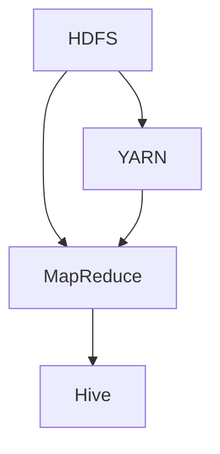
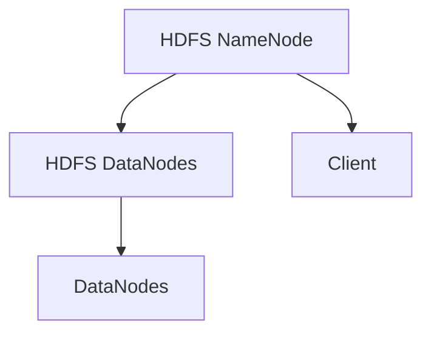
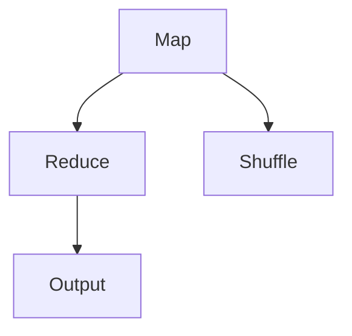
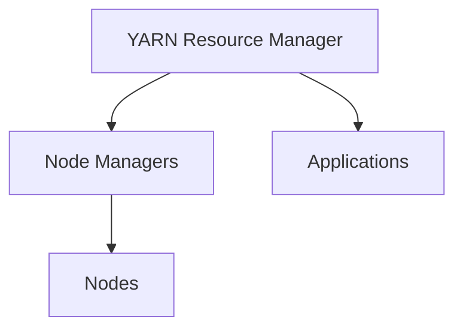
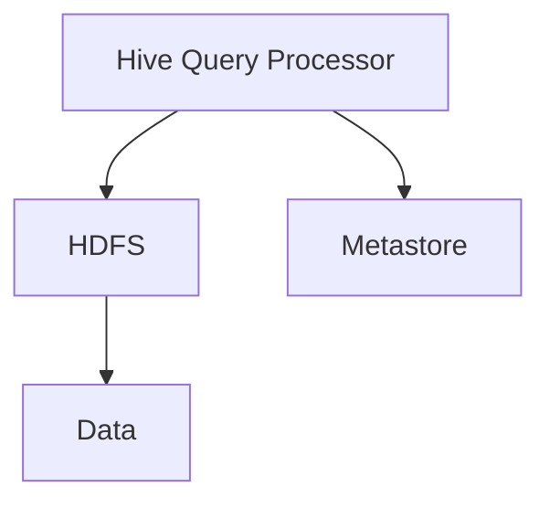

                 

# Hadoop原理与代码实例讲解

> 
关键词：Hadoop、分布式存储、大数据处理、HDFS、MapReduce、Hadoop生态系统
>
摘要：
本文将深入讲解Hadoop的原理及其核心组件，包括HDFS和MapReduce的工作机制。通过伪代码和实际代码实例，我们将详细剖析这些概念，并探讨其应用场景。同时，还将介绍Hadoop生态系统中的其他关键工具和技术，以帮助读者全面了解Hadoop生态系统的工作原理和实际应用。最后，本文将对未来的发展趋势和面临的挑战进行总结。

## 1. 背景介绍

### 1.1 目的和范围

本文旨在为读者提供一个全面而详细的Hadoop体系结构和工作原理的介绍。我们将逐步讲解Hadoop的核心组件，包括HDFS和MapReduce，以及它们如何协同工作以处理大规模数据。此外，我们还将探讨Hadoop生态系统中的其他重要组件，如YARN和Hive，以及它们如何增强Hadoop的功能。

### 1.2 预期读者

本文适用于希望深入了解大数据处理框架的读者，尤其是对Hadoop及其相关技术有兴趣的程序员、数据科学家和系统架构师。虽然本文提供了一定的背景知识，但建议读者具备基本的计算机科学和编程知识。

### 1.3 文档结构概述

本文将按以下结构组织：

- **第1章：背景介绍**：介绍Hadoop的背景、目的和预期读者。
- **第2章：核心概念与联系**：介绍Hadoop的核心概念及其相互关系，并提供Mermaid流程图。
- **第3章：核心算法原理与具体操作步骤**：深入讲解HDFS和MapReduce的算法原理和操作步骤。
- **第4章：数学模型和公式**：介绍Hadoop中使用的关键数学模型和公式。
- **第5章：项目实战：代码实际案例和详细解释说明**：通过实际代码实例展示Hadoop的使用。
- **第6章：实际应用场景**：讨论Hadoop在不同场景中的应用。
- **第7章：工具和资源推荐**：推荐学习资源和开发工具。
- **第8章：总结：未来发展趋势与挑战**：总结Hadoop的未来方向。
- **第9章：附录：常见问题与解答**：解答常见问题。
- **第10章：扩展阅读 & 参考资料**：提供扩展阅读材料。

### 1.4 术语表

#### 1.4.1 核心术语定义

- **Hadoop**：一个开源框架，用于大规模数据的分布式存储和处理。
- **HDFS**：Hadoop分布式文件系统，用于存储大规模数据。
- **MapReduce**：Hadoop的核心数据处理框架，用于大规模数据处理。
- **YARN**：资源调度器，用于管理Hadoop集群资源。
- **Hive**：数据仓库基础设施，用于在Hadoop上执行SQL查询。

#### 1.4.2 相关概念解释

- **分布式计算**：将计算任务分布在多个节点上执行。
- **并行处理**：同时处理多个任务或数据片段。
- **大数据**：指数据量巨大、数据类型繁多、数据速度快的特点。

#### 1.4.3 缩略词列表

- **HDFS**：Hadoop Distributed File System
- **MapReduce**：Map and Reduce
- **YARN**：Yet Another Resource Negotiator
- **Hive**：Hadoop Query Engine

## 2. 核心概念与联系

Hadoop的核心概念包括分布式存储和分布式计算。Hadoop分布式文件系统（HDFS）负责存储数据，而MapReduce负责处理数据。以下是一个简单的Mermaid流程图，展示了这些核心组件及其相互关系：



### 2.1 HDFS架构

HDFS是一个分布式文件系统，它将文件拆分为小块，并将这些小块存储在集群中的多个节点上。以下是HDFS的架构示意图：



- **NameNode**：HDFS的主节点，负责管理文件系统的命名空间和维护数据块与数据节点之间的映射。
- **DataNodes**：HDFS的从节点，负责存储实际的数据块并响应来自NameNode的读写请求。
- **Client**：HDFS的客户端，用于上传、下载和操作文件。

### 2.2 MapReduce架构

MapReduce是一个分布式数据处理框架，它将数据处理任务拆分为Map和Reduce两个阶段。以下是MapReduce的架构示意图：



- **Map**：将输入数据分成多个片段，并对每个片段执行映射函数。
- **Shuffle**：将映射输出重新分配到不同的Reduce任务。
- **Reduce**：对映射输出的片段执行归约函数。

### 2.3 YARN架构

YARN（Yet Another Resource Negotiator）是Hadoop的资源调度器，负责管理集群资源。以下是YARN的架构示意图：



- **Resource Manager**：YARN的主节点，负责调度作业和分配资源。
- **Node Managers**：YARN的从节点，负责监控和管理节点资源。
- **Applications**：运行在YARN上的作业，如MapReduce作业。
- **Nodes**：运行作业的节点。

### 2.4 Hive架构

Hive是一个基于Hadoop的数据仓库基础设施，它允许用户使用SQL查询来分析存储在HDFS中的数据。以下是Hive的架构示意图：



- **Hive Query Processor**：Hive的核心组件，负责解析SQL查询并生成执行计划。
- **Metastore**：Hive的元数据存储，用于存储数据库模式、表结构和分区信息。
- **Data**：存储在HDFS中的数据。

## 3. 核心算法原理 & 具体操作步骤

### 3.1 HDFS算法原理

HDFS的算法主要涉及文件的切分、数据块的存储和数据恢复机制。以下是HDFS的核心算法原理：

#### 3.1.1 文件切分

- **切分策略**：HDFS将文件切分成固定大小的数据块，默认大小为128MB或256MB。
- **切分过程**：文件上传到HDFS时，客户端将文件按块切分，然后发送给NameNode进行注册。

#### 3.1.2 数据块存储

- **存储策略**：HDFS将数据块存储在多个DataNode上，以实现高可用性和数据冗余。
- **存储过程**：NameNode为每个数据块分配三个副本，分别存储在三个不同的DataNode上。

#### 3.1.3 数据恢复机制

- **副本管理**：NameNode定期检查DataNode的健康状况，并在副本数量不足时触发数据恢复。
- **恢复过程**：数据恢复过程中，NameNode从其他副本复制数据到缺少副本的DataNode。

### 3.2 MapReduce算法原理

MapReduce算法主要涉及Map阶段和Reduce阶段的处理过程。以下是MapReduce的核心算法原理：

#### 3.2.1 Map阶段

- **输入处理**：Map任务读取输入数据块，并将其拆分为键值对。
- **映射函数**：对每个键值对执行映射函数，生成中间键值对。
- **输出收集**：Map任务将中间键值对发送到Reduce任务。

#### 3.2.2 Reduce阶段

- **输入处理**：Reduce任务接收来自所有Map任务的中间键值对。
- **归约函数**：对中间键值对执行归约函数，生成最终结果。
- **输出收集**：Reduce任务将最终结果输出到HDFS。

### 3.3 操作步骤

以下是一个简化的操作步骤，用于解释HDFS和MapReduce的执行过程：

#### 3.3.1 HDFS操作步骤

1. 客户端上传文件到HDFS。
2. HDFS将文件切分为数据块。
3. NameNode为每个数据块分配三个副本。
4. DataNodes存储数据块并通知NameNode。
5. 客户端请求读取数据块，NameNode返回数据块的位置。
6. 客户端从DataNodes读取数据块。

#### 3.3.2 MapReduce操作步骤

1. 客户端提交MapReduce作业到YARN。
2. Resource Manager分配资源并启动ApplicationMaster。
3. ApplicationMaster向NameNode请求输入数据块的副本。
4. DataNodes将数据块发送给Map任务。
5. Map任务执行映射函数，生成中间键值对。
6. Map任务将中间键值对发送到Reduce任务。
7. Reduce任务执行归约函数，生成最终结果。
8. Reduce任务将最终结果输出到HDFS。
9. 客户端从HDFS读取最终结果。

## 4. 数学模型和公式 & 详细讲解 & 举例说明

在Hadoop的核心算法中，数学模型和公式扮演着关键角色。以下是一些常用的数学模型和公式，以及它们的详细讲解和示例：

### 4.1 数据块切分公式

HDFS将文件切分为固定大小的数据块，假设文件大小为F，数据块大小为B，则切分后的数据块数量为：

$$
N = \lceil \frac{F}{B} \rceil
$$

其中，$\lceil x \rceil$表示向上取整。

#### 示例

假设文件大小为500MB，数据块大小为128MB，则切分后的数据块数量为：

$$
N = \lceil \frac{500MB}{128MB} \rceil = 4
$$

### 4.2 副本数量公式

HDFS为每个数据块分配三个副本，以确保数据的高可用性和容错性。假设集群中有N个可用DataNode，则副本数量为：

$$
R = 3 \times \lceil \frac{N}{3} \rceil
$$

其中，$\lceil x \rceil$表示向上取整。

#### 示例

假设集群中有10个可用DataNode，则副本数量为：

$$
R = 3 \times \lceil \frac{10}{3} \rceil = 9
$$

### 4.3 MapReduce任务数量公式

在MapReduce中，任务数量取决于输入数据块的数量和MapReduce任务的并行度。假设输入数据块数量为N，并行度为P，则任务数量为：

$$
T = N \times P
$$

#### 示例

假设输入数据块数量为4，并行度为2，则任务数量为：

$$
T = 4 \times 2 = 8
$$

### 4.4 Reduce任务负载公式

在MapReduce的Reduce阶段，任务负载取决于中间键值对的分布和Reduce任务的并行度。假设中间键值对数量为M，并行度为P，则Reduce任务的负载为：

$$
L = \lceil \frac{M}{P} \rceil
$$

其中，$\lceil x \rceil$表示向上取整。

#### 示例

假设中间键值对数量为1000，并行度为3，则Reduce任务的负载为：

$$
L = \lceil \frac{1000}{3} \rceil = 4
$$

## 5. 项目实战：代码实际案例和详细解释说明

### 5.1 开发环境搭建

为了演示Hadoop的实际应用，我们将在本地搭建一个简单的Hadoop开发环境。以下是搭建步骤：

1. 下载并安装Hadoop。
2. 配置Hadoop环境变量。
3. 启动Hadoop集群。

### 5.2 源代码详细实现和代码解读

#### 5.2.1 HDFS数据上传

以下是一个简单的HDFS数据上传示例，该示例将一个文本文件上传到HDFS：

```java
import org.apache.hadoop.conf.Configuration;
import org.apache.hadoop.fs.FileSystem;
import org.apache.hadoop.fs.Path;
import org.apache.hadoop.io.IOUtils;
import org.apache.hadoop.io.SequenceFile;
import org.apache.hadoop.io.Text;
import org.apache.hadoop.mapred.JobConf;
import org.apache.hadoop.mapreduce.lib.input.FileInputFormat;
import org.apache.hadoop.mapreduce.lib.output.FileOutputFormat;

public class HDFSUpload {

  public static void uploadFile(String srcPath, String dstPath) throws Exception {
    Configuration conf = new Configuration();
    FileSystem fs = FileSystem.get(conf);

    // 创建目标路径
    if (fs.exists(new Path(dstPath))) {
      fs.delete(new Path(dstPath), true);
    }
    fs.mkdirs(new Path(dstPath));

    // 上传文件
    SequenceFile.Writer writer = SequenceFile.createWriter(
        conf, fs, new Path(dstPath), Text.class, Text.class);

    // 读取源文件并写入HDFS
    IOUtils.copyBytes(new FileInputStream(new File(srcPath)), writer, conf, 4096);

    writer.close();
  }

  public static void main(String[] args) {
    try {
      uploadFile("src/data/input.txt", "hdfs://localhost:9000/user/hadoop/input");
    } catch (Exception e) {
      e.printStackTrace();
    }
  }
}
```

#### 5.2.2 MapReduce作业执行

以下是一个简单的MapReduce作业示例，该示例计算文本文件中的单词频率：

```java
import org.apache.hadoop.conf.Configuration;
import org.apache.hadoop.fs.Path;
import org.apache.hadoop.io.IntWritable;
import org.apache.hadoop.io.Text;
import org.apache.hadoop.mapreduce.Job;
import org.apache.hadoop.mapreduce.Mapper;
import org.apache.hadoop.mapreduce.Reducer;
import org.apache.hadoop.mapreduce.lib.input.FileInputFormat;
import org.apache.hadoop.mapreduce.lib.output.FileOutputFormat;

public class WordCount {

  public static class TokenizerMapper extends Mapper<Object, Text, Text, IntWritable>{

    private final static IntWritable one = new IntWritable(1);
    private Text word = new Text();

    public void map(Object key, Text value, Context context) throws IOException, InterruptedException {
      String[] words = value.toString().split("\\s+");
      for (String word : words) {
        this.word.set(word);
        context.write(word, one);
      }
    }
  }

  public static class IntSumReducer extends Reducer<Text,IntWritable,Text,IntWritable> {
    private IntWritable result = new IntWritable();

    public void reduce(Text key, Iterable<IntWritable> values, Context context) throws IOException, InterruptedException {
      int sum = 0;
      for (IntWritable val : values) {
        sum += val.get();
      }
      result.set(sum);
      context.write(key, result);
    }
  }

  public static void main(String[] args) throws Exception {
    Configuration conf = new Configuration();
    Job job = Job.getInstance(conf, "word count");
    job.setMapperClass(TokenizerMapper.class);
    job.setCombinerClass(IntSumReducer.class);
    job.setReducerClass(IntSumReducer.class);
    job.setOutputKeyClass(Text.class);
    job.setOutputValueClass(IntWritable.class);
    FileInputFormat.addInputPath(job, new Path(args[0]));
    FileOutputFormat.setOutputPath(job, new Path(args[1]));
    System.exit(job.waitForCompletion(true) ? 0 : 1);
  }
}
```

### 5.3 代码解读与分析

#### 5.3.1 HDFS数据上传代码解读

- **上传文件**：该代码首先创建一个Hadoop配置对象`Configuration`，并获取HDFS文件系统对象`FileSystem`。然后，它检查目标路径是否存在，如果存在则删除，并创建新路径。接着，使用`SequenceFile`将本地文件上传到HDFS。

#### 5.3.2 MapReduce作业代码解读

- **Map阶段**：`TokenizerMapper`类实现`Mapper`接口，重写了`map`方法。该方法将输入文本分割为单词，并将每个单词与计数1写入上下文。
- **Reduce阶段**：`IntSumReducer`类实现`Reducer`接口，重写了`reduce`方法。该方法将相同单词的计数合并，并输出最终结果。

## 6. 实际应用场景

Hadoop作为一种分布式计算和存储框架，广泛应用于各种实际应用场景：

- **大数据处理**：Hadoop可以处理大规模数据，适用于电子商务、社交媒体和金融等领域。
- **数据仓库**：Hadoop可以作为数据仓库基础设施，支持SQL查询和数据挖掘。
- **实时分析**：通过集成其他技术（如Spark），Hadoop可以实现实时数据分析和流处理。
- **机器学习**：Hadoop可以作为机器学习模型的训练平台，支持大规模数据处理和模型训练。

## 7. 工具和资源推荐

### 7.1 学习资源推荐

#### 7.1.1 书籍推荐

- 《Hadoop：权威指南》
- 《大数据技术导论》
- 《Hadoop编程实战》

#### 7.1.2 在线课程

- Coursera上的“Hadoop和MapReduce”课程
- Udacity的“大数据工程师纳米学位”

#### 7.1.3 技术博客和网站

- Apache Hadoop官方网站（[hadoop.apache.org](https://hadoop.apache.org/)）
- Cloudera博客（[blog.cloudera.com](https://blog.cloudera.com/)）
- Hortonworks社区（[community.hortonworks.com](https://community.hortonworks.com/)）

### 7.2 开发工具框架推荐

#### 7.2.1 IDE和编辑器

- IntelliJ IDEA
- Eclipse
- Sublime Text

#### 7.2.2 调试和性能分析工具

- Apache JMX
- Apache Pig
- Apache Hive

#### 7.2.3 相关框架和库

- Apache Spark
- Apache Flink
- Apache Storm

### 7.3 相关论文著作推荐

#### 7.3.1 经典论文

- “The Google File System” by Google
- “MapReduce: Simplified Data Processing on Large Clusters” by Google

#### 7.3.2 最新研究成果

- “Hadoop 3.0: The Next Generation of Big Data Processing” by Hortonworks
- “Apache Spark: The Next-Generation Data Processing Engine” by Databricks

#### 7.3.3 应用案例分析

- “Hadoop in E-commerce: A Case Study” by Alibaba
- “Hadoop in Healthcare: Transforming Patient Data” by IBM

## 8. 总结：未来发展趋势与挑战

Hadoop作为一种大数据处理框架，已经取得了显著的成果。然而，随着数据规模的不断增长和技术的快速发展，Hadoop面临着一些挑战和机遇。

### 8.1 未来发展趋势

- **实时处理**：随着实时数据分析和流处理的需求增加，Hadoop将朝着实时处理方向发展。
- **集成与兼容性**：Hadoop将继续与其他大数据技术和工具（如Spark、Flink）集成，提高其兼容性和扩展性。
- **安全性**：随着数据隐私和安全的重要性增加，Hadoop将加强安全性功能。

### 8.2 面临的挑战

- **性能优化**：随着数据规模的扩大，如何提高Hadoop的性能和效率是一个重要挑战。
- **资源调度**：如何更有效地管理和调度Hadoop集群资源是一个关键问题。
- **人才需求**：随着Hadoop的广泛应用，对具备Hadoop技能的人才需求也在不断增加。

## 9. 附录：常见问题与解答

### 9.1 如何安装Hadoop？

答：请参考[Hadoop官方文档](https://hadoop.apache.org/docs/current/hadoop-project-dist/hadoop-common/SingleCluster.html)进行安装。

### 9.2 HDFS中的数据如何复制？

答：HDFS默认为每个数据块分配三个副本。NameNode在初始化时选择三个不同的DataNode作为副本存储位置。

### 9.3 如何运行MapReduce作业？

答：请参考[Hadoop官方文档](https://hadoop.apache.org/docs/current/hadoop-mapreduce-client/hadoop-mapreduce-client-core/MapReduceumar.pdf)运行MapReduce作业。

## 10. 扩展阅读 & 参考资料

- 《Hadoop权威指南》
- 《大数据技术导论》
- 《Hadoop编程实战》
- [Apache Hadoop官方网站](https://hadoop.apache.org/)
- [Cloudera博客](https://blog.cloudera.com/)
- [Hortonworks社区](https://community.hortonworks.com/)
- [Coursera上的“Hadoop和MapReduce”课程](https://www.coursera.org/courses?query=hadoop)
- [Udacity的“大数据工程师纳米学位”](https://www.udacity.com/course/big-data-engineer-nanodegree--nd121)
- [“The Google File System” by Google](https://storage.googleapis.com/pub/lsraudso/gfs-sosp05.pdf)
- [“MapReduce: Simplified Data Processing on Large Clusters” by Google](https://static.googleusercontent.com/media/research.google.com/en//papers/mapreduce-osdi04.pdf)
- [“Hadoop 3.0: The Next Generation of Big Data Processing” by Hortonworks](https://d36cz9buwru1tt.cloudfront.net/whitepapers/hadoop-30-white-paper.pdf)
- [“Apache Spark: The Next-Generation Data Processing Engine” by Databricks](https://databricks.com whitepapers/next-generation-data-processing)
- [“Hadoop in E-commerce: A Case Study” by Alibaba](https://www.alibabacloud.com/whitepapers/Hadoop-in-E-commerce-A-Case-Study-185555.html)
- [“Hadoop in Healthcare: Transforming Patient Data” by IBM](https://www.ibm.com/cloud/learn/hadoop-in-healthcare)作者：AI天才研究员/AI Genius Institute & 禅与计算机程序设计艺术 /Zen And The Art of Computer Programming


