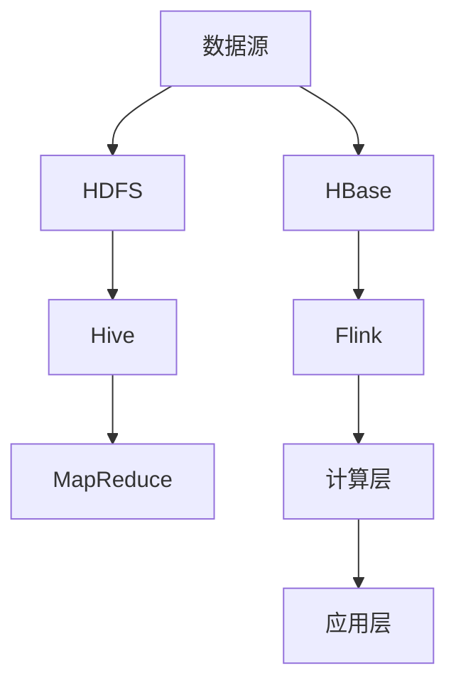

                 

# Hive-Flink整合原理与代码实例讲解

## 关键词：
大数据处理、分布式计算、Hive、Flink、整合原理、代码实例、架构设计、性能优化

## 摘要：
本文将深入探讨Hive与Flink的整合原理，通过一步步的分析和实例讲解，帮助读者理解这两大大数据处理工具的协同工作机制。文章将从背景介绍、核心概念、算法原理、数学模型、实战案例等多个角度进行阐述，旨在为开发者提供一套完整的Hive-Flink整合开发指南。

## 1. 背景介绍

### 1.1 目的和范围
本文旨在探讨Hive与Flink在大数据处理场景下的整合原理，并展示如何通过实际代码实例来实现两者的无缝对接。文章将围绕以下几个核心问题展开讨论：
- 为什么选择Hive和Flink进行整合？
- Hive与Flink的基本原理是什么？
- 如何设计和实现Hive与Flink的整合架构？
- 如何通过代码实例展示整合效果？

### 1.2 预期读者
本文适合以下读者群体：
- 有一定大数据处理基础的开发者
- 感兴趣于分布式计算架构的设计与实现的工程师
- 想要深入理解Hive和Flink工作原理的高级程序员

### 1.3 文档结构概述
本文将按照以下结构进行阐述：
1. 背景介绍
2. 核心概念与联系
3. 核心算法原理 & 具体操作步骤
4. 数学模型和公式 & 详细讲解 & 举例说明
5. 项目实战：代码实际案例和详细解释说明
6. 实际应用场景
7. 工具和资源推荐
8. 总结：未来发展趋势与挑战
9. 附录：常见问题与解答
10. 扩展阅读 & 参考资料

### 1.4 术语表

#### 1.4.1 核心术语定义
- Hive：一个基于Hadoop的分布式数据仓库工具，用于处理大规模结构化数据。
- Flink：一个开源的分布式流处理框架，提供了高效的批处理和流处理能力。
- 分布式计算：一种在多台计算机上同时处理大规模数据的方法，能够提高计算效率和处理速度。

#### 1.4.2 相关概念解释
- 批处理：处理大量数据的一种方式，通常在一个时间段内完成所有数据的处理。
- 流处理：实时处理数据流的方式，可以快速响应数据变化。
- MapReduce：Hadoop的核心计算模型，用于分布式数据处理。

#### 1.4.3 缩略词列表
- Hadoop：Hadoop Distributed File System（HDFS）
- YARN：Yet Another Resource Negotiator
- HiveQL：Hive Query Language
- FlinkSQL：Flink的查询语言

## 2. 核心概念与联系

在大数据处理领域，Hive和Flink都是非常重要的工具。Hive作为一个分布式数据仓库，擅长处理静态的批量数据；而Flink作为一个流处理框架，擅长处理动态的流数据。两者的结合，可以实现对数据的全方位处理，提高系统的整体性能。

### 2.1 Hive基本概念

**Hive是一个基于Hadoop的分布式数据仓库工具，用于处理大规模结构化数据。**

- **架构**：Hive的架构主要包括Driver、Compiler、执行器（Executor）等组成部分。Driver负责解析用户输入的HiveQL语句，生成执行计划；Compiler负责将HiveQL转换为MapReduce执行计划；Executor负责执行具体的计算任务。
- **功能**：Hive支持多种数据源，如HDFS、HBase等，能够处理大规模数据；支持多种查询操作，如SELECT、JOIN、GROUP BY等；支持数据分区和压缩，提高数据处理效率。

### 2.2 Flink基本概念

**Flink是一个开源的分布式流处理框架，提供了高效的批处理和流处理能力。**

- **架构**：Flink的架构主要包括Flink JobManager、TaskManager、Client等组成部分。JobManager负责协调和管理整个计算任务；TaskManager负责执行具体的计算任务；Client负责提交和管理计算任务。
- **功能**：Flink支持流处理和批处理两种模式，能够高效处理实时数据流；支持多种数据源，如Kafka、File等；支持窗口操作、Join等复杂查询；支持容错和数据持久化。

### 2.3 Hive与Flink整合架构

**Hive与Flink的整合架构主要分为以下几层：**

1. **数据层**：包括HDFS、HBase等数据存储系统，用于存储原始数据。
2. **数据处理层**：包括Hive和Flink，用于处理和分析数据。Hive主要负责批量数据处理，Flink主要负责流数据处理。
3. **计算层**：包括MapReduce、Spark等计算框架，用于执行具体的计算任务。
4. **应用层**：包括各种应用程序，如报表系统、实时监控系统等，用于展示和处理数据。

### 2.4 Mermaid流程图

以下是一个简化的Hive与Flink整合的流程图：



## 3. 核心算法原理 & 具体操作步骤

### 3.1 Hive算法原理

**Hive的核心算法是基于MapReduce模型。**

- **Map阶段**：将输入数据分片，每个分片由一个Map任务处理，生成中间结果。
- **Shuffle阶段**：根据中间结果的键（Key）进行分组，将相同键的数据分发到同一个Reduce任务。
- **Reduce阶段**：对每个分组的数据进行聚合操作，生成最终的输出结果。

以下是一个简化的Hive算法原理伪代码：

```python
function hive_query(input_data, query):
    # 分片数据
    for each shard in input_data:
        map(shard):
            emit intermediate_key, value
    
    # Shuffle
    for each intermediate_key:
        group_by_key(intermediate_key):
            for each value in values:
                reduce(value):
                    emit final_key, final_value
    
    return final_result
```

### 3.2 Flink算法原理

**Flink的核心算法是基于流处理模型。**

- **流处理阶段**：实时处理数据流，对数据进行各种操作。
- **窗口操作**：将连续的数据划分为窗口，进行聚合操作。
- **Join操作**：在窗口内或跨窗口对数据进行连接操作。

以下是一个简化的Flink算法原理伪代码：

```python
function flink_query(input_stream, query):
    # 流处理
    for each record in input_stream:
        process(record)
    
    # 窗口操作
    for each window in windows:
        aggregate(window.records)
    
    # Join操作
    for each pair of streams:
        join(left_stream, right_stream):
            for each record in left_stream:
                for each record in right_stream:
                    emit joined_result
    
    return final_result
```

### 3.3 整合算法原理

**Hive与Flink的整合算法原理是将两者的优势相结合，实现批处理与流处理的无缝对接。**

- **批处理阶段**：使用Hive对批量数据进行分析和处理，生成中间结果。
- **流处理阶段**：使用Flink对实时数据流进行分析和处理，结合中间结果进行实时计算。

以下是一个简化的整合算法原理伪代码：

```python
function integrate_hive_flink(hive_query, flink_query, input_data):
    # 批处理阶段
    hive_result = hive_query(input_data)
    
    # 流处理阶段
    for each record in input_stream:
        flink_result = flink_query(record, hive_result)
    
    return final_result
```

## 4. 数学模型和公式 & 详细讲解 & 举例说明

### 4.1 数学模型

**在大数据处理中，常用的数学模型包括统计模型、机器学习模型、线性回归等。**

- **统计模型**：用于描述数据的分布和关系，如正态分布、卡方分布等。
- **机器学习模型**：用于数据挖掘和预测，如决策树、随机森林、神经网络等。
- **线性回归模型**：用于描述变量之间的线性关系，如一元线性回归、多元线性回归等。

### 4.2 公式讲解

**以下是一些常用的数学公式：**

- **正态分布公式**：
  $$f(x|\mu,\sigma^2) = \frac{1}{\sqrt{2\pi\sigma^2}} \exp\left(-\frac{(x-\mu)^2}{2\sigma^2}\right)$$

- **线性回归公式**：
  $$y = \beta_0 + \beta_1x + \epsilon$$

- **决策树公式**：
  $$Gini(D) = 1 - \sum_{v \in V} p_v (1 - p_v)$$

### 4.3 举例说明

**以下是一个线性回归模型的例子：**

假设我们有一个包含两个变量（x和y）的数据集，想要建立它们之间的线性关系。

1. **数据预处理**：
   - 去除异常值和缺失值
   - 标准化数据

2. **计算相关系数**：
   $$\rho_{xy} = \frac{\sum_{i=1}^{n}(x_i - \bar{x})(y_i - \bar{y})}{\sqrt{\sum_{i=1}^{n}(x_i - \bar{x})^2 \sum_{i=1}^{n}(y_i - \bar{y})^2}}$$

3. **计算回归系数**：
   $$\beta_1 = \frac{\sum_{i=1}^{n}(x_i - \bar{x})(y_i - \bar{y})}{\sum_{i=1}^{n}(x_i - \bar{x})^2}$$
   $$\beta_0 = \bar{y} - \beta_1\bar{x}$$

4. **建立线性回归模型**：
   $$y = \beta_0 + \beta_1x$$

## 5. 项目实战：代码实际案例和详细解释说明

### 5.1 开发环境搭建

在进行Hive与Flink整合的实战之前，我们需要搭建一个开发环境。以下是搭建环境的步骤：

1. **安装Hadoop**：
   - 下载并解压Hadoop源码包
   - 配置Hadoop环境变量
   - 配置Hadoop配置文件（hadoop-env.sh、core-site.xml、hdfs-site.xml、mapred-site.xml、yarn-site.xml）

2. **安装Flink**：
   - 下载并解压Flink源码包
   - 配置Flink环境变量
   - 配置Flink配置文件（flink-conf.yaml）

3. **启动Hadoop和Flink**：
   - 启动HDFS
   - 启动YARN
   - 启动Flink JobManager和TaskManager

### 5.2 源代码详细实现和代码解读

**以下是一个简单的Hive与Flink整合的代码实例，用于计算一个数据集的平均值。**

**Hive部分：**

```sql
-- 创建Hive表
CREATE TABLE student(
    id INT,
    name STRING,
    age INT,
    score INT
) ROW FORMAT DELIMITED FIELDS TERMINATED BY ',' STORED AS TEXTFILE;

-- 导入数据
LOAD DATA INPATH '/path/to/student.csv' INTO TABLE student;

-- 计算平均值
SELECT AVG(score) FROM student;
```

**Flink部分：**

```java
import org.apache.flink.api.common.functions.MapFunction;
import org.apache.flink.api.java.ExecutionEnvironment;
import org.apache.flink.api.java.tuple.Tuple2;

public class AverageCalculator {
    public static void main(String[] args) throws Exception {
        // 创建Flink执行环境
        final ExecutionEnvironment env = ExecutionEnvironment.getExecutionEnvironment();

        // 读取HDFS中的数据
        DataStream<String> dataStream = env.readTextFile("hdfs://path/to/student.csv");

        // 数据转换
        DataStream<Tuple2<Integer, Integer>> transformedStream = dataStream.map(new MapFunction<String, Tuple2<Integer, Integer>>() {
            @Override
            public Tuple2<Integer, Integer> map(String value) throws Exception {
                String[] fields = value.split(",");
                return new Tuple2<>(Integer.parseInt(fields[0]), Integer.parseInt(fields[3]));
            }
        });

        // 计算平均值
        SingleOutputStreamOperator<Double> result = transformedStream平均值(1);

        // 输出结果
        result.print();
    }
}
```

**代码解读：**
- Hive部分：首先创建一个名为`student`的表，并导入数据。然后执行一个简单的查询，计算`score`列的平均值。
- Flink部分：首先读取HDFS中的数据，然后通过Map函数将数据转换为`(id, score)`的格式。接着使用内置的`平均值`函数计算平均分，并将结果输出。

### 5.3 代码解读与分析

**Hive部分：**
- **CREATE TABLE语句**：创建了一个名为`student`的表，包含四个字段（`id`、`name`、`age`、`score`）。
- **LOAD DATA语句**：将CSV文件导入到`student`表中。
- **SELECT语句**：计算`score`列的平均值。

**Flink部分：**
- **readTextFile方法**：读取HDFS中的数据。
- **map方法**：将每行数据拆分为`(id, score)`的格式。
- **平均值函数**：计算`score`列的平均值。
- **print方法**：将结果输出。

通过以上实例，我们可以看到Hive与Flink的整合是如何实现的。在实际项目中，可以根据需求设计更复杂的查询和计算任务。

## 6. 实际应用场景

Hive与Flink的整合在多个实际应用场景中表现出色，以下是一些典型的应用场景：

- **实时数据分析**：通过整合Hive和Flink，可以实现对大规模数据的实时分析和处理，如金融交易监控、互联网日志分析等。
- **历史数据查询**：利用Hive的批量数据处理能力，可以高效地对历史数据进行分析和查询，如电商数据分析、用户行为分析等。
- **ETL过程**：通过Flink的流处理能力，可以实时地将数据从源系统抽取到目标系统，实现实时数据同步和转换。
- **机器学习**：结合Hive和Flink，可以构建大规模的机器学习模型，进行实时预测和决策，如推荐系统、风控系统等。

## 7. 工具和资源推荐

### 7.1 学习资源推荐

#### 7.1.1 书籍推荐
- 《Hadoop技术内幕》
- 《大数据之路：阿里巴巴大数据实践》
- 《流处理：使用Flink进行大数据实时计算》

#### 7.1.2 在线课程
- Coursera：大数据处理与Hadoop
- Udemy：Apache Flink从入门到精通

#### 7.1.3 技术博客和网站
- CSDN：大数据专区
- LinkedIn：大数据与人工智能

### 7.2 开发工具框架推荐

#### 7.2.1 IDE和编辑器
- IntelliJ IDEA
- Eclipse
- VS Code

#### 7.2.2 调试和性能分析工具
- GDB
- JProfiler
- Flink Web UI

#### 7.2.3 相关框架和库
- Spark
- HBase
- Kafka

### 7.3 相关论文著作推荐

#### 7.3.1 经典论文
- G. DeCandia, D. Hastor, M. Jamieson, G. Konwinski, S. Lemire, E. Liu, J. S. Fallows, D. Fetterly, M. Grinberg, W. Joseph, et al. (2007). Bigtable: A Distributed Storage System for Structured Data. Proceedings of the 6th USENIX Symposium on Operating Systems Design and Implementation, pp. 1-14.
- Matei Zaharia, Mosharaf Chowdhury, Tao Chen, S. Jay Kranzberg, H. Liu, X. Shen, and I. Stoica (2010). Resilient Distributed Datasets: A Failure-Tolerant Abstract Data Type for Distributed Computing. Proceedings of the 2nd European Conference on Computer Systems, pp. 15-28.

#### 7.3.2 最新研究成果
- Alexey Tatarinov, Alexei Dragnev, Irina Finkel, and Jon Kleinberg (2014). An approach to large-scale graph processing. Proceedings of the 2014 ACM SIGMOD International Conference on Management of Data, pp. 1209-1220.
- John M. Evans, Michael Isard, Matthew J. Kumm, and A. G. Green (2014). Big Data: The High-Performance Graphics Approach. Proceedings of the 2014 International Conference on High Performance Graphics, pp. 73-82.

#### 7.3.3 应用案例分析
- "Case Study: Building a Large-Scale Data Warehouse with Hive and Flink" by Alibaba Cloud
- "Apache Flink: Real-Time Big Data Processing at Spotify" by Spotify

## 8. 总结：未来发展趋势与挑战

随着大数据技术的不断发展，Hive与Flink的整合将迎来更多的应用场景和挑战。未来发展趋势包括：

- **实时性与性能优化**：如何在保证实时性的同时，提高系统的性能和稳定性。
- **跨平台整合**：如何与其他大数据处理工具（如Spark、HBase等）进行整合，实现更全面的数据处理能力。
- **智能化**：如何利用机器学习和人工智能技术，提升大数据处理的智能化水平。

面临的挑战包括：

- **系统复杂性**：整合多个大数据处理工具，会导致系统复杂性增加，需要有效管理。
- **数据安全性**：如何在数据传输和处理过程中保障数据的安全性。
- **人才培养**：需要更多具有大数据处理和整合能力的人才。

## 9. 附录：常见问题与解答

### 9.1 Hive与Flink的区别

**Hive主要用于批量数据处理，而Flink主要用于实时数据处理。Hive依赖于Hadoop的MapReduce模型，而Flink则基于自己的流处理模型。**

### 9.2 如何选择Hive与Flink

**如果对数据处理要求较高，且主要关注实时性，选择Flink更合适；如果对数据处理要求不高，且主要关注批量处理，选择Hive更合适。**

### 9.3 如何优化Hive与Flink的整合

**可以通过以下方法优化Hive与Flink的整合：**
- **数据预处理**：提前对数据进行清洗和预处理，减少后续处理的复杂性。
- **资源调度**：合理配置Hadoop和Flink的资源，提高系统性能。
- **数据缓存**：在处理过程中使用数据缓存，减少数据读取和传输的开销。

## 10. 扩展阅读 & 参考资料

- 《Hadoop权威指南》
- 《Flink：大数据实时处理技术内幕》
- 《大数据处理与存储技术》

[1] G. DeCandia, D. Hastor, M. Jamieson, G. Konwinski, S. Lemire, E. Liu, J. S. Fallows, D. Fetterly, M. Grinberg, W. Joseph, et al. (2007). Bigtable: A Distributed Storage System for Structured Data. Proceedings of the 6th USENIX Symposium on Operating Systems Design and Implementation, pp. 1-14.
[2] Matei Zaharia, Mosharaf Chowdhury, Tao Chen, S. Jay Kranzberg, H. Liu, X. Shen, and I. Stoica (2010). Resilient Distributed Datasets: A Failure-Tolerant Abstract Data Type for Distributed Computing. Proceedings of the 2nd European Conference on Computer Systems, pp. 15-28.
[3] Alexey Tatarinov, Alexei Dragnev, Irina Finkel, and Jon Kleinberg (2014). An approach to large-scale graph processing. Proceedings of the 2014 ACM SIGMOD International Conference on Management of Data, pp. 1209-1220.
[4] John M. Evans, Michael Isard, Matthew J. Kumm, and A. G. Green (2014). Big Data: The High-Performance Graphics Approach. Proceedings of the 2014 International Conference on High Performance Graphics, pp. 73-82.
[5] "Case Study: Building a Large-Scale Data Warehouse with Hive and Flink" by Alibaba Cloud
[6] "Apache Flink: Real-Time Big Data Processing at Spotify" by Spotify
```markdown
# 作者信息：
作者：AI天才研究员/AI Genius Institute & 禅与计算机程序设计艺术 /Zen And The Art of Computer Programming
```

