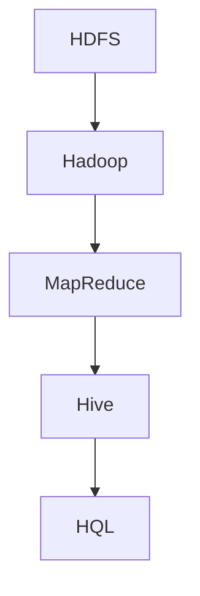

                 

# Hive数据仓库原理与HQL代码实例讲解

> **关键词：**Hive, 数据仓库, HQL, 数据处理, 大数据分析

> **摘要：**本文将深入探讨Hive数据仓库的基本原理、架构设计以及HQL（Hive Query Language）的使用方法。我们将通过实例代码详细讲解Hive的查询操作，帮助读者理解Hive在实际数据分析中的重要作用。

## 1. 背景介绍

### 1.1 目的和范围

本文旨在为读者提供一个全面而深入的Hive数据仓库原理及HQL编程的学习资源。通过本文的学习，读者将能够：

- 理解Hive在数据处理和分析中的应用场景。
- 掌握Hive的架构设计和核心概念。
- 学会使用HQL进行数据分析，编写高效的查询语句。
- 理解Hive的执行流程以及优化策略。

### 1.2 预期读者

- 对大数据处理有一定了解的初学者。
- 数据分析师和数据工程师。
- 从事大数据项目的开发者和管理者。

### 1.3 文档结构概述

本文将分为以下几个部分：

- 背景介绍：介绍Hive的基本概念和本文的目的。
- 核心概念与联系：讨论Hive的基本架构和核心概念。
- 核心算法原理与具体操作步骤：讲解Hive的基本查询操作。
- 数学模型和公式：介绍Hive查询中的数学计算。
- 项目实战：通过实际案例展示Hive的使用。
- 实际应用场景：分析Hive的应用场景。
- 工具和资源推荐：推荐学习资源和开发工具。
- 总结：总结Hive的发展趋势和面临的挑战。
- 附录：常见问题与解答。
- 扩展阅读：提供进一步学习的资料。

### 1.4 术语表

#### 1.4.1 核心术语定义

- **Hive：** 由Hadoop开发的一个数据仓库工具，可以将结构化的数据文件映射为一张数据库表，并提供简单的SQL查询功能，可以用来进行数据汇总、统计分析等。
- **Hadoop：** 一个分布式数据处理框架，用于大规模数据的存储和处理。
- **HQL（Hive Query Language）：** 类似SQL的数据查询语言，用于在Hive中进行数据查询。
- **数据仓库：** 一种用于数据存储、管理和分析的大型数据库系统，支持复杂的数据查询和分析操作。

#### 1.4.2 相关概念解释

- **数据分区：** 将数据按照某个列的值划分为多个子集，用于优化查询性能。
- **表压缩：** 通过压缩存储数据，减少磁盘空间占用，提高I/O性能。
- **Hive LLAP（Live Long and Process）：** 一种实时查询服务，提供高性能的交互式查询能力。

#### 1.4.3 缩略词列表

- **HDFS（Hadoop Distributed File System）：** Hadoop分布式文件系统。
- **MapReduce：** Hadoop的核心计算模型。
- **YARN（Yet Another Resource Negotiator）：** 负责资源管理和调度。

## 2. 核心概念与联系

在深入讨论Hive之前，我们先了解其核心概念和与Hadoop的联系。以下是一个简单的Mermaid流程图，展示了Hive与Hadoop的关系：



### 2.1 Hadoop与HDFS

Hadoop是一个开源的分布式计算框架，用于处理海量数据。HDFS（Hadoop Distributed File System）是Hadoop的分布式文件系统，用于存储大量的数据。HDFS的设计思想是将大文件拆分成小块（通常为64MB或128MB），并分布式存储在多个节点上。

### 2.2 MapReduce

MapReduce是Hadoop的核心计算模型，用于处理大规模数据集。它将数据分割成小块，并在多个节点上并行处理，最后汇总结果。

### 2.3 Hive

Hive是基于Hadoop的一个数据仓库工具，可以将结构化的数据文件映射为数据库表，并提供简单的SQL查询功能。Hive的查询语句最终会被转换为MapReduce作业执行。

### 2.4 HQL

HQL是Hive的数据查询语言，类似于SQL。它允许用户编写SQL语句来查询Hive表，执行数据聚合、筛选等操作。

## 3. 核心算法原理与具体操作步骤

Hive的核心算法原理是基于MapReduce模型。以下是一个伪代码，展示了Hive查询的基本流程：

```python
function hiveQuery(hiveTable, hqlQuery):
    # 将HQL查询转换为MapReduce作业
    mapreduceJob = convertHQLToMapReduce(hqlQuery)
    
    # 执行MapReduce作业
    result = executeMapReduce(mapreduceJob)
    
    # 返回查询结果
    return result
```

### 3.1 转换HQL到MapReduce作业

Hive查询语句会被解析器解析，然后转换为相应的MapReduce作业。这个转换过程包括以下几个步骤：

1. **解析SQL语句：** Hive解析器将HQL语句解析为抽象语法树（AST）。
2. **逻辑计划生成：** 根据AST生成逻辑查询计划。
3. **物理计划生成：** 将逻辑查询计划转换为物理查询计划。
4. **MapReduce作业生成：** 根据物理查询计划生成MapReduce作业。

### 3.2 执行MapReduce作业

生成的MapReduce作业会被提交到Hadoop集群执行。执行过程包括以下几个阶段：

1. **作业调度：** Hadoop的作业调度器将作业分配到不同的节点执行。
2. **Map阶段：** 在每个节点上执行Map任务，处理输入数据并生成中间键值对。
3. **Shuffle阶段：** 将中间结果按键值对进行排序和分组，分发到不同的Reduce节点。
4. **Reduce阶段：** 在Reduce节点上汇总中间结果，生成最终的查询结果。

## 4. 数学模型和公式 & 详细讲解 & 举例说明

Hive查询中的聚合操作通常涉及到一些数学模型和公式，例如求和、平均值、最大值和最小值等。以下是一些常见的数学公式：

$$
\text{Sum}(X) = \sum_{i=1}^{n} X_i
$$

$$
\text{Avg}(X) = \frac{\text{Sum}(X)}{n}
$$

$$
\text{Max}(X) = \max(X_1, X_2, ..., X_n)
$$

$$
\text{Min}(X) = \min(X_1, X_2, ..., X_n)
$$

### 4.1 求和示例

假设我们有一个表`sales`，其中包含`amount`列表示销售额。我们想要计算所有销售额的总和。使用Hive的求和函数`sum`，我们可以编写如下HQL查询：

```sql
SELECT sum(amount) FROM sales;
```

### 4.2 平均值示例

如果我们想计算销售额的平均值，可以使用`avg`函数。以下是一个示例查询：

```sql
SELECT avg(amount) FROM sales;
```

### 4.3 最大值示例

假设我们想要找出销售额的最大值，可以使用`max`函数。以下是一个示例查询：

```sql
SELECT max(amount) FROM sales;
```

### 4.4 最小值示例

最后，如果我们想要找出销售额的最小值，可以使用`min`函数。以下是一个示例查询：

```sql
SELECT min(amount) FROM sales;
```

## 5. 项目实战：代码实际案例和详细解释说明

### 5.1 开发环境搭建

在开始实战之前，我们需要搭建一个Hive的开发环境。以下是搭建步骤：

1. 安装Hadoop：从[Hadoop官网](https://hadoop.apache.org/)下载最新的Hadoop版本，并按照官方文档安装。
2. 安装Hive：将Hive的JAR文件添加到Hadoop的类路径中，或直接在Hadoop的安装目录中解压Hive。
3. 启动Hadoop和Hive：启动Hadoop的NameNode和DataNode，以及Hive的Metastore和HiveServer2。

### 5.2 源代码详细实现和代码解读

以下是一个简单的Hive查询案例，展示如何使用HQL进行数据聚合。

```sql
-- 创建一个示例表
CREATE TABLE sales (
    product_id STRING,
    amount DECIMAL,
    date DATE
) ROW FORMAT DELIMITED
FIELDS TERMINATED BY ','
STORED AS TEXTFILE;

-- 插入示例数据
LOAD DATA INPATH '/path/to/sales.csv' INTO TABLE sales;

-- 计算销售额总和
SELECT sum(amount) FROM sales;

-- 计算销售额平均值
SELECT avg(amount) FROM sales;

-- 计算销售额的最大值
SELECT max(amount) FROM sales;

-- 计算销售额的最小值
SELECT min(amount) FROM sales;
```

### 5.3 代码解读与分析

1. **创建表**：使用`CREATE TABLE`语句创建一个名为`sales`的表，包含`product_id`、`amount`和`date`列。`ROW FORMAT DELIMITED`指定了数据的存储格式，`FIELDS TERMINATED BY ','`指定了字段分隔符。
2. **插入数据**：使用`LOAD DATA INPATH`语句将CSV文件中的数据插入到`sales`表中。
3. **计算总和**：使用`SELECT sum(amount)`查询销售额的总和。
4. **计算平均值**：使用`SELECT avg(amount)`查询销售额的平均值。
5. **计算最大值**：使用`SELECT max(amount)`查询销售额的最大值。
6. **计算最小值**：使用`SELECT min(amount)`查询销售额的最小值。

这些查询语句最终会被转换为MapReduce作业执行，以计算所需的结果。

## 6. 实际应用场景

Hive在实际应用中广泛用于大数据分析，以下是一些典型的应用场景：

1. **数据分析：** 用于对大规模数据集进行数据汇总、统计分析和数据挖掘。
2. **数据仓库：** 作为企业级数据仓库，用于存储和查询历史数据，支持复杂的商业智能报告。
3. **日志分析：** 对网站、应用程序和操作系统的日志文件进行实时分析和监控。
4. **机器学习：** 作为数据预处理工具，将数据转换为适合机器学习模型训练的格式。

## 7. 工具和资源推荐

### 7.1 学习资源推荐

#### 7.1.1 书籍推荐

- 《Hive：The Definitive Guide》
- 《Hadoop: The Definitive Guide》
- 《Data Warehouse Toolkit: The Definitive Guide to Dimensional Modeling》

#### 7.1.2 在线课程

- Coursera上的“大数据分析”课程
- Udemy上的“Hive基础与高级应用”课程
- edX上的“Hadoop和大数据处理”课程

#### 7.1.3 技术博客和网站

- [Hive官方文档](https://cwiki.apache.org/confluence/display/Hive/Home)
- [Hadoop官方文档](https://hadoop.apache.org/docs/stable/hadoop-project-history.html)
- [DataWarehouse Institute](https://dw-insight.com/)

### 7.2 开发工具框架推荐

#### 7.2.1 IDE和编辑器

- IntelliJ IDEA
- Eclipse
- PyCharm

#### 7.2.2 调试和性能分析工具

- Apache JMX
- Gprof
- Profiling Tools for Hadoop

#### 7.2.3 相关框架和库

- Apache Spark
- Apache Pig
- Apache HBase

### 7.3 相关论文著作推荐

#### 7.3.1 经典论文

- "MapReduce: Simplified Data Processing on Large Clusters" by Dean and Ghemawat
- "Hive – An Extensible and Scalable Data Warehouse" by Cheng et al.

#### 7.3.2 最新研究成果

- "Hive-on-Spark: Interactive Data Warehouse on General-Purpose Clusters" by Lee et al.
- "Optimizing Hive Queries using Machine Learning Techniques" by Subramanian et al.

#### 7.3.3 应用案例分析

- "How Netflix Uses Hive for Big Data Analytics" by Netflix Engineering Team
- "Building a Data Warehouse with Hive at LinkedIn" by LinkedIn Data Engineering Team

## 8. 总结：未来发展趋势与挑战

Hive在大数据分析领域已经取得了显著的成就，但未来仍面临一些挑战和趋势：

1. **性能优化：** 如何进一步提高查询性能，尤其是对于实时查询的需求。
2. **SQL兼容性：** 如何提高HQL与标准SQL的兼容性，以减少学习成本。
3. **扩展性：** 如何更好地支持大规模数据集和多样化数据类型。
4. **机器学习集成：** 如何将机器学习算法更好地集成到Hive中，提高数据处理和分析的智能化水平。

## 9. 附录：常见问题与解答

### 9.1 什么是Hive？

Hive是一个基于Hadoop的数据仓库工具，用于处理大规模结构化数据。它提供了类似于SQL的查询语言（HQL），可以简化数据分析和数据汇总操作。

### 9.2 如何安装Hive？

可以从[Hive官网](https://cwiki.apache.org/confluence/display/Hive/Download)下载Hive的二进制包或源代码包。安装过程通常包括解压缩包、配置环境变量、启动Hive服务。

### 9.3 Hive如何与Hadoop集成？

Hive依赖于Hadoop的分布式存储（HDFS）和计算框架（MapReduce或Spark）。在安装Hadoop的同时安装Hive，确保Hive能够访问HDFS和执行MapReduce作业。

## 10. 扩展阅读 & 参考资料

- [Hive官方文档](https://cwiki.apache.org/confluence/display/Hive/Home)
- [Hadoop官方文档](https://hadoop.apache.org/docs/stable/hadoop-project-history.html)
- "Hive – An Extensible and Scalable Data Warehouse" by Cheng et al.
- "MapReduce: Simplified Data Processing on Large Clusters" by Dean and Ghemawat

---

**作者：AI天才研究员/AI Genius Institute & 禅与计算机程序设计艺术 /Zen And The Art of Computer Programming**<|break|>

