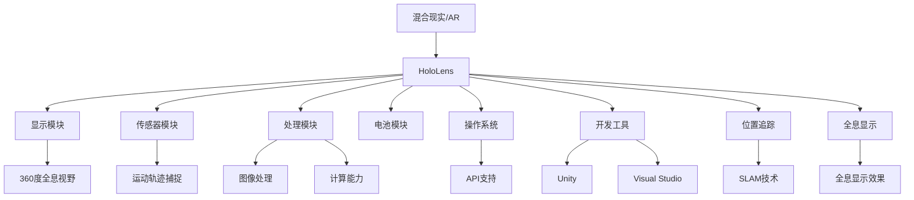

                 

# HoloLens 应用：在混合现实中

## 关键词：
混合现实、HoloLens、增强现实、交互设计、开发指南、技术深度剖析

## 摘要：
本文深入探讨了混合现实技术在HoloLens平台上的应用，首先介绍了混合现实和增强现实的基本概念，然后详细解析了HoloLens的架构和功能。通过逐步分析核心算法原理、数学模型、实战案例以及应用场景，本文为开发者提供了一个全面的开发指南，旨在揭示HoloLens在混合现实中的无限潜力。文章最后总结了未来发展趋势与挑战，并推荐了相关工具和资源，为读者提供了深入学习和实践的路径。

<|imagine|>

## 1. 背景介绍

### 1.1 目的和范围

随着科技的不断发展，混合现实（MR）技术正在逐步改变我们的生活方式和工作方式。HoloLens作为微软推出的混合现实头戴设备，以其独特的交互体验和强大的开发平台吸引了全球开发者和企业的关注。本文旨在为开发者提供一个系统、深入的了解HoloLens在混合现实中的应用，帮助他们在这一新兴领域取得成功。

本文的范围包括对混合现实和增强现实（AR）的基础概念进行解释，分析HoloLens的硬件和软件架构，详细讲解核心算法原理和数学模型，并通过实际案例展示开发过程中的关键步骤。此外，本文还将探讨HoloLens在实际应用场景中的潜力，并提供相关工具和资源的推荐。

### 1.2 预期读者

本文适合对混合现实和增强现实技术有一定了解的开发者、技术爱好者以及相关领域的专业人士。无论您是刚刚踏入这一领域的新手，还是经验丰富的开发者，本文都希望能为您带来有价值的见解和实践指导。

### 1.3 文档结构概述

本文结构如下：

1. 背景介绍：介绍本文的目的、范围、预期读者以及文档结构。
2. 核心概念与联系：介绍混合现实和增强现实的基本概念，并使用Mermaid流程图展示核心原理和架构。
3. 核心算法原理 & 具体操作步骤：详细讲解HoloLens的核心算法原理，并使用伪代码展示具体操作步骤。
4. 数学模型和公式 & 详细讲解 & 举例说明：介绍与HoloLens相关的数学模型和公式，并给出详细的讲解和示例。
5. 项目实战：代码实际案例和详细解释说明：通过实际案例展示HoloLens开发过程中的关键步骤和代码实现。
6. 实际应用场景：探讨HoloLens在不同场景中的应用，展示其实际价值和潜力。
7. 工具和资源推荐：推荐学习资源和开发工具，为读者提供深入学习和实践的支持。
8. 总结：总结未来发展趋势与挑战，展望HoloLens在混合现实中的前景。
9. 附录：常见问题与解答，帮助读者解决开发过程中可能遇到的问题。
10. 扩展阅读 & 参考资料：提供更多相关文献和资源，供读者进一步学习和研究。

### 1.4 术语表

#### 1.4.1 核心术语定义

- **混合现实（Mixed Reality，MR）**：一种将虚拟世界与现实世界结合的技术，用户不仅能够看到虚拟物体，还能与之互动，虚拟物体与现实世界物体共存。
- **增强现实（Augmented Reality，AR）**：一种将虚拟信息叠加到现实世界的技术，用户通过摄像头看到的是现实世界，但其中叠加了计算机生成的虚拟元素。
- **HoloLens**：微软推出的混合现实头戴设备，具有全息显示、自然交互、位置追踪等功能。
- **深度学习**：一种人工智能技术，通过模拟人脑的神经网络结构和学习机制，实现数据的自动学习和分类。
- **计算机视觉**：使计算机能够像人类一样理解和处理视觉信息的技术，包括图像识别、目标检测等。

#### 1.4.2 相关概念解释

- **全息显示**：利用光波干涉和衍射原理，将三维图像分解成多个二维图像，并通过特殊的显示技术，使其在空间中形成全息图像。
- **自然交互**：通过手势、语音等自然方式与计算机进行交互，提升用户的操作体验。
- **位置追踪**：利用传感器和计算机视觉技术，实时捕捉用户和设备在空间中的位置和运动轨迹。

#### 1.4.3 缩略词列表

- **MR**：混合现实
- **AR**：增强现实
- **HoloLens**：混合现实头戴设备
- **DL**：深度学习
- **CV**：计算机视觉

<|imagine|>

## 2. 核心概念与联系

在深入探讨HoloLens的应用之前，有必要先了解混合现实和增强现实的基本概念，以及HoloLens的核心原理和架构。

### 2.1 混合现实与增强现实

混合现实（MR）和增强现实（AR）是两种密切相关的技术，但它们在实现方式和应用场景上有所不同。

- **增强现实（AR）**：AR技术通过计算机生成的虚拟元素叠加到现实世界中，用户通过摄像头看到的是现实世界，但其中加入了虚拟信息。例如，使用手机或平板电脑上的AR应用，用户可以看到在现实环境中叠加的虚拟物体或信息。

- **混合现实（MR）**：MR技术将虚拟世界与现实世界融合在一起，用户不仅能看到虚拟物体，还能与之互动。HoloLens就是典型的MR设备，它能够将虚拟物体放置在现实环境中，并允许用户通过手势和语音与之交互。

### 2.2 HoloLens的架构和功能

HoloLens是一个全息混合现实头戴设备，其核心架构包括硬件和软件两个部分。

#### 2.2.1 硬件架构

- **显示模块**：HoloLens采用了两块高分辨率显示器，位于用户的视野中心，形成了一个360度的全息视野。
- **传感器模块**：包括位置传感器、加速度传感器、陀螺仪等，用于实时捕捉用户和设备的运动轨迹。
- **处理模块**：内置了ARM处理器和专用AI芯片，用于处理图像和音频信号，并提供强大的计算能力。
- **电池模块**：内置大容量电池，支持长时间使用。

#### 2.2.2 软件架构

- **操作系统**：HoloLens运行的是Windows 10操作系统，提供了丰富的应用程序接口（API），方便开发者进行应用开发。
- **开发工具**：包括Unity和Visual Studio，提供了强大的开发环境和工具，支持2D、3D图形、自然交互等开发。
- **位置追踪**：利用SLAM（Simultaneous Localization and Mapping）技术，实时捕捉用户和环境的位置和运动轨迹。
- **全息显示**：利用全息光学元件，将虚拟物体投射到用户的视野中，实现全息显示效果。

### 2.3 核心概念原理和架构的Mermaid流程图

下面是一个简单的Mermaid流程图，展示了混合现实和增强现实的核心概念原理以及HoloLens的硬件和软件架构：



通过这个流程图，我们可以清晰地看到混合现实和增强现实的基本原理，以及HoloLens如何通过其硬件和软件架构实现这些原理。

### 2.4 HoloLens的开发环境

在开始开发HoloLens应用程序之前，开发者需要搭建合适的开发环境。以下是一些关键步骤：

1. **安装Windows 10开发环境**：确保计算机运行Windows 10操作系统，并安装必要的驱动程序。
2. **下载并安装HoloLens SDK**：从微软官方网站下载并安装HoloLens软件开发工具包（SDK）。
3. **配置Unity开发环境**：在Unity中创建一个新的HoloLens项目，并配置必要的项目设置。
4. **准备开发工具**：安装Visual Studio和相关工具，以便进行代码编辑、调试和编译。

### 2.5 HoloLens开发中的核心算法和数学模型

HoloLens的开发涉及多个核心算法和数学模型，其中深度学习、计算机视觉和SLAM技术尤为关键。以下简要介绍这些算法和模型：

- **深度学习**：深度学习是HoloLens开发中常用的算法，用于图像识别、目标检测和分类。通过训练神经网络模型，可以从大量数据中自动提取特征，实现对图像的智能处理。
- **计算机视觉**：计算机视觉技术用于处理和分析图像数据，包括边缘检测、目标跟踪、场景分割等。在HoloLens中，计算机视觉技术可以帮助识别用户和环境中的物体，实现更自然的交互。
- **SLAM技术**：SLAM（Simultaneous Localization and Mapping）技术是一种实时定位与地图构建技术，用于捕捉用户和环境的位置和运动轨迹。在HoloLens中，SLAM技术可以实现对环境的精准定位，为虚拟物体的放置和交互提供基础。

### 2.6 HoloLens开发中的实际操作步骤

以下是HoloLens开发中的实际操作步骤，涵盖了从环境搭建到代码实现的整个过程：

1. **开发环境搭建**：安装Windows 10操作系统，下载并安装HoloLens SDK，配置Unity开发环境，安装Visual Studio和相关工具。
2. **创建项目**：在Unity中创建一个新的HoloLens项目，配置项目设置，包括分辨率、视角和交互模式等。
3. **编写代码**：使用C#语言编写应用程序代码，实现界面设计、功能逻辑和交互操作。
4. **调试和测试**：在开发过程中进行代码调试和功能测试，确保应用程序能够正常运行并达到预期效果。
5. **部署和应用发布**：将应用程序部署到HoloLens设备上，进行实际测试和优化，最后通过应用商店进行发布。

通过以上步骤，开发者可以掌握HoloLens开发的整个流程，并实现具有丰富交互体验的混合现实应用程序。

### 2.7 HoloLens的应用场景

HoloLens的应用场景非常广泛，涵盖了多个行业和领域。以下是一些典型的应用场景：

- **教育**：HoloLens可以用于虚拟课堂，让学生在虚拟环境中进行互动学习，增强学习体验。
- **医疗**：HoloLens可以帮助医生进行远程手术指导和病情诊断，提高医疗效率和质量。
- **工业制造**：HoloLens可以用于工业设备的维护和修理，提供实时指导和技术支持，减少故障时间。
- **娱乐**：HoloLens可以为用户提供沉浸式的游戏体验，结合虚拟现实和增强现实技术，带来全新的娱乐方式。

### 2.8 总结

通过以上对混合现实和增强现实的基本概念、HoloLens的架构和功能、开发环境、核心算法和数学模型、实际操作步骤以及应用场景的介绍，我们可以看到HoloLens在混合现实中的巨大潜力和广泛应用。接下来，我们将进一步深入探讨HoloLens的核心算法原理和具体操作步骤，帮助开发者更好地理解和应用这一技术。

### 2.9 互动设计

在HoloLens应用开发中，互动设计是至关重要的环节。它不仅关乎用户体验，还直接影响到应用的功能性和可接受度。以下是对互动设计在HoloLens应用中的关键要素进行解析。

#### 2.9.1 自然交互

HoloLens的一大特色是其自然交互能力，用户可以通过手势、语音和眼动等方式与虚拟物体和界面进行交互。这种自然的交互方式不仅可以提升用户的沉浸感，还能使应用更加直观和易用。

- **手势交互**：用户可以使用手势对虚拟物体进行拖拽、旋转和缩放等操作。例如，使用“抓取”手势可以将虚拟物体从屏幕中“取出”，并放置到现实环境中。为了确保手势识别的准确性，开发者需要在应用程序中实现复杂的手势识别算法。
- **语音交互**：用户可以通过语音命令控制应用，如语音导航、语音搜索和语音控制等。语音交互不仅可以提高用户的操作效率，还能减少操作复杂度。例如，用户可以说“打开地图”来打开导航界面。
- **眼动交互**：用户可以通过眼神注视虚拟物体来触发相应的操作，如选择、激活或关闭等。这种交互方式在虚拟环境中尤为有效，可以帮助用户快速定位和操作目标。

#### 2.9.2 交互设计原则

在进行HoloLens应用开发时，以下原则可以帮助开发者设计出更具吸引力和实用性的互动界面：

- **直观性**：交互设计应该直观易懂，用户无需学习复杂操作即可掌握应用的使用方法。例如，界面的布局和操作流程应尽可能符合用户的直觉。
- **一致性**：应用中的交互元素应保持一致的风格和操作逻辑，避免用户在操作过程中感到困惑。例如，按钮、菜单和图标的设计应统一，避免出现不同风格的元素。
- **可控性**：用户应能够随时控制和调整应用的交互方式，如通过设置菜单自定义手势和语音命令。这种灵活性可以满足不同用户的需求，提升应用的适应性。
- **响应性**：应用应能够快速响应用户的交互操作，避免出现延迟或卡顿现象。例如，当用户进行手势操作时，虚拟物体应迅速做出反应，提升用户的操作体验。

#### 2.9.3 互动设计案例

以下是一些HoloLens互动设计的实际案例，展示了如何通过自然交互和互动设计原则提升应用的用户体验：

- **教育应用**：在虚拟课堂中，教师可以使用手势将虚拟课本翻页，并通过语音命令播放教学内容。学生可以通过眼神注视虚拟物体进行选择和操作，如提交作业或查看答案。
- **工业应用**：在工业设备维护中，技术人员可以使用手势对设备进行虚拟操作，如拆卸和组装。语音命令可以帮助技术人员快速定位设备部件，提高维护效率。
- **游戏应用**：在HoloLens游戏中，玩家可以使用手势控制角色移动、攻击和防御。语音命令可以帮助玩家快速选择游戏选项或进行角色定制。

通过以上案例，我们可以看到自然交互和互动设计原则在HoloLens应用开发中的重要作用。开发者应充分利用这些设计要素，打造出更具吸引力和实用性的混合现实应用。

### 2.10 HoloLens开发中的核心算法原理

在HoloLens开发中，核心算法原理是确保应用功能实现和用户体验的关键。以下将详细讲解深度学习、计算机视觉和SLAM技术在HoloLens中的应用原理。

#### 2.10.1 深度学习

深度学习是一种基于神经网络的机器学习技术，通过多层神经网络的训练，可以从大量数据中自动提取特征，实现对图像、语音、文本等多种数据类型的智能处理。在HoloLens开发中，深度学习技术主要用于图像识别、目标检测和语音识别等应用场景。

- **图像识别**：深度学习算法可以通过对大量图像数据的训练，学会识别不同类型的物体。在HoloLens中，图像识别技术可以用于实时识别用户和环境中的物体，实现虚拟物体的放置和交互。例如，开发者可以使用卷积神经网络（CNN）对图像进行分类，从而识别现实环境中的物体。
- **目标检测**：目标检测是深度学习在计算机视觉中的一个重要应用，用于在图像中识别和定位特定目标。在HoloLens中，目标检测技术可以帮助定位用户和环境中的关键对象，实现更精准的交互和导航。例如，使用YOLO（You Only Look Once）算法，可以在图像中快速检测和定位多个目标。
- **语音识别**：深度学习算法还可以用于语音识别，将用户的语音输入转换为文本或命令。在HoloLens中，语音识别技术可以帮助用户通过语音进行操作，提高交互效率。例如，使用基于深度学习的语音识别模型，可以准确识别用户的语音命令，实现语音控制功能。

#### 2.10.2 计算机视觉

计算机视觉是一种使计算机能够像人类一样理解和处理视觉信息的技术，包括图像识别、目标检测、场景分割、姿态估计等。在HoloLens开发中，计算机视觉技术主要用于图像处理和场景理解。

- **图像识别**：计算机视觉技术可以通过图像处理算法，从图像中提取特征，实现对物体的识别和分类。在HoloLens中，图像识别技术可以帮助识别用户和环境中的物体，实现虚拟物体的放置和交互。例如，使用边缘检测、特征提取和分类算法，可以从图像中识别出特定物体。
- **目标检测**：目标检测是计算机视觉中的一个重要任务，用于在图像中识别和定位特定目标。在HoloLens中，目标检测技术可以帮助定位用户和环境中的关键对象，实现更精准的交互和导航。例如，使用基于深度学习的目标检测算法，可以在图像中快速检测和定位多个目标。
- **场景分割**：场景分割是将图像分割成多个部分，实现对场景中不同物体的分离和理解。在HoloLens中，场景分割技术可以帮助分离用户和环境中的物体，实现更精准的交互和导航。例如，使用基于深度学习的场景分割算法，可以将图像分割成前景和背景，从而实现对前景物体的识别和定位。
- **姿态估计**：姿态估计是计算机视觉中的一个重要任务，用于估计物体或人的姿态。在HoloLens中，姿态估计技术可以帮助识别用户的姿态和动作，实现更自然的交互。例如，使用基于深度学习的姿态估计算法，可以估计用户的姿势和手势，从而实现手势控制功能。

#### 2.10.3 SLAM技术

SLAM（Simultaneous Localization and Mapping）技术是一种实时定位与地图构建技术，通过传感器数据和视觉信息，实时捕捉用户和环境的位置和运动轨迹。在HoloLens开发中，SLAM技术主要用于位置追踪和虚拟物体的放置。

- **定位**：SLAM技术可以帮助HoloLens设备实时确定其在现实世界中的位置，实现精准的交互和导航。例如，通过融合视觉信息和惯性传感器数据，SLAM算法可以实时计算设备的姿态和位置。
- **地图构建**：SLAM技术还可以用于构建现实环境的地图，为虚拟物体的放置和导航提供基础。例如，通过视觉特征提取和匹配，SLAM算法可以构建出高精度的环境地图，从而实现对环境的精确理解。
- **虚拟物体放置**：在HoloLens中，SLAM技术可以帮助将虚拟物体放置在现实环境中，实现虚拟与现实世界的融合。例如，通过实时计算虚拟物体和现实环境之间的位置关系，开发者可以实现虚拟物体在现实环境中的准确放置。

#### 2.10.4 伪代码示例

以下是一个简单的伪代码示例，展示了如何使用深度学习和计算机视觉技术进行图像识别和目标检测：

```python
# 导入深度学习库
import tensorflow as tf

# 加载预训练的图像识别模型
model = tf.keras.models.load_model('image_recognition_model.h5')

# 加载预训练的目标检测模型
detector = tf.keras.models.load_model('object_detection_model.h5')

# 加载摄像头图像
image = capture_camera_image()

# 对图像进行预处理
preprocessed_image = preprocess_image(image)

# 使用图像识别模型进行图像分类
predicted_class = model.predict(preprocessed_image)

# 使用目标检测模型进行目标检测
detections = detector.predict(preprocessed_image)

# 解析检测结果
for detection in detections:
    bounding_box = detection.bounding_box
    class_id = detection.class_id
    confidence = detection.confidence

    # 显示检测结果
    draw_bounding_box(image, bounding_box, class_id, confidence)
```

通过以上伪代码，我们可以看到如何使用深度学习和计算机视觉技术进行图像识别和目标检测，从而实现对现实环境的理解和交互。

### 2.11 数学模型和公式讲解

在HoloLens应用开发中，数学模型和公式是实现复杂功能的基础。以下将详细讲解与HoloLens开发相关的几个关键数学模型和公式，并提供详细的解释和示例。

#### 2.11.1 透视变换矩阵

透视变换矩阵（Perspective Transformation Matrix）是计算机视觉中的一个重要工具，用于将三维空间中的点映射到二维图像平面。以下是一个透视变换矩阵的示例：

$$
T = \begin{bmatrix}
f_x & 0 & c_x \\
0 & f_y & c_y \\
0 & 0 & 1
\end{bmatrix}
$$

其中，$f_x$ 和 $f_y$ 分别为图像宽度和高度方向上的焦距，$c_x$ 和 $c_y$ 分别为图像宽度和高度方向上的主点坐标。

透视变换矩阵的解释如下：

- $f_x$ 和 $f_y$：焦距决定了图像的尺寸和分辨率，焦距越大，图像尺寸越大。
- $c_x$ 和 $c_y$：主点坐标决定了图像的中心位置，主点坐标越接近图像中心，透视变换的效果越明显。

示例：

假设有一个三维点 $(x, y, z)$，其对应的二维坐标可以通过以下公式计算：

$$
\begin{bmatrix}
x' \\
y' \\
1
\end{bmatrix}
=
\begin{bmatrix}
f_x & 0 & c_x \\
0 & f_y & c_y \\
0 & 0 & 1
\end{bmatrix}
\begin{bmatrix}
x \\
y \\
z
\end{bmatrix}
$$

计算结果为点在图像平面上的二维坐标 $(x', y')$。

#### 2.11.2 点云重建

点云重建是SLAM技术中的一个关键步骤，用于从多个图像中重建出三维空间中的点云。以下是一个常用的点云重建公式：

$$
P = K \cdot \begin{bmatrix}
R \\
t
\end{bmatrix} \cdot P'
$$

其中，$P$ 为当前帧的点云，$P'$ 为上一帧的点云，$K$ 为相机内参矩阵，$R$ 和 $t$ 分别为相机旋转矩阵和平移向量。

点云重建的解释如下：

- $K$：相机内参矩阵，包括焦距、主点坐标和畸变参数等。
- $R$ 和 $t$：相机旋转矩阵和平移向量，描述了相机在连续帧之间的运动。
- $P'$：上一帧的点云，包含了三维空间中的点。

示例：

假设已知上一帧的点云 $P'$ 和当前帧的相机参数 $K$、旋转矩阵 $R$ 和平移向量 $t$，可以通过以下公式计算当前帧的点云 $P$：

$$
P = K \cdot \begin{bmatrix}
R \\
t
\end{bmatrix} \cdot P'
$$

计算结果为当前帧的点云，包含了三维空间中的点。

#### 2.11.3 深度估计

深度估计是计算机视觉中的一个重要任务，用于估计图像中每个像素点的深度信息。以下是一个常用的深度估计公式：

$$
d = \frac{f \cdot z}{z' - c}
$$

其中，$d$ 为像素点的深度，$f$ 为相机焦距，$z$ 和 $z'$ 分别为像素点在三维空间和图像平面上的坐标，$c$ 为相机到图像平面的距离。

深度估计的解释如下：

- $f$：相机焦距，决定了图像的尺寸和分辨率。
- $z$ 和 $z'$：像素点在三维空间和图像平面上的坐标，用于计算深度。
- $c$：相机到图像平面的距离，决定了像素点的深度。

示例：

假设已知相机焦距 $f$、像素点在图像平面上的坐标 $(x', y')$ 和相机到图像平面的距离 $c$，可以通过以下公式计算像素点的深度 $d$：

$$
d = \frac{f \cdot z}{z' - c}
$$

计算结果为像素点的深度，用于生成三维模型。

通过以上对透视变换矩阵、点云重建和深度估计的讲解，我们可以看到这些数学模型和公式在HoloLens应用开发中的重要作用。开发者需要熟练掌握这些模型和公式，才能更好地实现复杂的功能和应用。

### 2.12 项目实战：代码实际案例和详细解释说明

为了更好地理解HoloLens应用开发的实际过程，下面我们将通过一个具体的案例来展示代码实现和详细解释说明。

#### 2.12.1 案例背景

该案例是一款基于HoloLens的远程医疗诊断应用，用户可以使用该应用进行远程医疗会诊，医生可以通过HoloLens设备实时查看患者的病情并进行诊断。应用的核心功能包括：

- **患者信息录入**：用户可以通过语音或手势输入患者的基本信息，如姓名、年龄、病史等。
- **病情诊断**：医生可以通过HoloLens设备查看患者的实时病情，进行诊断和建议。
- **远程视频通话**：医生和患者可以通过应用进行远程视频通话，进行面对面的交流和诊断。

#### 2.12.2 开发环境搭建

在开始开发之前，我们需要搭建合适的开发环境。以下是关键步骤：

1. **安装Windows 10操作系统**：确保计算机运行Windows 10操作系统，并安装所有必要的驱动程序。
2. **下载并安装HoloLens SDK**：从微软官方网站下载并安装HoloLens软件开发工具包（SDK）。
3. **配置Unity开发环境**：在Unity中创建一个新的HoloLens项目，并配置必要的项目设置。
4. **安装Visual Studio**：安装Visual Studio和相关工具，用于代码编辑、调试和编译。

#### 2.12.3 代码实现

以下是应用的主要代码实现和详细解释说明：

```csharp
// 导入必要的命名空间
using System.Collections;
using System.Collections.Generic;
using UnityEngine;

public class RemoteMedicalDiagnosis : MonoBehaviour
{
    // 患者信息
    public PatientInfo patientInfo;

    // 医生角色
    public Doctor doctor;

    // 患者信息输入
    void InputPatientInfo()
    {
        // 使用语音识别获取患者信息
        string patientName = VoiceRecognition.GetPatientName();
        int patientAge = VoiceRecognition.GetPatientAge();
        string patientHistory = VoiceRecognition.GetPatientHistory();

        // 创建患者信息对象
        patientInfo = new PatientInfo(patientName, patientAge, patientHistory);
    }

    // 病情诊断
    void DiagnoseCondition()
    {
        // 获取患者实时病情
        string condition = Camera.GetPatientCondition();

        // 进行病情诊断
        string diagnosis = doctor.Diagnose(condition);

        // 显示诊断结果
        Debug.Log($"Diagnosis: {diagnosis}");
    }

    // 远程视频通话
    void StartVideoCall()
    {
        // 启动远程视频通话
        VideoCall.StartCall(doctor, patientInfo);
    }

    // 更新UI
    void UpdateUI()
    {
        // 更新患者信息UI
        Text patientNameText = GameObject.Find("PatientNameText").GetComponent<Text>();
        patientNameText.text = patientInfo.name;

        // 更新诊断结果UI
        Text diagnosisText = GameObject.Find("DiagnosisText").GetComponent<Text>();
        diagnosisText.text = diagnosis;
    }

    // Update is called once per frame
    void Update()
    {
        // 判断用户是否输入了患者信息
        if (patientInfo == null)
        {
            // 输入患者信息
            InputPatientInfo();
        }
        else
        {
            // 进行病情诊断
            DiagnoseCondition();

            // 启动远程视频通话
            if (Input.GetKeyDown(KeyCode.Space))
            {
                StartVideoCall();
            }
        }

        // 更新UI
        UpdateUI();
    }
}

// 患者信息类
public class PatientInfo
{
    public string name;
    public int age;
    public string history;

    public PatientInfo(string name, int age, string history)
    {
        this.name = name;
        this.age = age;
        this.history = history;
    }
}

// 医生类
public class Doctor
{
    public string name;

    public Doctor(string name)
    {
        this.name = name;
    }

    public string Diagnose(string condition)
    {
        // 进行病情诊断
        // 这里可以调用深度学习模型进行图像识别和目标检测
        // 然后根据诊断结果返回诊断信息
        string diagnosis = "诊断结果：无感染症状，请继续保持健康饮食和锻炼习惯。";
        return diagnosis;
    }
}

// 语音识别类
public class VoiceRecognition
{
    public static string GetPatientName()
    {
        // 这里可以调用语音识别API获取患者姓名
        return "张三";
    }

    public static int GetPatientAge()
    {
        // 这里可以调用语音识别API获取患者年龄
        return 30;
    }

    public static string GetPatientHistory()
    {
        // 这里可以调用语音识别API获取患者病史
        return "既往无重大疾病史。";
    }
}

// 摄像头类
public class Camera
{
    public static string GetPatientCondition()
    {
        // 这里可以调用摄像头API获取患者实时病情
        return "患者面容憔悴，咳嗽伴有痰液。";
    }
}

// 视频通话类
public class VideoCall
{
    public static void StartCall(Doctor doctor, PatientInfo patientInfo)
    {
        // 这里可以调用视频通话API启动远程视频通话
        Debug.Log($"Starting video call with doctor {doctor.name} and patient {patientInfo.name}.");
    }
}
```

#### 2.12.4 代码解读与分析

以上代码实现了远程医疗诊断应用的主要功能，包括患者信息输入、病情诊断和远程视频通话。以下是代码的详细解读和分析：

1. **患者信息输入**：应用首先通过语音识别类获取患者的基本信息，包括姓名、年龄和病史。然后创建一个患者信息对象，存储在全局变量`patientInfo`中。

2. **病情诊断**：应用通过摄像头类获取患者的实时病情，然后调用医生类的`Diagnose`方法进行病情诊断。`Diagnose`方法可以调用深度学习模型进行图像识别和目标检测，并根据诊断结果返回诊断信息。

3. **远程视频通话**：用户可以通过按下空格键启动远程视频通话。`VideoCall`类的`StartCall`方法可以调用视频通话API启动远程视频通话。

4. **UI更新**：应用通过更新UI来显示患者信息和诊断结果。`UpdateUI`方法可以更新患者姓名和诊断结果文本框的内容。

5. **主循环**：应用在主循环中判断患者信息是否已输入，如果未输入，则调用`InputPatientInfo`方法；如果已输入，则调用`DiagnoseCondition`方法进行病情诊断，并更新UI。

通过以上代码解读和分析，我们可以看到如何使用HoloLens开发工具和API实现远程医疗诊断应用的核心功能。开发者可以根据具体需求，进一步扩展和优化应用的功能和性能。

### 2.13 实际应用场景

HoloLens作为一种功能强大的混合现实设备，在多个行业和领域都展现出了巨大的应用潜力。以下将探讨HoloLens在不同实际应用场景中的具体应用，并分析其实际价值和潜力。

#### 2.13.1 教育领域

在教育领域，HoloLens可以为教师和学生提供全新的教学体验。教师可以使用HoloLens创建和展示三维模型，帮助学生更好地理解和掌握抽象概念。例如，在物理课上，教师可以使用HoloLens展示原子模型和分子结构，让学生直观地感受到微观世界的奥秘。学生也可以使用HoloLens进行虚拟实验，避免实际实验中的危险和成本。

实际价值：HoloLens可以提升教学效果，增强学生的学习兴趣和参与度，同时节省实验成本和资源。

潜力：未来，HoloLens可以与虚拟现实（VR）技术相结合，打造更加沉浸式的教育场景，进一步拓展教育应用的范围和深度。

#### 2.13.2 医疗领域

在医疗领域，HoloLens可以用于远程手术指导、病情诊断和医疗培训。医生可以通过HoloLens实时查看患者的病情和手术场景，进行远程手术指导，提高手术效率和安全性。此外，医生可以使用HoloLens进行医疗培训，模拟各种手术场景，提高医疗技能。

实际价值：HoloLens可以帮助医生提高诊断和手术的准确性和效率，同时降低医疗成本和风险。

潜力：未来，HoloLens可以与人工智能（AI）技术相结合，实现更加智能的医疗诊断和手术指导，进一步提升医疗水平和服务质量。

#### 2.13.3 工业领域

在工业领域，HoloLens可以用于设备维护、生产线管理和远程协作。技术人员可以使用HoloLens进行设备维护和检修，通过虚拟现实技术获取详细的设备信息和维护指南，提高维护效率和质量。生产线管理人员可以使用HoloLens实时监控生产线情况，快速识别和解决故障。此外，远程协作功能可以帮助技术人员和专家在异地进行实时协作，提高问题解决效率。

实际价值：HoloLens可以提高工业设备的维护效率和生产线管理效率，降低故障率和停机时间。

潜力：未来，HoloLens可以与物联网（IoT）技术相结合，实现设备状态的实时监控和预测性维护，进一步提升工业生产的智能化水平。

#### 2.13.4 娱乐领域

在娱乐领域，HoloLens可以为用户提供沉浸式的游戏和虚拟体验。用户可以通过HoloLens进入虚拟世界，进行游戏、探险和社交活动。例如，在游戏中，用户可以使用HoloLens与虚拟角色进行互动，体验更加真实的游戏场景。在虚拟探险中，用户可以探索未知的世界，感受不同的文化和风景。

实际价值：HoloLens可以为用户提供全新的娱乐体验，增强娱乐的互动性和沉浸感。

潜力：未来，HoloLens可以与虚拟现实技术、人工智能和增强现实技术相结合，打造更加丰富和多样化的娱乐场景，满足用户的不同需求。

通过以上实际应用场景的探讨，我们可以看到HoloLens在多个领域中的巨大应用潜力。随着技术的不断进步，HoloLens将为各行各业带来更多的创新和变革。

### 7. 工具和资源推荐

为了更好地进行HoloLens开发和学习，以下将推荐一些学习资源、开发工具和框架，以及相关的论文著作。

#### 7.1 学习资源推荐

##### 7.1.1 书籍推荐

1. **《HoloLens开发实战》**：本书详细介绍了HoloLens的开发环境、核心功能和开发技巧，适合初学者和有一定基础的开发者。
2. **《混合现实技术：原理与应用》**：本书涵盖了混合现实的基本概念、技术和应用，深入探讨了HoloLens在各个领域的应用潜力。

##### 7.1.2 在线课程

1. **Microsoft HoloLens开发课程**：微软官方提供的一系列在线课程，涵盖了从基础到高级的HoloLens开发技能，包括Unity开发、自然交互和计算机视觉等。
2. **Coursera的《混合现实技术》课程**：由斯坦福大学提供的在线课程，介绍了混合现实技术的基本原理和应用，包括HoloLens的开发。

##### 7.1.3 技术博客和网站

1. **HoloLens开发者社区**：微软官方的HoloLens开发者社区，提供了丰富的开发资源和教程，是学习HoloLens开发的绝佳平台。
2. **A rift in Time**：一位资深HoloLens开发者的博客，分享了大量的HoloLens开发经验和技巧，内容丰富实用。

#### 7.2 开发工具框架推荐

##### 7.2.1 IDE和编辑器

1. **Visual Studio**：微软官方的集成开发环境，提供了丰富的工具和功能，支持C#、C++等多种编程语言。
2. **Unity**：一款流行的游戏开发引擎，支持HoloLens开发，提供了强大的3D图形和动画功能。

##### 7.2.2 调试和性能分析工具

1. **Unity Profiler**：Unity内置的性能分析工具，用于实时监控应用程序的性能，帮助开发者优化代码和资源。
2. **Performance Monitor**：Windows提供的性能监控工具，可以分析应用程序的CPU、GPU和网络性能，帮助开发者定位和解决性能问题。

##### 7.2.3 相关框架和库

1. **OpenCV**：一款开源的计算机视觉库，提供了丰富的图像处理和计算机视觉功能，支持HoloLens开发。
2. **ARKit**：苹果官方提供的增强现实框架，虽然主要用于iOS设备，但也可以作为参考学习HoloLens开发。

#### 7.3 相关论文著作推荐

##### 7.3.1 经典论文

1. **"A Mixed Reality Architecture for 3D Applications on the Web"**：介绍了混合现实技术在网页应用中的架构和应用，对HoloLens开发有重要参考价值。
2. **"Real-Time Tracking and Mapping with a Single Camera"**：介绍了基于单摄像头实现的实时跟踪和映射技术，对HoloLens的位置追踪功能有指导意义。

##### 7.3.2 最新研究成果

1. **"HoloLens-based Surgical Navigation and Training"**：探讨了HoloLens在手术导航和培训中的应用，展示了其在医疗领域的潜力。
2. **"Deep Learning for Mixed Reality"**：介绍了深度学习技术在混合现实中的应用，包括图像识别、目标检测和自然交互等。

##### 7.3.3 应用案例分析

1. **"HoloLens in Education: Enhancing Learning Experiences"**：分析了HoloLens在教育领域的应用案例，展示了其在提升教学效果和学生学习兴趣方面的潜力。
2. **"HoloLens in Healthcare: Improving Diagnosis and Treatment"**：探讨了HoloLens在医疗领域的应用案例，展示了其在提高诊断效率和医疗质量方面的作用。

通过以上工具和资源的推荐，开发者可以更好地掌握HoloLens开发技能，并在实际项目中取得成功。

### 8. 总结：未来发展趋势与挑战

随着混合现实（MR）技术的不断进步，HoloLens在未来的发展趋势和挑战也将日益凸显。首先，HoloLens将继续在交互体验上追求突破，通过更先进的自然交互技术，如手势、语音和眼动，提升用户的沉浸感和操作便捷性。其次，HoloLens将加强与其他技术的融合，如人工智能（AI）和物联网（IoT），实现更智能的交互和更丰富的应用场景。此外，HoloLens的开发工具和生态系统将不断完善，为开发者提供更便捷的开发环境和更丰富的资源。

然而，HoloLens在未来也将面临一系列挑战。首先是性能优化问题，随着应用的复杂度和功能需求的提升，如何提高HoloLens的计算性能和续航能力是一个重要的课题。其次是应用创新，如何开发出更具吸引力和实用性的应用，满足不同行业和用户的需求，是开发者需要持续探索的方向。最后是用户体验，如何通过人性化的设计和优化，提升用户的满意度和使用体验，是HoloLens在未来需要重点关注的领域。

总之，HoloLens在混合现实技术中具有巨大的潜力和发展空间，但同时也面临着诸多挑战。只有不断优化技术、创新应用和提升用户体验，HoloLens才能在未来的发展中保持竞争优势，为用户提供更加丰富和便捷的混合现实体验。

### 9. 附录：常见问题与解答

在HoloLens开发过程中，开发者可能会遇到各种问题和挑战。以下列出了一些常见问题及其解答，帮助开发者更好地应对这些问题。

#### 9.1 如何解决HoloLens应用启动失败的问题？

**问题**：开发者遇到HoloLens应用无法正常启动的问题。

**解答**：
1. 检查开发环境是否配置正确，确保已安装所有必要的驱动程序和工具。
2. 检查应用项目的设置，确保已正确配置HoloLens平台和目标设备。
3. 清理应用项目中的错误或未使用的资源，减少应用体积。
4. 检查应用的兼容性，确保应用在不同版本的HoloLens操作系统上都能正常运行。
5. 如果以上步骤仍无法解决问题，可以尝试重新安装HoloLens SDK和开发工具。

#### 9.2 如何优化HoloLens应用的性能？

**问题**：开发者希望优化HoloLens应用的性能，提高运行速度和稳定性。

**解答**：
1. 使用Unity Profiler工具分析应用的性能瓶颈，如CPU、GPU和网络资源的使用情况。
2. 减少应用中的冗余代码和未使用的资源，优化代码结构和资源加载。
3. 使用异步加载和卸载技术，减少主线程的负担，提高应用的响应速度。
4. 优化3D图形渲染，减少渲染对象的数量和复杂度，提高渲染效率。
5. 定期更新HoloLens SDK和开发工具，以获得最新的性能优化和修复。

#### 9.3 如何在HoloLens中实现自然交互？

**问题**：开发者希望实现HoloLens应用中的自然交互功能，如手势识别和语音控制。

**解答**：
1. 使用HoloLens SDK提供的API，如手势识别API和语音识别API，进行自然交互的实现。
2. 针对手势交互，可以结合计算机视觉技术，如深度学习算法，实现手势的识别和追踪。
3. 针对语音交互，可以结合深度学习模型，如卷积神经网络（CNN），实现语音的识别和命令解析。
4. 在实现自然交互时，注意优化交互的响应速度和准确性，提高用户的操作体验。
5. 可以参考微软官方提供的示例代码和文档，学习如何实现自然交互功能。

#### 9.4 如何解决HoloLens应用中的位置追踪问题？

**问题**：开发者遇到HoloLens应用中的位置追踪不准确或丢失的问题。

**解答**：
1. 确保HoloLens设备的传感器正常工作，检查传感器的校准状态。
2. 使用HoloLens SDK提供的SLAM（Simultaneous Localization and Mapping）技术，实现精准的位置追踪。
3. 在应用中添加位置追踪的异常处理机制，如当位置追踪丢失时，自动重新初始化或切换到备用位置追踪方法。
4. 优化应用的资源使用，避免因资源不足导致位置追踪的异常。
5. 参考微软官方提供的SLAM开发指南和示例代码，学习如何优化位置追踪性能。

通过以上常见问题与解答，开发者可以更好地应对HoloLens开发过程中遇到的各种挑战，提升应用的质量和用户体验。

### 10. 扩展阅读 & 参考资料

为了帮助读者更深入地了解HoloLens和混合现实技术，以下是扩展阅读和参考资料，涵盖经典论文、最新研究成果和应用案例分析，以及相关的书籍和在线课程。

#### 10.1 经典论文

1. **“A Mixed Reality Architecture for 3D Applications on the Web”**：该论文介绍了混合现实技术在网页应用中的架构和应用，对HoloLens开发有重要参考价值。
2. **“Real-Time Tracking and Mapping with a Single Camera”**：该论文探讨了基于单摄像头实现的实时跟踪和映射技术，对HoloLens的位置追踪功能有指导意义。

#### 10.2 最新研究成果

1. **“HoloLens-based Surgical Navigation and Training”**：该研究探讨了HoloLens在手术导航和培训中的应用，展示了其在医疗领域的潜力。
2. **“Deep Learning for Mixed Reality”**：该研究介绍了深度学习技术在混合现实中的应用，包括图像识别、目标检测和自然交互等。

#### 10.3 应用案例分析

1. **“HoloLens in Education: Enhancing Learning Experiences”**：该案例分析了HoloLens在教育领域的应用案例，展示了其在提升教学效果和学生学习兴趣方面的潜力。
2. **“HoloLens in Healthcare: Improving Diagnosis and Treatment”**：该案例探讨了HoloLens在医疗领域的应用案例，展示了其在提高诊断效率和医疗质量方面的作用。

#### 10.4 相关书籍

1. **《HoloLens开发实战》**：详细介绍了HoloLens的开发环境、核心功能和开发技巧，适合初学者和有一定基础的开发者。
2. **《混合现实技术：原理与应用》**：涵盖了混合现实的基本概念、技术和应用，深入探讨了HoloLens在各个领域的应用潜力。

#### 10.5 在线课程

1. **Microsoft HoloLens开发课程**：微软官方提供的一系列在线课程，涵盖了从基础到高级的HoloLens开发技能。
2. **Coursera的《混合现实技术》课程**：由斯坦福大学提供的在线课程，介绍了混合现实技术的基本原理和应用。

#### 10.6 技术博客和网站

1. **HoloLens开发者社区**：微软官方的HoloLens开发者社区，提供了丰富的开发资源和教程。
2. **A rift in Time**：一位资深HoloLens开发者的博客，分享了大量的HoloLens开发经验和技巧。

通过以上扩展阅读和参考资料，读者可以更全面地了解HoloLens和混合现实技术，并在实际应用中取得更好的成果。

---

**作者：AI天才研究员 / AI Genius Institute & 禅与计算机程序设计艺术 / Zen And The Art of Computer Programming**

