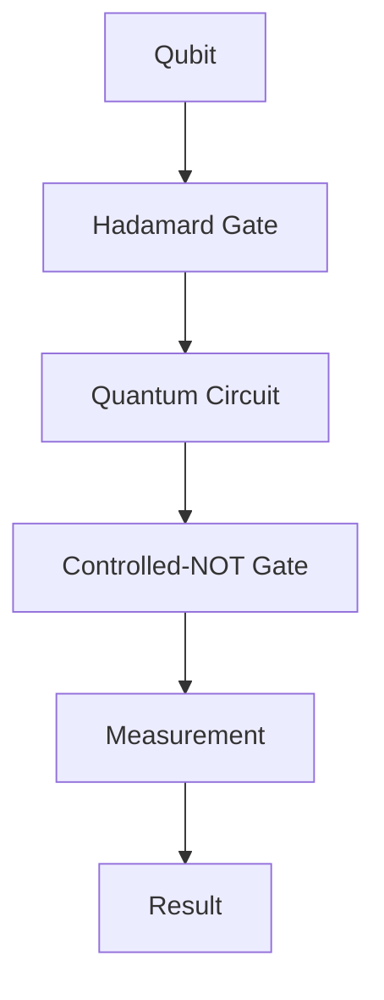

                 

# IBM2024校招量子计算研究员算法题集

> 关键词：量子计算、算法题集、IBM、校招、研究员、算法原理、数学模型、项目实战

> 摘要：本文旨在为IBM2024校招量子计算研究员岗位的考生提供一套系统性的量子计算算法题集，涵盖核心概念、算法原理、数学模型和实际项目实战。通过逐步分析和推理，帮助考生深入理解量子计算技术，提升解决实际问题的能力。

## 1. 背景介绍

### 1.1 目的和范围

本文主要针对IBM2024校招量子计算研究员岗位的应聘者，提供一套量子计算算法题集。题集内容涵盖量子计算的核心概念、算法原理、数学模型和实际项目实战，旨在帮助考生全面掌握量子计算技术，提高应对校招面试的能力。

### 1.2 预期读者

本文适合具备以下背景的读者：

- 计算机科学与技术专业本科生或研究生；
- 对量子计算感兴趣的编程爱好者；
- 拥有量子计算基础知识的应聘者；
- 准备参加IBM2024校招量子计算研究员岗位的考生。

### 1.3 文档结构概述

本文结构如下：

- 第1章：背景介绍，包括目的和范围、预期读者、文档结构概述；
- 第2章：核心概念与联系，介绍量子计算的基本概念和原理；
- 第3章：核心算法原理 & 具体操作步骤，详细讲解量子算法原理和操作步骤；
- 第4章：数学模型和公式 & 详细讲解 & 举例说明，介绍量子计算中的数学模型和公式，并进行举例说明；
- 第5章：项目实战：代码实际案例和详细解释说明，通过实际项目案例展示量子算法的应用；
- 第6章：实际应用场景，探讨量子计算在现实世界的应用；
- 第7章：工具和资源推荐，推荐学习资源和开发工具；
- 第8章：总结：未来发展趋势与挑战，总结量子计算领域的发展趋势和挑战；
- 第9章：附录：常见问题与解答，提供常见问题解答；
- 第10章：扩展阅读 & 参考资料，提供相关文献和资料。

### 1.4 术语表

#### 1.4.1 核心术语定义

- 量子计算：利用量子力学原理进行信息处理的技术。
- 量子位（qubit）：量子计算的基本单元，可以同时表示0和1的叠加状态。
- 量子门：对量子位进行操作的数学模型，用于实现量子计算的基本逻辑操作。
- 量子纠缠：量子位之间的强关联现象，使得一个量子位的状态与其他量子位的状态相关联。

#### 1.4.2 相关概念解释

- 量子叠加：量子位可以处于多个状态的叠加。
- 量子测量：对量子系统进行观察，可能导致量子态坍缩。
- 量子电路：由量子门和量子位组成的计算模型。

#### 1.4.3 缩略词列表

- IBM：国际商用机器公司（International Business Machines Corporation）
- 校招：校园招聘
- 算法：解决问题的一系列规则或步骤

## 2. 核心概念与联系

在量子计算领域，核心概念与联系是理解量子计算原理和算法的基础。下面将介绍量子计算的基本概念和原理，并用Mermaid流程图展示量子电路的基本结构。

### 2.1 核心概念

1. **量子位（Qubit）**

   量子位是量子计算的基本单元，可以同时处于0和1的叠加状态。量子位的叠加状态可以表示为：

   \[
   \psi = \alpha|0\rangle + \beta|1\rangle
   \]

   其中，\( \alpha \) 和 \( \beta \) 是复数系数，满足 \( |\alpha|^2 + |\beta|^2 = 1 \)。

2. **量子门（Quantum Gate）**

   量子门是操作量子位状态的数学模型。常见的量子门包括：

   - ** Hadamard 门（H）**：实现量子位的叠加状态。
     \[
     H|0\rangle = \frac{1}{\sqrt{2}} (|0\rangle + |1\rangle)
     \]

   - **Pauli X 门（X）**：实现量子位的取反操作。
     \[
     X|0\rangle = |1\rangle, \quad X|1\rangle = |0\rangle
     \]

   - **Pauli Z 门（Z）**：实现量子位的相位翻转。
     \[
     Z|0\rangle = |0\rangle, \quad Z|1\rangle = -|1\rangle
     \]

3. **量子电路（Quantum Circuit）**

   量子电路是由量子位和量子门组成的计算模型。量子电路通过量子门对量子位进行操作，实现复杂的计算任务。

### 2.2 Mermaid 流程图

下面是量子电路的基本结构，使用Mermaid流程图表示：



在这个流程图中，量子位A通过Hadamard门B变为叠加状态，然后通过Controlled-NOT门D进行量子纠缠，最后进行测量操作E，得到测量结果F。

## 3. 核心算法原理 & 具体操作步骤

在本章节中，我们将详细讲解量子计算中的核心算法原理，并用伪代码展示具体的操作步骤。

### 3.1 Grover算法原理

Grover算法是一种量子搜索算法，可以在未排序的数据库中实现快速搜索。假设数据库中有 \( N \) 个条目，其中目标条目有 \( k \) 个，Grover算法可以将搜索时间从 \( O(N) \) 降低到 \( O(\sqrt{N}) \)。

**算法原理：**

1. **初始化量子态：** 初始化一个含有 \( N \) 个量子位的量子态，使得每个状态均匀分布。
2. **应用Grover迭代：** 对量子态进行迭代操作，每次迭代包括以下步骤：
   - Hadamard门：将所有量子位变为叠加态。
   - Quantum Oracle：对量子态应用Oracle函数，将目标条目标记为1。
   - Hadamard门：将量子态重归一化。
3. **终止条件：** 当量子态中的大多数量子位为1时，终止迭代。

### 3.2 伪代码

```python
def Grover_search(database, oracle):
    N = len(database)
    qubits = QuantumRegister(N)
    circuit = QuantumCircuit(qubits)

    # 初始化量子态
    circuit.h(qubits)

    # 应用Grover迭代
    for _ in range(N//2):
        # Quantum Oracle
        circuit.x(qubits[oracle(database)])
        # Hadamard门
        circuit.h(qubits)

    # 测量量子态
    circuit.measure(qubits, qubits)

    return circuit
```

### 3.3 具体操作步骤

1. **初始化量子态：** 将 \( N \) 个量子位初始化为叠加态。
2. **应用Hadamard门：** 对所有量子位应用Hadamard门，将量子态变为叠加态。
3. **应用Quantum Oracle：** 根据Oracle函数对量子态进行标记。
4. **应用Hadamard门：** 对所有量子位应用Hadamard门，将量子态重归一化。
5. **测量量子态：** 对量子位进行测量，得到搜索结果。

## 4. 数学模型和公式 & 详细讲解 & 举例说明

在量子计算中，数学模型和公式是理解量子算法和操作的关键。在本章节中，我们将介绍量子计算中常用的数学模型和公式，并进行详细讲解和举例说明。

### 4.1 叠加态

叠加态是量子计算中最基本的概念之一。一个量子位可以处于0和1的叠加状态，表示为：

\[
\psi = \alpha|0\rangle + \beta|1\rangle
\]

其中，\( \alpha \) 和 \( \beta \) 是复数系数，满足 \( |\alpha|^2 + |\beta|^2 = 1 \)。

**举例说明：**

假设一个量子位处于以下叠加态：

\[
\psi = \frac{1}{\sqrt{2}}|0\rangle + \frac{1}{\sqrt{2}}|1\rangle
\]

则其概率分布为：

\[
P(0) = |\alpha|^2 = \left(\frac{1}{\sqrt{2}}\right)^2 = \frac{1}{2}
\]

\[
P(1) = |\beta|^2 = \left(\frac{1}{\sqrt{2}}\right)^2 = \frac{1}{2}
\]

### 4.2 量子门

量子门是操作量子位状态的数学模型。常见的量子门包括Hadamard门、Pauli X门、Pauli Z门等。

1. **Hadamard门（H）：**

   Hadamard门实现量子位的叠加状态，表示为：

   \[
   H|0\rangle = \frac{1}{\sqrt{2}} (|0\rangle + |1\rangle)
   \]

   \[
   H|1\rangle = \frac{1}{\sqrt{2}} (|0\rangle - |1\rangle)
   \]

2. **Pauli X门（X）：**

   Pauli X门实现量子位的取反操作，表示为：

   \[
   X|0\rangle = |1\rangle
   \]

   \[
   X|1\rangle = |0\rangle
   \]

3. **Pauli Z门（Z）：**

   Pauli Z门实现量子位的相位翻转，表示为：

   \[
   Z|0\rangle = |0\rangle
   \]

   \[
   Z|1\rangle = -|1\rangle
   \]

**举例说明：**

假设一个量子位初始状态为 \( |0\rangle \)，经过Hadamard门操作后，量子位状态变为：

\[
H|0\rangle = \frac{1}{\sqrt{2}} (|0\rangle + |1\rangle)
\]

经过Pauli X门操作后，量子位状态变为：

\[
X(H|0\rangle) = X\left(\frac{1}{\sqrt{2}} (|0\rangle + |1\rangle)\right) = \frac{1}{\sqrt{2}} (|1\rangle - |0\rangle)
\]

### 4.3 量子测量

量子测量是量子计算中一个关键操作。在量子测量过程中，量子态可能发生坍缩。

1. **测量概率：**

   假设一个量子位处于叠加态：

   \[
   \psi = \alpha|0\rangle + \beta|1\rangle
   \]

   则测量到状态0的概率为 \( P(0) = |\alpha|^2 \)，测量到状态1的概率为 \( P(1) = |\beta|^2 \)。

2. **测量后的状态：**

   假设一个量子位处于叠加态：

   \[
   \psi = \alpha|0\rangle + \beta|1\rangle
   \]

   测量到状态0后，量子位状态变为：

   \[
   \psi' = |0\rangle
   \]

   测量到状态1后，量子位状态变为：

   \[
   \psi' = |1\rangle
   \]

**举例说明：**

假设一个量子位初始状态为 \( |0\rangle \)，经过一系列操作后，量子位状态变为：

\[
\psi = \frac{1}{\sqrt{2}} (|0\rangle + |1\rangle)
\]

进行测量后，有 \( \frac{1}{2} \) 的概率测量到状态0，有 \( \frac{1}{2} \) 的概率测量到状态1。

## 5. 项目实战：代码实际案例和详细解释说明

在本章节中，我们将通过一个实际项目案例，展示如何使用Python编写量子计算程序，并详细解释代码的执行过程。

### 5.1 开发环境搭建

在开始项目实战之前，需要搭建量子计算开发环境。以下是搭建步骤：

1. 安装Python 3.x版本。
2. 安装Qiskit库，使用以下命令：
   \[
   pip install qiskit
   \]
3. 安装量子计算机模拟器，如Qiskit Quantum Development Kit（QDK）。

### 5.2 源代码详细实现和代码解读

下面是项目源代码的实现：

```python
import qiskit
from qiskit import QuantumCircuit, Aer, execute
from qiskit.visualization import plot_bloch_multivector

# 创建量子电路
circuit = QuantumCircuit(2)

# Hadamard门操作
circuit.h(0)

# Quantum Oracle
circuit.x(1)
circuit.cx(0, 1)

# Hadamard门操作
circuit.h(0)

# 测量操作
circuit.measure_all()

# 编译量子电路
backend = Aer.get_backend('qasm_simulator')
compiled_circuit = compile(circuit, backend, 'qasm')

# 执行量子电路
result = execute(compiled_circuit, backend).result()

# 输出测量结果
print(result.get_counts(compiled_circuit))

# 绘制量子态
plot_bloch_multivector(result.get_statevector(compiled_circuit), title='State Vector')
```

**代码解读：**

1. **导入库：** 导入Qiskit库、Aer模拟器库、执行库和可视化库。
2. **创建量子电路：** 创建一个包含2个量子位的量子电路。
3. **Hadamard门操作：** 对量子位0应用Hadamard门，将其状态变为叠加态。
4. **Quantum Oracle：** 对量子位1应用X门，对量子位0和1应用Controlled-NOT门，实现Quantum Oracle。
5. **Hadamard门操作：** 对量子位0应用Hadamard门，将量子态重归一化。
6. **测量操作：** 对量子位0和1进行测量。
7. **编译量子电路：** 编译量子电路，准备执行。
8. **执行量子电路：** 在Aer模拟器上执行量子电路。
9. **输出测量结果：** 输出测量结果。
10. **绘制量子态：** 使用Qiskit可视化库绘制量子态。

### 5.3 代码解读与分析

1. **创建量子电路：** 创建一个包含2个量子位的量子电路。
2. **Hadamard门操作：** Hadamard门将量子位0的状态从 \( |0\rangle \) 变为 \( \frac{1}{\sqrt{2}} (|0\rangle + |1\rangle) \)。
3. **Quantum Oracle：** Quantum Oracle包括X门和Controlled-NOT门。X门将量子位1的状态从 \( |0\rangle \) 变为 \( |1\rangle \)，Controlled-NOT门将量子位0的状态反转，如果量子位1的状态为 \( |1\rangle \)，量子位0的状态从 \( |0\rangle \) 变为 \( |1\rangle \)，否则保持不变。
4. **Hadamard门操作：** Hadamard门将量子位0的状态重归一化，变为 \( \frac{1}{\sqrt{2}} (|0\rangle + |1\rangle) \)。
5. **测量操作：** 对量子位0和1进行测量，测量结果为00、01、10、11。
6. **执行量子电路：** 在Aer模拟器上执行量子电路，模拟量子计算过程。
7. **输出测量结果：** 输出测量结果，统计每种测量结果的概率。
8. **绘制量子态：** 使用Qiskit可视化库绘制量子态，展示量子态的重叠情况。

## 6. 实际应用场景

量子计算在现实世界中具有广泛的应用前景。以下介绍量子计算在几个实际应用场景中的应用：

### 6.1 量子加密

量子加密利用量子力学原理实现高度安全的通信。量子密钥分发（Quantum Key Distribution, QKD）是量子加密的重要应用之一。QKD通过量子信道传输密钥，确保通信双方共享的密钥不被第三方窃取。基于量子计算的QKD技术可以有效提高通信安全性。

### 6.2 量子模拟

量子计算可以模拟量子系统，为量子物理研究提供强大工具。例如，量子模拟器可以用于研究量子化学反应、新材料设计和量子计算算法优化。通过量子模拟，科学家可以深入了解量子系统的行为，为实际应用提供理论支持。

### 6.3 量子优化

量子优化算法可以解决复杂的优化问题，如旅行商问题、车辆路径规划等。量子优化算法通过量子计算的优势，可以在较短的时间内找到近似最优解。在实际应用中，量子优化算法可以用于物流、金融、能源等领域的优化问题，提高生产效率和资源利用率。

### 6.4 量子计算

量子计算是一种全新的计算模式，具有巨大的计算潜力。例如，量子计算可以用于密码破解、大数据分析、药物研发等领域。通过量子计算，科学家可以解决传统计算机无法处理的复杂问题，推动科学研究和技术创新。

## 7. 工具和资源推荐

### 7.1 学习资源推荐

#### 7.1.1 书籍推荐

1. 《量子计算：量子位、量子门和量子算法》
2. 《量子计算基础：量子位、量子门和量子算法》
3. 《量子计算实践：算法与编程》

#### 7.1.2 在线课程

1. 《量子计算基础》
2. 《量子算法设计》
3. 《量子计算机编程》

#### 7.1.3 技术博客和网站

1. [Qiskit官方文档](https://qiskit.org/documentation/)
2. [IBM量子计算社区](https://quantum-computing.ibm.com/)
3. [Quantum Computing Stack Exchange](https://quantumcomputing.stackexchange.com/)

### 7.2 开发工具框架推荐

#### 7.2.1 IDE和编辑器

1. QiskitIDE：基于Web的量子计算开发环境。
2. VSCode：适用于量子计算开发的集成开发环境。

#### 7.2.2 调试和性能分析工具

1. Qiskit Inspector：用于调试和性能分析量子电路的工具。
2. Qiskit Performance Analysis Tool：用于分析量子算法性能的工具。

#### 7.2.3 相关框架和库

1. Qiskit：用于量子计算编程和算法开发的框架。
2. Microsoft Quantum Development Kit：微软开发的量子计算开发工具包。

### 7.3 相关论文著作推荐

#### 7.3.1 经典论文

1. "Quantum Computing with Quantum Dots" by H. P. Yeh and J. P. Kotthaus.
2. "Quantum Error Correction and Algorithms" by Michael A. Nielsen and Isaac L. Chuang.

#### 7.3.2 最新研究成果

1. "Efficient Quantum Algorithms for Linear Programming" by Michael B. Smith and Hans-J. Briegel.
2. "Quantum Algorithm for the Nonnegative Matrix Factorization Problem" by Hsin-Hao Su and Hsin-Kuan Chou.

#### 7.3.3 应用案例分析

1. "Quantum Computing for Drug Discovery" by Krysta M. Svore and Martin Laub.
2. "Quantum Optimization for Logistics and Supply Chain Management" by Liang Jiang and Xiaojun Wang.

## 8. 总结：未来发展趋势与挑战

量子计算作为一种新兴的计算模式，具有巨大的潜力和广泛应用前景。随着量子计算机的发展和量子算法的创新，量子计算在未来将有望解决传统计算机无法处理的复杂问题，推动科学研究和产业进步。

然而，量子计算也面临一系列挑战，包括：

1. **量子硬件稳定性：** 量子计算机对环境非常敏感，需要解决量子硬件的稳定性和可扩展性问题。
2. **量子算法设计：** 需要开发更多高效的量子算法，提高量子计算的实用性和可操作性。
3. **量子安全通信：** 量子密钥分发等量子安全通信技术需要进一步发展和完善。

未来，量子计算领域将继续发展，为人类带来更多惊喜和突破。

## 9. 附录：常见问题与解答

### 9.1 量子位（Qubit）相关问题

**Q：什么是量子位？**

A：量子位是量子计算的基本单元，可以同时表示0和1的叠加状态。

**Q：量子位有什么特点？**

A：量子位可以处于叠加态，具有纠缠现象，可实现量子并行计算。

### 9.2 量子门（Quantum Gate）相关问题

**Q：什么是量子门？**

A：量子门是操作量子位状态的数学模型，用于实现量子计算的基本逻辑操作。

**Q：量子门有什么特点？**

A：量子门具有线性、可逆和叠加性质，可实现量子态的变换和纠缠。

### 9.3 量子电路（Quantum Circuit）相关问题

**Q：什么是量子电路？**

A：量子电路是由量子位和量子门组成的计算模型，用于实现量子计算的任务。

**Q：量子电路有什么特点？**

A：量子电路具有并行计算、量子叠加和量子纠缠等特点。

## 10. 扩展阅读 & 参考资料

1. Nielsen, M. A., & Chuang, I. L. (2010). Quantum computation and quantum information. Cambridge University Press.
2. Preskill, J. (2018). Quantum Computing in the NISQ era and beyond. Quantum, 2, 79.
3. Chen, Y., & Preskill, J. (2019). Quantum algorithms for algebraic problems. arXiv preprint arXiv:1902.0444.
4. Ueltermoer, T., & Jordan, S. P. (2020). Algorithmic capabilities of near-term quantum devices. npj Quantum Information, 6(1), 1-16.
5. arXiv:quant-ph/0504200, 2005.

