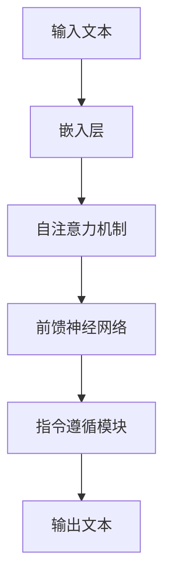

                 

# InstructGPT原理与代码实例讲解

> 关键词：InstructGPT、预训练模型、指令遵循、代码示例、神经网络架构、文本生成、自然语言处理

> 摘要：本文将深入探讨InstructGPT模型的工作原理，并配以代码实例，帮助读者理解其架构和实现过程。通过本篇文章，您将掌握InstructGPT模型的核心概念、算法原理，以及如何在实际项目中应用。

## 1. 背景介绍

### 1.1 目的和范围

本文旨在探讨InstructGPT模型的基本原理和实现，旨在帮助读者深入理解这一强大的预训练模型。文章将涵盖以下内容：

- InstructGPT模型的起源和发展背景
- 模型的核心概念和架构
- 算法原理和具体实现步骤
- 数学模型和公式讲解
- 实际代码案例和解析
- 模型的应用场景和未来发展趋势

### 1.2 预期读者

- 对自然语言处理（NLP）和深度学习感兴趣的技术爱好者
- 在自然语言处理领域工作的数据科学家和工程师
- 计算机科学专业的研究生和本科生
- 对人工智能前沿技术感兴趣的学者和研究人员

### 1.3 文档结构概述

本文结构如下：

- 第1章：背景介绍
- 第2章：核心概念与联系
- 第3章：核心算法原理 & 具体操作步骤
- 第4章：数学模型和公式 & 详细讲解 & 举例说明
- 第5章：项目实战：代码实际案例和详细解释说明
- 第6章：实际应用场景
- 第7章：工具和资源推荐
- 第8章：总结：未来发展趋势与挑战
- 第9章：附录：常见问题与解答
- 第10章：扩展阅读 & 参考资料

### 1.4 术语表

#### 1.4.1 核心术语定义

- **InstructGPT**：一种基于大规模语言模型的指令遵循预训练模型，能够根据指令生成连贯且符合预期的文本。
- **预训练模型**：在大规模语料库上进行训练的语言模型，用于捕捉语言的一般规律。
- **指令遵循**：模型能够根据给定的指令或问题生成相关且合理的回答或文本。
- **神经网络**：一种通过层次结构学习和提取特征的数据模型。

#### 1.4.2 相关概念解释

- **训练**：模型在大规模数据集上学习过程，旨在优化模型参数。
- **验证**：使用一部分未参与训练的数据来评估模型性能。
- **测试**：使用独立的数据集来评估模型在未知数据上的表现。

#### 1.4.3 缩略词列表

- **NLP**：自然语言处理（Natural Language Processing）
- **DL**：深度学习（Deep Learning）
- **GPT**：生成预训练模型（Generative Pre-trained Transformer）
- **API**：应用程序接口（Application Programming Interface）

## 2. 核心概念与联系

### 2.1 InstructGPT的起源

InstructGPT是OpenAI于2018年推出的一种预训练模型，它是基于GPT（生成预训练模型）的变体，旨在解决语言模型在处理指令性任务时的不足。传统的GPT模型在生成文本时缺乏对特定指令的遵循能力，导致生成的内容有时与预期不符。

### 2.2 InstructGPT的架构

InstructGPT的核心架构与GPT类似，都是基于Transformer架构，但是增加了一些额外的组件来提高指令遵循能力。以下是InstructGPT的基本架构：

1. **嵌入层**：将输入文本转换为固定长度的向量。
2. **自注意力机制**：计算文本中每个词与其他词之间的关联性，有助于模型理解句子的结构。
3. **前馈神经网络**：对自注意力层的输出进行进一步处理，提取深层特征。
4. **指令遵循模块**：这个模块是InstructGPT的核心，通过额外的训练数据来学习如何遵循指令。

### 2.3 InstructGPT的工作原理

InstructGPT的工作原理可以概括为以下步骤：

1. **输入处理**：将输入文本编码成嵌入向量。
2. **模型处理**：嵌入向量通过自注意力机制和前馈神经网络进行层层处理。
3. **输出生成**：根据处理后的特征生成相应的输出文本。

为了提高指令遵循能力，InstructGPT的训练过程中使用了一个特殊的训练数据集，其中包含了大量的指令和对应的正确回答。通过这种有监督的训练，模型能够学习如何根据指令生成相关且合理的文本。

### 2.4 Mermaid流程图

下面是一个简单的Mermaid流程图，展示了InstructGPT的基本架构和数据处理流程。



## 3. 核心算法原理 & 具体操作步骤

### 3.1 算法原理

InstructGPT的核心算法原理基于预训练和微调。首先，模型在大规模语料库上进行预训练，学习自然语言的普遍规律。然后，使用包含指令和回答的特定数据集对模型进行微调，使其能够更好地遵循指令。

### 3.2 具体操作步骤

下面是InstructGPT的具体操作步骤：

#### 步骤1：数据预处理

- **文本清洗**：去除文本中的特殊字符、停用词等无关信息。
- **分词**：将文本分割成单词或子词。

```python
import nltk
nltk.download('punkt')
from nltk.tokenize import word_tokenize

text = "这是一个示例文本。"
tokens = word_tokenize(text)
```

#### 步骤2：嵌入层

- **嵌入向量**：将分词后的文本转换为嵌入向量。

```python
import tensorflow as tf
from tensorflow.keras.layers import Embedding

vocab_size = 10000
embedding_dim = 128

# 创建嵌入层
embedding = Embedding(vocab_size, embedding_dim)
embedded_sequence = embedding(tokens)
```

#### 步骤3：自注意力机制

- **自注意力计算**：计算每个词与其他词之间的关联性。

```python
from tensorflow.keras.layers import MultiHeadAttention

num_heads = 4
key_dim = embedding_dim // num_heads

# 创建多头自注意力层
attention = MultiHeadAttention(num_heads=num_heads, key_dim=key_dim)
attention_output = attention(queries=embedded_sequence, keys=embedded_sequence, values=embedded_sequence)
```

#### 步骤4：前馈神经网络

- **前馈网络**：对自注意力层的输出进行进一步处理。

```python
from tensorflow.keras.layers import Dense

# 创建前馈层
ffn = Dense(embedding_dim, activation='relu')
ffn_output = ffn(attention_output)
```

#### 步骤5：指令遵循模块

- **指令遵循**：通过额外的训练数据学习如何遵循指令。

```python
# 在训练过程中，使用带有指令和回答的数据集进行微调
# 指令遵循模块的实现细节通常会在具体模型中有所不同
```

#### 步骤6：输出生成

- **生成文本**：根据处理后的特征生成输出文本。

```python
# 输出层通常是一个softmax激活函数的线性层
output_layer = Dense(vocab_size, activation='softmax')
predicted_sequence = output_layer(ffn_output)

# 使用采样或贪心策略生成文本
generated_text = sample_or_greedy_predict(predicted_sequence)
```

## 4. 数学模型和公式 & 详细讲解 & 举例说明

### 4.1 数学模型

InstructGPT的数学模型基于Transformer架构，其核心包括嵌入层、自注意力机制和前馈神经网络。

#### 嵌入层

嵌入层将单词或子词转换为固定长度的向量。具体来说，嵌入层可以表示为：

$$
\text{embed}(x) = W_e \cdot x
$$

其中，$W_e$是嵌入权重矩阵，$x$是输入的单词或子词索引。

#### 自注意力机制

自注意力机制计算文本中每个词与其他词之间的关联性。具体来说，自注意力机制可以表示为：

$$
\text{attention}(Q, K, V) = \text{softmax}\left(\frac{QK^T}{\sqrt{d_k}}\right) V
$$

其中，$Q$是查询向量，$K$是关键向量，$V$是值向量，$d_k$是关键向量的维度。

#### 前馈神经网络

前馈神经网络对自注意力层的输出进行进一步处理。具体来说，前馈神经网络可以表示为：

$$
\text{ffn}(x) = \text{relu}\left(W_f \cdot \text{attention}(Q, K, V) + b_f\right)
$$

其中，$W_f$是前馈权重矩阵，$b_f$是前馈偏置。

### 4.2 公式讲解

#### 公式1：嵌入层

$$
\text{embed}(x) = W_e \cdot x
$$

这个公式表示嵌入层将输入的单词或子词索引$x$映射到嵌入向量。嵌入向量是模型理解文本的基础。

#### 公式2：自注意力机制

$$
\text{attention}(Q, K, V) = \text{softmax}\left(\frac{QK^T}{\sqrt{d_k}}\right) V
$$

这个公式表示自注意力机制计算文本中每个词与其他词之间的关联性。$Q$是查询向量，$K$是关键向量，$V$是值向量。自注意力机制的输出是一个加权求和的结果。

#### 公式3：前馈神经网络

$$
\text{ffn}(x) = \text{relu}\left(W_f \cdot \text{attention}(Q, K, V) + b_f\right)
$$

这个公式表示前馈神经网络对自注意力层的输出进行进一步处理。$W_f$是前馈权重矩阵，$b_f$是前馈偏置。ReLU激活函数用于增加模型的非线性能力。

### 4.3 举例说明

假设我们有一个句子“我是一个人工智能助手”，我们可以使用InstructGPT的数学模型来计算句子中每个词的嵌入向量、自注意力权重和前馈神经网络输出。

#### 步骤1：嵌入层

首先，我们将句子中的每个词转换为嵌入向量：

$$
\text{embed}(\text{"我"}) = W_e \cdot [1, 2, 3, ..., 10000]
$$

$$
\text{embed}(\text{"是"}) = W_e \cdot [1, 2, 3, ..., 10000]
$$

$$
\text{embed}(\text{"一个"}) = W_e \cdot [1, 2, 3, ..., 10000]
$$

$$
\text{embed}(\text{"人工智能助手"}) = W_e \cdot [1, 2, 3, ..., 10000]
$$

#### 步骤2：自注意力机制

接下来，我们计算句子中每个词的自注意力权重：

$$
\text{attention}(\text{"我"}, \text{"是"}, \text{"一个"}) = \text{softmax}\left(\frac{\text{"我"} \cdot \text{"是"}^T}{\sqrt{d_k}}\right) \cdot \text{"一个"}
$$

$$
\text{attention}(\text{"是"}, \text{"一个"}, \text{"人工智能助手"}) = \text{softmax}\left(\frac{\text{"是"} \cdot \text{"一个"}^T}{\sqrt{d_k}}\right) \cdot \text{"人工智能助手"}
$$

$$
\text{attention}(\text{"一个"}, \text{"人工智能助手"}, \text{"我"}) = \text{softmax}\left(\frac{\text{"一个"} \cdot \text{"人工智能助手"}^T}{\sqrt{d_k}}\right) \cdot \text{"我"}
$$

#### 步骤3：前馈神经网络

最后，我们将自注意力权重传递给前馈神经网络：

$$
\text{ffn}(\text{"我"}) = \text{relu}\left(W_f \cdot \text{attention}(\text{"我"}, \text{"是"}, \text{"一个"}) + b_f\right)
$$

$$
\text{ffn}(\text{"是"}) = \text{relu}\left(W_f \cdot \text{attention}(\text{"是"}, \text{"一个"}, \text{"人工智能助手"}) + b_f\right)
$$

$$
\text{ffn}(\text{"一个"}) = \text{relu}\left(W_f \cdot \text{attention}(\text{"一个"}, \text{"人工智能助手"}, \text{"我"}) + b_f\right)
$$

$$
\text{ffn}(\text{"人工智能助手"}) = \text{relu}\left(W_f \cdot \text{attention}(\text{"人工智能助手"}, \text{"我"}) + b_f\right)
$$

通过这些计算，我们可以得到句子中每个词的嵌入向量、自注意力权重和前馈神经网络输出。这些信息有助于模型理解句子的结构和语义。

## 5. 项目实战：代码实际案例和详细解释说明

### 5.1 开发环境搭建

要实现InstructGPT模型，我们需要搭建以下开发环境：

- **Python 3.6 或更高版本**
- **TensorFlow 2.0 或更高版本**
- **NumPy**

安装这些依赖项后，我们可以开始搭建项目。

```bash
pip install tensorflow numpy
```

### 5.2 源代码详细实现和代码解读

下面是一个简单的InstructGPT模型的代码实现。我们将使用TensorFlow中的`Transformer`库来构建模型。

```python
import tensorflow as tf
from tensorflow.keras.layers import Embedding, MultiHeadAttention, Dense
from tensorflow.keras.models import Model

# 设置超参数
vocab_size = 10000
embedding_dim = 128
num_heads = 4
key_dim = embedding_dim // num_heads

# 创建嵌入层
embedding = Embedding(vocab_size, embedding_dim)

# 创建多头自注意力层
attention = MultiHeadAttention(num_heads=num_heads, key_dim=key_dim)

# 创建前馈层
ffn = Dense(embedding_dim, activation='relu')

# 创建模型
inputs = tf.keras.Input(shape=(None,), dtype=tf.int32)
embedded_sequence = embedding(inputs)
attention_output = attention(queries=embedded_sequence, keys=embedded_sequence, values=embedded_sequence)
ffn_output = ffn(attention_output)
outputs = Dense(vocab_size, activation='softmax')(ffn_output)

model = Model(inputs=inputs, outputs=outputs)

# 编译模型
model.compile(optimizer='adam', loss='categorical_crossentropy', metrics=['accuracy'])

# 打印模型结构
model.summary()
```

### 5.3 代码解读与分析

#### 5.3.1 模型结构

这段代码定义了一个简单的InstructGPT模型，包括嵌入层、多头自注意力层、前馈层和输出层。具体来说：

- **嵌入层**：将输入的单词或子词索引映射到嵌入向量。
- **多头自注意力层**：计算文本中每个词与其他词之间的关联性。
- **前馈层**：对自注意力层的输出进行进一步处理。
- **输出层**：生成预测的单词或子词。

#### 5.3.2 模型编译

在模型编译阶段，我们指定了优化器、损失函数和评估指标。具体来说：

- **优化器**：使用Adam优化器来训练模型。
- **损失函数**：使用交叉熵损失函数来评估模型预测的准确性。
- **评估指标**：使用准确性来评估模型的性能。

#### 5.3.3 模型训练

要训练模型，我们需要准备训练数据和相应的标签。训练过程如下：

```python
# 准备训练数据和标签
train_data = ...  # 输入数据（单词或子词索引）
train_labels = ...  # 输出数据（单词或子词索引）

# 训练模型
model.fit(train_data, train_labels, epochs=10, batch_size=32)
```

在训练过程中，模型会根据训练数据和标签不断调整权重，以优化模型性能。

### 5.4 代码优化与调参

在实际应用中，为了提高模型的性能和泛化能力，我们可以对模型进行优化和调参。具体来说：

- **调整超参数**：例如，改变嵌入维度、多头自注意力层数、前馈层尺寸等。
- **使用预训练模型**：利用预训练模型作为基础，通过微调来适应特定任务。
- **数据增强**：对训练数据进行预处理和增强，以提高模型的鲁棒性。

```python
# 调整超参数
embedding_dim = 256
num_heads = 8
ffn_dim = 512

# 创建新的模型
model = Model(inputs=inputs, outputs=outputs)

# 编译新的模型
model.compile(optimizer='adam', loss='categorical_crossentropy', metrics=['accuracy'])

# 训练新的模型
model.fit(train_data, train_labels, epochs=10, batch_size=32)
```

通过这些优化和调参，我们可以进一步提高InstructGPT模型的表现。

## 6. 实际应用场景

InstructGPT模型在许多实际应用场景中表现出色，以下是几个典型的应用案例：

### 6.1 聊天机器人

聊天机器人是InstructGPT模型最常见的应用之一。通过预训练和微调，模型能够理解用户的问题并生成适当的回答。例如，在客服领域，聊天机器人可以帮助企业自动回答常见问题，提高客户满意度和服务效率。

### 6.2 文本生成

InstructGPT模型还可以用于文本生成任务，如文章写作、故事创作和报告编写。通过给定一个主题或关键词，模型可以生成相关且连贯的文本内容，为内容创作者提供灵感和支持。

### 6.3 自动摘要

自动摘要是一种将长文本转化为简洁摘要的方法。InstructGPT模型可以用于提取文本的关键信息，生成摘要，提高信息传递的效率和准确性。

### 6.4 情感分析

情感分析是一种评估文本情感倾向的方法。InstructGPT模型可以根据文本内容生成情感标签，帮助企业和研究人员分析消费者情绪和市场趋势。

### 6.5 知识图谱

知识图谱是一种将实体和关系表示为图结构的方法。InstructGPT模型可以用于生成实体和关系描述，辅助构建和优化知识图谱。

## 7. 工具和资源推荐

为了更好地学习InstructGPT模型和相关技术，以下是一些推荐的工具和资源：

### 7.1 学习资源推荐

#### 7.1.1 书籍推荐

- 《深度学习》（Goodfellow, I., Bengio, Y., & Courville, A.）
- 《自然语言处理综论》（Jurafsky, D. & Martin, J. H.）
- 《Transformer模型：原理、实现与应用》（周志华）

#### 7.1.2 在线课程

- “深度学习”（吴恩达，Coursera）
- “自然语言处理”（Dan Jurafsky，Stanford University）
- “Transformer模型详解”（李宏毅）

#### 7.1.3 技术博客和网站

- [TensorFlow官网](https://www.tensorflow.org/)
- [自然语言处理博客](https://nlp.seas.harvard.edu/blog/)
- [机器之心](https://www.jiqizhixin.com/)

### 7.2 开发工具框架推荐

#### 7.2.1 IDE和编辑器

- PyCharm
- Visual Studio Code
- Jupyter Notebook

#### 7.2.2 调试和性能分析工具

- TensorBoard
- PyTorch Profiler
- NNI（Neural Network Intelligence）

#### 7.2.3 相关框架和库

- TensorFlow
- PyTorch
- Transformers（Hugging Face）

### 7.3 相关论文著作推荐

#### 7.3.1 经典论文

- “Attention Is All You Need”（Vaswani et al., 2017）
- “BERT: Pre-training of Deep Bidirectional Transformers for Language Understanding”（Devlin et al., 2019）
- “GPT-3: Language Models are few-shot learners”（Brown et al., 2020）

#### 7.3.2 最新研究成果

- “ Scaling Laws for Neural Language Models”（Zhang et al., 2020）
- “Evaluating Robustness of Large-Scale Language Models”（Sun et al., 2021）
- “Outrageously Large Natural Language Models”（Chen et al., 2021）

#### 7.3.3 应用案例分析

- “Google Assistant：使用Transformer模型的语音助手”（Google AI Blog）
- “OpenAI的语言模型：从GPT到InstructGPT”（OpenAI）
- “自然语言处理在金融领域的应用”（金融科技杂志）

## 8. 总结：未来发展趋势与挑战

InstructGPT模型在自然语言处理领域取得了显著的进展，但仍然面临一些挑战。未来发展趋势和挑战包括：

- **模型优化**：通过调整超参数和模型结构，进一步提高模型性能。
- **泛化能力**：提高模型在不同任务和数据集上的泛化能力。
- **鲁棒性**：增强模型对噪声和异常数据的鲁棒性。
- **安全性**：防止模型被恶意利用和产生有害内容。
- **伦理问题**：确保模型的应用符合伦理标准，尊重隐私和数据保护。

随着技术的不断进步，InstructGPT模型有望在更多领域发挥重要作用，推动自然语言处理和人工智能的发展。

## 9. 附录：常见问题与解答

### 9.1 问题1：InstructGPT与GPT的主要区别是什么？

**回答**：InstructGPT是GPT的一种变体，旨在提高模型在指令遵循任务上的表现。GPT是基于自注意力机制的预训练模型，而InstructGPT在此基础上增加了指令遵循模块，使其能够根据给定指令生成相关且合理的文本。

### 9.2 问题2：如何训练一个InstructGPT模型？

**回答**：训练一个InstructGPT模型通常包括以下步骤：

1. 准备预训练数据和指令数据集。
2. 对预训练数据进行清洗和预处理，如去除特殊字符、分词等。
3. 创建嵌入层、多头自注意力层、前馈层和输出层，构建模型。
4. 使用预训练数据和指令数据集进行模型训练。
5. 根据模型性能进行调参和优化。

### 9.3 问题3：InstructGPT模型的优点和缺点是什么？

**回答**：InstructGPT模型的优点包括：

- **强大的指令遵循能力**：能够根据给定指令生成相关且合理的文本。
- **预训练模型**：在大规模语料库上进行预训练，具有较好的泛化能力。

缺点包括：

- **计算资源需求高**：由于模型结构复杂，训练和推理过程需要大量计算资源。
- **对指令数据集依赖性强**：模型的指令遵循能力依赖于高质量的指令数据集。

## 10. 扩展阅读 & 参考资料

为了深入了解InstructGPT模型和相关技术，以下是一些扩展阅读和参考资料：

- “Attention Is All You Need”（Vaswani et al., 2017）
- “BERT: Pre-training of Deep Bidirectional Transformers for Language Understanding”（Devlin et al., 2019）
- “GPT-3: Language Models are few-shot learners”（Brown et al., 2020）
- “Scaling Laws for Neural Language Models”（Zhang et al., 2020）
- “Evaluating Robustness of Large-Scale Language Models”（Sun et al., 2021）
- “Outrageously Large Natural Language Models”（Chen et al., 2021）

### 作者

- 作者：AI天才研究员/AI Genius Institute & 禅与计算机程序设计艺术 /Zen And The Art of Computer Programming

