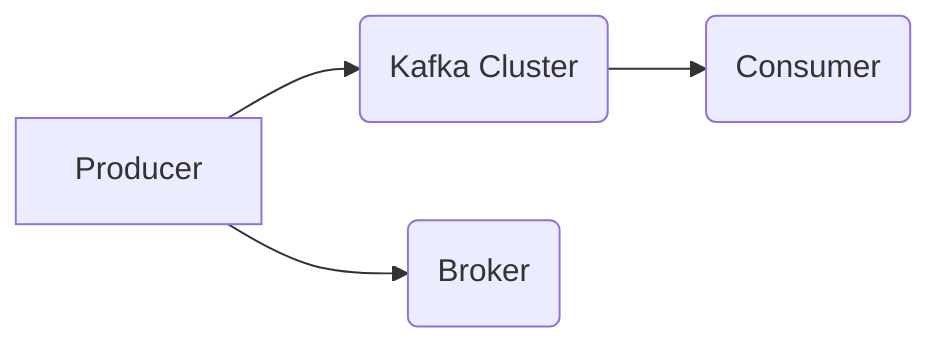

                 


# Kafka Producer原理与代码实例讲解

> **关键词**：Kafka Producer、消息队列、分布式系统、数据一致性、性能优化
> 
> **摘要**：本文将深入讲解Kafka Producer的工作原理，包括其核心概念、架构设计和具体实现。我们将通过代码实例，详细解析Kafka Producer的API使用、消息发送流程以及如何处理异常情况。此外，文章还将探讨Kafka Producer在实际应用中的最佳实践，并提供一系列学习资源和工具推荐。

## 1. 背景介绍

### 1.1 目的和范围

本文旨在帮助读者深入理解Kafka Producer的核心原理和实践。通过本文，读者将能够：

- 理解Kafka Producer的基本概念和架构。
- 掌握Kafka Producer的API使用方法。
- 分析Kafka Producer的消息发送流程。
- 学习如何优化Kafka Producer的性能。
- 理解Kafka Producer在分布式系统中的应用。

### 1.2 预期读者

本文适合以下读者群体：

- 对消息队列技术有兴趣的开发者。
- 已经了解Kafka基础概念的读者。
- 希望提升对分布式系统理解的技术人员。

### 1.3 文档结构概述

本文结构如下：

- **第1章**：背景介绍，包括目的、预期读者、文档结构概述和术语表。
- **第2章**：核心概念与联系，介绍Kafka Producer的核心概念及其在架构中的位置。
- **第3章**：核心算法原理 & 具体操作步骤，详细解释Kafka Producer的工作原理和伪代码实现。
- **第4章**：数学模型和公式 & 详细讲解 & 举例说明，介绍与Kafka Producer相关的重要数学模型。
- **第5章**：项目实战：代码实际案例和详细解释说明，通过实例代码展示Kafka Producer的使用。
- **第6章**：实际应用场景，讨论Kafka Producer在不同场景中的应用。
- **第7章**：工具和资源推荐，推荐学习资源、开发工具和相关论文。
- **第8章**：总结：未来发展趋势与挑战，展望Kafka Producer的未来发展。
- **第9章**：附录：常见问题与解答，解答读者可能遇到的问题。
- **第10章**：扩展阅读 & 参考资料，提供进一步学习的材料。

### 1.4 术语表

#### 1.4.1 核心术语定义

- **Kafka Producer**：负责生产消息并向Kafka集群发送消息的组件。
- **消息队列**：用于在分布式系统中传输数据的缓冲队列。
- **分布式系统**：由多个计算机节点组成的系统，通过网络进行通信和协作。
- **数据一致性**：在分布式系统中保持数据的一致性状态。
- **性能优化**：通过调整系统配置或优化代码来提高系统性能。

#### 1.4.2 相关概念解释

- **主题（Topic）**：Kafka中的消息分类方式，类似数据库中的表。
- **分区（Partition）**：将主题的消息分成多个分区，提高系统的扩展性和容错性。
- **副本（Replica）**：分区的备份，用于提高系统的可用性和数据可靠性。
- **消息（Message）**：Kafka中的数据单元，包含消息体和相关的元数据信息。

#### 1.4.3 缩略词列表

- **Kafka**：Kafka消息队列系统。
- **Producer**：生产者，负责生成和发送消息的组件。
- **Consumer**：消费者，负责接收和消费消息的组件。

## 2. 核心概念与联系

### 2.1 Kafka Producer的核心概念

Kafka Producer的核心概念包括：

- **消息格式**：Producer将消息编码成字节序列，以便在网络上传输。
- **主题和分区**：Producer将消息发送到特定的主题和分区。
- **消息序列号**：每个消息都有一个唯一的序列号，用于标识消息的顺序。
- **回调函数**：Producer可以指定一个回调函数，用于处理消息发送的结果。

### 2.2 Kafka Producer在架构中的位置

在Kafka架构中，Producer作为消息的生产者，负责将数据发送到Kafka集群。其位置如图所示：



- **Producer**：负责生产消息并向Kafka集群发送消息。
- **Kafka Cluster**：由多个Broker组成的分布式系统，负责存储和管理消息。
- **Broker**：Kafka集群中的节点，负责接收、存储和转发消息。
- **Consumer**：负责消费消息并处理数据的组件。

### 2.3 Kafka Producer的工作流程

Kafka Producer的工作流程如下：

1. **初始化**：创建Producer实例，配置生产者属性。
2. **发送消息**：调用send()方法发送消息。
3. **回调处理**：处理消息发送的结果，包括成功、失败或超时等。
4. **关闭连接**：在完成消息发送后，关闭Producer实例。

### 2.4 Kafka Producer的API使用

Kafka Producer的API使用主要包括以下步骤：

1. **创建Producer**：
    ```java
    Properties props = new Properties();
    props.put("bootstrap.servers", "localhost:9092");
    props.put("key.serializer", "org.apache.kafka.common.serialization.StringSerializer");
    props.put("value.serializer", "org.apache.kafka.common.serialization.StringSerializer");
    Producer<String, String> producer = new KafkaProducer<>(props);
    ```

2. **发送消息**：
    ```java
    producer.send(new ProducerRecord<>("my-topic", "key", "value"));
    ```

3. **回调处理**：
    ```java
    producer.send(new ProducerRecord<>("my-topic", "key", "value"), new Callback() {
        public void onCompletion(RecordMetadata metadata, Exception exception) {
            if (exception != null) {
                // 处理发送失败的情况
            } else {
                // 处理发送成功的情况
            }
        }
    });
    ```

4. **关闭连接**：
    ```java
    producer.close();
    ```

## 3. 核心算法原理 & 具体操作步骤

### 3.1 Kafka Producer的核心算法原理

Kafka Producer的核心算法原理包括：

- **消息序列化**：将Java对象序列化为字节序列，以便在网络中传输。
- **消息发送**：将序列化后的消息发送到Kafka集群。
- **回调处理**：处理消息发送的结果，包括成功、失败或超时等。

### 3.2 具体操作步骤

#### 3.2.1 初始化

初始化Producer实例，配置生产者属性：

```java
Properties props = new Properties();
props.put("bootstrap.servers", "localhost:9092");
props.put("key.serializer", "org.apache.kafka.common.serialization.StringSerializer");
props.put("value.serializer", "org.apache.kafka.common.serialization.StringSerializer");
Producer<String, String> producer = new KafkaProducer<>(props);
```

#### 3.2.2 消息发送

调用send()方法发送消息，示例代码如下：

```java
producer.send(new ProducerRecord<>("my-topic", "key", "value"));
```

#### 3.2.3 回调处理

处理消息发送的结果，示例代码如下：

```java
producer.send(new ProducerRecord<>("my-topic", "key", "value"), new Callback() {
    public void onCompletion(RecordMetadata metadata, Exception exception) {
        if (exception != null) {
            // 处理发送失败的情况
        } else {
            // 处理发送成功的情况
        }
    }
});
```

#### 3.2.4 关闭连接

在完成消息发送后，关闭Producer实例：

```java
producer.close();
```

### 3.3 伪代码实现

以下是Kafka Producer的伪代码实现：

```java
function initializeProducer():
    properties = new Properties()
    properties.put("bootstrap.servers", "localhost:9092")
    properties.put("key.serializer", "org.apache.kafka.common.serialization.StringSerializer")
    properties.put("value.serializer", "org.apache.kafka.common.serialization.StringSerializer")
    producer = new KafkaProducer<>(properties)
    return producer

function sendMessage(producer, topic, key, value):
    record = new ProducerRecord<>(topic, key, value)
    producer.send(record)

function handleCallback(metadata, exception):
    if exception != null:
        // 处理发送失败的情况
    else:
        // 处理发送成功的情况

function closeProducer(producer):
    producer.close()

producer = initializeProducer()
sendMessage(producer, "my-topic", "key", "value")
handleCallback(metadata, exception)
closeProducer(producer)
```

## 4. 数学模型和公式 & 详细讲解 & 举例说明

### 4.1 数学模型和公式

Kafka Producer涉及的一些数学模型和公式如下：

- **消息大小（Message Size）**：
    $$ S = L + K + V $$
    其中，$L$ 表示消息键（Key）的大小，$K$ 表示消息值（Value）的大小，$V$ 表示消息元数据（Metadata）的大小。

- **网络带宽（Network Bandwidth）**：
    $$ B = \frac{S}{T} $$
    其中，$S$ 表示消息大小，$T$ 表示消息传输时间。

- **吞吐量（Throughput）**：
    $$ T = \frac{B}{R} $$
    其中，$B$ 表示网络带宽，$R$ 表示消息速率。

### 4.2 详细讲解

#### 4.2.1 消息大小

消息大小由消息键、消息值和消息元数据组成。其中，消息键用于唯一标识消息，消息值是实际要传输的数据内容，消息元数据包含消息的主题、分区和序列号等。

#### 4.2.2 网络带宽

网络带宽表示单位时间内可以传输的数据量，通常以比特每秒（bps）为单位。网络带宽与消息大小和传输时间有关。

#### 4.2.3 吞吐量

吞吐量表示单位时间内成功发送的消息数量。吞吐量与网络带宽和消息速率有关。

### 4.3 举例说明

假设一个消息键的大小为100字节，消息值的大小为500字节，消息元数据的大小为10字节。假设网络带宽为1 Gbps（即$1 \times 10^9$ bps），消息速率为10条每秒。

- **消息大小**：
    $$ S = L + K + V = 100 + 500 + 10 = 610 \text{字节} $$

- **网络带宽**：
    $$ B = \frac{S}{T} = \frac{610}{1 \times 10^9} \approx 610 \text{字节/秒} $$

- **吞吐量**：
    $$ T = \frac{B}{R} = \frac{610}{10} = 61 \text{条/秒} $$

通过以上例子，我们可以计算出消息大小、网络带宽和吞吐量的具体数值。

## 5. 项目实战：代码实际案例和详细解释说明

### 5.1 开发环境搭建

在开始编写Kafka Producer代码之前，我们需要搭建一个Kafka环境。以下是搭建步骤：

1. **安装Kafka**：下载并安装Kafka，按照官方文档进行配置。
2. **启动Kafka集群**：启动Kafka服务器和Zookeeper服务。
3. **创建主题**：使用Kafka命令创建一个主题，例如：
    ```bash
    bin/kafka-topics.sh --create --topic my-topic --partitions 1 --replication-factor 1 --zookeeper localhost:2181
    ```

### 5.2 源代码详细实现和代码解读

以下是Kafka Producer的Java代码实现，我们将对关键部分进行解读：

```java
import org.apache.kafka.clients.producer.*;
import java.util.Properties;

public class KafkaProducerDemo {
    public static void main(String[] args) {
        // 配置生产者属性
        Properties props = new Properties();
        props.put("bootstrap.servers", "localhost:9092");
        props.put("key.serializer", "org.apache.kafka.common.serialization.StringSerializer");
        props.put("value.serializer", "org.apache.kafka.common.serialization.StringSerializer");

        // 创建Kafka Producer实例
        Producer<String, String> producer = new KafkaProducer<>(props);

        // 发送消息
        for (int i = 0; i < 10; i++) {
            producer.send(new ProducerRecord<>("my-topic", "key" + i, "value" + i));
        }

        // 关闭连接
        producer.close();
    }
}
```

#### 5.2.1 配置生产者属性

```java
Properties props = new Properties();
props.put("bootstrap.servers", "localhost:9092");
props.put("key.serializer", "org.apache.kafka.common.serialization.StringSerializer");
props.put("value.serializer", "org.apache.kafka.common.serialization.StringSerializer");
```

这里配置了Kafka Producer的连接地址和序列化器。连接地址是Kafka集群的节点列表，序列化器用于将Java对象序列化为字节序列。

#### 5.2.2 创建Kafka Producer实例

```java
Producer<String, String> producer = new KafkaProducer<>(props);
```

这里创建了Kafka Producer实例，传入配置属性。

#### 5.2.3 发送消息

```java
for (int i = 0; i < 10; i++) {
    producer.send(new ProducerRecord<>("my-topic", "key" + i, "value" + i));
}
```

这里使用send()方法发送消息。ProducerRecord类用于构建消息，包含主题、键和值。

#### 5.2.4 关闭连接

```java
producer.close();
```

在完成消息发送后，关闭Kafka Producer实例。

### 5.3 代码解读与分析

以下是代码的关键部分：

```java
// 配置生产者属性
Properties props = new Properties();
props.put("bootstrap.servers", "localhost:9092");
props.put("key.serializer", "org.apache.kafka.common.serialization.StringSerializer");
props.put("value.serializer", "org.apache.kafka.common.serialization.StringSerializer");

// 创建Kafka Producer实例
Producer<String, String> producer = new KafkaProducer<>(props);

// 发送消息
for (int i = 0; i < 10; i++) {
    producer.send(new ProducerRecord<>("my-topic", "key" + i, "value" + i));
}

// 关闭连接
producer.close();
```

1. **配置生产者属性**：配置连接地址和序列化器。
2. **创建Kafka Producer实例**：创建Producer实例。
3. **发送消息**：使用send()方法发送消息，循环发送10条消息。
4. **关闭连接**：关闭Producer实例。

通过以上代码，我们可以实现Kafka Producer的基本功能。在实际应用中，可以根据需要添加回调处理、错误处理和性能优化等。

## 6. 实际应用场景

### 6.1 数据流处理

Kafka Producer广泛应用于数据流处理场景，例如：

- **日志收集**：企业通常使用Kafka Producer收集来自各个服务器的日志数据，实现集中式日志管理。
- **指标监控**：系统指标数据可以通过Kafka Producer发送到Kafka集群，供监控系统实时处理和分析。

### 6.2 实时数据处理

Kafka Producer适用于实时数据处理场景，例如：

- **订单处理**：在线零售平台使用Kafka Producer实时收集订单数据，进行订单处理和库存管理。
- **股票交易**：金融领域使用Kafka Producer实时处理股票交易数据，实现实时交易监控。

### 6.3 客户关系管理

Kafka Producer在客户关系管理中的应用：

- **用户行为分析**：企业使用Kafka Producer收集用户行为数据，进行分析和个性化推荐。
- **客户服务**：客户服务部门通过Kafka Producer实时收集用户反馈，实现快速响应和改进。

## 7. 工具和资源推荐

### 7.1 学习资源推荐

#### 7.1.1 书籍推荐

- **《Kafka权威指南》**：详细介绍了Kafka的架构、原理和应用。
- **《分布式系统原理与范型》**：讲解了分布式系统的基本原理和应用场景。

#### 7.1.2 在线课程

- **《Kafka核心技术解析》**：介绍Kafka的核心技术和应用。
- **《分布式系统设计与实战》**：涵盖分布式系统的基本原理和应用实例。

#### 7.1.3 技术博客和网站

- **Kafka官网**：提供Kafka的官方文档和社区资源。
- **Confluent博客**：分享Kafka的最佳实践和最新动态。

### 7.2 开发工具框架推荐

#### 7.2.1 IDE和编辑器

- **IntelliJ IDEA**：功能强大的IDE，支持Kafka插件。
- **Visual Studio Code**：轻量级编辑器，提供Kafka扩展插件。

#### 7.2.2 调试和性能分析工具

- **Kafka Manager**：可视化Kafka集群管理和监控工具。
- **Kafka Tools for IntelliJ**：IntelliJ IDEA的Kafka插件，支持Kafka消息发送和调试。

#### 7.2.3 相关框架和库

- **Spring Kafka**：Spring框架提供的Kafka集成库。
- **Kafka Streams**：Kafka提供的实时数据处理框架。

### 7.3 相关论文著作推荐

#### 7.3.1 经典论文

- **Kafka: A Distributed Streaming Platform**：介绍了Kafka的设计原理和应用场景。
- **The Design of the FreeBSD Kernel**：讲解了分布式系统的基本原理。

#### 7.3.2 最新研究成果

- **Kafka at Scale: Building a High-Performance Messaging System for LinkedIn**：分享LinkedIn在Kafka大规模应用的经验。
- **Streaming Systems**：讨论了实时数据处理系统的设计原则。

#### 7.3.3 应用案例分析

- **Building Real-Time Analytics with Kafka and Druid**：介绍了使用Kafka和Druid构建实时数据分析系统的案例。
- **Kafka in the Enterprise**：分析了Kafka在企业中的应用实践。

## 8. 总结：未来发展趋势与挑战

### 8.1 未来发展趋势

- **性能优化**：随着数据量和吞吐量的增加，Kafka Producer的性能优化将成为关键研究方向。
- **多语言支持**：支持更多的编程语言，以便更广泛地应用于不同场景。
- **边缘计算**：在边缘设备上使用Kafka Producer，实现实时数据处理和本地化决策。

### 8.2 挑战

- **数据一致性和可靠性**：在分布式系统中保持数据的一致性和可靠性仍是一个挑战。
- **网络带宽和延迟**：提高网络带宽和降低延迟，以满足实时数据处理的需求。
- **安全性和隐私**：确保数据传输的安全性和隐私性，防止数据泄露和攻击。

## 9. 附录：常见问题与解答

### 9.1 Kafka Producer常见问题

1. **如何保证消息的顺序性？**
   Kafka Producer保证消息在同一分区内的顺序性。可以通过设置分区策略确保消息顺序。

2. **如何处理消息发送失败的情况？**
   可以通过回调函数处理发送失败的情况，重试或记录错误日志。

3. **如何优化Kafka Producer的性能？**
   调整生产者配置、增加分区和副本、使用异步发送等方法可以提高性能。

### 9.2 解答

1. **保证消息顺序性**：
   通过设置分区策略，例如使用`Integer.hashCode()`计算键的哈希值，将具有相同哈希值的消息发送到同一分区，确保顺序性。

2. **处理消息发送失败**：
   在回调函数中处理发送失败的情况，例如使用`retries`属性设置重试次数，或记录错误日志以便后续处理。

3. **优化性能**：
   调整生产者配置，例如增加`batch.size`和`linger.ms`，以提高吞吐量。增加分区和副本可以提高系统容错性和性能。

## 10. 扩展阅读 & 参考资料

- **Kafka官网**：提供Kafka的详细文档和API参考。
- **Kafka社区论坛**：讨论Kafka的最佳实践和技术问题。
- **《Kafka权威指南》**：详细介绍了Kafka的架构、原理和应用。

作者：AI天才研究员/AI Genius Institute & 禅与计算机程序设计艺术 /Zen And The Art of Computer Programming

