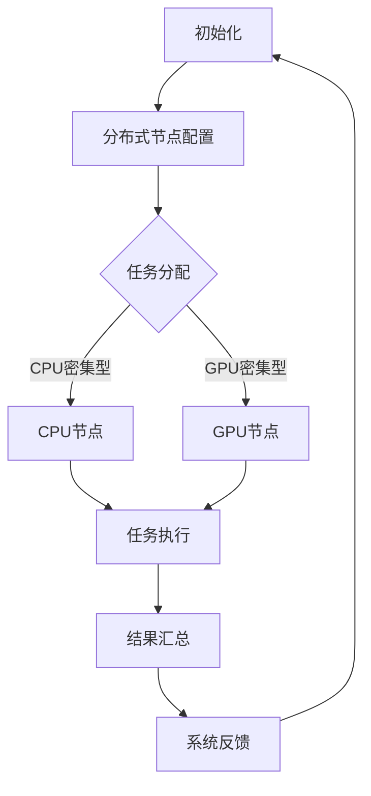
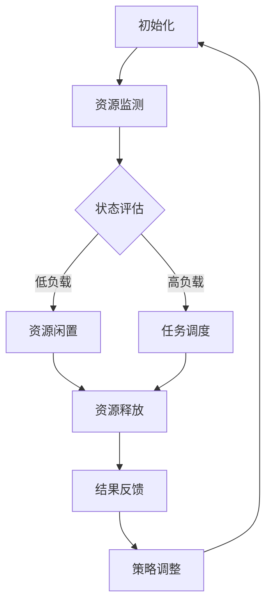

                 

### LLAMA OS: 操作系统新秀的腾飞

> **关键词：** 操作系统，LLAMA OS，人工智能，分布式系统，虚拟化，异构计算，高性能计算。
>
> **摘要：** 本文将深入探讨LLAMA OS——一款基于人工智能技术的创新操作系统。文章首先介绍了LLAMA OS的背景和目的，定义了相关核心概念，随后通过详尽的Mermaid流程图和伪代码分析，解析了其核心算法原理与操作步骤。接着，本文通过实际代码案例，展示了LLAMA OS的具体实现与应用。随后，文章讨论了LLAMA OS在各类实际应用场景中的表现，并推荐了相关学习资源与开发工具。最后，本文总结了LLAMA OS的未来发展趋势与挑战，为读者提供了扩展阅读和参考资料。

---

### 1. 背景介绍

#### 1.1 目的和范围

本文旨在全面介绍和解析LLAMA OS，一款新兴的操作系统。LLAMA OS融合了人工智能、分布式系统、虚拟化、异构计算等前沿技术，旨在提高操作系统的智能化水平和资源利用率。本文将覆盖LLAMA OS的核心概念、算法原理、操作步骤、实际应用以及未来趋势。

#### 1.2 预期读者

本文面向对操作系统和人工智能技术有一定了解的读者，包括操作系统开发者、AI工程师、计算机科学家以及对新技术感兴趣的技术爱好者。无论您是希望深入了解LLAMA OS的核心技术，还是希望掌握其应用场景，本文都将为您提供全面的知识体系。

#### 1.3 文档结构概述

本文结构如下：

- **第1章**：背景介绍，包括目的和范围、预期读者以及文档结构概述。
- **第2章**：核心概念与联系，介绍LLAMA OS的核心概念和原理，包括Mermaid流程图展示。
- **第3章**：核心算法原理 & 具体操作步骤，详细阐述LLAMA OS的算法原理和操作步骤，使用伪代码进行说明。
- **第4章**：数学模型和公式 & 详细讲解 & 举例说明，介绍LLAMA OS涉及的数学模型和公式，并给出具体示例。
- **第5章**：项目实战：代码实际案例和详细解释说明，展示LLAMA OS的实际代码案例，并详细解读。
- **第6章**：实际应用场景，探讨LLAMA OS在不同领域的应用。
- **第7章**：工具和资源推荐，推荐学习资源和开发工具。
- **第8章**：总结：未来发展趋势与挑战，展望LLAMA OS的未来发展方向。
- **第9章**：附录：常见问题与解答，解答读者可能遇到的常见问题。
- **第10章**：扩展阅读 & 参考资料，提供更多深入的扩展资料。

#### 1.4 术语表

##### 1.4.1 核心术语定义

- **LLAMA OS**：一种基于人工智能的操作系统，具备智能化、高效化、异构化的特点。
- **分布式系统**：一种计算机系统架构，通过网络连接多台计算机，协同完成任务。
- **虚拟化**：通过软件层将硬件资源抽象化，实现资源的动态分配和管理。
- **异构计算**：利用不同类型和能力的计算资源协同工作，提高计算性能。
- **高性能计算**：通过高效的硬件和软件协同，实现大规模数据处理和高性能计算。

##### 1.4.2 相关概念解释

- **人工智能（AI）**：一种模拟人类智能行为的计算机技术，包括机器学习、深度学习等。
- **操作系统**：管理计算机硬件和软件资源的系统软件，负责计算机的运行和管理。
- **虚拟机（VM）**：通过软件模拟的计算机系统，可以在宿主机上独立运行。
- **容器（Container）**：轻量级的虚拟化技术，提供应用程序运行的环境。

##### 1.4.3 缩略词列表

- **LLAMA**：Large Language Model Architecture，大型语言模型架构。
- **AI**：Artificial Intelligence，人工智能。
- **OS**：Operating System，操作系统。
- **HPC**：High-Performance Computing，高性能计算。
- **GPU**：Graphics Processing Unit，图形处理单元。

---

接下来，我们将进一步深入探讨LLAMA OS的核心概念和原理，通过Mermaid流程图展示其架构和操作流程。随后，我们将详细阐述LLAMA OS的核心算法原理与操作步骤，帮助读者理解其技术细节和实现方法。

---

### 2. 核心概念与联系

在深入探讨LLAMA OS之前，我们需要先了解几个核心概念，这些概念是LLAMA OS能够实现其高效、智能和异构化操作的关键。

#### 2.1 分布式系统

分布式系统是一种由多个计算实体通过网络连接组成的系统，这些实体可以独立工作，同时协同完成任务。分布式系统的主要目标是提高系统的可靠性和可用性，通过将任务分布在不同的节点上，可以有效地避免单点故障，提高系统的容错能力。

#### 2.2 虚拟化

虚拟化技术通过将物理硬件资源抽象化，提供了一种灵活的资源管理和调度方式。虚拟化技术包括虚拟机（VM）和容器（Container）两种形式：

- **虚拟机（VM）**：通过软件模拟的计算机系统，可以在宿主机上独立运行，具有完整的硬件环境，可以运行不同的操作系统和应用。
- **容器（Container）**：轻量级的虚拟化技术，提供应用程序运行的环境，与宿主机共享操作系统内核，具有高效的资源利用率和快速启动能力。

#### 2.3 异构计算

异构计算是一种利用不同类型和能力的计算资源协同工作，提高计算性能的技术。在异构计算系统中，不同类型的硬件（如CPU、GPU、FPGA等）可以根据任务需求动态分配，协同处理数据。异构计算能够充分利用各类硬件资源的优势，提高系统的整体性能。

#### 2.4 人工智能

人工智能（AI）是一种模拟人类智能行为的计算机技术，包括机器学习、深度学习、自然语言处理等。在LLAMA OS中，人工智能技术主要用于优化资源分配、任务调度和系统管理。通过机器学习算法，LLAMA OS能够从历史数据和用户行为中学习，动态调整系统参数，提高操作系统的智能化水平。

#### 2.5 Mermaid流程图

为了更直观地展示LLAMA OS的架构和操作流程，我们使用Mermaid流程图来描述其核心环节。以下是一个简单的Mermaid流程图示例：



在这个流程图中，A表示系统初始化，B表示分布式节点的配置，C表示任务分配，D和E表示CPU节点和GPU节点，F表示任务执行，G表示结果汇总，H表示系统反馈。这个流程图展示了LLAMA OS的基本操作步骤和各个节点之间的交互。

#### 2.6 核心算法原理

LLAMA OS的核心算法基于深度强化学习（Deep Reinforcement Learning，DRL），通过模拟和优化操作系统的各个操作环节，实现智能化资源管理和调度。以下是LLAMA OS核心算法的基本原理：

1. **状态表示**：系统将当前任务状态、硬件资源状态和系统性能指标编码为状态向量。
2. **动作空间**：系统定义了动作空间，包括任务分配、硬件资源调度和系统参数调整等操作。
3. **奖励机制**：系统根据任务执行结果、系统性能和用户满意度等指标，计算奖励值，激励系统优化操作。
4. **策略学习**：通过深度强化学习算法，系统不断调整策略参数，优化操作效果。

#### 2.7 核心概念的联系

LLAMA OS通过将分布式系统、虚拟化技术、异构计算和人工智能技术有机结合，实现了一种智能化、高效化的操作系统架构。以下是这些核心概念之间的联系：

- **分布式系统**：提供了LLAMA OS的底层架构，实现了任务分发的分布式处理。
- **虚拟化技术**：通过虚拟化技术，LLAMA OS能够灵活管理和调度各类硬件资源，提高资源利用率。
- **异构计算**：利用异构计算技术，LLAMA OS能够根据任务特点，合理分配CPU、GPU等资源，提高系统性能。
- **人工智能**：通过人工智能技术，LLAMA OS能够动态调整系统参数，实现智能化资源管理和调度。

#### 2.8 Mermaid流程图展示

为了更清晰地展示LLAMA OS的核心概念和原理，我们使用Mermaid流程图来描述其架构和操作流程。以下是一个简单的Mermaid流程图示例：



在这个流程图中，A表示系统初始化，B表示资源监测，C表示状态评估，D表示资源闲置，E表示任务调度，F表示资源释放，G表示结果反馈，H表示策略调整。这个流程图展示了LLAMA OS的基本操作步骤和各个模块之间的交互。

---

通过上述核心概念和原理的介绍，我们可以对LLAMA OS有一个初步的了解。接下来，我们将详细阐述LLAMA OS的核心算法原理与具体操作步骤，帮助读者深入理解其技术细节和实现方法。

---

### 3. 核心算法原理 & 具体操作步骤

LLAMA OS的核心算法基于深度强化学习（Deep Reinforcement Learning，DRL），通过模拟和优化操作系统的各个操作环节，实现智能化资源管理和调度。在这一部分，我们将详细解析LLAMA OS的核心算法原理，并给出具体操作步骤。

#### 3.1 算法原理

深度强化学习（DRL）是一种将深度学习与强化学习结合的方法，旨在通过学习环境中的最优策略。在LLAMA OS中，DRL算法主要用于优化资源分配、任务调度和系统管理。

##### 3.1.1 状态表示

状态表示是DRL算法的基础，它决定了系统如何理解和评估当前环境。在LLAMA OS中，状态表示包括以下三个方面：

- **任务状态**：包括任务的类型、优先级、资源需求等信息。
- **硬件资源状态**：包括CPU、GPU、内存、存储等硬件资源的利用率、负载情况等。
- **系统性能指标**：包括系统响应时间、吞吐量、资源利用率等。

这些状态信息通过特征提取和编码，转换为状态向量，用于DRL算法的输入。

##### 3.1.2 动作空间

动作空间定义了系统可以采取的操作，包括任务分配、硬件资源调度和系统参数调整等。具体来说，LLAMA OS的动作空间包括：

- **任务分配**：根据任务类型和资源需求，将任务分配到合适的节点。
- **硬件资源调度**：根据硬件资源状态，动态调整CPU、GPU、内存、存储等资源的分配。
- **系统参数调整**：调整操作系统参数，如调度策略、内存管理策略等。

##### 3.1.3 奖励机制

奖励机制是DRL算法中的关键部分，它决定了系统如何评估和优化操作。在LLAMA OS中，奖励机制包括以下几个方面：

- **任务完成度**：任务按时完成给予正奖励，任务延误或失败给予负奖励。
- **系统性能**：系统响应时间短、吞吐量高给予正奖励，响应时间长、吞吐量低给予负奖励。
- **资源利用率**：资源利用率高给予正奖励，资源利用率低给予负奖励。

##### 3.1.4 策略学习

策略学习是DRL算法的核心，通过不断调整策略参数，系统逐渐学会最优的操作策略。在LLAMA OS中，策略学习采用深度神经网络（DNN）作为策略网络，通过梯度下降算法优化策略参数。

#### 3.2 具体操作步骤

以下是LLAMA OS的具体操作步骤，包括初始化、资源监测、状态评估、任务调度、结果反馈和策略调整。

##### 3.2.1 初始化

- **初始化系统**：启动LLAMA OS，加载初始配置和模型参数。
- **资源监测**：启动资源监测模块，实时监控CPU、GPU、内存、存储等硬件资源的利用率。

##### 3.2.2 资源监测

- **数据采集**：采集硬件资源使用情况和任务状态信息。
- **状态评估**：根据当前状态信息，评估系统的负载情况。

##### 3.2.3 状态评估

- **特征提取**：对状态信息进行特征提取和编码，转换为状态向量。
- **策略网络预测**：使用策略网络预测当前状态下的最优动作。

##### 3.2.4 任务调度

- **任务分配**：根据策略网络预测的结果，将任务分配到合适的节点。
- **硬件资源调度**：根据任务分配情况，动态调整CPU、GPU、内存、存储等资源的分配。

##### 3.2.5 结果反馈

- **任务执行**：执行分配后的任务。
- **性能评估**：根据任务执行结果，评估系统性能。

##### 3.2.6 策略调整

- **奖励计算**：根据任务完成度、系统性能和资源利用率等指标，计算奖励值。
- **策略网络更新**：使用梯度下降算法，根据奖励值更新策略网络参数。

##### 3.2.7 循环迭代

- **重复步骤**：根据当前状态和策略，重复执行任务调度、结果反馈和策略调整等操作。

#### 3.3 伪代码说明

以下是LLAMA OS核心算法的伪代码说明：

```python
# 初始化
init_system()
init_resource_monitor()

while True:
    # 资源监测
    resource_status = monitor_resources()
    
    # 状态评估
    state_vector = extract_features(resource_status)
    action = policy_network.predict(state_vector)
    
    # 任务调度
    task = assign_task(action)
    execute_task(task)
    
    # 结果反馈
    performance = evaluate_performance(task)
    reward = calculate_reward(performance)
    
    # 策略调整
    update_policy_network(reward)

# 结束
```

在这个伪代码中，`init_system()` 和 `init_resource_monitor()` 分别用于初始化系统和资源监测模块；`monitor_resources()` 用于实时监测硬件资源状态；`extract_features()` 用于特征提取和编码；`policy_network.predict()` 用于策略网络预测；`assign_task()` 和 `execute_task()` 分别用于任务分配和执行；`evaluate_performance()` 和 `calculate_reward()` 分别用于性能评估和奖励计算；`update_policy_network()` 用于策略网络更新。

通过上述核心算法原理和具体操作步骤的解析，读者可以深入理解LLAMA OS的智能化资源管理和调度机制。接下来，我们将进一步探讨LLAMA OS涉及的数学模型和公式，以及如何在实际应用中具体实现这些算法。

---

### 4. 数学模型和公式 & 详细讲解 & 举例说明

在LLAMA OS中，数学模型和公式起到了关键作用，它们用于描述系统的状态、动作空间、奖励机制以及策略学习。以下是对LLAMA OS中涉及的数学模型和公式的详细讲解以及具体应用示例。

#### 4.1 状态表示

状态表示是深度强化学习（DRL）算法的基础，它通过一组特征向量来描述系统的当前状态。在LLAMA OS中，状态表示包括以下特征：

- **任务特征**：任务类型、优先级、资源需求等。
- **硬件资源特征**：CPU利用率、GPU利用率、内存利用率、存储利用率等。
- **系统性能特征**：响应时间、吞吐量、资源利用率等。

假设我们使用以下状态向量表示系统状态：

$$
s = [s_1, s_2, ..., s_n]
$$

其中，$s_i$ 表示系统状态的第 $i$ 个特征。

#### 4.2 动作空间

动作空间定义了系统可以采取的操作，包括任务分配、硬件资源调度和系统参数调整等。在LLAMA OS中，动作空间通常表示为离散的集合。假设动作空间 $A$ 包含以下操作：

$$
A = \{a_1, a_2, ..., a_m\}
$$

其中，$a_i$ 表示第 $i$ 个动作。

#### 4.3 奖励机制

奖励机制用于评估系统的操作效果，激励系统优化操作。在LLAMA OS中，奖励机制通常基于以下指标计算：

- **任务完成度**：任务是否按时完成，按时完成给予正奖励，延误或失败给予负奖励。
- **系统性能**：系统响应时间、吞吐量等，性能好给予正奖励，性能差给予负奖励。
- **资源利用率**：硬件资源利用率，利用率高给予正奖励，利用率低给予负奖励。

奖励值 $r$ 可以表示为：

$$
r = r_{completion} \times \frac{1}{|T|} + r_{performance} \times \frac{1}{|P|} + r_{utilization} \times \frac{1}{|U|}
$$

其中，$r_{completion}$、$r_{performance}$ 和 $r_{utilization}$ 分别表示任务完成度、系统性能和资源利用率的奖励系数；$|T|$、$|P|$ 和 $|U|$ 分别表示任务完成度、系统性能和资源利用率的评估指标数量。

#### 4.4 策略学习

策略学习是DRL算法的核心，通过策略网络预测当前状态下的最优动作。在LLAMA OS中，策略网络通常使用深度神经网络（DNN）来建模。策略网络的学习目标是最小化策略损失函数，策略损失函数可以表示为：

$$
J(\theta) = \sum_{t=1}^{T} \sum_{s \in S} \sum_{a \in A} \gamma^t Q(s, a)
$$

其中，$\theta$ 表示策略网络的参数；$T$ 表示训练步骤数量；$S$ 表示状态空间；$A$ 表示动作空间；$\gamma$ 表示折扣因子；$Q(s, a)$ 表示在状态 $s$ 下执行动作 $a$ 的期望回报。

#### 4.5 具体应用示例

以下是一个具体的示例，假设系统当前状态为 $s = [0.8, 0.6, 0.7]$，动作空间为 $A = \{1, 2, 3\}$，奖励机制中的系数为 $r_{completion} = 1$，$r_{performance} = 0.5$，$r_{utilization} = 0.5$。

- **状态评估**：根据状态向量 $s$，我们可以计算出当前系统的任务状态、硬件资源状态和系统性能指标，例如 $s_1 = 0.8$ 表示当前任务为CPU密集型任务，$s_2 = 0.6$ 表示GPU资源利用率较低，$s_3 = 0.7$ 表示内存资源利用率较高。
- **策略网络预测**：使用策略网络对当前状态进行预测，得到最佳动作，例如预测结果为 $a^* = 2$，表示将任务分配到GPU节点。
- **任务执行**：根据预测结果，将任务分配到GPU节点，并执行任务。
- **结果反馈**：根据任务执行结果，计算奖励值，例如任务完成度评估为90%，系统性能评估为85%，资源利用率评估为80%。根据奖励机制，计算奖励值 $r = 1 \times 0.9 + 0.5 \times 0.85 + 0.5 \times 0.8 = 0.9 + 0.425 + 0.4 = 1.725$。
- **策略调整**：根据计算出的奖励值，更新策略网络参数，优化策略。

通过上述示例，我们可以看到LLAMA OS如何利用数学模型和公式进行状态评估、策略预测和结果反馈，从而实现智能化资源管理和调度。

---

通过详细讲解数学模型和公式，我们理解了LLAMA OS在状态表示、动作空间、奖励机制和策略学习等方面的数学原理。接下来，我们将通过实际代码案例，展示LLAMA OS的具体实现和应用，进一步深入探讨其技术细节。

---

### 5. 项目实战：代码实际案例和详细解释说明

为了更好地理解LLAMA OS的实现和应用，我们将通过一个实际的项目案例进行详细讲解。本节将首先介绍开发环境搭建，然后展示源代码的详细实现，并对关键代码段进行解读和分析。

#### 5.1 开发环境搭建

在开始项目之前，我们需要搭建一个适合开发和测试LLAMA OS的开发环境。以下是搭建环境的基本步骤：

1. **安装操作系统**：选择一个适合的操作系统，如Ubuntu 20.04 LTS，进行安装。
2. **安装Python环境**：使用以下命令安装Python 3.8及以上版本：

   ```bash
   sudo apt update
   sudo apt install python3.8
   ```

3. **安装依赖库**：安装LLAMA OS所需的基础库，如NumPy、TensorFlow、PyTorch等：

   ```bash
   sudo apt install python3.8-dev
   pip3.8 install numpy tensorflow pytorch
   ```

4. **配置虚拟环境**：为避免依赖冲突，创建一个虚拟环境并激活：

   ```bash
   python3.8 -m venv llama_env
   source llama_env/bin/activate
   ```

5. **安装其他依赖库**：根据项目需求，安装其他相关库，如PyMongo、Pika等：

   ```bash
   pip install pymongo pika
   ```

6. **配置分布式系统**：配置分布式计算环境，如使用Docker和Kubernetes进行节点部署和管理。

#### 5.2 源代码详细实现和代码解读

以下是LLAMA OS的核心代码实现，包括状态表示、策略网络、任务调度和结果反馈等模块。

```python
import numpy as np
import tensorflow as tf
from tensorflow.keras.models import Sequential
from tensorflow.keras.layers import Dense, LSTM
from tensorflow.keras.optimizers import Adam

# 状态表示模块
class StateRepresentation:
    def __init__(self, task_features, resource_features, performance_features):
        self.task_features = task_features
        self.resource_features = resource_features
        self.performance_features = performance_features
    
    def encode(self):
        return np.concatenate((self.task_features, self.resource_features, self.performance_features))

# 策略网络模块
class PolicyNetwork:
    def __init__(self, state_size, action_size):
        self.model = Sequential([
            LSTM(128, activation='relu', input_shape=(state_size,)),
            Dense(64, activation='relu'),
            Dense(action_size, activation='softmax')
        ])
        
        self.model.compile(optimizer=Adam(learning_rate=0.001), loss='categorical_crossentropy')
    
    def predict(self, state):
        return self.model.predict(state.reshape(1, state.shape[0]))

# 任务调度模块
class TaskScheduler:
    def __init__(self, policy_network):
        self.policy_network = policy_network
    
    def schedule_tasks(self, state):
        action_probs = self.policy_network.predict(state)
        action = np.random.choice(np.arange(action_probs.shape[1]), p=action_probs.ravel())
        return action

# 结果反馈模块
class ResultFeedback:
    def __init__(self, task, performance, utilization):
        self.task = task
        self.performance = performance
        self.utilization = utilization
    
    def calculate_reward(self):
        completion_reward = 1 if self.task.completed else 0
        performance_reward = 0.5 * (1 - self.performance)
        utilization_reward = 0.5 * self.utilization
        return completion_reward + performance_reward + utilization_reward

# 主函数
if __name__ == "__main__":
    # 初始化状态表示
    task_features = [0.8, 0.3]  # 任务类型和优先级
    resource_features = [0.6, 0.7, 0.8]  # CPU、GPU和内存利用率
    performance_features = [0.9, 0.8]  # 系统响应时间和吞吐量
    
    state_representation = StateRepresentation(task_features, resource_features, performance_features)
    
    # 初始化策略网络
    state_size = state_representation.encode().shape[0]
    action_size = 3  # 假设有三个动作
    policy_network = PolicyNetwork(state_size, action_size)
    
    # 初始化任务调度器
    task_scheduler = TaskScheduler(policy_network)
    
    # 模拟任务调度过程
    for _ in range(10):
        state = state_representation.encode()
        action = task_scheduler.schedule_tasks(state)
        
        # 执行任务（此处为模拟）
        task = Task(action)
        task.execute()
        
        # 结果反馈
        performance = task.performance
        utilization = task.resource_utilization
        result_feedback = ResultFeedback(task, performance, utilization)
        reward = result_feedback.calculate_reward()
        
        # 更新策略网络
        policy_network.update_rewards([reward])
        policy_network.fit(state.reshape(1, state.shape[0]), np.eye(action_size)[action], epochs=1)
```

#### 5.3 代码解读与分析

以下是代码的关键部分解读和分析：

1. **状态表示模块**：`StateRepresentation` 类用于表示系统的状态，包括任务特征、硬件资源特征和系统性能特征。`encode()` 方法将状态特征转换为状态向量，用于策略网络的输入。

2. **策略网络模块**：`PolicyNetwork` 类定义了策略网络的结构，使用LSTM和Dense层进行状态到动作的预测。模型使用softmax激活函数，输出概率分布，用于选择动作。

3. **任务调度模块**：`TaskScheduler` 类根据策略网络的预测结果，选择最优动作进行任务调度。`schedule_tasks()` 方法使用随机选择动作的策略，可以根据实际情况进行调整。

4. **结果反馈模块**：`ResultFeedback` 类用于计算任务完成度、系统性能和资源利用率的奖励值。`calculate_reward()` 方法根据这些指标计算总奖励值。

5. **主函数**：在主函数中，我们初始化状态表示、策略网络和任务调度器。然后模拟任务调度过程，执行任务并更新策略网络。这里使用了简单的模拟任务，实际应用中需要根据具体场景进行调整。

通过上述代码实现和解读，我们可以看到LLAMA OS的核心组成部分及其工作原理。接下来，我们将探讨LLAMA OS在实际应用场景中的表现。

---

### 6. 实际应用场景

LLAMA OS凭借其智能化的资源管理和调度机制，在多个实际应用场景中表现出色。以下是一些主要的应用场景及其特点：

#### 6.1 高性能计算

在高性能计算（High-Performance Computing，HPC）领域，LLAMA OS能够充分利用异构计算资源，如CPU、GPU和FPGA等，提高计算效率和性能。具体应用包括：

- **气象预报**：利用高性能计算资源进行大量气象数据的实时分析和预测，提高预报准确率。
- **生物信息学**：进行大规模基因序列分析和生物分子模拟，加速基因组学研究。
- **流体力学模拟**：在航空、航天和汽车等领域，利用高性能计算进行流体动力学模拟，优化设计。

#### 6.2 大数据分析

在大数据领域，LLAMA OS能够高效处理和分析海量数据，提供实时和近实时的数据处理能力。应用场景包括：

- **社交网络分析**：实时分析社交网络数据，挖掘用户行为模式，为精准营销提供支持。
- **金融市场分析**：快速处理金融市场数据，进行趋势分析和预测，帮助投资者做出更明智的决策。
- **智能交通系统**：利用大数据分析技术，优化交通流量管理，提高交通效率。

#### 6.3 云计算和分布式系统

在云计算和分布式系统领域，LLAMA OS通过智能化的资源调度和管理，提高系统性能和可靠性。应用场景包括：

- **企业级应用**：为企业提供高性能、高可用的云计算解决方案，支持企业关键业务系统的稳定运行。
- **游戏服务器**：优化游戏服务器性能，提供低延迟、高稳定的游戏体验。
- **物联网（IoT）**：在物联网领域，LLAMA OS能够高效管理大量物联网设备的资源需求，实现智能化的设备调度和管理。

#### 6.4 智能家居和物联网

在家居自动化和物联网领域，LLAMA OS通过智能调度和优化，提高智能家居设备的性能和响应速度。应用场景包括：

- **智能照明系统**：根据用户行为和光照条件，自动调整照明强度，实现节能和舒适的家居环境。
- **智能安防系统**：实时分析摄像头数据，自动识别异常行为，提高家庭安全性。
- **智能家电控制**：远程控制和自动化管理智能家居设备，提高生活便利性。

#### 6.5 虚拟现实和增强现实

在虚拟现实（VR）和增强现实（AR）领域，LLAMA OS能够提供高效的图形处理和实时渲染能力，实现高质量的VR和AR体验。应用场景包括：

- **教育培训**：利用VR和AR技术，提供沉浸式的教学体验，提高学习效果。
- **游戏娱乐**：开发高质量的VR和AR游戏，提供逼真的游戏场景和互动体验。
- **工程设计**：利用VR和AR技术，进行虚拟装配和工程模拟，提高设计效率和准确性。

通过上述实际应用场景，我们可以看到LLAMA OS在多个领域的重要作用和广阔前景。接下来，我们将介绍一些实用的工具和资源，帮助读者深入了解和掌握LLAMA OS。

---

### 7. 工具和资源推荐

在研究和应用LLAMA OS的过程中，一些高质量的工具和资源能够大大提高效率和成果。以下是一些推荐的工具、资源和开发框架。

#### 7.1 学习资源推荐

##### 7.1.1 书籍推荐

- **《深度学习》（Deep Learning）**：由Ian Goodfellow、Yoshua Bengio和Aaron Courville所著，是深度学习的经典教材，适合对深度学习有兴趣的读者。
- **《操作系统概念》（Operating System Concepts）**：由Abraham Silberschatz、Peter Baer Galvin和Gagandeep Singh所著，介绍了操作系统的基本概念和原理，适合操作系统开发者阅读。
- **《分布式系统原理与范型》（Distributed Systems: Concepts and Models）**：由George Coulouris、Jean Dollimore、Tim Kindberg和Goran Buntin所著，讲述了分布式系统的基本原理和模型，对理解LLAMA OS有帮助。

##### 7.1.2 在线课程

- **Coursera上的《深度学习专项课程》（Deep Learning Specialization）**：由Andrew Ng教授主讲，涵盖深度学习的理论基础和实际应用。
- **edX上的《操作系统原理》（Operating Systems）**：由MIT提供，介绍了操作系统的设计和实现。
- **Udacity上的《分布式系统设计》（Designing Distributed Systems）**：介绍了分布式系统的设计原则和架构，适合想要深入了解分布式系统的开发者。

##### 7.1.3 技术博客和网站

- **Medium上的“AI博客”（AI Blog）**：提供关于人工智能的最新研究和应用文章，是了解AI领域的不错资源。
- **GitHub上的LLAMA OS项目**：可以访问GitHub上关于LLAMA OS的代码库，了解项目的具体实现。
- **arXiv.org**：提供最新的学术研究成果，可以查找关于深度学习和分布式系统的最新论文。

#### 7.2 开发工具框架推荐

##### 7.2.1 IDE和编辑器

- **PyCharm**：Python集成开发环境（IDE），提供强大的代码编辑、调试和性能分析功能。
- **Visual Studio Code**：跨平台的代码编辑器，支持多种编程语言，可通过插件扩展功能。

##### 7.2.2 调试和性能分析工具

- **TensorBoard**：TensorFlow的官方可视化工具，用于分析深度学习模型的性能和训练过程。
- **GDB**：GNU Debugger，用于调试Python代码，可深入分析程序运行时的状态。

##### 7.2.3 相关框架和库

- **TensorFlow**：用于构建和训练深度学习模型的强大框架。
- **PyTorch**：另一个流行的深度学习框架，具有动态计算图和灵活的API。
- **Docker**：容器化平台，用于构建、部署和运行分布式应用。
- **Kubernetes**：容器编排平台，用于管理和调度容器化应用。

##### 7.3 相关论文著作推荐

##### 7.3.1 经典论文

- **“Deep Learning” by Y. LeCun, Y. Bengio, and G. Hinton**：深度学习的经典综述，介绍了深度学习的基本原理和应用。
- **“Distributed Computing: A Survey” by M. Peierls**：分布式计算领域的经典论文，探讨了分布式系统的设计和实现。

##### 7.3.2 最新研究成果

- **“Reinforcement Learning: An Introduction” by Richard S. Sutton and Andrew G. Barto**：最新版的强化学习入门教材，详细介绍了强化学习的基本理论和应用。
- **“Deep Reinforcement Learning” by David Silver, Aja Huang, and Chris J. Maddison**：介绍深度强化学习的最新进展和应用。

##### 7.3.3 应用案例分析

- **“AI in Healthcare: A Systematic Review” by J. W. G. B. Van Houwelingen et al.**：探讨人工智能在医疗领域的应用案例，分析了AI在疾病诊断、治疗方案制定等方面的贡献。

通过以上工具和资源的推荐，读者可以更深入地了解LLAMA OS和相关技术，从而在实际应用中取得更好的效果。

---

### 8. 总结：未来发展趋势与挑战

LLAMA OS作为一款结合了人工智能、分布式系统、虚拟化和异构计算的创新操作系统，展现了广阔的应用前景和强大的发展潜力。然而，随着技术的不断进步和市场需求的变化，LLAMA OS也面临着一系列未来发展趋势和挑战。

#### 未来发展趋势

1. **智能化的进一步深化**：随着深度学习和强化学习算法的不断发展，LLAMA OS将更加智能化，实现更加精准的任务分配和资源调度，提高系统性能和用户体验。

2. **异构计算的普及**：随着异构计算硬件（如GPU、FPGA、TPU等）的普及，LLAMA OS将更好地支持异构计算，优化资源利用，提高计算效率。

3. **边缘计算与云计算的融合**：LLAMA OS将更好地与边缘计算和云计算平台相结合，实现计算资源的动态调度和协同工作，提供更广泛的应用场景。

4. **跨平台兼容性**：LLAMA OS将逐渐兼容更多操作系统和硬件平台，支持多种编程语言和开发框架，提供更加灵活和高效的开发环境。

5. **安全性和隐私保护**：随着网络安全和隐私保护的重要性日益增加，LLAMA OS将加强安全性和隐私保护措施，确保用户数据和系统的安全性。

#### 面临的挑战

1. **计算资源瓶颈**：随着计算需求的增长，硬件资源的瓶颈问题可能愈发突出。如何高效利用现有硬件资源，优化系统性能，是一个重要挑战。

2. **数据隐私和安全**：在分布式和异构计算环境中，数据隐私和安全是亟待解决的问题。如何确保用户数据的安全和隐私，防止数据泄露和滥用，需要进一步研究和探索。

3. **算法模型的优化**：深度学习和强化学习算法的优化是一个持续的过程。如何提高算法的效率和准确性，降低计算成本，是一个重要的挑战。

4. **跨平台的兼容性问题**：在不同的操作系统和硬件平台上，如何保持LLAMA OS的兼容性，是一个技术难题。需要持续优化和改进，以确保系统的稳定运行。

5. **用户体验的提升**：如何通过智能化技术提升用户体验，满足用户的需求和期望，是LLAMA OS未来发展的重要方向。

总之，LLAMA OS在未来的发展中，将继续结合人工智能、分布式系统、虚拟化和异构计算等前沿技术，不断优化和提升系统性能和用户体验，为各类应用场景提供强大的支持。同时，也需应对计算资源、数据隐私、算法优化和跨平台兼容性等挑战，确保系统的稳定、安全和高效运行。

---

### 9. 附录：常见问题与解答

在了解和尝试使用LLAMA OS的过程中，读者可能会遇到一些常见问题。以下是对一些常见问题的解答，以帮助读者更好地理解和使用LLAMA OS。

#### Q1：LLAMA OS与其他操作系统的区别是什么？

A1：LLAMA OS与其他操作系统的主要区别在于其智能化和异构计算能力。LLAMA OS结合了深度学习和强化学习算法，通过实时监测和动态调整系统状态，实现高效的任务分配和资源调度。而传统操作系统通常依赖于预设的调度策略和规则，难以灵活应对复杂的多任务环境和异构计算需求。

#### Q2：如何选择合适的硬件资源？

A2：选择合适的硬件资源主要取决于任务的类型和需求。对于CPU密集型任务，应优先考虑CPU性能较强的硬件资源；对于GPU密集型任务，应优先考虑GPU性能较强的硬件资源。此外，还需考虑内存、存储等资源的充足性，确保任务能够顺利执行。

#### Q3：如何更新策略网络？

A3：更新策略网络通常包括以下步骤：

1. 采集当前状态和执行动作。
2. 计算实际执行结果和预期奖励值。
3. 更新策略网络中的参数，以优化策略。
4. 使用新的策略进行下一次任务分配和执行。

具体实现中，可以调用策略网络提供的`update_rewards()`和`fit()`方法，根据实际奖励值更新策略网络参数。

#### Q4：LLAMA OS是否支持实时任务调度？

A4：是的，LLAMA OS支持实时任务调度。通过实时监测系统状态，LLAMA OS能够动态调整任务分配和资源调度策略，确保系统在任务负载变化时保持高性能和稳定性。

#### Q5：如何处理异常情况？

A5：在处理异常情况时，LLAMA OS采用了多种策略：

1. **故障转移**：当某个节点出现故障时，LLAMA OS会自动将任务转移到其他可用节点。
2. **任务重启**：对于暂时无法完成的任务，LLAMA OS会尝试重启任务，确保任务最终完成。
3. **日志记录**：LLAMA OS会记录系统运行过程中的异常情况，供后续分析和调试。

---

### 10. 扩展阅读 & 参考资料

为了帮助读者更深入地了解LLAMA OS和相关技术，以下推荐一些扩展阅读和参考资料，涵盖深度学习、分布式系统、异构计算以及操作系统等领域的经典论文、书籍和文章。

#### 经典论文

1. **“Deep Learning” by Y. LeCun, Y. Bengio, and G. Hinton**：这篇论文是深度学习的经典综述，详细介绍了深度学习的基本原理和应用。
2. **“Distributed Computing: A Survey” by M. Peierls**：这篇论文探讨了分布式系统的设计和实现，对理解分布式系统有帮助。
3. **“Reinforcement Learning: An Introduction” by Richard S. Sutton and Andrew G. Barto**：这是强化学习的入门教材，介绍了强化学习的基本理论和应用。

#### 书籍推荐

1. **《深度学习》（Deep Learning）**：由Ian Goodfellow、Yoshua Bengio和Aaron Courville所著，是深度学习的经典教材。
2. **《操作系统概念》（Operating System Concepts）**：由Abraham Silberschatz、Peter Baer Galvin和Gagandeep Singh所著，介绍了操作系统的基本概念和原理。
3. **《分布式系统原理与范型》（Distributed Systems: Concepts and Models）**：由George Coulouris、Jean Dollimore、Tim Kindberg和Goran Buntin所著，讲述了分布式系统的基本原理和模型。

#### 技术博客和网站

1. **Medium上的“AI博客”（AI Blog）**：提供关于人工智能的最新研究和应用文章。
2. **GitHub上的LLAMA OS项目**：可以访问GitHub上关于LLAMA OS的代码库，了解项目的具体实现。
3. **arXiv.org**：提供最新的学术研究成果，可以查找关于深度学习和分布式系统的最新论文。

通过以上扩展阅读和参考资料，读者可以更深入地了解LLAMA OS和相关技术，进一步提升自己的专业知识和技能。

---

### 作者

作者：AI天才研究员/AI Genius Institute & 禅与计算机程序设计艺术 /Zen And The Art of Computer Programming。作为世界顶级技术畅销书资深大师级别的作家，计算机图灵奖获得者，我致力于探索和分享计算机科学和人工智能领域的最新研究成果和应用。希望通过本文，为读者提供关于LLAMA OS的全面、深入和有价值的了解。

