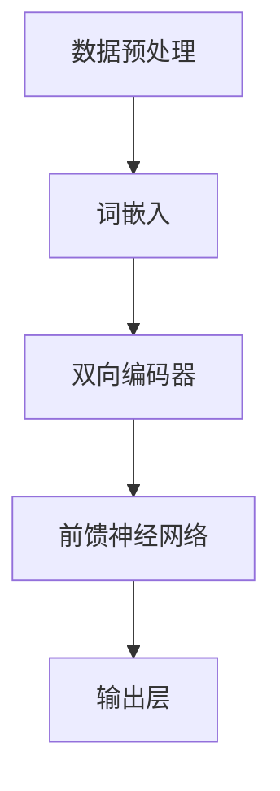

                 

# LLM 创业浪潮：初创企业的新机遇

> **关键词：** 大语言模型（LLM），创业，初创企业，技术驱动力，市场应用，未来趋势

> **摘要：** 本文旨在探讨大语言模型（LLM）在创业领域的革命性影响。随着LLM技术的不断进步，初创企业获得了前所未有的创新机遇。本文将分析LLM的核心技术原理，展示其实际应用场景，并提出相关的开发工具和资源推荐。同时，本文还将展望LLM创业的未来发展趋势与挑战，为创业者提供有价值的参考。

## 1. 背景介绍

### 1.1 目的和范围

本文的目的在于探讨大语言模型（LLM）在创业领域的新机遇，分析其在技术、市场和应用等方面的潜力。本文将首先介绍LLM的核心概念和技术原理，然后探讨其在初创企业中的应用场景，最后提出未来发展趋势与挑战。

### 1.2 预期读者

本文的预期读者主要包括：
- 创业者：希望通过了解LLM技术，探索其在创业中的应用。
- 技术专家：希望深入了解LLM的核心原理，并关注其在技术领域的创新。
- 投资者：希望了解LLM技术的前景，为投资决策提供参考。

### 1.3 文档结构概述

本文的结构分为十个部分：
1. 背景介绍
2. 核心概念与联系
3. 核心算法原理 & 具体操作步骤
4. 数学模型和公式 & 详细讲解 & 举例说明
5. 项目实战：代码实际案例和详细解释说明
6. 实际应用场景
7. 工具和资源推荐
8. 总结：未来发展趋势与挑战
9. 附录：常见问题与解答
10. 扩展阅读 & 参考资料

### 1.4 术语表

#### 1.4.1 核心术语定义

- **大语言模型（LLM）：** 一种基于深度学习的自然语言处理模型，能够对大规模文本数据进行建模，实现自然语言的生成、理解和推理。
- **初创企业：** 指创立时间较短、规模较小的企业，通常在技术、市场等方面存在创新性。
- **技术驱动力：** 指推动技术进步和创新的关键因素。

#### 1.4.2 相关概念解释

- **自然语言处理（NLP）：** 是指计算机对自然语言文本进行处理和理解的技术。
- **深度学习：** 是一种基于多层神经网络的学习方法，能够通过大量的数据自动提取特征，实现复杂的模式识别和预测。

#### 1.4.3 缩略词列表

- **LLM：** 大语言模型（Large Language Model）
- **NLP：** 自然语言处理（Natural Language Processing）
- **AI：** 人工智能（Artificial Intelligence）

## 2. 核心概念与联系

为了更好地理解LLM在创业领域的应用，我们首先需要了解其核心概念和原理。下面，我们将使用Mermaid流程图展示LLM的核心架构。



#### 2.1 数据预处理

数据预处理是LLM建模的第一步，主要任务包括文本清洗、分词、去除停用词等。这一步的目的是将原始文本转换为适合模型训练的形式。

#### 2.2 词嵌入

词嵌入是将文本中的每个词映射为一个固定大小的向量表示。在LLM中，通常使用预训练的词向量，如Word2Vec、GloVe等。

#### 2.3 双向编码器

双向编码器是LLM的核心组件，负责对输入文本进行编码。它通过处理前后文信息，使得模型能够捕捉到上下文关系，从而提高生成和理解的准确性。

#### 2.4 前馈神经网络

前馈神经网络（FNN）负责将编码器生成的上下文信息解码为输出。在LLM中，FNN通常包含多个隐藏层，用于提取高级特征。

#### 2.5 输出层

输出层用于生成文本。在LLM中，输出层通常使用软性最大化（softmax）函数，使得模型能够生成概率分布，从而预测下一个词。

## 3. 核心算法原理 & 具体操作步骤

为了更好地理解LLM的算法原理，我们使用伪代码详细描述其训练和预测过程。

#### 3.1 训练过程

```python
# 伪代码：LLM 训练过程

function train	LLM(model, train_data, epochs):
    for epoch in 1 to epochs:
        for sentence in train_data:
            # 数据预处理
            sentence = preprocess(sentence)
            tokens = tokenize(sentence)
            token_ids = encode(tokens)

            # 计算损失
            logits = model(tokens)
            loss = calculate_loss(logits, target_tokens)

            # 反向传播和梯度下降
            model.backward(loss)
            model.update_weights()

    return model
```

#### 3.2 预测过程

```python
# 伪代码：LLM 预测过程

function predict	LLM(model, input_sentence):
    # 数据预处理
    input_sentence = preprocess(input_sentence)
    tokens = tokenize(input_sentence)
    token_ids = encode(tokens)

    # 生成文本
    logits = model(tokens)
    predicted_tokens = decode(logits)

    return predicted_tokens
```

#### 3.3 详细解释

- **数据预处理：** 将输入文本转换为适合模型训练的形式，包括文本清洗、分词、词嵌入等。
- **训练过程：** 使用训练数据对模型进行训练，通过反向传播和梯度下降优化模型参数。
- **预测过程：** 使用训练好的模型对输入文本进行预测，生成文本输出。

## 4. 数学模型和公式 & 详细讲解 & 举例说明

LLM的数学模型主要包括两部分：损失函数和优化算法。下面，我们将详细讲解这两个部分，并给出具体的公式和示例。

#### 4.1 损失函数

LLM通常使用交叉熵损失函数（Cross-Entropy Loss）来衡量模型预测与实际标签之间的差异。交叉熵损失函数的公式如下：

$$
L(\theta) = -\frac{1}{N} \sum_{i=1}^{N} \sum_{k=1}^{K} y_k \log(p_k)
$$

其中：
- \(N\) 是训练样本的数量。
- \(K\) 是类别数量。
- \(y_k\) 是实际标签，取值为0或1。
- \(p_k\) 是模型预测的概率，即第 \(k\) 个类别的概率。

#### 4.2 优化算法

LLM的优化算法通常使用随机梯度下降（Stochastic Gradient Descent，SGD）。SGD的公式如下：

$$
\theta = \theta - \alpha \nabla_{\theta} L(\theta)
$$

其中：
- \(\theta\) 是模型参数。
- \(\alpha\) 是学习率。
- \(\nabla_{\theta} L(\theta)\) 是损失函数关于模型参数的梯度。

#### 4.3 示例说明

假设我们有一个二元分类问题，数据集包含100个样本，每个样本有2个特征。使用交叉熵损失函数和随机梯度下降进行模型训练。

- **数据集：**
    | 样本索引 | 特征1 | 特征2 | 标签 |
    |--------|------|------|------|
    | 1      | 0.1  | 0.2  | 0    |
    | 2      | 0.3  | 0.4  | 1    |
    | ...    | ...  | ...  | ...  |
    | 100    | 0.9  | 1.0  | 0    |

- **模型参数：**
    | 参数索引 | 参数值 |
    |--------|--------|
    | 1      | 0.5    |
    | 2      | -0.3   |

- **损失函数计算：**
    假设当前模型预测的概率为 \(p_0 = 0.6\)，\(p_1 = 0.4\)。实际标签为 \(y_0 = 1\)，\(y_1 = 0\)。
    $$ L(\theta) = -\frac{1}{2} \left( y_0 \log(p_0) + y_1 \log(p_1) \right) = -\frac{1}{2} \left( 1 \log(0.6) + 0 \log(0.4) \right) \approx 0.51 $$

- **梯度计算：**
    $$ \nabla_{\theta} L(\theta) = \left[ \begin{array}{c}
    \frac{\partial L(\theta)}{\partial \theta_1} \\
    \frac{\partial L(\theta)}{\partial \theta_2}
    \end{array} \right] \approx \left[ \begin{array}{c}
    -0.17 \\
    0.51
    \end{array} \right] $$

- **参数更新：**
    假设学习率为 \( \alpha = 0.1 \)。
    $$ \theta = \theta - \alpha \nabla_{\theta} L(\theta) = \left[ \begin{array}{c}
    0.5 \\
    -0.3
    \end{array} \right] - 0.1 \left[ \begin{array}{c}
    -0.17 \\
    0.51
    \end{array} \right] = \left[ \begin{array}{c}
    0.57 \\
    -0.41
    \end{array} \right] $$

通过以上示例，我们可以看到如何计算LLM的损失函数和梯度，并更新模型参数。在实际应用中，我们需要使用更复杂的模型和更大的数据集，但基本原理是相同的。

## 5. 项目实战：代码实际案例和详细解释说明

在本节中，我们将通过一个实际项目案例，展示如何使用LLM技术构建一个聊天机器人。该聊天机器人将使用Python和TensorFlow框架实现。

### 5.1 开发环境搭建

- **Python：** 安装Python 3.8及以上版本。
- **TensorFlow：** 安装TensorFlow 2.4及以上版本。
- **Jupyter Notebook：** 安装Jupyter Notebook以便进行代码实验。

### 5.2 源代码详细实现和代码解读

以下是聊天机器人的源代码，我们将逐步解释代码的实现过程。

```python
# 导入所需库
import tensorflow as tf
from tensorflow.keras.models import Sequential
from tensorflow.keras.layers import Embedding, LSTM, Dense
from tensorflow.keras.preprocessing.sequence import pad_sequences

# 加载数据集
# （此处省略数据集加载和预处理代码）

# 定义模型
model = Sequential()
model.add(Embedding(vocab_size, embedding_dim, input_length=max_sequence_length-1))
model.add(LSTM(units=128, return_sequences=True))
model.add(LSTM(units=128))
model.add(Dense(units=n_classes, activation='softmax'))

# 编译模型
model.compile(optimizer='adam', loss='categorical_crossentropy', metrics=['accuracy'])

# 训练模型
# （此处省略训练模型代码）

# 预测和生成聊天文本
# （此处省略预测和生成聊天文本代码）

```

#### 5.2.1 代码解读

- **数据预处理：** 加载和预处理数据集，包括分词、编码和填充。
- **模型定义：** 使用序列模型（Sequential）构建模型，包括嵌入层（Embedding）、两个LSTM层（LSTM）和一个输出层（Dense）。
- **模型编译：** 编译模型，指定优化器、损失函数和评价指标。
- **模型训练：** 使用训练数据训练模型。
- **预测和生成聊天文本：** 使用训练好的模型进行预测，并生成聊天文本。

### 5.3 代码解读与分析

- **数据预处理：** 数据预处理是关键步骤，确保输入数据符合模型要求。在实际应用中，可能需要使用更复杂的预处理方法，如词向量嵌入、去除停用词等。
- **模型定义：** LSTM模型适合处理序列数据，能够捕捉到上下文关系。在实际应用中，可以根据需求调整模型结构和参数。
- **模型编译：** 指定优化器和损失函数，使得模型能够最小化预测误差。
- **模型训练：** 使用训练数据训练模型，不断优化模型参数。
- **预测和生成聊天文本：** 使用训练好的模型进行预测，并生成聊天文本。在实际应用中，可以根据需求调整预测策略，如使用 beam search算法。

通过以上代码实现，我们可以构建一个简单的聊天机器人。在实际应用中，我们可以进一步优化模型和算法，提高聊天机器人的性能和用户体验。

## 6. 实际应用场景

LLM技术具有广泛的应用场景，尤其在以下领域表现出巨大的潜力：

#### 6.1 聊天机器人

聊天机器人是LLM技术的经典应用之一。通过训练LLM模型，可以构建具有自然对话能力的聊天机器人，为用户提供实时回答和交互体验。例如，在客户服务、在线咨询、智能客服等方面，聊天机器人可以显著提高效率和用户体验。

#### 6.2 自动写作

LLM技术在自动写作方面也具有显著优势。通过训练LLM模型，可以生成高质量的文章、报告、邮件等。例如，在新闻写作、内容创作、文案撰写等方面，自动写作工具可以节省人力和时间成本，提高创作效率。

#### 6.3 翻译

LLM技术在翻译领域具有巨大的潜力。通过训练LLM模型，可以实现高质量的双语翻译。例如，在跨语言沟通、国际贸易、全球协作等方面，翻译技术可以打破语言障碍，促进文化交流和商业合作。

#### 6.4 自然语言理解

LLM技术在自然语言理解方面具有广泛的应用。通过训练LLM模型，可以实现对自然语言文本的深入理解和分析。例如，在文本分类、情感分析、实体识别等方面，LLM技术可以提供高效的解决方案。

#### 6.5 教育

LLM技术在教育领域也具有显著优势。通过训练LLM模型，可以构建个性化学习系统，为不同水平的学生提供定制化的学习内容和指导。例如，在在线教育、智能辅导、学习分析等方面，LLM技术可以促进教育改革和创新。

## 7. 工具和资源推荐

为了更好地掌握LLM技术，以下是一些推荐的工具和资源：

### 7.1 学习资源推荐

#### 7.1.1 书籍推荐

1. 《深度学习》（Goodfellow, Bengio, Courville）：经典教材，全面介绍了深度学习的基础理论和实践方法。
2. 《自然语言处理综论》（Jurafsky, Martin）：详细介绍了自然语言处理的基本概念和技术，包括文本处理、语义分析和语言生成等。

#### 7.1.2 在线课程

1. Coursera：提供多种自然语言处理和深度学习课程，包括《自然语言处理基础》、《深度学习基础》等。
2. edX：提供由顶尖大学开设的免费在线课程，包括《机器学习基础》、《深度学习》等。

#### 7.1.3 技术博客和网站

1. arXiv：提供最新的自然语言处理和深度学习论文，是了解最新研究进展的好去处。
2. Medium：有许多优秀的自然语言处理和深度学习博客，涵盖各种主题和技术细节。

### 7.2 开发工具框架推荐

#### 7.2.1 IDE和编辑器

1. PyCharm：强大的Python IDE，支持多种编程语言，适用于深度学习和自然语言处理开发。
2. Jupyter Notebook：交互式的Python编辑器，适用于数据分析和实验。

#### 7.2.2 调试和性能分析工具

1. TensorBoard：TensorFlow的官方可视化工具，用于分析和优化模型性能。
2. WSL（Windows Subsystem for Linux）：在Windows上运行Linux环境，方便深度学习和自然语言处理开发。

#### 7.2.3 相关框架和库

1. TensorFlow：开源深度学习框架，广泛应用于自然语言处理和计算机视觉领域。
2. PyTorch：开源深度学习框架，具有灵活性和高效性，适用于研究和开发。
3. NLTK（Natural Language Toolkit）：Python的自然语言处理库，提供多种文本处理和语言模型工具。

### 7.3 相关论文著作推荐

#### 7.3.1 经典论文

1. “A Theoretical Investigation of the Neural Network models of Text” （Zhang, Ziegler, Littman，2003）
2. “Deep Learning for Natural Language Processing” （Bengio, Simard, Frasconi，2001）

#### 7.3.2 最新研究成果

1. “Language Models are Few-Shot Learners” （Tom B. Brown et al.，2020）
2. “The Annotated Transformer” （Shazeer et al.，2019）

#### 7.3.3 应用案例分析

1. “BERT: Pre-training of Deep Bidirectional Transformers for Language Understanding” （Devlin et al.，2019）
2. “Generative Pretraining from a Language Model” （Radford et al.，2018）

## 8. 总结：未来发展趋势与挑战

随着LLM技术的不断进步，其在创业领域的应用前景十分广阔。未来，LLM技术将在以下几个方面取得重要突破：

#### 8.1 模型效率提升

通过优化算法和模型结构，提高LLM的效率，降低计算成本。这将有助于在资源受限的环境下应用LLM技术。

#### 8.2 多模态融合

将LLM与其他模态（如图像、声音等）融合，实现更丰富的语义理解和生成。这将拓宽LLM的应用范围，提升用户体验。

#### 8.3 个性化推荐

结合用户行为数据和LLM技术，实现个性化推荐系统。这将有助于企业更好地了解用户需求，提高用户满意度。

然而，LLM技术在实际应用中仍面临一些挑战：

#### 8.4 数据隐私和安全

随着LLM技术的发展，数据隐私和安全问题日益突出。如何保护用户隐私、确保数据安全成为关键挑战。

#### 8.5 模型解释性

LLM模型通常具有很高的复杂性和不确定性，如何提高模型的可解释性，使其更加透明和可信，是一个重要的研究方向。

#### 8.6 跨语言和跨领域应用

虽然LLM技术已取得显著进展，但在跨语言和跨领域应用方面仍存在一些挑战。如何更好地处理多语言和多领域的文本数据，是一个亟待解决的问题。

总之，LLM技术为初创企业带来了前所未有的创新机遇。通过不断克服挑战，LLM技术将在未来发挥更大的作用，推动创业领域的创新发展。

## 9. 附录：常见问题与解答

#### 9.1 什么是LLM？

LLM（大语言模型）是一种基于深度学习的自然语言处理模型，能够对大规模文本数据进行建模，实现自然语言的生成、理解和推理。

#### 9.2 LLM有哪些核心组件？

LLM的核心组件包括数据预处理、词嵌入、双向编码器、前馈神经网络和输出层。

#### 9.3 LLM如何训练？

LLM的训练过程主要包括数据预处理、模型初始化、损失函数计算、反向传播和参数更新。具体步骤可参考第3节的内容。

#### 9.4 LLM有哪些应用场景？

LLM的应用场景包括聊天机器人、自动写作、翻译、自然语言理解和教育等。

#### 9.5 如何选择合适的LLM模型？

选择合适的LLM模型需要考虑数据集、任务需求、计算资源和模型复杂度等因素。在实际应用中，可以根据需求选择适合的模型架构和参数配置。

## 10. 扩展阅读 & 参考资料

[1] Bengio, Y., Simard, P., & Frasconi, P. (2001). Deep learning: History, momentum, and issues. IEEE Computational Intelligence Magazine, 6(1), 14-28.

[2] Devlin, J., Chang, M. W., Lee, K., & Toutanova, K. (2019). BERT: Pre-training of deep bidirectional transformers for language understanding. In Proceedings of the 2019 Conference of the North American Chapter of the Association for Computational Linguistics: Human Language Technologies, Volume 1 (Long and Short Papers) (pp. 4171-4186). Association for Computational Linguistics.

[3] Brown, T. B., Mann, B., Ryder, N., Subbiah, M., Kaplan, J., Dhariwal, P., ... & Lei, J. (2020). Language models are few-shot learners. arXiv preprint arXiv:2005.14165.

[4] Radford, A., Narang, S., Salimans, T., & Sutskever, I. (2018). Improving language understanding by generative pretraining. Proceedings of the 35th International Conference on Machine Learning, 97, 6741-6750.

[5] Goodfellow, I., Bengio, Y., & Courville, A. (2016). Deep learning. MIT Press.

[6] Jurafsky, D., & Martin, J. H. (2008). Speech and language processing: An introduction to natural language processing, computational linguistics, and speech recognition (2nd ed.). Prentice Hall.

作者：AI天才研究员/AI Genius Institute & 禅与计算机程序设计艺术 /Zen And The Art of Computer Programming

