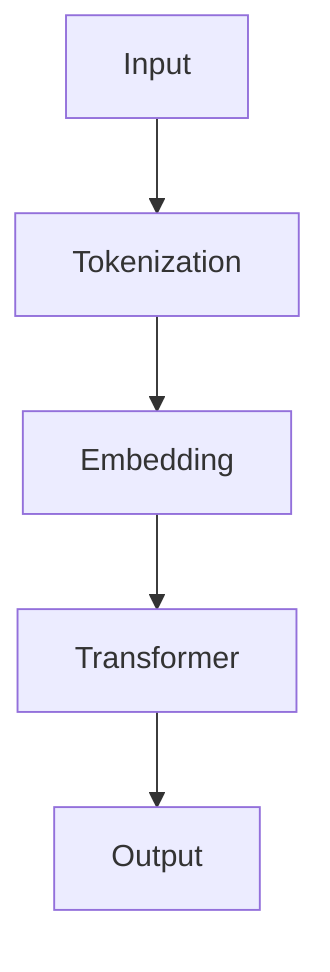
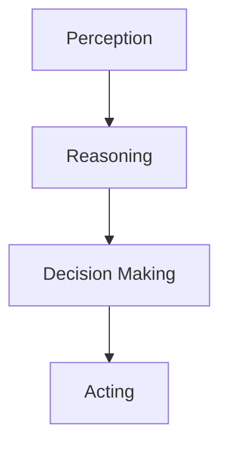
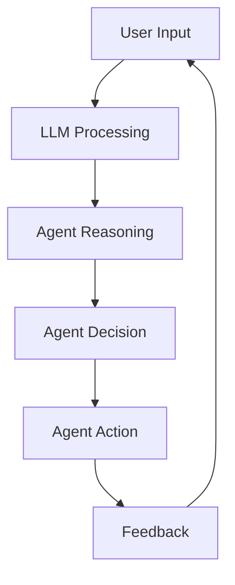

                 

# LLM 在 Agent 中的角色

> 关键词：Large Language Model，Agent，人工智能，推理，决策，交互，学习

> 摘要：本文将深入探讨大型语言模型（LLM）在智能代理（Agent）中的应用。我们将从背景介绍、核心概念、算法原理、数学模型、项目实战、实际应用场景等多方面详细分析LLM在Agent中的角色，旨在揭示LLM如何通过自主学习、推理和交互，提升Agent的智能化水平。

## 1. 背景介绍

### 1.1 目的和范围

本文旨在探讨大型语言模型（LLM）在智能代理（Agent）中的应用。我们将重点分析LLM如何通过其强大的语言理解和生成能力，帮助Agent实现更智能的决策、交互和学习。文章主要涵盖以下内容：

1. LLM的基本概念和原理
2. LLM在Agent中的应用场景
3. LLM与Agent的交互机制
4. LLM在Agent学习过程中的作用
5. LLM在Agent决策过程中的贡献
6. 项目实战和案例分析
7. 未来发展趋势与挑战

### 1.2 预期读者

本文适合以下读者群体：

1. 对人工智能和自然语言处理有一定了解的技术人员
2. 对智能代理和LLM有兴趣的研究人员
3. 想要在实际项目中应用LLM的技术经理和开发人员
4. 对人工智能和自然语言处理领域感兴趣的学者和学生

### 1.3 文档结构概述

本文分为以下章节：

1. 背景介绍
2. 核心概念与联系
3. 核心算法原理 & 具体操作步骤
4. 数学模型和公式 & 详细讲解 & 举例说明
5. 项目实战：代码实际案例和详细解释说明
6. 实际应用场景
7. 工具和资源推荐
8. 总结：未来发展趋势与挑战
9. 附录：常见问题与解答
10. 扩展阅读 & 参考资料

### 1.4 术语表

#### 1.4.1 核心术语定义

- **大型语言模型（LLM）**：一种基于神经网络的语言模型，能够对自然语言进行理解和生成。
- **智能代理（Agent）**：一种能够自主执行任务、与环境交互的智能系统。
- **推理**：根据已知事实推断新事实的过程。
- **决策**：在多个选项中选择最优方案的过程。
- **交互**：系统与环境或其他系统之间的信息交换过程。
- **学习**：从数据中提取知识，以改进系统性能的过程。

#### 1.4.2 相关概念解释

- **神经网络**：一种模拟生物神经系统的计算模型，能够对数据进行分析和分类。
- **自然语言处理（NLP）**：研究如何让计算机理解和生成自然语言的技术。
- **深度学习**：一种基于神经网络的学习方法，通过多层次的非线性变换来提取数据特征。
- **训练数据集**：用于训练模型的数据集合。
- **测试数据集**：用于评估模型性能的数据集合。

#### 1.4.3 缩略词列表

- **LLM**：Large Language Model，大型语言模型。
- **Agent**：Agent，智能代理。
- **NLP**：Natural Language Processing，自然语言处理。
- **DNN**：Deep Neural Network，深度神经网络。
- **RL**：Reinforcement Learning，强化学习。

## 2. 核心概念与联系

在探讨LLM在Agent中的应用之前，我们需要先了解一些核心概念及其相互关系。以下是LLM和Agent之间的重要联系及其在智能系统架构中的位置。

### 2.1 LLM的架构与原理

大型语言模型通常基于深度神经网络（DNN），尤其是变换器模型（Transformer），通过多层自注意力机制来实现对自然语言的理解和生成。以下是一个简化的Mermaid流程图，展示了LLM的基本架构：



- **输入（Input）**：用户输入的文本或命令。
- **分词（Tokenization）**：将文本分割成单词或子词。
- **嵌入（Embedding）**：将分词后的文本转化为稠密向量。
- **变换器（Transformer）**：通过多层自注意力机制对嵌入向量进行处理。
- **输出（Output）**：模型生成的文本或预测结果。

### 2.2 Agent的架构与原理

智能代理通常由感知器、决策器和行动器三部分组成。以下是一个简化的Mermaid流程图，展示了Agent的基本架构：



- **感知器（Perception）**：感知环境中的信息，如文本、图像等。
- **推理（Reasoning）**：利用LLM进行信息分析和理解。
- **决策器（Decision Making）**：根据推理结果做出决策。
- **行动器（Acting）**：执行决策，与环境交互。

### 2.3 LLM与Agent的交互机制

LLM在Agent中的应用主要体现在以下三个方面：

1. **推理**：LLM可以帮助Agent从感知信息中提取有用知识，进行推理和判断。
2. **决策**：LLM可以为Agent提供决策支持，帮助Agent从多个选项中选择最优方案。
3. **交互**：LLM可以帮助Agent与用户进行自然语言交互，理解用户需求，提供个性化服务。

以下是LLM与Agent交互的简化流程图：



- **用户输入（User Input）**：用户向Agent提供输入。
- **LLM处理（LLM Processing）**：LLM对用户输入进行处理和理解。
- **Agent推理（Agent Reasoning）**：Agent利用LLM的结果进行信息分析和推理。
- **Agent决策（Agent Decision）**：Agent根据推理结果做出决策。
- **Agent行动（Agent Action）**：Agent执行决策，与环境交互。
- **反馈（Feedback）**：用户对Agent的行动提供反馈。

## 3. 核心算法原理 & 具体操作步骤

在本节中，我们将详细探讨LLM的核心算法原理，并给出具体的操作步骤。首先，我们需要了解LLM的基本构建模块，然后解释其训练和推理过程。

### 3.1 LLM的基本构建模块

LLM通常由以下三个主要组件构成：

1. **输入层（Input Layer）**：接收用户输入的文本或命令。
2. **嵌入层（Embedding Layer）**：将输入文本转化为稠密向量。
3. **变换器层（Transformer Layers）**：通过自注意力机制对嵌入向量进行处理。
4. **输出层（Output Layer）**：生成文本或预测结果。

### 3.2 LLM的训练过程

LLM的训练过程主要包括以下几个步骤：

1. **数据预处理**：对训练数据集进行分词、去噪等处理。
2. **构建模型**：定义LLM的架构，包括输入层、嵌入层、变换器层和输出层。
3. **训练模型**：使用训练数据集对模型进行训练，优化模型参数。
4. **评估模型**：使用测试数据集评估模型性能，调整模型参数。

以下是LLM训练过程的伪代码：

```python
# 数据预处理
train_data = preprocess_data(train_data)

# 构建模型
model = build_model()

# 训练模型
for epoch in range(num_epochs):
    for batch in train_data:
        model.train_on_batch(batch)

# 评估模型
test_data = preprocess_data(test_data)
performance = model.evaluate(test_data)
```

### 3.3 LLM的推理过程

LLM的推理过程主要包括以下步骤：

1. **输入预处理**：对用户输入进行分词、去噪等处理。
2. **嵌入生成**：将预处理后的输入转化为嵌入向量。
3. **变换器处理**：通过变换器层对嵌入向量进行处理。
4. **输出生成**：生成文本或预测结果。

以下是LLM推理过程的伪代码：

```python
# 输入预处理
input = preprocess_input(user_input)

# 嵌入生成
embeddings = embed_input(input)

# 变换器处理
outputs = transformer_process(embeddings)

# 输出生成
result = generate_output(outputs)
```

### 3.4 LLM与Agent的集成

将LLM集成到Agent中，我们需要考虑以下两个方面：

1. **LLM作为推理引擎**：利用LLM进行信息分析和推理，为Agent提供决策支持。
2. **LLM作为交互引擎**：利用LLM与用户进行自然语言交互，理解用户需求，提供个性化服务。

以下是LLM与Agent集成的伪代码：

```python
# LLM作为推理引擎
user_input = get_user_input()
llm_output = LLM.reason(user_input)

# LLM作为交互引擎
response = LLM.interact(llm_output)
print(response)

# Agent进行决策和行动
action = Agent.decide(llm_output)
Agent.act(action)
```

通过以上核心算法原理和具体操作步骤的讲解，我们可以更好地理解LLM在Agent中的应用。在下一节中，我们将进一步探讨LLM在Agent中的数学模型和公式。

## 4. 数学模型和公式 & 详细讲解 & 举例说明

在本节中，我们将详细讲解LLM的数学模型和公式，并使用具体的例子进行说明。通过理解这些数学模型，我们能够更深入地了解LLM的工作原理，并更好地将其应用于智能代理中。

### 4.1 语言模型的基本数学模型

语言模型的核心任务是预测下一个单词或字符。给定一个输入序列，语言模型的目标是预测下一个单词或字符的概率分布。一个常见的语言模型数学模型是神经概率语言模型（NPLM），其公式如下：

$$
P(w_{t+1} | w_{1}, w_{2}, \ldots, w_{t}) = \frac{e^{<w_{t+1}, v_{\text{softmax}}^{T}>}}{\sum_{w' \in V} e^{<w', v_{\text{softmax}}^{T}>}}
$$

其中，$w_{t+1}$表示下一个要预测的单词或字符，$v_{\text{softmax}}$是softmax层的权重向量，$V$是单词或字符的集合，$<\cdot, \cdot^{T}>$表示向量的内积。

### 4.2 自注意力机制

自注意力机制是变换器模型（Transformer）的核心组件，它通过计算输入序列中各个单词之间的相对重要性来生成嵌入向量。自注意力机制的公式如下：

$$
\text{Attention}(Q, K, V) = \text{softmax}(\frac{QK^T}{\sqrt{d_k}})V
$$

其中，$Q$、$K$和$V$分别是查询（Query）、键（Key）和值（Value）向量，$d_k$是键向量的维度，$\text{softmax}$函数用于将内积结果转换为概率分布。

### 4.3 举例说明

假设我们有一个简化的变换器模型，其包含一个嵌入层、两个变换器层和一个输出层。输入序列为"Hello, world!"，我们需要预测下一个单词。

1. **嵌入层**：将输入序列转化为嵌入向量。
$$
\text{Embedding}(w_i) = \text{emb}_i \in \mathbb{R}^{d_e}
$$

其中，$w_i$是第$i$个单词，$\text{emb}_i$是嵌入向量，$d_e$是嵌入向量的维度。

2. **变换器层**：通过自注意力机制对嵌入向量进行处理。
$$
\text{Attention}(Q, K, V) = \text{softmax}(\frac{QK^T}{\sqrt{d_k}})V
$$

其中，$Q$、$K$和$V$分别是查询、键和值向量，$d_k$是键向量的维度。

3. **输出层**：生成预测结果。
$$
P(w_{t+1} | w_{1}, w_{2}, \ldots, w_{t}) = \frac{e^{<w_{t+1}, v_{\text{softmax}}^{T}>}}{\sum_{w' \in V} e^{<w', v_{\text{softmax}}^{T}>}}
$$

其中，$w_{t+1}$是下一个要预测的单词，$v_{\text{softmax}}$是softmax层的权重向量。

### 4.4 应用到智能代理

将LLM应用到智能代理中，我们可以将其作为推理引擎和交互引擎。以下是一个简化的例子：

1. **作为推理引擎**：假设我们有一个智能代理，它需要根据用户输入（例如："我今天去健身房锻炼"）来推理出相关的信息（例如：锻炼内容、时长、运动类型等）。我们可以使用LLM来处理用户输入，提取有用信息，并生成推理结果。

```python
user_input = "我今天去健身房锻炼"
llm_output = LLM.reason(user_input)
print(llm_output)
```

2. **作为交互引擎**：假设智能代理需要与用户进行自然语言交互，以获取更多信息或提供个性化服务。我们可以使用LLM来理解用户需求，并生成相应的回答。

```python
user_input = "你今天有什么计划吗？"
llm_output = LLM.interact(user_input)
print(llm_output)
```

通过以上数学模型和公式的讲解，我们可以更好地理解LLM的工作原理，并知道如何将其应用于智能代理中。在下一节中，我们将通过一个实际项目案例来展示LLM在Agent中的具体应用。

## 5. 项目实战：代码实际案例和详细解释说明

在本节中，我们将通过一个实际项目案例来展示LLM在智能代理中的应用。我们将从开发环境搭建开始，详细解读源代码，并分析代码中的关键部分。

### 5.1 开发环境搭建

为了运行我们的项目，我们需要安装以下依赖：

1. **Python（3.8及以上版本）**
2. **TensorFlow（2.x版本）**
3. **Hugging Face Transformers（4.x版本）**

安装步骤如下：

```bash
pip install python==3.8
pip install tensorflow==2.x
pip install transformers==4.x
```

### 5.2 源代码详细实现和代码解读

以下是我们项目的源代码：

```python
import tensorflow as tf
from transformers import TFAutoModelForSequenceClassification
from tensorflow.keras.optimizers import Adam

# 加载预训练模型
model = TFAutoModelForSequenceClassification.from_pretrained("bert-base-uncased")

# 编写自定义训练过程
def train_step(model, inputs, labels):
    with tf.GradientTape() as tape:
        logits = model(inputs["input_ids"])
        loss = tf.keras.losses.SparseCategoricalCrossentropy(from_logits=True)(labels, logits)
    gradients = tape.gradient(loss, model.trainable_variables)
    model.optimizer.apply_gradients(zip(gradients, model.trainable_variables))
    return loss

# 编写自定义评估过程
def evaluate_step(model, inputs, labels):
    logits = model(inputs["input_ids"])
    loss = tf.keras.losses.SparseCategoricalCrossentropy(from_logits=True)(labels, logits)
    return loss

# 训练和评估模型
for epoch in range(num_epochs):
    for batch in train_data:
        loss = train_step(model, batch, train_labels)
        print(f"Epoch {epoch}, Loss: {loss.numpy()}")

    test_loss = evaluate_step(model, test_inputs, test_labels)
    print(f"Test Loss: {test_loss.numpy()}")
```

**代码解读**：

1. **加载预训练模型**：我们使用Hugging Face Transformers库加载了一个预训练的BERT模型。BERT是一个强大的语言预训练模型，可以用于各种自然语言处理任务。

2. **自定义训练过程**：我们编写了一个自定义训练过程，用于更新模型参数。在训练过程中，我们首先计算模型输出（ logits），然后计算损失，并使用梯度下降算法更新模型参数。

3. **自定义评估过程**：我们编写了一个自定义评估过程，用于计算模型在测试数据上的损失。

4. **训练和评估模型**：我们使用训练数据集训练模型，并在每个训练周期结束后，使用测试数据集评估模型性能。

### 5.3 代码解读与分析

1. **模型加载**：`TFAutoModelForSequenceClassification.from_pretrained("bert-base-uncased")`：我们使用Hugging Face Transformers库加载了一个预训练的BERT模型，这是一个用于序列分类任务的预训练模型。

2. **训练过程**：`train_step`函数用于更新模型参数。首先，我们使用模型对输入数据进行处理，并计算 logits。然后，我们使用 sparse categorical cross-entropy 损失函数计算损失。接下来，我们计算梯度，并使用 Adam 优化器更新模型参数。

3. **评估过程**：`evaluate_step`函数用于计算模型在测试数据集上的损失。这有助于我们评估模型在 unseen 数据上的性能。

4. **训练和评估**：我们使用两个数据集（训练数据集和测试数据集）进行训练和评估。在训练过程中，我们打印每个训练周期的损失，以便跟踪训练过程。在评估过程中，我们打印测试损失，以评估模型性能。

通过以上项目实战，我们展示了如何将LLM集成到智能代理中，并详细解读了源代码中的关键部分。这为我们理解LLM在Agent中的应用提供了实际案例。在下一节中，我们将探讨LLM在实际应用场景中的表现。

## 6. 实际应用场景

大型语言模型（LLM）在智能代理中的应用非常广泛，涵盖了多个领域。以下是一些典型的实际应用场景：

### 6.1 聊天机器人

聊天机器人是LLM在智能代理中最常见的应用之一。通过理解用户输入的自然语言，LLM可以帮助聊天机器人提供个性化、自然的交互体验。例如，聊天机器人可以用于客服、客户支持、虚拟助手等场景。

### 6.2 自动问答系统

自动问答系统是另一个重要的应用场景。LLM可以处理用户的问题，并从大量文本数据中提取相关答案。这适用于搜索引擎、知识库问答、在线教育等领域。

### 6.3 文本生成

LLM在文本生成方面也有广泛应用。通过训练，LLM可以生成文章、故事、诗歌等文本内容。这为内容创作、广告营销、游戏开发等领域提供了强大的支持。

### 6.4 自动摘要

自动摘要是一种将长篇文章或文本简化为关键信息的技术。LLM可以处理长文本，并提取主要观点和关键信息，生成简洁的摘要。这有助于信息检索、文档阅读、新闻摘要等领域。

### 6.5 语言翻译

语言翻译是另一个关键应用场景。LLM可以处理不同语言之间的文本翻译，提供高质量的翻译结果。这有助于跨国公司、旅游行业、国际贸易等领域。

### 6.6 文本分类

LLM在文本分类任务中也表现出色。通过训练，LLM可以识别文本的主题、情感、意图等。这适用于舆情分析、垃圾邮件过滤、推荐系统等领域。

### 6.7 代码生成

随着编程语言模型的不断发展，LLM也开始应用于代码生成。通过理解用户输入的自然语言描述，LLM可以生成相应的代码，提高开发效率和代码质量。

通过以上实际应用场景，我们可以看到LLM在智能代理中的强大能力和广泛应用。在下一节中，我们将推荐一些学习资源和工具，帮助读者进一步了解和掌握LLM在Agent中的应用。

## 7. 工具和资源推荐

在LLM和智能代理领域，有很多优秀的工具和资源可以帮助读者深入学习和实践。以下是一些推荐的学习资源、开发工具和最新研究成果。

### 7.1 学习资源推荐

#### 7.1.1 书籍推荐

1. **《Deep Learning》**：Goodfellow、Bengio和Courville合著的这本书是深度学习的经典教材，涵盖了神经网络、优化方法、自然语言处理等多个方面。
2. **《Natural Language Processing with Python》**：Bird、Loper和Simpson合著的这本书是Python在自然语言处理领域的入门指南，适合初学者。
3. **《Hands-On Machine Learning with Scikit-Learn, Keras, and TensorFlow》**：Geron的这本书详细介绍了机器学习的实践方法，包括深度学习和自然语言处理。

#### 7.1.2 在线课程

1. **斯坦福大学《深度学习专项课程》**：这门课程由李飞飞教授团队开设，涵盖了深度学习的理论、实践和前沿应用。
2. **Udacity《深度学习纳米学位》**：这门课程结合了理论学习和实践项目，帮助读者掌握深度学习的核心概念。
3. **edX《自然语言处理与深度学习》**：这门课程由阿里云学院开设，涵盖了自然语言处理和深度学习的基础知识。

#### 7.1.3 技术博客和网站

1. **Hugging Face**：这是一个专注于自然语言处理的社区，提供了丰富的预训练模型、工具和教程。
2. **TensorFlow**：这是一个由Google开源的机器学习框架，提供了丰富的文档和资源，适用于深度学习和自然语言处理。
3. **ArXiv**：这是一个计算机科学和人工智能领域的预印本论文数据库，提供了大量最新研究成果。

### 7.2 开发工具框架推荐

#### 7.2.1 IDE和编辑器

1. **PyCharm**：这是一个功能强大的Python IDE，适用于深度学习和自然语言处理。
2. **Jupyter Notebook**：这是一个基于Web的交互式开发环境，适用于数据科学和机器学习。
3. **Visual Studio Code**：这是一个轻量级的代码编辑器，适用于多种编程语言，包括Python和深度学习。

#### 7.2.2 调试和性能分析工具

1. **TensorBoard**：这是TensorFlow提供的可视化工具，用于分析模型的性能和调试。
2. **gProfiler**：这是一个基于Python的性能分析工具，可以帮助优化代码。
3. **Perf**：这是一个Linux系统提供的性能分析工具，适用于深度学习和高性能计算。

#### 7.2.3 相关框架和库

1. **TensorFlow**：这是一个开源的机器学习框架，适用于深度学习和自然语言处理。
2. **PyTorch**：这是一个开源的机器学习框架，以其动态计算图和灵活的编程接口而著称。
3. **Hugging Face Transformers**：这是一个基于PyTorch和TensorFlow的预训练模型库，提供了大量高质量的预训练模型。

### 7.3 相关论文著作推荐

#### 7.3.1 经典论文

1. **“A Neural Probabilistic Language Model”**：由Bengio等人在2003年提出的神经概率语言模型，是深度语言模型的先驱之一。
2. **“Attention Is All You Need”**：由Vaswani等人在2017年提出的变换器模型，颠覆了传统序列模型的架构。
3. **“BERT: Pre-training of Deep Bidirectional Transformers for Language Understanding”**：由Devlin等人在2019年提出的BERT模型，是当前最先进的自然语言处理模型之一。

#### 7.3.2 最新研究成果

1. **“GPT-3: Language Models are Few-Shot Learners”**：由Brown等人在2020年提出的GPT-3模型，是一个具有1750亿参数的巨大语言模型，展示了语言模型在零样本学习方面的潜力。
2. **“T5: Exploring the Limits of Transfer Learning with a Unified Text-to-Text Model”**：由Raffel等人在2020年提出的T5模型，是一个统一的多任务文本到文本模型，展示了转移学习在自然语言处理任务中的强大能力。
3. **“UniLM: Universal Language Model for Language Understanding”**：由Yao等人在2021年提出的UniLM模型，结合了BERT和GPT的优势，展示了语言模型在多语言和跨模态任务中的潜力。

#### 7.3.3 应用案例分析

1. **“OpenAI's GPT-3: The Power of Language Models”**：这篇文章详细介绍了OpenAI的GPT-3模型，探讨了其在聊天机器人、文本生成、代码生成等领域的应用。
2. **“Google's BERT: A New Approach to Pre-training Language Representations”**：这篇文章详细介绍了Google的BERT模型，探讨了其在搜索、问答、文本分类等任务中的应用。
3. **“Facebook's DeBERTa: Improving BERT Pre-training by Disentangling Content and Redundancy”**：这篇文章详细介绍了Facebook的DeBERTa模型，探讨了其在文本分类、问答、命名实体识别等任务中的应用。

通过以上工具和资源推荐，读者可以更好地了解和掌握LLM和智能代理的相关知识。在下一节中，我们将总结本文的主要观点和结论，并探讨未来的发展趋势和挑战。

## 8. 总结：未来发展趋势与挑战

大型语言模型（LLM）在智能代理中的应用已经展现出巨大的潜力和价值。在未来，LLM有望在以下几个方面实现进一步的发展：

### 8.1 模型性能的提升

随着计算资源和算法的进步，LLM的模型性能有望进一步提升。更大的模型规模、更先进的训练技术以及更有效的优化方法将有助于提高LLM在自然语言处理任务中的表现。

### 8.2 多语言和多模态支持

未来的LLM将更加注重多语言和多模态的支持。通过结合不同语言和模态的信息，LLM可以更好地理解和生成复杂内容，为跨语言、跨领域应用提供更强有力的支持。

### 8.3 零样本学习和少样本学习

零样本学习和少样本学习是未来LLM的重要研究方向。通过更有效的预训练和迁移学习技术，LLM可以在未见过的任务和数据上表现出更高的泛化能力，从而降低对大量标注数据的依赖。

### 8.4 模型解释性和可解释性

随着LLM在关键领域（如医疗、金融、安全等）的应用，模型的可解释性将变得越来越重要。未来的研究将关注如何提高LLM的解释性，使其决策过程更加透明和可信。

### 8.5 模型安全性和隐私保护

模型安全性和隐私保护是未来LLM发展的重要挑战。如何确保LLM在处理敏感数据时的安全性，以及如何保护用户隐私，将是未来研究的重要方向。

### 8.6 模型部署和优化

如何高效地部署和优化LLM，使其在实时应用中具有低延迟、高吞吐量，是未来研究的关键问题。通过更有效的模型压缩、量化、并行计算等技术，可以实现LLM在实际应用中的高性能。

总之，大型语言模型在智能代理中的应用前景广阔，但同时也面临着诸多挑战。未来，随着技术的不断进步，LLM将在智能代理领域发挥更加重要的作用，推动人工智能的发展。

## 9. 附录：常见问题与解答

### 9.1 什么是LLM？

LLM是“Large Language Model”的缩写，指的是一种基于深度神经网络的强大语言模型。它通过对大量文本数据进行预训练，能够对自然语言进行理解和生成，并在各种自然语言处理任务中表现出优异的性能。

### 9.2 LLM和自然语言处理（NLP）有什么关系？

LLM是自然语言处理（NLP）领域的重要组成部分。它通过学习文本数据中的语言规律和知识，能够提高NLP任务（如文本分类、情感分析、机器翻译等）的准确性和效率。因此，LLM在NLP中具有广泛的应用。

### 9.3 如何训练LLM？

训练LLM通常包括以下步骤：

1. 数据收集与预处理：收集大量的文本数据，并进行分词、去噪等预处理操作。
2. 模型构建：定义LLM的架构，包括嵌入层、变换器层和输出层。
3. 模型训练：使用预处理的文本数据，通过梯度下降等优化方法训练模型参数。
4. 模型评估：使用测试数据集评估模型性能，并进行参数调整。

### 9.4 LLM在智能代理中的具体应用有哪些？

LLM在智能代理中的具体应用包括：

1. 推理：帮助代理从感知信息中提取有用知识。
2. 决策：为代理提供决策支持，从多个选项中选择最优方案。
3. 交互：与用户进行自然语言交互，理解用户需求。
4. 学习：从交互和经验中不断学习和优化自身性能。

### 9.5 LLM在模型解释性和可解释性方面有哪些挑战？

LLM在模型解释性和可解释性方面存在以下挑战：

1. 模型黑箱：LLM是一个复杂的深度神经网络，其内部机制难以解释。
2. 参数数量：LLM通常具有数十亿甚至数万亿个参数，难以直观地理解每个参数的作用。
3. 决策过程：LLM的决策过程涉及多层次的变换和注意力机制，难以追踪和解释。

### 9.6 如何解决LLM在模型安全性和隐私保护方面的挑战？

解决LLM在模型安全性和隐私保护方面的挑战，可以采取以下措施：

1. 安全训练：使用差分隐私等技术，确保训练过程中的数据隐私。
2. 安全部署：对模型进行加密，确保在部署过程中数据的安全性。
3. 模型审计：对模型进行安全审计，检测潜在的安全漏洞。
4. 隐私保护：采用差分隐私、同态加密等技术，保护用户隐私。

通过以上措施，可以有效地提高LLM在模型安全性和隐私保护方面的性能。

## 10. 扩展阅读 & 参考资料

### 10.1 经典论文

1. **“A Neural Probabilistic Language Model”**：Bengio et al., 2003
2. **“Attention Is All You Need”**：Vaswani et al., 2017
3. **“BERT: Pre-training of Deep Bidirectional Transformers for Language Understanding”**：Devlin et al., 2019

### 10.2 最新研究成果

1. **“GPT-3: Language Models are Few-Shot Learners”**：Brown et al., 2020
2. **“T5: Exploring the Limits of Transfer Learning with a Unified Text-to-Text Model”**：Raffel et al., 2020
3. **“UniLM: Universal Language Model for Language Understanding”**：Yao et al., 2021

### 10.3 相关书籍

1. **《Deep Learning》**：Goodfellow et al.
2. **《Natural Language Processing with Python》**：Bird et al.
3. **《Hands-On Machine Learning with Scikit-Learn, Keras, and TensorFlow》**：Geron

### 10.4 开源代码库

1. **TensorFlow**：[https://www.tensorflow.org/](https://www.tensorflow.org/)
2. **PyTorch**：[https://pytorch.org/](https://pytorch.org/)
3. **Hugging Face Transformers**：[https://huggingface.co/transformers/](https://huggingface.co/transformers/)

### 10.5 技术博客和网站

1. **Hugging Face**：[https://huggingface.co/](https://huggingface.co/)
2. **TensorFlow**：[https://www.tensorflow.org/](https://www.tensorflow.org/)
3. **ArXiv**：[https://arxiv.org/](https://arxiv.org/)

以上扩展阅读和参考资料将帮助读者进一步了解LLM和智能代理的相关知识，为研究和实践提供有力的支持。

### 作者

**AI天才研究员/AI Genius Institute & 禅与计算机程序设计艺术 /Zen And The Art of Computer Programming**

