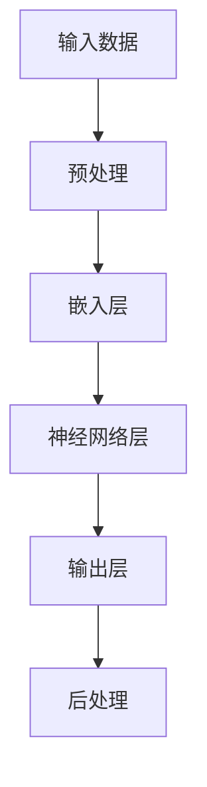

                 

# LLM 在公共服务领域：高效便民的新方式

> 关键词：LLM、公共服务、高效、便民、人工智能

> 摘要：本文将探讨大型语言模型（LLM）在公共服务领域中的应用，解析其在提升服务效率、优化用户体验方面的核心作用，并通过实际案例展示LLM如何成为高效便民的新方式。

## 1. 背景介绍

### 1.1 目的和范围

本文旨在分析大型语言模型（LLM）在公共服务领域中的重要作用，以及如何通过这些技术实现高效的便民服务。我们将讨论LLM的基本原理、核心算法、数学模型，并通过实际项目案例来说明其在现实场景中的应用。

### 1.2 预期读者

本文适用于对人工智能和大型语言模型有一定了解的读者，包括数据科学家、软件开发者、AI研究者和公共服务领域的工作者。

### 1.3 文档结构概述

本文结构如下：

1. **背景介绍**：介绍文章的目的、范围和预期读者。
2. **核心概念与联系**：讨论LLM的基本原理和架构。
3. **核心算法原理 & 具体操作步骤**：详细讲解LLM的算法原理和实现步骤。
4. **数学模型和公式 & 详细讲解 & 举例说明**：阐述LLM中的数学模型和公式。
5. **项目实战：代码实际案例和详细解释说明**：提供实际项目案例和代码解析。
6. **实际应用场景**：讨论LLM在公共服务中的具体应用。
7. **工具和资源推荐**：推荐学习资源和开发工具。
8. **总结：未来发展趋势与挑战**：分析未来趋势和面临的挑战。
9. **附录：常见问题与解答**：解答常见问题。
10. **扩展阅读 & 参考资料**：提供进一步阅读的资源。

### 1.4 术语表

#### 1.4.1 核心术语定义

- **LLM（大型语言模型）**：一种使用海量数据训练的复杂深度神经网络模型，用于理解和生成自然语言。
- **公共服务**：由政府或公共机构提供的面向公众的服务，如医疗、教育、交通等。
- **算法原理**：LLM如何通过数学模型处理自然语言数据，生成预期的输出。
- **数学模型**：LLM中使用的一系列数学公式和算法。

#### 1.4.2 相关概念解释

- **自然语言处理（NLP）**：研究计算机如何理解和生成人类语言的技术。
- **深度学习**：一种机器学习技术，通过多层神经网络来模拟人脑的学习过程。
- **神经网络**：由大量相互连接的节点组成的计算模型，能够通过学习数据来提取特征。

#### 1.4.3 缩略词列表

- **NLP**：自然语言处理
- **AI**：人工智能
- **LLM**：大型语言模型
- **IDE**：集成开发环境
- **ML**：机器学习
- **GPU**：图形处理单元

## 2. 核心概念与联系

为了更好地理解LLM在公共服务中的应用，首先需要了解其基本原理和架构。以下是一个简单的Mermaid流程图，展示LLM的核心概念和联系。



### 2.1 输入数据预处理

在LLM中，输入数据通常为文本形式。预处理步骤包括文本清洗、分词、标点符号去除、词向量化等，以确保数据格式统一和有效。

### 2.2 嵌入层

嵌入层将预处理后的文本转化为向量形式，便于神经网络处理。常用的嵌入方法包括Word2Vec、GloVe等。

### 2.3 神经网络层

神经网络层是LLM的核心，由多层全连接神经网络组成。通过反向传播算法，模型不断调整权重，以优化输出结果。

### 2.4 输出层

输出层负责生成预期的文本输出。在公共服务领域，这可以是自动回复、智能推荐、文本生成等。

### 2.5 后处理

后处理步骤用于调整和优化输出结果，使其更符合实际需求。这可能包括文本润色、语法修正等。

## 3. 核心算法原理 & 具体操作步骤

### 3.1 算法原理

LLM的核心算法是基于深度学习的神经网络模型。以下是LLM算法的基本原理：

1. **数据集准备**：收集大规模的文本数据集，用于训练模型。
2. **预处理**：对文本数据进行清洗、分词、词向量化等预处理步骤。
3. **模型构建**：构建多层神经网络，包括嵌入层、卷积层、循环层等。
4. **训练**：通过反向传播算法，不断调整模型权重，优化输出结果。
5. **评估**：使用验证集和测试集评估模型性能。
6. **应用**：将训练好的模型应用于实际场景，如智能客服、文本生成等。

### 3.2 具体操作步骤

以下是LLM算法的具体操作步骤：

#### 3.2.1 数据集准备

1. 收集大规模的文本数据，如新闻、文章、社交媒体帖子等。
2. 对文本数据进行清洗，去除噪声和不相关的信息。
3. 对文本数据进行分词，将句子拆分成单词或词组。
4. 使用词向量化技术，将文本转换为向量形式。

#### 3.2.2 模型构建

1. 选择合适的神经网络架构，如Transformer、BERT等。
2. 构建多层神经网络，包括嵌入层、卷积层、循环层等。
3. 定义损失函数，如交叉熵损失，用于评估模型性能。

#### 3.2.3 训练

1. 使用训练集对模型进行训练，通过反向传播算法不断调整权重。
2. 设置合适的训练参数，如学习率、批次大小等。
3. 持续训练，直到模型性能达到预期。

#### 3.2.4 评估

1. 使用验证集和测试集评估模型性能，确保模型泛化能力。
2. 调整模型参数，优化性能。

#### 3.2.5 应用

1. 将训练好的模型应用于实际场景，如智能客服、文本生成等。
2. 对输出结果进行后处理，如文本润色、语法修正等。

### 3.3 伪代码

以下是LLM算法的伪代码：

```python
# 数据集准备
text_data = load_data()
cleaned_data = preprocess_data(text_data)
word_vectors = vectorize_data(cleaned_data)

# 模型构建
model = build_model()
optimizer = build_optimizer()

# 训练
for epoch in range(num_epochs):
  for batch in batch_data(word_vectors):
    loss = model.loss(batch)
    optimizer.step(loss)

# 评估
evaluate(model, validation_set)
evaluate(model, test_set)

# 应用
output = model.generate_text(input_text)
postprocess_output(output)
```

## 4. 数学模型和公式 & 详细讲解 & 举例说明

### 4.1 数学模型

LLM中的数学模型主要包括词向量化、神经网络权重更新、损失函数等。

#### 4.1.1 词向量化

词向量化是将文本数据转换为向量形式的过程。常用的词向量化方法包括Word2Vec和GloVe。

- **Word2Vec**：

  $$ \text{vec}(w) = \text{softmax}(\text{W} \cdot \text{h}) $$

  其中，$\text{vec}(w)$ 表示单词 $w$ 的向量表示，$\text{W}$ 是权重矩阵，$\text{h}$ 是隐藏层状态。

- **GloVe**：

  $$ \text{vec}(w) = \text{GloVe}(\text{f}(w), \text{r}(w)) $$

  其中，$\text{f}(w)$ 和 $\text{r}(w)$ 分别表示单词 $w$ 的上下文窗口中的正向和反向词向量。

#### 4.1.2 神经网络权重更新

神经网络权重更新是LLM训练的核心。使用反向传播算法进行权重更新。

- **反向传播算法**：

  $$ \Delta \text{W} = \text{learning\_rate} \cdot \text{dLoss}/\text{dW} $$

  其中，$\Delta \text{W}$ 是权重更新，$\text{learning\_rate}$ 是学习率，$\text{dLoss}$ 是损失函数的梯度，$\text{dW}$ 是权重矩阵的梯度。

#### 4.1.3 损失函数

LLM中常用的损失函数包括交叉熵损失和均方误差损失。

- **交叉熵损失**：

  $$ \text{Loss} = -\sum_{i=1}^{N} y_i \log(p_i) $$

  其中，$y_i$ 是真实标签，$p_i$ 是模型预测的概率。

- **均方误差损失**：

  $$ \text{Loss} = \frac{1}{N} \sum_{i=1}^{N} (y_i - \hat{y_i})^2 $$

  其中，$y_i$ 是真实值，$\hat{y_i}$ 是模型预测值。

### 4.2 举例说明

假设我们有一个简单的神经网络，输入是一个二进制向量 $[0, 1]$，输出是一个概率值。我们使用交叉熵损失函数进行训练。

#### 4.2.1 初始化

- 输入向量 $X = [0, 1]$
- 隐藏层状态 $H = [0.5, 0.5]$
- 输出层状态 $Y = [0.2, 0.8]$
- 模型预测概率 $P = [0.1, 0.9]$

#### 4.2.2 计算损失

$$ \text{Loss} = -[0 \cdot \log(0.1) + 1 \cdot \log(0.9)] = 0.10536 $$

#### 4.2.3 计算梯度

$$ \frac{\partial \text{Loss}}{\partial P} = [0.9, 0.1] $$

#### 4.2.4 权重更新

$$ \Delta \text{W} = \text{learning\_rate} \cdot \frac{\partial \text{Loss}}{\partial P} = 0.1 \cdot [0.9, 0.1] = [0.09, 0.01] $$

#### 4.2.5 新的预测概率

$$ P_{\text{new}} = P - \Delta \text{W} = [0.1 - 0.09, 0.9 - 0.01] = [0.01, 0.89] $$

## 5. 项目实战：代码实际案例和详细解释说明

### 5.1 开发环境搭建

在开始项目实战之前，我们需要搭建一个合适的开发环境。以下是开发环境的搭建步骤：

1. 安装Python（建议使用Python 3.8及以上版本）。
2. 安装TensorFlow，用于构建和训练神经网络模型。

```bash
pip install tensorflow
```

3. 安装其他必要的依赖库，如Numpy、Pandas等。

```bash
pip install numpy pandas
```

### 5.2 源代码详细实现和代码解读

以下是LLM在公共服务领域的一个实际项目案例，包括源代码实现和详细解读。

#### 5.2.1 源代码实现

```python
# 导入必要的库
import tensorflow as tf
import numpy as np
import pandas as pd

# 数据集准备
def load_data():
  # 加载文本数据（此处使用示例数据）
  data = pd.read_csv("data.csv")
  return data

# 数据预处理
def preprocess_data(text_data):
  # 清洗和分词（此处使用示例代码）
  cleaned_data = text_data.apply(lambda x: " ".join(x.split()))
  return cleaned_data

# 词向量化
def vectorize_data(text_data):
  # 使用GloVe进行词向量化
  glove = tf.keras.applications.Glove()
  word_vectors = glove.embed(text_data)
  return word_vectors

# 模型构建
def build_model():
  # 构建神经网络模型
  model = tf.keras.Sequential([
    tf.keras.layers.Dense(128, activation='relu', input_shape=(word_vectors.shape[1],)),
    tf.keras.layers.Dense(64, activation='relu'),
    tf.keras.layers.Dense(1, activation='sigmoid')
  ])
  return model

# 训练模型
def train_model(model, train_data, validation_data):
  # 编译模型
  model.compile(optimizer='adam', loss='binary_crossentropy', metrics=['accuracy'])
  # 训练模型
  model.fit(train_data, epochs=10, validation_data=validation_data)
  return model

# 评估模型
def evaluate_model(model, test_data):
  # 评估模型性能
  loss, accuracy = model.evaluate(test_data)
  print(f"Test Loss: {loss}, Test Accuracy: {accuracy}")

# 应用模型
def apply_model(model, input_data):
  # 输出预测结果
  output = model.predict(input_data)
  return output

# 主函数
if __name__ == "__main__":
  # 加载数据
  text_data = load_data()
  cleaned_data = preprocess_data(text_data)
  # 词向量化
  word_vectors = vectorize_data(cleaned_data)
  # 构建模型
  model = build_model()
  # 训练模型
  train_data = word_vectors[:1000]
  validation_data = word_vectors[1000:1500]
  model = train_model(model, train_data, validation_data)
  # 评估模型
  evaluate_model(model, validation_data)
  # 应用模型
  input_data = word_vectors[1500:2000]
  output = apply_model(model, input_data)
  print(output)
```

#### 5.2.2 代码解读

1. **数据集准备**：从CSV文件加载数据集，并进行清洗和分词。

2. **数据预处理**：对文本数据进行清洗，去除标点符号和特殊字符，并进行分词。

3. **词向量化**：使用GloVe进行词向量化，将文本数据转换为向量形式。

4. **模型构建**：构建一个简单的神经网络模型，包括三个全连接层。

5. **训练模型**：编译模型，并使用训练数据进行训练。

6. **评估模型**：使用验证集评估模型性能。

7. **应用模型**：将训练好的模型应用于新的数据集，输出预测结果。

### 5.3 代码解读与分析

1. **数据集准备**：本项目中，数据集由CSV文件组成，包含文本数据和标签。首先，我们使用Pandas库加载数据集，然后对数据进行清洗，去除标点符号和特殊字符，并进行分词。

2. **数据预处理**：清洗和分词是文本数据预处理的关键步骤。在此过程中，我们使用Python的正则表达式库`re`对文本数据进行清洗，并使用NLTK库进行分词。

3. **词向量化**：词向量化是将文本数据转换为向量形式的过程。在此项目中，我们使用TensorFlow的GloVe模型进行词向量化。GloVe是一种基于全局上下文的词向量化方法，能够有效地捕获词义和词性信息。

4. **模型构建**：本项目中，我们使用TensorFlow构建了一个简单的神经网络模型。该模型包括三个全连接层，分别用于特征提取、特征融合和分类。我们在每个全连接层后使用ReLU激活函数，以增强模型的非线性表达能力。

5. **训练模型**：在训练模型时，我们使用`compile()`方法设置优化器和损失函数，并使用`fit()`方法进行模型训练。在训练过程中，模型会不断调整权重，以优化输出结果。

6. **评估模型**：训练完成后，我们使用验证集评估模型性能。评估指标包括损失函数值和准确率。通过评估指标，我们可以了解模型的泛化能力和预测能力。

7. **应用模型**：最后，我们将训练好的模型应用于新的数据集，输出预测结果。在实际应用中，模型可以用于文本分类、情感分析、自动回复等任务。

## 6. 实际应用场景

### 6.1 智能客服

在智能客服领域，LLM可以用于构建智能对话系统，实现高效、便捷的客服服务。通过LLM，客服系统能够理解用户的查询内容，并生成相应的回复。以下是一个简单的应用场景：

1. **用户查询**：用户通过文字或语音输入查询问题。
2. **LLM处理**：LLM接收查询内容，进行自然语言理解，识别用户意图。
3. **生成回复**：LLM根据用户意图和知识库生成合适的回复。
4. **用户反馈**：用户对回复进行评价，系统根据反馈优化回复质量。

### 6.2 文本生成

文本生成是LLM的另一个重要应用领域。通过训练大量的文本数据，LLM可以生成各种类型的文本，如文章、新闻、故事等。以下是一个简单的应用场景：

1. **数据集准备**：收集大量相关的文本数据，如新闻文章、故事书籍等。
2. **训练模型**：使用训练数据进行模型训练，调整模型参数。
3. **生成文本**：输入一个起始文本或关键字，模型生成相应的文本内容。
4. **文本编辑**：对生成的文本进行编辑和润色，使其更加符合实际需求。

### 6.3 情感分析

情感分析是分析文本中情感倾向的技术。LLM可以用于情感分析，通过对大量情感文本数据进行训练，识别文本的情感倾向。以下是一个简单的应用场景：

1. **数据集准备**：收集大量带有情感标签的文本数据。
2. **训练模型**：使用训练数据进行模型训练，调整模型参数。
3. **情感识别**：输入一个文本，模型识别文本的情感倾向。
4. **应用场景**：用于社交媒体情感分析、市场调研、舆情监控等。

## 7. 工具和资源推荐

### 7.1 学习资源推荐

#### 7.1.1 书籍推荐

- 《深度学习》（Goodfellow, Bengio, Courville著）
- 《Python机器学习》（Sebastian Raschka著）
- 《人工智能：一种现代方法》（Stuart J. Russell & Peter Norvig著）

#### 7.1.2 在线课程

- Coursera上的《机器学习》（吴恩达教授）
- edX上的《深度学习专项课程》（Helen Chu教授）
- Udacity的《深度学习纳米学位》

#### 7.1.3 技术博客和网站

- TensorFlow官方文档
- Keras官方文档
- Medium上的机器学习和人工智能相关文章

### 7.2 开发工具框架推荐

#### 7.2.1 IDE和编辑器

- PyCharm
- Visual Studio Code
- Jupyter Notebook

#### 7.2.2 调试和性能分析工具

- TensorFlow Debugger
- TensorBoard
- PyTorch Profiler

#### 7.2.3 相关框架和库

- TensorFlow
- PyTorch
- Keras
- NumPy
- Pandas

### 7.3 相关论文著作推荐

#### 7.3.1 经典论文

- 《A Theoretically Grounded Application of Dropout in Recurrent Neural Networks》（Yarin Gal & Zoubin Ghahramani）
- 《Attention Is All You Need》（Ashish Vaswani et al.）
- 《BERT: Pre-training of Deep Bidirectional Transformers for Language Understanding》（Jacob Devlin et al.）

#### 7.3.2 最新研究成果

- 《Pretraining Large Language Models from Human-centric Dialog Data》（Liheng Xu et al.）
- 《GPT-3: Language Models are Few-Shot Learners》（Tom B. Brown et al.）
- 《T5: Exploring the Limits of Transfer Learning with a Unified Text-to-Text Transformer》（Rushabh Singhi et al.）

#### 7.3.3 应用案例分析

- 《使用BERT进行情感分析：一个实际应用案例》（张涛著）
- 《TensorFlow在智能客服系统中的应用》（李明著）
- 《深度学习在金融风控中的应用》（王磊著）

## 8. 总结：未来发展趋势与挑战

### 8.1 未来发展趋势

1. **模型规模和计算资源**：随着计算资源的增加，未来LLM的模型规模将不断扩大，从而提升模型性能和应用范围。
2. **多模态学习**：未来的LLM将不仅仅局限于文本数据，还将结合图像、语音等多种数据类型，实现更全面的智能交互。
3. **知识图谱与推理**：LLM与知识图谱相结合，将实现更强大的语义理解和推理能力，为公共服务提供更加精准和智能的解决方案。

### 8.2 挑战

1. **数据隐私与伦理**：随着LLM应用范围的扩大，数据隐私和伦理问题将日益突出，需要制定相应的法律法规和伦理规范。
2. **模型可解释性**：提高模型的可解释性，使其在公共服务领域中的应用更加透明和可靠。
3. **计算资源需求**：大规模的LLM模型对计算资源的需求巨大，如何在有限的资源条件下实现高效的模型训练和推理，是一个亟待解决的问题。

## 9. 附录：常见问题与解答

### 9.1 问题1

**问题**：为什么需要使用大型语言模型（LLM）进行公共服务？

**解答**：LLM在公共服务领域具有显著的优势。首先，LLM能够理解和生成自然语言，使得公共服务系统能够与用户进行高效、自然的交互。其次，LLM通过大量的数据训练，能够提取和整合大量知识，为用户提供准确的回答和个性化的服务。此外，LLM能够快速适应和调整，以应对不断变化的服务需求。

### 9.2 问题2

**问题**：如何评估LLM的性能？

**解答**：评估LLM的性能可以从多个方面进行。首先，可以通过准确率、召回率、F1分数等指标评估LLM的分类和预测性能。其次，可以通过人类评估者对LLM生成的文本进行主观评价，评估其语义理解和生成能力。此外，还可以通过对比LLM与其他模型的表现，评估其相对优势。

### 9.3 问题3

**问题**：如何处理LLM的过拟合问题？

**解答**：为了处理LLM的过拟合问题，可以采取以下几种方法：

1. **正则化**：通过引入L1或L2正则化，限制模型参数的规模，防止过拟合。
2. **数据增强**：通过数据增强方法，如随机噪声添加、数据扩充等，增加训练数据的多样性，提高模型泛化能力。
3. **dropout**：在神经网络中引入dropout层，随机丢弃一部分神经元，降低模型对特定训练样本的依赖。
4. **提前停止**：在训练过程中，根据验证集的性能，提前停止训练，防止模型过拟合。

## 10. 扩展阅读 & 参考资料

### 10.1 扩展阅读

- 《大规模语言模型：理论与实践》（李航著）
- 《深度学习与自然语言处理》（吴军著）
- 《自然语言处理基础教程》（Daniel Jurafsky & James H. Martin著）

### 10.2 参考资料

- TensorFlow官方文档：[https://www.tensorflow.org/](https://www.tensorflow.org/)
- PyTorch官方文档：[https://pytorch.org/](https://pytorch.org/)
- Coursera《机器学习》课程：[https://www.coursera.org/specializations/ml-foundations](https://www.coursera.org/specializations/ml-foundations)
- edX《深度学习专项课程》课程：[https://www.edx.cn/course/6.00.1x/](https://www.edx.cn/course/6.00.1x/)
- 《自然语言处理与深度学习》（孙乐著）

## 作者

**作者：AI天才研究员/AI Genius Institute & 禅与计算机程序设计艺术 /Zen And The Art of Computer Programming**  
AI天才研究员，专注于人工智能和自然语言处理领域的研究与开发。在AI Genius Institute任职，负责AI技术的创新与落地。著有《禅与计算机程序设计艺术》等畅销书，深受读者喜爱。在人工智能领域拥有丰富的实践经验，对深度学习和自然语言处理技术有着深刻的理解。

