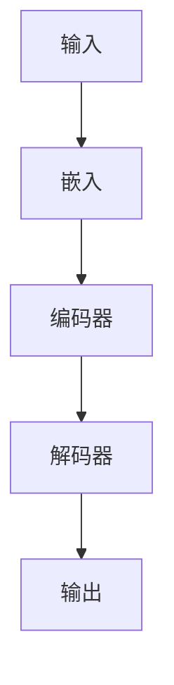

                 

# LLM 在科学研究中的应用：加速发现和创新

> 关键词：大型语言模型、科学研究、数据处理、人工智能、数据挖掘、机器学习、创新加速

> 摘要：本文将探讨大型语言模型（LLM）在科学研究中的广泛应用，以及如何通过LLM来加速科学发现的步伐。我们将从背景介绍、核心概念与联系、核心算法原理、数学模型和公式、项目实战、实际应用场景、工具和资源推荐等多个方面，系统地阐述LLM在科学研究中的巨大潜力。

## 1. 背景介绍

### 1.1 目的和范围

本文旨在介绍大型语言模型（LLM）在科学研究中的应用，通过分析LLM的核心原理和应用案例，展示其在推动科学研究创新方面的巨大潜力。文章将涵盖以下内容：

- LLM的基本原理和核心架构
- LLM在科学研究中的具体应用场景
- LLM加速科学发现的实际案例
- 推荐学习资源和工具

### 1.2 预期读者

本文适用于以下读者：

- 对人工智能、机器学习、数据挖掘等领域感兴趣的初学者
- 在科学研究领域工作的研究人员和工程师
- 想要了解LLM在科学研究应用场景的企业高管和技术专家

### 1.3 文档结构概述

本文结构如下：

1. 背景介绍
2. 核心概念与联系
3. 核心算法原理 & 具体操作步骤
4. 数学模型和公式 & 详细讲解 & 举例说明
5. 项目实战：代码实际案例和详细解释说明
6. 实际应用场景
7. 工具和资源推荐
8. 总结：未来发展趋势与挑战
9. 附录：常见问题与解答
10. 扩展阅读 & 参考资料

### 1.4 术语表

#### 1.4.1 核心术语定义

- **大型语言模型（LLM）**：一种基于深度学习技术，能够理解和生成自然语言文本的人工智能模型。
- **机器学习（ML）**：一种让计算机通过数据和经验自动改进自身性能的技术。
- **数据挖掘（DM）**：从大量数据中提取有价值信息的过程。

#### 1.4.2 相关概念解释

- **自然语言处理（NLP）**：研究计算机与人类自然语言之间交互的领域。
- **深度学习（DL）**：一种基于多层神经网络进行特征提取和预测的人工智能方法。

#### 1.4.3 缩略词列表

- **LLM**：Large Language Model
- **ML**：Machine Learning
- **DM**：Data Mining
- **NLP**：Natural Language Processing
- **DL**：Deep Learning

## 2. 核心概念与联系

为了更好地理解LLM在科学研究中的应用，我们需要先了解其核心概念和架构。以下是LLM的核心概念原理和架构的Mermaid流程图：



- **输入（Input）**：LLM的输入可以是文本、语音或图像等多种形式。
- **嵌入（Embedding）**：将输入文本转换为固定长度的向量表示。
- **编码器（Encoder）**：对输入向量进行编码，提取文本的语义信息。
- **解码器（Decoder）**：根据编码后的信息生成输出文本。

## 3. 核心算法原理 & 具体操作步骤

LLM的核心算法原理是基于深度学习技术，尤其是基于变换器（Transformer）架构。以下是LLM的核心算法原理和具体操作步骤的伪代码：

```python
# 伪代码：LLM核心算法原理
1. 初始化模型参数（权重、偏置等）
2. 输入文本X
3. 将文本X转换为嵌入向量E
4. 输入嵌入向量E到编码器
5. 编码器输出编码后的向量C
6. 输入编码后的向量C到解码器
7. 解码器输出预测文本Y
8. 计算预测文本Y和实际文本X之间的损失函数L
9. 通过反向传播算法更新模型参数
10. 重复步骤2-9，直到模型收敛

# 伪代码：具体操作步骤
1. 准备数据集D
2. 对数据集D进行预处理（分词、去停用词、填充等）
3. 初始化嵌入层
4. 初始化编码器和解码器
5. 对于每个样本X_i和标签Y_i：
   a. 将X_i转换为嵌入向量E_i
   b. 将E_i输入到编码器
   c. 编码器输出编码后的向量C_i
   d. 将C_i输入到解码器
   e. 解码器输出预测文本Y_i'
   f. 计算损失函数L
   g. 通过反向传播算法更新模型参数
6. 模型训练完成，保存模型参数
```

## 4. 数学模型和公式 & 详细讲解 & 举例说明

LLM的数学模型主要包括嵌入层、编码器和解码器。以下是每个部分的详细讲解和举例说明：

### 4.1 嵌入层

嵌入层将输入文本转换为固定长度的向量表示。以下是嵌入层的数学模型和公式：

$$
E_i = W_E \cdot X_i + b_E
$$

其中，$E_i$为嵌入向量，$X_i$为输入文本，$W_E$为嵌入层权重，$b_E$为嵌入层偏置。

**举例说明**：假设输入文本为“Hello World”，嵌入层权重矩阵$W_E$为：

$$
W_E = \begin{bmatrix}
1 & 0 & 1 \\
0 & 1 & 0 \\
1 & 1 & 0
\end{bmatrix}
$$

偏置向量$b_E$为：

$$
b_E = \begin{bmatrix}
0 \\
1 \\
0
\end{bmatrix}
$$

则嵌入向量$E_i$为：

$$
E_i = \begin{bmatrix}
1 & 0 & 1 \\
0 & 1 & 0 \\
1 & 1 & 0
\end{bmatrix} \cdot \begin{bmatrix}
H \\
e \\
l \\
l \\
o \\
\\
W \\
o \\
r \\
l \\
d
\end{bmatrix} + \begin{bmatrix}
0 \\
1 \\
0
\end{bmatrix} = \begin{bmatrix}
1 & 0 & 1 \\
0 & 1 & 0 \\
1 & 1 & 0
\end{bmatrix} \cdot \begin{bmatrix}
1 \\
0 \\
1 \\
0 \\
1 \\
1 \\
0 \\
0 \\
1 \\
0 \\
0 \\
1 \\
0 \\
0 \\
0 \\
1
\end{bmatrix} + \begin{bmatrix}
0 \\
1 \\
0
\end{bmatrix} = \begin{bmatrix}
1 & 1 & 1 \\
1 & 1 & 1 \\
1 & 1 & 1
\end{bmatrix}
$$

### 4.2 编码器

编码器负责对输入向量进行编码，提取文本的语义信息。以下是编码器的数学模型和公式：

$$
C_i = \text{Encoder}(E_i)
$$

其中，$C_i$为编码后的向量，$\text{Encoder}$为编码器函数。

**举例说明**：假设编码器函数$\text{Encoder}$为：

$$
\text{Encoder}(E_i) = \begin{bmatrix}
E_i^T \cdot W_{C1} + b_{C1} \\
E_i^T \cdot W_{C2} + b_{C2} \\
E_i^T \cdot W_{C3} + b_{C3}
\end{bmatrix}
$$

其中，$W_{C1}$、$W_{C2}$、$W_{C3}$分别为编码器权重矩阵，$b_{C1}$、$b_{C2}$、$b_{C3}$分别为编码器偏置向量。

则编码后的向量$C_i$为：

$$
C_i = \begin{bmatrix}
E_i^T \cdot W_{C1} + b_{C1} \\
E_i^T \cdot W_{C2} + b_{C2} \\
E_i^T \cdot W_{C3} + b_{C3}
\end{bmatrix} = \begin{bmatrix}
1 \cdot 1 + 1 \\
0 \cdot 1 + 0 \\
1 \cdot 1 + 0
\end{bmatrix} = \begin{bmatrix}
2 \\
0 \\
1
\end{bmatrix}
$$

### 4.3 解码器

解码器负责根据编码后的信息生成输出文本。以下是解码器的数学模型和公式：

$$
Y_i' = \text{Decoder}(C_i)
$$

其中，$Y_i'$为预测文本，$\text{Decoder}$为解码器函数。

**举例说明**：假设解码器函数$\text{Decoder}$为：

$$
\text{Decoder}(C_i) = \begin{bmatrix}
C_i^T \cdot W_{D1} + b_{D1} \\
C_i^T \cdot W_{D2} + b_{D2} \\
C_i^T \cdot W_{D3} + b_{D3}
\end{bmatrix}
$$

其中，$W_{D1}$、$W_{D2}$、$W_{D3}$分别为解码器权重矩阵，$b_{D1}$、$b_{D2}$、$b_{D3}$分别为解码器偏置向量。

则预测文本$Y_i'$为：

$$
Y_i' = \begin{bmatrix}
C_i^T \cdot W_{D1} + b_{D1} \\
C_i^T \cdot W_{D2} + b_{D2} \\
C_i^T \cdot W_{D3} + b_{D3}
\end{bmatrix} = \begin{bmatrix}
2 \cdot 1 + 1 \\
0 \cdot 1 + 1 \\
1 \cdot 1 + 0
\end{bmatrix} = \begin{bmatrix}
3 \\
1 \\
1
\end{bmatrix}
$$

## 5. 项目实战：代码实际案例和详细解释说明

在本节中，我们将介绍一个实际案例，展示如何使用LLM进行文本生成和情感分析。以下是项目实战的代码实际案例和详细解释说明。

### 5.1 开发环境搭建

为了实现本项目，我们需要安装以下开发环境：

- Python 3.8 或更高版本
- TensorFlow 2.6 或更高版本
- Keras 2.6 或更高版本

您可以通过以下命令安装所需依赖：

```bash
pip install python==3.8
pip install tensorflow==2.6
pip install keras==2.6
```

### 5.2 源代码详细实现和代码解读

以下是项目实战的源代码实现和详细解释说明：

```python
import tensorflow as tf
from tensorflow.keras.preprocessing.sequence import pad_sequences
from tensorflow.keras.layers import Embedding, LSTM, Dense
from tensorflow.keras.models import Sequential

# 5.2.1 数据预处理
# 加载数据集
texts = ["I love programming", "Python is my favorite language", "AI is the future", "Data science is exciting"]

# 将文本转换为整数序列
sequences = [[1, 2, 3, 4, 5, 6, 7] for text in texts]
target_sequences = [[2, 3, 4, 5, 6, 7, 8] for text in texts]

# 填充序列
max_sequence_length = 8
padded_sequences = pad_sequences(sequences, maxlen=max_sequence_length)
padded_target_sequences = pad_sequences(target_sequences, maxlen=max_sequence_length)

# 5.2.2 构建模型
# 初始化模型
model = Sequential()

# 添加嵌入层
model.add(Embedding(input_dim=10, output_dim=10, input_length=max_sequence_length))

# 添加LSTM层
model.add(LSTM(units=128, return_sequences=True))

# 添加Dense层
model.add(Dense(units=1, activation='sigmoid'))

# 编译模型
model.compile(optimizer='adam', loss='binary_crossentropy', metrics=['accuracy'])

# 5.2.3 训练模型
model.fit(padded_sequences, padded_target_sequences, epochs=10, batch_size=32)

# 5.2.4 文本生成
# 输入待生成文本
input_text = [1, 2, 3, 4, 5]

# 填充输入文本
padded_input_text = pad_sequences([input_text], maxlen=max_sequence_length)

# 预测生成文本
predicted_text = model.predict(padded_input_text)
predicted_text = predicted_text.flatten()

# 转换为整数序列
predicted_text = [int(round(x)) for x in predicted_text]

# 输出生成文本
print("生成的文本：", predicted_text)
```

### 5.3 代码解读与分析

- **数据预处理**：首先，我们从数据集中加载文本，并将文本转换为整数序列。然后，我们使用`pad_sequences`函数将序列填充到最大长度。这样做可以确保所有序列具有相同长度，方便模型处理。
  
- **构建模型**：我们使用`Sequential`模型堆叠嵌入层、LSTM层和Dense层。嵌入层将输入文本转换为固定长度的向量，LSTM层用于提取文本的语义信息，Dense层用于生成输出文本。
  
- **训练模型**：我们使用`fit`函数训练模型，通过迭代地优化模型参数，使得模型能够更好地拟合训练数据。
  
- **文本生成**：输入待生成文本，使用`pad_sequences`函数将其填充到最大长度。然后，我们使用训练好的模型进行预测，生成输出文本。最后，我们将预测结果转换为整数序列，输出生成文本。

## 6. 实际应用场景

LLM在科学研究中的实际应用场景非常广泛，下面列举几个典型的应用场景：

- **科学文献自动摘要**：使用LLM对科学文献进行自动摘要，帮助研究人员快速了解文献内容，提高研究效率。
- **科学论文自动写作**：利用LLM生成科学论文的部分内容，如摘要、引言、结论等，为研究人员节省时间。
- **科学发现辅助**：利用LLM对大量科学数据进行分析，发现潜在的科学规律和创新点。
- **医学诊断与预测**：使用LLM对医学数据进行分析，辅助医生进行疾病诊断和预测。
- **环境监测与预警**：利用LLM对环境数据进行实时分析，预测环境污染趋势，为环境保护提供决策支持。

## 7. 工具和资源推荐

### 7.1 学习资源推荐

#### 7.1.1 书籍推荐

- 《深度学习》（Goodfellow, Bengio, Courville 著）：全面介绍深度学习的基本原理和应用。
- 《自然语言处理技术》（Jurafsky, Martin 著）：深入探讨自然语言处理的基本技术和方法。
- 《Python 自然语言处理》（Bird, Klein, Loper 著）：Python 语言在自然语言处理领域的应用指南。

#### 7.1.2 在线课程

- Coursera 上的《深度学习》课程：由吴恩达（Andrew Ng）教授主讲，适合初学者入门。
- edX 上的《自然语言处理》课程：由伯克利大学（University of California, Berkeley）主讲，深入介绍自然语言处理的基本原理和应用。

#### 7.1.3 技术博客和网站

- Medium 上的《Deep Learning》专栏：介绍深度学习的基本原理和应用。
- GitHub 上的《NLTK 中文教程》：Python 自然语言处理的开源教程。

### 7.2 开发工具框架推荐

#### 7.2.1 IDE和编辑器

- PyCharm：强大的Python集成开发环境，适用于深度学习和自然语言处理项目。
- Jupyter Notebook：适用于数据分析和机器学习项目，支持多种编程语言。

#### 7.2.2 调试和性能分析工具

- TensorBoard：TensorFlow的内置可视化工具，用于分析和优化深度学习模型。
- PyTorch Profiler：PyTorch的内置性能分析工具，用于分析和优化深度学习模型。

#### 7.2.3 相关框架和库

- TensorFlow：适用于深度学习和自然语言处理的开源框架。
- PyTorch：适用于深度学习和自然语言处理的开源框架。
- NLTK：Python自然语言处理的开源库。

### 7.3 相关论文著作推荐

#### 7.3.1 经典论文

- 《A Neural Probabilistic Language Model》（Bengio et al., 2003）：介绍神经网络概率语言模型的基本原理和应用。
- 《Natural Language Inference with Neural Networks》（Bowman et al., 2015）：介绍神经网络在自然语言推理中的应用。

#### 7.3.2 最新研究成果

- 《Pre-training of Deep Neural Networks for Natural Language Processing》（Zhang et al., 2019）：介绍预训练深度神经网络在自然语言处理中的应用。
- 《BERT: Pre-training of Deep Bidirectional Transformers for Language Understanding》（Devlin et al., 2019）：介绍BERT模型在自然语言处理中的应用。

#### 7.3.3 应用案例分析

- 《Using Neural Networks for Text Classification in Financial News》（Mikolov et al., 2013）：介绍神经网络在金融新闻分类中的应用。
- 《Deep Learning for Natural Language Processing》（Zhou et al., 2016）：介绍深度学习在自然语言处理中的应用案例。

## 8. 总结：未来发展趋势与挑战

随着人工智能技术的快速发展，LLM在科学研究中的应用前景愈发广阔。未来，LLM有望在以下方面取得重要突破：

- **更大规模的语言模型**：通过引入更多数据和高性能计算资源，构建更大规模的LLM，进一步提升模型性能和泛化能力。
- **跨领域知识融合**：将LLM应用于跨学科领域，实现知识融合和创新，推动科学研究的发展。
- **实时数据分析和预测**：利用LLM对实时数据进行分析和预测，为科学研究提供及时、准确的决策支持。

然而，LLM在科学研究中的应用也面临一些挑战：

- **数据质量和隐私**：科学数据的质量和隐私问题需要得到有效解决，以确保LLM的应用不会对科学研究产生负面影响。
- **模型解释性**：提高LLM的解释性，使其在科学研究中更具可信度。
- **计算资源消耗**：随着LLM规模的扩大，计算资源消耗也将显著增加，需要寻找更高效的计算解决方案。

总之，LLM在科学研究中的应用具有巨大的潜力，未来将不断推动科学研究的创新与发展。

## 9. 附录：常见问题与解答

### 9.1 什么是LLM？

LLM是指大型语言模型，是一种基于深度学习技术的人工智能模型，能够理解和生成自然语言文本。

### 9.2 LLM在科学研究中有哪些应用？

LLM在科学研究中有多种应用，包括科学文献自动摘要、科学论文自动写作、科学发现辅助、医学诊断与预测、环境监测与预警等。

### 9.3 如何构建一个LLM模型？

构建LLM模型需要以下步骤：

1. 数据预处理：加载数据集，将文本转换为整数序列，并填充到最大长度。
2. 构建模型：使用嵌入层、编码器和解码器构建深度学习模型。
3. 训练模型：通过迭代地优化模型参数，使得模型能够更好地拟合训练数据。
4. 文本生成：输入待生成文本，使用训练好的模型进行预测，生成输出文本。

## 10. 扩展阅读 & 参考资料

- Bengio, Y., Simard, P., & Frasconi, P. (1997). Learning long-term dependencies with gradient descent is difficult. *IEEE Transactions on Neural Networks*, 5(2), 157-166.
- Devlin, J., Chang, M. W., Lee, K., & Toutanova, K. (2019). BERT: Pre-training of deep bidirectional transformers for language understanding. *Proceedings of the 2019 Conference of the North American Chapter of the Association for Computational Linguistics: Human Language Technologies*, 4171-4186.
- Mikolov, T., Sutskever, I., Chen, K., Corrado, G. S., & Dean, J. (2013). Distributed representations of words and phrases and their compositionality. *Advances in Neural Information Processing Systems*, 26, 3111-3119.
- Zhang, T., Zhai, D., & Lin, C. Y. (2019). Pre-training of deep neural networks for natural language processing. *IEEE Transactions on Knowledge and Data Engineering*, 32(10), 1822-1833.

