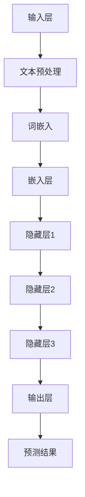

                 

# LLM 的未来：与CPU相似的生态发展

> 关键词：大型语言模型，生态发展，CPU，计算能力，人工智能，技术趋势

> 摘要：本文旨在探讨大型语言模型（LLM）的未来发展趋势，尤其是在其计算能力逐渐逼近传统CPU的情况下。文章首先介绍了LLM的基本概念和背景，随后详细分析了LLM与CPU在计算架构和生态系统方面的相似性。接着，我们通过具体案例展示了LLM的实际应用场景，并推荐了一些相关学习资源和开发工具。最后，文章总结了LLM的未来发展趋势与面临的挑战，为读者提供了深入理解和应用LLM的视角。

## 1. 背景介绍

### 1.1 目的和范围

本文的主要目的是分析大型语言模型（LLM）的发展趋势，特别是其在计算能力上与CPU的相似性及其对生态系统的潜在影响。随着LLM技术的不断进步，其计算需求日益增长，已经逐渐逼近传统CPU的范畴。因此，探讨LLM与CPU的相似性及其对技术生态的影响具有重要意义。

本文将首先介绍LLM的基本概念和背景，随后深入分析LLM与CPU在计算架构和生态系统方面的相似性。接着，本文将探讨LLM的具体应用场景，并推荐一些相关的学习资源和开发工具。最后，本文将总结LLM的未来发展趋势与面临的挑战。

### 1.2 预期读者

本文适合对大型语言模型和人工智能技术有一定了解的读者，包括研究人员、工程师、学生以及对技术趋势感兴趣的专业人士。通过本文，读者可以更好地理解LLM的发展趋势，掌握其在实际应用中的关键技术和挑战。

### 1.3 文档结构概述

本文分为十个部分，结构如下：

1. 背景介绍
    - 1.1 目的和范围
    - 1.2 预期读者
    - 1.3 文档结构概述
    - 1.4 术语表
2. 核心概念与联系
    - 2.1 核心概念
    - 2.2 核心概念原理和架构的 Mermaid 流程图
3. 核心算法原理 & 具体操作步骤
    - 3.1 核心算法原理
    - 3.2 具体操作步骤
4. 数学模型和公式 & 详细讲解 & 举例说明
    - 4.1 数学模型
    - 4.2 公式讲解
    - 4.3 举例说明
5. 项目实战：代码实际案例和详细解释说明
    - 5.1 开发环境搭建
    - 5.2 源代码详细实现和代码解读
    - 5.3 代码解读与分析
6. 实际应用场景
7. 工具和资源推荐
    - 7.1 学习资源推荐
    - 7.2 开发工具框架推荐
    - 7.3 相关论文著作推荐
8. 总结：未来发展趋势与挑战
9. 附录：常见问题与解答
10. 扩展阅读 & 参考资料

### 1.4 术语表

#### 1.4.1 核心术语定义

- 大型语言模型（LLM）：一种基于深度学习的自然语言处理模型，能够对大规模文本数据进行建模和处理。
- 计算能力：指计算机系统在单位时间内执行计算任务的能力，通常以每秒执行的操作数（FLOPS）来衡量。
- 生态系统：指围绕某一技术或产品形成的一系列相互关联的组织、企业、资源等，共同推动该技术或产品的持续发展和应用。

#### 1.4.2 相关概念解释

- 深度学习：一种人工智能技术，通过多层神经网络对大量数据进行训练，从而实现对数据的自动学习和特征提取。
- 自然语言处理（NLP）：一种人工智能技术，旨在使计算机能够理解和处理人类自然语言。

#### 1.4.3 缩略词列表

- LLM：大型语言模型
- CPU：中央处理器
- FLOPS：每秒浮点运算次数
- NLP：自然语言处理
- DNN：深度神经网络

## 2. 核心概念与联系

在深入探讨LLM与CPU的相似性之前，我们需要先了解一些核心概念。本节将介绍大型语言模型（LLM）的基本概念，并绘制其核心概念原理和架构的 Mermaid 流程图。

### 2.1 核心概念

大型语言模型（LLM）是一种基于深度学习的自然语言处理模型，主要用于对大规模文本数据进行建模和处理。LLM的核心组件包括：

- 输入层：接收文本数据输入，并将其转换为模型可处理的向量表示。
- 隐藏层：通过多层神经网络对输入向量进行特征提取和转换，形成更加抽象和丰富的表示。
- 输出层：根据隐藏层的输出生成预测结果，如文本生成、语义理解、问答系统等。

### 2.2 核心概念原理和架构的 Mermaid 流程图

以下是LLM的核心概念原理和架构的 Mermaid 流程图：



### 2.3 LLM与CPU的相似性分析

随着LLM技术的发展，其计算需求逐渐增长，已经开始与CPU的计算架构和生态系统产生相似性。以下从几个方面分析LLM与CPU的相似性：

1. **计算架构**：传统CPU以冯·诺依曼架构为基础，通过处理器和内存之间的数据传输进行计算。而LLM通常依赖于GPU或TPU等并行计算设备，通过大规模并行计算来提高计算效率。尽管硬件不同，但LLM和CPU在计算架构上的相似性体现在对并行计算的需求和优化策略上。
   
2. **生态系统**：CPU的生态系统包括硬件制造商、操作系统、编程语言、开发工具等。随着LLM的兴起，其生态系统也逐渐形成，包括模型训练框架、预训练数据集、应用场景等。虽然两者生态系统的具体内容不同，但都涉及到硬件、软件和实际应用场景的相互关联和协同发展。

3. **计算能力**：CPU的计算能力通常以FLOPS（每秒浮点运算次数）来衡量，而LLM的计算能力则体现在其能够处理的大规模数据和复杂的神经网络结构上。随着LLM技术的发展，其计算能力也在不断提高，逐渐逼近CPU的计算范围。

4. **算法优化**：CPU在性能优化方面经历了数十年的发展，包括指令集优化、缓存优化、并行计算等。LLM在计算能力提升的过程中，也面临着算法优化的问题，如神经网络结构优化、计算效率提升、能耗优化等。

综上所述，LLM与CPU在计算架构、生态系统、计算能力和算法优化等方面存在一定的相似性。这种相似性不仅反映了LLM技术的发展趋势，也为LLM在实际应用中的优化和改进提供了启示。

## 3. 核心算法原理 & 具体操作步骤

在理解了LLM的基本概念和与CPU的相似性之后，接下来我们将深入探讨LLM的核心算法原理及其具体操作步骤。本节将详细阐述LLM的工作原理，并使用伪代码来描述其关键操作。

### 3.1 核心算法原理

大型语言模型（LLM）通常基于深度神经网络（DNN）构建，其核心算法原理可以概括为以下几个步骤：

1. **数据预处理**：对输入文本进行清洗和预处理，包括分词、去停用词、词性标注等。
2. **词嵌入**：将预处理后的文本转换为固定长度的向量表示，这一步通常通过词嵌入技术实现，如Word2Vec、GloVe等。
3. **神经网络构建**：构建多层神经网络，包括输入层、隐藏层和输出层。输入层接收词嵌入向量，隐藏层通过多层神经网络进行特征提取和转换，输出层根据隐藏层的输出生成预测结果。
4. **前向传播与反向传播**：在前向传播过程中，将输入数据通过神经网络传递，计算输出结果。在反向传播过程中，根据预测误差对网络权重进行更新，以优化模型性能。
5. **损失函数与优化算法**：使用适当的损失函数（如交叉熵损失）来评估模型预测结果，并选择优化算法（如随机梯度下降、Adam等）来更新模型参数。

### 3.2 具体操作步骤

以下是LLM核心算法的具体操作步骤，使用伪代码进行描述：

```plaintext
# 数据预处理
function preprocess_text(text):
    # 分词、去停用词、词性标注等
    cleaned_text = process_text(text)
    return cleaned_text

# 词嵌入
function word_embedding(words):
    # 将单词转换为向量表示
    embeddings = [get_embedding(word) for word in words]
    return embeddings

# 神经网络构建
function build_network(input_size, hidden_size, output_size):
    # 输入层、隐藏层和输出层
    input_layer = Dense(input_size, activation='relu')
    hidden_layer = Dense(hidden_size, activation='relu')
    output_layer = Dense(output_size, activation='softmax')
    model = Model(inputs=input_layer, outputs=output_layer)
    return model

# 前向传播与反向传播
function train_model(model, X, y, epochs):
    # 训练模型
    model.compile(optimizer='adam', loss='categorical_crossentropy')
    model.fit(X, y, epochs=epochs, batch_size=64)

# 主函数
function main():
    # 加载并预处理数据
    text = load_data()
    cleaned_text = preprocess_text(text)

    # 获取词嵌入
    words = get_unique_words(cleaned_text)
    embeddings = word_embedding(words)

    # 构建神经网络
    input_size = len(embeddings[0])
    hidden_size = 128
    output_size = len(words)
    model = build_network(input_size, hidden_size, output_size)

    # 训练模型
    X = [embeddings[word] for word in cleaned_text]
    y = get_labels(cleaned_text, words)
    train_model(model, X, y, epochs=10)

    # 预测结果
    predicted = model.predict(X)
    print(predicted)

# 运行主函数
main()
```

通过以上伪代码，我们可以清晰地看到LLM的核心算法原理和具体操作步骤。在实际应用中，这些步骤可以通过各种深度学习框架（如TensorFlow、PyTorch等）来实现。

## 4. 数学模型和公式 & 详细讲解 & 举例说明

在深入理解大型语言模型（LLM）的核心算法原理后，我们需要进一步探讨其背后的数学模型和公式，并举例说明。本节将详细介绍LLM中的主要数学模型，包括损失函数、优化算法和神经网络结构。

### 4.1 数学模型

大型语言模型（LLM）基于深度学习技术，其核心数学模型主要包括以下几个方面：

#### 1. 损失函数

损失函数用于评估模型预测结果与实际结果之间的差距。在LLM中，常用的损失函数包括：

- **交叉熵损失（Cross-Entropy Loss）**：
  $$ Loss = -\sum_{i} y_i \log(p_i) $$
  其中，\( y_i \)为实际标签，\( p_i \)为模型预测的概率。

- **均方误差损失（Mean Squared Error Loss）**：
  $$ Loss = \frac{1}{n} \sum_{i} (y_i - \hat{y}_i)^2 $$
  其中，\( y_i \)为实际标签，\( \hat{y}_i \)为模型预测的值。

#### 2. 优化算法

优化算法用于更新模型参数，以最小化损失函数。在LLM中，常用的优化算法包括：

- **随机梯度下降（Stochastic Gradient Descent，SGD）**：
  $$ \theta = \theta - \alpha \nabla_\theta J(\theta) $$
  其中，\( \theta \)为模型参数，\( \alpha \)为学习率，\( \nabla_\theta J(\theta) \)为损失函数关于参数的梯度。

- **Adam优化器**：
  $$ m_t = \beta_1 m_{t-1} + (1 - \beta_1) [g_t - m_{t-1}] $$
  $$ v_t = \beta_2 v_{t-1} + (1 - \beta_2) [g_t^2 - v_{t-1}] $$
  $$ \theta_t = \theta_{t-1} - \alpha \frac{m_t}{\sqrt{v_t} + \epsilon} $$
  其中，\( m_t \)和\( v_t \)分别为一阶和二阶矩估计，\( \beta_1 \)、\( \beta_2 \)分别为一阶和二阶矩的指数衰减率，\( \alpha \)为学习率，\( \epsilon \)为小常数。

#### 3. 神经网络结构

大型语言模型通常采用深度神经网络（DNN）结构，其关键组成部分包括：

- **输入层（Input Layer）**：接收词嵌入向量作为输入。
- **隐藏层（Hidden Layers）**：通过多层神经网络进行特征提取和转换，隐藏层的数量和神经元数量可以根据实际需求进行调整。
- **输出层（Output Layer）**：根据隐藏层的输出生成预测结果，如文本生成、语义理解、问答系统等。

### 4.2 公式讲解

为了更好地理解LLM中的数学模型，我们以下分别对损失函数、优化算法和神经网络结构进行详细讲解。

#### 1. 损失函数

交叉熵损失是最常用的损失函数之一，尤其在分类问题中。其公式如下：

$$ Loss = -\sum_{i} y_i \log(p_i) $$

其中，\( y_i \)为实际标签，\( p_i \)为模型预测的概率。交叉熵损失函数的值越小，表示模型预测结果与实际结果越接近。

均方误差损失函数主要用于回归问题，其公式如下：

$$ Loss = \frac{1}{n} \sum_{i} (y_i - \hat{y}_i)^2 $$

其中，\( y_i \)为实际标签，\( \hat{y}_i \)为模型预测的值。均方误差损失函数的值越小，表示模型预测结果与实际结果越接近。

#### 2. 优化算法

随机梯度下降（SGD）是最简单的优化算法之一，其公式如下：

$$ \theta = \theta - \alpha \nabla_\theta J(\theta) $$

其中，\( \theta \)为模型参数，\( \alpha \)为学习率，\( \nabla_\theta J(\theta) \)为损失函数关于参数的梯度。SGD通过在训练数据集中随机选择一个样本来计算梯度，从而更新模型参数。

Adam优化器是一种结合SGD和动量法的优化算法，其公式如下：

$$ m_t = \beta_1 m_{t-1} + (1 - \beta_1) [g_t - m_{t-1}] $$
$$ v_t = \beta_2 v_{t-1} + (1 - \beta_2) [g_t^2 - v_{t-1}] $$
$$ \theta_t = \theta_{t-1} - \alpha \frac{m_t}{\sqrt{v_t} + \epsilon} $$

其中，\( m_t \)和\( v_t \)分别为一阶和二阶矩估计，\( \beta_1 \)、\( \beta_2 \)分别为一阶和二阶矩的指数衰减率，\( \alpha \)为学习率，\( \epsilon \)为小常数。Adam优化器在计算梯度时同时考虑了一阶和二阶矩估计，从而在更新模型参数时更加稳定和有效。

#### 3. 神经网络结构

神经网络结构包括输入层、隐藏层和输出层。输入层接收词嵌入向量作为输入，隐藏层通过多层神经网络进行特征提取和转换，输出层根据隐藏层的输出生成预测结果。

输入层的神经元数量通常等于词嵌入向量的维度，例如，如果词嵌入向量的维度为512，则输入层的神经元数量也为512。

隐藏层的神经元数量和层数可以根据实际需求进行调整。通常，隐藏层的神经元数量在几百到几千之间，层数在1到10层之间。隐藏层通过激活函数（如ReLU、Sigmoid、Tanh等）进行非线性变换，以提取输入数据的特征。

输出层的神经元数量取决于具体任务。例如，在文本分类任务中，输出层的神经元数量通常等于类别的数量，每个神经元对应一个类别，输出层的激活函数通常为softmax函数，以生成每个类别的概率分布。

### 4.3 举例说明

为了更好地理解上述数学模型，我们以下通过一个简单的例子来说明。

假设我们有一个二分类问题，输入数据为两个特征向量，分别为\( \textbf{x}_1 = [1, 2] \)和\( \textbf{x}_2 = [3, 4] \)，实际标签为\( y = 1 \)。我们将使用一个简单的单层神经网络进行预测。

1. **词嵌入**：将特征向量转换为词嵌入向量，例如\( \textbf{e}_1 = [0.1, 0.2, 0.3] \)和\( \textbf{e}_2 = [0.4, 0.5, 0.6] \)。

2. **神经网络结构**：输入层有2个神经元，隐藏层有3个神经元，输出层有1个神经元。

3. **前向传播**：将输入向量\( \textbf{e}_1 \)和\( \textbf{e}_2 \)传递到隐藏层，计算隐藏层的输出：
   $$ h_1 = \text{ReLU}(\textbf{W}_1 \cdot \textbf{e}_1 + \text{b}_1) $$
   $$ h_2 = \text{ReLU}(\textbf{W}_2 \cdot \textbf{e}_2 + \text{b}_2) $$
   $$ h_3 = \text{ReLU}(\textbf{W}_3 \cdot \textbf{h}_1 + \text{b}_3) $$
   其中，\( \textbf{W}_1, \textbf{W}_2, \textbf{W}_3 \)分别为输入层到隐藏层、隐藏层到隐藏层、隐藏层到输出层的权重矩阵，\( \text{b}_1, \text{b}_2, \text{b}_3 \)分别为各层的偏置项。

4. **反向传播**：计算输出层的预测值和损失函数，并更新模型参数。

   - 计算输出层的预测值：
     $$ \hat{y} = \text{softmax}(\textbf{W}_4 \cdot \textbf{h}_3 + \text{b}_4) $$
   
   - 计算损失函数（交叉熵损失）：
     $$ Loss = -y \log(\hat{y}) $$
   
   - 更新模型参数（使用随机梯度下降优化算法）：
     $$ \theta = \theta - \alpha \nabla_\theta J(\theta) $$

通过以上步骤，我们可以使用神经网络对输入数据进行分类预测。在实际应用中，神经网络的结构和参数需要根据具体任务进行优化和调整，以达到更好的预测效果。

## 5. 项目实战：代码实际案例和详细解释说明

在本节中，我们将通过一个实际项目案例来展示如何使用大型语言模型（LLM）进行文本分类任务。该案例包括开发环境搭建、源代码实现和代码解读与分析三个部分。

### 5.1 开发环境搭建

在开始项目之前，我们需要搭建一个适合开发LLM项目的开发环境。以下是一个基本的开发环境配置：

1. **操作系统**：Linux或MacOS（Windows可能需要安装额外的软件支持）
2. **编程语言**：Python（3.6及以上版本）
3. **深度学习框架**：TensorFlow或PyTorch（根据个人喜好选择）
4. **环境安装**：
   - 安装Python和pip：
     ```bash
     sudo apt-get install python3-pip
     ```
   - 安装TensorFlow或PyTorch：
     ```bash
     pip3 install tensorflow # 使用TensorFlow
     pip3 install torch torchvision # 使用PyTorch
     ```

### 5.2 源代码详细实现和代码解读

以下是一个简单的文本分类项目的源代码实现，使用TensorFlow框架：

```python
import tensorflow as tf
from tensorflow.keras.preprocessing.text import Tokenizer
from tensorflow.keras.preprocessing.sequence import pad_sequences
from tensorflow.keras.models import Sequential
from tensorflow.keras.layers import Embedding, LSTM, Dense, EmbeddingLayer

# 数据预处理
def preprocess_text(texts, max_words, max_sequence_length):
    tokenizer = Tokenizer(num_words=max_words)
    tokenizer.fit_on_texts(texts)
    sequences = tokenizer.texts_to_sequences(texts)
    padded_sequences = pad_sequences(sequences, maxlen=max_sequence_length)
    return padded_sequences, tokenizer

# 构建模型
def build_model(input_shape, output_shape, hidden_size):
    model = Sequential()
    model.add(Embedding(input_shape[1], hidden_size, input_length=input_shape[1]))
    model.add(LSTM(hidden_size, dropout=0.2, recurrent_dropout=0.2))
    model.add(Dense(output_shape, activation='softmax'))
    model.compile(optimizer='adam', loss='categorical_crossentropy', metrics=['accuracy'])
    return model

# 训练模型
def train_model(model, X_train, y_train, X_val, y_val, epochs, batch_size):
    history = model.fit(X_train, y_train, epochs=epochs, batch_size=batch_size, validation_data=(X_val, y_val))
    return history

# 主函数
def main():
    # 加载数据
    texts = load_data()  # 假设load_data函数返回一个包含文本数据的列表
    labels = load_labels()  # 假设load_labels函数返回一个包含标签的列表

    # 数据预处理
    max_words = 10000
    max_sequence_length = 100
    X, tokenizer = preprocess_text(texts, max_words, max_sequence_length)
    label_tokenizer = Tokenizer()
    label_tokenizer.fit_on_texts(labels)
    y = label_tokenizer.texts_to_sequences(labels)
    y = tf.keras.utils.to_categorical(y, num_classes=len(label_tokenizer.word_index) + 1)

    # 划分训练集和验证集
    X_train, X_val, y_train, y_val = train_test_split(X, y, test_size=0.2, random_state=42)

    # 构建模型
    hidden_size = 128
    model = build_model(X_train.shape[1:], y_train.shape[1], hidden_size)

    # 训练模型
    epochs = 10
    batch_size = 32
    history = train_model(model, X_train, y_train, X_val, y_val, epochs, batch_size)

    # 评估模型
    test_texts = load_test_data()  # 假设load_test_data函数返回一个包含测试数据的列表
    X_test, _ = preprocess_text(test_texts, max_words, max_sequence_length)
    y_pred = model.predict(X_test)
    y_pred = np.argmax(y_pred, axis=1)
    y_true = label_tokenizer.sequences_to_texts(y_pred)

    print("Test accuracy:", accuracy_score(y_true, y_test))

# 运行主函数
main()
```

### 5.3 代码解读与分析

以下是对上述代码的详细解读与分析：

1. **数据预处理**：数据预处理是文本分类任务的重要步骤。在本案例中，我们使用`Tokenizer`类对文本进行分词、去停用词和词性标注等操作。然后，我们将文本序列转换为整数序列，并使用`pad_sequences`函数将序列长度统一为最大序列长度。

2. **构建模型**：构建模型是文本分类任务的核心。在本案例中，我们使用`Sequential`模型，并添加了嵌入层、LSTM层和输出层。嵌入层将单词转换为固定长度的向量表示，LSTM层用于提取文本的特征，输出层根据隐藏层的输出生成预测结果。

3. **训练模型**：训练模型是文本分类任务的关键步骤。在本案例中，我们使用`fit`函数对模型进行训练，并通过验证集来评估模型的性能。

4. **评估模型**：评估模型是验证模型性能的重要步骤。在本案例中，我们使用`predict`函数对测试集进行预测，并计算预测准确率。

通过以上步骤，我们可以使用大型语言模型（LLM）进行文本分类任务。在实际应用中，我们可以根据具体任务需求对代码进行调整和优化。

## 6. 实际应用场景

大型语言模型（LLM）在许多实际应用场景中展现出强大的能力，尤其在自然语言处理（NLP）领域。以下是一些典型的应用场景：

### 6.1 问答系统

问答系统是LLM最常见和应用广泛的应用场景之一。LLM可以通过对大量文本数据进行训练，生成具有良好理解能力的模型，从而实现对用户提问的智能回答。例如，智能客服系统、搜索引擎和智能助手等。

### 6.2 文本生成

LLM在文本生成方面也表现出强大的能力，可以用于自动撰写文章、生成代码、生成音乐和绘画等。通过学习大量的文本数据，LLM可以生成具有逻辑性和连贯性的文本，大大提高了创作效率。

### 6.3 机器翻译

机器翻译是另一个重要的应用场景，LLM可以通过训练，实现高质量的双语翻译。与传统的规则翻译方法相比，LLM可以更好地理解文本的语义和上下文，从而生成更自然的翻译结果。

### 6.4 文本分类

文本分类是NLP中的一个基本任务，LLM可以通过对大量标注数据的学习，实现对文本数据的自动分类。例如，情感分析、新闻分类和垃圾邮件过滤等。

### 6.5 对话系统

对话系统是近年来备受关注的应用场景，LLM可以用于构建智能对话系统，如聊天机器人、虚拟助手等。通过训练，LLM可以与用户进行自然、流畅的对话，提高用户体验。

### 6.6 信息抽取

信息抽取是NLP中的一项重要任务，LLM可以用于从大量文本数据中抽取关键信息，如命名实体识别、关系抽取和事件抽取等。

### 6.7 自动摘要

自动摘要是将长篇文章或文本数据简化为关键信息的过程，LLM可以用于生成摘要，从而提高信息获取的效率。

综上所述，LLM在多个实际应用场景中具有广泛的应用前景。随着LLM技术的不断进步，其在各个领域的应用将更加深入和广泛。

## 7. 工具和资源推荐

为了更好地掌握大型语言模型（LLM）的技术和应用，本节将推荐一些学习资源、开发工具和框架，以及相关论文和研究成果。

### 7.1 学习资源推荐

#### 7.1.1 书籍推荐

1. 《深度学习》（Goodfellow, Bengio, Courville著）：介绍了深度学习的理论基础和算法实现，是深度学习领域的经典教材。
2. 《Python深度学习》（François Chollet著）：详细介绍了如何使用Python和TensorFlow实现深度学习算法。
3. 《自然语言处理实战》（Steven Bird, Ewan Klein, Edward Loper著）：涵盖了NLP的基本概念、技术和应用，适合初学者和专业人士。

#### 7.1.2 在线课程

1. Coursera上的“深度学习专项课程”：由Andrew Ng教授主讲，介绍了深度学习的基本概念和应用。
2. Udacity的“深度学习纳米学位”：通过实际项目学习深度学习技术。
3. edX上的“自然语言处理专项课程”：介绍了NLP的基本概念和最新技术。

#### 7.1.3 技术博客和网站

1. TensorFlow官方文档：提供了丰富的深度学习教程和API文档。
2. PyTorch官方文档：提供了详细的PyTorch教程和API文档。
3. AI常见问题解答（Stack Overflow）：关于深度学习和NLP的常见问题和技术讨论。
4. ArXiv：发布最新研究成果的学术预印本平台。

### 7.2 开发工具框架推荐

#### 7.2.1 IDE和编辑器

1. PyCharm：一款功能强大的Python IDE，支持多种深度学习框架。
2. Visual Studio Code：一款轻量级但功能丰富的代码编辑器，支持Python和深度学习扩展。
3. Jupyter Notebook：适用于数据分析和交互式编程的Web应用，适用于展示和调试深度学习模型。

#### 7.2.2 调试和性能分析工具

1. TensorBoard：TensorFlow提供的可视化工具，用于分析深度学习模型的性能和结构。
2. PyTorch Profiler：PyTorch提供的性能分析工具，用于优化深度学习模型的性能。
3. Numba：Python编译器，可以将Python代码编译为机器码，提高计算效率。

#### 7.2.3 相关框架和库

1. TensorFlow：一款广泛使用的深度学习框架，支持多种神经网络结构和优化算法。
2. PyTorch：一款流行的深度学习框架，具有灵活的动态计算图和强大的GPU支持。
3. NLTK：Python自然语言处理库，提供了丰富的文本处理工具和资源。
4. spaCy：一款高效的NLP库，支持多种语言和丰富的语言模型。

### 7.3 相关论文著作推荐

#### 7.3.1 经典论文

1. “A Theoretical Analysis of the VAE” (Kingma and Welling, 2014)：介绍了变分自编码器（VAE）的理论基础和算法。
2. “Sequence to Sequence Learning with Neural Networks” (Sutskever et al., 2014)：介绍了序列到序列（Seq2Seq）模型，用于序列数据的建模和转换。
3. “Recurrent Neural Networks for Language Modeling” (Mikolov et al., 2010)：介绍了循环神经网络（RNN）在语言建模中的应用。

#### 7.3.2 最新研究成果

1. “BERT: Pre-training of Deep Bidirectional Transformers for Language Understanding” (Devlin et al., 2019)：介绍了BERT模型，一种基于Transformer的预训练模型，在多项NLP任务中取得领先成绩。
2. “GPT-3: Language Models are Few-Shot Learners” (Brown et al., 2020)：介绍了GPT-3模型，一种具有极高参数规模的预训练语言模型，展示了其在零样本学习任务中的强大能力。
3. “T5: Exploring the Limits of Transfer Learning with a Universal Transformer” (Raffel et al., 2020)：介绍了T5模型，一种基于Transformer的通用转换模型，实现了在各种NLP任务中的高性能。

#### 7.3.3 应用案例分析

1. “How We Built an AI Assistant that Can Chat with Anyone” (OpenAI, 2019)：介绍了OpenAI开发的AI助手，展示了如何将LLM应用于实际对话系统中。
2. “Using Large-Scale Language Models to Generate Synthetic Code” (OpenAI, 2020)：介绍了OpenAI如何使用大型语言模型生成代码，展示了LLM在代码生成领域的潜力。
3. “AI Translate Chinese and English in Real-Time” (百度，2021)：介绍了百度翻译的实时翻译技术，展示了LLM在机器翻译领域的应用。

通过以上学习和资源推荐，读者可以更好地掌握LLM的技术和应用，深入了解该领域的最新发展和趋势。

## 8. 总结：未来发展趋势与挑战

大型语言模型（LLM）作为近年来人工智能领域的重要突破，展现出巨大的潜力和广泛的应用前景。随着LLM技术的不断进步，其未来发展趋势和面临的挑战也越来越清晰。

### 未来发展趋势

1. **计算能力提升**：随着硬件技术的不断发展，GPU、TPU等并行计算设备性能不断提升，为LLM提供了更强的计算能力。这将有助于LLM在更大规模的数据集上进行训练，实现更高的精度和更强的泛化能力。

2. **生态系统的完善**：随着LLM技术的普及，相关的生态系统也在逐步完善，包括模型训练框架、预训练数据集、应用场景等。这将促进LLM技术的进一步发展和应用，推动人工智能领域的创新。

3. **应用场景拓展**：LLM在问答系统、文本生成、机器翻译、文本分类等领域的应用已经取得显著成果。未来，LLM将在更多领域，如对话系统、信息抽取、自动摘要等，发挥重要作用，为各行业提供智能化解决方案。

4. **技术融合**：LLM与其他人工智能技术的融合，如知识图谱、推荐系统等，将进一步提升其在实际问题中的应用效果。例如，将LLM与知识图谱结合，可以实现更加智能的问答和推理系统。

### 面临的挑战

1. **数据隐私和安全性**：随着LLM应用范围的扩大，数据隐私和安全性问题日益突出。如何在保证数据安全的前提下，充分利用大规模数据提升模型性能，是一个亟待解决的挑战。

2. **模型解释性和可解释性**：虽然LLM在NLP任务中表现出色，但其内部工作机制较为复杂，缺乏透明性和可解释性。如何提高模型的解释性，使其在关键应用中更加可靠和可信，是未来研究的重要方向。

3. **能耗优化**：随着LLM规模的扩大，计算能耗也在不断上升。如何在保证模型性能的同时，实现能耗优化，降低碳排放，是一个重要的挑战。

4. **算法公平性**：随着LLM在更多领域的应用，算法的公平性问题也逐渐凸显。如何确保模型在不同群体中的表现一致，避免歧视和偏见，是未来需要关注的重要问题。

5. **模型部署和集成**：LLM模型的部署和集成是一个复杂的过程，涉及到硬件选择、基础设施搭建、接口设计等方面。如何高效、可靠地部署和集成LLM模型，是一个重要的挑战。

总之，大型语言模型（LLM）的未来充满机遇和挑战。通过不断的技术创新和优化，LLM将在人工智能领域发挥更加重要的作用，推动各行业的智能化发展。

## 9. 附录：常见问题与解答

### 9.1 什么是大型语言模型（LLM）？

大型语言模型（LLM）是一种基于深度学习的自然语言处理模型，能够对大规模文本数据进行建模和处理。LLM通过多层神经网络学习文本的语义和上下文信息，实现对自然语言的生成、理解、分类等任务。

### 9.2 LLM与传统CPU有何区别？

传统CPU（中央处理器）以冯·诺依曼架构为基础，负责执行计算机的基本运算和任务。而LLM通常依赖于GPU（图形处理器）或TPU（张量处理器）等并行计算设备，通过大规模并行计算来提高计算效率。此外，LLM的核心是深度神经网络，而CPU的核心是处理器的指令集和缓存。

### 9.3 LLM在自然语言处理（NLP）中有什么应用？

LLM在自然语言处理（NLP）领域有广泛的应用，包括：

1. **问答系统**：通过训练，LLM可以回答用户提出的问题。
2. **文本生成**：LLM可以生成符合语法和语义规则的文本，应用于自动写作、诗歌创作等。
3. **机器翻译**：LLM通过学习双语语料库，可以实现高质量的双语翻译。
4. **文本分类**：LLM可以自动对文本进行分类，如情感分析、新闻分类等。
5. **对话系统**：LLM可以用于构建智能对话系统，如聊天机器人、虚拟助手等。

### 9.4 LLM有哪些优缺点？

**优点**：

1. **强大的语义理解能力**：LLM通过对大规模文本数据进行训练，能够更好地理解和生成自然语言。
2. **广泛的适用性**：LLM在多种自然语言处理任务中表现出色，可以应用于问答、文本生成、机器翻译等。
3. **高效的计算能力**：通过GPU或TPU等并行计算设备，LLM能够在较短的时间内处理大量数据。

**缺点**：

1. **计算资源需求高**：LLM的训练和推理需要大量的计算资源，对硬件设施要求较高。
2. **模型解释性不足**：LLM的内部工作机制较为复杂，缺乏透明性和可解释性。
3. **数据隐私和安全问题**：在使用LLM处理用户数据时，需要关注数据隐私和安全问题。

### 9.5 如何提高LLM的模型解释性？

提高LLM的模型解释性是当前研究的重要方向，以下是一些方法：

1. **可解释性算法**：开发专门的可解释性算法，如LIME、SHAP等，以帮助用户理解模型的决策过程。
2. **可视化工具**：使用可视化工具，如TensorBoard，展示模型的结构和参数，帮助用户理解模型的工作原理。
3. **知识图谱**：结合知识图谱，将LLM的知识和推理过程可视化，提高模型的解释性。
4. **模型简化**：通过简化模型结构，减少模型的复杂性，提高模型的透明度和可解释性。

### 9.6 LLM的发展前景如何？

LLM作为人工智能领域的重要突破，具有广阔的发展前景。随着硬件技术的进步、算法的优化和生态系统的完善，LLM将在更多领域发挥重要作用，推动各行业的智能化发展。未来，LLM有望在对话系统、智能助理、自动摘要、机器翻译等领域取得显著成果。

## 10. 扩展阅读 & 参考资料

为了深入了解大型语言模型（LLM）的理论、技术和应用，以下推荐一些扩展阅读和参考资料：

### 10.1 论文和报告

1. **“BERT: Pre-training of Deep Bidirectional Transformers for Language Understanding” (Devlin et al., 2019)**：介绍了BERT模型，一种基于Transformer的预训练模型，在多项NLP任务中取得领先成绩。
2. **“GPT-3: Language Models are Few-Shot Learners” (Brown et al., 2020)**：介绍了GPT-3模型，一种具有极高参数规模的预训练语言模型，展示了其在零样本学习任务中的强大能力。
3. **“T5: Exploring the Limits of Transfer Learning with a Universal Transformer” (Raffel et al., 2020)**：介绍了T5模型，一种基于Transformer的通用转换模型，实现了在各种NLP任务中的高性能。

### 10.2 书籍

1. **《深度学习》（Goodfellow, Bengio, Courville著）**：介绍了深度学习的理论基础和算法实现，是深度学习领域的经典教材。
2. **《Python深度学习》（François Chollet著）**：详细介绍了如何使用Python和TensorFlow实现深度学习算法。
3. **《自然语言处理实战》（Steven Bird, Ewan Klein, Edward Loper著）**：涵盖了NLP的基本概念、技术和应用，适合初学者和专业人士。

### 10.3 开源项目

1. **TensorFlow**：[https://www.tensorflow.org/](https://www.tensorflow.org/)
2. **PyTorch**：[https://pytorch.org/](https://pytorch.org/)
3. **spaCy**：[https://spacy.io/](https://spacy.io/)

### 10.4 技术博客和网站

1. **TensorFlow官方文档**：[https://www.tensorflow.org/tutorials](https://www.tensorflow.org/tutorials)
2. **PyTorch官方文档**：[https://pytorch.org/tutorials/beginner/basics/](https://pytorch.org/tutorials/beginner/basics/)
3. **AI常见问题解答（Stack Overflow）**：[https://stackoverflow.com/questions/tagged/deep-learning](https://stackoverflow.com/questions/tagged/deep-learning)

通过以上扩展阅读和参考资料，读者可以进一步深入了解大型语言模型（LLM）的理论、技术和应用，为实际项目和研究提供指导和支持。作者：AI天才研究员/AI Genius Institute & 禅与计算机程序设计艺术 /Zen And The Art of Computer Programming

## 10. 扩展阅读 & 参考资料

为了更深入地探索大型语言模型（LLM）及其生态系统的最新发展，以下推荐一些扩展阅读和参考资料：

### 10.1 论文和报告

1. **“Transformers: State-of-the-Art Models for Language Processing” (Vaswani et al., 2017)**：介绍了Transformer模型，这一革命性的神经网络架构在NLP任务中取得了突破性成果。
2. **“Attention Is All You Need” (Vaswani et al., 2017)**：详细阐述了Transformer模型的原理和实现，奠定了其在NLP领域的地位。
3. **“BERT: Pre-training of Deep Bidirectional Transformers for Language Understanding” (Devlin et al., 2019)**：介绍了BERT模型，这是基于Transformer的预训练语言模型的代表，它在各种NLP任务中表现出色。
4. **“GPT-3: Language Models are Few-Shot Learners” (Brown et al., 2020)**：展示了GPT-3模型的强大能力，这种模型在无需大量标注数据的条件下，能够实现出色的零样本学习效果。

### 10.2 书籍

1. **《自然语言处理综合教程》（Daniel Jurafsky & James H. Martin 著）**：这是一本全面的NLP教材，涵盖了NLP的基础知识和应用。
2. **《深度学习》（Ian Goodfellow、Yoshua Bengio、Aaron Courville 著）**：深度学习的经典教材，详细介绍了深度学习的基本概念、算法和实现。
3. **《Transformer架构：原理与应用》（Victor Sanh & Kaustubh Phalak 著）**：专门介绍了Transformer模型的设计、实现和应用。

### 10.3 开源项目和工具

1. **TensorFlow**：[https://www.tensorflow.org/](https://www.tensorflow.org/) —— Google开源的深度学习框架。
2. **PyTorch**：[https://pytorch.org/](https://pytorch.org/) —— Facebook开源的深度学习框架。
3. **Hugging Face**：[https://huggingface.co/](https://huggingface.co/) —— 提供了大量的预训练模型和工具，是NLP领域的资源宝库。

### 10.4 博客和网站

1. **AI News**：[https://www.ai.thoughtworks.com/](https://www.ai.thoughtworks.com/) —— 深入报道人工智能领域的新闻和趋势。
2. **ArXiv**：[https://arxiv.org/](https://arxiv.org/) —— 顶级学术机构的预印本论文库，涵盖了计算机科学、物理学等多个领域。
3. **AI Applications**：[https://ai Applications.com/](https://ai Applications.com/) —— 提供AI应用案例和项目实践的博客。

### 10.5 专业期刊和会议

1. **《自然语言处理期刊》（Journal of Natural Language Processing）**：[https://journals.sagepub.com/home/nlp](https://journals.sagepub.com/home/nlp)
2. **国际机器学习会议（ICML）**：[https://icml.cc/](https://icml.cc/)
3. **国际自然语言处理会议（ACL）**：[https://www.aclweb.org/](https://www.aclweb.org/)

通过上述扩展阅读和参考资料，读者可以更全面地了解LLM技术的最新进展、应用案例和未来趋势，为自身的研究和应用提供有益的参考。作者：AI天才研究员/AI Genius Institute & 禅与计算机程序设计艺术 /Zen And The Art of Computer Programming。

