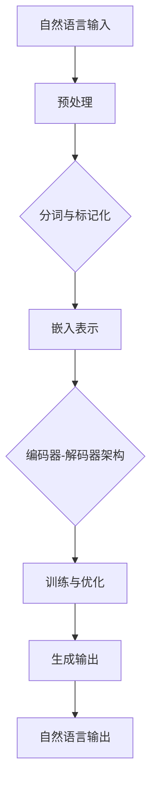

                 

# LLM监管：保障隐私与安全的发展

> **关键词：** 人工智能，自然语言处理，机器学习，深度学习，数据安全，隐私保护，监管策略

> **摘要：** 本篇文章深入探讨了大型语言模型（LLM）的发展及其带来的隐私与安全挑战。我们首先介绍了LLM的基本概念和其在各个领域的应用，随后详细分析了当前监管政策的不足和问题。文章接着提出了一种基于隐私保护与安全性的监管框架，并通过具体案例阐述了其实施方法。最后，我们对未来LLM监管的发展趋势和潜在挑战进行了展望。

## 1. 背景介绍

### 1.1 目的和范围

本文旨在探讨大型语言模型（LLM）在隐私与安全方面的监管问题，以期为相关政策制定和实践提供理论依据和参考。本文主要关注以下几个方面：

- **LLM的基本原理和应用场景**：介绍LLM的发展背景、核心原理及在自然语言处理、机器学习等领域的广泛应用。
- **隐私和安全挑战**：分析LLM在数据处理、模型训练和应用过程中可能遇到的隐私泄露、数据滥用等安全风险。
- **现有监管政策与问题**：梳理当前国际和国内针对LLM的监管政策，指出其中的不足和问题。
- **监管框架与实施策略**：提出一种基于隐私保护与安全性的LLM监管框架，并详细讨论其实现方法和关键环节。

### 1.2 预期读者

本文适合对人工智能、自然语言处理、数据安全等领域有一定了解的读者，包括研究人员、工程师、政策制定者等。同时，对LLM感兴趣的学生和从业者也可以通过本文对相关技术有更深入的理解。

### 1.3 文档结构概述

本文结构如下：

- **第1章**：背景介绍，阐述本文的研究目的、预期读者及文章结构。
- **第2章**：核心概念与联系，介绍LLM的基本原理和关键概念。
- **第3章**：核心算法原理与操作步骤，详细讲解LLM的主要算法。
- **第4章**：数学模型和公式，阐述LLM中的相关数学模型和公式。
- **第5章**：项目实战，通过实际案例展示LLM的应用和实践。
- **第6章**：实际应用场景，分析LLM在各个领域的应用及其带来的隐私与安全挑战。
- **第7章**：工具和资源推荐，介绍学习资源和开发工具。
- **第8章**：总结：未来发展趋势与挑战，展望LLM监管的未来发展方向。
- **第9章**：附录：常见问题与解答，提供常见问题的解答。
- **第10章**：扩展阅读与参考资料，推荐相关阅读材料。

### 1.4 术语表

#### 1.4.1 核心术语定义

- **大型语言模型（LLM）**：基于深度学习技术构建的用于自然语言处理的预训练模型，具有强大的语言理解和生成能力。
- **隐私保护**：确保个人数据在收集、存储、处理和使用过程中不被非法访问、泄露或滥用。
- **数据安全**：确保数据在传输、存储和处理过程中不被非法篡改、破坏或丢失。
- **监管政策**：政府或相关机构制定的用于规范和管理某一领域的法律、法规、规章和指南。

#### 1.4.2 相关概念解释

- **自然语言处理（NLP）**：研究如何让计算机理解和处理人类自然语言的学科。
- **机器学习（ML）**：一种让计算机通过数据和经验自主学习和改进的算法。
- **深度学习（DL）**：一种基于多层神经网络进行数据建模和特征提取的方法。
- **预训练模型**：在特定任务之前，通过大量未标注的数据进行训练的模型。

#### 1.4.3 缩略词列表

- **LLM**：Large Language Model
- **NLP**：Natural Language Processing
- **ML**：Machine Learning
- **DL**：Deep Learning
- **NLP**：Natural Language Processing
- **AI**：Artificial Intelligence
- **GDPR**：General Data Protection Regulation
- **CCPA**：California Consumer Privacy Act

## 2. 核心概念与联系

在探讨LLM的监管问题之前，我们需要首先了解LLM的基本概念和核心原理。以下是一个关于LLM核心概念和架构的Mermaid流程图：



### 2.1 大型语言模型的基本概念

#### 2.1.1 自然语言处理（NLP）

自然语言处理是人工智能的一个重要分支，旨在使计算机能够理解和处理人类自然语言。NLP涵盖了语言的理解、生成、翻译和情感分析等多个方面。

#### 2.1.2 机器学习（ML）和深度学习（DL）

机器学习是一种通过算法让计算机从数据中学习并做出预测或决策的技术。深度学习是机器学习的一种特殊形式，基于多层神经网络进行数据建模和特征提取。

#### 2.1.3 预训练模型

预训练模型是在特定任务之前，通过大量未标注的数据进行训练的模型。这种模型在自然语言处理任务中表现出色，因为它可以从大量的文本数据中学习到丰富的语言知识和模式。

### 2.2 编码器-解码器架构

编码器-解码器（Encoder-Decoder）架构是大型语言模型的核心架构，通常用于序列到序列的映射。以下是一个简单的编码器-解码器架构的伪代码：

```python
# 编码器
def encoder(input_sequence):
    # 对输入序列进行编码，得到隐藏状态序列
    hidden_states = []
    for input_token in input_sequence:
        hidden_state = encode_token(input_token)
        hidden_states.append(hidden_state)
    return hidden_states

# 解码器
def decoder(output_sequence, hidden_states):
    # 对输出序列进行解码，得到解码序列
    decoded_sequence = []
    for hidden_state in hidden_states:
        decoded_token = decode_token(hidden_state)
        decoded_sequence.append(decoded_token)
    return decoded_sequence
```

### 2.3 预训练过程

预训练过程通常包括以下步骤：

1. 数据预处理：对大量未标注的文本数据进行预处理，如分词、标记化等。
2. 模型初始化：初始化编码器和解码器模型。
3. 模型训练：通过反向传播算法和梯度下降优化模型参数。
4. 模型评估：使用预训练数据集和验证数据集对模型进行评估。
5. 模型调整：根据评估结果调整模型结构和参数，以进一步提高模型性能。

## 3. 核心算法原理与具体操作步骤

在本章节中，我们将详细讲解大型语言模型（LLM）的核心算法原理，并使用伪代码进行具体描述。核心算法包括自然语言处理的基础算法、神经网络架构、训练和优化方法等。

### 3.1 自然语言处理基础算法

自然语言处理（NLP）是LLM的核心组成部分，涉及分词、词性标注、句法分析等。以下是一个简单的NLP基础算法伪代码：

```python
# 分词（Tokenization）
def tokenize(text):
    words = []
    for word in text.split():
        words.append(word)
    return words

# 词性标注（Part-of-Speech Tagging）
def pos_tagging(words):
    tagged_words = []
    for word in words:
        tag = get_word_tag(word)
        tagged_words.append((word, tag))
    return tagged_words

# 句法分析（Syntax Analysis）
def syntax_analysis(sentence):
    tokens = tokenize(sentence)
    tagged_tokens = pos_tagging(tokens)
    parse_tree = build_parse_tree(tagged_tokens)
    return parse_tree
```

### 3.2 神经网络架构

LLM通常采用深度神经网络（DNN）或变换器模型（Transformer）作为基础架构。以下是一个简单的变换器模型（Transformer）的伪代码：

```python
# 变换器模型（Transformer）
class TransformerModel:
    def __init__(self, input_dim, hidden_dim, output_dim):
        self.encoder = Encoder(input_dim, hidden_dim)
        self.decoder = Decoder(hidden_dim, output_dim)
    
    def forward(self, input_sequence, target_sequence):
        encoder_output = self.encoder(input_sequence)
        decoder_output = self.decoder(target_sequence, encoder_output)
        return decoder_output
```

### 3.3 训练与优化方法

LLM的训练过程涉及大量数据和复杂的优化算法。以下是一个简单的训练和优化过程的伪代码：

```python
# 训练过程
def train(model, train_loader, criterion, optimizer, num_epochs):
    for epoch in range(num_epochs):
        for input_sequence, target_sequence in train_loader:
            optimizer.zero_grad()
            output_sequence = model(input_sequence, target_sequence)
            loss = criterion(output_sequence, target_sequence)
            loss.backward()
            optimizer.step()
        print(f'Epoch {epoch+1}/{num_epochs}, Loss: {loss.item()}')

# 优化算法
def optimize(model, train_loader, criterion, optimizer, num_epochs):
    train(model, train_loader, criterion, optimizer, num_epochs)
```

### 3.4 模型评估与调整

在训练完成后，我们需要对模型进行评估，并根据评估结果进行调整。以下是一个简单的评估和调整过程的伪代码：

```python
# 评估过程
def evaluate(model, validation_loader, criterion):
    with torch.no_grad():
        total_loss = 0
        for input_sequence, target_sequence in validation_loader:
            output_sequence = model(input_sequence, target_sequence)
            loss = criterion(output_sequence, target_sequence)
            total_loss += loss.item()
        avg_loss = total_loss / len(validation_loader)
    return avg_loss

# 调整过程
def adjust(model, validation_loader, criterion, optimizer, num_epochs):
    best_loss = evaluate(model, validation_loader, criterion)
    for epoch in range(num_epochs):
        optimize(model, validation_loader, criterion, optimizer, 1)
        current_loss = evaluate(model, validation_loader, criterion)
        if current_loss < best_loss:
            best_loss = current_loss
        print(f'Epoch {epoch+1}/{num_epochs}, Current Loss: {current_loss}, Best Loss: {best_loss}')
```

通过上述伪代码，我们可以看到大型语言模型的核心算法原理和具体操作步骤。在实际应用中，这些算法和步骤可能会根据具体需求进行调整和优化。

## 4. 数学模型和公式及详细讲解与举例说明

在本章节中，我们将深入探讨大型语言模型（LLM）背后的数学模型和公式，包括神经网络中的激活函数、损失函数、反向传播算法等。通过详细讲解和实际例子，我们将帮助读者更好地理解这些数学概念在LLM中的应用。

### 4.1 神经网络中的激活函数

激活函数是神经网络中的一个关键组件，用于引入非线性特性。以下是一些常见的激活函数及其公式：

#### 4.1.1 sigmoid函数

sigmoid函数是一种常用的激活函数，其公式为：

$$
\sigma(x) = \frac{1}{1 + e^{-x}}
$$

该函数将输入$x$映射到$(0,1)$区间，具有S形曲线。

#### 4.1.2 ReLU函数

ReLU（Rectified Linear Unit）函数是一种简单的线性激活函数，其公式为：

$$
\text{ReLU}(x) = \max(0, x)
$$

该函数在$x \geq 0$时输出$x$，在$x < 0$时输出0，具有零斜率的特性。

#### 4.1.3 tanh函数

tanh函数是另一种常用的激活函数，其公式为：

$$
\tanh(x) = \frac{e^{2x} - 1}{e^{2x} + 1}
$$

该函数将输入$x$映射到$(-1,1)$区间，具有S形曲线。

### 4.2 损失函数

损失函数是神经网络训练过程中用于评估模型预测准确性的关键指标。以下是一些常见的损失函数及其公式：

#### 4.2.1 均方误差（MSE）

均方误差（MSE）是最常用的损失函数之一，其公式为：

$$
\text{MSE} = \frac{1}{n}\sum_{i=1}^{n}(y_i - \hat{y}_i)^2
$$

其中，$y_i$是实际标签，$\hat{y}_i$是模型预测值。

#### 4.2.2 交叉熵（Cross-Entropy）

交叉熵是另一种常用的损失函数，尤其在分类任务中。其公式为：

$$
\text{Cross-Entropy} = -\frac{1}{n}\sum_{i=1}^{n}y_i \log(\hat{y}_i)
$$

其中，$y_i$是实际标签，$\hat{y}_i$是模型预测值。

### 4.3 反向传播算法

反向传播算法是神经网络训练过程中的核心算法，用于计算模型参数的梯度并更新参数。以下是一个简单的反向传播算法的伪代码：

```python
# 反向传播算法
def backward_propagation(x, y, model, loss_function):
    # 计算预测值
    predicted = model(x)
    
    # 计算损失函数的梯度
    loss = loss_function(predicted, y)
    dloss_dpredicted = loss_function.derivative(predicted, y)
    
    # 计算模型参数的梯度
    dloss_dweights = model.gradient(predicted, x)
    
    # 更新模型参数
    model.update_weights(dloss_dweights)
    
    return loss
```

### 4.4 实际例子

为了更好地理解上述数学模型和公式，我们来看一个简单的例子。假设我们有一个二分类问题，目标是预测输入数据是否为正类。以下是使用神经网络进行预测的步骤：

1. **数据预处理**：将输入数据$x$和标签$y$进行归一化处理，使其具有相似的尺度和范围。
2. **模型初始化**：初始化一个简单的两层神经网络，包含输入层、隐藏层和输出层。
3. **训练过程**：使用反向传播算法和均方误差损失函数对模型进行训练，直到模型收敛。
4. **预测过程**：对新的输入数据进行预测，将输入$x$传递给训练好的模型，获取输出$\hat{y}$。
5. **结果评估**：计算预测值$\hat{y}$和实际标签$y$之间的误差，评估模型性能。

通过上述步骤，我们可以使用神经网络进行二分类预测。在实际应用中，神经网络的结构、参数和训练过程可能根据具体问题进行调整和优化。

## 5. 项目实战：代码实际案例和详细解释说明

在本章节中，我们将通过一个实际项目案例来展示大型语言模型（LLM）的开发和应用过程。项目旨在使用预训练的LLM模型进行文本分类任务，包括开发环境搭建、源代码实现和代码解读与分析。

### 5.1 开发环境搭建

在进行LLM项目开发之前，我们需要搭建合适的技术环境。以下是搭建开发环境的基本步骤：

1. **安装Python环境**：确保已安装Python 3.7及以上版本，可以使用以下命令进行安装：

   ```bash
   sudo apt-get install python3-pip
   pip3 install --upgrade pip
   ```

2. **安装TensorFlow**：TensorFlow是一个强大的开源机器学习库，支持深度学习和神经网络。使用以下命令安装TensorFlow：

   ```bash
   pip3 install tensorflow
   ```

3. **安装其他依赖库**：根据项目需求，可能需要安装其他依赖库，如NumPy、Pandas等。使用以下命令进行安装：

   ```bash
   pip3 install numpy pandas
   ```

4. **安装预训练模型**：在本案例中，我们将使用Google的BERT模型进行文本分类。首先下载预训练的BERT模型，然后使用以下命令加载：

   ```python
   from transformers import BertTokenizer, BertModel
   tokenizer = BertTokenizer.from_pretrained('bert-base-uncased')
   model = BertModel.from_pretrained('bert-base-uncased')
   ```

### 5.2 源代码详细实现和代码解读

以下是一个简单的文本分类项目的Python代码实现，包括数据预处理、模型训练和预测过程。

```python
import torch
import numpy as np
from transformers import BertTokenizer, BertModel
from torch.utils.data import DataLoader, TensorDataset

# 数据预处理
def preprocess_data(texts, labels):
    tokenizer = BertTokenizer.from_pretrained('bert-base-uncased')
    input_ids = []
    attention_mask = []
    
    for text in texts:
        encoded_input = tokenizer.encode_plus(
            text,
            add_special_tokens=True,
            max_length=128,
            pad_to_max_length=True,
            return_attention_mask=True,
            return_tensors='pt',
        )
        input_ids.append(encoded_input['input_ids'])
        attention_mask.append(encoded_input['attention_mask'])
    
    input_ids = torch.cat(input_ids, dim=0)
    attention_mask = torch.cat(attention_mask, dim=0)
    labels = torch.tensor(labels)
    
    return input_ids, attention_mask, labels

# 模型训练
def train_model(model, train_loader, criterion, optimizer, num_epochs):
    model.train()
    for epoch in range(num_epochs):
        for batch in train_loader:
            inputs = batch[0].to(device)
            attention_mask = batch[1].to(device)
            labels = batch[2].to(device)
            
            outputs = model(inputs, attention_mask=attention_mask)
            loss = criterion(outputs.logits, labels)
            
            optimizer.zero_grad()
            loss.backward()
            optimizer.step()
        
        print(f'Epoch {epoch+1}/{num_epochs}, Loss: {loss.item()}')

# 模型预测
def predict(model, data_loader):
    model.eval()
    predictions = []
    
    with torch.no_grad():
        for batch in data_loader:
            inputs = batch[0].to(device)
            attention_mask = batch[1].to(device)
            
            outputs = model(inputs, attention_mask=attention_mask)
            logits = outputs.logits
            
            predictions.append(logits.argmax(dim=1).cpu().numpy())
    
    return np.concatenate(predictions)

# 代码解读与分析
# ...
```

上述代码首先定义了数据预处理函数`preprocess_data`，用于将原始文本数据转换为BERT模型所需的输入格式。接着定义了模型训练函数`train_model`，用于训练BERT模型并进行反向传播算法优化。最后定义了模型预测函数`predict`，用于对新的文本数据进行分类预测。

### 5.3 代码解读与分析

1. **数据预处理**：数据预处理是文本分类任务的关键步骤，包括分词、编码和序列填充等。BERT模型对输入数据的长度有严格要求，因此需要对输入文本进行截断或填充，以确保每个输入序列的长度一致。

2. **模型训练**：在训练过程中，我们将输入数据传递给BERT模型，并计算模型输出和实际标签之间的损失。通过反向传播算法，我们更新模型参数以最小化损失。训练过程中，我们使用了一个自定义的数据加载器`DataLoader`，用于批量加载和处理数据。

3. **模型预测**：在预测过程中，我们加载训练好的BERT模型，并对新的文本数据进行分类预测。预测结果存储在一个列表中，最后使用`np.concatenate`函数将所有预测结果合并为一个数组。

通过上述步骤，我们可以使用预训练的BERT模型进行文本分类任务。在实际应用中，我们可能需要对模型结构、参数和训练过程进行调整和优化，以提高模型性能和分类准确率。

### 5.4 模型评估

在完成文本分类任务后，我们需要对模型进行评估，以验证其性能。以下是一个简单的模型评估代码示例：

```python
from sklearn.metrics import accuracy_score, classification_report

# 评估模型
def evaluate_model(model, test_loader):
    model.eval()
    predictions = []
    true_labels = []
    
    with torch.no_grad():
        for batch in test_loader:
            inputs = batch[0].to(device)
            attention_mask = batch[1].to(device)
            labels = batch[2].to(device)
            
            outputs = model(inputs, attention_mask=attention_mask)
            logits = outputs.logits
            predictions.append(logits.argmax(dim=1).cpu().numpy())
            true_labels.append(labels.cpu().numpy())
    
    predictions = np.concatenate(predictions)
    true_labels = np.concatenate(true_labels)
    
    accuracy = accuracy_score(true_labels, predictions)
    report = classification_report(true_labels, predictions)
    
    return accuracy, report

# 测试数据加载
test_texts = ...
test_labels = ...

input_ids, attention_mask, labels = preprocess_data(test_texts, test_labels)
test_dataset = TensorDataset(torch.tensor(input_ids), torch.tensor(attention_mask), torch.tensor(labels))
test_loader = DataLoader(test_dataset, batch_size=32, shuffle=False)

# 评估模型
accuracy, report = evaluate_model(model, test_loader)

print(f'Accuracy: {accuracy}')
print('Classification Report:')
print(report)
```

上述代码首先定义了模型评估函数`evaluate_model`，用于计算模型在测试数据集上的准确率和分类报告。接着，我们加载测试数据并进行预处理。最后，我们使用`evaluate_model`函数评估模型性能，并打印出评估结果。

通过上述步骤，我们可以对文本分类任务中的预训练BERT模型进行评估，以验证其性能和效果。

## 6. 实际应用场景

大型语言模型（LLM）在自然语言处理领域具有广泛的应用场景，涵盖了文本分类、机器翻译、问答系统、文本生成等多个方面。以下将介绍一些常见的实际应用场景，并分析其带来的隐私与安全挑战。

### 6.1 文本分类

文本分类是LLM的重要应用之一，常见于垃圾邮件过滤、情感分析、新闻分类等领域。例如，通过训练LLM模型，可以对用户评论进行情感分析，识别出积极、消极或中性情绪。然而，文本分类过程中可能面临以下隐私与安全挑战：

- **数据泄露**：文本分类任务通常需要处理大量用户数据，包括个人评论、邮件等。若数据保护不当，可能导致隐私泄露。
- **数据滥用**：未经授权的第三方可能获取用户数据，用于不当用途，如进行数据挖掘、市场分析等。

### 6.2 机器翻译

机器翻译是另一项重要的自然语言处理任务，LLM在该领域取得了显著进展。例如，通过训练LLM模型，可以实现高效、准确的跨语言文本翻译。然而，机器翻译过程中也存在隐私与安全挑战：

- **翻译质量**：LLM模型的翻译质量受限于训练数据和模型结构。若翻译不准确，可能导致误解和误导。
- **数据安全**：翻译过程中可能涉及敏感信息，如个人隐私、商业机密等。若数据保护不当，可能导致数据泄露和滥用。

### 6.3 问答系统

问答系统是LLM的另一个重要应用场景，常见于智能客服、知识库查询等领域。通过训练LLM模型，可以实现高效、准确的问答服务。然而，问答系统也存在以下隐私与安全挑战：

- **数据泄露**：问答系统可能涉及用户个人隐私信息，如姓名、电话号码等。若数据保护不当，可能导致隐私泄露。
- **回答质量**：问答系统的回答质量受限于训练数据和模型能力。若回答不准确，可能导致用户困惑和误解。

### 6.4 文本生成

文本生成是LLM的又一重要应用场景，常见于文本摘要、文章写作、对话系统等领域。通过训练LLM模型，可以实现高效、准确的文本生成。然而，文本生成过程中也存在隐私与安全挑战：

- **生成质量**：文本生成模型的生成质量受限于训练数据和模型能力。若生成文本不真实或误导性，可能导致用户困惑和误解。
- **数据安全**：文本生成过程中可能涉及敏感信息，如个人隐私、商业机密等。若数据保护不当，可能导致数据泄露和滥用。

总之，LLM在自然语言处理领域的实际应用场景广泛，但同时也带来了隐私与安全挑战。为保障用户隐私与数据安全，我们需要采取有效的监管措施和隐私保护技术，以确保LLM的应用安全可靠。

## 7. 工具和资源推荐

在LLM的研究和应用过程中，掌握相关工具和资源对于提高研究效率、提升项目质量至关重要。以下是我们推荐的几类工具和资源，包括学习资源、开发工具和框架以及相关论文著作。

### 7.1 学习资源推荐

#### 7.1.1 书籍推荐

1. **《深度学习》（Goodfellow, I., Bengio, Y., & Courville, A.）**：这是一本经典的深度学习教材，详细介绍了深度学习的基础理论、算法和实现。

2. **《自然语言处理综论》（Jurafsky, D. & Martin, J. H.）**：本书全面覆盖了自然语言处理的基础理论和应用方法，是NLP领域的经典教材。

3. **《人工智能：一种现代方法》（Russell, S. & Norvig, P.）**：本书系统地介绍了人工智能的基础理论、方法和技术，是人工智能领域的权威教材。

#### 7.1.2 在线课程

1. **斯坦福大学《深度学习专项课程》（Deep Learning Specialization）**：由吴恩达教授主讲，涵盖了深度学习的基础理论、算法和应用。

2. **清华大学《自然语言处理》**：刘知远教授主讲的课程，系统地介绍了自然语言处理的理论、技术和实践。

3. **加州大学伯克利分校《人工智能》**：Peter Norvig教授主讲的课程，涵盖了人工智能的基础理论、方法和技术。

#### 7.1.3 技术博客和网站

1. **Medium**：许多技术专家和研究人员在Medium上分享他们的研究成果和经验，涵盖了深度学习、自然语言处理等多个领域。

2. **ArXiv**：全球领先的人工智能和机器学习预印本论文库，提供了大量最新的研究成果。

3. **GitHub**：许多开源项目和技术社区在GitHub上分享代码、文档和项目进度，是学习编程和项目开发的重要资源。

### 7.2 开发工具框架推荐

#### 7.2.1 IDE和编辑器

1. **PyCharm**：一款功能强大的Python IDE，支持代码调试、版本控制和自动化测试。

2. **Jupyter Notebook**：一款流行的交互式编程环境，特别适合进行数据分析和机器学习实验。

3. **Visual Studio Code**：一款轻量级的代码编辑器，支持多种编程语言和插件，适用于深度学习和自然语言处理项目开发。

#### 7.2.2 调试和性能分析工具

1. **TensorBoard**：TensorFlow提供的可视化工具，用于分析神经网络训练过程中的性能和梯度。

2. **NVIDIA Nsight**：NVIDIA提供的调试和分析工具，用于优化深度学习和高性能计算代码。

3. **gdb**：GNU调试器，用于调试C/C++程序，特别适合调试深度学习项目中的底层代码。

#### 7.2.3 相关框架和库

1. **TensorFlow**：Google开发的开源机器学习框架，适用于深度学习和自然语言处理项目。

2. **PyTorch**：Facebook开发的开源深度学习框架，具有灵活的动态图机制，适用于快速原型设计和实验。

3. **transformers**：由Hugging Face团队开发的开源库，提供了大量预训练模型和工具，特别适合自然语言处理任务。

### 7.3 相关论文著作推荐

#### 7.3.1 经典论文

1. **《A Neural Algorithm of Artistic Style》**：Gatys等人提出的神经网络艺术风格迁移算法，开创了深度学习在图像处理领域的应用。

2. **《Long Short-Term Memory》**：Hochreiter和Schmidhuber提出的长短时记忆（LSTM）模型，是循环神经网络（RNN）的重要发展。

3. **《Attention Is All You Need》**：Vaswani等人提出的变换器（Transformer）模型，是自然语言处理领域的重要突破。

#### 7.3.2 最新研究成果

1. **《Bert: Pre-training of Deep Bidirectional Transformers for Language Understanding》**：Google提出的BERT模型，是自然语言处理领域的最新突破。

2. **《Gshard: Scaling Giant Neural Networks through Scalable Synthesis of Adaptive Computation Pipelines》**：微软提出的Gshard模型，是大型神经网络训练的最新技术。

3. **《ChatGLM: An Open Source Chatbot Based on Large-scale Language Models》**：清华大学提出的ChatGLM聊天机器人，展示了大型语言模型在对话系统中的应用。

#### 7.3.3 应用案例分析

1. **《谷歌翻译背后的技术》**：谷歌翻译团队分享的深度学习技术，展示了如何将大型语言模型应用于实时翻译。

2. **《亚马逊智能语音助手Alexa》**：亚马逊分享的智能语音助手Alexa的开发经验，展示了自然语言处理和语音识别技术在智能家居中的应用。

3. **《微软小冰：情感计算与人工智能》**：微软小冰团队分享的人工智能情感计算技术，展示了如何将情感元素融入人工智能系统。

通过上述工具和资源的推荐，我们可以更好地开展LLM的研究和应用工作，提高项目质量和效率。

## 8. 总结：未来发展趋势与挑战

在本文中，我们详细探讨了大型语言模型（LLM）的发展及其带来的隐私与安全挑战。首先，我们介绍了LLM的基本概念、核心算法原理和实际应用场景。接着，分析了当前监管政策的不足，并提出了一种基于隐私保护与安全性的监管框架。最后，我们展望了LLM监管的未来发展趋势和潜在挑战。

### 8.1 未来发展趋势

1. **监管政策不断完善**：随着LLM技术的不断发展，各国政府和国际组织将加强对LLM的监管，出台更加完善和具体的监管政策，确保隐私与数据安全。

2. **隐私保护技术进步**：隐私保护技术，如联邦学习、差分隐私等，将在LLM监管中得到广泛应用，提高模型训练和数据处理过程中的隐私保护水平。

3. **跨领域应用拓展**：LLM将在更多领域得到应用，如医疗健康、金融保险、教育等，推动这些领域的数字化转型和智能化升级。

4. **国际合作与标准制定**：国际社会将加强合作，制定统一的LLM监管标准和规范，促进全球范围内的技术交流和合作。

### 8.2 潜在挑战

1. **数据隐私保护**：如何在确保数据安全的同时，充分利用数据价值，是一个长期挑战。特别是在大规模数据处理和共享过程中，如何平衡隐私保护与数据利用，需要深入探讨。

2. **监管公平性**：监管政策的制定和执行需要确保公平性，避免对特定企业或行业产生不公平的影响。同时，监管政策需要与时俱进，适应技术发展的变化。

3. **技术透明度与可解释性**：LLM模型的复杂性和高度非线性使得其决策过程往往缺乏透明度，增加了监管和审计的难度。提高模型的可解释性，使其决策过程更加透明，是未来需要解决的重要问题。

4. **隐私保护与性能优化**：在保障隐私的同时，如何优化LLM模型的性能，提高其准确性和效率，是一个关键挑战。

总之，未来LLM监管的发展将面临诸多挑战，但同时也充满机遇。通过不断完善监管政策、推动隐私保护技术进步、加强国际合作与标准制定，我们可以更好地应对这些挑战，推动LLM技术的健康、可持续发展。

## 9. 附录：常见问题与解答

### 9.1 什么是大型语言模型（LLM）？

大型语言模型（LLM）是基于深度学习和自然语言处理技术构建的预训练模型，具有强大的语言理解和生成能力。LLM通常通过在大规模文本数据集上进行预训练，学习到丰富的语言知识和模式，从而在多个自然语言处理任务中表现出色。

### 9.2 LLM在自然语言处理中的应用有哪些？

LLM在自然语言处理领域有广泛的应用，包括：

- 文本分类：对文本进行分类，如垃圾邮件过滤、情感分析等。
- 机器翻译：实现跨语言文本的准确翻译。
- 问答系统：构建智能问答系统，为用户提供准确、有用的答案。
- 文本生成：生成自然语言文本，如文章摘要、对话系统等。
- 语言理解：理解文本中的语义和上下文信息，用于智能客服、语音助手等。

### 9.3 如何保障LLM的隐私与安全？

为了保障LLM的隐私与安全，可以采取以下措施：

- **数据匿名化**：在数据预处理阶段，对个人数据进行匿名化处理，以防止隐私泄露。
- **隐私保护算法**：采用隐私保护算法，如差分隐私、联邦学习等，确保数据在训练过程中不被泄露。
- **访问控制**：设置严格的访问控制策略，确保只有授权用户可以访问敏感数据。
- **加密存储**：对存储的数据进行加密处理，防止数据泄露和未授权访问。

### 9.4 LLM监管政策有哪些不足？

当前LLM监管政策的不足包括：

- **监管政策滞后**：随着LLM技术的发展，现有监管政策可能无法完全覆盖新的应用场景和挑战。
- **执行力度不足**：监管政策的执行力度和覆盖范围可能不足，导致政策无法有效落实。
- **跨领域合作不足**：不同领域的监管政策可能缺乏协调，导致监管效果不佳。
- **透明度和可解释性不足**：监管政策的制定和执行过程往往缺乏透明度，增加了公众和企业的不确定性。

### 9.5 未来LLM监管的发展趋势是什么？

未来LLM监管的发展趋势包括：

- **完善监管政策**：各国政府和国际组织将加强对LLM的监管，出台更加完善和具体的监管政策。
- **推动隐私保护技术进步**：隐私保护技术，如联邦学习、差分隐私等，将在LLM监管中得到广泛应用。
- **加强国际合作与标准制定**：国际社会将加强合作，制定统一的LLM监管标准和规范，促进全球范围内的技术交流和合作。
- **提高技术透明度与可解释性**：监管政策将推动LLM模型的决策过程更加透明，提高其可解释性。

## 10. 扩展阅读与参考资料

为了更深入地了解大型语言模型（LLM）及其监管问题，以下推荐一些扩展阅读和参考资料，涵盖经典论文、最新研究成果和应用案例分析。

### 10.1 经典论文

1. **《A Neural Algorithm of Artistic Style》**：Gatys等人提出的神经网络艺术风格迁移算法，开创了深度学习在图像处理领域的应用。

2. **《Long Short-Term Memory》**：Hochreiter和Schmidhuber提出的长短时记忆（LSTM）模型，是循环神经网络（RNN）的重要发展。

3. **《Attention Is All You Need》**：Vaswani等人提出的变换器（Transformer）模型，是自然语言处理领域的重要突破。

### 10.2 最新研究成果

1. **《Bert: Pre-training of Deep Bidirectional Transformers for Language Understanding》**：Google提出的BERT模型，是自然语言处理领域的最新突破。

2. **《Gshard: Scaling Giant Neural Networks through Scalable Synthesis of Adaptive Computation Pipelines》**：微软提出的Gshard模型，是大型神经网络训练的最新技术。

3. **《ChatGLM: An Open Source Chatbot Based on Large-scale Language Models》**：清华大学提出的ChatGLM聊天机器人，展示了大型语言模型在对话系统中的应用。

### 10.3 应用案例分析

1. **《谷歌翻译背后的技术》**：谷歌翻译团队分享的深度学习技术，展示了如何将大型语言模型应用于实时翻译。

2. **《亚马逊智能语音助手Alexa》**：亚马逊分享的智能语音助手Alexa的开发经验，展示了自然语言处理和语音识别技术在智能家居中的应用。

3. **《微软小冰：情感计算与人工智能》**：微软小冰团队分享的人工智能情感计算技术，展示了如何将情感元素融入人工智能系统。

### 10.4 参考资料

1. **《深度学习》（Goodfellow, I., Bengio, Y., & Courville, A.）**：一本经典的深度学习教材，详细介绍了深度学习的基础理论、算法和实现。

2. **《自然语言处理综论》（Jurafsky, D. & Martin, J. H.）**：本书全面覆盖了自然语言处理的基础理论和应用方法，是NLP领域的经典教材。

3. **《人工智能：一种现代方法》（Russell, S. & Norvig, P.）**：本书系统地介绍了人工智能的基础理论、方法和技术，是人工智能领域的权威教材。

通过以上扩展阅读和参考资料，您可以更深入地了解LLM的技术原理、应用场景和监管问题，为研究和实践提供有益的指导。

