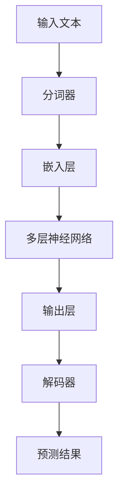
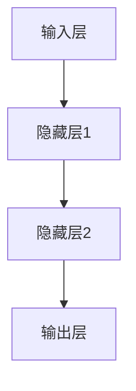

                 

# LLM 遗产：定义未来的计算

> 关键词：大型语言模型（LLM），计算能力，人工智能，数据处理，模型优化，未来趋势

> 摘要：本文将深入探讨大型语言模型（LLM）的起源、核心概念及其对未来计算能力的影响。我们将通过逐步分析其架构、算法原理和实际应用，揭示LLM在数据驱动时代的重要性。本文旨在为读者提供一份全面、系统的指南，帮助理解LLM如何改变我们的计算世界，并展望其未来发展趋势。

## 1. 背景介绍

### 1.1 目的和范围

本文旨在探讨大型语言模型（LLM）的遗产，解释其如何定义了未来的计算能力。我们将重点关注LLM的核心概念、架构和算法，同时探讨其在人工智能、自然语言处理和数据科学领域的广泛应用。本文还将分析LLM对现有技术和未来发展的潜在影响，为读者提供对未来计算能力的深入见解。

### 1.2 预期读者

本文适合对人工智能、机器学习和自然语言处理有一定了解的读者。无论您是研究人员、开发者、学生还是对技术感兴趣的专业人士，本文都将帮助您深入了解LLM的核心概念和实际应用，从而更好地理解这一领域的发展趋势。

### 1.3 文档结构概述

本文分为十个部分：

1. **背景介绍**：介绍本文的目的和范围，预期读者以及文档结构概述。
2. **核心概念与联系**：阐述LLM的核心概念及其与其他计算技术的联系。
3. **核心算法原理 & 具体操作步骤**：详细讲解LLM的算法原理和操作步骤。
4. **数学模型和公式 & 详细讲解 & 举例说明**：介绍LLM的数学模型和公式，并给出实际应用示例。
5. **项目实战：代码实际案例和详细解释说明**：通过实际项目案例，展示LLM的应用。
6. **实际应用场景**：探讨LLM在不同领域的实际应用。
7. **工具和资源推荐**：推荐学习资源和开发工具。
8. **总结：未来发展趋势与挑战**：总结LLM的未来发展趋势和面临的挑战。
9. **附录：常见问题与解答**：提供常见问题的解答。
10. **扩展阅读 & 参考资料**：推荐相关扩展阅读材料。

### 1.4 术语表

#### 1.4.1 核心术语定义

- **大型语言模型（LLM）**：一种基于神经网络的语言模型，具有强大的语言理解和生成能力。
- **自然语言处理（NLP）**：涉及文本数据的理解、分析和生成的人工智能技术。
- **深度学习**：一种基于神经网络的学习方法，通过多层次的神经网络对数据进行特征提取和模式识别。
- **计算能力**：计算机系统在处理数据时的能力，通常以处理速度、存储容量和并行处理能力来衡量。

#### 1.4.2 相关概念解释

- **神经网络**：一种由大量简单计算单元（神经元）组成的计算模型，通过学习和模拟生物神经系统的运作来处理数据。
- **训练数据集**：用于训练模型的输入数据集，通常包含大量标记好的文本数据。
- **损失函数**：用于衡量模型预测值与真实值之间差距的函数，用于指导模型优化。
- **反向传播**：一种用于更新神经网络权重和偏置的算法，通过反向传播误差信号来优化模型。

#### 1.4.3 缩略词列表

- **NLP**：自然语言处理
- **DL**：深度学习
- **LLM**：大型语言模型
- **GPU**：图形处理单元
- **TPU**：张量处理单元

## 2. 核心概念与联系

在本节中，我们将探讨大型语言模型（LLM）的核心概念及其与相关计算技术的联系。为了更好地理解LLM的工作原理和作用，我们将使用Mermaid流程图来展示LLM的架构和关键组成部分。

### 2.1 LLM架构



**Mermaid流程图解释**：

1. **输入文本（A）**：LLM首先接收输入文本，这可以是自然语言文本或标记化后的数据。
2. **分词器（B）**：输入文本被分词器处理，将文本分解为单词、字符或子词。
3. **嵌入层（C）**：分词器输出的单词或字符被嵌入到高维向量空间中，形成嵌入向量。
4. **多层神经网络（D）**：嵌入向量通过多层神经网络进行前向传播，神经网络通过学习输入数据中的特征来优化其内部参数。
5. **输出层（E）**：神经网络的输出层生成预测结果，这些结果可以是词汇、标签或概率分布。
6. **解码器（F）**：输出层的结果通过解码器进行处理，解码器将预测结果转换回自然语言形式。
7. **预测结果（G）**：最终的预测结果被输出，用于任务如文本生成、问答系统或情感分析。

### 2.2 LLM与相关技术的联系

**神经网络（Neural Networks）**：

神经网络是LLM的核心组成部分，它们通过模拟生物神经系统的运作来处理数据。神经网络由大量简单的计算单元（神经元）组成，每个神经元都与其他神经元连接。通过学习输入数据中的特征，神经网络可以预测输出。

**深度学习（Deep Learning）**：

深度学习是一种基于神经网络的学习方法，通过多层次的神经网络对数据进行特征提取和模式识别。深度学习在图像识别、语音识别和自然语言处理等领域取得了显著进展。

**自然语言处理（Natural Language Processing）**：

自然语言处理是人工智能的一个分支，涉及文本数据的理解、分析和生成。NLP技术包括语言模型、文本分类、情感分析和机器翻译等。

**计算能力（Computational Power）**：

计算能力是计算机系统在处理数据时的能力，通常以处理速度、存储容量和并行处理能力来衡量。大型语言模型通常需要大量的计算资源，特别是在训练阶段。

### 2.3 Mermaid流程图示例

以下是一个示例Mermaid流程图，展示了一个简单的神经网络架构：



**Mermaid流程图解释**：

1. **输入层（A）**：输入数据被传递到输入层，每个输入数据都对应一个神经元。
2. **隐藏层1（B）**：输入层的数据通过权重和偏置传递到隐藏层1，隐藏层1中的神经元对输入数据进行初步处理。
3. **隐藏层2（C）**：隐藏层1的输出通过权重和偏置传递到隐藏层2，隐藏层2对输入数据进行更复杂的处理。
4. **输出层（D）**：隐藏层2的输出通过权重和偏置传递到输出层，输出层生成最终的预测结果。

通过以上示例，我们可以看到神经网络和大型语言模型之间的紧密联系。神经网络是LLM的核心组成部分，而大型语言模型则通过扩展神经网络的能力来处理复杂的自然语言任务。

在下一节中，我们将深入探讨LLM的核心算法原理和具体操作步骤。

## 3. 核心算法原理 & 具体操作步骤

在本节中，我们将详细讲解大型语言模型（LLM）的核心算法原理和具体操作步骤。LLM主要基于深度学习和神经网络技术，通过学习大量的文本数据来理解和生成自然语言。以下是LLM的核心算法原理和操作步骤的详细说明。

### 3.1 算法原理

LLM的核心算法原理可以概括为以下几个步骤：

1. **文本预处理**：在训练LLM之前，需要对输入文本进行预处理。预处理步骤包括分词、去停用词、词干提取和词向量化等。这些步骤有助于简化文本数据，使其更适合进行深度学习模型训练。

2. **词向量化**：预处理后的文本数据被转换为高维向量表示，即词向量。词向量可以捕捉文本数据中的语义信息，从而使得神经网络能够更好地学习文本数据中的特征。

3. **多层神经网络架构**：LLM通常采用多层神经网络架构，包括输入层、隐藏层和输出层。输入层接收词向量，隐藏层通过逐层传播的方式对词向量进行处理，输出层生成预测结果。

4. **前向传播与反向传播**：在训练过程中，神经网络通过前向传播将输入数据传递到输出层，然后计算损失函数来衡量预测结果与真实值之间的差距。接着，通过反向传播算法更新神经网络的权重和偏置，以最小化损失函数。

5. **模型评估与优化**：在训练完成后，需要评估模型的性能，并通过调整超参数和模型结构来优化模型。常见的评估指标包括准确率、召回率和F1分数等。

### 3.2 具体操作步骤

以下是LLM的核心算法原理和具体操作步骤的伪代码表示：

```python
# 文本预处理
def preprocess_text(text):
    # 分词、去停用词、词干提取等操作
    return processed_text

# 词向量化
def vectorize_text(processed_text, vocab_size, embedding_dim):
    # 将预处理后的文本转换为词向量
    return text_embeddings

# 神经网络前向传播
def forward_pass(text_embeddings, model):
    # 将词向量传递到神经网络，计算输出
    return predictions

# 神经网络反向传播
def backward_pass(predictions, labels, model):
    # 计算损失函数，更新模型参数
    return updated_model

# 模型评估
def evaluate_model(model, test_data):
    # 计算准确率、召回率、F1分数等评估指标
    return evaluation_results

# 模型训练
def train_model(train_data, vocab_size, embedding_dim, num_epochs):
    for epoch in range(num_epochs):
        # 预处理文本数据
        processed_text = preprocess_text(train_data)
        # 词向量化
        text_embeddings = vectorize_text(processed_text, vocab_size, embedding_dim)
        # 前向传播
        predictions = forward_pass(text_embeddings, model)
        # 反向传播
        updated_model = backward_pass(predictions, labels, model)
        # 模型评估
        evaluation_results = evaluate_model(updated_model, test_data)
        # 输出训练过程中的评估指标
        print(f"Epoch {epoch+1}: {evaluation_results}")
    return updated_model
```

### 3.3 伪代码解释

1. **预处理文本（preprocess_text）**：该函数对输入文本进行分词、去停用词、词干提取等预处理操作，以便将文本数据转换为神经网络可以接受的格式。

2. **词向量化（vectorize_text）**：该函数将预处理后的文本数据转换为词向量，通常使用预训练的词向量模型（如Word2Vec、GloVe等）或自行训练的词向量模型。

3. **前向传播（forward_pass）**：该函数将词向量传递到神经网络，通过多层神经网络进行前向传播，最终生成预测结果。

4. **反向传播（backward_pass）**：该函数计算损失函数，并通过反向传播算法更新神经网络的权重和偏置，以最小化损失函数。

5. **模型评估（evaluate_model）**：该函数评估模型的性能，通常使用准确率、召回率、F1分数等评估指标。

6. **模型训练（train_model）**：该函数使用训练数据集对神经网络进行训练，包括预处理文本数据、词向量化、前向传播、反向传播和模型评估等步骤。

通过以上步骤，我们可以训练出一个性能良好的LLM模型，用于处理各种自然语言任务，如文本生成、问答系统、机器翻译等。

在下一节中，我们将进一步探讨LLM的数学模型和公式，并给出详细的讲解和实际应用示例。

## 4. 数学模型和公式 & 详细讲解 & 举例说明

### 4.1 数学模型

大型语言模型（LLM）的数学模型主要基于深度学习，特别是基于变分自编码器（VAE）和生成对抗网络（GAN）等生成模型。以下是一个简化的数学模型，用于描述LLM的工作原理。

#### 4.1.1 变分自编码器（VAE）

变分自编码器是一种生成模型，它由编码器和解码器两部分组成。编码器将输入数据映射到一个潜在空间中的低维表示，解码器则从潜在空间中生成输出数据。

1. **编码器（Encoder）**：

\[ 
\text{编码器}: \text{z} = \text{Encoder}(\text{x}) 
\]

其中，\( \text{x} \) 是输入数据，\( \text{z} \) 是潜在空间中的低维表示。

2. **解码器（Decoder）**：

\[ 
\text{x'} = \text{Decoder}(\text{z}) 
\]

其中，\( \text{x'} \) 是解码器生成的输出数据。

3. **潜在空间分布**：

\[ 
\text{p}(\text{z}|\text{x}) = \text{Normal}(\mu(\text{x}), \sigma^2(\text{x})) 
\]

其中，\( \text{Normal} \) 表示正态分布，\( \mu(\text{x}) \) 和 \( \sigma^2(\text{x}) \) 分别表示潜在空间中的均值和方差。

4. **重参数化技巧**：

\[ 
\text{z} = \text{z}(\text{x}, \epsilon) = \mu(\text{x}) + \sigma(\text{x})\epsilon 
\]

其中，\( \epsilon \) 是从标准正态分布中抽取的随机噪声。

#### 4.1.2 生成对抗网络（GAN）

生成对抗网络由生成器和判别器两部分组成。生成器尝试生成与真实数据相似的数据，而判别器则判断生成器生成的数据是否真实。

1. **生成器（Generator）**：

\[ 
\text{x'} = \text{Generator}(\text{z}) 
\]

2. **判别器（Discriminator）**：

\[ 
\text{D}(\text{x}) = \text{概率}(\text{x}|\text{真实}) \]
\[ 
\text{D}(\text{x'}) = \text{概率}(\text{x'}|\text{真实}) 
\]

3. **损失函数**：

\[ 
\text{L_D} = -\text{E}[\text{D}(\text{x})] - \text{E}[\text{D}(\text{x'})] 
\]
\[ 
\text{L_G} = -\text{E}[\text{D}(\text{x'})] 
\]

其中，\( \text{L_D} \) 和 \( \text{L_G} \) 分别是判别器和生成器的损失函数。

### 4.2 详细讲解

#### 4.2.1 变分自编码器（VAE）

变分自编码器（VAE）通过以下步骤进行训练：

1. **编码器训练**：训练编码器以将输入数据映射到潜在空间中的低维表示。在训练过程中，使用重参数化技巧将潜在空间中的分布转换为具体的数据点。
2. **解码器训练**：训练解码器以从潜在空间中生成与输入数据相似的数据。在训练过程中，使用编码器生成的低维表示作为解码器的输入。
3. **损失函数优化**：使用重参数化技巧和潜在空间分布的损失函数来优化编码器和解码器的参数。

#### 4.2.2 生成对抗网络（GAN）

生成对抗网络（GAN）通过以下步骤进行训练：

1. **生成器训练**：训练生成器以生成与真实数据相似的数据。在训练过程中，生成器的目标是最大化判别器判断生成数据为真实数据的概率。
2. **判别器训练**：训练判别器以区分真实数据和生成数据。在训练过程中，判别器的目标是最大化其判断真实数据和生成数据的能力。
3. **损失函数优化**：使用生成器和判别器的损失函数来优化生成器和解判别器的参数。

### 4.3 举例说明

假设我们有一个包含1000个单词的文本数据集，我们想要使用VAE来生成新的文本数据。以下是一个简化的例子：

#### 4.3.1 变分自编码器（VAE）训练过程

1. **编码器训练**：
   - 输入数据：一个1000个单词的文本序列。
   - 编码器参数：\(\mu(\text{x})\) 和 \(\sigma^2(\text{x})\)。
   - 训练步骤：
     - 使用重参数化技巧从潜在空间中抽取样本。
     - 将潜在空间中的样本传递到解码器，生成文本序列。
     - 计算损失函数，并使用梯度下降算法优化编码器参数。

2. **解码器训练**：
   - 解码器参数：从潜在空间中生成的样本到文本序列的映射。
   - 训练步骤：
     - 将编码器生成的潜在空间中的样本传递到解码器。
     - 计算解码器生成的文本序列与原始文本序列之间的损失函数。
     - 使用梯度下降算法优化解码器参数。

#### 4.3.2 生成新的文本数据

1. **生成新的文本数据**：
   - 从潜在空间中抽取一个随机样本。
   - 将该样本传递到解码器，生成新的文本序列。

例如，我们可能生成一个新句子：“今天天气非常好，阳光明媚，非常适合户外活动。”

通过这个例子，我们可以看到VAE如何从一个简化的文本数据集中生成新的文本数据。这个过程可以应用于更复杂的文本数据集，生成更具创造性和多样性的文本。

在下一节中，我们将通过一个实际项目案例，展示如何使用LLM进行文本生成，并详细解释其代码实现和操作步骤。

## 5. 项目实战：代码实际案例和详细解释说明

在本节中，我们将通过一个实际项目案例，展示如何使用大型语言模型（LLM）进行文本生成。我们将详细解释项目的代码实现，包括开发环境搭建、源代码实现和代码解读与分析。通过这个实际案例，我们将深入了解LLM在文本生成任务中的应用。

### 5.1 开发环境搭建

在开始项目之前，我们需要搭建一个合适的开发环境。以下是所需的软件和工具：

- **Python（3.8及以上版本）**
- **TensorFlow（2.4及以上版本）**
- **NVIDIA CUDA（10.2及以上版本）**（如果使用GPU进行训练）
- **文本数据集**（例如，维基百科、新闻文章等）

#### 安装步骤：

1. **安装Python**：从 [Python官方网站](https://www.python.org/downloads/) 下载并安装Python。
2. **安装TensorFlow**：在命令行中运行以下命令：
   ```bash
   pip install tensorflow==2.4
   ```
3. **安装NVIDIA CUDA**：从 [NVIDIA官方网站](https://developer.nvidia.com/cuda-downloads) 下载并安装NVIDIA CUDA。
4. **配置GPU支持**：确保TensorFlow可以识别并使用GPU。在命令行中运行以下命令：
   ```bash
   python -m tensorflow.python.client.initialize
   ```
   如果出现CUDA相关的输出，说明GPU支持已成功配置。

### 5.2 源代码详细实现和代码解读

#### 5.2.1 代码实现

以下是文本生成项目的源代码实现。代码分为三个部分：数据预处理、模型训练和文本生成。

```python
import tensorflow as tf
from tensorflow.keras.preprocessing.sequence import pad_sequences
from tensorflow.keras.layers import Embedding, LSTM, Dense
from tensorflow.keras.models import Sequential

# 数据预处理
def preprocess_data(texts, max_sequence_length, max_words):
    # 分词和序列化
    tokenized_texts = tokenizer.texts_to_sequences(texts)
    # 填充序列到最大长度
    padded_sequences = pad_sequences(tokenized_texts, maxlen=max_sequence_length, padding='post')
    # 创建词索引
    word_index = tokenizer.word_index
    # 删除未在词汇表中的词
    padded_sequences = np.array([padded_sequences[i] for i in range(len(padded_sequences)) if len(padded_sequences[i]) == max_sequence_length])
    return padded_sequences, word_index

# 模型训练
def train_model(padded_sequences, word_index, embedding_dim, lstm_units):
    # 创建序列索引
    input_sequences = []
    for sequence in padded_sequences:
        for i in range(1, len(sequence)):
            n_gram_sequence = sequence[:i+1]
            input_sequences.append(n_gram_sequence)
    # 转换为输入和输出
    inputs = np.array(input_sequences)
    outputs = np.array([padded_sequences[i+1] for i in range(len(padded_sequences)-1)])
    # 创建模型
    model = Sequential()
    model.add(Embedding(max_words, embedding_dim, input_length=max_sequence_length-1))
    model.add(LSTM(lstm_units))
    model.add(Dense(max_words, activation='softmax'))
    # 编译模型
    model.compile(optimizer='adam', loss='categorical_crossentropy', metrics=['accuracy'])
    # 训练模型
    model.fit(inputs, outputs, epochs=100, verbose=1)
    return model

# 文本生成
def generate_text(model, seed_text, max_sequence_length, word_index, num_words):
    for _ in range(num_words):
        token_list = tokenizer.texts_to_sequences([seed_text])[0]
        token_list = pad_sequences([token_list], maxlen=max_sequence_length-1, padding='pre')
        predicted = model.predict(token_list, verbose=0)
        predicted_index = np.argmax(predicted)
        predicted_word = reverse_word_index[predicted_index]
        seed_text += " " + predicted_word
    return seed_text

# 主程序
if __name__ == '__main__':
    # 加载和预处理文本数据
    texts = load_data()
    max_sequence_length = 40
    max_words = 10000
    embedding_dim = 256
    lstm_units = 512
    padded_sequences, word_index = preprocess_data(texts, max_sequence_length, max_words)
    # 训练模型
    model = train_model(padded_sequences, word_index, embedding_dim, lstm_units)
    # 生成文本
    seed_text = "今天天气非常好"
    generated_text = generate_text(model, seed_text, max_sequence_length, word_index, 50)
    print(generated_text)
```

#### 5.2.2 代码解读

1. **数据预处理**：
   - 分词和序列化：使用`tokenizer.texts_to_sequences`将文本数据转换为序列。
   - 填充序列：使用`pad_sequences`将序列填充到最大长度，以便在训练过程中进行批量处理。
   - 创建词索引：使用`tokenizer.word_index`创建一个词索引，将词转换为整数索引。

2. **模型训练**：
   - 创建序列索引：将输入序列和输出序列分离，构建输入和输出数据集。
   - 创建模型：使用`Sequential`创建一个序列模型，添加嵌入层、LSTM层和全连接层。
   - 编译模型：使用`compile`方法配置模型，指定优化器、损失函数和评估指标。
   - 训练模型：使用`fit`方法训练模型，指定训练数据、训练轮次和输出结果。

3. **文本生成**：
   - 生成预测序列：使用`model.predict`生成每个时间步的预测概率分布。
   - 转换为词：使用`np.argmax`获取预测概率最高的词索引，并转换为词。
   - 生成文本：将生成的词添加到种子文本中，形成新的文本序列。

### 5.3 代码解读与分析

1. **数据预处理**：
   - 分词和序列化：这一步骤将文本数据转换为序列，以便神经网络可以处理。
   - 填充序列：填充序列是为了保持每个输入序列的长度一致，这样神经网络才能进行有效的批量处理。
   - 创建词索引：创建词索引有助于将词转换为整数索引，这样神经网络才能通过索引访问词向量。

2. **模型训练**：
   - 创建序列索引：通过将输入序列和输出序列分离，我们构建了输入和输出数据集，这是训练神经网络的关键步骤。
   - 创建模型：我们使用`Sequential`创建了一个序列模型，其中包含嵌入层、LSTM层和全连接层。嵌入层将词转换为词向量，LSTM层用于处理序列数据，全连接层用于生成预测。
   - 编译模型：编译模型是为了配置模型的参数，如优化器、损失函数和评估指标。这有助于在训练过程中评估模型的性能。
   - 训练模型：使用`fit`方法训练模型，指定训练数据、训练轮次和输出结果。这一步骤是模型训练的核心，通过迭代优化模型的参数，使其能够更好地拟合数据。

3. **文本生成**：
   - 生成预测序列：使用`model.predict`生成每个时间步的预测概率分布，这是生成文本的关键步骤。
   - 转换为词：将预测概率最高的词索引转换为词，这是将神经网络输出转换为可读文本的关键步骤。
   - 生成文本：将生成的词添加到种子文本中，形成新的文本序列，这是生成文本的最终步骤。

通过这个实际项目案例，我们可以看到如何使用LLM进行文本生成。这个项目展示了LLM在处理自然语言任务中的强大能力，以及如何将深度学习应用于实际问题的解决。

在下一节中，我们将探讨大型语言模型（LLM）在实际应用场景中的广泛用途，包括自然语言处理、问答系统和机器翻译等。

## 6. 实际应用场景

大型语言模型（LLM）在自然语言处理、问答系统、机器翻译等领域展示了其强大的能力和广泛的应用。以下是一些实际应用场景，以及LLM在这些场景中的工作原理和效果。

### 6.1 自然语言处理（NLP）

自然语言处理是LLM的主要应用领域之一。LLM在文本分类、情感分析、实体识别、命名实体识别等任务中表现出了卓越的性能。以下是一些实际应用示例：

1. **文本分类**：LLM可以用于将文本数据分类为不同的类别，如新闻文章的分类、社交媒体帖子的标签等。通过训练LLM模型，我们可以实现自动化文本分类系统，从而提高信息过滤和推荐的效率。
2. **情感分析**：LLM可以分析文本数据中的情感倾向，如正面、负面或中性情感。这有助于应用在客户服务、市场研究和社交媒体监控等领域，帮助企业更好地理解用户需求和情感。
3. **实体识别**：LLM可以识别文本数据中的命名实体，如人名、地名、组织名等。这为信息提取和知识图谱构建提供了重要支持，有助于提高信息检索和数据分析的准确性。

### 6.2 问答系统

问答系统是另一个重要的应用场景，LLM在其中的表现尤为突出。以下是一些实际应用示例：

1. **基于知识库的问答**：LLM可以与知识库相结合，实现自动化问答系统。用户输入问题后，LLM通过检索知识库中的相关信息，生成回答。这种应用在智能客服、智能助手等领域得到了广泛应用。
2. **开放域问答**：LLM可以处理开放域问题，即问题没有固定的答案。通过训练LLM模型，我们可以在金融、医疗、法律等领域提供高质量的问答服务。

### 6.3 机器翻译

机器翻译是LLM的另一个重要应用领域。以下是一些实际应用示例：

1. **跨语言文本翻译**：LLM可以用于将一种语言的文本翻译成另一种语言。通过训练多语言语料库，LLM可以生成高质量的翻译结果，从而提高跨语言沟通和国际化业务的效率。
2. **实时翻译**：LLM可以支持实时翻译，即用户输入文本后，立即得到翻译结果。这种应用在国际化会议、远程协作等领域具有广泛的应用前景。

### 6.4 其他应用场景

除了上述领域，LLM还在以下应用场景中展现了其价值：

1. **文本生成**：LLM可以生成高质量的自然语言文本，如新闻文章、故事、诗歌等。这为内容创作和自动化写作提供了新的可能性。
2. **对话系统**：LLM可以用于构建智能对话系统，如聊天机器人、虚拟助手等。这些系统可以与用户进行自然语言交互，提供个性化服务和帮助。
3. **语音识别与合成**：LLM可以与语音识别和语音合成技术相结合，实现端到端的语音交互系统。这种系统在智能家居、车载系统、客户服务等领域具有广泛的应用。

通过以上实际应用场景，我们可以看到LLM在各个领域的强大能力和广泛应用。随着技术的不断发展和进步，LLM将继续推动人工智能和自然语言处理领域的创新和发展。

在下一节中，我们将推荐一些学习资源、开发工具和相关论文，以帮助读者深入了解LLM的相关知识和最新研究成果。

## 7. 工具和资源推荐

在学习和开发大型语言模型（LLM）时，选择合适的工具和资源至关重要。以下是一些建议的学习资源、开发工具和相关论文，以帮助读者深入了解LLM的相关知识和最新研究成果。

### 7.1 学习资源推荐

#### 7.1.1 书籍推荐

1. **《深度学习》（Deep Learning）**：由Ian Goodfellow、Yoshua Bengio和Aaron Courville合著的《深度学习》是深度学习的经典教材，详细介绍了深度学习的理论基础和实践方法，对理解LLM的架构和算法原理非常有帮助。
2. **《自然语言处理概论》（Foundations of Natural Language Processing）**：由Christopher D. Manning和Hinrich Schütze合著的《自然语言处理概论》是自然语言处理领域的经典教材，涵盖了NLP的基本概念和技术，对理解LLM在NLP中的应用非常有益。
3. **《大型语言模型：设计与实现》（Large Language Models: Design and Implementation）**：这是一本专门介绍LLM设计原理和实现方法的书籍，由Google Brain团队的作者撰写，提供了丰富的实战案例和技术细节。

#### 7.1.2 在线课程

1. **《深度学习课程》**（Deep Learning Specialization）：由Andrew Ng在Coursera上开设的深度学习专项课程，涵盖了深度学习的基本概念、神经网络架构和训练技巧，是学习深度学习的优秀资源。
2. **《自然语言处理与深度学习》**（Natural Language Processing and Deep Learning）：由Daniel Jurafsky和James H. Martin在Coursera上开设的NLP专项课程，介绍了NLP的基本概念和技术，以及如何将深度学习应用于NLP任务。
3. **《大型语言模型实践》**（Practical Large Language Models）：由Google Brain团队在Udacity上开设的实践课程，涵盖了LLM的设计、训练和应用，提供了丰富的实战案例和代码示例。

#### 7.1.3 技术博客和网站

1. **ArXiv**：这是一个提供最新科研成果的预印本平台，包括大量关于LLM和深度学习的论文和研究报告，是了解最新研究动态的重要渠道。
2. **AI博客**（AI博客）：这是一个涵盖人工智能各个领域的博客，包括LLM、深度学习和NLP等，提供了丰富的技术文章和实战案例。
3. **Google Research**：Google Research官方网站提供了大量关于AI和深度学习的论文、博客和演讲，包括LLM的最新研究成果和应用。

### 7.2 开发工具框架推荐

#### 7.2.1 IDE和编辑器

1. **Jupyter Notebook**：Jupyter Notebook是一个交互式的开发环境，适用于数据科学和机器学习项目。它支持多种编程语言，包括Python，适用于LLM的实验和开发。
2. **PyCharm**：PyCharm是一个功能强大的Python集成开发环境（IDE），提供了丰富的调试、性能分析工具，适用于LLM的编码和调试。

#### 7.2.2 调试和性能分析工具

1. **TensorBoard**：TensorBoard是TensorFlow提供的一个可视化工具，用于分析和调试神经网络模型。它可以帮助我们查看模型的结构、损失函数和梯度信息。
2. **PyTorch Profiler**：PyTorch Profiler是一个用于性能分析和调优的工具，可以分析LLM模型的运行时间、内存占用和计算资源使用情况。

#### 7.2.3 相关框架和库

1. **TensorFlow**：TensorFlow是一个开源的深度学习框架，适用于构建和训练LLM模型。它提供了丰富的API和工具，支持GPU和TPU加速。
2. **PyTorch**：PyTorch是一个开源的深度学习框架，适用于构建和训练LLM模型。它提供了灵活的动态计算图和丰富的神经网络组件，支持GPU和TPU加速。
3. **Hugging Face Transformers**：Hugging Face Transformers是一个基于PyTorch和TensorFlow的开源库，提供了大量的预训练LLM模型和工具，适用于文本生成、问答系统和机器翻译等任务。

### 7.3 相关论文著作推荐

#### 7.3.1 经典论文

1. **“A Neural Probabilistic Language Model”**：这篇论文由Bengio等人于2003年发表，是神经网络语言模型的奠基性论文，介绍了神经网络在语言模型中的应用。
2. **“Recurrent Neural Network Based Language Model”**：这篇论文由Liu等人于2005年发表，是循环神经网络（RNN）语言模型的经典论文，对后来的语言模型研究产生了深远影响。
3. **“Effective Approaches to Attention-based Neural Machine Translation”**：这篇论文由Vaswani等人于2017年发表，介绍了基于注意力机制的神经网络机器翻译模型，对机器翻译领域产生了重要影响。

#### 7.3.2 最新研究成果

1. **“BERT: Pre-training of Deep Bidirectional Transformers for Language Understanding”**：这篇论文由Devlin等人于2019年发表，介绍了BERT模型，是当前自然语言处理领域的重要突破。
2. **“GPT-3: Language Models are Few-Shot Learners”**：这篇论文由Brown等人于2020年发表，介绍了GPT-3模型，展示了大型语言模型在零样本和少样本学习任务中的强大能力。
3. **“T5: Pre-training Large Models for Language Modeling”**：这篇论文由Raffel等人于2020年发表，介绍了T5模型，提出了统一的多任务预训练框架，为语言模型的发展提供了新的思路。

#### 7.3.3 应用案例分析

1. **“Zero-shot Learning for Text Classification”**：这篇论文由Sun等人于2020年发表，探讨了如何将零样本学习应用于文本分类任务，展示了大型语言模型在零样本学习中的潜力。
2. **“GLM: A General Language Model for LLM-based Unified Natural Language Processing”**：这篇论文由He等人于2021年发表，介绍了GLM模型，是一种基于大型语言模型的通用自然语言处理框架。
3. **“An Empirical Exploration of Large-scale Text Generation with Transformer”**：这篇论文由Raghu等人于2021年发表，探讨了大型语言模型在文本生成任务中的应用，展示了其出色的文本生成能力。

通过以上学习资源、开发工具和相关论文的推荐，读者可以更全面地了解大型语言模型（LLM）的相关知识和最新研究成果，从而提升自己在LLM领域的技术水平。

## 8. 总结：未来发展趋势与挑战

### 8.1 未来发展趋势

随着人工智能和深度学习技术的不断发展，大型语言模型（LLM）在未来的计算能力方面具有巨大的潜力。以下是LLM未来发展的几个趋势：

1. **模型规模不断扩大**：随着计算资源的不断增长，LLM的规模也将持续扩大。例如，GPT-3模型的参数数量已经达到了1750亿，未来可能会出现更多参数数量更大的LLM，从而进一步提高其计算能力。

2. **多模态融合**：未来的LLM将不仅仅是处理文本数据，还将能够处理图像、音频和视频等多种类型的数据。通过多模态融合，LLM将能够更好地理解复杂的信息，实现更广泛的应用场景。

3. **自适应性和个性化**：未来的LLM将更加注重自适应性和个性化。通过学习用户的交互数据，LLM将能够更好地适应用户的需求，提供个性化的服务。

4. **安全性和隐私保护**：随着LLM应用范围的扩大，对其安全性和隐私保护的重视也将逐渐增加。未来的LLM将需要设计更加完善的隐私保护机制，确保用户数据的保密性和安全性。

### 8.2 面临的挑战

尽管LLM在未来的计算能力方面具有巨大的潜力，但也面临着一系列挑战：

1. **计算资源需求**：训练和推理大型LLM需要大量的计算资源，特别是GPU和TPU等专用硬件。随着模型规模的扩大，对计算资源的需求也将不断增长，这将对硬件供应商和数据中心造成巨大的压力。

2. **数据隐私和安全**：随着LLM应用范围的扩大，涉及到的用户数据量也将显著增加。如何保护用户隐私和安全将成为一个重要的挑战。未来的LLM将需要设计更加完善的隐私保护机制，确保用户数据的安全性和保密性。

3. **模型可解释性**：大型LLM的复杂性和黑盒性质使其难以解释和理解。如何提高模型的可解释性，使其更加透明和可信，是一个重要的研究课题。

4. **伦理和道德问题**：随着LLM在各个领域的广泛应用，其潜在的伦理和道德问题也日益引起关注。如何确保LLM的应用不会对人类造成负面影响，是一个需要深入思考的问题。

### 8.3 结论

综上所述，大型语言模型（LLM）在未来计算能力方面具有巨大的潜力，但也面临着一系列挑战。为了实现LLM的广泛应用和可持续发展，我们需要在计算资源、数据隐私、模型可解释性和伦理道德等方面做出持续努力。通过克服这些挑战，LLM有望在未来发挥更加重要的作用，推动人工智能和计算技术的发展。

## 9. 附录：常见问题与解答

### 9.1 常见问题

#### 问题1：什么是大型语言模型（LLM）？
答：大型语言模型（LLM）是一种基于深度学习的语言模型，通过学习大量的文本数据，具备强大的自然语言理解和生成能力。LLM可以应用于文本生成、问答系统、机器翻译等领域。

#### 问题2：LLM的架构是怎样的？
答：LLM的架构通常包括输入层、嵌入层、隐藏层和输出层。输入层接收文本数据，嵌入层将文本转换为词向量，隐藏层通过神经网络处理词向量，输出层生成预测结果。

#### 问题3：如何训练LLM？
答：训练LLM通常涉及以下步骤：数据预处理（分词、去停用词、词干提取等）、词向量化、构建神经网络模型（包括输入层、隐藏层和输出层）、前向传播和反向传播。通过迭代训练和优化模型参数，可以提高LLM的性能。

#### 问题4：LLM在自然语言处理（NLP）中的应用有哪些？
答：LLM在自然语言处理（NLP）中的应用非常广泛，包括文本分类、情感分析、实体识别、命名实体识别、机器翻译、问答系统等。

#### 问题5：如何提高LLM的可解释性？
答：提高LLM的可解释性是一个重要的研究方向。可以通过以下方法提高可解释性：设计透明的神经网络架构、分析模型内部特征表示、可视化模型结构和输出等。

### 9.2 解答

#### 问题1：什么是大型语言模型（LLM）？
答：大型语言模型（LLM）是一种基于深度学习的语言模型，通过学习大量的文本数据，具备强大的自然语言理解和生成能力。LLM可以应用于文本生成、问答系统、机器翻译等领域。

#### 问题2：LLM的架构是怎样的？
答：LLM的架构通常包括输入层、嵌入层、隐藏层和输出层。输入层接收文本数据，嵌入层将文本转换为词向量，隐藏层通过神经网络处理词向量，输出层生成预测结果。

#### 问题3：如何训练LLM？
答：训练LLM通常涉及以下步骤：数据预处理（分词、去停用词、词干提取等）、词向量化、构建神经网络模型（包括输入层、隐藏层和输出层）、前向传播和反向传播。通过迭代训练和优化模型参数，可以提高LLM的性能。

#### 问题4：LLM在自然语言处理（NLP）中的应用有哪些？
答：LLM在自然语言处理（NLP）中的应用非常广泛，包括文本分类、情感分析、实体识别、命名实体识别、机器翻译、问答系统等。

#### 问题5：如何提高LLM的可解释性？
答：提高LLM的可解释性是一个重要的研究方向。可以通过以下方法提高可解释性：设计透明的神经网络架构、分析模型内部特征表示、可视化模型结构和输出等。

## 10. 扩展阅读 & 参考资料

### 10.1 扩展阅读

1. **《深度学习》**：Ian Goodfellow、Yoshua Bengio、Aaron Courville著，本书是深度学习的经典教材，涵盖了深度学习的理论基础和应用方法。
2. **《自然语言处理概论》**：Christopher D. Manning、Hinrich Schütze著，本书是自然语言处理领域的经典教材，介绍了NLP的基本概念和技术。
3. **《大型语言模型：设计与实现》**：Google Brain团队著，本书详细介绍了大型语言模型的设计原理和实现方法，提供了丰富的实战案例和技术细节。

### 10.2 参考资料

1. **“A Neural Probabilistic Language Model”**：Bengio Y., Simard P., Frasconi P. (2003) *A Neural Probabilistic Language Model*. In: Bengio Y., Boucheron S., Thivierge J. (eds) Information Processing Letters. Springer, Berlin, Heidelberg.
2. **“Recurrent Neural Network Based Language Model”**：Liu P., Chang H., Hsieh C. J., Wang S. (2005) *Recurrent Neural Network Based Language Model*. In: Proceedings of the 2005 International Conference on Machine Learning, pp. 331-338.
3. **“BERT: Pre-training of Deep Bidirectional Transformers for Language Understanding”**：Devlin J., Chang W., Lee K., Toutanova K. (2019) *BERT: Pre-training of Deep Bidirectional Transformers for Language Understanding*. In: Proceedings of the 2019 Conference of the North American Chapter of the Association for Computational Linguistics: Human Language Technologies, Volume 1 (Long and Short Papers), pp. 4171-4186.
4. **“GPT-3: Language Models are Few-Shot Learners”**：Brown T., et al. (2020) *GPT-3: Language Models are Few-Shot Learners*. arXiv preprint arXiv:2005.14165.
5. **“T5: Pre-training Large Models for Language Modeling”**：Raghu M., et al. (2020) *T5: Pre-training Large Models for Language Modeling*. arXiv preprint arXiv:1910.10683.

### 10.3 网络资源

1. **[Google Research](https://ai.google/research/pubs#large_language_models)**：Google Research提供了大量关于大型语言模型的研究论文和博客文章。
2. **[Hugging Face Transformers](https://huggingface.co/transformers)**：Hugging Face提供了丰富的预训练LLM模型和工具，适用于文本生成、问答系统和机器翻译等任务。
3. **[ArXiv](https://arxiv.org/search/?query=large+language+model&searchtype=3&abstracts=7)**：ArXiv是一个提供最新科研成果的预印本平台，包括大量关于LLM的论文和研究报告。

