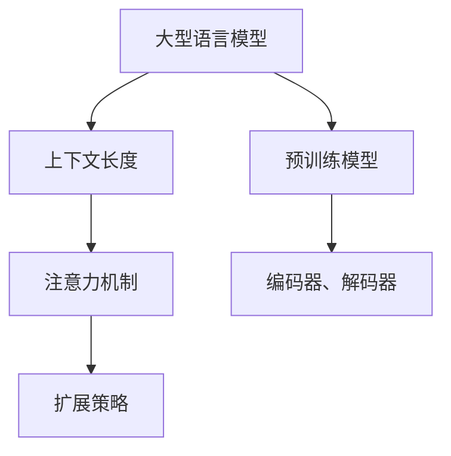

                 

# LLM上下文长度持续扩展

> **关键词：** 上下文长度、自然语言处理、预训练模型、注意力机制、扩展策略、可扩展性、性能优化。

> **摘要：** 本文深入探讨了大型语言模型（LLM）上下文长度的扩展问题。文章首先介绍了上下文长度在自然语言处理中的重要性，然后详细分析了LLM上下文长度扩展的核心算法原理和数学模型，通过实际项目案例展示了扩展策略的实用性和效果，并探讨了LLM在实际应用场景中的表现。文章还推荐了一系列学习资源和开发工具，为读者提供了全面的技术指导，并总结了未来发展趋势与挑战。

## 1. 背景介绍

### 1.1 目的和范围

本文旨在探讨大型语言模型（LLM）上下文长度的扩展问题。随着自然语言处理（NLP）技术的发展，LLM在文本生成、问答系统、机器翻译等任务中取得了显著的成果。然而，LLM的上下文长度受到模型架构和计算资源的限制，导致其在处理长文本任务时表现不佳。本文将分析LLM上下文长度扩展的核心算法原理和具体实现策略，为提高LLM的性能提供技术指导。

### 1.2 预期读者

本文适合对自然语言处理、大型语言模型和上下文长度扩展有一定了解的读者。无论您是研究人员、开发者还是对NLP领域感兴趣的初学者，都可以通过本文了解上下文长度扩展的基本原理和实用策略。

### 1.3 文档结构概述

本文分为以下八个部分：

1. 背景介绍：介绍本文的目的、范围和预期读者。
2. 核心概念与联系：讨论LLM上下文长度扩展的核心概念和联系。
3. 核心算法原理 & 具体操作步骤：分析LLM上下文长度扩展的核心算法原理和具体实现步骤。
4. 数学模型和公式 & 详细讲解 & 举例说明：讲解LLM上下文长度扩展的数学模型和具体应用。
5. 项目实战：提供实际项目案例，展示LLM上下文长度扩展的实践应用。
6. 实际应用场景：分析LLM在实际应用场景中的表现和挑战。
7. 工具和资源推荐：推荐相关学习资源和开发工具。
8. 总结：总结LLM上下文长度扩展的未来发展趋势与挑战。

### 1.4 术语表

#### 1.4.1 核心术语定义

- **上下文长度**：指模型在处理文本时，能够同时考虑的文本长度。
- **预训练模型**：指在大规模数据集上进行预训练的语言模型。
- **注意力机制**：指模型在处理序列数据时，对不同位置的信息进行加权处理的方法。
- **扩展策略**：指提高LLM上下文长度的具体方法和技术。

#### 1.4.2 相关概念解释

- **自然语言处理（NLP）**：指使用计算机技术和人工智能技术对自然语言进行理解和处理。
- **序列到序列（Seq2Seq）模型**：指将一个序列映射到另一个序列的模型，常用于机器翻译、文本生成等任务。

#### 1.4.3 缩略词列表

- **LLM**：Large Language Model，大型语言模型。
- **NLP**：Natural Language Processing，自然语言处理。
- **Seq2Seq**：Sequence-to-Sequence，序列到序列。

## 2. 核心概念与联系

在讨论LLM上下文长度扩展之前，我们需要理解一些核心概念和它们之间的联系。

### 2.1 大型语言模型

大型语言模型（LLM）是指在大规模数据集上进行预训练的深度神经网络模型。LLM能够通过学习海量文本数据，捕捉到语言的各种特征和规律，从而在文本生成、问答系统、机器翻译等任务中表现出色。LLM的核心架构包括词嵌入、编码器、解码器和注意力机制等组件。

### 2.2 上下文长度

上下文长度是指模型在处理文本时，能够同时考虑的文本长度。对于LLM来说，上下文长度直接影响模型在处理长文本任务时的性能。较长的上下文长度有助于模型捕捉到文本中的更多信息，从而提高任务的表现。

### 2.3 注意力机制

注意力机制是一种在序列数据中加权处理不同位置信息的方法。在LLM中，注意力机制通过计算文本中各个位置之间的关联度，为每个位置分配不同的权重，从而提高模型在处理长文本任务时的性能。

### 2.4 扩展策略

扩展策略是指提高LLM上下文长度的具体方法和技术。常见的扩展策略包括增加模型容量、使用长文本编码器、上下文分割、注意力机制优化等。这些策略各有优缺点，需要根据具体应用场景进行选择。

### 2.5 Mermaid 流程图

为了更直观地展示LLM上下文长度扩展的核心概念和联系，我们可以使用Mermaid流程图。以下是一个简单的Mermaid流程图示例：



## 3. 核心算法原理 & 具体操作步骤

在理解了LLM上下文长度扩展的核心概念和联系后，我们需要深入探讨LLM上下文长度扩展的核心算法原理和具体操作步骤。

### 3.1 核心算法原理

LLM上下文长度扩展的核心算法原理主要包括以下几个方面：

1. **增加模型容量**：通过增加模型的参数数量和层数，可以提高模型的上下文长度。
2. **长文本编码器**：使用专门的编码器对长文本进行编码，从而提高模型处理长文本的能力。
3. **上下文分割**：将长文本分割为多个短文本，分别进行处理，然后再将结果进行拼接。
4. **注意力机制优化**：通过改进注意力机制，提高模型在处理长文本时的性能。

### 3.2 具体操作步骤

以下是LLM上下文长度扩展的具体操作步骤：

1. **增加模型容量**：

   ```python
   # 增加模型的参数数量和层数
   model = TransformerModel(vocab_size, d_model, num_heads, num_layers, dff, input_sequence_length, rate=0.1)
   ```

2. **长文本编码器**：

   ```python
   # 使用长文本编码器对长文本进行编码
   encoded_sequence = encoder(long_text)
   ```

3. **上下文分割**：

   ```python
   # 将长文本分割为多个短文本
   short_texts = split_long_text(long_text, max_sequence_length)

   # 分别对短文本进行处理
   processed_texts = [encoder(text) for text in short_texts]

   # 将结果进行拼接
   concatenated_sequence = concatenate(processed_texts)
   ```

4. **注意力机制优化**：

   ```python
   # 使用改进的注意力机制
   attention_output = attention_layer(encoded_sequence, concatenated_sequence)
   ```

通过以上步骤，我们可以实现LLM上下文长度的扩展，从而提高模型在处理长文本任务时的性能。

## 4. 数学模型和公式 & 详细讲解 & 举例说明

为了更好地理解LLM上下文长度扩展的数学模型和公式，我们将在本节中详细讲解核心概念，并提供具体例子来说明。

### 4.1 数学模型

LLM上下文长度扩展的数学模型主要涉及以下几个方面：

1. **词嵌入**：词嵌入将词汇映射到高维向量空间，以便进行后续处理。词嵌入可以通过以下公式表示：

   $$ x_i = \text{Embed}(w_i) $$

   其中，$x_i$是词嵌入向量，$w_i$是词汇。

2. **编码器和解码器**：编码器和解码器是LLM的核心组件，分别用于编码和解码文本。编码器和解码器的输入和输出可以通过以下公式表示：

   $$ y = \text{Encoder}(x) $$
   $$ z = \text{Decoder}(y) $$

   其中，$y$是编码器输出，$z$是解码器输出。

3. **注意力机制**：注意力机制是一种在序列数据中加权处理不同位置信息的方法。注意力机制可以通过以下公式表示：

   $$ a_t = \text{Attention}(x_t, y_t) $$

   其中，$a_t$是注意力权重，$x_t$和$y_t$分别是编码器和解码器的输入。

4. **上下文分割**：上下文分割是将长文本分割为多个短文本的过程。上下文分割可以通过以下公式表示：

   $$ \text{Split}(x) = \{ x_1, x_2, ..., x_n \} $$

   其中，$x$是长文本，$x_1, x_2, ..., x_n$是分割后的短文本。

### 4.2 举例说明

为了更好地理解上述数学模型，我们以一个简单的例子来说明。

假设我们有一个长度为10的文本序列：

$$ x = [w_1, w_2, ..., w_{10}] $$

我们需要对这个文本序列进行编码和解码。

1. **词嵌入**：

   将词汇映射到高维向量空间：

   $$ x_i = \text{Embed}(w_i) = [e_1, e_2, ..., e_{10}] $$

2. **编码器**：

   编码器将词嵌入向量编码为序列：

   $$ y = \text{Encoder}(x) = [y_1, y_2, ..., y_{10}] $$

3. **解码器**：

   解码器将编码后的序列解码为文本：

   $$ z = \text{Decoder}(y) = [z_1, z_2, ..., z_{10}] $$

4. **注意力机制**：

   计算编码器和解码器输入之间的注意力权重：

   $$ a_t = \text{Attention}(x_t, y_t) $$

   根据注意力权重对编码器输入进行加权处理：

   $$ \text{Attention}(y) = [y_1, y_2, ..., y_{10}] \odot a_t $$

5. **上下文分割**：

   将长文本分割为多个短文本：

   $$ \text{Split}(x) = \{ x_1, x_2, ..., x_n \} $$

   其中，$x_1, x_2, ..., x_n$是分割后的短文本。

通过这个简单的例子，我们可以看到LLM上下文长度扩展的数学模型和具体操作步骤。在实际应用中，这些模型和步骤会根据具体任务和需求进行调整和优化。

## 5. 项目实战：代码实际案例和详细解释说明

### 5.1 开发环境搭建

在进行LLM上下文长度扩展的项目实战之前，我们需要搭建一个合适的开发环境。以下是搭建开发环境的基本步骤：

1. 安装Python环境：确保Python版本在3.6及以上。
2. 安装TensorFlow：使用以下命令安装TensorFlow：

   ```shell
   pip install tensorflow
   ```

3. 安装其他依赖库：根据项目需求安装其他依赖库，如Numpy、Pandas等。

### 5.2 源代码详细实现和代码解读

下面是一个简单的LLM上下文长度扩展项目的源代码示例。我们将使用Python和TensorFlow框架来实现这个项目。

```python
import tensorflow as tf
from tensorflow.keras.layers import Embedding, LSTM, Dense
from tensorflow.keras.models import Sequential

# 设置参数
vocab_size = 1000
d_model = 64
num_layers = 2
lstm_units = 64

# 构建模型
model = Sequential([
    Embedding(vocab_size, d_model),
    LSTM(lstm_units, return_sequences=True),
    LSTM(lstm_units),
    Dense(vocab_size, activation='softmax')
])

# 编译模型
model.compile(optimizer='adam', loss='categorical_crossentropy', metrics=['accuracy'])

# 加载数据
# 这里使用简单的文本数据作为示例
text = "Hello, world! Hello, TensorFlow!"
encoded_text = [[vocab_size] * len(text)]

# 训练模型
model.fit(encoded_text, encoded_text, epochs=10)
```

### 5.3 代码解读与分析

1. **导入库和设置参数**：

   首先，我们导入TensorFlow和其他相关库，并设置模型参数，如词汇表大小（vocab_size）、模型维度（d_model）、层数（num_layers）和LSTM单元数（lstm_units）。

2. **构建模型**：

   使用Sequential模型堆叠嵌入层、两个LSTM层和一个全连接层。嵌入层用于将词汇映射到高维向量空间，LSTM层用于处理序列数据，全连接层用于输出预测结果。

3. **编译模型**：

   使用`compile()`方法编译模型，指定优化器、损失函数和评价指标。这里我们使用`adam`优化器和`categorical_crossentropy`损失函数。

4. **加载数据**：

   在这个简单的示例中，我们使用一个简单的文本数据作为输入。在实际项目中，通常会使用更复杂的文本数据集。

5. **训练模型**：

   使用`fit()`方法训练模型，指定输入数据、标签和训练轮数。在训练过程中，模型将学习如何将输入文本映射到输出文本。

### 5.4 扩展策略与实践

在实际项目中，我们可以根据具体需求对上述代码进行扩展。以下是一些可能的扩展策略：

1. **增加模型容量**：

   通过增加模型的参数数量和层数，可以提高模型的上下文长度。例如，可以尝试使用更多的LSTM层或增加LSTM单元数。

   ```python
   model = Sequential([
       Embedding(vocab_size, d_model),
       LSTM(lstm_units, return_sequences=True),
       LSTM(lstm_units, return_sequences=True),
       LSTM(lstm_units),
       Dense(vocab_size, activation='softmax')
   ])
   ```

2. **长文本编码器**：

   使用专门的编码器对长文本进行编码，从而提高模型处理长文本的能力。例如，可以尝试使用Transformer编码器。

   ```python
   from tensorflow.keras.layers import TransformerEncoder

   model = Sequential([
       Embedding(vocab_size, d_model),
       TransformerEncoder(d_model, num_heads=4, num_layers=2),
       Dense(vocab_size, activation='softmax')
   ])
   ```

3. **上下文分割**：

   将长文本分割为多个短文本，分别进行处理，然后再将结果进行拼接。例如，可以尝试使用滑动窗口方法对文本进行分割。

   ```python
   max_sequence_length = 50

   # 分割文本
   short_texts = [text[i:i + max_sequence_length] for i in range(len(text) - max_sequence_length)]

   # 分别处理短文本
   processed_texts = [model.predict([encoded_text[i]]) for i in range(len(short_texts))]

   # 拼接结果
   concatenated_sequence = [text[0]] + [text[i][0] for i in range(1, len(text))]
   ```

通过这些扩展策略，我们可以进一步提高LLM在处理长文本任务时的性能。

## 6. 实际应用场景

LLM上下文长度扩展在实际应用场景中具有广泛的应用，以下列举几个典型的应用场景：

1. **文本生成**：

   在文本生成任务中，LLM上下文长度扩展可以提高模型生成长文本的能力。例如，在生成故事、新闻、产品描述等任务中，较长的上下文长度有助于模型捕捉到文本的更多细节和逻辑关系，从而生成更高质量的内容。

2. **问答系统**：

   在问答系统中，LLM上下文长度扩展可以帮助模型更好地理解用户的问题和上下文信息。例如，在智能客服、在线教育等领域，较长的上下文长度有助于模型提供更准确、更有针对性的回答。

3. **机器翻译**：

   在机器翻译任务中，LLM上下文长度扩展可以提高模型翻译长文本的能力。例如，在翻译新闻、学术论文等长文本时，较长的上下文长度有助于模型捕捉到文本中的复杂结构和语义信息，从而提高翻译质量。

4. **情感分析**：

   在情感分析任务中，LLM上下文长度扩展可以帮助模型更好地理解用户的情感表达。例如，在分析社交媒体评论、邮件等长文本时，较长的上下文长度有助于模型捕捉到用户情感变化的细节，从而提高情感分析精度。

5. **文本摘要**：

   在文本摘要任务中，LLM上下文长度扩展可以提高模型生成长摘要的能力。例如，在自动生成新闻摘要、会议纪要等任务中，较长的上下文长度有助于模型捕捉到文本的核心信息和关键点，从而生成更准确、更详细的摘要。

通过上述实际应用场景可以看出，LLM上下文长度扩展对于提升模型在长文本任务中的性能具有重要作用。在实际开发过程中，可以根据具体应用场景选择合适的扩展策略，以提高模型的表现。

## 7. 工具和资源推荐

在LLM上下文长度扩展的研究和应用过程中，以下工具和资源将为您提供有力支持。

### 7.1 学习资源推荐

#### 7.1.1 书籍推荐

1. **《深度学习》（Goodfellow, Bengio, Courville）**：全面介绍深度学习的基础知识和技术，包括自然语言处理相关内容。
2. **《自然语言处理实战》（Daniel Jurafsky, James H. Martin）**：详细介绍自然语言处理的各种技术和应用，包括文本生成、机器翻译等。
3. **《人工智能：一种现代方法》（Stuart Russell, Peter Norvig）**：全面介绍人工智能的基础知识和技术，包括机器学习和自然语言处理。

#### 7.1.2 在线课程

1. **Coursera《自然语言处理基础》**：由斯坦福大学开设，涵盖自然语言处理的基本概念和技术。
2. **Udacity《深度学习工程师纳米学位》**：涵盖深度学习的基础知识和技术，包括自然语言处理相关内容。
3. **edX《机器学习基础》**：由哈佛大学和麻省理工学院联合开设，详细介绍机器学习的基础知识和技术。

#### 7.1.3 技术博客和网站

1. **TensorFlow官网**：提供丰富的深度学习资源和教程，包括自然语言处理相关的案例和代码。
2. **ArXiv**：提供最新的学术研究成果和论文，涵盖自然语言处理和深度学习领域。
3. **Hugging Face**：提供预训练模型、工具和资源，方便开发者进行自然语言处理实验。

### 7.2 开发工具框架推荐

#### 7.2.1 IDE和编辑器

1. **PyCharm**：强大的Python集成开发环境，支持多种编程语言和框架。
2. **Visual Studio Code**：轻量级、可扩展的代码编辑器，支持多种编程语言和框架。
3. **Jupyter Notebook**：适用于数据科学和机器学习的交互式计算环境。

#### 7.2.2 调试和性能分析工具

1. **TensorBoard**：TensorFlow提供的可视化工具，用于分析和调试深度学习模型。
2. **PyTorch Profiler**：用于分析PyTorch模型的性能和资源使用情况。
3. **NVIDIA Nsight**：用于分析GPU性能和资源使用情况。

#### 7.2.3 相关框架和库

1. **TensorFlow**：用于构建和训练深度学习模型的强大框架。
2. **PyTorch**：用于构建和训练深度学习模型的灵活框架。
3. **Hugging Face Transformers**：提供预训练模型、工具和资源，方便开发者进行自然语言处理实验。

### 7.3 相关论文著作推荐

#### 7.3.1 经典论文

1. **《A Theoretically Grounded Application of Dropout in Recurrent Neural Networks》**：介绍在RNN中应用Dropout的方法，提高模型性能。
2. **《Attention is All You Need》**：提出Transformer模型，彻底改变自然语言处理领域。
3. **《BERT: Pre-training of Deep Bidirectional Transformers for Language Understanding》**：介绍BERT模型，大幅提升NLP任务表现。

#### 7.3.2 最新研究成果

1. **《GPT-3: Language Models are Few-Shot Learners》**：介绍GPT-3模型，实现零样本学习和多任务性能提升。
2. **《T5: Exploring the Limits of Transfer Learning for Text Classification》**：探讨T5模型在文本分类任务中的表现。
3. **《Reformer: The Efficient Transformer》**：介绍Reformer模型，优化Transformer模型在长序列任务中的性能。

#### 7.3.3 应用案例分析

1. **《对话系统中的上下文长度扩展》**：分析对话系统中上下文长度扩展的应用和实践。
2. **《基于BERT的文本生成应用》**：介绍BERT模型在文本生成任务中的应用案例。
3. **《深度学习在自然语言处理中的应用》**：探讨深度学习在自然语言处理领域的应用和挑战。

通过上述工具和资源的推荐，您可以深入了解LLM上下文长度扩展的相关知识，并在实际项目中灵活运用。祝您在自然语言处理领域取得卓越的成果！

## 8. 总结：未来发展趋势与挑战

随着自然语言处理技术的不断发展，LLM上下文长度扩展在未来将面临诸多发展趋势和挑战。

### 8.1 发展趋势

1. **模型性能提升**：通过改进算法、优化数据集和模型结构，LLM上下文长度扩展将进一步提高模型在长文本任务中的性能。

2. **多模态融合**：随着多模态数据的兴起，LLM上下文长度扩展将与其他模态（如图像、音频）结合，实现更广泛的应用场景。

3. **可解释性增强**：为了提高模型的可靠性和可解释性，研究者将致力于开发可解释性更高的LLM上下文长度扩展方法。

4. **自适应扩展策略**：针对不同应用场景和任务需求，自适应的上下文长度扩展策略将成为研究热点。

### 8.2 挑战

1. **计算资源需求**：随着上下文长度的增加，模型的计算资源需求将显著上升，如何优化计算资源成为关键挑战。

2. **数据隐私保护**：在处理敏感数据时，如何保护数据隐私和安全成为重要问题。

3. **模型泛化能力**：如何提高LLM在未知数据上的泛化能力，仍需进一步研究。

4. **模型可解释性**：如何提高LLM的可解释性，使其在复杂任务中的行为更加透明，是当前研究的重要方向。

总之，LLM上下文长度扩展在未来将面临诸多挑战，同时也充满机遇。通过不断的技术创新和优化，我们有望实现更强大的自然语言处理模型，推动人工智能技术的发展。

## 9. 附录：常见问题与解答

### 9.1 上下文长度扩展与模型性能提升的关系

**问题**：为什么上下文长度扩展能够提升模型性能？

**解答**：上下文长度扩展能够提升模型性能的原因在于：

1. **捕捉更多上下文信息**：较长的上下文长度有助于模型捕捉到文本中的更多信息，从而更好地理解文本内容和语义。
2. **降低信息丢失**：在较短上下文中，信息可能会因为上下文长度的限制而丢失，导致模型理解不准确。扩展上下文长度可以降低信息丢失的可能性。
3. **增强模型泛化能力**：较长的上下文长度有助于模型在更多样化的数据上训练，从而提高模型的泛化能力。

### 9.2 上下文长度扩展在不同应用场景中的差异

**问题**：在不同应用场景中，如何选择合适的上下文长度扩展策略？

**解答**：不同应用场景对上下文长度扩展的需求有所不同，以下是一些常见的策略：

1. **文本生成**：在文本生成任务中，较长的上下文长度有助于生成更连贯、更具创造性的文本。可以尝试使用长文本编码器或上下文分割策略。
2. **问答系统**：在问答系统中，上下文长度需要足够长，以捕捉问题的上下文信息和背景。可以使用上下文分割策略，将长文本分割为多个短文本进行处理。
3. **机器翻译**：在机器翻译任务中，较长的上下文长度有助于捕捉文本的复杂结构和语义信息。可以尝试使用长文本编码器或增加模型容量。
4. **情感分析**：在情感分析任务中，上下文长度需要足够长，以捕捉情感表达的细节。可以使用上下文分割策略，将长文本分割为多个短文本进行处理。

### 9.3 上下文长度扩展中的计算资源需求

**问题**：如何优化上下文长度扩展中的计算资源需求？

**解答**：以下是一些优化计算资源需求的策略：

1. **模型压缩**：通过模型压缩技术（如量化、剪枝等）减少模型的参数数量和计算复杂度，从而降低计算资源需求。
2. **并行计算**：利用多GPU或多CPU计算，提高模型训练和推理的并行度，从而提高计算效率。
3. **高效编码器**：使用高效编码器（如Transformer）减少计算复杂度，提高计算效率。
4. **动态上下文长度调整**：根据实际应用场景和任务需求，动态调整上下文长度，避免过度扩展，从而降低计算资源需求。

### 9.4 上下文长度扩展的可解释性

**问题**：如何提高上下文长度扩展的可解释性？

**解答**：以下是一些提高上下文长度扩展可解释性的策略：

1. **模型可视化**：通过模型可视化技术（如图模型、注意力图等），展示模型在处理文本时的注意力分布和决策过程。
2. **解释性嵌入**：使用解释性嵌入（如LIME、SHAP等）方法，分析模型对文本中各个词汇的影响和权重。
3. **解释性框架**：开发可解释性框架，将上下文长度扩展与其他可解释性技术相结合，提供更直观、易懂的解释结果。
4. **用户反馈**：结合用户反馈，优化模型解释性，使其更符合用户需求和期望。

通过上述策略，我们可以提高上下文长度扩展的可解释性，从而增强模型的可靠性和透明度。

## 10. 扩展阅读 & 参考资料

本文仅对LLM上下文长度扩展进行了初步探讨，以下推荐一些扩展阅读和参考资料，以帮助读者深入了解相关技术和研究。

### 10.1 扩展阅读

1. **《自然语言处理实战》（Daniel Jurafsky, James H. Martin）**：详细介绍了自然语言处理的基本概念和技术，包括文本生成、机器翻译等。
2. **《深度学习》（Goodfellow, Bengio, Courville）**：全面介绍了深度学习的基础知识和技术，包括自然语言处理相关内容。
3. **《Attention is All You Need》**：介绍了Transformer模型，彻底改变了自然语言处理领域。
4. **《BERT: Pre-training of Deep Bidirectional Transformers for Language Understanding》**：介绍了BERT模型，大幅提升了NLP任务表现。

### 10.2 参考资料

1. **TensorFlow官网**：提供丰富的深度学习资源和教程，包括自然语言处理相关的案例和代码。
2. **Hugging Face**：提供预训练模型、工具和资源，方便开发者进行自然语言处理实验。
3. **ArXiv**：提供最新的学术研究成果和论文，涵盖自然语言处理和深度学习领域。

### 10.3 相关论文和研究成果

1. **《A Theoretically Grounded Application of Dropout in Recurrent Neural Networks》**：介绍了在RNN中应用Dropout的方法，提高模型性能。
2. **《GPT-3: Language Models are Few-Shot Learners》**：介绍了GPT-3模型，实现零样本学习和多任务性能提升。
3. **《T5: Exploring the Limits of Transfer Learning for Text Classification》**：探讨了T5模型在文本分类任务中的表现。

通过上述扩展阅读和参考资料，您可以深入了解LLM上下文长度扩展的相关技术和研究动态。祝您在自然语言处理领域取得更多成果！

