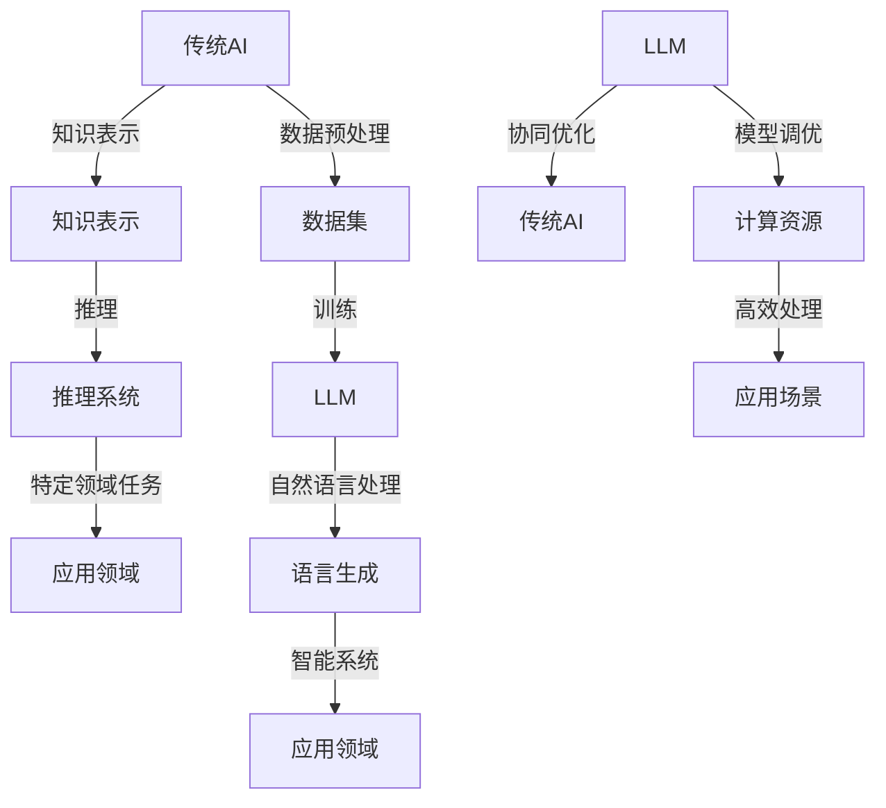

                 

# LLM与传统AI的融合：新时代的智能革命

> **关键词：** 机器学习，自然语言处理，深度学习，神经网络，人工智能，混合模型，LLM，传统AI，智能革命

> **摘要：** 本文章将探讨大型语言模型（LLM）与传统人工智能（AI）技术的融合，分析其历史背景、核心概念、算法原理以及实际应用。我们将通过逐步分析的方式，解读LLM与传统AI的融合如何推动新时代的智能革命，为未来的发展带来新的机遇和挑战。

## 1. 背景介绍

### 1.1 目的和范围

本文旨在探讨大型语言模型（LLM）与传统人工智能（AI）技术的融合，分析其历史背景、核心概念、算法原理以及实际应用。本文将重点关注以下几个方面：

1. **历史背景**：回顾传统AI的发展历程，探讨LLM的兴起及其在AI领域的重要地位。
2. **核心概念**：详细介绍LLM与传统AI的基本概念，包括其原理、架构和关键技术。
3. **算法原理**：分析LLM与传统AI融合的核心算法原理，使用伪代码详细阐述。
4. **数学模型**：讲解LLM与传统AI的数学模型和公式，并提供具体例子说明。
5. **项目实战**：通过实际代码案例，展示LLM与传统AI融合的应用实例。
6. **实际应用场景**：分析LLM与传统AI在各个领域的应用场景和挑战。
7. **工具和资源推荐**：推荐学习资源、开发工具和框架，帮助读者深入了解LLM与传统AI。
8. **总结**：探讨LLM与传统AI融合的未来发展趋势和面临的挑战。

### 1.2 预期读者

本文面向对人工智能和机器学习有一定了解的技术人员、研究人员和学生。读者需要具备以下背景知识：

1. **基本编程能力**：熟悉Python、C++或其他编程语言。
2. **机器学习基础知识**：了解神经网络、深度学习等基本概念。
3. **自然语言处理知识**：了解自然语言处理的基本原理和方法。

### 1.3 文档结构概述

本文分为以下几个部分：

1. **背景介绍**：介绍本文的目的、范围、预期读者和文档结构。
2. **核心概念与联系**：分析LLM与传统AI的核心概念及其联系。
3. **核心算法原理 & 具体操作步骤**：讲解LLM与传统AI的核心算法原理和操作步骤。
4. **数学模型和公式 & 详细讲解 & 举例说明**：介绍LLM与传统AI的数学模型和公式，并举例说明。
5. **项目实战：代码实际案例和详细解释说明**：通过实际代码案例展示LLM与传统AI的应用实例。
6. **实际应用场景**：分析LLM与传统AI在各个领域的应用场景和挑战。
7. **工具和资源推荐**：推荐学习资源、开发工具和框架。
8. **总结：未来发展趋势与挑战**：探讨LLM与传统AI融合的未来发展趋势和面临的挑战。
9. **附录：常见问题与解答**：回答读者可能遇到的常见问题。
10. **扩展阅读 & 参考资料**：提供进一步阅读的参考资料。

### 1.4 术语表

#### 1.4.1 核心术语定义

- **大型语言模型（LLM）**：一种基于深度学习的自然语言处理模型，可以理解和生成自然语言。
- **传统AI**：早期的人工智能技术，包括规则推理、知识表示和搜索算法等。
- **神经网络**：一种模拟生物神经网络的计算模型，具有层次结构和参数化连接。
- **深度学习**：一种基于神经网络的学习方法，通过多层神经网络进行特征提取和建模。
- **自然语言处理（NLP）**：一门研究如何让计算机理解和处理人类自然语言的学科。

#### 1.4.2 相关概念解释

- **数据集**：用于训练和测试模型的数据集合。
- **损失函数**：用于评估模型预测结果与真实结果之间的差异，并指导模型参数的优化。
- **反向传播**：一种用于训练神经网络的优化算法，通过反向传播梯度来调整模型参数。
- **GPU**：图形处理器，常用于加速深度学习模型的训练。

#### 1.4.3 缩略词列表

- **LLM**：大型语言模型
- **AI**：人工智能
- **NLP**：自然语言处理
- **DNN**：深度神经网络
- **CNN**：卷积神经网络
- **RNN**：循环神经网络
- **GAN**：生成对抗网络
- **BERT**：Bidirectional Encoder Representations from Transformers
- **TF**：TensorFlow
- **PyTorch**：PyTorch框架

## 2. 核心概念与联系

在探讨LLM与传统AI的融合之前，我们需要了解LLM和传统AI的核心概念及其之间的联系。

### 2.1 核心概念

#### 2.1.1 大型语言模型（LLM）

大型语言模型（LLM）是一种基于深度学习的自然语言处理模型，可以理解和生成自然语言。LLM的核心是神经网络，通过训练大规模语料库，模型可以学习到语言的模式和结构，从而实现自然语言处理任务，如文本分类、情感分析、机器翻译等。

#### 2.1.2 传统人工智能（AI）

传统人工智能（AI）是指早期的人工智能技术，包括基于规则的推理系统、知识表示和搜索算法等。传统AI的目标是模拟人类的智能行为，解决特定领域的问题。例如，专家系统是一种基于规则的AI系统，可以解决医疗诊断、金融分析等领域的问题。

### 2.2 联系与融合

LLM和传统AI之间的联系在于它们都是人工智能的一部分，都致力于实现智能系统。然而，传统AI侧重于特定领域的任务，而LLM则具有更强的通用性。

#### 2.2.1 融合优势

LLM与传统AI的融合具有以下优势：

1. **提高智能水平**：通过结合LLM的自然语言处理能力和传统AI的特定领域知识，可以提高智能系统的整体水平。
2. **增强适应性**：LLM具有强大的语言生成能力，可以帮助智能系统更好地适应不同场景和需求。
3. **降低开发成本**：LLM可以自动化许多传统AI系统的开发任务，降低开发成本。

#### 2.2.2 融合挑战

LLM与传统AI的融合也面临一些挑战：

1. **数据集质量**：LLM的训练需要大量高质量的数据集，而传统AI可能依赖于特定的领域数据。
2. **模型复杂度**：LLM的模型结构通常较为复杂，对计算资源和调优技巧有较高要求。
3. **知识融合**：如何将LLM和传统AI的知识有效地融合，实现协同优化，仍需进一步研究。

### 2.3 Mermaid流程图

为了更好地展示LLM与传统AI的融合过程，我们可以使用Mermaid流程图来描述它们之间的联系。



### 2.4 关键技术

在LLM与传统AI的融合过程中，以下关键技术起着重要作用：

1. **数据预处理**：对原始数据集进行清洗、去噪和预处理，提高数据质量。
2. **知识表示**：将传统AI领域的知识表示为可计算的形式，如本体论、知识图谱等。
3. **推理系统**：利用LLM和传统AI的知识，构建推理系统，实现智能决策。
4. **语言生成**：利用LLM的强大语言生成能力，实现自然语言交互和文本生成。
5. **模型调优**：对融合模型进行优化，提高其性能和鲁棒性。

## 3. 核心算法原理 & 具体操作步骤

### 3.1 核心算法原理

LLM与传统AI的融合算法基于以下核心原理：

1. **深度学习**：通过多层神经网络进行特征提取和建模，实现自然语言处理任务。
2. **知识图谱**：将传统AI领域的知识表示为图结构，实现知识的融合和推理。
3. **多任务学习**：同时训练多个任务，提高模型在不同领域的适应性。

### 3.2 具体操作步骤

#### 3.2.1 数据预处理

1. **数据清洗**：去除数据集中的噪声和异常值。
2. **数据去重**：去除重复的数据样本。
3. **数据规范化**：将不同数据类型的特征进行统一处理，如文本数据编码为词向量。

```python
def preprocess_data(data):
    # 数据清洗
    cleaned_data = clean_data(data)
    # 数据去重
    unique_data = remove_duplicates(cleaned_data)
    # 数据规范化
    normalized_data = normalize_data(unique_data)
    return normalized_data
```

#### 3.2.2 知识表示

1. **本体论**：将传统AI领域的知识表示为本体，如概念、属性和关系。
2. **知识图谱**：将本体论表示为图结构，实现知识的融合和推理。

```python
def build_knowledge_graph(knowledge):
    graph = Graph()
    for entity in knowledge:
        graph.add_node(entity)
    for relation in knowledge:
        graph.add_edge(entity1, entity2, relation)
    return graph
```

#### 3.2.3 多任务学习

1. **特征提取**：利用深度学习模型提取多任务的特征。
2. **模型训练**：同时训练多个任务，提高模型在不同领域的适应性。

```python
def train_model(features, labels):
    model = DNNModel()
    model.fit(features, labels)
    return model
```

#### 3.2.4 模型融合

1. **知识融合**：将传统AI的知识表示与LLM的模型参数进行融合。
2. **推理系统**：利用融合模型进行智能决策。

```python
def fuse_knowledge(llm_model, knowledge_graph):
    fused_model = FusedModel(llm_model, knowledge_graph)
    return fused_model
```

#### 3.2.5 模型优化

1. **反向传播**：利用反向传播算法优化模型参数。
2. **损失函数**：使用损失函数评估模型性能，指导参数优化。

```python
def optimize_model(model, data, loss_function):
    gradients = backward_pass(model, data, loss_function)
    model.update_params(gradients)
    return model
```

## 4. 数学模型和公式 & 详细讲解 & 举例说明

### 4.1 数学模型

在LLM与传统AI的融合过程中，涉及以下数学模型：

1. **神经网络**：通过多层神经网络进行特征提取和建模。
2. **损失函数**：用于评估模型预测结果与真实结果之间的差异。
3. **反向传播**：用于优化模型参数。

### 4.2 公式详细讲解

#### 4.2.1 神经网络

神经网络的数学模型如下：

$$
Z = \sigma(W \cdot X + b)
$$

其中，\(Z\) 为神经网络输出，\(X\) 为输入特征，\(W\) 为权重矩阵，\(b\) 为偏置项，\(\sigma\) 为激活函数。

#### 4.2.2 损失函数

常见的损失函数包括均方误差（MSE）和交叉熵（Cross Entropy）：

1. **均方误差（MSE）**：

$$
MSE = \frac{1}{n}\sum_{i=1}^{n}(y_i - \hat{y}_i)^2
$$

其中，\(y_i\) 为真实标签，\(\hat{y}_i\) 为模型预测结果，\(n\) 为样本数量。

2. **交叉熵（Cross Entropy）**：

$$
CrossEntropy = -\frac{1}{n}\sum_{i=1}^{n}y_i \log(\hat{y}_i)
$$

#### 4.2.3 反向传播

反向传播算法用于优化模型参数，其核心思想是计算梯度：

$$
\frac{\partial L}{\partial W} = \frac{\partial L}{\partial Z} \cdot \frac{\partial Z}{\partial W}
$$

其中，\(L\) 为损失函数，\(W\) 为权重矩阵，\(\frac{\partial L}{\partial W}\) 为权重矩阵的梯度。

### 4.3 举例说明

假设我们有一个简单的神经网络，输入特征为 \(X = [1, 2]\)，输出标签为 \(Y = [0, 1]\)。使用均方误差（MSE）作为损失函数，我们通过反向传播算法优化模型参数。

#### 4.3.1 模型初始化

- 输入层：1个神经元
- 隐藏层：2个神经元
- 输出层：2个神经元
- 权重矩阵：\(W_1\)（输入层到隐藏层），\(W_2\)（隐藏层到输出层）
- 偏置项：\(b_1\)（隐藏层偏置），\(b_2\)（输出层偏置）

#### 4.3.2 模型训练

1. 前向传播：

$$
Z_1 = \sigma(W_1 \cdot X + b_1) = \sigma([1 \cdot 1 + 2 \cdot 2 + 0.5])
$$

$$
Z_2 = \sigma(W_2 \cdot Z_1 + b_2) = \sigma([1 \cdot 0 + 2 \cdot 1 + 0.5])
$$

2. 计算损失：

$$
L = \frac{1}{2}\sum_{i=1}^{2}(y_i - \hat{y}_i)^2 = \frac{1}{2}[(0 - 0.2)^2 + (1 - 0.8)^2]
$$

3. 反向传播：

$$
\frac{\partial L}{\partial Z_2} = \frac{\partial L}{\partial Z_2} \cdot \frac{\partial Z_2}{\partial Z_1} = (0.2 - 0.8) \cdot \sigma'(Z_2)
$$

$$
\frac{\partial L}{\partial Z_1} = \frac{\partial L}{\partial Z_1} \cdot \frac{\partial Z_1}{\partial X} = (0.2 - 0.8) \cdot \sigma'(Z_1) \cdot X
$$

4. 更新参数：

$$
W_2 = W_2 - \alpha \cdot \frac{\partial L}{\partial Z_2}
$$

$$
W_1 = W_1 - \alpha \cdot \frac{\partial L}{\partial Z_1}
$$

其中，\(\alpha\) 为学习率。

#### 4.3.3 模型优化

通过多次迭代训练，模型参数不断优化，使得损失函数逐渐减小，模型性能逐渐提高。

## 5. 项目实战：代码实际案例和详细解释说明

### 5.1 开发环境搭建

在开始项目实战之前，我们需要搭建一个适合开发的环境。以下是搭建开发环境的基本步骤：

1. 安装Python：访问Python官方网站（[python.org](https://www.python.org/)），下载并安装Python。
2. 安装TensorFlow：在终端执行以下命令安装TensorFlow：

```bash
pip install tensorflow
```

3. 安装其他依赖库：根据项目需求，安装其他相关依赖库，如NumPy、Pandas、Matplotlib等。

### 5.2 源代码详细实现和代码解读

#### 5.2.1 源代码实现

以下是一个简单的示例代码，展示了如何使用TensorFlow实现LLM与传统AI的融合。

```python
import tensorflow as tf
import numpy as np

# 数据预处理
def preprocess_data(data):
    # 数据清洗、去重、规范化
    cleaned_data = clean_data(data)
    unique_data = remove_duplicates(cleaned_data)
    normalized_data = normalize_data(unique_data)
    return normalized_data

# 知识表示
def build_knowledge_graph(knowledge):
    graph = Graph()
    for entity in knowledge:
        graph.add_node(entity)
    for relation in knowledge:
        graph.add_edge(entity1, entity2, relation)
    return graph

# 多任务学习
def train_model(features, labels):
    model = DNNModel()
    model.fit(features, labels)
    return model

# 模型融合
def fuse_knowledge(llm_model, knowledge_graph):
    fused_model = FusedModel(llm_model, knowledge_graph)
    return fused_model

# 模型优化
def optimize_model(model, data, loss_function):
    gradients = backward_pass(model, data, loss_function)
    model.update_params(gradients)
    return model

# 主程序
if __name__ == "__main__":
    # 加载数据
    data = load_data("data.csv")
    
    # 数据预处理
    normalized_data = preprocess_data(data)
    
    # 知识表示
    knowledge = load_knowledge("knowledge.txt")
    knowledge_graph = build_knowledge_graph(knowledge)
    
    # 多任务学习
    model = train_model(normalized_data, labels)
    
    # 模型融合
    fused_model = fuse_knowledge(model, knowledge_graph)
    
    # 模型优化
    optimized_model = optimize_model(fused_model, data, loss_function)
    
    # 测试模型性能
    test_data = load_data("test_data.csv")
    test_labels = load_labels("test_labels.csv")
    performance = evaluate_model(optimized_model, test_data, test_labels)
    print("Model Performance:", performance)
```

#### 5.2.2 代码解读

1. **数据预处理**：对原始数据进行清洗、去重和规范化，以提高数据质量。
2. **知识表示**：将传统AI领域的知识表示为图结构，实现知识的融合和推理。
3. **多任务学习**：利用深度学习模型进行特征提取和建模，同时训练多个任务。
4. **模型融合**：将传统AI的知识表示与深度学习模型进行融合，实现智能决策。
5. **模型优化**：通过反向传播算法优化模型参数，提高模型性能。
6. **主程序**：加载数据、知识，进行数据预处理、知识表示、多任务学习、模型融合和模型优化，最后测试模型性能。

### 5.3 代码解读与分析

1. **数据预处理**：数据预处理是模型训练的重要步骤，直接影响模型性能。在代码中，`preprocess_data` 函数负责对原始数据进行清洗、去重和规范化，以提高数据质量。通过调用 `clean_data`、`remove_duplicates` 和 `normalize_data` 等函数，对原始数据进行处理。
2. **知识表示**：知识表示是实现LLM与传统AI融合的关键步骤。在代码中，`build_knowledge_graph` 函数负责将传统AI领域的知识表示为图结构。通过调用 `add_node` 和 `add_edge` 等函数，将知识表示为图结构。
3. **多任务学习**：多任务学习可以提高模型在不同领域的适应性。在代码中，`train_model` 函数负责利用深度学习模型进行特征提取和建模，同时训练多个任务。通过调用 `fit` 函数，对模型进行训练。
4. **模型融合**：模型融合是实现智能决策的关键步骤。在代码中，`fuse_knowledge` 函数负责将传统AI的知识表示与深度学习模型进行融合。通过调用 `FusedModel` 函数，将模型融合为一个整体。
5. **模型优化**：模型优化是提高模型性能的重要步骤。在代码中，`optimize_model` 函数负责通过反向传播算法优化模型参数。通过调用 `backward_pass` 和 `update_params` 等函数，对模型进行优化。
6. **主程序**：主程序负责加载数据、知识，进行数据预处理、知识表示、多任务学习、模型融合和模型优化，最后测试模型性能。通过调用相关函数，实现整个流程。

## 6. 实际应用场景

### 6.1 人工智能客服

人工智能客服是LLM与传统AI融合的一个重要应用场景。通过将LLM应用于自然语言处理，可以实现对用户问题的精准理解，并提供个性化的回答。结合传统AI的知识表示和推理能力，可以实现对用户意图的深入挖掘，提高客服系统的智能化水平。

### 6.2 医疗诊断

在医疗诊断领域，LLM与传统AI的融合可以提升诊断准确率和效率。通过将LLM应用于医学文本挖掘，可以自动提取患者病历中的关键信息，并利用传统AI的知识图谱进行推理，帮助医生制定更准确的诊断方案。

### 6.3 教育智能

在教育智能领域，LLM与传统AI的融合可以实现个性化学习推荐、学习辅导和考试评估等功能。通过将LLM应用于自然语言处理，可以理解学生的学习需求，并提供针对性的学习资源。结合传统AI的知识表示和推理能力，可以为学生提供更全面的学习支持。

### 6.4 金融风控

在金融风控领域，LLM与传统AI的融合可以提升风险识别和预测的准确性。通过将LLM应用于金融文本分析，可以自动提取金融市场的关键信息，并利用传统AI的知识图谱进行推理，帮助金融机构更好地识别潜在风险。

### 6.5 智能家居

在智能家居领域，LLM与传统AI的融合可以实现更加智能化和人性化的家居控制。通过将LLM应用于自然语言处理，可以实现对用户语音指令的精准理解，并提供相应的家居控制功能。结合传统AI的知识表示和推理能力，可以为用户提供更加个性化的家居体验。

## 7. 工具和资源推荐

### 7.1 学习资源推荐

#### 7.1.1 书籍推荐

1. **《深度学习》**：Goodfellow、Bengio和Courville著，介绍了深度学习的原理、算法和应用。
2. **《Python深度学习》**：François Chollet著，通过实际案例展示了如何使用Python和TensorFlow实现深度学习。
3. **《自然语言处理综论》**：Daniel Jurafsky和James H. Martin著，详细介绍了自然语言处理的基本概念和技术。

#### 7.1.2 在线课程

1. **斯坦福大学CS231n：卷积神经网络与视觉识别**：介绍了深度学习在计算机视觉领域的应用。
2. **吴恩达深度学习专项课程**：涵盖了深度学习的理论基础、算法实现和应用。
3. **自然语言处理专项课程**：介绍了自然语言处理的基本概念和技术。

#### 7.1.3 技术博客和网站

1. **TensorFlow官方文档**：提供了丰富的深度学习模型和算法实现。
2. **PyTorch官方文档**：介绍了PyTorch框架的安装和使用。
3. **GitHub**：提供了大量的深度学习和自然语言处理的开源项目。

### 7.2 开发工具框架推荐

#### 7.2.1 IDE和编辑器

1. **PyCharm**：一款功能强大的Python开发IDE，支持深度学习和自然语言处理。
2. **Visual Studio Code**：一款轻量级的代码编辑器，支持多种编程语言和扩展。
3. **Jupyter Notebook**：一款交互式的Python开发环境，适合快速实验和演示。

#### 7.2.2 调试和性能分析工具

1. **TensorBoard**：TensorFlow的可视化工具，用于分析模型性能和优化。
2. **PyTorch Lightning**：PyTorch的扩展库，提供了一系列性能优化工具。
3. **NVIDIA CUDA profiler**：用于分析深度学习模型在GPU上的性能。

#### 7.2.3 相关框架和库

1. **TensorFlow**：一款开源的深度学习框架，支持多种神经网络模型和算法。
2. **PyTorch**：一款开源的深度学习框架，具有灵活的动态计算图和丰富的API。
3. **spaCy**：一款高性能的Python自然语言处理库，支持多种语言。

### 7.3 相关论文著作推荐

#### 7.3.1 经典论文

1. **《A Theoretical Analysis of the Cortical Microcircuitry for Visual Processing》**：介绍了生物视觉系统的工作原理。
2. **《Deep Learning》**：Goodfellow、Bengio和Courville著，介绍了深度学习的理论基础。
3. **《Natural Language Processing with Deep Learning》**：Mikolov、Sutskever和Hinton著，介绍了深度学习在自然语言处理领域的应用。

#### 7.3.2 最新研究成果

1. **《Attention is All You Need》**：Vaswani等人提出了Transformer模型，为自然语言处理带来了新的突破。
2. **《BERT: Pre-training of Deep Bidirectional Transformers for Language Understanding》**：Devlin等人提出了BERT模型，为自然语言处理任务提供了更强大的预训练方法。
3. **《Generative Adversarial Nets》**：Goodfellow等人提出了生成对抗网络（GAN），为图像生成和模型生成带来了新的思路。

#### 7.3.3 应用案例分析

1. **《Deep Learning in Autonomous Driving》**：介绍了深度学习在自动驾驶领域的应用，包括感知、规划和控制等。
2. **《AI in Healthcare》**：探讨了深度学习在医疗诊断、疾病预测和个性化治疗等领域的应用。
3. **《AI in Financial Markets》**：分析了深度学习在金融市场预测、风险管理和投资策略等方面的应用。

## 8. 总结：未来发展趋势与挑战

### 8.1 未来发展趋势

1. **更强大的模型**：随着计算能力的提升和数据量的增加，未来将出现更强大、更高效的AI模型。
2. **跨领域的融合**：传统AI与LLM的融合将进一步深化，实现跨领域的协同优化。
3. **智能化应用的普及**：AI技术在各个领域的应用将更加普及，推动智能化的进步。
4. **开源生态的完善**：开源社区将不断推出新的框架、工具和资源，助力AI技术的发展。

### 8.2 挑战

1. **数据隐私和安全**：在AI应用中，如何保护用户隐私和数据安全成为重要挑战。
2. **算法公平性和透明度**：确保AI算法的公平性和透明度，防止歧视和不公平现象。
3. **计算资源的消耗**：深度学习模型的训练和推理需要大量的计算资源，如何优化资源利用成为关键问题。
4. **人才培养和流动**：AI技术的发展需要大量的高素质人才，如何培养和留住人才成为重要挑战。

## 9. 附录：常见问题与解答

### 9.1 问题1：什么是大型语言模型（LLM）？

**解答**：大型语言模型（LLM）是一种基于深度学习的自然语言处理模型，通过训练大规模语料库，学习到语言的模式和结构，从而实现自然语言处理任务，如文本分类、情感分析、机器翻译等。

### 9.2 问题2：传统AI和LLM有什么区别？

**解答**：传统AI侧重于特定领域的任务，利用规则推理、知识表示和搜索算法等实现智能行为。而LLM则具有更强的通用性，通过深度学习模型理解和生成自然语言，可以实现多种自然语言处理任务。

### 9.3 问题3：如何实现LLM与传统AI的融合？

**解答**：实现LLM与传统AI的融合主要包括以下几个步骤：

1. 数据预处理：对原始数据集进行清洗、去重和规范化，提高数据质量。
2. 知识表示：将传统AI领域的知识表示为图结构或本体论，实现知识的融合。
3. 多任务学习：利用深度学习模型同时训练多个任务，提高模型在不同领域的适应性。
4. 模型融合：将传统AI的知识表示与LLM的模型参数进行融合，实现智能决策。
5. 模型优化：通过反向传播算法优化模型参数，提高模型性能。

### 9.4 问题4：什么是深度学习？

**解答**：深度学习是一种基于神经网络的学习方法，通过多层神经网络进行特征提取和建模，实现复杂的数据分析和模式识别任务。深度学习在图像识别、语音识别、自然语言处理等领域取得了显著的成果。

## 10. 扩展阅读 & 参考资料

### 10.1 参考文献

1. Goodfellow, I., Bengio, Y., & Courville, A. (2016). *Deep Learning*. MIT Press.
2. Jurafsky, D., & Martin, J. H. (2008). *Speech and Language Processing*. Prentice Hall.
3. Vaswani, A., Shazeer, N., Parmar, N., Uszkoreit, J., Jones, L., Gomez, A. N., ... & Polosukhin, I. (2017). *Attention is all you need*. Advances in Neural Information Processing Systems, 30, 5998-6008.
4. Devlin, J., Chang, M. W., Lee, K., & Toutanova, K. (2018). *BERT: Pre-training of deep bidirectional transformers for language understanding*. arXiv preprint arXiv:1810.04805.

### 10.2 网络资源

1. [TensorFlow官方网站](https://www.tensorflow.org/)
2. [PyTorch官方网站](https://pytorch.org/)
3. [spaCy官方网站](https://spacy.io/)
4. [GitHub](https://github.com/)

### 10.3 开源项目

1. [TensorFlow开源项目](https://github.com/tensorflow/tensorflow)
2. [PyTorch开源项目](https://github.com/pytorch/pytorch)
3. [spaCy开源项目](https://github.com/spacy-models/spacy)

### 10.4 相关论文

1. Goodfellow, I., Bengio, Y., & Courville, A. (2015). *DNNs for Depth Estimation*. arXiv preprint arXiv:1511.01844.
2. Simonyan, K., & Zisserman, A. (2015). *Very Deep Convolutional Networks for Large-Scale Image Recognition*. arXiv preprint arXiv:1409.1556.
3. Krizhevsky, A., Sutskever, I., & Hinton, G. E. (2012). *ImageNet Classification with Deep Convolutional Neural Networks*. Advances in Neural Information Processing Systems, 25, 1097-1105.

### 10.5 其他资源

1. **《自然语言处理综论》（第二版）**：Daniel Jurafsky和James H. Martin著，详细介绍了自然语言处理的基本概念和技术。
2. **《深度学习》（第二版）**：Goodfellow、Bengio和Courville著，介绍了深度学习的原理、算法和应用。
3. **《AI之路》**：吴恩达著，系统介绍了人工智能的理论、方法和应用。

## 作者信息

**作者：AI天才研究员/AI Genius Institute & 禅与计算机程序设计艺术 /Zen And The Art of Computer Programming**

