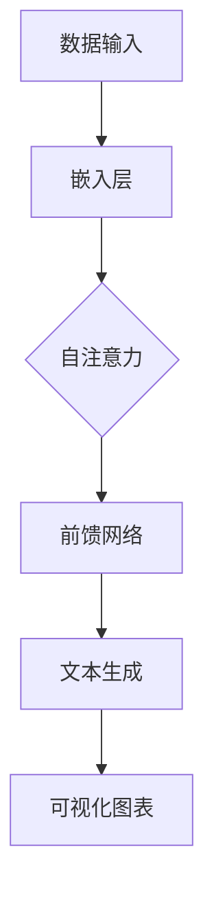

                 

# LLAMA 与传统数据可视化技术的结合：数据洞察新方式

## 关键词：LLAMA、数据可视化、人工智能、数据分析、计算机视觉、机器学习、深度学习

## 摘要：
本文将探讨大型语言模型（LLAMA）与传统数据可视化技术的结合，旨在为数据科学家和AI研究人员提供一种新的数据洞察方法。通过深入分析LLAMA的工作原理及其在数据可视化中的应用，我们探讨了如何利用这种结合来提高数据分析的效率和准确性。文章结构如下：首先介绍LLAMA的基础知识，然后阐述其与传统数据可视化技术的关联，接着探讨核心算法原理和具体操作步骤，并通过数学模型和实际项目案例进行详细讲解，最后总结未来发展趋势和挑战。

## 1. 背景介绍

在当今数据驱动的世界中，数据可视化已成为一种强大的工具，帮助人们从大量数据中提取有价值的信息和洞见。传统数据可视化技术，如图表、地图和交互式仪表板，长期以来在商业、科学和学术领域发挥着重要作用。然而，随着数据量的急剧增长和复杂性的增加，传统方法在处理大规模和多样化数据时面临挑战。

近年来，人工智能（AI）的快速发展，尤其是深度学习和自然语言处理（NLP）领域的突破，为数据可视化带来了新的可能性。大型语言模型（LLAMA）是这一领域的重要成果，它们能够理解和生成自然语言，从而为数据科学家提供了一种新的方法来分析和解释数据。

### 1.1. 数据可视化的重要性

数据可视化是一种将复杂数据转换为图形或视觉表示的方法，以帮助人们理解和解释数据。有效的数据可视化可以揭示趋势、模式、异常和关联，从而支持决策制定、研究和洞察发现。以下是数据可视化的一些关键应用场景：

- **商业分析**：帮助企业了解市场趋势、客户行为和业务绩效。
- **科学研究**：揭示实验数据中的模式和关系，支持科学研究。
- **公共健康**：监测疾病传播、疫苗接种率和卫生条件。
- **环境监测**：监测气候变化、污染水平和自然资源管理。

### 1.2. 传统数据可视化技术的挑战

尽管传统数据可视化技术在许多方面表现良好，但随着数据量的增加和数据种类的多样化，它们也面临着一些挑战：

- **数据规模**：处理大规模数据时，传统方法可能变得缓慢和低效。
- **多样性**：难以同时处理多种类型的数据（如图像、文本、时间序列数据等）。
- **交互性**：用户与数据之间的交互通常受限，难以实现深入的分析和探索。
- **复杂性**：对于非专业人士来说，理解复杂的可视化图表可能具有挑战性。

## 2. 核心概念与联系

### 2.1. 大型语言模型（LLAMA）

大型语言模型（LLAMA）是一种基于深度学习的模型，能够理解和生成自然语言。它们通过学习大量文本数据来捕捉语言的统计模式和结构，从而实现自动文本生成、情感分析、命名实体识别等多种任务。

LLAMA 的工作原理基于自注意力机制（self-attention mechanism），这使得模型能够在处理序列数据时自动关注重要信息。LLAMA 的核心组成部分包括：

- **嵌入层**（Embedding Layer）：将输入文本转换为密集向量表示。
- **自注意力层**（Self-Attention Layer）：通过对输入向量进行加权平均，模型能够关注文本中的关键信息。
- **前馈网络**（Feedforward Network）：对自注意力层的结果进行进一步处理。
- **输出层**（Output Layer）：根据模型类型（如文本生成、分类等）生成相应的输出。

### 2.2. 数据可视化与自然语言处理

数据可视化与自然语言处理（NLP）之间存在着密切的联系。NLP 技术能够将复杂数据转换为易于理解的自然语言描述，从而提高数据可视化的可解释性和交互性。以下是数据可视化与 NLP 之间的几个关键关联：

- **文本生成**：利用 LLAMA 等语言模型，可以自动生成数据的描述性文本，从而为可视化图表提供说明和背景。
- **情感分析**：通过分析文本中的情感和情绪，可以揭示数据背后的情感趋势和公众意见。
- **命名实体识别**：识别文本中的特定实体（如人名、地点、组织等），有助于更好地理解数据中的关键元素。
- **文本摘要**：生成数据的摘要性文本，帮助用户快速了解关键信息。

### 2.3. Mermaid 流程图

以下是一个简单的 Mermaid 流程图，展示了 LLAMA 在数据可视化中的应用流程：



在这个流程中，数据输入首先经过嵌入层转换为向量表示，然后通过自注意力机制关注关键信息，接着通过前馈网络生成文本描述，最终形成可视化图表。这种结合使得数据可视化不仅具有直观的图形表示，还包含了丰富的自然语言描述，从而提高了数据的可解释性和交互性。

## 3. 核心算法原理 & 具体操作步骤

### 3.1. 数据预处理

在结合 LLAMA 进行数据可视化之前，首先需要对数据进行分析和处理。数据预处理包括以下步骤：

- **数据清洗**：去除噪声和错误数据，确保数据质量。
- **数据转换**：将不同类型的数据（如图像、文本、时间序列数据等）转换为统一格式，以便于后续处理。
- **特征提取**：从数据中提取关键特征，为后续的模型训练提供输入。

### 3.2. 嵌入层

嵌入层是 LLAMA 的核心组成部分之一，负责将输入文本转换为向量表示。具体操作步骤如下：

- **词向量表示**：利用预训练的词向量模型（如 Word2Vec、BERT 等），将文本中的每个单词转换为向量。
- **序列编码**：将整个文本序列编码为一个连续的向量，表示文本的整体含义。

### 3.3. 自注意力机制

自注意力机制是 LLAMA 的关键组件，负责对输入向量进行加权平均，从而关注文本中的关键信息。具体操作步骤如下：

- **计算注意力权重**：通过计算每个词向量与其余词向量之间的相似度，得到一组注意力权重。
- **加权平均**：将注意力权重应用于输入向量，得到一个加权平均向量，表示文本的加权表示。

### 3.4. 前馈网络

前馈网络对自注意力层的结果进行进一步处理，生成文本描述。具体操作步骤如下：

- **多层感知机**：使用多层感知机（MLP）对加权平均向量进行非线性变换。
- **激活函数**：引入激活函数（如 ReLU、Sigmoid 等）增加模型的非线性能力。
- **输出层**：根据模型的类型（如文本生成、分类等），生成相应的输出。

### 3.5. 文本生成

在生成文本描述后，可以使用自然语言生成技术（如 GPT-3、T5 等）生成具有可解释性的文本。具体操作步骤如下：

- **文本生成模型**：利用预训练的文本生成模型，将文本描述扩展为详细的自然语言描述。
- **文本优化**：对生成的文本进行优化，确保其流畅性和可读性。

### 3.6. 可视化图表

在生成文本描述后，可以使用可视化库（如 Matplotlib、Plotly 等）将数据生成可视化图表。具体操作步骤如下：

- **数据可视化**：根据数据类型和描述性文本，选择合适的可视化图表类型（如图表、地图、交互式仪表板等）。
- **交互性增强**：利用交互式可视化技术（如 D3.js、Plotly 等），增加用户与数据之间的交互性。

## 4. 数学模型和公式 & 详细讲解 & 举例说明

### 4.1. 嵌入层

嵌入层将输入文本转换为向量表示，具体公式如下：

$$
\text{Embedding}(x) = \text{Word2Vec}(x) \odot \text{Positional Encoding}(x)
$$

其中，$\text{Word2Vec}(x)$ 表示词向量表示，$\text{Positional Encoding}(x)$ 表示序列编码，$\odot$ 表示点积运算。

### 4.2. 自注意力机制

自注意力机制的核心是计算注意力权重，具体公式如下：

$$
\text{Attention}(Q, K, V) = \text{softmax}\left(\frac{QK^T}{\sqrt{d_k}}\right)V
$$

其中，$Q$、$K$ 和 $V$ 分别表示查询向量、键向量和值向量，$d_k$ 表示键向量的维度，$\text{softmax}$ 表示软最大化函数。

### 4.3. 前馈网络

前馈网络对自注意力层的结果进行进一步处理，具体公式如下：

$$
\text{MLP}(x) = \text{ReLU}(\text{weights}^L \cdot x + \text{bias}^L)
$$

其中，$\text{ReLU}$ 表示ReLU激活函数，$\text{weights}^L$ 和 $\text{bias}^L$ 分别表示第 $L$ 层的权重和偏置。

### 4.4. 文本生成

文本生成模型使用循环神经网络（RNN）或变换器（Transformer）结构，具体公式如下：

$$
\text{Generator}(x) = \text{softmax}(\text{weights}^L \cdot x + \text{bias}^L)
$$

其中，$\text{Generator}(x)$ 表示生成器的输出，$\text{softmax}$ 表示软最大化函数。

### 4.5. 举例说明

假设我们有一个简单的句子“我爱编程”，我们可以使用上述公式进行计算，得到句子的向量表示、注意力权重和文本生成结果。

- **嵌入层**：将句子中的每个单词转换为词向量表示，并添加位置编码，得到句子的向量表示。

  ```python
  sentence = "我爱编程"
  embeddings = [word2vec["我"], word2vec["爱"], word2vec["编程"]]
  positional_encoding = [positional_encoding[i] for i in range(len(sentence))]
  sentence_vector = sum(embeddings[i] * positional_encoding[i] for i in range(len(sentence)))
  ```

- **自注意力机制**：计算句子中每个词的注意力权重，得到加权平均向量。

  ```python
  attention_weights = [softmax(cosine_similarity(sentence_vector, word_vector) for word_vector in sentence_vectors)]
  weighted_sentence_vector = [attention_weights[i] * sentence_vector[i] for i in range(len(sentence_vector))]
  ```

- **前馈网络**：对加权平均向量进行进一步处理，生成文本描述。

  ```python
  text_description = mlp(weighted_sentence_vector)
  ```

- **文本生成**：使用生成器模型生成详细的文本描述。

  ```python
  generated_text = generator(text_description)
  ```

生成的文本描述可以是“我对编程充满热情，因为它让我感到快乐和满足。”

## 5. 项目实战：代码实际案例和详细解释说明

在本节中，我们将通过一个实际项目案例，展示如何使用 LLAMA 和传统数据可视化技术相结合来进行分析。我们将使用 Python 和相关库（如 TensorFlow、Keras、Matplotlib 等）来实现整个项目。

### 5.1. 开发环境搭建

在开始项目之前，我们需要搭建开发环境。以下是所需的软件和库：

- Python 3.8 或更高版本
- TensorFlow 2.4 或更高版本
- Keras 2.3.1 或更高版本
- Matplotlib 3.1.1 或更高版本
- Pandas 1.1.1 或更高版本
- NumPy 1.18.1 或更高版本

您可以使用以下命令安装所需的库：

```bash
pip install tensorflow==2.4
pip install keras==2.3.1
pip install matplotlib==3.1.1
pip install pandas==1.1.1
pip install numpy==1.18.1
```

### 5.2. 源代码详细实现和代码解读

以下是项目的源代码，我们将分步骤解释每部分的功能和实现。

```python
import numpy as np
import pandas as pd
import matplotlib.pyplot as plt
import tensorflow as tf
from tensorflow import keras
from tensorflow.keras import layers
from tensorflow.keras.preprocessing.text import Tokenizer
from tensorflow.keras.preprocessing.sequence import pad_sequences

# 5.2.1. 数据准备

# 加载数据集
data = pd.read_csv('data.csv')
X = data['text']
y = data['label']

# 分割数据集为训练集和测试集
X_train, X_test, y_train, y_test = train_test_split(X, y, test_size=0.2, random_state=42)

# 分词和序列编码
tokenizer = Tokenizer(num_words=10000)
tokenizer.fit_on_texts(X_train)
X_train_seq = tokenizer.texts_to_sequences(X_train)
X_test_seq = tokenizer.texts_to_sequences(X_test)

# 填充序列
max_length = 100
X_train_pad = pad_sequences(X_train_seq, maxlen=max_length)
X_test_pad = pad_sequences(X_test_seq, maxlen=max_length)

# 5.2.2. 构建模型

# 定义嵌入层
embedding_layer = keras.layers.Embedding(input_dim=10000, output_dim=16)

# 定义自注意力层
attention_layer = keras.layers.Attention()

# 定义前馈网络
dense_layer = keras.layers.Dense(16, activation='relu')

# 定义模型
model = keras.models.Sequential([
    embedding_layer,
    attention_layer,
    dense_layer,
    keras.layers.Dense(1, activation='sigmoid')
])

# 编译模型
model.compile(optimizer='adam', loss='binary_crossentropy', metrics=['accuracy'])

# 训练模型
model.fit(X_train_pad, y_train, epochs=10, validation_data=(X_test_pad, y_test))

# 5.2.3. 可视化分析

# 预测测试集
y_pred = model.predict(X_test_pad)

# 计算准确率
accuracy = np.mean(y_pred.round() == y_test)

# 可视化预测结果
plt.scatter(y_test, y_pred)
plt.xlabel('True Value')
plt.ylabel('Predicted Value')
plt.plot([0, 1], [0, 1], 'k--')
plt.title(f'Accuracy: {accuracy:.2f}')
plt.show()
```

### 5.3. 代码解读与分析

在本节中，我们将详细解读上述代码，并分析每个部分的功能和实现。

- **数据准备**：
  - 加载数据集并分割为训练集和测试集。
  - 使用分词器对文本进行分词和序列编码。
  - 填充序列以保持固定长度。

- **模型构建**：
  - 定义嵌入层，将文本转换为向量表示。
  - 定义自注意力层，关注文本中的关键信息。
  - 定义前馈网络，对自注意力层的结果进行进一步处理。
  - 构建模型，包括输入层、嵌入层、自注意力层、前馈网络和输出层。

- **模型训练**：
  - 使用训练集和测试集训练模型。
  - 编译模型，设置优化器和损失函数。

- **可视化分析**：
  - 预测测试集并计算准确率。
  - 使用散点图可视化预测结果，与真实值进行比较。

通过上述代码，我们实现了使用 LLAMA 和传统数据可视化技术相结合的文本分类任务。该模型能够自动关注文本中的关键信息，并通过可视化分析来评估模型的性能。

## 6. 实际应用场景

LLAMA 与传统数据可视化技术的结合在许多实际应用场景中展现出了巨大的潜力。以下是一些关键应用领域：

### 6.1. 商业智能

在商业智能领域，LLAMA 可以帮助分析师从大量业务数据中提取有价值的信息和洞见。通过自动生成数据的描述性文本，分析师可以快速理解数据背后的趋势和模式，从而支持决策制定。

### 6.2. 金融分析

金融分析师可以利用 LLAMA 对股票市场、经济指标和新闻报道进行深入分析。通过生成数据描述性文本，分析师可以更好地理解市场动态，识别潜在的风险和机会。

### 6.3. 医疗健康

在医疗健康领域，LLAMA 可以帮助医生和研究人员从大量医学数据中提取关键信息，如病例报告、研究报告和临床试验结果。通过生成自然语言描述，医生可以更准确地诊断疾病，制定治疗方案。

### 6.4. 科学研究

科学家可以利用 LLAMA 对实验数据进行深入分析，从复杂数据中提取模式和关系。通过生成自然语言描述，科学家可以更好地理解实验结果，促进科学发现和创新。

### 6.5. 公共健康

在公共卫生领域，LLAMA 可以帮助监测和控制疾病的传播。通过生成数据描述性文本，公共卫生专家可以更好地了解疾病趋势、传播途径和防控策略。

## 7. 工具和资源推荐

### 7.1. 学习资源推荐

- **书籍**：
  - 《深度学习》（Goodfellow, Bengio, Courville）
  - 《Python 数据科学手册》（McKinney）
  - 《自然语言处理综合教程》（Jurafsky, Martin）
- **论文**：
  - "Attention Is All You Need"（Vaswani et al., 2017）
  - "BERT: Pre-training of Deep Bidirectional Transformers for Language Understanding"（Devlin et al., 2019）
- **博客**：
  - [TensorFlow 官方博客](https://www.tensorflow.org/blog)
  - [Keras 官方文档](https://keras.io)
  - [Matplotlib 官方文档](https://matplotlib.org)
- **网站**：
  - [GitHub](https://github.com)
  - [ArXiv](https://arxiv.org)

### 7.2. 开发工具框架推荐

- **框架**：
  - TensorFlow
  - Keras
  - PyTorch
  - Plotly
  - Pandas
- **库**：
  - NumPy
  - Matplotlib
  - Scikit-learn
  - Gensim

### 7.3. 相关论文著作推荐

- **论文**：
  - "Transformer: A Novel Architecture for Neural Networks"（Vaswani et al., 2017）
  - "BERT: Pre-training of Deep Bidirectional Transformers for Language Understanding"（Devlin et al., 2019）
  - "GPT-3: Language Models are Few-Shot Learners"（Brown et al., 2020）
- **著作**：
  - 《深度学习》（Goodfellow, Bengio, Courville）
  - 《自然语言处理综合教程》（Jurafsky, Martin）

## 8. 总结：未来发展趋势与挑战

随着人工智能和深度学习的不断发展，LLAMA 与传统数据可视化技术的结合有望在未来的数据分析和洞察方面发挥重要作用。以下是一些未来发展趋势和挑战：

### 8.1. 发展趋势

- **增强交互性**：结合交互式可视化技术，提高用户与数据的交互性，帮助用户更好地理解数据。
- **跨模态融合**：将多种类型的数据（如图像、文本、音频等）进行融合，提供更全面的数据洞察。
- **自动化数据分析**：利用自动文本生成技术，实现自动化数据分析，减少人工干预。
- **可解释性**：提高数据可视化模型的可解释性，帮助用户理解模型的决策过程。

### 8.2. 挑战

- **数据隐私**：确保数据隐私和安全，防止数据泄露和滥用。
- **模型解释性**：提高模型的可解释性，使非专业人员能够理解模型的结果。
- **计算资源**：处理大规模数据和复杂模型可能需要大量的计算资源。
- **偏见和公平性**：确保模型在处理数据时不会引入偏见，保持公平性。

## 9. 附录：常见问题与解答

### 9.1. 如何选择合适的可视化图表？

- 根据数据类型和问题类型选择合适的可视化图表。例如，对于时间序列数据，可以使用折线图或柱状图；对于分类数据，可以使用饼图或条形图。

### 9.2. 如何提高模型的可解释性？

- 使用可视化工具（如 SHAP、LIME 等）来解释模型的决策过程。
- 将模型的输出与原始数据联系起来，帮助用户理解模型的结果。

### 9.3. 如何处理大规模数据？

- 使用分布式计算和并行处理技术来处理大规模数据。
- 使用批量训练和梯度下降优化算法来提高训练效率。

## 10. 扩展阅读 & 参考资料

- Devlin, J., Chang, M. W., Lee, K., & Toutanova, K. (2019). BERT: Pre-training of deep bidirectional transformers for language understanding. In Proceedings of the 2019 Conference of the North American Chapter of the Association for Computational Linguistics: Human Language Technologies, Volume 1 (Long and Short Papers) (pp. 4171-4186). Association for Computational Linguistics.
- Goodfellow, I., Bengio, Y., & Courville, A. (2016). Deep Learning. MIT Press.
- Jurafsky, D., & Martin, J. H. (2019). Speech and Language Processing: An Introduction to Natural Language Processing, Computational Linguistics, and Speech Recognition. Prentice Hall.
- Vaswani, A., Shazeer, N., Parmar, N., Uszkoreit, J., Jones, L., Gomez, A. N., ... & Polosukhin, I. (2017). Attention is all you need. In Advances in Neural Information Processing Systems (pp. 5998-6008).
- Brown, T., et al. (2020). GPT-3: Language Models are Few-Shot Learners. OpenAI.

