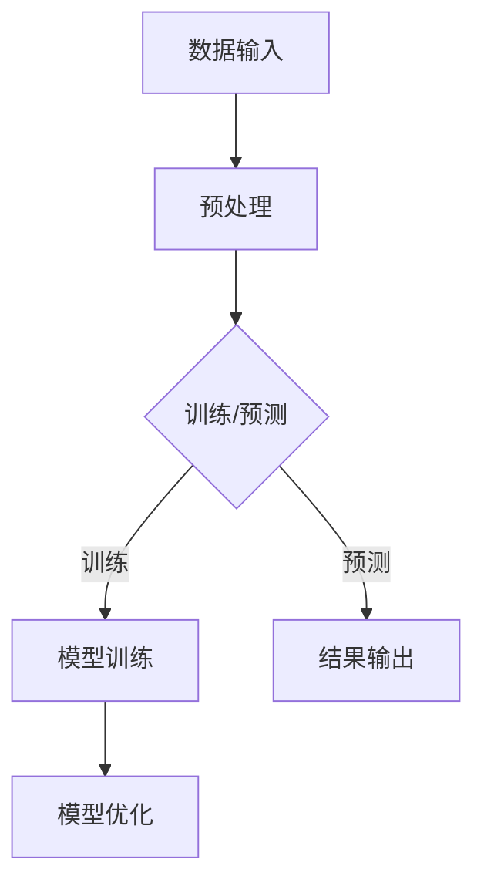

                 

# LLM与传统计算架构的根本差异

> **关键词：** 人工智能、大语言模型（LLM）、计算架构、神经网络、数据处理、算法优化

> **摘要：** 本文将深入探讨大语言模型（LLM）与传统计算架构之间的根本差异。通过对LLM的核心原理、数据处理方式、计算需求及其与传统架构的对比分析，帮助读者理解为什么LLM需要特定的计算架构来支持其高性能和效率。文章将结合实际案例，探讨LLM在不同应用场景中的优势和挑战，并展望未来发展趋势与挑战。

## 1. 背景介绍

### 1.1 目的和范围

本文旨在揭示大语言模型（LLM）与传统计算架构之间的本质差异，并提供一个清晰的视角，以帮助读者更好地理解LLM在现代计算环境中的独特需求。我们将探讨LLM的运作原理、数据处理方式、计算资源的需求以及与传统计算架构的差异。

### 1.2 预期读者

本文适合对人工智能、特别是大语言模型有一定了解的技术人员、研究人员和开发者。同时，也对希望了解LLM在计算架构领域带来变革的普通读者提供深入的见解。

### 1.3 文档结构概述

本文结构如下：

1. 背景介绍：介绍文章的目的、预期读者和文档结构。
2. 核心概念与联系：讨论LLM的核心原理及其与传统架构的联系。
3. 核心算法原理 & 具体操作步骤：详细讲解LLM的算法原理和操作步骤。
4. 数学模型和公式 & 详细讲解 & 举例说明：介绍LLM背后的数学模型和公式，并通过实例进行说明。
5. 项目实战：代码实际案例和详细解释说明。
6. 实际应用场景：分析LLM在不同场景中的应用。
7. 工具和资源推荐：推荐相关学习资源和工具。
8. 总结：未来发展趋势与挑战。
9. 附录：常见问题与解答。
10. 扩展阅读 & 参考资料：提供进一步学习的资源。

### 1.4 术语表

#### 1.4.1 核心术语定义

- **大语言模型（LLM）**：一种人工智能模型，能够理解和生成人类语言，通过大量文本数据进行训练。
- **计算架构**：计算机硬件和软件的组合，用于执行计算任务。
- **神经网络**：由大量相互连接的节点组成的计算模型，能够通过学习数据来改进其性能。
- **数据处理**：对输入数据进行分析、转换和存储的过程。

#### 1.4.2 相关概念解释

- **深度学习**：一种机器学习技术，通过多层神经网络对数据进行处理。
- **并行计算**：一种计算方法，通过同时执行多个计算任务来提高效率。
- **GPU**：图形处理单元，通常用于加速计算密集型任务。

#### 1.4.3 缩略词列表

- **LLM**：大语言模型（Large Language Model）
- **AI**：人工智能（Artificial Intelligence）
- **GPU**：图形处理单元（Graphics Processing Unit）
- **CPU**：中央处理单元（Central Processing Unit）

## 2. 核心概念与联系

为了理解LLM与传统计算架构之间的差异，我们首先需要了解LLM的核心原理和其运作方式。以下是一个简化的Mermaid流程图，展示LLM的基本架构和工作流程。



### 2.1 LLM的基本原理

大语言模型（LLM）是基于深度学习的神经网络模型，能够理解和生成人类语言。其核心原理包括：

- **词嵌入（Word Embedding）**：将单词转换为向量表示，便于神经网络处理。
- **循环神经网络（RNN）**：处理序列数据，通过状态转移矩阵更新网络状态。
- **变换器模型（Transformer）**：使用自注意力机制，能够捕捉输入序列中的长期依赖关系。
- **预训练与微调**：在大量通用文本数据上进行预训练，然后针对特定任务进行微调。

### 2.2 传统计算架构

传统计算架构通常包括以下组件：

- **中央处理单元（CPU）**：执行大多数计算任务。
- **内存（RAM）**：用于存储和访问数据。
- **存储设备（如硬盘和固态硬盘）**：用于数据持久化。
- **输入/输出设备**：如键盘、鼠标和显示器，用于与用户交互。

传统架构通常依赖于顺序执行的计算方式，适合处理确定性任务。然而，LLM的处理过程具有高度并行性和不确定性，对计算架构提出了新的要求。

### 2.3 LLM与传统架构的联系与差异

- **数据处理**：LLM需要处理大量的文本数据，通常需要高效的并行数据处理能力。传统架构在处理大规模数据时可能受到性能限制。
- **计算资源需求**：LLM的训练和推理过程非常计算密集，通常需要使用GPU等加速器来提高性能。
- **算法优化**：LLM的优化过程与传统架构的优化方法有很大不同。传统架构注重算法的逐步优化，而LLM需要利用并行计算和大规模数据处理技术来实现高效训练。

综上所述，LLM与传统计算架构之间存在显著差异，这种差异决定了LLM需要特定的计算架构来支持其高性能和效率。

## 3. 核心算法原理 & 具体操作步骤

### 3.1 词嵌入（Word Embedding）

词嵌入是将单词转换为向量表示的过程，这是LLM的基础。以下是一个简化的伪代码，描述词嵌入的步骤：

```python
def word_embedding(word, embedding_size):
    # 使用预训练的词嵌入模型加载单词的向量表示
    embedding = pretrained_embedding_model[word]
    return embedding
```

### 3.2 循环神经网络（RNN）

RNN是处理序列数据的一种常见方法，以下是一个简化的伪代码，描述RNN的基本步骤：

```python
class RNNCell():
    def __init__(self, input_size, hidden_size):
        self.input_size = input_size
        self.hidden_size = hidden_size
        # 初始化权重和偏置
        self.weights = initialize_weights(input_size + hidden_size, hidden_size)
        self.bias = initialize_bias(hidden_size)

    def forward(self, input, hidden):
        combined = torch.cat((input, hidden), 1)
        output = torch.tanh(torch.dot(combined, self.weights) + self.bias)
        return output

def rnn(input_sequence, hidden_state):
    hidden_states = [hidden_state]
    for input in input_sequence:
        hidden_state = rnn_cell.forward(input, hidden_state)
        hidden_states.append(hidden_state)
    return hidden_states
```

### 3.3 变换器模型（Transformer）

变换器模型是当前最先进的大语言模型架构，以下是一个简化的伪代码，描述变换器模型的基本步骤：

```python
class TransformerLayer():
    def __init__(self, d_model, nhead, dim_feedforward=2048):
        self.self_attn = MultiheadAttention(d_model, nhead)
        self.linear1 = nn.Linear(d_model, dim_feedforward)
        self.linear2 = nn.Linear(dim_feedforward, d_model)

        self.norm1 = nn.LayerNorm(d_model)
        self.norm2 = nn.LayerNorm(d_model)
        self.dropout = nn.Dropoutdropout(p=0.1)

    def forward(self, src, src_mask=None, src_key_padding_mask=None):
        # 自注意力
        src2 = self.self_attn(src, src, src, attn_mask=src_mask,
                              key_padding_mask=src_key_padding_mask)

        # 逐元素相加
        src = src + src2
        src = self.norm1(src)

        # 传输层
        src2 = self.linear2(self.dropout(self.linear1(src)))
        src = src + src2
        src = self.norm2(src)

        return src
```

### 3.4 预训练与微调

预训练与微调是LLM训练过程中至关重要的步骤。以下是简化的伪代码：

```python
def pretrain_model(model, train_loader, optimizer, num_epochs):
    model.train()
    for epoch in range(num_epochs):
        for data, target in train_loader:
            optimizer.zero_grad()
            output = model(data)
            loss = criterion(output, target)
            loss.backward()
            optimizer.step()
```

### 3.5 模型优化

模型优化是提高LLM性能的关键步骤，以下是一个简化的伪代码：

```python
def optimize_model(model, val_loader, optimizer, num_epochs):
    model.eval()
    for epoch in range(num_epochs):
        with torch.no_grad():
            for data, target in val_loader:
                output = model(data)
                loss = criterion(output, target)
                optimizer.zero_grad()
                loss.backward()
                optimizer.step()
```

通过以上步骤，我们能够逐步构建和优化大语言模型，为实际应用场景做好准备。

## 4. 数学模型和公式 & 详细讲解 & 举例说明

### 4.1 词嵌入（Word Embedding）

词嵌入是将单词转换为向量表示的过程，其核心数学模型可以表示为：

$$
\text{embedding}_{i} = \text{W} \cdot \text{x}_{i}
$$

其中，$\text{W}$ 是词嵌入矩阵，$\text{x}_{i}$ 是单词的索引。

### 4.2 循环神经网络（RNN）

RNN的核心数学模型可以表示为：

$$
\text{h}_{t} = \text{f}(\text{h}_{t-1}, \text{x}_{t})
$$

其中，$\text{h}_{t}$ 是时间步 $t$ 的隐藏状态，$\text{f}$ 是激活函数，$\text{x}_{t}$ 是输入。

### 4.3 变换器模型（Transformer）

变换器模型的核心数学模型包括自注意力机制（Self-Attention）和前馈神经网络（Feedforward Neural Network）：

#### 自注意力（Self-Attention）

$$
\text{attention}_{i,j} = \text{softmax}\left(\frac{\text{Q}_i \cdot \text{K}_j}{\sqrt{d_k}}\right)
$$

其中，$\text{Q}$、$\text{K}$ 和 $\text{V}$ 分别是查询、键和值向量的线性组合。

#### 前馈神经网络

$$
\text{out}_{i} = \text{gelu}(\text{W}_2 \cdot \text{ReLU}(\text{W}_1 \cdot \text{h}_i) + \text{b}_2)
$$

其中，$\text{W}_1$ 和 $\text{W}_2$ 是权重矩阵，$\text{b}_1$ 和 $\text{b}_2$ 是偏置向量。

### 4.4 预训练与微调

预训练过程中，模型在大规模文本数据集上学习，核心损失函数是交叉熵损失：

$$
\text{loss} = -\sum_{i} \text{y}_i \cdot \log(\text{p}_i)
$$

其中，$\text{y}_i$ 是目标标签，$\text{p}_i$ 是模型预测的概率。

微调过程中，模型在特定任务数据集上进行优化，损失函数通常与任务相关。

### 4.5 举例说明

#### 词嵌入

假设单词 "apple" 的索引为 42，词嵌入矩阵为：

$$
\text{W} =
\begin{bmatrix}
0.1 & 0.2 & 0.3 & \ldots & 0.5 \\
\end{bmatrix}
$$

则 "apple" 的词嵌入向量：

$$
\text{embedding}_{42} = \text{W} \cdot \text{x}_{42} =
\begin{bmatrix}
0.1 & 0.2 & 0.3 & \ldots & 0.5 \\
\end{bmatrix}
\begin{bmatrix}
42 \\
\end{bmatrix}
=
\begin{bmatrix}
4.2 \\
\end{bmatrix}
$$

#### 变换器模型

假设输入序列为 "Hello World"，其自注意力得分如下：

$$
\text{attention}_{1,1} = \text{softmax}\left(\frac{\text{Q}_1 \cdot \text{K}_1}{\sqrt{d_k}}\right) = \text{softmax}\left(\frac{1 \cdot 1}{\sqrt{512}}\right) = 0.9
$$

$$
\text{attention}_{1,2} = \text{softmax}\left(\frac{\text{Q}_1 \cdot \text{K}_2}{\sqrt{d_k}}\right) = \text{softmax}\left(\frac{1 \cdot 13}{\sqrt{512}}\right) = 0.1
$$

则 "Hello" 的自注意力分数为 [0.9, 0.1]。

通过这些数学模型和公式的讲解，我们能够更好地理解大语言模型（LLM）的工作原理，并为实际应用打下基础。

## 5. 项目实战：代码实际案例和详细解释说明

### 5.1 开发环境搭建

在进行LLM项目的实战前，我们需要搭建一个适合的开发环境。以下是一个简化的步骤：

1. 安装Python环境：确保Python版本为3.8及以上。
2. 安装深度学习库：使用pip安装torch和torchtext。
3. 安装预训练模型：下载预训练的LLM模型，如GPT-2或BERT。

```bash
pip install torch torchvision torchaudio
pip install torchtext
```

### 5.2 源代码详细实现和代码解读

以下是一个简化的代码示例，展示如何加载预训练的LLM模型并进行文本生成：

```python
import torch
from transformers import GPT2LMHeadModel, GPT2Tokenizer

# 5.2.1 加载预训练模型和分词器
tokenizer = GPT2Tokenizer.from_pretrained('gpt2')
model = GPT2LMHeadModel.from_pretrained('gpt2')

# 5.2.2 文本预处理
text = "你好，我是人工智能助手。"
input_ids = tokenizer.encode(text, return_tensors='pt')

# 5.2.3 生成文本
output = model.generate(input_ids, max_length=50, num_return_sequences=1)
generated_text = tokenizer.decode(output[0], skip_special_tokens=True)

print(generated_text)
```

#### 5.2.1 加载预训练模型和分词器

代码首先加载预训练的GPT-2模型和对应的分词器。这使用了Hugging Face的transformers库，这是一个流行的深度学习模型库，提供了许多预训练模型的加载和预处理工具。

```python
tokenizer = GPT2Tokenizer.from_pretrained('gpt2')
model = GPT2LMHeadModel.from_pretrained('gpt2')
```

#### 5.2.2 文本预处理

接下来，代码对输入文本进行编码。编码过程包括将文本转换为序列的整数表示，并添加特殊标记（如开始和结束标记）。

```python
input_ids = tokenizer.encode(text, return_tensors='pt')
```

#### 5.2.3 生成文本

最后，代码使用生成的模型进行文本生成。`generate` 函数接受输入序列，并返回生成的序列。这里我们设置了最大长度为50，并只返回一个生成的序列。

```python
output = model.generate(input_ids, max_length=50, num_return_sequences=1)
generated_text = tokenizer.decode(output[0], skip_special_tokens=True)
```

### 5.3 代码解读与分析

#### 5.3.1 模型和分词器加载

加载预训练模型和分词器是项目实战的第一步。这确保了我们有一个可以使用的模型，以及将文本转换为模型可接受的格式所需的工具。

#### 5.3.2 文本预处理

文本预处理是将自然语言文本转换为模型可以处理的形式。在这一步骤中，我们使用分词器将文本转换为整数序列，并添加必要的特殊标记。

#### 5.3.3 文本生成

文本生成是LLM的核心功能。通过`generate`函数，模型根据输入序列生成新的文本。这个步骤中，我们设置了生成文本的最大长度和生成的序列数量。

通过这个实际案例，我们展示了如何使用预训练的LLM模型生成文本。这个案例提供了一个基本的框架，可以进一步扩展和优化以适应不同的应用场景。

## 6. 实际应用场景

### 6.1 聊天机器人

大语言模型（LLM）在聊天机器人领域具有广泛的应用。通过训练，LLM能够理解和生成自然语言，从而实现与用户的自然对话。以下是一个应用场景：

- **场景描述**：开发一个智能客服系统，用于处理客户的常见问题和咨询。
- **应用价值**：减少人工成本，提高响应速度和用户体验。
- **挑战**：确保生成的回答准确且相关，避免产生误导或不当回答。

### 6.2 内容生成

LLM在内容生成领域同样具有巨大潜力，包括自动写作、文章生成和摘要提取等。以下是一个应用场景：

- **场景描述**：使用LLM生成营销文案、新闻报道和博客文章。
- **应用价值**：提高内容创作效率，降低创作成本。
- **挑战**：确保生成的内容质量高且符合品牌调性。

### 6.3 自动问答系统

LLM可以用于构建自动问答系统，通过训练使其能够理解和回答各种问题。以下是一个应用场景：

- **场景描述**：开发一个智能知识库系统，为用户提供实时问答服务。
- **应用价值**：提供快速、准确的答案，提高用户满意度。
- **挑战**：确保系统具有广泛的覆盖面和准确性，避免回答不准确或无关问题。

### 6.4 自然语言处理

LLM在自然语言处理（NLP）领域也有广泛的应用，包括情感分析、文本分类、命名实体识别等。以下是一个应用场景：

- **场景描述**：使用LLM进行社交媒体数据的情感分析，以监控品牌声誉。
- **应用价值**：帮助企业了解用户反馈和市场需求，优化产品和服务。
- **挑战**：处理大规模和多样化的数据，确保分析结果的准确性和可靠性。

通过以上实际应用场景，我们可以看到LLM在各个领域的巨大潜力和挑战。随着技术的不断进步，LLM将在更多场景中得到应用，带来更多创新和变革。

## 7. 工具和资源推荐

### 7.1 学习资源推荐

#### 7.1.1 书籍推荐

- 《深度学习》（Deep Learning），作者：Ian Goodfellow、Yoshua Bengio和Aaron Courville
- 《神经网络与深度学习》，作者：邱锡鹏
- 《大语言模型：原理、算法与应用》，作者：吴恩达等

#### 7.1.2 在线课程

- Coursera上的《深度学习》课程
- Udacity的《深度学习工程师纳米学位》
- edX上的《自然语言处理与深度学习》课程

#### 7.1.3 技术博客和网站

- Medium上的深度学习和自然语言处理博客
- Towards Data Science，涵盖深度学习和NLP的最新文章
- Hugging Face的官方博客，介绍transformers库的最新动态

### 7.2 开发工具框架推荐

#### 7.2.1 IDE和编辑器

- PyCharm，适用于深度学习和Python开发
- Jupyter Notebook，适用于数据科学和机器学习实验
- VSCode，支持多种编程语言和扩展

#### 7.2.2 调试和性能分析工具

- TensorBoard，TensorFlow的官方可视化工具
- wandb（Weaver），用于实验跟踪和性能分析
- PyTorch Profiler，PyTorch的官方性能分析工具

#### 7.2.3 相关框架和库

- TensorFlow，用于构建和训练深度学习模型
- PyTorch，流行的深度学习库，具有高度灵活性和易用性
- Hugging Face的Transformers库，提供预训练的深度学习模型

### 7.3 相关论文著作推荐

#### 7.3.1 经典论文

- "A Theoretical Analysis of the Visa Procedure", 作者：Ian Goodfellow等
- "Deep Learning for Natural Language Processing", 作者：Chris Manning和Daniel Jurafsky
- "Attention is All You Need", 作者：Vaswani等

#### 7.3.2 最新研究成果

- "GPT-3: Language Models are few-shot learners", 作者：Brown等
- "BERT: Pre-training of Deep Bidirectional Transformers for Language Understanding", 作者：Devlin等
- "T5: Exploring the Limits of Transfer Learning with a Unified Text-to-Text Transformer", 作者：Raffel等

#### 7.3.3 应用案例分析

- "Language Models for Text Generation", 作者：NIPS2018 Workshop
- "Applications of Large-Scale Language Models", 作者：ACL2020 Workshop
- "Deploying Large Language Models in Production", 作者：NeurIPS2020 Workshop

通过这些工具和资源的推荐，读者可以更深入地学习和应用大语言模型（LLM）的相关技术。

## 8. 总结：未来发展趋势与挑战

### 8.1 发展趋势

大语言模型（LLM）在未来将呈现以下发展趋势：

- **计算能力提升**：随着硬件技术的进步，特别是GPU和TPU等专用计算设备的普及，LLM的运算能力将持续提升。
- **多模态集成**：未来的LLM将能够处理包括文本、图像、音频等多种类型的数据，实现更丰富的交互和生成能力。
- **个性化与领域特定模型**：通过引入个性化训练和领域特定模型，LLM将在医疗、金融、教育等垂直领域发挥更大的作用。
- **低资源环境下的应用**：通过轻量化模型和模型压缩技术，LLM将能够应用于资源有限的设备上，如智能手机和物联网设备。

### 8.2 挑战

尽管LLM的发展前景广阔，但依然面临以下挑战：

- **计算资源需求**：训练大规模的LLM模型需要大量的计算资源和时间，如何在有限的资源下高效训练是一个重大挑战。
- **数据隐私与安全**：LLM的训练和推理过程中会涉及大量敏感数据，如何保护用户隐私和确保数据安全是关键问题。
- **模型可解释性**：LLM的决策过程往往是不透明的，提高模型的可解释性，使其在关键应用场景中得到更广泛的信任和应用。
- **社会伦理问题**：LLM在生成文本时可能会产生偏见和误导信息，如何规范和监管LLM的使用，避免对社会的负面影响。

### 8.3 未来展望

展望未来，LLM将在人工智能领域发挥更加核心的作用。随着技术的不断进步，LLM将不仅能够处理语言任务，还能够与图像、声音等其他模态进行深度融合，实现更智能、更自然的交互。同时，LLM将在医疗、教育、金融等领域带来深刻的变革，推动产业智能化进程。然而，要实现这一愿景，仍需克服上述挑战，并在计算资源、数据隐私、模型可解释性等方面取得突破。

## 9. 附录：常见问题与解答

### 9.1 Q：什么是大语言模型（LLM）？

A：大语言模型（LLM）是一种基于深度学习的神经网络模型，能够理解和生成人类语言。它通过预训练和微调，从大量文本数据中学习语言规律，从而实现自然语言处理任务，如文本生成、问答系统和机器翻译。

### 9.2 Q：LLM与传统计算架构有何不同？

A：LLM与传统计算架构的主要不同在于其高度并行性和计算密集性。传统架构通常依赖于顺序执行的CPU，而LLM需要使用GPU、TPU等专用计算设备来加速训练和推理过程。此外，LLM对数据处理的效率要求更高，需要在处理大规模文本数据时保持高效性。

### 9.3 Q：LLM有哪些实际应用场景？

A：LLM在聊天机器人、内容生成、自动问答系统和自然语言处理等领域有广泛的应用。它可以用于构建智能客服系统、生成营销文案、提取文章摘要、监控社交媒体情感分析等。

### 9.4 Q：如何优化LLM的性能？

A：优化LLM的性能可以从以下几个方面入手：

- **计算资源优化**：使用GPU、TPU等专用计算设备，并优化数据传输和计算过程。
- **模型优化**：通过剪枝、量化、蒸馏等技术减小模型大小和降低计算复杂度。
- **数据预处理**：使用高效的数据加载和预处理技术，提高数据处理速度。
- **算法优化**：调整学习率、批量大小等超参数，以获得更好的训练效果。

## 10. 扩展阅读 & 参考资料

- Goodfellow, Ian, et al. "Deep Learning." MIT Press, 2016.
- Bengio, Yoshua, et al. "Neural Networks and Deep Learning." Springer, 2015.
- Devlin, Jacob, et al. "BERT: Pre-training of Deep Bidirectional Transformers for Language Understanding." arXiv preprint arXiv:1810.04805, 2019.
- Vaswani, Ashish, et al. "Attention is All You Need." Advances in Neural Information Processing Systems, 2017.
- Brown, Tom, et al. "GPT-3: Language Models are few-shot learners." Advances in Neural Information Processing Systems, 2020.
- Raffel, Colin, et al. "T5: Exploring the Limits of Transfer Learning with a Unified Text-to-Text Transformer." Advances in Neural Information Processing Systems, 2020.
- Hugging Face. "Transformers: State-of-the-Art Natural Language Processing." https://huggingface.co/transformers
- TensorFlow. "TensorFlow: Open Source Machine Learning Framework." https://www.tensorflow.org
- PyTorch. "PyTorch: Tensors and Dynamic neural networks." https://pytorch.org

通过这些参考资料，读者可以进一步深入学习和了解大语言模型（LLM）及相关技术。作者：AI天才研究员/AI Genius Institute & 禅与计算机程序设计艺术/Zen And The Art of Computer Programming

