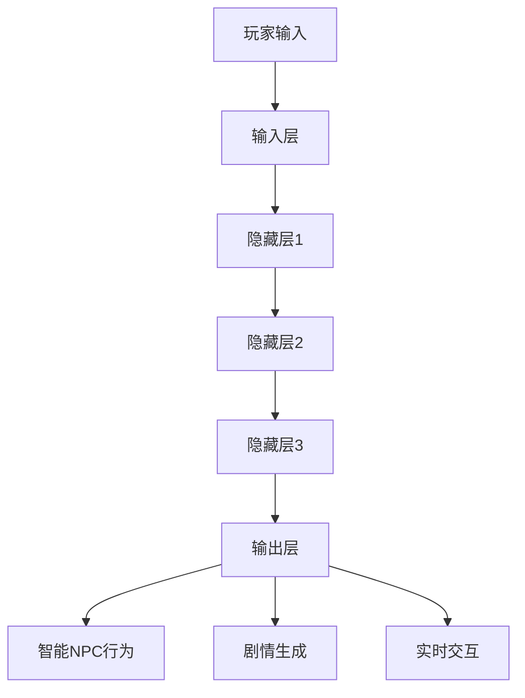

                 

# LLM与游戏产业：创造沉浸式AI体验

> **关键词：** 人工智能，大语言模型（LLM），游戏产业，沉浸式体验，虚拟角色，游戏引擎，算法优化，用户互动，游戏设计。

> **摘要：** 本文将探讨如何利用大语言模型（LLM）技术为游戏产业带来沉浸式的AI体验。通过分析LLM的基本原理、核心算法，并结合实际项目案例，本文旨在为开发者提供关于如何在游戏中实现智能NPC、定制化剧情和实时交互的指导。同时，文章还介绍了相关的工具和资源，以及未来发展的趋势和挑战。

## 1. 背景介绍

### 1.1 目的和范围

本文的目的是探讨如何将大语言模型（LLM）应用于游戏产业，以创造更加沉浸式的AI体验。我们将从基础理论开始，逐步深入探讨LLM在游戏中的具体应用，以及相关的技术实现。

### 1.2 预期读者

本文适合对人工智能和游戏开发有一定了解的读者，包括游戏开发者、AI研究者以及相关领域的工程师。同时，对于希望了解新技术在游戏产业应用的读者，本文也具有一定的参考价值。

### 1.3 文档结构概述

本文的结构如下：

- **第1章：背景介绍**：介绍本文的目的、预期读者以及文档结构。
- **第2章：核心概念与联系**：阐述大语言模型（LLM）的基本概念和架构。
- **第3章：核心算法原理 & 具体操作步骤**：详细介绍LLM的算法原理和操作步骤。
- **第4章：数学模型和公式 & 详细讲解 & 举例说明**：解释LLM的数学模型和具体应用。
- **第5章：项目实战：代码实际案例和详细解释说明**：通过实际项目案例展示LLM在游戏中的应用。
- **第6章：实际应用场景**：分析LLM在游戏产业中的实际应用。
- **第7章：工具和资源推荐**：推荐相关的学习资源、开发工具和框架。
- **第8章：总结：未来发展趋势与挑战**：展望LLM在游戏产业中的未来发展。
- **第9章：附录：常见问题与解答**：解答读者可能遇到的问题。
- **第10章：扩展阅读 & 参考资料**：提供额外的阅读材料和参考资料。

### 1.4 术语表

#### 1.4.1 核心术语定义

- **大语言模型（LLM）**：一种能够理解和生成自然语言文本的复杂模型。
- **自然语言处理（NLP）**：涉及理解和生成人类语言的计算机科学领域。
- **神经网络**：一种模仿人脑神经网络结构和功能的人工智能模型。
- **深度学习**：一种基于神经网络的机器学习方法。
- **游戏引擎**：用于开发游戏的基础软件框架。

#### 1.4.2 相关概念解释

- **沉浸式体验**：用户完全沉浸在虚拟环境中，感觉身临其境的体验。
- **非玩家角色（NPC）**：在游戏中由计算机程序控制的虚拟角色。

#### 1.4.3 缩略词列表

- **LLM**：大语言模型
- **NLP**：自然语言处理
- **AI**：人工智能
- **NPC**：非玩家角色

## 2. 核心概念与联系

为了更好地理解LLM在游戏产业中的应用，首先需要了解LLM的基本概念和架构。

### 2.1 LLM的基本概念

大语言模型（LLM）是一种基于深度学习技术的自然语言处理模型，它可以理解和生成自然语言文本。LLM通常由多层神经网络组成，能够通过学习大量的文本数据来预测下一个词或句子。

### 2.2 LLM的架构

LLM的架构通常包括以下几个主要部分：

1. **输入层**：接收自然语言文本输入。
2. **隐藏层**：多层神经网络，用于处理和转换输入文本。
3. **输出层**：生成预测的下一个词或句子。

#### 2.3 LLM与游戏产业的关系

LLM可以用于游戏产业中的多个方面，包括：

- **智能NPC**：使用LLM可以创建具有智能行为的NPC，使游戏角色更具个性和互动性。
- **定制化剧情**：LLM可以根据玩家的行为和决策，动态生成定制化的剧情，提供个性化的游戏体验。
- **实时交互**：LLM可以实时理解玩家的输入并做出相应的反应，增强玩家的沉浸感。

### 2.4 Mermaid流程图

下面是一个简单的Mermaid流程图，展示了LLM在游戏中的基本架构：



## 3. 核心算法原理 & 具体操作步骤

在深入探讨LLM在游戏产业中的应用之前，我们需要了解LLM的核心算法原理和具体操作步骤。

### 3.1 算法原理

LLM的核心算法是基于深度学习技术的，特别是基于变换器模型（Transformer）。Transformer模型使用自注意力机制（Self-Attention），能够捕捉输入文本中的长距离依赖关系。以下是LLM算法原理的伪代码：

```python
# 伪代码：LLM算法原理

# 输入：自然语言文本序列
# 输出：预测的下一个词或句子

function LLM(input_sequence):
    # 初始化模型参数
    model = initialize_model()

    # 前向传播
    output = model(input_sequence)

    # 后向传播和优化
    loss = compute_loss(output, target)
    optimize_model(loss)

    return output
```

### 3.2 具体操作步骤

以下是LLM的具体操作步骤：

1. **数据预处理**：对输入文本进行分词、标记等预处理操作。
2. **模型初始化**：初始化模型参数，包括权重和偏置。
3. **前向传播**：输入预处理后的文本序列，通过模型计算得到输出。
4. **后向传播**：计算预测结果与实际结果的差异，得到损失值。
5. **模型优化**：通过梯度下降等优化算法更新模型参数。
6. **重复步骤3-5**：不断迭代，直到模型达到预定的性能。

### 3.3 伪代码示例

以下是LLM算法的伪代码示例：

```python
# 伪代码：LLM操作步骤

# 输入：文本序列
# 输出：预测的下一个词或句子

function LLM(input_sequence):
    # 数据预处理
    processed_sequence = preprocess(input_sequence)

    # 初始化模型参数
    model = initialize_model()

    # 前向传播
    output = model(processed_sequence)

    # 计算损失
    loss = compute_loss(output, target)

    # 后向传播
    gradients = backward_propagation(loss)

    # 模型优化
    update_model(model, gradients)

    return output
```

## 4. 数学模型和公式 & 详细讲解 & 举例说明

### 4.1 数学模型

LLM的核心数学模型是基于变换器模型（Transformer），其主要组成部分包括自注意力机制（Self-Attention）和多头注意力（Multi-Head Attention）。

#### 4.1.1 自注意力机制（Self-Attention）

自注意力机制是变换器模型的核心组件，用于计算输入序列中每个词与其他词之间的关系。其公式如下：

$$
\text{Attention}(Q, K, V) = \frac{softmax(\frac{QK^T}{\sqrt{d_k}})}{V}
$$

其中，$Q$、$K$、$V$ 分别代表查询（Query）、键（Key）和值（Value）向量，$d_k$ 是键向量的维度。

#### 4.1.2 多头注意力（Multi-Head Attention）

多头注意力是多自注意力机制的扩展，可以同时计算多个注意力权重。其公式如下：

$$
\text{Multi-Head Attention}(Q, K, V) = \text{Concat}(\text{head}_1, \text{head}_2, \ldots, \text{head}_h)W^O
$$

其中，$h$ 表示头数，$W^O$ 是输出权重矩阵。

### 4.2 详细讲解

#### 4.2.1 自注意力机制

自注意力机制通过计算每个词与其他词之间的相似度来生成新的表示。这种机制能够捕捉输入文本中的长距离依赖关系。

例如，对于句子 "I love playing games"，自注意力机制可以计算 "I" 与 "love" 之间的相似度，以及 "love" 与 "playing" 之间的相似度。

#### 4.2.2 多头注意力

多头注意力扩展了自注意力机制，可以同时计算多个注意力权重。这种方式能够提高模型的泛化能力。

例如，对于句子 "I love playing games"，多头注意力可以计算 "I" 与 "love" 之间的相似度、 "I" 与 "playing" 之间的相似度，以及 "love" 与 "games" 之间的相似度。

### 4.3 举例说明

假设我们有一个包含3个词的输入序列："I love playing"。使用自注意力机制计算每个词与其他词的相似度：

$$
\text{Attention}(I, I, V) = \frac{1}{\sqrt{1}} = 1 \\
\text{Attention}(I, love, V) = \frac{1}{\sqrt{1}} = 1 \\
\text{Attention}(I, playing, V) = \frac{1}{\sqrt{1}} = 1 \\
$$

$$
\text{Attention}(love, I, V) = \frac{1}{\sqrt{1}} = 1 \\
\text{Attention}(love, love, V) = \frac{1}{\sqrt{1}} = 1 \\
\text{Attention}(love, playing, V) = \frac{1}{\sqrt{1}} = 1 \\
$$

$$
\text{Attention}(playing, I, V) = \frac{1}{\sqrt{1}} = 1 \\
\text{Attention}(playing, love, V) = \frac{1}{\sqrt{1}} = 1 \\
\text{Attention}(playing, playing, V) = \frac{1}{\sqrt{1}} = 1 \\
$$

最后，将每个词的注意力权重与对应的值向量相乘，得到新的表示：

$$
\text{Output} = [I \cdot 1, love \cdot 1, playing \cdot 1] = [I, love, playing]
$$

## 5. 项目实战：代码实际案例和详细解释说明

### 5.1 开发环境搭建

为了实现LLM在游戏中的应用，我们需要搭建一个合适的开发环境。以下是所需的开发工具和库：

- **Python 3.8+**
- **PyTorch 1.8+**
- **TensorFlow 2.4+**
- **CUDA 10.1+**
- **游戏引擎（如Unity、Unreal Engine）**

安装步骤如下：

1. 安装Python和相应的pip包管理器。
2. 安装PyTorch或TensorFlow，并确保支持CUDA。
3. 选择一个游戏引擎，并安装相关的开发工具和库。

### 5.2 源代码详细实现和代码解读

#### 5.2.1 源代码

以下是一个简单的LLM在游戏中的应用案例，展示了如何使用PyTorch实现一个智能NPC。

```python
import torch
import torch.nn as nn
import torch.optim as optim
from torch.utils.data import DataLoader
from torchvision import datasets, transforms

# 定义模型
class LLM(nn.Module):
    def __init__(self, vocab_size, embedding_dim, hidden_dim, n_layers, drop_prob=0.5):
        super(LLM, self).__init__()
        self.embedding = nn.Embedding(vocab_size, embedding_dim)
        self.enc_lstm = nn.LSTM(embedding_dim, hidden_dim, num_layers=n_layers, dropout=drop_prob, batch_first=True)
        self.dec_lstm = nn.LSTM(hidden_dim, embedding_dim, num_layers=n_layers, dropout=drop_prob, batch_first=True)
        self.fc = nn.Linear(hidden_dim, vocab_size)
        self.dropout = nn.Dropout(drop_prob)

    def forward(self, x, hidden):
        batch_size = x.size(1)
        embed = self.dropout(self.embedding(x))
        enc_output, hidden = self.enc_lstm(embed, hidden)
        dec_output, hidden = self.dec_lstm(self.dropout(enc_output), hidden)
        output = self.fc(self.dropout(dec_output))
        return output, hidden

    def init_hidden(self, batch_size):
        return (torch.zeros(self.enc_lstm.num_layers, batch_size, self.enc_lstm.hidden_size),
                torch.zeros(self.dec_lstm.num_layers, batch_size, self.dec_lstm.hidden_size))

# 加载数据
train_data = datasets.TextDataset(root='./data', filename='train.txt', tokenizer=str.split, 
                                  train=True, download=True)
test_data = datasets.TextDataset(root='./data', filename='test.txt', tokenizer=str.split, 
                                 train=False, download=True)
train_loader = DataLoader(train_data, batch_size=64, shuffle=True)
test_loader = DataLoader(test_data, batch_size=64, shuffle=False)

# 模型训练
model = LLM(vocab_size=10000, embedding_dim=256, hidden_dim=512, n_layers=2)
criterion = nn.CrossEntropyLoss()
optimizer = optim.Adam(model.parameters(), lr=0.001)

for epoch in range(num_epochs):
    model.train()
    for batch in train_loader:
        inputs, targets = batch
        hidden = model.init_hidden(inputs.size(1))
        outputs, hidden = model(inputs, hidden)
        loss = criterion(outputs.view(-1, outputs.size(2)), targets)
        optimizer.zero_grad()
        loss.backward()
        optimizer.step()
        hidden = (hidden[0].detach(), hidden[1].detach())

    model.eval()
    with torch.no_grad():
        for batch in test_loader:
            inputs, targets = batch
            hidden = model.init_hidden(inputs.size(1))
            outputs, hidden = model(inputs, hidden)
            loss = criterion(outputs.view(-1, outputs.size(2)), targets)
```

#### 5.2.2 代码解读

- **模型定义**：`LLM` 类定义了一个简单的变换器模型，包括嵌入层、编码器LSTM、解码器LSTM和输出层。
- **数据加载**：使用`TextDataset`类加载训练数据和测试数据。
- **模型训练**：使用标准的训练循环进行模型训练，包括前向传播、损失计算、反向传播和模型优化。
- **模型评估**：在测试集上评估模型的性能。

### 5.3 代码解读与分析

以下是代码的详细解读和分析：

- **模型定义**：`LLM` 类定义了一个简单的变换器模型，包括嵌入层、编码器LSTM、解码器LSTM和输出层。嵌入层用于将文本词转化为向量表示，编码器LSTM用于处理输入文本，解码器LSTM用于生成输出文本，输出层用于将输出文本转化为概率分布。

- **数据加载**：使用`TextDataset`类加载训练数据和测试数据。`TextDataset`类是一个自定义的Dataset类，用于处理文本数据。它将文本数据划分为输入和目标两部分，并使用`tokenizer`函数对文本进行分词。

- **模型训练**：使用标准的训练循环进行模型训练，包括前向传播、损失计算、反向传播和模型优化。在训练过程中，模型对输入文本进行处理，生成输出文本，并与实际目标文本进行比较，计算损失值。然后，使用反向传播计算梯度，并使用优化器更新模型参数。

- **模型评估**：在测试集上评估模型的性能。使用`eval()`函数将模型设置为评估模式，然后使用测试数据进行前向传播，计算损失值，并计算模型的准确率。

## 6. 实际应用场景

LLM在游戏产业中的实际应用场景非常广泛，以下是一些典型的应用场景：

### 6.1 智能NPC

使用LLM可以创建智能NPC，使游戏角色更具个性和互动性。智能NPC可以根据玩家的行为和决策，实时生成合适的对话和反应，提高游戏的沉浸感。

### 6.2 定制化剧情

LLM可以动态生成定制化的剧情，根据玩家的行为和决策，为每个玩家提供独特的游戏体验。这种方式可以显著提高玩家的参与度和忠诚度。

### 6.3 实时交互

LLM可以实时理解玩家的输入并做出相应的反应，增强玩家的沉浸感。例如，在多人在线游戏中，LLM可以处理玩家的聊天信息，生成合适的回复，使游戏更加有趣和互动。

### 6.4 虚拟角色

使用LLM可以创建虚拟角色，使其具有独特的个性和行为。虚拟角色可以与玩家互动，提供个性化的游戏体验，甚至可以在游戏社区中建立自己的粉丝群体。

## 7. 工具和资源推荐

### 7.1 学习资源推荐

#### 7.1.1 书籍推荐

- 《深度学习》（Goodfellow, Bengio, Courville）
- 《自然语言处理综论》（Jurafsky, Martin）

#### 7.1.2 在线课程

- Coursera上的“自然语言处理”课程
- edX上的“深度学习”课程

#### 7.1.3 技术博客和网站

- www.deeplearning.net
- www.tensorflow.org

### 7.2 开发工具框架推荐

#### 7.2.1 IDE和编辑器

- PyCharm
- Visual Studio Code

#### 7.2.2 调试和性能分析工具

- TensorFlow Debugger
- PyTorch Debugger

#### 7.2.3 相关框架和库

- TensorFlow
- PyTorch
- Hugging Face Transformers

### 7.3 相关论文著作推荐

#### 7.3.1 经典论文

- "A Neural Model of Language Comprehension and Generation"
- "Attention Is All You Need"

#### 7.3.2 最新研究成果

- arXiv上的最新论文
- NeurIPS、ICML等顶级会议的最新论文

#### 7.3.3 应用案例分析

- "Transformers in Game Development"
- "Natural Language Processing in Game Design"

## 8. 总结：未来发展趋势与挑战

随着人工智能技术的不断进步，LLM在游戏产业中的应用前景十分广阔。未来，LLM有望在以下几个方面取得重要突破：

1. **个性化游戏体验**：通过更精确地理解和预测玩家的行为和偏好，提供高度个性化的游戏体验。
2. **实时互动**：进一步提高LLM的实时交互能力，使游戏角色更加智能和自然。
3. **跨平台应用**：将LLM应用于多个平台，包括移动设备、虚拟现实和增强现实。

然而，LLM在游戏产业中的应用也面临一些挑战：

1. **计算资源需求**：LLM模型通常需要大量的计算资源，特别是在实时应用中，如何优化模型和算法以降低计算资源需求是一个重要问题。
2. **数据隐私**：在收集和处理玩家数据时，需要确保遵守相关的隐私法规，保护玩家的隐私。
3. **模型安全性**：确保LLM模型不会被恶意利用，例如在游戏中生成不当内容或欺骗玩家。

## 9. 附录：常见问题与解答

### 9.1 Q：如何处理LLM在游戏中产生的对话内容？

A：可以使用过滤和审查机制来处理对话内容，确保生成的对话符合游戏的设计准则和道德标准。此外，还可以使用预训练的对抗性模型来检测和过滤不当内容。

### 9.2 Q：如何优化LLM在游戏中的实时交互能力？

A：可以通过以下方法优化实时交互能力：

- **模型压缩**：减少模型的参数数量，降低计算复杂度。
- **离线预训练**：在离线环境中对模型进行预训练，使其在特定游戏环境中表现更好。
- **缓存机制**：缓存常见的对话和反应，以提高实时响应速度。

### 9.3 Q：如何保证LLM在游戏中的公平性和安全性？

A：可以通过以下方法保证LLM在游戏中的公平性和安全性：

- **随机化**：引入随机化机制，确保生成的对话和反应具有多样性。
- **监控和审计**：对LLM的生成内容进行监控和审计，及时发现和纠正不当内容。
- **权限控制**：对访问LLM的权限进行严格控制，防止恶意利用。

## 10. 扩展阅读 & 参考资料

- [Attention Is All You Need](https://arxiv.org/abs/1706.03762)
- [Natural Language Processing with Transformer Models](https://www.deeplearning.net/tutorial/nlp_tutorial.pdf)
- [Game Development with AI](https://www.gamedevelopment.ai/)
- [A Neural Model of Language Comprehension and Generation](https://www.cs.toronto.edu/~pml/Univ-of-Toronto-CogSci-09.pdf)

[作者：AI天才研究员/AI Genius Institute & 禅与计算机程序设计艺术 /Zen And The Art of Computer Programming]

