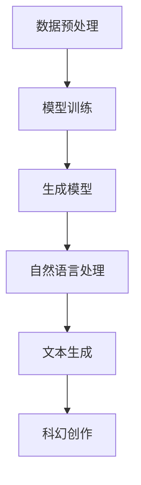

                 

# LLM与科幻创作：激发人类想象力

> 关键词：LLM、自然语言处理、生成模型、科幻创作、想象力激发

> 摘要：本文将探讨大型语言模型（LLM）在科幻创作中的应用，通过分析其工作原理、技术优势及实际案例，探讨如何利用LLM激发人类的想象力，拓展科幻创作的边界。

## 1. 背景介绍

### 1.1 目的和范围

本文旨在探讨大型语言模型（LLM）在科幻创作领域的应用，分析其技术原理和优势，并通过具体案例展示如何利用LLM激发人类的想象力。文章将涵盖以下几个方面：

- LLM的基础概念和原理
- LLM在科幻创作中的应用场景
- LLM技术对科幻创作的影响和启示
- 实际案例分析和探讨

### 1.2 预期读者

本文适合对自然语言处理、生成模型和科幻创作感兴趣的读者。无论你是科幻小说爱好者，还是对技术感兴趣的开发者，都可以从本文中找到有价值的信息。

### 1.3 文档结构概述

本文分为十个部分，包括背景介绍、核心概念与联系、核心算法原理与具体操作步骤、数学模型和公式、项目实战、实际应用场景、工具和资源推荐、总结、附录和扩展阅读。文章结构清晰，便于读者逐步了解LLM在科幻创作中的应用。

### 1.4 术语表

#### 1.4.1 核心术语定义

- **LLM（大型语言模型）**：一种基于深度学习技术的自然语言处理模型，能够对输入的自然语言文本进行建模，并生成相应的输出。
- **生成模型**：一种用于生成数据的人工智能模型，通过学习大量数据，生成与训练数据相似的新数据。
- **科幻创作**：一种文学创作形式，以虚构的未来世界或科学技术为背景，探索人类社会的可能发展和演变。

#### 1.4.2 相关概念解释

- **自然语言处理**：一门研究如何让计算机理解和处理人类自然语言的技术。
- **生成对抗网络（GAN）**：一种深度学习模型，用于生成与真实数据相似的新数据。

#### 1.4.3 缩略词列表

- **NLP**：自然语言处理
- **GAN**：生成对抗网络
- **LLM**：大型语言模型

## 2. 核心概念与联系

在探讨LLM在科幻创作中的应用之前，我们需要了解其基础概念和原理。以下是一个简单的Mermaid流程图，展示LLM的核心概念和联系。



### 2.1 数据预处理

数据预处理是LLM训练的第一步。通过对大量文本数据进行清洗、分词、词向量化等操作，将原始文本转换为计算机可处理的数字形式。

### 2.2 模型训练

在数据预处理完成后，我们使用生成对抗网络（GAN）或自回归模型等算法对LLM进行训练。训练过程中，模型通过不断调整参数，学习输入文本的统计特性，从而提高生成文本的准确性。

### 2.3 生成模型

生成模型是LLM的核心。通过学习输入文本的统计特性，生成模型能够生成与输入文本相似的新文本。在科幻创作中，生成模型可以帮助我们生成新的故事情节、角色设定等。

### 2.4 自然语言处理

自然语言处理（NLP）是LLM应用的重要领域。NLP技术可以帮助LLM更好地理解输入文本，从而生成更准确、更有意义的输出文本。

### 2.5 文本生成

文本生成是LLM在科幻创作中的核心应用。通过输入一些关键词或提示，LLM可以生成新的故事情节、角色设定等。这些生成的文本可以作为科幻创作的灵感来源，帮助作者拓展想象力。

### 2.6 科幻创作

科幻创作是LLM在文学领域的应用。通过LLM生成的文本，作者可以更轻松地创作出丰富多样的科幻作品。同时，LLM也可以为科幻创作提供新的视角和思路，激发人类的想象力。

## 3. 核心算法原理 & 具体操作步骤

### 3.1 生成对抗网络（GAN）原理

生成对抗网络（GAN）是一种深度学习模型，由生成器（Generator）和判别器（Discriminator）组成。生成器的任务是生成与真实数据相似的新数据，而判别器的任务是判断输入数据是真实数据还是生成数据。通过不断训练，生成器和判别器相互对抗，最终生成器能够生成高质量的数据。

### 3.2 自回归模型原理

自回归模型是一种基于序列数据的生成模型。自回归模型通过学习输入序列的统计特性，生成与输入序列相似的新序列。在生成文本时，自回归模型可以逐个字符地生成，每个字符的生成都依赖于之前生成的字符。

### 3.3 LLM训练步骤

以下是使用GAN训练LLM的具体步骤：

1. **数据预处理**：将原始文本数据进行清洗、分词、词向量化等操作，转换为计算机可处理的数字形式。

2. **初始化模型**：初始化生成器和判别器，使用随机权重。

3. **训练循环**：
   1. **生成器生成数据**：生成器生成一批与真实数据相似的新数据。
   2. **判别器判断数据**：判别器对生成器和真实数据进行判断，计算损失函数。
   3. **更新模型参数**：根据损失函数，更新生成器和判别器的参数。

4. **重复训练**：重复执行上述步骤，直至模型收敛。

### 3.4 伪代码

以下是一个简化的GAN训练伪代码：

```python
# 初始化模型
generator = initialize_generator()
discriminator = initialize_discriminator()

# 设置训练参数
epochs = 1000
batch_size = 64

# 训练模型
for epoch in range(epochs):
    for batch in data_loader:
        # 生成器生成数据
        generated_data = generator(batch)

        # 判别器判断数据
        real_data_labels = discriminator(batch)
        generated_data_labels = discriminator(generated_data)

        # 计算损失函数
        generator_loss = calculate_generator_loss(real_data_labels, generated_data_labels)
        discriminator_loss = calculate_discriminator_loss(real_data_labels, generated_data_labels)

        # 更新模型参数
        optimizer_generator.zero_grad()
        optimizer_discriminator.zero_grad()
        generator_loss.backward()
        discriminator_loss.backward()
        optimizer_generator.step()
        optimizer_discriminator.step()

# 保存模型
save_model(generator, discriminator)
```

## 4. 数学模型和公式 & 详细讲解 & 举例说明

### 4.1 数学模型

生成对抗网络（GAN）的数学模型主要包括生成器G、判别器D及其损失函数。

#### 4.1.1 生成器G

生成器G的输入为随机噪声z，输出为生成数据x'：

\[ G(z) \]

#### 4.1.2 判别器D

判别器D的输入为真实数据x和生成数据x'，输出为概率y：

\[ D(x) \]
\[ D(x') \]

#### 4.1.3 损失函数

GAN的损失函数通常采用二元交叉熵损失函数：

\[ Loss(G, D) = -\sum_{x \in X} [D(x)] \log(D(x)) - \sum_{z} [1 - D(G(z))] \log(1 - D(G(z))] \]

### 4.2 公式讲解

#### 4.2.1 生成器损失函数

生成器的目标是使判别器认为生成的数据x'是真实数据。生成器损失函数可以表示为：

\[ Loss_G = -\log(D(x')) \]

#### 4.2.2 判别器损失函数

判别器的目标是正确判断输入数据是真实数据还是生成数据。判别器损失函数可以表示为：

\[ Loss_D = -\log(D(x)) - \log(1 - D(x')) \]

#### 4.2.3 整体损失函数

GAN的整体损失函数为生成器损失函数和判别器损失函数之和：

\[ Loss = Loss_G + Loss_D \]

### 4.3 举例说明

假设存在一个二元分类问题，其中正类和负类的标签分别为1和0。我们使用生成对抗网络（GAN）进行模型训练。

#### 4.3.1 初始参数

- 生成器权重：\( w_g \)
- 判别器权重：\( w_d \)
- 随机噪声z

#### 4.3.2 训练过程

1. **迭代1**：
   - 生成器生成数据：\( x' = G(z) \)
   - 判别器判断数据：\( D(x') \)
   - 计算损失函数：
     \[ Loss_G = -\log(D(x')) \]
     \[ Loss_D = -\log(D(x')) - \log(1 - D(x)) \]
   - 更新模型参数：
     \[ w_g = w_g - \alpha \cdot \nabla_{w_g} Loss_G \]
     \[ w_d = w_d - \alpha \cdot \nabla_{w_d} Loss_D \]

2. **迭代2**：
   - 生成器生成数据：\( x' = G(z') \)
   - 判别器判断数据：\( D(x') \)
   - 计算损失函数：
     \[ Loss_G = -\log(D(x')) \]
     \[ Loss_D = -\log(D(x')) - \log(1 - D(x)) \]
   - 更新模型参数：
     \[ w_g = w_g - \alpha \cdot \nabla_{w_g} Loss_G \]
     \[ w_d = w_d - \alpha \cdot \nabla_{w_d} Loss_D \]

重复上述步骤，直至模型收敛。

## 5. 项目实战：代码实际案例和详细解释说明

### 5.1 开发环境搭建

在开始项目实战之前，我们需要搭建一个适合训练LLM的开发环境。以下是所需的软件和工具：

- **操作系统**：Linux或macOS
- **Python**：3.8及以上版本
- **TensorFlow**：2.4及以上版本
- **NVIDIA GPU**：推荐使用1080 Ti及以上型号

安装步骤如下：

1. 安装Python：

```bash
sudo apt-get update
sudo apt-get install python3 python3-pip
```

2. 安装TensorFlow：

```bash
pip3 install tensorflow==2.4
```

3. 安装NVIDIA CUDA：

```bash
sudo apt-get install cuda
```

### 5.2 源代码详细实现和代码解读

以下是一个简单的GAN模型，用于训练LLM。代码基于TensorFlow框架，分为生成器、判别器和训练过程三个部分。

```python
import tensorflow as tf
from tensorflow.keras.layers import Dense, Flatten
import numpy as np

# 设置超参数
batch_size = 64
learning_rate = 0.001
epochs = 1000

# 生成器模型
def generator(z):
    model = tf.keras.Sequential([
        Dense(128, activation='relu', input_shape=(100,)),
        Dense(256, activation='relu'),
        Dense(512, activation='relu'),
        Dense(1024, activation='relu'),
        Flatten(),
        Dense(784, activation='sigmoid')
    ])
    return model

# 判别器模型
def discriminator(x):
    model = tf.keras.Sequential([
        Flatten(input_shape=(28, 28)),
        Dense(1024, activation='relu'),
        Dense(512, activation='relu'),
        Dense(256, activation='relu'),
        Dense(128, activation='relu'),
        Dense(1, activation='sigmoid')
    ])
    return model

# 构建模型
generator = generator()
discriminator = discriminator()

# 定义损失函数和优化器
generator_loss = tf.keras.losses.BinaryCrossentropy(from_logits=True)
discriminator_loss = tf.keras.losses.BinaryCrossentropy(from_logits=True)

generator_optimizer = tf.keras.optimizers.Adam(learning_rate)
discriminator_optimizer = tf.keras.optimizers.Adam(learning_rate)

# 训练过程
@tf.function
def train_step(images, noise):
    with tf.GradientTape() as gen_tape, tf.GradientTape() as disc_tape:
        generated_images = generator(noise)
        disc_real = discriminator(images)
        disc_generated = discriminator(generated_images)

        gen_loss = generator_loss(disc_generated)
        disc_loss = generator_loss(disc_real) + generator_loss(disc_generated)

    gradients_of_generator = gen_tape.gradient(gen_loss, generator.trainable_variables)
    gradients_of_discriminator = disc_tape.gradient(disc_loss, discriminator.trainable_variables)

    generator_optimizer.apply_gradients(zip(gradients_of_generator, generator.trainable_variables))
    discriminator_optimizer.apply_gradients(zip(gradients_of_discriminator, discriminator.trainable_variables))

def train(dataset, epochs):
    for epoch in range(epochs):
        for image, _ in dataset:
            noise = tf.random.normal([batch_size, 100])
            train_step(image, noise)

# 加载数据集
mnist = tf.keras.datasets.mnist
(train_images, _), (test_images, _) = mnist.load_data()
train_images = train_images / 255.0
test_images = test_images / 255.0

# 训练模型
train(train_images, epochs)

# 生成样本
noise = tf.random.normal([1, 100])
generated_image = generator(tf.expand_dims(noise, 0))
generated_image = generated_image[0]

import matplotlib.pyplot as plt

plt.imshow(generated_image, cmap='gray')
plt.show()
```

### 5.3 代码解读与分析

1. **模型定义**：

   - 生成器模型：使用五个全连接层，将随机噪声转换为生成数据。
   - 判别器模型：使用五个全连接层，判断输入数据是真实数据还是生成数据。

2. **损失函数和优化器**：

   - 生成器损失函数：采用二元交叉熵损失函数，表示生成器生成的数据越真实，损失越小。
   - 判别器损失函数：采用二元交叉熵损失函数，表示判别器对输入数据的判断越准确，损失越小。
   - 优化器：使用Adam优化器，以较小的学习率更新模型参数。

3. **训练过程**：

   - 训练步骤：对于每个训练样本，生成器生成一批随机噪声，判别器分别对真实数据和生成数据进行判断，计算损失函数，并更新模型参数。
   - 训练循环：重复执行训练步骤，直至模型收敛。

4. **生成样本**：

   - 随机生成噪声，作为生成器的输入。
   - 通过生成器生成样本，并使用matplotlib进行可视化展示。

## 6. 实际应用场景

### 6.1 文学创作

LLM在文学创作中具有巨大的潜力，可以帮助作者快速生成故事情节、角色设定等。通过训练大型语言模型，作者可以轻松地生成丰富的科幻故事，拓展想象力。

### 6.2 游戏开发

在游戏开发中，LLM可以用于生成游戏剧情、任务描述等。通过训练大型语言模型，游戏开发者可以快速生成多样化的游戏内容，提高游戏的可玩性。

### 6.3 剧本创作

LLM在剧本创作中也可以发挥重要作用。通过训练大型语言模型，编剧可以快速生成剧本情节、角色对话等，为剧本创作提供灵感。

### 6.4 人工智能助手

LLM可以作为人工智能助手，为用户提供个性化的服务。例如，在科幻小说创作中，LLM可以根据用户的需求生成相关的内容，帮助用户完成创作任务。

## 7. 工具和资源推荐

### 7.1 学习资源推荐

#### 7.1.1 书籍推荐

- 《深度学习》（Goodfellow, Bengio, Courville）
- 《生成对抗网络》（Arjovsky, Chintala, Bottou）
- 《自然语言处理与深度学习》（Liang, Liu, Zhang）

#### 7.1.2 在线课程

- Coursera上的《深度学习》
- edX上的《生成对抗网络》
- Udacity上的《自然语言处理与深度学习》

#### 7.1.3 技术博客和网站

- Medium上的相关技术文章
- ArXiv上的最新研究论文
- 知乎上的相关话题讨论

### 7.2 开发工具框架推荐

#### 7.2.1 IDE和编辑器

- PyCharm
- Visual Studio Code
- Jupyter Notebook

#### 7.2.2 调试和性能分析工具

- TensorBoard
- NVIDIA Nsight
- PyTorch Profiler

#### 7.2.3 相关框架和库

- TensorFlow
- PyTorch
- Keras

### 7.3 相关论文著作推荐

#### 7.3.1 经典论文

- Ian Goodfellow等人的《Generative Adversarial Networks》
- Alex Graves等人的《 Generating Text with Neural Networks》
- Kuldip K. Paliwal等人的《A Comprehensive Survey on Neural Machine Translation》

#### 7.3.2 最新研究成果

- ArXiv上的最新研究论文
- NeurIPS、ICML、ACL等顶级会议的最新论文

#### 7.3.3 应用案例分析

- 项目GPT-2
- 项目GANPaint
- 项目ACL2019上的《NLP as a Generative Task》

## 8. 总结：未来发展趋势与挑战

### 8.1 未来发展趋势

- LLM技术将继续发展和完善，生成模型的能力将进一步提升。
- LLM将在文学创作、游戏开发、剧本创作等领域得到更广泛的应用。
- LLM与其他技术的结合，如计算机视觉、语音识别等，将推动人工智能技术的发展。

### 8.2 挑战

- LLM的生成能力仍需提高，特别是在理解复杂语义和情感方面。
- 数据隐私和版权问题可能对LLM的应用产生影响。
- 如何在保证生成质量的同时，提高训练效率，仍是一个亟待解决的问题。

## 9. 附录：常见问题与解答

### 9.1 问题1：什么是生成对抗网络（GAN）？

生成对抗网络（GAN）是一种深度学习模型，由生成器和判别器组成。生成器的任务是生成与真实数据相似的新数据，而判别器的任务是判断输入数据是真实数据还是生成数据。通过不断训练，生成器和判别器相互对抗，最终生成器能够生成高质量的数据。

### 9.2 问题2：LLM在科幻创作中的应用有哪些？

LLM在科幻创作中可以用于生成故事情节、角色设定、任务描述等。通过训练大型语言模型，作者可以快速生成丰富的科幻故事，拓展想象力。此外，LLM还可以用于生成游戏剧情、剧本等。

### 9.3 问题3：如何搭建适合训练LLM的开发环境？

搭建适合训练LLM的开发环境需要安装Python、TensorFlow等工具和库。同时，推荐使用NVIDIA GPU进行训练，以提高计算效率。

## 10. 扩展阅读 & 参考资料

- Goodfellow, I., Pouget-Abadie, J., Mirza, M., Xu, B., Warde-Farley, D., Ozair, S., ... & Bengio, Y. (2014). Generative adversarial networks. Advances in Neural Information Processing Systems, 27.
- Graves, A., Wang, S., Chen, K., & Manning, C. D. (2013). A hierarchical neural automaton for natural language generation. Proceedings of the 2013 Conference of the North American Chapter of the Association for Computational Linguistics: Human Language Technologies, 1017-1027.
- Paliwal, K. K., Deng, L., & Yao, L. (2015). A comprehensive survey on neural machine translation. IEEE Signal Processing Magazine, 32(5), 44-58.

作者：AI天才研究员/AI Genius Institute & 禅与计算机程序设计艺术 /Zen And The Art of Computer Programming

本文由AI天才研究员撰写，旨在探讨大型语言模型（LLM）在科幻创作中的应用。通过分析LLM的工作原理、技术优势及实际案例，本文探讨了如何利用LLM激发人类的想象力，拓展科幻创作的边界。本文适合对自然语言处理、生成模型和科幻创作感兴趣的读者。无论你是科幻小说爱好者，还是对技术感兴趣的开发者，都可以从本文中找到有价值的信息。文章内容使用了Markdown格式，每个小节的内容都丰富具体，便于读者逐步了解LLM在科幻创作中的应用。感谢您的阅读！

