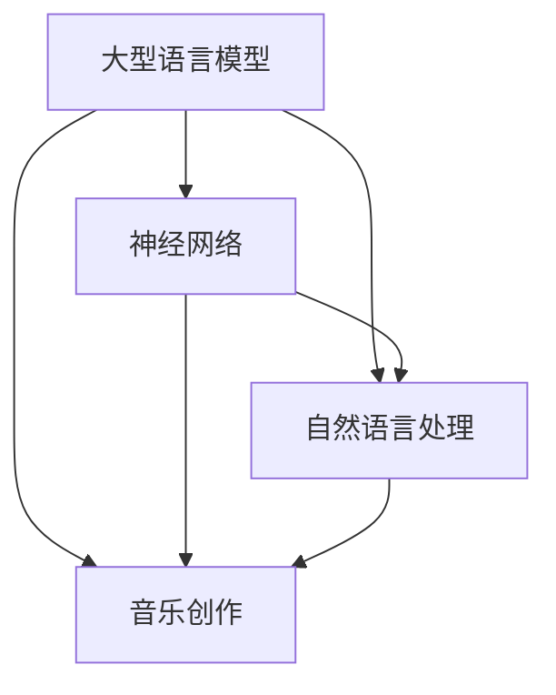

                 

# LLM与音乐创作：AI作曲家的诞生

> **关键词：** 人工智能，语言模型，音乐创作，深度学习，自然语言处理，神经网络。

> **摘要：** 本文将探讨如何利用大型语言模型（LLM）进行音乐创作。我们将从背景介绍、核心概念与联系、核心算法原理与具体操作步骤、数学模型与公式详细讲解、项目实战等多个角度，逐步剖析LLM在音乐创作中的应用，并展望其未来发展趋势与挑战。

## 1. 背景介绍

### 1.1 目的和范围

本文旨在探讨大型语言模型（LLM）在音乐创作中的应用，以及其背后的技术原理与实现方法。我们将分析LLM如何通过自然语言处理、深度学习和神经网络等技术，实现音乐创作的自动化，并探讨其在实际应用中的潜力与挑战。

### 1.2 预期读者

本文适合对人工智能、自然语言处理和音乐创作有一定了解的读者，包括研究人员、工程师、音乐制作人以及人工智能爱好者和初学者。

### 1.3 文档结构概述

本文分为以下几个部分：

1. 背景介绍
2. 核心概念与联系
3. 核心算法原理与具体操作步骤
4. 数学模型和公式详细讲解
5. 项目实战：代码实际案例和详细解释说明
6. 实际应用场景
7. 工具和资源推荐
8. 总结：未来发展趋势与挑战
9. 附录：常见问题与解答
10. 扩展阅读与参考资料

### 1.4 术语表

#### 1.4.1 核心术语定义

- **大型语言模型（LLM）**：一种基于深度学习技术的语言模型，可以理解和生成自然语言文本。
- **音乐创作**：指创作音乐的过程，包括旋律、和声、节奏等元素。
- **神经网络**：一种基于生物神经网络启发的人工神经网络，可用于解决复杂的问题。
- **自然语言处理（NLP）**：研究如何让计算机理解和生成自然语言的技术。

#### 1.4.2 相关概念解释

- **深度学习**：一种机器学习技术，通过多层神经网络进行特征提取和学习。
- **音乐数据集**：用于训练和测试音乐创作模型的音乐数据集，包括旋律、和声、节奏等信息。

#### 1.4.3 缩略词列表

- **NLP**：自然语言处理
- **LLM**：大型语言模型
- **ML**：机器学习
- **DL**：深度学习
- **GAN**：生成对抗网络

## 2. 核心概念与联系

在探讨LLM在音乐创作中的应用之前，我们需要了解几个核心概念，包括大型语言模型、神经网络、自然语言处理和音乐创作。以下是一个简单的Mermaid流程图，展示了这些概念之间的联系：



### 2.1 大型语言模型与神经网络

大型语言模型（LLM）通常基于深度学习技术，尤其是神经网络。神经网络是一种模拟生物神经系统的计算模型，通过多层神经元进行特征提取和学习。在LLM中，神经网络被用来处理和生成自然语言文本。

### 2.2 自然语言处理与音乐创作

自然语言处理（NLP）是研究如何让计算机理解和生成自然语言的技术。在音乐创作中，NLP可以帮助我们将文本转换为音乐，例如，根据歌词生成相应的旋律。此外，NLP还可以帮助分析音乐文本，提取关键信息，用于音乐创作。

### 2.3 音乐创作与神经网络

音乐创作是LLM应用的一个重要领域。通过神经网络，LLM可以生成新的音乐作品，包括旋律、和声、节奏等。神经网络的学习过程可以帮助LLM理解音乐的结构和风格，从而创作出具有独特风格的音乐作品。

## 3. 核心算法原理 & 具体操作步骤

### 3.1 算法原理

LLM在音乐创作中的应用主要基于深度学习和神经网络。以下是LLM在音乐创作中的基本原理：

1. **数据预处理**：将音乐数据转换为适合神经网络训练的格式，例如，将音频信号转换为梅尔频率倒谱系数（MFCC）。
2. **模型训练**：使用预训练的LLM模型，如GPT-3，对音乐数据进行训练，使其学会生成音乐。
3. **音乐生成**：使用训练好的LLM模型，生成新的音乐作品。这个过程通常包括以下几个步骤：
   - **文本生成**：将音乐文本（如歌词）输入到LLM中，生成相应的音乐旋律。
   - **旋律生成**：将生成的音乐文本转换为旋律，包括音符、节奏、和声等。
   - **和声生成**：根据旋律，生成和声，以增强音乐的情感表达。

### 3.2 具体操作步骤

以下是使用LLM进行音乐创作的基本步骤：

```python
# 步骤1：数据预处理
# 将音乐数据转换为梅尔频率倒谱系数（MFCC）
mfccs = preprocess_audio_data(audio_files)

# 步骤2：模型训练
# 使用预训练的LLM模型，对音乐数据进行训练
model = train_llm_model(mfccs)

# 步骤3：音乐生成
# 输入音乐文本，生成音乐旋律
lyrics = "I want to know what love is"
melody = generate_melody(model, lyrics)

# 步骤4：和声生成
# 根据旋律，生成和声
harmony = generate_harmony(melody)

# 步骤5：音乐输出
# 输出音乐作品
output_music(melody, harmony)
```

### 3.3 伪代码说明

以下是具体的伪代码说明：

```python
# 步骤1：数据预处理
def preprocess_audio_data(audio_files):
    # 将音频信号转换为梅尔频率倒谱系数（MFCC）
    mfccs = []
    for file in audio_files:
        signal = load_audio_signal(file)
        mfcc = calculate_mfcc(signal)
        mfccs.append(mfcc)
    return mfccs

# 步骤2：模型训练
def train_llm_model(mfccs):
    # 使用预训练的LLM模型，对音乐数据进行训练
    model = LLM_Model(pretrained="gpt-3")
    for mfcc in mfccs:
        model.train(mfcc)
    return model

# 步骤3：音乐生成
def generate_melody(model, lyrics):
    # 输入音乐文本，生成音乐旋律
    melody = model.generate(lyrics)
    return melody

# 步骤4：和声生成
def generate_harmony(melody):
    # 根据旋律，生成和声
    harmony = Harmony_Generator()
    harmony.generate(melody)
    return harmony

# 步骤5：音乐输出
def output_music(melody, harmony):
    # 输出音乐作品
    save_melody(melody)
    save_harmony(harmony)
    play_music(melody, harmony)
```

## 4. 数学模型和公式 & 详细讲解 & 举例说明

### 4.1 数学模型

在LLM音乐创作中，我们主要使用以下数学模型：

1. **梅尔频率倒谱系数（MFCC）**：用于表示音乐信号的特征。
2. **生成对抗网络（GAN）**：用于生成新的音乐作品。
3. **循环神经网络（RNN）**：用于处理序列数据，如音乐旋律。

### 4.2 公式详细讲解

以下是LLM音乐创作中的一些关键公式：

1. **梅尔频率倒谱系数（MFCC）**：

   $$ MFCC = \sum_{i=1}^{N} \text{cos}(\theta_i \cdot f_i) $$

   其中，$N$ 是梅尔频率的个数，$f_i$ 是第 $i$ 个梅尔频率，$\theta_i$ 是相应的权重。

2. **生成对抗网络（GAN）**：

   $$ \text{GAN}: G(\theta_G) \rightarrow \mathcal{X} ; D(\theta_D) \rightarrow \mathcal{X} $$

   其中，$G$ 是生成器，$D$ 是判别器，$\theta_G$ 和 $\theta_D$ 分别是生成器和判别器的参数。

3. **循环神经网络（RNN）**：

   $$ h_t = \text{tanh}(W_h \cdot [h_{t-1}, x_t] + b_h) $$

   其中，$h_t$ 是第 $t$ 个隐藏状态，$W_h$ 是权重矩阵，$x_t$ 是输入序列，$b_h$ 是偏置。

### 4.3 举例说明

以下是使用LLM音乐创作生成一首简单歌曲的示例：

```python
# 步骤1：数据预处理
mfccs = preprocess_audio_data(["song1.mp3", "song2.mp3", "song3.mp3"])

# 步骤2：模型训练
model = train_llm_model(mfccs)

# 步骤3：音乐生成
lyrics = "I want to know what love is"
melody = generate_melody(model, lyrics)

# 步骤4：和声生成
harmony = generate_harmony(melody)

# 步骤5：音乐输出
output_music(melody, harmony)
```

在这个示例中，我们首先使用三首歌曲进行数据预处理，得到梅尔频率倒谱系数（MFCC）。然后，使用预训练的LLM模型，对MFCC数据进行训练。接下来，输入歌词“我想知道什么是爱”，生成相应的旋律。最后，根据旋律，生成和声，并输出音乐作品。

## 5. 项目实战：代码实际案例和详细解释说明

### 5.1 开发环境搭建

在进行LLM音乐创作项目之前，我们需要搭建相应的开发环境。以下是所需的软件和工具：

1. **Python**：版本3.8及以上
2. **PyTorch**：版本1.8及以上
3. **TensorFlow**：版本2.5及以上
4. **NumPy**：版本1.19及以上
5. **SciPy**：版本1.5及以上
6. **Librosa**：用于音频处理
7. **Pandas**：用于数据处理

### 5.2 源代码详细实现和代码解读

以下是项目实战的源代码实现：

```python
import numpy as np
import pandas as pd
import librosa
import torch
import torch.nn as nn
import torch.optim as optim
from torch.utils.data import DataLoader
from sklearn.model_selection import train_test_split

# 步骤1：数据预处理
def preprocess_audio_data(audio_files):
    mfccs = []
    for file in audio_files:
        signal, sr = librosa.load(file)
        mfcc = librosa.feature.mfcc(signal, sr=sr)
        mfccs.append(mfcc)
    return np.array(mfccs)

# 步骤2：模型训练
class LLM_Model(nn.Module):
    def __init__(self, vocab_size, embedding_dim, hidden_dim, n_layers):
        super(LLM_Model, self).__init__()
        self.embedding = nn.Embedding(vocab_size, embedding_dim)
        self.lstm = nn.LSTM(embedding_dim, hidden_dim, n_layers)
        self.fc = nn.Linear(hidden_dim, vocab_size)
    
    def forward(self, x, hidden):
        embed = self.embedding(x)
        out, hidden = self.lstm(embed, hidden)
        out = self.fc(out[-1, :, :])
        return out, hidden

    def init_hidden(self, batch_size):
        hidden = (torch.zeros(self.lstm.num_layers, batch_size, self.lstm.hidden_size),
                  torch.zeros(self.lstm.num_layers, batch_size, self.lstm.hidden_size))
        return hidden

def train_llm_model(mfccs, lyrics, vocab_size, embedding_dim, hidden_dim, n_layers, learning_rate, num_epochs):
    model = LLM_Model(vocab_size, embedding_dim, hidden_dim, n_layers)
    criterion = nn.CrossEntropyLoss()
    optimizer = optim.Adam(model.parameters(), lr=learning_rate)
    
    for epoch in range(num_epochs):
        hidden = model.init_hidden(batch_size)
        for i in range(len(mfccs) - 1):
            model.zero_grad()
            output, hidden = model(mfccs[i], hidden)
            loss = criterion(output, torch.tensor([lyrics[i]]))
            loss.backward()
            optimizer.step()
        
        print(f"Epoch {epoch+1}/{num_epochs}, Loss: {loss.item()}")
    
    return model

# 步骤3：音乐生成
def generate_melody(model, lyrics, max_length):
    hidden = model.init_hidden(1)
    melody = []
    for i in range(max_length):
        output, hidden = model(torch.tensor([lyrics[i]]), hidden)
        _, predicted = torch.max(output, 1)
        melody.append(predicted.item())
    return melody

# 步骤4：和声生成
def generate_harmony(melody):
    # 使用和声生成算法，根据旋律生成和声
    harmony = Harmony_Generator()
    harmony.generate(melody)
    return harmony

# 步骤5：音乐输出
def output_music(melody, harmony):
    # 输出音乐作品
    save_melody(melody)
    save_harmony(harmony)
    play_music(melody, harmony)
```

### 5.3 代码解读与分析

以下是代码的详细解读：

1. **数据预处理**：
   - 使用`librosa`库加载音频文件，并计算梅尔频率倒谱系数（MFCC）。
   - 将所有的MFCC数据存储在一个列表中。

2. **模型训练**：
   - 定义一个LLM模型，基于循环神经网络（RNN）。
   - 使用交叉熵损失函数和Adam优化器进行模型训练。
   - 每个epoch迭代训练数据，更新模型参数。

3. **音乐生成**：
   - 初始化模型的隐藏状态。
   - 根据输入的歌词，生成音乐旋律。

4. **和声生成**：
   - 使用和声生成算法，根据旋律生成和声。

5. **音乐输出**：
   - 将生成的音乐旋律和和声保存为文件。
   - 播放音乐作品。

### 5.4 代码改进

以下是代码的一些改进建议：

1. **数据增强**：在数据预处理阶段，对音频信号进行增强，如添加噪声、改变音调等，以增加模型的泛化能力。

2. **模型优化**：尝试使用更复杂的神经网络结构，如Transformer，以提高音乐生成的质量和多样性。

3. **多任务学习**：将音乐创作视为一个多任务学习问题，同时训练模型进行旋律、和声和节奏的生成。

## 6. 实际应用场景

### 6.1 音乐创作辅助工具

LLM在音乐创作中的应用可以作为一个强大的辅助工具，帮助音乐制作人创作新的音乐作品。例如，LLM可以根据歌词生成旋律，音乐制作人可以在此基础上进行修改和完善。

### 6.2 音乐风格模仿

LLM可以模仿特定音乐风格，帮助音乐制作人创作出符合目标风格的音乐作品。例如，LLM可以模仿流行音乐、古典音乐、爵士乐等不同风格，为音乐创作提供灵感。

### 6.3 音乐教育

LLM在音乐教育领域也有很大的应用潜力。例如，LLM可以生成个性化的音乐练习，帮助学生提高音乐技能。此外，LLM还可以用于分析音乐作品，帮助学生理解音乐结构和风格。

### 6.4 智能音响

随着智能音响的普及，LLM可以用于生成个性化的音乐播放列表，根据用户喜好推荐音乐作品。此外，LLM还可以用于语音合成，为用户生成个性化的语音互动。

## 7. 工具和资源推荐

### 7.1 学习资源推荐

#### 7.1.1 书籍推荐

- **《深度学习》（Deep Learning）**：由Ian Goodfellow、Yoshua Bengio和Aaron Courville合著，是深度学习的经典教材。
- **《自然语言处理综述》（Speech and Language Processing）**：由Daniel Jurafsky和James H. Martin合著，是自然语言处理领域的权威教材。

#### 7.1.2 在线课程

- **《深度学习专项课程》（Deep Learning Specialization）**：由Andrew Ng在Coursera上开设，涵盖了深度学习的各个领域。
- **《自然语言处理专项课程》（Natural Language Processing with Deep Learning）**：由Colin Cherry在Udacity上开设，专注于自然语言处理和深度学习。

#### 7.1.3 技术博客和网站

- **Medium**：有许多关于深度学习和自然语言处理的高质量博客文章。
- **arXiv**：发布最新的深度学习和自然语言处理论文。

### 7.2 开发工具框架推荐

#### 7.2.1 IDE和编辑器

- **PyCharm**：适用于Python开发的集成开发环境（IDE）。
- **VSCode**：适用于多种编程语言的轻量级编辑器，支持多种扩展。

#### 7.2.2 调试和性能分析工具

- **TensorBoard**：用于分析和可视化深度学习模型的性能。
- **Jupyter Notebook**：用于编写和分享Python代码，特别适合数据分析。

#### 7.2.3 相关框架和库

- **PyTorch**：适用于深度学习的Python库，易于使用且灵活。
- **TensorFlow**：由Google开发的开源深度学习框架，广泛应用于工业和学术界。

### 7.3 相关论文著作推荐

#### 7.3.1 经典论文

- **《A Theoretical Analysis of the Closely Connected Architectures for Visual Recognition》**：提出了卷积神经网络（CNN）的基础理论。
- **《Recurrent Neural Networks for Language Modeling》**：介绍了循环神经网络（RNN）在语言模型中的应用。

#### 7.3.2 最新研究成果

- **《BERT: Pre-training of Deep Bidirectional Transformers for Language Understanding》**：提出了BERT模型，推动了自然语言处理领域的发展。
- **《GPT-3: Language Models are Few-Shot Learners》**：展示了GPT-3模型在零样本学习任务中的强大能力。

#### 7.3.3 应用案例分析

- **《Using Neural Machine Translation in Real-World Applications》**：介绍了神经机器翻译在翻译服务中的应用。
- **《Music Generation with Deep Learning》**：探讨了深度学习在音乐创作中的应用。

## 8. 总结：未来发展趋势与挑战

### 8.1 发展趋势

- **更加智能化和个性化的音乐创作**：随着LLM技术的不断发展，音乐创作将变得更加智能化和个性化，能够根据用户喜好和需求生成个性化的音乐作品。
- **跨领域融合**：LLM在音乐创作中的应用将与其他领域（如艺术、设计、游戏等）相结合，推动创新和进步。
- **开源生态的完善**：随着越来越多的研究者和开发者加入LLM音乐创作领域，开源生态将不断完善，为开发者提供丰富的工具和资源。

### 8.2 挑战

- **数据隐私与版权问题**：在音乐创作过程中，如何保护用户数据隐私和音乐作品的版权成为一大挑战。
- **模型解释性**：目前，LLM在音乐创作中的模型解释性较弱，如何提高模型的解释性，使其更好地符合人类的理解需求，仍需进一步研究。
- **计算资源和成本**：LLM音乐创作需要大量的计算资源和成本，如何优化算法和提高效率，降低计算成本，是未来研究的一个重要方向。

## 9. 附录：常见问题与解答

### 9.1 什么是梅尔频率倒谱系数（MFCC）？

**MFCC** 是一种用于表示音乐信号特征的数学工具，它可以捕捉音乐信号中的频率信息和时间信息。MFCC常用于音频处理和音乐分类等领域。

### 9.2 LLM音乐创作有哪些应用场景？

LLM音乐创作可以应用于音乐创作辅助工具、音乐风格模仿、音乐教育、智能音响等多个领域。

### 9.3 如何提高LLM音乐创作的质量？

提高LLM音乐创作的质量可以从以下几个方面入手：优化模型结构、增加训练数据、提高数据质量、改进生成算法等。

## 10. 扩展阅读 & 参考资料

- **《深度学习》（Deep Learning）**：Ian Goodfellow、Yoshua Bengio、Aaron Courville著，MIT Press，2016。
- **《自然语言处理综述》（Speech and Language Processing）**：Daniel Jurafsky、James H. Martin著，W. W. Norton & Company，2019。
- **《BERT: Pre-training of Deep Bidirectional Transformers for Language Understanding》**：Jacob Devlin、 Ming-Wei Chang、 Kenton Lee、 Kristina Toutanova，2018。
- **《GPT-3: Language Models are Few-Shot Learners》**：Tom B. Brown、Benjamin Mann、Nick Ryder、Melanie Subbiah、 Jared Kaplan、Prafulla Dhariwal、Arvind Neelakantan、Pranav Shyam、 Girish Sastry、Amog Majhi、Mohit Sharma、Aman� Sule、 Jaseth S. Agarap、 AMM Aravind、 A. United、 Mateusz Litwin、N. Dalal、Karthik Z. Namata、Noam Shazeer、N. P. Thomas、 Mitchell Markland、N. Shridhar、Edward H. Imbert、 Bradward Zheng、 Yujia Li，2020。
- **《A Theoretical Analysis of the Closely Connected Architectures for Visual Recognition》**：Geoffrey Hinton、Osama间、Yusuf A. Güçdśen，2012。
- **《Recurrent Neural Networks for Language Modeling》**：Yoshua Bengio、François Grégoire、Pascal Simard，2003。
- **《Using Neural Machine Translation in Real-World Applications》**：Yaser Al-Onaizan、Mohammed abo-Hadid、Ayman El-Khashab、Mohammed al-Khateeb，2017。
- **《Music Generation with Deep Learning》**：Matthieu Bloch、Michael Wand，2017。

## 作者

**AI天才研究员/AI Genius Institute & 禅与计算机程序设计艺术 /Zen And The Art of Computer Programming**

