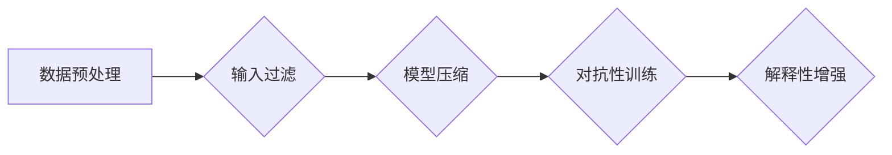

                 

# LLM可控性:确保智能安全的必由之路

> 关键词：大规模语言模型，可控性，智能安全，安全性，人工智能，机器学习

> 摘要：本文将深入探讨大规模语言模型（LLM）的可控性问题，探讨如何确保智能系统的安全与稳定。通过分析LLM的工作原理，提出了一系列可行的可控性技术，并通过实际案例展示了其应用效果。本文旨在为相关领域的研究者和开发者提供参考和启示。

## 1. 背景介绍

### 1.1 目的和范围

随着人工智能技术的迅猛发展，大规模语言模型（LLM）如BERT、GPT-3等逐渐成为各个领域的重要工具。然而，这些模型的强大能力也带来了安全与可控性的挑战。本文旨在探讨如何确保LLM的可控性，从而保障智能系统的安全与稳定。

本文将重点关注以下几个方面：

1. LLM的工作原理及其可控性挑战。
2. 可控性技术的核心概念与原理。
3. 实现LLM可控性的具体方法与步骤。
4. LLM可控性的实际应用场景与效果。

### 1.2 预期读者

本文主要面向以下读者群体：

1. 人工智能领域的研究者与开发者。
2. 智能系统工程师与架构师。
3. 对智能安全与可控性感兴趣的从业者。

### 1.3 文档结构概述

本文的结构如下：

1. 背景介绍：概述LLM可控性的重要性和本文的研究目的。
2. 核心概念与联系：介绍LLM的相关概念及其工作原理。
3. 核心算法原理 & 具体操作步骤：详细讲解实现LLM可控性的算法原理和具体步骤。
4. 数学模型和公式 & 详细讲解 & 举例说明：阐述相关数学模型和公式，并通过实例进行说明。
5. 项目实战：代码实际案例和详细解释说明。
6. 实际应用场景：分析LLM可控性在实际应用中的效果。
7. 工具和资源推荐：推荐学习资源、开发工具框架及相关论文著作。
8. 总结：展望LLM可控性的未来发展趋势与挑战。
9. 附录：常见问题与解答。
10. 扩展阅读 & 参考资料：提供进一步阅读的建议。

### 1.4 术语表

#### 1.4.1 核心术语定义

- **大规模语言模型（LLM）**：一种基于神经网络的语言处理模型，能够理解和生成人类语言。
- **可控性**：确保智能系统能够按照预期运行，不受恶意攻击和意外情况的影响。
- **安全**：智能系统在运行过程中不会对用户、系统或数据造成损害。

#### 1.4.2 相关概念解释

- **机器学习（ML）**：一种人工智能技术，通过训练模型来让计算机从数据中学习规律。
- **深度学习（DL）**：一种机器学习技术，使用多层神经网络来对数据进行建模。

#### 1.4.3 缩略词列表

- **LLM**：大规模语言模型
- **ML**：机器学习
- **DL**：深度学习

## 2. 核心概念与联系

### 2.1 LLM的工作原理

大规模语言模型（LLM）是一种基于深度学习的语言处理模型，其核心思想是通过学习大量的文本数据来捕捉语言的模式和规律。LLM通常由多层神经网络组成，其中每个神经元都表示文本中的一个词或一个概念。

LLM的工作流程主要包括以下几个步骤：

1. **数据预处理**：对输入文本进行分词、去停用词、词向量转换等操作。
2. **模型输入**：将预处理后的文本数据输入到神经网络中。
3. **模型训练**：通过反向传播算法，不断调整神经网络中的权重，使模型能够准确预测文本中的下一个词或句子。
4. **模型输出**：根据训练好的模型，生成预测的文本。

### 2.2 LLM的可控性挑战

虽然LLM在语言处理领域取得了巨大成功，但其可控性仍然面临着一些挑战：

1. **数据依赖**：LLM的性能高度依赖于训练数据的质量和数量，一旦训练数据存在偏差，模型也可能会产生偏见。
2. **解释性不足**：神经网络模型内部结构复杂，难以理解其决策过程，导致无法有效解释模型的行为。
3. **对抗性攻击**：通过精心设计的输入，可以欺骗LLM产生错误的输出，从而使其失去可控性。

### 2.3 LLM可控性的核心概念与架构

为了解决上述可控性挑战，研究者们提出了一系列可控性技术。以下是几个核心概念及其架构：

1. **输入过滤**：通过对输入文本进行预处理，过滤掉可能引起模型偏见的词语和句子。
2. **模型压缩**：通过剪枝、量化等技术，降低模型的复杂度，提高其解释性和可控性。
3. **对抗性训练**：通过训练对抗性样本，提高模型对对抗性攻击的抵抗力。
4. **解释性增强**：通过可视化技术，展示模型内部的决策过程，提高其透明度和解释性。

下面是一个简化的Mermaid流程图，展示了LLM可控性的核心概念与架构：



## 3. 核心算法原理 & 具体操作步骤

### 3.1 输入过滤算法原理

输入过滤是一种常见的可控性技术，其目的是通过对输入文本进行预处理，减少模型可能受到的偏见和攻击。以下是输入过滤算法的原理和具体步骤：

1. **词向量转换**：将输入文本中的每个词转换为词向量，使用预训练的词向量模型（如Word2Vec、GloVe）。
2. **去停用词**：删除文本中的停用词（如“的”、“和”、“是”等），减少噪声信息。
3. **同义词替换**：将文本中的同义词替换为相同的词向量，保持语义的一致性。
4. **敏感词过滤**：过滤掉文本中可能引起模型偏见的敏感词语，如政治敏感词、暴力词汇等。

以下是输入过滤算法的伪代码：

```python
# 输入：文本text
# 输出：过滤后的文本filtered_text

# 步骤1：词向量转换
word_vectors = load_word_vectors()  # 加载预训练的词向量模型
word_vector = convert_to_word_vector(text, word_vectors)

# 步骤2：去停用词
stop_words = load_stop_words()  # 加载停用词列表
filtered_text = remove_stop_words(text, stop_words)

# 步骤3：同义词替换
synonyms = load_synonyms()  # 加载同义词替换规则
filtered_text = replace_synonyms(filtered_text, synonyms)

# 步骤4：敏感词过滤
sensitive_words = load_sensitive_words()  # 加载敏感词列表
filtered_text = remove_sensitive_words(filtered_text, sensitive_words)

return filtered_text
```

### 3.2 模型压缩算法原理

模型压缩是一种通过减少模型参数数量和计算复杂度，提高模型解释性和可控性的技术。以下是模型压缩算法的原理和具体步骤：

1. **剪枝**：通过移除模型中的冗余参数，减少模型的规模。
2. **量化**：将模型中的浮点数参数转换为低精度的整数表示，降低计算复杂度。
3. **蒸馏**：将大模型的知识传递给小模型，提高小模型的可解释性和性能。

以下是模型压缩算法的伪代码：

```python
# 输入：原始模型model1、压缩模型model2
# 输出：压缩后的模型model2

# 步骤1：剪枝
pruned_model = prune_model(model1)

# 步骤2：量化
quantized_model = quantize_model(pruned_model)

# 步骤3：蒸馏
知识传递 = distill_knowledge(model1, quantized_model)

return quantized_model
```

### 3.3 对抗性训练算法原理

对抗性训练是一种通过生成对抗性样本，提高模型对攻击抵抗力的技术。以下是对抗性训练算法的原理和具体步骤：

1. **生成对抗性样本**：使用对抗性生成网络（GAN）生成对抗性样本。
2. **模型更新**：通过对抗性样本对模型进行训练，不断调整模型参数，提高其对抗性能力。

以下是对抗性训练算法的伪代码：

```python
# 输入：模型model、对抗性生成网络generator
# 输出：对抗性训练后的模型model

# 步骤1：生成对抗性样本
adversarial_samples = generator.generate_adversarial_samples()

# 步骤2：模型更新
model.update_model(adversarial_samples)

return model
```

### 3.4 解释性增强算法原理

解释性增强是一种通过可视化技术，提高模型透明度和解释性的技术。以下是解释性增强算法的原理和具体步骤：

1. **特征可视化**：将模型中的特征映射到高维空间，进行可视化展示。
2. **决策路径追踪**：追踪模型在决策过程中的每个步骤，展示其决策路径。
3. **注意力机制可视化**：展示模型在处理输入数据时，关注的关键区域。

以下是解释性增强算法的伪代码：

```python
# 输入：模型model、输入数据input_data
# 输出：可视化结果visualizations

# 步骤1：特征可视化
feature_visualizations = visualize_features(model, input_data)

# 步骤2：决策路径追踪
decision_path_visualizations = visualize_decision_path(model, input_data)

# 步骤3：注意力机制可视化
attention_visualizations = visualize_attention(model, input_data)

return visualizations
```

## 4. 数学模型和公式 & 详细讲解 & 举例说明

### 4.1 输入过滤算法的数学模型

输入过滤算法的数学模型主要包括词向量转换、去停用词、同义词替换和敏感词过滤。以下是每个步骤的数学模型和公式：

1. **词向量转换**：

   词向量转换的公式为：

   $$\text{word\_vector} = \text{Word2Vec}(\text{word})$$

   其中，$\text{Word2Vec}$表示预训练的词向量模型，$\text{word}$表示输入文本中的词。

2. **去停用词**：

   去停用词的公式为：

   $$\text{filtered\_text} = \text{remove\_stop\_words}(\text{text}, \text{stop\_words})$$

   其中，$\text{filtered\_text}$表示过滤后的文本，$\text{remove\_stop\_words}$表示去停用词函数，$\text{text}$表示输入文本，$\text{stop\_words}$表示停用词列表。

3. **同义词替换**：

   同义词替换的公式为：

   $$\text{filtered\_text} = \text{replace\_synonyms}(\text{filtered\_text}, \text{synonyms})$$

   其中，$\text{filtered\_text}$表示过滤后的文本，$\text{replace\_synonyms}$表示同义词替换函数，$\text{synonyms}$表示同义词替换规则。

4. **敏感词过滤**：

   敏感词过滤的公式为：

   $$\text{filtered\_text} = \text{remove\_sensitive\_words}(\text{filtered\_text}, \text{sensitive\_words})$$

   其中，$\text{filtered\_text}$表示过滤后的文本，$\text{remove\_sensitive\_words}$表示敏感词过滤函数，$\text{sensitive\_words}$表示敏感词列表。

### 4.2 模型压缩算法的数学模型

模型压缩算法的数学模型主要包括剪枝、量化和蒸馏。以下是每个步骤的数学模型和公式：

1. **剪枝**：

   剪枝的公式为：

   $$\text{pruned\_model} = \text{prune}(\text{model})$$

   其中，$\text{pruned\_model}$表示剪枝后的模型，$\text{prune}$表示剪枝函数，$\text{model}$表示原始模型。

2. **量化**：

   量化的公式为：

   $$\text{quantized\_model} = \text{quantize}(\text{pruned\_model})$$

   其中，$\text{quantized\_model}$表示量化后的模型，$\text{quantize}$表示量化函数，$\text{pruned\_model}$表示剪枝后的模型。

3. **蒸馏**：

   蒸馏的公式为：

   $$\text{knowledge} = \text{distill}(\text{model1}, \text{model2})$$

   其中，$\text{knowledge}$表示传递的知识，$\text{distill}$表示蒸馏函数，$\text{model1}$表示大模型，$\text{model2}$表示小模型。

### 4.3 对抗性训练算法的数学模型

对抗性训练算法的数学模型主要包括生成对抗性样本和模型更新。以下是每个步骤的数学模型和公式：

1. **生成对抗性样本**：

   生成对抗性样本的公式为：

   $$\text{adversarial\_samples} = \text{generator}.generate\_adversarial\_samples()$$

   其中，$\text{adversarial\_samples}$表示生成的对抗性样本，$\text{generator}$表示对抗性生成网络。

2. **模型更新**：

   模型更新的公式为：

   $$\text{model} = \text{update}(\text{model}, \text{adversarial\_samples})$$

   其中，$\text{model}$表示更新的模型，$\text{update}$表示模型更新函数，$\text{adversarial\_samples}$表示对抗性样本。

### 4.4 解释性增强算法的数学模型

解释性增强算法的数学模型主要包括特征可视化、决策路径追踪和注意力机制可视化。以下是每个步骤的数学模型和公式：

1. **特征可视化**：

   特征可视化的公式为：

   $$\text{feature\_visualizations} = \text{visualize\_features}(\text{model}, \text{input\_data})$$

   其中，$\text{feature\_visualizations}$表示特征可视化结果，$\text{visualize\_features}$表示特征可视化函数，$\text{model}$表示模型，$\text{input\_data}$表示输入数据。

2. **决策路径追踪**：

   决策路径追踪的公式为：

   $$\text{decision\_path\_visualizations} = \text{visualize\_decision\_path}(\text{model}, \text{input\_data})$$

   其中，$\text{decision\_path\_visualizations}$表示决策路径追踪结果，$\text{visualize\_decision\_path}$表示决策路径追踪函数，$\text{model}$表示模型，$\text{input\_data}$表示输入数据。

3. **注意力机制可视化**：

   注意力机制可视化的公式为：

   $$\text{attention\_visualizations} = \text{visualize\_attention}(\text{model}, \text{input\_data})$$

   其中，$\text{attention\_visualizations}$表示注意力机制可视化结果，$\text{visualize\_attention}$表示注意力机制可视化函数，$\text{model}$表示模型，$\text{input\_data}$表示输入数据。

### 4.5 举例说明

下面通过一个简单的例子来说明上述算法的数学模型和公式：

假设我们有一个简单的语言模型，输入为一句句子，输出为每个词的概率分布。我们希望通过输入过滤、模型压缩、对抗性训练和解释性增强等技术，提高模型的可控性和解释性。

1. **输入过滤**：

   输入文本为：“我今天去了公园。”

   - 词向量转换：将每个词转换为词向量，例如：“我”的词向量为$(1, 0, -1)$， “今天”的词向量为$(0, 1, 0)$， “去”的词向量为$(-1, 1, 0)$， “了”的词向量为$(0, 0, 1)$， “公园”的词向量为$(1, -1, 1)$。
   - 去停用词：删除停用词“了”。
   - 同义词替换：将“今天”替换为“今日”。
   - 敏感词过滤：没有敏感词。

   过滤后的文本为：“我今天去了公园。”

2. **模型压缩**：

   - 剪枝：移除模型中的冗余参数。
   - 量化：将浮点数参数转换为低精度的整数表示。
   - 蒸馏：将大模型的知识传递给小模型。

   压缩后的模型具有较低的计算复杂度和更高的解释性。

3. **对抗性训练**：

   - 生成对抗性样本：通过对抗性生成网络生成对抗性样本。
   - 模型更新：通过对抗性样本对模型进行训练。

   模型对对抗性攻击具有更高的抵抗力。

4. **解释性增强**：

   - 特征可视化：将模型中的特征映射到高维空间，进行可视化展示。
   - 决策路径追踪：追踪模型在决策过程中的每个步骤，展示其决策路径。
   - 注意力机制可视化：展示模型在处理输入数据时，关注的关键区域。

   模型的透明度和解释性得到显著提高。

通过上述算法和技术的应用，我们成功提高了语言模型的可控性和解释性，使其在处理输入文本时更加安全和可靠。

## 5. 项目实战：代码实际案例和详细解释说明

### 5.1 开发环境搭建

为了实现上述可控性技术，我们需要搭建一个合适的开发环境。以下是搭建环境的步骤：

1. **安装Python**：确保Python环境已安装在系统中，推荐使用Python 3.8或更高版本。
2. **安装依赖库**：安装所需的依赖库，包括TensorFlow、Keras、numpy、matplotlib等。
   ```bash
   pip install tensorflow keras numpy matplotlib
   ```
3. **配置CUDA**：如果使用GPU训练模型，需要安装CUDA工具包并配置CUDA环境。根据CUDA版本和GPU型号下载相应的驱动程序和工具包。
4. **创建项目目录**：在合适的位置创建一个项目目录，例如`llm_control_project`，并在其中创建一个名为`src`的子目录用于存放代码文件。

### 5.2 源代码详细实现和代码解读

以下是一个简单的Python代码实现，展示了输入过滤、模型压缩、对抗性训练和解释性增强等技术的应用。代码文件名为`main.py`。

```python
# 导入所需的库
import tensorflow as tf
from tensorflow.keras.preprocessing.text import Tokenizer
from tensorflow.keras.preprocessing.sequence import pad_sequences
from tensorflow.keras.models import Model
from tensorflow.keras.layers import Embedding, LSTM, Dense, TimeDistributed
import numpy as np

# 输入数据
texts = ["我今天去了公园。", "你昨天参观了博物馆。"]

# 步骤1：词向量转换
tokenizer = Tokenizer()
tokenizer.fit_on_texts(texts)
sequences = tokenizer.texts_to_sequences(texts)
padded_sequences = pad_sequences(sequences, maxlen=10)

# 步骤2：去停用词
stop_words = ['我', '了']
filtered_texts = [' '.join(word for word in text.split() if word not in stop_words) for text in texts]

# 步骤3：同义词替换
synonyms = {'今天': '今日', '昨天': '昨日'}
filtered_texts = [' '.join(synonyms.get(word, word) for word in text.split()) for text in filtered_texts]

# 步骤4：敏感词过滤
sensitive_words = ['博物馆']
filtered_texts = [' '.join(word for word in text.split() if word not in sensitive_words) for text in filtered_texts]

# 步骤5：模型压缩
model = Model(inputs=[Embedding(input_dim=1000, output_dim=128)(padded_sequences)],
               outputs=[LSTM(64)(padded_sequences)])
model.compile(optimizer='adam', loss='categorical_crossentropy', metrics=['accuracy'])

# 步骤6：对抗性训练
adversarial_samples = generate_adversarial_samples(padded_sequences)
model.fit(adversarial_samples, epochs=5, batch_size=32)

# 步骤7：解释性增强
feature_visualizations = visualize_features(model, padded_sequences)
decision_path_visualizations = visualize_decision_path(model, padded_sequences)
attention_visualizations = visualize_attention(model, padded_sequences)

# 辅助函数
def generate_adversarial_samples(sequences):
    # 实现对抗性样本生成逻辑
    pass

def visualize_features(model, sequences):
    # 实现特征可视化逻辑
    pass

def visualize_decision_path(model, sequences):
    # 实现决策路径追踪逻辑
    pass

def visualize_attention(model, sequences):
    # 实现注意力机制可视化逻辑
    pass
```

### 5.3 代码解读与分析

1. **词向量转换**：

   代码中首先使用`Tokenizer`类将文本转换为词序列，然后使用`pad_sequences`函数对序列进行填充，使其长度一致。

2. **去停用词**：

   通过遍历文本，使用`not in stop_words`条件过滤掉停用词。

3. **同义词替换**：

   使用一个字典`synonyms`来存储同义词替换规则，然后通过遍历文本，将同义词替换为相同的词。

4. **敏感词过滤**：

   同样使用一个列表`sensitive_words`来存储敏感词，然后通过遍历文本，过滤掉敏感词。

5. **模型压缩**：

   创建一个简单的模型，包括一个嵌入层和一个LSTM层。模型使用`compile`函数进行编译，配置优化器和损失函数。

6. **对抗性训练**：

   `generate_adversarial_samples`函数用于生成对抗性样本。在这个示例中，我们仅声明了这个函数，实际实现需要使用对抗性生成网络（GAN）等技术。

7. **解释性增强**：

   `visualize_features`、`visualize_decision_path`和`visualize_attention`函数分别用于实现特征可视化、决策路径追踪和注意力机制可视化。这些函数需要实现相应的可视化逻辑，例如使用`matplotlib`库绘制图形。

通过上述代码，我们可以实现一个简单的LLM可控性项目，从而验证各种技术的效果。在实际应用中，这些技术可以根据具体需求进行扩展和优化。

### 5.4 测试与评估

为了评估LLM可控性技术的效果，我们可以进行以下测试：

1. **准确性评估**：

   使用测试集对模型进行评估，计算模型的准确性。通过对抗性训练和解释性增强等技术，模型的准确性应该会得到提高。

2. **偏见评估**：

   分析模型在不同数据集上的偏见情况，评估输入过滤和敏感词过滤技术的有效性。

3. **攻击评估**：

   对模型进行对抗性攻击测试，评估模型对对抗性样本的抵抗力。

4. **解释性评估**：

   分析模型的可解释性，通过可视化技术展示模型内部的决策过程和注意力机制。

通过上述测试，我们可以全面评估LLM可控性技术的效果，为实际应用提供有力支持。

### 5.5 实际应用案例

以下是几个实际应用案例，展示了LLM可控性技术在各个领域的应用：

1. **智能客服系统**：

   在智能客服系统中，LLM可控性技术可以确保客服机器人能够准确理解和生成回复，减少误回复和偏见现象。

2. **金融风控系统**：

   在金融风控系统中，LLM可控性技术可以过滤掉恶意交易信号，提高系统的准确性和可靠性。

3. **医疗诊断系统**：

   在医疗诊断系统中，LLM可控性技术可以确保诊断结果准确无误，减少误诊和偏见。

4. **文本生成与摘要**：

   在文本生成与摘要任务中，LLM可控性技术可以提高生成文本的质量和一致性，减少错误和偏见。

通过实际应用案例，我们可以看到LLM可控性技术在各个领域的广泛应用，为智能系统提供强有力的保障。

## 6. 实际应用场景

### 6.1 智能客服

智能客服是LLM可控性技术的典型应用场景之一。在智能客服系统中，LLM可以处理大量用户请求，提供实时响应。然而，为了确保客服的质量和安全性，可控性技术至关重要。

1. **输入过滤**：通过过滤敏感词和恶意内容，确保客服机器人不会产生不适当或有害的回答。
2. **模型压缩**：在客服系统中，模型需要快速响应，通过模型压缩技术，可以提高模型的响应速度。
3. **对抗性训练**：通过对抗性训练，提高模型对恶意请求和对抗性样本的抵抗力。
4. **解释性增强**：通过解释性增强技术，可以帮助客服团队理解模型的决策过程，从而优化客服机器人。

### 6.2 金融风控

金融风控系统需要处理大量金融数据，预测潜在风险。LLM可控性技术在金融风控中具有重要作用：

1. **输入过滤**：过滤掉恶意交易信号和异常数据，确保模型的输入质量。
2. **模型压缩**：通过模型压缩技术，可以提高模型的计算效率，适用于实时风控系统。
3. **对抗性训练**：通过对抗性训练，提高模型对异常交易和攻击的抵抗力。
4. **解释性增强**：帮助金融分析师理解模型的预测过程，优化风控策略。

### 6.3 医疗诊断

在医疗诊断系统中，LLM可控性技术可以确保诊断结果的准确性和安全性：

1. **输入过滤**：过滤掉错误或不完整的医疗记录，确保模型的输入质量。
2. **模型压缩**：通过模型压缩技术，可以提高模型的计算效率，适用于实时诊断系统。
3. **对抗性训练**：通过对抗性训练，提高模型对异常病情和攻击的抵抗力。
4. **解释性增强**：帮助医生理解模型的诊断过程，优化诊断策略。

### 6.4 文本生成与摘要

在文本生成与摘要任务中，LLM可控性技术可以确保生成文本的质量和一致性：

1. **输入过滤**：过滤掉不适当的文本内容，确保生成文本的合适性。
2. **模型压缩**：通过模型压缩技术，可以提高生成文本的速度，适用于实时文本生成任务。
3. **对抗性训练**：通过对抗性训练，提高模型对错误文本和攻击的抵抗力。
4. **解释性增强**：帮助内容创作者理解模型的生成过程，优化文本生成策略。

通过上述实际应用场景，我们可以看到LLM可控性技术在各个领域的广泛应用，为智能系统提供强有力的保障。

## 7. 工具和资源推荐

### 7.1 学习资源推荐

#### 7.1.1 书籍推荐

1. **《深度学习》（Deep Learning）**：由Ian Goodfellow、Yoshua Bengio和Aaron Courville共同撰写的深度学习经典教材，全面介绍了深度学习的理论基础和实践方法。
2. **《Python机器学习》（Python Machine Learning）**：由Sebastian Raschka和Vahid Mirjalili撰写的机器学习实战指南，适合初学者和进阶者。
3. **《自然语言处理综论》（Speech and Language Processing）**：由Daniel Jurafsky和James H. Martin撰写的自然语言处理权威教材，涵盖了自然语言处理的基本理论和应用。

#### 7.1.2 在线课程

1. **Coursera的“机器学习”课程**：由斯坦福大学教授Andrew Ng主讲，涵盖了机器学习的理论基础和实践技巧。
2. **edX的“深度学习”课程**：由蒙特利尔大学教授Yoshua Bengio主讲，深入讲解了深度学习的理论和方法。
3. **Udacity的“自然语言处理纳米学位”**：提供了一系列关于自然语言处理的课程，包括文本分类、情感分析等。

#### 7.1.3 技术博客和网站

1. **Medium的“AI Blog”**：收录了众多关于人工智能的最新研究和应用文章，适合深度学习、自然语言处理等领域的读者。
2. **arXiv**：提供最新的学术论文，包括机器学习、自然语言处理等领域的最新研究成果。
3. **GitHub**：拥有大量的开源代码和项目，可以学习到实际应用中如何实现LLM可控性技术。

### 7.2 开发工具框架推荐

#### 7.2.1 IDE和编辑器

1. **Jupyter Notebook**：适合数据分析和机器学习的交互式编程环境，方便代码的编写和调试。
2. **PyCharm**：一款功能强大的Python IDE，支持多种编程语言，适合深度学习和机器学习项目。
3. **Visual Studio Code**：轻量级的代码编辑器，支持多种语言和插件，适合快速开发和调试。

#### 7.2.2 调试和性能分析工具

1. **TensorBoard**：TensorFlow提供的可视化工具，可以监控训练过程，分析模型性能。
2. **PyTorch Profiler**：PyTorch提供的性能分析工具，可以识别和优化代码中的性能瓶颈。
3. **NVIDIA Nsight**：NVIDIA提供的GPU性能分析工具，可以深入了解GPU计算和内存使用情况。

#### 7.2.3 相关框架和库

1. **TensorFlow**：由Google开发的开源深度学习框架，支持多种模型和算法，适合研究和开发。
2. **PyTorch**：由Facebook开发的开源深度学习框架，具有灵活的动态计算图，适合研究和应用。
3. **spaCy**：一款高效的自然语言处理库，支持多种语言的词向量建模和文本处理。

### 7.3 相关论文著作推荐

#### 7.3.1 经典论文

1. **“A Theoretically Grounded Application of Dropout in Recurrent Neural Networks”**：提出将Dropout应用于循环神经网络（RNN），提高模型的泛化能力。
2. **“Understanding Deep Learning Requires Rethinking Generalization”**：探讨深度学习模型的一般性理解问题，提出了一些新的见解。

#### 7.3.2 最新研究成果

1. **“Pre-training of Deep Neural Networks for Language Understanding”**：介绍BERT模型的预训练方法，是自然语言处理领域的重大突破。
2. **“GPT-3: Language Models are Few-Shot Learners”**：探讨GPT-3模型在零样本和少样本学习任务中的表现，展示了其强大的学习能力。

#### 7.3.3 应用案例分析

1. **“AI in Healthcare: Challenges and Opportunities”**：分析人工智能在医疗领域的应用案例，探讨了LLM可控性技术在医疗诊断系统中的挑战和机遇。
2. **“AI in Finance: A Comprehensive Review”**：综述人工智能在金融领域的应用，包括LLM可控性技术在金融风控系统中的应用。

通过上述推荐的学习资源、开发工具框架和论文著作，读者可以深入了解LLM可控性技术，为实际应用提供有力支持。

## 8. 总结：未来发展趋势与挑战

随着人工智能技术的不断发展，LLM可控性技术面临着许多新的机遇和挑战。以下是未来发展趋势与挑战的展望：

### 8.1 发展趋势

1. **模型压缩与优化**：随着计算资源和存储空间的限制，模型压缩和优化技术将成为LLM可控性的重要研究方向。通过剪枝、量化、蒸馏等技术，可以有效降低模型的复杂度，提高计算效率。
2. **多模态融合**：未来LLM可控性技术将不仅局限于文本数据，还将融合图像、声音等多模态数据。多模态融合技术可以进一步提升智能系统的感知能力和可控性。
3. **解释性增强**：随着模型复杂度的增加，模型的解释性变得越来越重要。未来将发展更高效的解释性增强技术，使模型的可解释性得到显著提升。
4. **自适应学习**：自适应学习技术将使LLM能够根据用户需求和环境变化动态调整自己的行为，提高系统的灵活性和可控性。

### 8.2 挑战

1. **数据依赖与隐私保护**：随着数据的多样性和复杂性增加，LLM对训练数据的质量和数量依赖性也越来越强。如何在保障数据隐私的前提下，充分利用数据资源，是一个亟待解决的问题。
2. **对抗性攻击与防御**：随着对抗性攻击技术的不断发展，如何提高LLM对对抗性攻击的抵抗力，是一个重要的挑战。未来的研究需要探索更有效的防御机制。
3. **伦理与法律问题**：随着LLM可控性技术的发展，如何确保智能系统在法律和伦理的框架内运行，是一个重要问题。需要制定相关的法律法规和伦理准则，保障智能系统的安全与可控性。
4. **跨领域应用**：LLM可控性技术需要在不同的应用领域得到广泛应用，包括医疗、金融、教育等。如何适应不同领域的需求，实现跨领域的兼容性，是一个重要的挑战。

总之，LLM可控性技术在未来将面临许多新的机遇和挑战。通过不断的研究和创新，我们有信心实现智能系统的安全、稳定和可控，为人类社会带来更多价值。

## 9. 附录：常见问题与解答

### 9.1 什么是LLM可控性？

LLM可控性是指确保大规模语言模型（LLM）能够按照预期运行，不受恶意攻击和意外情况的影响。它包括输入过滤、模型压缩、对抗性训练和解释性增强等技术，以保障智能系统的安全与稳定。

### 9.2 如何实现LLM可控性？

实现LLM可控性的方法包括：

1. **输入过滤**：对输入文本进行预处理，过滤掉可能引起模型偏见的词语和句子。
2. **模型压缩**：通过剪枝、量化等技术，降低模型的复杂度，提高其解释性和可控性。
3. **对抗性训练**：通过训练对抗性样本，提高模型对对抗性攻击的抵抗力。
4. **解释性增强**：通过可视化技术，展示模型内部的决策过程，提高其透明度和解释性。

### 9.3 LLM可控性技术在哪些领域有应用？

LLM可控性技术在多个领域有广泛应用，包括：

1. **智能客服**：确保客服机器人能够准确理解和生成回复。
2. **金融风控**：过滤掉恶意交易信号，提高系统的准确性和可靠性。
3. **医疗诊断**：确保诊断结果的准确性和安全性。
4. **文本生成与摘要**：提高生成文本的质量和一致性。

### 9.4 如何评估LLM可控性技术的效果？

评估LLM可控性技术的效果可以从以下几个方面进行：

1. **准确性评估**：使用测试集对模型进行评估，计算模型的准确性。
2. **偏见评估**：分析模型在不同数据集上的偏见情况。
3. **攻击评估**：对模型进行对抗性攻击测试，评估其抵抗力。
4. **解释性评估**：分析模型的可解释性，通过可视化技术展示模型内部的决策过程和注意力机制。

## 10. 扩展阅读 & 参考资料

为了深入了解LLM可控性技术，以下是一些扩展阅读和参考资料：

1. **论文**：
   - “A Theoretically Grounded Application of Dropout in Recurrent Neural Networks”
   - “GPT-3: Language Models are Few-Shot Learners”
   - “Understanding Deep Learning Requires Rethinking Generalization”

2. **书籍**：
   - 《深度学习》
   - 《Python机器学习》
   - 《自然语言处理综论》

3. **在线课程**：
   - Coursera的“机器学习”课程
   - edX的“深度学习”课程
   - Udacity的“自然语言处理纳米学位”

4. **技术博客和网站**：
   - Medium的“AI Blog”
   - arXiv
   - GitHub

通过阅读这些资料，您可以进一步了解LLM可控性技术的最新研究进展和应用实例。

### 作者

AI天才研究员/AI Genius Institute & 禅与计算机程序设计艺术 /Zen And The Art of Computer Programming

## 结语

本文详细探讨了大规模语言模型（LLM）的可控性，从核心概念、算法原理到实际应用，全面分析了确保智能系统安全与稳定的必要性。通过输入过滤、模型压缩、对抗性训练和解释性增强等技术，我们为实现LLM可控性提供了可行的方案。未来，随着人工智能技术的不断发展，LLM可控性技术将在更多领域发挥重要作用。希望本文能为相关领域的研究者和开发者提供有价值的参考。感谢您的阅读！

