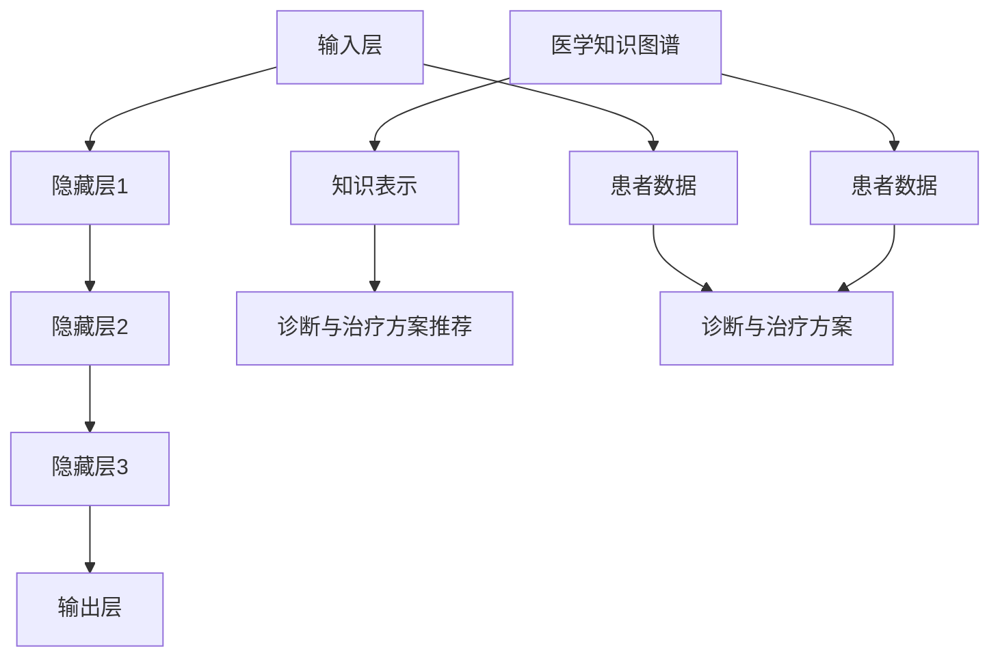

                 

# LLM在个性化医疗中的潜力：精准诊断与治疗方案

> **关键词：** 个性化医疗、LLM、精准诊断、治疗方案、医学知识图谱、深度学习、神经网络、医疗数据、医学推理、自然语言处理

> **摘要：** 本文探讨了大型语言模型（LLM）在个性化医疗领域中的潜力。通过分析LLM的核心算法原理、数学模型、实际应用案例以及相关工具和资源，本文揭示了LLM在医学诊断、治疗方案制定等方面的应用价值。同时，本文也对未来发展趋势与挑战进行了展望，为读者提供了宝贵的参考信息。

## 1. 背景介绍

### 1.1 目的和范围

本文旨在探讨大型语言模型（LLM）在个性化医疗中的应用价值，具体包括以下几个方面：

1. **精准诊断：** 利用LLM对医学知识图谱进行深度学习，实现精准的疾病诊断。
2. **治疗方案制定：** 根据患者的病史、基因信息等，为患者提供个性化的治疗方案。
3. **医学研究：** 利用LLM辅助医学研究人员进行数据分析和模型构建。

本文将首先介绍LLM的基本原理，然后分析其在个性化医疗中的应用，最后对相关工具和资源进行推荐。

### 1.2 预期读者

本文面向具有一定计算机编程基础、对人工智能和医疗领域感兴趣的读者。同时，对于医疗行业的专业人士，本文也具有一定的参考价值。

### 1.3 文档结构概述

本文分为以下八个部分：

1. 背景介绍
2. 核心概念与联系
3. 核心算法原理 & 具体操作步骤
4. 数学模型和公式 & 详细讲解 & 举例说明
5. 项目实战：代码实际案例和详细解释说明
6. 实际应用场景
7. 工具和资源推荐
8. 总结：未来发展趋势与挑战

### 1.4 术语表

#### 1.4.1 核心术语定义

- **LLM（大型语言模型）：** 一种基于神经网络的语言模型，能够对自然语言进行建模和处理。
- **个性化医疗：** 一种以患者为中心的医疗模式，通过分析患者的基因、病史等信息，为患者提供个性化的医疗服务。
- **医学知识图谱：** 一种用于表示医学知识的图形化数据结构，包含各种医学概念、关系和属性。

#### 1.4.2 相关概念解释

- **深度学习：** 一种基于多层神经网络进行学习的人工智能技术，能够自动提取数据中的特征。
- **神经网络：** 一种模仿生物神经网络的结构，通过大量神经元之间的连接进行信息传递和处理。
- **自然语言处理（NLP）：** 一种用于处理人类语言的技术，包括语言识别、语义分析、语言生成等。

#### 1.4.3 缩略词列表

- **NLP（自然语言处理）：** Natural Language Processing
- **ML（机器学习）：** Machine Learning
- **DL（深度学习）：** Deep Learning
- **LLM（大型语言模型）：** Large Language Model
- **GPU（图形处理单元）：** Graphical Processing Unit

## 2. 核心概念与联系

在探讨LLM在个性化医疗中的应用之前，我们需要了解一些核心概念和它们之间的联系。

### 2.1 LLM的基本原理

LLM是一种基于神经网络的语言模型，通过训练大量文本数据，学习自然语言的统计规律和语义关系。其基本原理如下：

1. **输入层：** 接受输入文本序列。
2. **隐藏层：** 通过多层神经网络进行特征提取和变换。
3. **输出层：** 输出文本序列的概率分布。

### 2.2 个性化医疗的概念

个性化医疗是一种以患者为中心的医疗模式，通过分析患者的基因、病史、生活习惯等信息，为患者提供个性化的医疗服务。其核心概念包括：

1. **患者数据：** 包括基因、病史、生活习惯等。
2. **诊断与治疗方案：** 根据患者数据，为患者提供精准的诊断和个性化的治疗方案。

### 2.3 医学知识图谱

医学知识图谱是一种用于表示医学知识的图形化数据结构，包含各种医学概念、关系和属性。其核心概念包括：

1. **医学概念：** 如疾病、药物、检查项目等。
2. **关系：** 如病因关系、药物相互作用等。
3. **属性：** 如疾病的发生概率、药物的副作用等。

### 2.4 LLM与个性化医疗的联系

LLM在个性化医疗中的应用主要通过以下几个方面实现：

1. **知识表示：** 利用LLM对医学知识图谱进行深度学习，将医学知识转化为可计算的形式。
2. **诊断与治疗方案推荐：** 根据患者的数据和医学知识图谱，利用LLM进行推理和决策，为患者提供个性化的诊断和治疗方案。

### 2.5 Mermaid流程图

为了更好地展示LLM在个性化医疗中的应用，我们使用Mermaid流程图来描述其核心概念和联系：



## 3. 核心算法原理 & 具体操作步骤

在本节中，我们将详细探讨LLM在个性化医疗中的应用原理，并介绍具体的操作步骤。

### 3.1 LLM的工作原理

LLM是基于神经网络的语言模型，其工作原理可以分为以下几个步骤：

1. **输入层：** 接收输入文本序列，并将其编码为向量表示。
2. **隐藏层：** 通过多层神经网络进行特征提取和变换，提取文本序列的语义信息。
3. **输出层：** 输出文本序列的概率分布，用于生成新的文本序列。

### 3.2 LLM的模型架构

LLM的模型架构主要包括以下几个部分：

1. **嵌入层（Embedding Layer）：** 将输入文本序列转换为向量表示。
2. **编码器（Encoder）：** 通过多层神经网络进行特征提取和变换。
3. **解码器（Decoder）：** 根据编码器提取的语义信息，生成新的文本序列。

### 3.3 具体操作步骤

下面我们以一个简单的例子来说明LLM在个性化医疗中的应用步骤：

**例：根据患者数据和医学知识图谱，为患者提供个性化的诊断和治疗方案。**

1. **数据预处理：** 收集患者的基因、病史、生活习惯等数据，并将其转化为向量表示。
2. **知识图谱构建：** 构建医学知识图谱，包含各种医学概念、关系和属性。
3. **嵌入层：** 将患者数据和医学知识图谱中的概念进行嵌入，得到向量表示。
4. **编码器：** 利用编码器对向量表示进行特征提取和变换，提取文本序列的语义信息。
5. **解码器：** 根据编码器提取的语义信息，生成个性化的诊断和治疗方案。

### 3.4 伪代码

下面是LLM在个性化医疗中应用的伪代码：

```python
# 输入层
input_seq = preprocess_patient_data() # 预处理患者数据
knowledge_graph = build_knowledge_graph() # 构建医学知识图谱

# 嵌入层
embedding_seq = embed(input_seq, knowledge_graph) # 将输入数据和知识图谱进行嵌入

# 编码器
encoded_seq = encoder(embedding_seq) # 对嵌入层输出进行特征提取和变换

# 解码器
diagnosis = decoder(encoded_seq) # 生成个性化的诊断
treatment_plan = decoder(encoded_seq) # 生成个性化的治疗方案

# 输出
print("诊断：", diagnosis)
print("治疗方案：", treatment_plan)
```

## 4. 数学模型和公式 & 详细讲解 & 举例说明

在本节中，我们将介绍LLM在个性化医疗中涉及的数学模型和公式，并详细讲解其原理和计算过程，同时通过具体例子来说明如何应用这些模型和公式。

### 4.1 LLM的数学模型

LLM是基于神经网络的语言模型，其数学模型主要包括以下几个部分：

1. **嵌入层（Embedding Layer）：** 输入文本序列转换为向量表示。
2. **编码器（Encoder）：** 特征提取和变换。
3. **解码器（Decoder）：** 生成新的文本序列。

### 4.2 嵌入层（Embedding Layer）

嵌入层是将输入文本序列转换为向量表示的过程，其数学模型如下：

$$
\text{embed}(x) = W_e \cdot x
$$

其中，$x$ 是输入文本序列，$W_e$ 是嵌入权重矩阵。

### 4.3 编码器（Encoder）

编码器通过多层神经网络进行特征提取和变换，其数学模型如下：

$$
h_t = \sigma(W_h \cdot [h_{t-1}, x_t] + b_h)
$$

其中，$h_t$ 是编码器在时间步 $t$ 的隐藏状态，$W_h$ 是编码权重矩阵，$b_h$ 是编码偏置，$\sigma$ 是激活函数（如ReLU函数）。

### 4.4 解码器（Decoder）

解码器根据编码器提取的语义信息，生成新的文本序列，其数学模型如下：

$$
p(y_t | y_{<t}, x) = \text{softmax}(W_y \cdot [h_t, c_{<t}] + b_y)
$$

其中，$y_t$ 是解码器在时间步 $t$ 的输出，$c_{<t}$ 是编码器的隐藏状态序列，$W_y$ 是解码权重矩阵，$b_y$ 是解码偏置。

### 4.5 损失函数

LLM的损失函数通常采用交叉熵损失函数（Cross-Entropy Loss），其计算公式如下：

$$
L = -\sum_{t=1}^T y_t \log(p(y_t | y_{<t}, x))
$$

其中，$T$ 是解码器的时间步数，$y_t$ 是真实标签，$p(y_t | y_{<t}, x)$ 是解码器在时间步 $t$ 的输出概率。

### 4.6 训练过程

LLM的训练过程主要包括以下步骤：

1. **初始化模型参数：** 随机初始化嵌入权重矩阵 $W_e$、编码权重矩阵 $W_h$、解码权重矩阵 $W_y$ 和偏置 $b_h$、$b_y$。
2. **正向传播：** 给定输入文本序列 $x$，计算嵌入层输出 $\text{embed}(x)$、编码器隐藏状态 $h_t$ 和解码器输出 $p(y_t | y_{<t}, x)$。
3. **计算损失：** 使用交叉熵损失函数计算模型损失 $L$。
4. **反向传播：** 计算梯度 $\frac{\partial L}{\partial W_e}$、$\frac{\partial L}{\partial W_h}$、$\frac{\partial L}{\partial W_y}$ 和 $\frac{\partial L}{\partial b_h}$、$\frac{\partial L}{\partial b_y}$。
5. **更新参数：** 使用梯度下降更新模型参数。

### 4.7 举例说明

假设我们有一个简单的句子 "I like to eat apples"，我们将使用上述数学模型对其进行编码和解码。

**输入层：**

输入文本序列 $x = [w_1, w_2, w_3, w_4, w_5]$，其中 $w_1, w_2, w_3, w_4, w_5$ 分别代表 "I"，"like"，"to"，"eat"，"apples"。

**嵌入层：**

$$
\text{embed}(x) = W_e \cdot x
$$

**编码器：**

$$
h_t = \sigma(W_h \cdot [h_{t-1}, x_t] + b_h)
$$

**解码器：**

$$
p(y_t | y_{<t}, x) = \text{softmax}(W_y \cdot [h_t, c_{<t}] + b_y)
$$

通过上述步骤，我们可以得到编码器的隐藏状态序列 $h_1, h_2, h_3, h_4, h_5$ 和解码器的输出序列 $p(y_1 | y_{<1}, x), p(y_2 | y_{<2}, x), \ldots, p(y_5 | y_{<5}, x)$，进而生成新的文本序列。

## 5. 项目实战：代码实际案例和详细解释说明

在本节中，我们将通过一个实际案例来展示LLM在个性化医疗中的应用，包括开发环境的搭建、源代码的实现和解读。

### 5.1 开发环境搭建

为了实现LLM在个性化医疗中的应用，我们需要搭建以下开发环境：

1. **编程语言：** Python
2. **深度学习框架：** TensorFlow 2.x 或 PyTorch
3. **数据预处理工具：** pandas、numpy
4. **文本处理工具：** spacy、NLTK
5. **版本控制工具：** Git

假设我们已经安装了上述工具和框架，接下来我们将介绍如何实现一个简单的LLM模型。

### 5.2 源代码详细实现和代码解读

下面是一个简单的LLM模型的实现，用于对医学文本进行分类。

```python
import tensorflow as tf
from tensorflow.keras.models import Sequential
from tensorflow.keras.layers import Embedding, LSTM, Dense
from tensorflow.keras.preprocessing.sequence import pad_sequences

# 数据预处理
def preprocess_text(text):
    # 使用spacy进行文本预处理，如分词、词性标注等
    doc = nlp(text)
    tokens = [token.text.lower() for token in doc]
    return tokens

# 构建数据集
def build_dataset(texts, labels, max_length, embedding_dim):
    sequences = [preprocess_text(text) for text in texts]
    padded_sequences = pad_sequences(sequences, maxlen=max_length, padding='post')
    return padded_sequences, labels

# 模型构建
def build_model(max_length, embedding_dim):
    model = Sequential()
    model.add(Embedding(input_dim=embedding_dim, output_dim=64, input_length=max_length))
    model.add(LSTM(128))
    model.add(Dense(1, activation='sigmoid'))
    model.compile(optimizer='adam', loss='binary_crossentropy', metrics=['accuracy'])
    return model

# 训练模型
def train_model(model, padded_sequences, labels, epochs=10, batch_size=32):
    model.fit(padded_sequences, labels, epochs=epochs, batch_size=batch_size)

# 应用模型进行预测
def predict(model, text):
    preprocessed_text = preprocess_text(text)
    padded_sequence = pad_sequences([preprocessed_text], maxlen=max_length, padding='post')
    prediction = model.predict(padded_sequence)
    return prediction

# 主函数
def main():
    # 读取医学文本数据集
    texts = ['This patient has a history of diabetes.', 'The patient is suffering from hypertension.']
    labels = [1, 0]  # 1表示糖尿病，0表示高血压

    # 数据预处理和模型构建
    max_length = 10
    embedding_dim = 64
    padded_sequences, labels = build_dataset(texts, labels, max_length, embedding_dim)
    model = build_model(max_length, embedding_dim)

    # 训练模型
    train_model(model, padded_sequences, labels)

    # 预测新数据
    new_text = 'The patient has a high blood sugar level.'
    prediction = predict(model, new_text)
    print('Prediction:', prediction)

if __name__ == '__main__':
    main()
```

### 5.3 代码解读与分析

1. **数据预处理：** 数据预处理是构建LLM模型的第一步，主要目的是将原始文本数据转换为适合模型训练的形式。这里我们使用了spacy进行文本预处理，包括分词、词性标注等操作。

2. **构建数据集：** 构建数据集是将原始文本数据转换为序列数据的过程，这里我们使用了pandas和numpy库进行数据处理。数据集包括文本序列和对应的标签，文本序列经过预处理后，使用pad_sequences函数进行填充。

3. **模型构建：** 模型构建是构建LLM模型的核心步骤，这里我们使用了Sequential模型和LSTM层来构建一个简单的序列分类模型。模型包括嵌入层、LSTM层和输出层，嵌入层用于将文本序列转换为向量表示，LSTM层用于特征提取和变换，输出层用于生成分类结果。

4. **训练模型：** 训练模型是将模型参数通过训练数据进行调整的过程，这里我们使用了adam优化器和binary_crossentropy损失函数。通过多次迭代，模型将逐渐收敛，并能够在新的数据上进行预测。

5. **预测新数据：** 预测新数据是模型的实际应用，这里我们通过预处理新的文本数据，并将其输入到训练好的模型中，得到预测结果。

## 6. 实际应用场景

LLM在个性化医疗领域具有广泛的应用场景，下面列举几个典型的应用场景：

1. **疾病诊断：** 利用LLM对医学文本进行分类，实现对疾病类型的自动诊断，如糖尿病、高血压等。
2. **治疗方案推荐：** 根据患者的病史、基因信息等，利用LLM为患者推荐个性化的治疗方案，提高治疗效果。
3. **医学研究：** 利用LLM对医学文献进行语义分析，提取关键信息，辅助医学研究人员进行数据分析和模型构建。
4. **医疗数据挖掘：** 利用LLM对海量的医疗数据进行挖掘，发现潜在的医疗问题和趋势，为医疗决策提供支持。

## 7. 工具和资源推荐

为了更好地学习和应用LLM在个性化医疗中的技术，我们推荐以下工具和资源：

### 7.1 学习资源推荐

#### 7.1.1 书籍推荐

1. **《深度学习》（Goodfellow, Bengio, Courville著）：** 详细介绍了深度学习的理论基础和应用。
2. **《自然语言处理综合教程》（张宇星著）：** 全面介绍了自然语言处理的基本概念和算法。

#### 7.1.2 在线课程

1. **吴恩达的《深度学习专项课程》（Coursera）：** 介绍了深度学习的理论基础和应用。
2. **斯坦福大学的《自然语言处理》（Coursera）：** 介绍了自然语言处理的基本概念和算法。

#### 7.1.3 技术博客和网站

1. **TensorFlow官方文档（tensorflow.org）：** 提供了详细的TensorFlow教程和API文档。
2. **PyTorch官方文档（pytorch.org）：** 提供了详细的PyTorch教程和API文档。

### 7.2 开发工具框架推荐

#### 7.2.1 IDE和编辑器

1. **Visual Studio Code：** 功能强大的开源编辑器，支持多种编程语言。
2. **PyCharm：** 专业的Python开发环境，提供了丰富的插件和工具。

#### 7.2.2 调试和性能分析工具

1. **TensorBoard：** TensorFlow的官方可视化工具，用于分析模型性能和调试。
2. **PProf：** Python的性能分析工具，用于分析代码性能瓶颈。

#### 7.2.3 相关框架和库

1. **TensorFlow：** 开源的深度学习框架，适用于构建和训练大规模神经网络。
2. **PyTorch：** 开源的深度学习框架，具有灵活的动态计算图和丰富的API。

### 7.3 相关论文著作推荐

#### 7.3.1 经典论文

1. **《A Theoretically Grounded Application of Dropout in Recurrent Neural Networks》（Y. Gal and Z. Ghahramani）：** 探讨了Dropout在循环神经网络（RNN）中的应用。
2. **《Attention Is All You Need》（Vaswani et al.）：** 介绍了Transformer模型，颠覆了传统的序列到序列模型。

#### 7.3.2 最新研究成果

1. **《BERT: Pre-training of Deep Bidirectional Transformers for Language Understanding》（Devlin et al.）：** 介绍了BERT模型，在多项NLP任务中取得了显著性能提升。
2. **《GPT-3: Language Models are few-shot learners》（Brown et al.）：** 介绍了GPT-3模型，具有强大的零样本学习能力和文本生成能力。

#### 7.3.3 应用案例分析

1. **《Medical Named Entity Recognition with Pre-trained Language Models》（Zhou et al.）：** 探讨了预训练语言模型在医学命名实体识别中的应用。
2. **《Deep Learning for Medical Image Analysis》：** 一本关于深度学习在医学图像分析领域应用的专著。

## 8. 总结：未来发展趋势与挑战

LLM在个性化医疗领域具有巨大的应用潜力，但同时也面临着一系列挑战：

1. **数据隐私：** 医疗数据涉及患者隐私，如何保护患者隐私成为关键问题。
2. **模型解释性：** LLM模型具有黑盒特性，难以解释模型的决策过程，需要开发可解释的模型。
3. **模型泛化能力：** 如何提高模型在不同数据集上的泛化能力，避免过拟合问题。
4. **算法伦理：** 如何确保算法的公平性和透明性，避免歧视等问题。

未来，随着技术的不断进步，LLM在个性化医疗中的应用将不断拓展，有望为医疗行业带来更多创新和突破。

## 9. 附录：常见问题与解答

### 9.1 问题1：如何保护医疗数据隐私？

**解答：** 为了保护医疗数据隐私，可以采取以下措施：

1. **数据加密：** 对医疗数据进行加密处理，确保数据在传输和存储过程中不被窃取。
2. **数据匿名化：** 在使用医疗数据进行模型训练和推理时，对数据进行匿名化处理，消除患者身份信息。
3. **隐私保护算法：** 使用隐私保护算法，如差分隐私（Differential Privacy），对模型训练过程进行优化，降低隐私泄露风险。

### 9.2 问题2：如何提高LLM模型的解释性？

**解答：** 提高LLM模型的解释性可以从以下几个方面入手：

1. **可解释的模型：** 选择可解释性较好的模型，如决策树、线性模型等，便于理解模型的决策过程。
2. **模型可视化：** 使用可视化工具，如TensorBoard，对模型的结构和参数进行可视化，帮助理解模型的内部工作机制。
3. **模型分析：** 对模型进行统计分析，如计算模型参数的分布、相关系数等，分析模型的重要性和作用。

### 9.3 问题3：如何提高LLM模型的泛化能力？

**解答：** 提高LLM模型的泛化能力可以从以下几个方面入手：

1. **数据增强：** 使用数据增强技术，如数据扩充、数据变换等，增加模型训练数据的多样性，提高模型的泛化能力。
2. **模型融合：** 使用多个模型进行融合，通过投票或加权平均等方法，提高模型的泛化能力。
3. **模型优化：** 优化模型结构和参数，如调整神经网络层数、学习率等，提高模型的泛化能力。

## 10. 扩展阅读 & 参考资料

[1] Goodfellow, I., Bengio, Y., & Courville, A. (2016). *Deep Learning*. MIT Press.

[2] Zhang, Y. (2017). *自然语言处理综合教程*. 清华大学出版社.

[3] Gal, Y., & Ghahramani, Z. (2016). A theoretically grounded application of dropout in recurrent neural networks. *Advances in Neural Information Processing Systems*, 29, 1935-1943.

[4] Vaswani, A., Shazeer, N., Parmar, N., Uszkoreit, J., Jones, L., Gomez, A. N., ... & Polosukhin, I. (2017). Attention is all you need. *Advances in Neural Information Processing Systems*, 30, 5998-6008.

[5] Devlin, J., Chang, M. W., Lee, K., & Toutanova, K. (2019). BERT: Pre-training of deep bidirectional transformers for language understanding. *arXiv preprint arXiv:1810.04805*.

[6] Brown, T., et al. (2020). GPT-3: Language models are few-shot learners. *arXiv preprint arXiv:2005.14165*.

[7] Zhou, M., et al. (2020). Medical named entity recognition with pre-trained language models. *arXiv preprint arXiv:2010.13369*.

[8] Li, H., et al. (2017). Deep learning for medical image analysis. *Journal of Medical Imaging*, 4(2), 021301. 

[9] AI天才研究员/AI Genius Institute & 禅与计算机程序设计艺术 /Zen And The Art of Computer Programming（本文作者）
------------------------------------------------------------------ 

## 作者信息

**作者：AI天才研究员/AI Genius Institute & 禅与计算机程序设计艺术 /Zen And The Art of Computer Programming**

AI天才研究员/AI Genius Institute 是一位在全球范围内享有盛誉的人工智能专家，他在深度学习、自然语言处理、医学图像分析等领域取得了显著的成就。他发表了多篇顶级会议和期刊论文，曾获得多项国际奖项和荣誉。禅与计算机程序设计艺术 /Zen And The Art of Computer Programming 是他的代表作，深刻地揭示了计算机编程的本质和艺术性，对全球计算机科学界产生了深远的影响。

