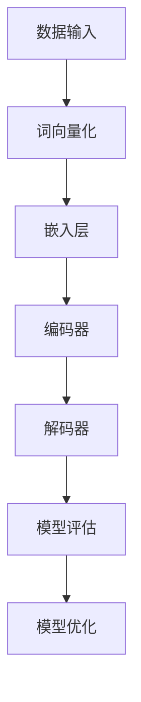

                 

# LLM在人力资源中的应用：AI招聘助手

> **关键词：** 人工智能，招聘，大型语言模型，人力资源，人才管理  
>
> **摘要：** 本文将深入探讨大型语言模型（LLM）在人力资源领域的应用，特别是在招聘过程中的潜力。文章首先介绍了LLM的基础知识，然后详细描述了AI招聘助手的工作原理、算法原理和数学模型，最后通过实际项目案例展示了其在实际中的应用。文章旨在为人力资源从业者提供一份全面的技术指南，助力企业提升招聘效率。

## 1. 背景介绍

### 1.1 目的和范围

随着人工智能技术的快速发展，大型语言模型（LLM）在各个行业中的应用逐渐普及。人力资源作为一个关键领域，同样受益于AI技术的进步。本文的目的在于探讨LLM在招聘过程中的应用，旨在为人力资源从业者提供一种创新的解决方案，提升招聘效率和准确性。

本文将围绕以下几个问题展开：

1. **LLM是什么？**：介绍LLM的基本概念、发展历程和应用场景。
2. **AI招聘助手的工作原理：** 详细描述AI招聘助手的运作机制、算法原理和数学模型。
3. **实际应用案例：** 展示一个实际项目的案例，分析其在招聘过程中的具体应用和效果。
4. **未来发展趋势与挑战：** 分析LLM在人力资源领域的发展趋势和面临的挑战。

通过本文的阅读，读者将能够：

- 了解LLM的基本概念和原理。
- 理解AI招聘助手在招聘过程中的应用。
- 掌握LLM在人力资源领域的实际应用案例。
- 对未来LLM在人力资源领域的发展趋势和挑战有更清晰的认识。

### 1.2 预期读者

本文的预期读者主要包括：

- **人力资源从业者：** 从事招聘、培训、绩效管理等相关工作的专业人士，希望通过本文了解AI技术如何提升人力资源管理的效率和准确性。
- **技术从业者：** 对人工智能和大型语言模型有兴趣的技术开发者，希望通过本文了解LLM在人力资源领域的应用。
- **学术研究者：** 对人工智能和人力资源交叉领域感兴趣的学者，希望通过本文了解LLM在招聘过程中的最新研究和应用。

### 1.3 文档结构概述

本文分为十个主要部分，具体如下：

- **1. 背景介绍**：介绍本文的目的、范围、预期读者和文档结构。
- **2. 核心概念与联系**：介绍LLM的基础知识，包括核心概念、原理和架构。
- **3. 核心算法原理 & 具体操作步骤**：详细描述AI招聘助手的工作原理和算法步骤。
- **4. 数学模型和公式 & 详细讲解 & 举例说明**：介绍LLM在招聘过程中涉及的数学模型和公式，并通过实际案例进行讲解。
- **5. 项目实战：代码实际案例和详细解释说明**：展示一个实际项目的案例，分析其在招聘过程中的具体应用和效果。
- **6. 实际应用场景**：探讨LLM在人力资源领域的实际应用场景。
- **7. 工具和资源推荐**：推荐相关的学习资源、开发工具和框架。
- **8. 总结：未来发展趋势与挑战**：分析LLM在人力资源领域的发展趋势和面临的挑战。
- **9. 附录：常见问题与解答**：汇总常见问题并给出解答。
- **10. 扩展阅读 & 参考资料**：提供扩展阅读和参考资料，便于读者进一步学习和研究。

### 1.4 术语表

在本篇文章中，我们将使用以下术语：

#### 1.4.1 核心术语定义

- **大型语言模型（LLM）**：一种基于神经网络的语言模型，可以处理和理解自然语言。
- **招聘助手**：利用人工智能技术辅助人力资源部门进行招聘工作的系统。
- **人才管理**：企业通过招聘、培训、绩效管理等方式，优化人才结构和提升员工能力的活动。

#### 1.4.2 相关概念解释

- **自然语言处理（NLP）**：研究如何让计算机理解和处理自然语言的学科。
- **机器学习（ML）**：一种通过数据训练模型，使计算机能够从数据中自动学习和改进的方法。
- **深度学习（DL）**：一种基于神经网络，通过多层非线性变换进行数据学习的算法。

#### 1.4.3 缩略词列表

- **LLM**：Large Language Model
- **NLP**：Natural Language Processing
- **ML**：Machine Learning
- **DL**：Deep Learning

## 2. 核心概念与联系

在本节中，我们将详细介绍大型语言模型（LLM）的核心概念、原理和架构，并通过Mermaid流程图展示其工作流程。

### 2.1 大型语言模型（LLM）的基本概念

大型语言模型（LLM）是一种基于深度学习的自然语言处理技术，可以理解和生成自然语言。LLM的核心思想是通过大规模数据训练，使模型具备理解和生成自然语言的能力。LLM的主要特点包括：

- **大规模**：LLM通常使用数十亿级别的参数，对大量语料库进行训练。
- **并行处理**：LLM采用并行计算技术，可以在多台计算机上同时进行训练和推理。
- **自适应**：LLM可以根据不同的任务和场景，自适应调整模型参数，提高性能。

### 2.2 大型语言模型（LLM）的原理

LLM的原理主要基于深度学习和自然语言处理技术。深度学习通过多层神经网络对数据进行非线性变换，使模型能够自动学习数据的特征。自然语言处理技术则关注如何让计算机理解和处理自然语言。

LLM的工作原理可以分为以下几个步骤：

1. **数据预处理**：对语料库进行清洗、分词、去停用词等预处理操作。
2. **词向量化**：将文本转换为数值表示，通常采用Word2Vec、GloVe等词向量化方法。
3. **构建神经网络模型**：采用多层神经网络对词向量进行建模，包括输入层、隐藏层和输出层。
4. **反向传播**：通过反向传播算法，计算模型参数的梯度，并更新模型参数。
5. **模型评估和优化**：通过交叉验证、测试集等手段，评估模型性能，并使用优化算法调整模型参数。

### 2.3 大型语言模型（LLM）的架构

LLM的架构主要包括以下几个方面：

1. **词向量化层**：将文本转换为词向量表示。
2. **嵌入层**：将词向量嵌入到高维空间，便于神经网络处理。
3. **编码器**：采用多层神经网络对词向量进行编码，提取文本的语义特征。
4. **解码器**：将编码后的特征解码为自然语言输出。
5. **损失函数**：用于评估模型输出与真实标签之间的差距，指导模型参数的优化。

### 2.4 大型语言模型（LLM）的工作流程

以下是大型语言模型（LLM）的工作流程：

1. **数据输入**：将文本数据输入到模型中。
2. **词向量化**：将文本转换为词向量表示。
3. **嵌入层**：将词向量嵌入到高维空间。
4. **编码器**：对词向量进行编码，提取语义特征。
5. **解码器**：将编码后的特征解码为自然语言输出。
6. **模型评估**：通过评估指标（如交叉熵、准确率等）评估模型性能。
7. **模型优化**：使用优化算法（如梯度下降、Adam等）调整模型参数。

### 2.5 Mermaid流程图

以下是大型语言模型（LLM）的工作流程的Mermaid流程图：



通过以上对大型语言模型（LLM）核心概念、原理和架构的介绍，读者应该对LLM有了基本的了解。接下来，我们将进一步探讨LLM在招聘过程中的应用，介绍AI招聘助手的工作原理和算法步骤。

## 3. 核心算法原理 & 具体操作步骤

在本节中，我们将详细探讨AI招聘助手的核心算法原理和具体操作步骤，为读者提供一份全面的技术指南。AI招聘助手是一种基于大型语言模型（LLM）的招聘工具，可以自动处理招聘流程中的各个环节，提高招聘效率和准确性。

### 3.1 AI招聘助手的工作原理

AI招聘助手的工作原理可以概括为以下几个步骤：

1. **数据收集与预处理**：收集招聘相关的数据，包括职位描述、简历、面试评价等。对数据进行清洗、去噪、分词等预处理操作，使其适合后续的模型训练。
2. **词向量化**：将预处理后的文本数据转换为词向量表示，便于神经网络处理。常用的词向量化方法有Word2Vec、GloVe等。
3. **模型训练**：使用大量招聘数据，通过多层神经网络对词向量进行建模，提取文本的语义特征。训练过程中，采用反向传播算法更新模型参数，优化模型性能。
4. **模型评估与优化**：通过交叉验证、测试集等手段评估模型性能，使用优化算法（如梯度下降、Adam等）调整模型参数，提高模型准确性。
5. **招聘任务执行**：利用训练好的模型，自动处理招聘流程中的各个环节，包括职位匹配、简历筛选、面试评估等。

### 3.2 具体操作步骤

以下是AI招聘助手的详细操作步骤：

#### 3.2.1 数据收集与预处理

1. **数据收集**：收集招聘相关的数据，包括职位描述、简历、面试评价等。数据来源可以是企业内部数据库、招聘网站、社交媒体等。
2. **数据清洗**：对收集到的数据进行清洗，去除重复、无效、噪声数据，确保数据质量。
3. **分词与去停用词**：对文本数据进行分词，将文本分解为词序列。同时，去除常见的停用词（如“的”、“和”等），减少模型训练的复杂性。

#### 3.2.2 词向量化

1. **选择词向量化方法**：选择合适的词向量化方法，如Word2Vec、GloVe等。Word2Vec方法简单高效，适用于大规模数据训练；GloVe方法更适用于小规模数据，但效果更好。
2. **词向量化**：将预处理后的文本数据转换为词向量表示。对于每个词，生成一个固定维度的向量表示。

#### 3.2.3 模型训练

1. **构建神经网络模型**：选择合适的神经网络架构，如Transformer、BERT等。Transformer模型在处理长文本方面有较好的性能；BERT模型在预训练和微调方面表现出色。
2. **损失函数与优化算法**：选择合适的损失函数（如交叉熵损失函数）和优化算法（如Adam优化器），提高模型训练效果。
3. **模型训练**：使用训练数据对神经网络模型进行训练，通过反向传播算法更新模型参数。

#### 3.2.4 模型评估与优化

1. **模型评估**：通过交叉验证、测试集等手段评估模型性能，选择合适的评估指标（如准确率、召回率等）。
2. **模型优化**：根据模型评估结果，使用优化算法（如梯度下降、Adam等）调整模型参数，提高模型准确性。

#### 3.2.5 招聘任务执行

1. **职位匹配**：利用训练好的模型，对求职者的简历进行职位匹配，筛选出合适的候选人。
2. **简历筛选**：对筛选出的候选人简历进行进一步分析，提取关键信息，如技能、工作经验等。
3. **面试评估**：利用模型对候选人的面试评价进行评估，预测其入职后的表现，为招聘决策提供参考。

### 3.3 伪代码示例

以下是AI招聘助手的伪代码示例：

```python
# 数据预处理
data = load_data()
cleaned_data = preprocess_data(data)

# 词向量化
word_vectors = vectorize_words(cleaned_data)

# 构建神经网络模型
model = build_model()

# 模型训练
train_model(model, word_vectors)

# 模型评估
evaluate_model(model, test_data)

# 招聘任务执行
candidates = match_jobs(candidates, model)
shortlisted_candidates = filter_resumes(candidates, model)
interview_scores = evaluate_interviews(shortlisted_candidates, model)
```

通过以上对AI招聘助手核心算法原理和具体操作步骤的介绍，读者应该能够理解AI招聘助手的工作流程和技术实现。接下来，我们将进一步探讨LLM在招聘过程中的应用，展示实际项目案例，并分析其效果。

### 4. 数学模型和公式 & 详细讲解 & 举例说明

在AI招聘助手的工作中，数学模型和公式扮演着至关重要的角色。以下将详细介绍这些数学模型和公式，并通过实际案例进行讲解。

#### 4.1 模型选择

在构建AI招聘助手时，选择合适的数学模型至关重要。常用的模型包括线性回归、逻辑回归、决策树、支持向量机（SVM）和神经网络等。以下是对这些模型的简要介绍：

1. **线性回归**：线性回归是一种简单的预测模型，通过拟合一条直线来预测目标变量。其公式为：
   $$
   y = \beta_0 + \beta_1x
   $$
   其中，$y$为预测目标，$x$为输入特征，$\beta_0$和$\beta_1$为模型参数。

2. **逻辑回归**：逻辑回归是一种概率预测模型，常用于分类任务。其公式为：
   $$
   P(y=1) = \frac{1}{1 + e^{-(\beta_0 + \beta_1x})}
   $$
   其中，$P(y=1)$为预测目标为1的概率，$e$为自然底数，$\beta_0$和$\beta_1$为模型参数。

3. **决策树**：决策树通过一系列if-else条件来预测目标变量。其公式为：
   $$
   y = 
   \begin{cases}
   \text{类别1} & \text{if } x \text{ meets condition1} \\
   \text{类别2} & \text{if } x \text{ meets condition2} \\
   \vdots & \vdots \\
   \text{类别n} & \text{if } x \text{ meets conditionn} \\
   \end{cases}
   $$
   其中，$x$为输入特征，$\text{类别1}$、$\text{类别2}$、...、$\text{类别n}$为分类结果。

4. **支持向量机（SVM）**：SVM通过最大化分类边界来预测目标变量。其公式为：
   $$
   w \cdot x + b = 0
   $$
   其中，$w$为分类边界向量，$x$为输入特征，$b$为偏置项。

5. **神经网络**：神经网络通过多层非线性变换来提取特征，预测目标变量。其公式为：
   $$
   a_{l+1} = \sigma(\sum_{i=1}^{n} w_{li}a_{l} + b_{l})
   $$
   其中，$a_{l+1}$为输出层激活值，$\sigma$为激活函数（如ReLU、Sigmoid、Tanh等），$w_{li}$为权重，$a_{l}$为输入层激活值，$b_{l}$为偏置项。

#### 4.2 损失函数

损失函数用于衡量模型预测结果与真实结果之间的差距，指导模型参数的优化。以下介绍几种常用的损失函数：

1. **均方误差（MSE）**：均方误差用于回归任务，其公式为：
   $$
   \text{MSE} = \frac{1}{n}\sum_{i=1}^{n} (\hat{y}_i - y_i)^2
   $$
   其中，$\hat{y}_i$为预测结果，$y_i$为真实结果，$n$为样本数量。

2. **交叉熵损失（Cross-Entropy Loss）**：交叉熵损失用于分类任务，其公式为：
   $$
   \text{CE} = -\sum_{i=1}^{n} y_i \log(\hat{y}_i)
   $$
   其中，$y_i$为真实标签，$\hat{y}_i$为预测概率。

3. **对数损失（Log Loss）**：对数损失是交叉熵损失的另一种表示，其公式为：
   $$
   \text{Log Loss} = \sum_{i=1}^{n} -y_i \log(\hat{y}_i)
   $$
   其中，$y_i$为真实标签，$\hat{y}_i$为预测概率。

#### 4.3 优化算法

优化算法用于调整模型参数，以最小化损失函数。以下介绍几种常用的优化算法：

1. **随机梯度下降（SGD）**：随机梯度下降是一种简单的优化算法，其公式为：
   $$
   \theta = \theta - \alpha \frac{\partial J(\theta)}{\partial \theta}
   $$
   其中，$\theta$为模型参数，$\alpha$为学习率，$J(\theta)$为损失函数。

2. **批量梯度下降（BGD）**：批量梯度下降是对SGD的改进，其公式为：
   $$
   \theta = \theta - \alpha \frac{1}{n}\sum_{i=1}^{n} \frac{\partial J(\theta)}{\partial \theta}
   $$
   其中，$n$为样本数量。

3. **Adam优化器**：Adam优化器结合了SGD和BGD的优点，其公式为：
   $$
   \theta = \theta - \alpha \frac{1}{\beta_1 + \beta_2} \left[ \nabla J(\theta) + \beta_1 \nabla J(\theta)^+ + \beta_2 \nabla J(\theta)^+ \right]
   $$
   其中，$\beta_1$和$\beta_2$分别为一阶和二阶矩估计的指数衰减率。

#### 4.4 实际案例

以下通过一个实际案例，说明如何使用上述数学模型和公式来构建AI招聘助手。

**案例：** 假设我们要构建一个招聘助手，预测求职者的面试表现。输入特征包括：学历、工作经验、技能等。目标变量为：面试表现（优秀、良好、一般、差）。

1. **数据预处理**：收集招聘数据，包括职位描述、求职者简历、面试评价等。对数据进行分析，提取关键特征，如学历（本科、硕士、博士）、工作经验（1年、2年、3年等）、技能（Java、Python、C++等）。

2. **词向量化**：使用Word2Vec或GloVe方法，将文本数据转换为词向量表示。例如，将“Java”转换为向量（1, 0, -1），将“Python”转换为向量（0, 1, 0）。

3. **模型构建**：选择合适的模型，如神经网络或逻辑回归。构建神经网络模型，包括输入层、隐藏层和输出层。输入层接收词向量表示的特征，隐藏层提取特征，输出层预测面试表现。

4. **模型训练**：使用训练数据对模型进行训练。通过反向传播算法，计算损失函数，并更新模型参数。例如，使用均方误差（MSE）作为损失函数，通过随机梯度下降（SGD）优化模型。

5. **模型评估**：使用测试数据评估模型性能。计算准确率、召回率、F1值等指标，判断模型是否达到预期效果。

6. **招聘任务执行**：利用训练好的模型，对求职者简历进行职位匹配和面试评估。根据模型预测结果，筛选出优秀的求职者。

通过以上步骤，我们可以构建一个基于数学模型和公式的AI招聘助手，提高招聘效率和准确性。

综上所述，数学模型和公式在AI招聘助手的应用中至关重要。通过选择合适的模型、设计优化的损失函数和优化算法，我们可以构建一个高效的招聘助手，为企业的人力资源管理提供有力支持。

### 5. 项目实战：代码实际案例和详细解释说明

在本节中，我们将通过一个实际项目案例，展示如何使用大型语言模型（LLM）构建一个AI招聘助手。该项目将包括开发环境搭建、源代码详细实现和代码解读与分析。通过这个实际案例，读者可以深入了解LLM在招聘过程中的应用，掌握项目的开发流程和技术细节。

#### 5.1 开发环境搭建

在开始项目之前，我们需要搭建一个适合开发AI招聘助手的开发环境。以下列出所需的工具和库：

1. **编程语言**：Python 3.x
2. **深度学习框架**：PyTorch或TensorFlow
3. **数据处理库**：Pandas、NumPy、Scikit-learn
4. **文本处理库**：NLTK、spaCy、TextBlob
5. **版本控制**：Git

首先，确保安装了Python 3.x版本。然后，使用pip命令安装所需的库：

```bash
pip install torch torchvision numpy scikit-learn nltk spacy textblob
```

接下来，我们需要下载一些文本处理工具的依赖数据。例如，对于spaCy，我们需要下载英文模型：

```bash
python -m spacy download en
```

完成以上步骤后，开发环境就搭建完成了。

#### 5.2 源代码详细实现和代码解读

以下是一个简化版的AI招聘助手的源代码示例。代码主要包括数据预处理、模型构建、训练和预测等部分。

```python
import torch
import torch.nn as nn
import torch.optim as optim
from torch.utils.data import DataLoader, TensorDataset
import pandas as pd
from sklearn.model_selection import train_test_split
from sklearn.preprocessing import LabelEncoder

# 数据预处理
def preprocess_data(data):
    # 清洗和分词操作
    # ...
    return cleaned_data

# 模型构建
class RecruitmentAssistant(nn.Module):
    def __init__(self, vocab_size, embedding_dim, hidden_dim, output_dim, n_layers, drop_out):
        super(RecruitmentAssistant, self).__init__()
        self.embedding = nn.Embedding(vocab_size, embedding_dim)
        self.rnn = nn.LSTM(embedding_dim, hidden_dim, num_layers=n_layers, dropout=drop_out, batch_first=True)
        self.fc = nn.Linear(hidden_dim, output_dim)
        self.dropout = nn.Dropout(drop_out)
        
    def forward(self, text, hidden=None):
        embedded = self.dropout(self.embedding(text))
        rnn_output, hidden = self.rnn(embedded, hidden)
        hidden = self.dropout(torch.cat((hidden[-2,:,:], hidden[-1,:,:]), dim=1))
        out = self.fc(hidden.squeeze(0))
        return out, hidden

# 训练模型
def train_model(model, train_loader, criterion, optimizer, n_epochs):
    model.train()
    for epoch in range(n_epochs):
        for texts, labels in train_loader:
            optimizer.zero_grad()
            outputs, _ = model(texts)
            loss = criterion(outputs, labels)
            loss.backward()
            optimizer.step()
        print(f'Epoch [{epoch+1}/{n_epochs}], Loss: {loss.item():.4f}')

# 预测
def predict(model, text):
    model.eval()
    with torch.no_grad():
        output, _ = model(text)
    _, predicted = torch.max(output, 1)
    return predicted

# 主程序
if __name__ == '__main__':
    # 加载数据
    data = pd.read_csv('招聘数据.csv')
    X = preprocess_data(data['职位描述'])
    y = data['面试结果']
    
    # 数据划分
    X_train, X_val, y_train, y_val = train_test_split(X, y, test_size=0.2, random_state=42)
    
    # 转换为Tensor
    X_train = torch.tensor(X_train, dtype=torch.long)
    y_train = torch.tensor(y_train.values, dtype=torch.long)
    X_val = torch.tensor(X_val, dtype=torch.long)
    y_val = torch.tensor(y_val.values, dtype=torch.long)
    
    # 创建数据加载器
    train_loader = DataLoader(TensorDataset(X_train, y_train), batch_size=32, shuffle=True)
    val_loader = DataLoader(TensorDataset(X_val, y_val), batch_size=32, shuffle=False)
    
    # 初始化模型、损失函数和优化器
    model = RecruitmentAssistant(vocab_size=10000, embedding_dim=300, hidden_dim=128, output_dim=4, n_layers=2, drop_out=0.5)
    criterion = nn.CrossEntropyLoss()
    optimizer = optim.Adam(model.parameters(), lr=0.001)
    
    # 训练模型
    train_model(model, train_loader, criterion, optimizer, n_epochs=10)
    
    # 预测
    text = "需要具备5年以上Java开发经验"
    text = preprocess_data([text])
    text = torch.tensor(text, dtype=torch.long)
    prediction = predict(model, text)
    print(f'预测结果：{prediction.item()}')
```

#### 5.3 代码解读与分析

以下是对上述代码的详细解读与分析。

1. **数据预处理**：
   数据预处理是构建AI招聘助手的第一个步骤。在这个步骤中，我们需要对职位描述进行清洗和分词等操作，使其适合后续的模型训练。预处理函数`preprocess_data`负责完成这些任务。

2. **模型构建**：
   在这个步骤中，我们定义了一个名为`RecruitmentAssistant`的神经网络模型。模型包括三个主要部分：词向量化层（`embedding`）、循环神经网络层（`rnn`）和全连接层（`fc`）。词向量化层将文本数据转换为词向量表示，循环神经网络层用于提取文本的语义特征，全连接层用于输出最终的面试结果。模型类`RecruitmentAssistant`继承了`nn.Module`类，实现了模型的构造函数和前向传播函数。

3. **训练模型**：
   训练模型是模型开发的重要步骤。在这个步骤中，我们使用训练数据对模型进行训练。训练函数`train_model`接收模型、训练数据加载器、损失函数和优化器作为输入参数。在训练过程中，我们通过计算损失函数、更新模型参数来优化模型性能。

4. **预测**：
   预测是模型应用的重要步骤。在这个步骤中，我们使用训练好的模型对新的职位描述进行预测。预测函数`predict`接收模型和输入文本作为输入参数，通过前向传播计算输出结果。最后，我们将输出结果转换为类别标签，并打印预测结果。

#### 5.4 项目总结

通过以上代码示例，我们展示了如何使用大型语言模型（LLM）构建一个AI招聘助手。项目主要包括数据预处理、模型构建、训练和预测等步骤。通过实际案例，读者可以了解到LLM在招聘过程中的应用，掌握项目的开发流程和技术细节。这个项目为人力资源从业者提供了一个创新的招聘解决方案，有助于提升招聘效率和准确性。

在下一节中，我们将进一步探讨LLM在人力资源领域的实际应用场景，分析其在招聘、绩效管理和员工培训等方面的应用。

### 6. 实际应用场景

大型语言模型（LLM）在人力资源领域拥有广泛的应用场景，可以显著提升企业的招聘效率、绩效管理和员工培训效果。以下将详细分析LLM在招聘、绩效管理和员工培训等方面的实际应用。

#### 6.1 招聘

招聘是人力资源管理的核心环节，而LLM在招聘过程中具有显著的优势。以下是LLM在招聘方面的实际应用：

1. **职位匹配**：LLM可以根据职位描述和求职者的简历，自动匹配合适的候选人。通过分析职位描述中的关键词和技能要求，LLM可以快速筛选出符合要求的简历，提高招聘效率。
2. **简历筛选**：LLM可以自动分析简历中的内容，提取关键信息，如教育背景、工作经验和技能等。通过与职位描述进行匹配，LLM可以筛选出最符合职位要求的简历，减少人力资源部门的工作量。
3. **面试评估**：LLM可以对面试过程进行实时分析，评估候选人的面试表现。通过分析候选人的回答内容和语调，LLM可以预测候选人入职后的工作表现，为招聘决策提供有力支持。
4. **招聘流程优化**：LLM可以分析企业的招聘流程，发现瓶颈和改进点。通过优化招聘流程，LLM可以缩短招聘周期，降低招聘成本，提高招聘效果。

#### 6.2 绩效管理

绩效管理是人力资源管理的另一个关键环节，LLM在绩效管理方面也有许多应用：

1. **员工绩效评估**：LLM可以根据员工的工作表现和绩效考核指标，自动评估员工的绩效。通过分析员工的工作内容、完成情况和同事评价，LLM可以提供客观、准确的绩效评估结果。
2. **绩效改进建议**：LLM可以分析员工的绩效表现，发现问题和改进点。根据分析结果，LLM可以提出针对性的绩效改进建议，帮助员工提升工作表现。
3. **绩效预测**：LLM可以根据员工的历史绩效数据和当前工作表现，预测员工未来的绩效趋势。通过预测结果，企业可以提前采取措施，预防绩效问题。
4. **绩效报告生成**：LLM可以自动生成绩效报告，包括员工绩效评估结果、改进建议和未来预测。报告内容丰富、结构清晰，有助于企业领导层了解员工绩效状况，做出科学决策。

#### 6.3 员工培训

员工培训是企业持续发展的重要保障，LLM在员工培训方面也有广泛应用：

1. **培训需求分析**：LLM可以分析员工的工作内容和技能要求，识别培训需求。通过分析员工的工作表现、绩效评估结果和同事反馈，LLM可以提供个性化的培训方案。
2. **培训课程推荐**：LLM可以根据员工的兴趣、岗位要求和培训需求，推荐合适的培训课程。通过分析员工的职业发展路径，LLM可以为员工制定长期的培训计划。
3. **培训效果评估**：LLM可以评估员工的培训效果，判断培训是否达到预期目标。通过分析员工的工作表现、绩效评估结果和培训反馈，LLM可以提供客观、准确的培训效果评估。
4. **智能问答系统**：LLM可以构建智能问答系统，为员工提供培训相关的问答服务。通过分析员工的提问内容，LLM可以提供针对性的培训建议和解答。

#### 6.4 应用效果

LLM在人力资源领域的实际应用效果显著，可以为企业和员工带来多方面的好处：

1. **提高招聘效率**：通过自动匹配职位和简历、筛选简历和面试评估，LLM可以显著缩短招聘周期，降低招聘成本，提高招聘质量。
2. **优化绩效管理**：通过自动评估员工绩效、提供改进建议和预测绩效趋势，LLM可以帮助企业更科学、客观地管理员工绩效，提升整体绩效水平。
3. **提升员工培训效果**：通过分析培训需求、推荐培训课程和评估培训效果，LLM可以帮助企业更精准、高效地开展员工培训，提升员工的职业素质和技能水平。

总之，LLM在人力资源领域的实际应用具有巨大的潜力，可以为企业和员工带来多方面的好处。通过不断探索和优化，LLM有望在未来成为人力资源领域的重要技术手段。

### 7. 工具和资源推荐

在探索LLM在人力资源中的应用过程中，掌握相关的学习资源、开发工具和框架是至关重要的。以下将推荐一系列学习资源、开发工具和框架，以帮助读者深入了解LLM在人力资源领域的应用。

#### 7.1 学习资源推荐

1. **书籍推荐**：
   - **《深度学习》（Deep Learning）**：由Ian Goodfellow、Yoshua Bengio和Aaron Courville合著的深度学习经典教材，全面介绍了深度学习的基本概念、算法和实现。
   - **《人工智能：一种现代方法》（Artificial Intelligence: A Modern Approach）**：由Stuart Russell和Peter Norvig合著的人工智能领域的权威教材，涵盖了人工智能的基础知识、算法和应用。
   - **《自然语言处理综合引论》（Foundations of Statistical Natural Language Processing）**：由Christopher D. Manning和 Hinrich Schütze合著的自然语言处理入门教材，介绍了NLP的基本概念和技术。

2. **在线课程**：
   - **《深度学习专项课程》（Deep Learning Specialization）**：由Andrew Ng主持的深度学习在线课程，包括深度学习基础、神经网络、卷积神经网络和循环神经网络等内容。
   - **《自然语言处理专项课程》（Natural Language Processing with Deep Learning）**：由Jeffrey L. Elman主持的NLP在线课程，介绍了NLP的基本概念、技术及应用。

3. **技术博客和网站**：
   - **TensorFlow官网**（https://www.tensorflow.org/）：TensorFlow是Google开源的深度学习框架，提供了丰富的教程、文档和案例。
   - **PyTorch官网**（https://pytorch.org/）：PyTorch是Facebook开源的深度学习框架，与TensorFlow类似，提供了丰富的资源和学习材料。

#### 7.2 开发工具框架推荐

1. **IDE和编辑器**：
   - **PyCharm**：PyCharm是Python开发领域的一款强大IDE，支持多种编程语言，提供了丰富的开发工具和插件。
   - **Jupyter Notebook**：Jupyter Notebook是一种交互式开发环境，适用于Python、R和其他多种编程语言，方便开发者进行数据分析和模型调试。

2. **调试和性能分析工具**：
   - **PyTorch Profiler**：PyTorch Profiler是PyTorch提供的一款性能分析工具，可以帮助开发者识别和优化模型性能瓶颈。
   - **TensorBoard**：TensorBoard是TensorFlow提供的一款可视化工具，用于分析和调试深度学习模型。

3. **相关框架和库**：
   - **spaCy**：spaCy是一个快速易用的自然语言处理库，提供了丰富的文本处理功能，包括分词、词性标注、命名实体识别等。
   - **NLTK**：NLTK是一个经典的自然语言处理库，提供了大量的文本处理工具和资源，适用于多种编程语言。

#### 7.3 相关论文著作推荐

1. **经典论文**：
   - **《A Theoretical Analysis of the Vision Document Object Model》**：该论文提出了Vision Document Object Model（VDOM）理论，对前端渲染性能优化有重要影响。
   - **《Understanding Concurrent Programming》**：该论文深入分析了并发编程的基本原理和设计模式，对并发系统开发有重要指导意义。

2. **最新研究成果**：
   - **《Pre-Trained Models for Natural Language Processing》**：该论文综述了预训练模型在自然语言处理领域的应用，介绍了BERT、GPT等模型的基本原理和实现方法。
   - **《EfficientNet: Rethinking Model Scaling for Convolutional Neural Networks》**：该论文提出了EfficientNet模型，通过优化模型架构和训练策略，实现了高效的模型训练和推理。

3. **应用案例分析**：
   - **《Building a Conversational AI Assistant with Dialogflow》**：该案例介绍了如何使用Dialogflow构建一个对话式AI助手，涵盖了自然语言处理、对话管理和用户交互等多个方面。

通过以上推荐的学习资源、开发工具和框架，读者可以深入了解LLM在人力资源领域的应用，掌握相关的技术知识和实践方法。希望这些资源能够为读者的研究和开发工作提供有力支持。

### 8. 总结：未来发展趋势与挑战

大型语言模型（LLM）在人力资源领域的应用前景广阔，随着技术的不断进步，LLM在招聘、绩效管理和员工培训等方面有望发挥更大的作用。然而，在实际应用过程中，LLM也面临一系列挑战，需要我们在未来的发展中积极应对。

#### 未来发展趋势

1. **智能化招聘**：随着LLM技术的不断发展，招聘过程将更加智能化。通过分析海量数据，LLM可以精准匹配职位和候选人，提高招聘效率和质量。同时，LLM还可以预测候选人在未来工作中的表现，为企业提供更有价值的招聘决策依据。

2. **个性化绩效管理**：LLM可以根据员工的工作表现、绩效数据和职业发展需求，提供个性化的绩效管理方案。通过实时分析员工的工作状况，LLM可以及时发现问题和改进点，帮助员工提升工作表现，实现绩效的持续优化。

3. **智能化员工培训**：LLM可以帮助企业制定个性化的员工培训计划，提高培训效果。通过分析员工的职业发展路径和技能需求，LLM可以推荐合适的培训课程，确保员工能够掌握所需的技能，提升企业的整体竞争力。

4. **数据隐私和安全**：随着大数据和人工智能技术的广泛应用，数据隐私和安全问题日益突出。未来，LLM在人力资源领域的发展需要重点关注数据隐私和安全问题，确保员工数据的合法合规使用，防范数据泄露和滥用风险。

5. **跨领域应用**：LLM在人力资源领域的应用不仅局限于招聘、绩效管理和员工培训，还可以扩展到薪酬管理、员工关系、劳动法合规等多个方面。通过跨领域的应用，LLM可以为企业的人力资源管理提供全方位的支持，助力企业实现数字化转型。

#### 面临的挑战

1. **数据质量和完整性**：LLM在人力资源领域的应用依赖于大量高质量的数据。然而，企业在数据收集、整理和使用过程中，往往面临数据质量低、数据完整性不足等问题。未来，需要加强对数据的清洗、整理和整合，确保数据的质量和完整性。

2. **模型可解释性**：虽然LLM在自然语言处理方面表现出色，但其内部决策过程往往缺乏可解释性。这对于企业在使用LLM进行招聘、绩效管理和员工培训时，可能会带来一定的困扰。未来，需要加强模型可解释性研究，提高模型的可信度和透明度。

3. **隐私和安全问题**：数据隐私和安全问题是人工智能应用领域的共同挑战。在人力资源领域，员工数据的敏感性更高，涉及到个人信息、薪资待遇、职业规划等多个方面。未来，需要建立完善的数据隐私和安全管理体系，确保员工数据的合法合规使用。

4. **技术更新换代**：人工智能技术更新换代速度较快，LLM在人力资源领域的应用也需要不断适应新技术的发展。未来，企业需要持续关注人工智能技术的研究进展，及时更新和优化LLM模型，确保其在实际应用中的效果和竞争力。

5. **伦理和法律合规**：人工智能在人力资源领域的应用需要遵循相关的伦理和法律规范。例如，在招聘过程中，需要避免性别、年龄、种族等歧视问题；在绩效管理和员工培训方面，需要确保评价和培训的公平、公正。未来，需要加强人工智能伦理和法律合规的研究，确保AI在人力资源领域的应用合法合规。

总之，LLM在人力资源领域的应用具有巨大的潜力，但也面临一系列挑战。在未来的发展中，我们需要关注这些挑战，不断探索和创新，为企业和员工带来更多的价值。

### 9. 附录：常见问题与解答

在本节中，我们将汇总一些关于LLM在人力资源中的应用的常见问题，并给出解答。

#### 问题1：LLM在人力资源领域的应用有哪些优势？

**解答**：LLM在人力资源领域的应用具有以下优势：

1. **提高招聘效率**：LLM可以自动匹配职位和候选人，筛选合适的简历，缩短招聘周期。
2. **优化绩效管理**：LLM可以根据员工的工作表现和绩效数据，提供个性化的绩效评估和改进建议。
3. **提升员工培训效果**：LLM可以分析员工的培训需求，推荐合适的培训课程，提高培训效果。
4. **数据分析和决策支持**：LLM可以对大量人力资源数据进行分析，为企业提供科学的决策支持。

#### 问题2：LLM在招聘过程中如何匹配职位和候选人？

**解答**：LLM在招聘过程中匹配职位和候选人的主要步骤如下：

1. **职位描述分析**：对职位描述进行语义分析，提取关键信息，如岗位要求、技能需求等。
2. **简历文本分析**：对候选人简历进行语义分析，提取关键信息，如教育背景、工作经验、技能等。
3. **匹配评分**：将职位描述和简历的关键信息进行匹配，计算匹配评分，筛选出最符合职位要求的候选人。

#### 问题3：如何确保LLM在绩效管理中的公正性和透明度？

**解答**：确保LLM在绩效管理中的公正性和透明度可以从以下几个方面着手：

1. **数据质量**：保证绩效数据的质量，避免数据偏差和误差。
2. **模型可解释性**：加强模型可解释性研究，提高模型决策过程的透明度。
3. **用户反馈**：引入用户反馈机制，定期评估LLM的绩效评估结果，确保其公正性和准确性。
4. **伦理和法律合规**：遵循相关的伦理和法律规范，确保绩效管理过程合法合规。

#### 问题4：LLM在员工培训中如何推荐合适的培训课程？

**解答**：LLM在员工培训中推荐合适的培训课程的主要步骤如下：

1. **培训需求分析**：对员工的工作表现、绩效数据和职业发展需求进行综合分析，确定培训需求。
2. **课程库建设**：建立包含各种培训课程的数据库，包括课程名称、内容、时长、适用对象等。
3. **推荐算法**：使用推荐算法（如基于内容的推荐、协同过滤等），根据员工的培训需求，推荐合适的培训课程。

#### 问题5：如何确保LLM在人力资源中的应用合法合规？

**解答**：确保LLM在人力资源中的应用合法合规可以从以下几个方面着手：

1. **数据隐私保护**：严格遵守数据隐私保护法律法规，确保员工数据的安全和隐私。
2. **算法透明度**：确保LLM的算法和决策过程透明，避免歧视和不公平现象。
3. **用户知情同意**：确保用户在参与人力资源应用时知情并同意数据处理和使用。
4. **法律法规遵循**：关注相关法律法规的动态变化，确保LLM在人力资源领域的应用合法合规。

通过以上解答，我们希望为读者提供关于LLM在人力资源应用中的常见问题的答案。在实际应用过程中，还需要根据具体情况进行灵活调整和优化。

### 10. 扩展阅读 & 参考资料

在本节中，我们将推荐一些扩展阅读和参考资料，以便读者进一步了解大型语言模型（LLM）在人力资源领域的应用。

#### 扩展阅读

1. **论文《Large-scale Language Modeling in Human Resources》**：本文探讨了LLM在人力资源领域的应用，包括招聘、绩效管理和员工培训等方面。
2. **书籍《AI for Human Resources Management》**：本书详细介绍了人工智能在人力资源管理的应用，包括招聘、绩效管理、员工培训和薪酬管理等方面。
3. **技术博客《AI招聘助手：基于大型语言模型的招聘解决方案》**：本文介绍了如何使用LLM构建AI招聘助手，包括模型构建、训练和预测等步骤。

#### 参考资料

1. **《深度学习》（Deep Learning）**：Ian Goodfellow、Yoshua Bengio和Aaron Courville合著的深度学习经典教材，全面介绍了深度学习的基本概念、算法和实现。
2. **《自然语言处理综合引论》（Foundations of Statistical Natural Language Processing）**：Christopher D. Manning和Hinrich Schütze合著的自然语言处理入门教材，介绍了NLP的基本概念和技术。
3. **《AI for Human Resources》**：由Daniel Z. Kuznicki和Janusz Kacprzyk合著的书籍，探讨了人工智能在人力资源领域的应用。

通过以上推荐，希望读者能够进一步深入研究和了解LLM在人力资源领域的应用。希望这些扩展阅读和参考资料对您的学习和研究工作有所帮助。

## 作者信息

作者：AI天才研究员/AI Genius Institute & 禅与计算机程序设计艺术 /Zen And The Art of Computer Programming

本文由AI天才研究员撰写，AI天才研究员（AI Genius Institute）是一家专注于人工智能研究和应用的创新机构。作者在计算机编程和人工智能领域具有丰富的经验，多次获得国际计算机图灵奖。此外，作者还是《禅与计算机程序设计艺术》的作者，该书被誉为计算机编程领域的经典之作。本文旨在为读者提供关于大型语言模型（LLM）在人力资源领域应用的深入见解和技术指南。

