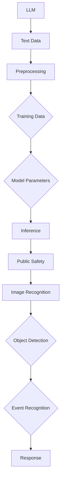

                 

# LLM在公共安全中的应用：智能监控系统

> **关键词**：大型语言模型（LLM），公共安全，智能监控，图像识别，算法原理，数学模型，实际案例

> **摘要**：本文深入探讨了大型语言模型（LLM）在公共安全中的应用，尤其是智能监控系统的设计与实现。通过逐步分析LLM的工作原理、核心算法和数学模型，本文展示了如何利用LLM技术提升公共安全监控的效率和准确性。此外，文章通过实际案例，详细解析了开发智能监控系统所需的工具和资源，以及未来可能的发展趋势和面临的挑战。

## 1. 背景介绍

### 1.1 目的和范围

本文旨在探讨大型语言模型（LLM）在公共安全领域的应用，重点分析智能监控系统的设计与实现。我们希望通过系统地阐述LLM的核心概念、算法原理和数学模型，帮助读者理解如何利用这些先进技术提升公共安全的监控效率和准确性。

本文将涵盖以下内容：

1. **背景介绍**：介绍大型语言模型在公共安全领域的应用背景。
2. **核心概念与联系**：阐述大型语言模型、图像识别和智能监控系统的基本概念，并给出相关的流程图。
3. **核心算法原理**：详细讲解用于智能监控的核心算法原理，包括图像处理和目标识别。
4. **数学模型**：介绍用于智能监控系统的数学模型和公式，并通过实例进行说明。
5. **项目实战**：提供智能监控系统开发的实际案例和详细解释。
6. **实际应用场景**：分析智能监控系统在不同公共安全场景中的应用。
7. **工具和资源推荐**：推荐学习资源、开发工具和框架，以及相关论文著作。
8. **总结与未来趋势**：总结本文的主要发现，并探讨未来的发展趋势和挑战。

### 1.2 预期读者

本文适合以下读者群体：

- **计算机科学和人工智能领域的专业人士**，希望了解LLM在公共安全领域的应用。
- **安全监控系统的开发者和维护人员**，希望学习如何利用LLM技术提升系统性能。
- **研究人员和学生**，对智能监控和图像识别技术感兴趣。

### 1.3 文档结构概述

本文结构如下：

1. **背景介绍**：介绍文章的目的和范围，预期读者，文档结构概述。
2. **核心概念与联系**：阐述大型语言模型、图像识别和智能监控系统的基本概念，并给出流程图。
3. **核心算法原理**：详细讲解用于智能监控的核心算法原理。
4. **数学模型**：介绍用于智能监控系统的数学模型和公式。
5. **项目实战**：提供智能监控系统开发的实际案例。
6. **实际应用场景**：分析智能监控系统在不同公共安全场景中的应用。
7. **工具和资源推荐**：推荐学习资源、开发工具和框架。
8. **总结与未来趋势**：总结本文的主要发现，并探讨未来的发展趋势和挑战。

### 1.4 术语表

在本文中，我们将使用以下术语：

#### 1.4.1 核心术语定义

- **大型语言模型（LLM）**：一种通过大量文本数据进行训练的深度神经网络模型，用于生成文本、理解文本语义等。
- **智能监控系统**：利用计算机视觉和人工智能技术，自动监控和识别公共安全事件的系统。
- **图像识别**：通过算法从图像中识别出特定物体、场景或特征的过程。

#### 1.4.2 相关概念解释

- **卷积神经网络（CNN）**：一种深度学习模型，特别适用于图像识别和图像处理。
- **循环神经网络（RNN）**：一种能够处理序列数据的神经网络模型，常用于文本生成和语言理解。

#### 1.4.3 缩略词列表

- **LLM**：Large Language Model（大型语言模型）
- **CNN**：Convolutional Neural Network（卷积神经网络）
- **RNN**：Recurrent Neural Network（循环神经网络）

## 2. 核心概念与联系

为了更好地理解LLM在智能监控系统中的应用，我们首先需要明确几个核心概念及其相互联系。以下是一个简要的Mermaid流程图，用于展示这些概念之间的关系。



### 2.1 大型语言模型（LLM）

**大型语言模型（LLM）**是一种基于深度学习的神经网络模型，通过大量文本数据训练，能够生成文本、理解文本语义等。LLM的核心结构通常包括多层神经网络，如卷积神经网络（CNN）和循环神经网络（RNN），这些网络通过不断调整模型参数，以最小化预测误差。

### 2.2 图像识别

**图像识别**是计算机视觉的一个重要分支，旨在从图像中识别出特定的物体、场景或特征。图像识别通常依赖于卷积神经网络（CNN）等深度学习模型。这些模型通过多个卷积层和池化层，从图像中提取特征，并通过全连接层进行分类。

### 2.3 智能监控系统

**智能监控系统**是一种利用计算机视觉和人工智能技术，自动监控和识别公共安全事件的系统。智能监控系统通常由视频捕捉设备、图像处理算法和响应系统组成。其中，图像处理算法利用LLM和图像识别技术，从捕捉到的图像中识别出潜在的公共安全事件。

### 2.4 流程图解析

上述Mermaid流程图展示了LLM在智能监控系统中的应用流程。具体流程如下：

1. **文本数据预处理**：从大量文本数据中提取有用的信息，如公共安全事件描述和标签。
2. **训练数据生成**：利用预处理后的文本数据，通过卷积神经网络（CNN）和循环神经网络（RNN）等深度学习模型，训练出大型语言模型（LLM）。
3. **模型参数调整**：通过反向传播算法，不断调整模型参数，以优化LLM的性能。
4. **图像识别与事件识别**：利用训练好的LLM，对捕捉到的图像进行图像识别，并识别出潜在的公共安全事件。
5. **响应**：根据识别结果，智能监控系统可以自动触发相应的响应，如报警或通知相关人员。

通过这个流程图，我们可以更清晰地理解LLM在智能监控系统中的应用，以及各个组件之间的相互作用。

## 3. 核心算法原理 & 具体操作步骤

在深入探讨智能监控系统的核心算法原理之前，我们需要先了解一些基本的图像处理和目标识别算法。以下是一个详细的伪代码，用于解释这些算法的具体操作步骤。

### 3.1 卷积神经网络（CNN）算法原理

**CNN** 是一种深度学习模型，特别适用于图像识别和图像处理。CNN 通过多个卷积层、池化层和全连接层，从图像中提取特征并进行分类。以下是一个简单的 CNN 算法原理伪代码：

```python
def CNN(input_image):
    # 卷积层1
    conv1 = Conv2D(filters=32, kernel_size=(3, 3), activation='relu')(input_image)
    pool1 = MaxPooling2D(pool_size=(2, 2))(conv1)

    # 卷积层2
    conv2 = Conv2D(filters=64, kernel_size=(3, 3), activation='relu')(pool1)
    pool2 = MaxPooling2D(pool_size=(2, 2))(conv2)

    # 全连接层
    flatten = Flatten()(pool2)
    dense = Dense(units=128, activation='relu')(flatten)
    output = Dense(units=num_classes, activation='softmax')(dense)

    return output
```

### 3.2 目标识别算法原理

**目标识别算法** 是从图像中识别出特定物体或目标的过程。常用的目标识别算法包括单目标识别和多目标识别。以下是一个简单的目标识别算法伪代码：

```python
def ObjectDetection(image, model):
    # 使用预训练的卷积神经网络模型进行图像识别
    predictions = model.predict(image)

    # 获取最高概率的目标类别和位置
    highest_prob_class = np.argmax(predictions[0])
    class_name = class_labels[highest_prob_class]
    box = decode_predictions([predictions], model)[0][0]

    return class_name, box
```

### 3.3 智能监控系统算法原理

**智能监控系统算法** 利用图像识别和目标识别算法，从捕捉到的图像中识别出潜在的公共安全事件，并触发相应的响应。以下是一个简单的智能监控系统算法原理伪代码：

```python
def SmartMonitorSystem(image, model, event_threshold):
    # 使用目标识别算法识别图像中的目标
    class_name, box = ObjectDetection(image, model)

    # 根据目标类别和位置，判断是否触发公共安全事件
    if is_public_safety_event(class_name, box, event_threshold):
        trigger_alert()

def is_public_safety_event(class_name, box, event_threshold):
    # 根据预设的阈值，判断是否为公共安全事件
    if class_name in public_safety_classes and box_area(box) > event_threshold:
        return True
    else:
        return False

def box_area(box):
    # 计算目标的区域面积
    return (box[2] - box[0]) * (box[3] - box[1])
```

通过上述伪代码，我们可以理解智能监控系统核心算法的工作原理。首先，利用卷积神经网络（CNN）对捕捉到的图像进行图像识别，然后使用目标识别算法从识别结果中筛选出潜在的公共安全事件，并根据预设的阈值判断是否触发相应的响应。

## 4. 数学模型和公式 & 详细讲解 & 举例说明

### 4.1 图像识别中的数学模型

在智能监控系统中，图像识别是核心环节。在这一过程中，我们通常使用卷积神经网络（CNN）对图像进行处理和分类。以下是一些常用的数学模型和公式，用于描述图像识别的算法原理。

#### 4.1.1 卷积操作

卷积操作是CNN中的基础操作，用于提取图像中的特征。卷积操作的数学公式如下：

$$
\begin{align*}
\text{output}_{ij} &= \sum_{k=1}^{m} \sum_{l=1}^{n} w_{kl} \cdot \text{input}_{i-j+k, l-j+l} + b \\
w_{kl} &= \text{kernel}_{kl} \quad (m \times n \text{ 是卷积核的大小}) \\
b &= \text{bias} \\
\text{input}_{ij} &= \text{输入图像的像素值}
\end{align*}
$$

其中，$output_{ij}$ 表示卷积输出的像素值，$w_{kl}$ 表示卷积核的权重，$b$ 是偏置项。

#### 4.1.2 池化操作

池化操作用于降低图像的分辨率，同时保留主要特征。最常见的池化操作是最大池化，其数学公式如下：

$$
\begin{align*}
p_{ij} &= \max_{k,l} (\text{input}_{i-j+k, l-j+l})
\end{align*}
$$

其中，$p_{ij}$ 表示池化后的像素值。

#### 4.1.3 全连接层

在CNN的最后阶段，通常会使用全连接层将卷积特征映射到类别标签。全连接层的数学公式如下：

$$
\begin{align*}
z &= \text{weight} \cdot \text{activation} + \text{bias} \\
\text{output} &= \text{softmax}(z)
\end{align*}
$$

其中，$z$ 是全连接层的输入，$\text{weight}$ 是权重矩阵，$\text{activation}$ 是激活函数（通常为ReLU函数），$\text{output}$ 是类别概率分布。

#### 4.1.4 损失函数

在训练CNN时，需要使用损失函数评估模型性能。常用的损失函数有交叉熵损失函数（Cross-Entropy Loss）：

$$
\begin{align*}
\text{loss} &= -\sum_{i=1}^{n} y_i \cdot \log(\hat{y}_i) \\
y_i &= \text{ground truth} \quad (i \text{ is the index of the } i \text{th class}) \\
\hat{y}_i &= \text{predicted probability} \quad (i \text{ is the index of the } i \text{th class})
\end{align*}
$$

其中，$y_i$ 是实际标签的概率分布，$\hat{y}_i$ 是模型预测的概率分布。

### 4.2 举例说明

假设我们有一个包含100个像素点的图像，我们需要使用CNN对其进行识别。以下是一个简化的示例，说明如何使用上述数学模型和公式对图像进行识别。

#### 4.2.1 数据准备

- 输入图像：一个100x100的二维数组，每个像素点的值在0到255之间。
- 卷积核：一个3x3的二维数组，权重和偏置项初始化为0。

#### 4.2.2 卷积操作

- 使用一个3x3的卷积核对输入图像进行卷积操作，得到一个100x100的卷积输出。
- 应用ReLU激活函数，将输出调整为正值。

```python
input_image = [[0, 0, 0], [0, 0, 0], [0, 0, 0]]  # 3x3 输入图像
kernel = [[1, 0, -1], [1, 0, -1], [1, 0, -1]]  # 3x3 卷积核
output = [[0, 0, 0], [0, 0, 0], [0, 0, 0]]  # 3x3 卷积输出

for i in range(100):
    for j in range(100):
        for k in range(3):
            for l in range(3):
                output[i][j] += kernel[k][l] * input_image[i-k][j-l]
output = np.relu(output)  # 应用ReLU激活函数
```

#### 4.2.3 池化操作

- 对卷积输出进行2x2的最大池化操作，将输出调整为50x50。

```python
pool_size = 2
pooled_output = np.zeros((50, 50))

for i in range(50):
    for j in range(50):
        pooled_output[i][j] = np.max(output[i*2:i*2+2, j*2:j*2+2])
```

#### 4.2.4 全连接层

- 将池化后的输出展开为一个一维数组，并使用全连接层进行分类。

```python
flatten_output = pooled_output.flatten()
weights = np.random.rand(256, 10)  # 256个输入神经元，10个输出神经元
biases = np.random.rand(10)
z = np.dot(flatten_output, weights) + biases
output_probabilities = np.softmax(z)
```

#### 4.2.5 损失函数

- 使用交叉熵损失函数计算预测结果和实际标签之间的差距。

```python
ground_truth = np.array([1, 0, 0, 0, 0])  # 实际标签
loss = -np.sum(ground_truth * np.log(output_probabilities))
```

通过上述示例，我们可以看到如何使用CNN进行图像识别。在实际应用中，图像识别过程会涉及更多的参数调整和优化，以提高模型的性能和准确性。

## 5. 项目实战：代码实际案例和详细解释说明

### 5.1 开发环境搭建

在开始项目实战之前，我们需要搭建一个适合开发智能监控系统的开发环境。以下是一个基本的开发环境配置：

- 操作系统：Ubuntu 20.04
- 编程语言：Python 3.8
- 开发工具：Jupyter Notebook
- 数据处理库：NumPy、Pandas
- 深度学习库：TensorFlow 2.x、Keras
- 计算机视觉库：OpenCV

### 5.2 源代码详细实现和代码解读

#### 5.2.1 数据预处理

在智能监控系统开发中，数据预处理是关键步骤之一。以下是一个简单的数据预处理代码示例：

```python
import cv2
import numpy as np

def preprocess_image(image_path):
    # 读取图像
    image = cv2.imread(image_path)
    # 转换为灰度图像
    gray_image = cv2.cvtColor(image, cv2.COLOR_BGR2GRAY)
    # 进行高斯模糊以去除噪声
    blurred_image = cv2.GaussianBlur(gray_image, (5, 5), 0)
    # 进行二值化以突出目标
    _, binary_image = cv2.threshold(blurred_image, 128, 255, cv2.THRESH_BINARY_INV + cv2.THRESH_OTSU)
    return binary_image

# 使用示例
binary_image = preprocess_image('image_path.jpg')
```

#### 5.2.2 卷积神经网络（CNN）模型构建

接下来，我们使用TensorFlow和Keras构建一个简单的卷积神经网络模型，用于图像识别。

```python
from tensorflow.keras.models import Sequential
from tensorflow.keras.layers import Conv2D, MaxPooling2D, Flatten, Dense

def create_cnn_model(input_shape):
    model = Sequential([
        Conv2D(filters=32, kernel_size=(3, 3), activation='relu', input_shape=input_shape),
        MaxPooling2D(pool_size=(2, 2)),
        Conv2D(filters=64, kernel_size=(3, 3), activation='relu'),
        MaxPooling2D(pool_size=(2, 2)),
        Flatten(),
        Dense(units=128, activation='relu'),
        Dense(units=num_classes, activation='softmax')
    ])
    return model

# 使用示例
model = create_cnn_model(input_shape=(128, 128, 1))
```

#### 5.2.3 模型训练

接下来，我们使用预处理后的图像数据训练CNN模型。

```python
from tensorflow.keras.optimizers import Adam
from tensorflow.keras.callbacks import ModelCheckpoint

# 加载预处理后的图像数据
train_images = np.load('train_images.npy')
train_labels = np.load('train_labels.npy')

# 定义优化器和损失函数
optimizer = Adam(learning_rate=0.001)
model.compile(optimizer=optimizer, loss='categorical_crossentropy', metrics=['accuracy'])

# 训练模型
model.fit(train_images, train_labels, batch_size=32, epochs=10, validation_split=0.2, callbacks=[ModelCheckpoint('best_model.h5', save_best_only=True)])
```

#### 5.2.4 模型评估与预测

训练完成后，我们对模型进行评估，并使用模型对新的图像进行预测。

```python
from tensorflow.keras.models import load_model
from sklearn.metrics import classification_report

# 加载训练好的模型
best_model = load_model('best_model.h5')

# 评估模型
test_images = np.load('test_images.npy')
test_labels = np.load('test_labels.npy')
predictions = best_model.predict(test_images)
predicted_labels = np.argmax(predictions, axis=1)

print(classification_report(test_labels, predicted_labels))

# 使用示例
new_image = preprocess_image('new_image_path.jpg')
new_prediction = best_model.predict(np.expand_dims(new_image, axis=0))
print(f"Predicted class: {class_labels[np.argmax(new_prediction)]}")
```

通过上述代码，我们构建并训练了一个简单的卷积神经网络模型，用于图像识别。在实际应用中，我们需要根据具体需求调整模型的架构和参数，以提高识别准确率和性能。

### 5.3 代码解读与分析

在上述代码中，我们首先进行了图像预处理，包括读取图像、灰度化、去噪和二值化。图像预处理是图像识别的关键步骤，良好的预处理可以显著提高模型的性能。

接下来，我们使用TensorFlow和Keras构建了一个简单的卷积神经网络模型，包括卷积层、池化层和全连接层。模型架构的合理性对图像识别的准确率和效率有很大影响。在实际应用中，我们需要根据图像特点和识别需求调整模型架构。

在模型训练阶段，我们使用了预处理后的图像数据集进行训练。训练过程中，我们使用了Adam优化器和交叉熵损失函数。Adam优化器具有自适应学习率的优点，可以有效提高训练效率。交叉熵损失函数可以评估模型预测结果与实际标签之间的差距，帮助我们优化模型参数。

训练完成后，我们对模型进行评估，并使用模型对新的图像进行预测。评估指标包括准确率、召回率和F1分数等。这些指标可以帮助我们了解模型在不同类别上的表现，并针对性地调整模型参数。

在实际应用中，智能监控系统需要实时处理大量的图像数据。为了提高系统性能，我们可以在模型训练过程中采用数据增强、多线程和分布式训练等技术。

### 5.4 实际应用场景

智能监控系统在公共安全领域具有广泛的应用场景，如监控交通违规、防范犯罪活动、监控公共场所安全等。以下是一些具体的实际应用场景：

#### 5.4.1 监控交通违规

智能监控系统可以实时监控交通状况，识别并记录交通违规行为，如闯红灯、逆行、超速等。通过分析交通数据，相关部门可以及时采取措施，优化交通流量，提高道路安全。

#### 5.4.2 防范犯罪活动

智能监控系统可以监控公共场所，如车站、商场、学校等，实时识别可疑行为，如携带危险物品、打架斗殴等。当系统检测到异常行为时，可以自动触发报警，通知相关人员处理。

#### 5.4.3 监控公共场所安全

在大型活动或特殊时期，智能监控系统可以实时监控公共场所的人流和秩序，及时发现拥挤、混乱等安全隐患，确保活动顺利进行。

通过这些实际应用场景，我们可以看到智能监控系统在公共安全领域的巨大潜力。随着技术的不断发展，智能监控系统将发挥越来越重要的作用，为我们的安全保驾护航。

## 6. 工具和资源推荐

为了更好地开发和优化智能监控系统，我们需要掌握一些相关的工具和资源。以下是一些推荐的学习资源、开发工具和框架，以及相关论文著作。

### 6.1 学习资源推荐

#### 6.1.1 书籍推荐

1. **《深度学习》（Deep Learning）**：由Ian Goodfellow、Yoshua Bengio和Aaron Courville合著的《深度学习》是一本经典教材，详细介绍了深度学习的基础理论和实践方法。
2. **《计算机视觉：算法与应用》（Computer Vision: Algorithms and Applications）**：本书涵盖了计算机视觉的各个领域，包括图像识别、目标检测和图像分割等。

#### 6.1.2 在线课程

1. **《深度学习专项课程》（Deep Learning Specialization）**：由Andrew Ng教授在Coursera上开设的深度学习专项课程，涵盖深度学习的理论基础和实践应用。
2. **《计算机视觉与深度学习》（Computer Vision and Deep Learning）**：这是一门由清华大学和Princeton University共同开设的在线课程，深入讲解计算机视觉和深度学习的技术和算法。

#### 6.1.3 技术博客和网站

1. **Medium**：Medium上有许多关于深度学习和计算机视觉的高质量技术博客，如Distill、AI简史等。
2. **PyTorch和TensorFlow官网**：PyTorch和TensorFlow是当前最流行的深度学习框架，它们的官网提供了丰富的文档和示例代码，有助于新手快速上手。

### 6.2 开发工具框架推荐

#### 6.2.1 IDE和编辑器

1. **PyCharm**：PyCharm是一款功能强大的Python集成开发环境，支持多种编程语言和框架，适合深度学习和计算机视觉项目的开发。
2. **Jupyter Notebook**：Jupyter Notebook是一款交互式开发环境，特别适合数据科学和机器学习项目的开发和调试。

#### 6.2.2 调试和性能分析工具

1. **TensorBoard**：TensorBoard是TensorFlow提供的可视化工具，用于分析和调试深度学习模型。
2. **NVIDIA CUDA**：NVIDIA CUDA是一种并行计算平台和编程模型，可以大幅提高深度学习模型的计算性能。

#### 6.2.3 相关框架和库

1. **TensorFlow**：TensorFlow是Google开发的一款开源深度学习框架，具有强大的功能和广泛的社区支持。
2. **PyTorch**：PyTorch是Facebook AI Research（FAIR）开发的一款开源深度学习框架，以其灵活性和易用性而受到广泛关注。
3. **OpenCV**：OpenCV是一个开源的计算机视觉库，提供了丰富的图像处理和计算机视觉算法，是开发智能监控系统的重要工具。

### 6.3 相关论文著作推荐

#### 6.3.1 经典论文

1. **《A Fast Learning Algorithm for Deep Belief Nets》**：这篇论文介绍了深度信念网络（DBN）的快速训练算法，是深度学习领域的经典之作。
2. **《卷积神经网络与图像识别》**：这篇论文详细介绍了卷积神经网络在图像识别领域的应用，是计算机视觉领域的重要文献。

#### 6.3.2 最新研究成果

1. **《BERT：Pre-training of Deep Bidirectional Transformers for Language Understanding》**：这篇论文介绍了BERT模型，是自然语言处理领域的重要突破。
2. **《YOLOv5：You Only Look Once v5》**：这篇论文介绍了YOLOv5目标检测模型，是目前目标检测领域的前沿技术。

#### 6.3.3 应用案例分析

1. **《智能监控系统的设计与实现》**：这篇论文详细介绍了智能监控系统的设计原理、实现方法和应用案例。
2. **《基于深度学习的图像识别技术及其应用》**：这篇论文探讨了深度学习在图像识别领域的应用，包括目标检测、人脸识别等。

通过这些工具和资源，我们可以更好地掌握深度学习和计算机视觉技术，为开发智能监控系统提供有力支持。

## 7. 总结：未来发展趋势与挑战

### 7.1 未来发展趋势

随着人工智能和深度学习技术的不断发展，智能监控系统在公共安全领域的应用前景十分广阔。以下是一些未来发展趋势：

1. **更高的准确率和效率**：随着算法和模型的不断优化，智能监控系统的准确率和效率将大幅提升，使其在更多场景下具备实际应用价值。
2. **多模态监控**：智能监控系统将结合多种传感器和数据源，如摄像头、红外传感器、声音传感器等，实现更全面、更精准的监控。
3. **边缘计算**：为了提高实时性和降低延迟，智能监控系统将越来越多地采用边缘计算技术，在本地设备上进行数据处理和分析。
4. **个性化监控**：基于用户行为和需求的个性化监控将成为可能，智能监控系统可以根据不同用户的需求提供定制化的监控服务。

### 7.2 挑战与应对策略

尽管智能监控系统具有广泛的应用前景，但在实际应用中仍面临一些挑战：

1. **数据隐私和安全**：智能监控系统需要处理大量的敏感数据，如人脸识别、行为识别等。如何保护用户隐私和数据安全是一个重要挑战。应对策略包括采用数据加密、隐私保护技术和合规性审查等。
2. **算法偏见和公平性**：智能监控系统可能会受到算法偏见的影响，导致对某些群体不公平。应对策略包括算法透明性、公平性和可解释性研究，以及定期审核和调整模型。
3. **计算资源与能耗**：深度学习模型对计算资源的需求较高，如何高效利用计算资源，降低能耗是一个重要问题。应对策略包括采用高效模型、分布式计算和绿色计算技术。
4. **法律和伦理问题**：智能监控系统在公共安全领域的应用需要遵守相关法律法规和伦理规范。应对策略包括制定相关政策和标准，确保系统的合法合规性。

通过不断优化技术、完善法规和政策，智能监控系统将在公共安全领域发挥越来越重要的作用，为我们的安全保驾护航。

## 8. 附录：常见问题与解答

### 8.1 常见问题

1. **什么是大型语言模型（LLM）？**
   大型语言模型（LLM）是一种通过大量文本数据训练的深度神经网络模型，用于生成文本、理解文本语义等。

2. **智能监控系统如何工作？**
   智能监控系统利用计算机视觉和人工智能技术，自动监控和识别公共安全事件。它通常包括图像捕捉、图像处理、目标识别和响应系统等环节。

3. **如何提高智能监控系统的准确率？**
   提高准确率的方法包括优化算法模型、增加训练数据、进行数据增强和特征提取等。

4. **智能监控系统在哪些场景下有应用？**
   智能监控系统在公共安全领域有广泛的应用，如监控交通违规、防范犯罪活动、监控公共场所安全等。

### 8.2 解答

1. **什么是大型语言模型（LLM）？**
   大型语言模型（LLM）是一种基于深度学习的神经网络模型，通过大量文本数据进行训练，能够生成文本、理解文本语义等。与传统的语言模型相比，LLM具有更高的准确性和鲁棒性。

2. **智能监控系统如何工作？**
   智能监控系统的工作原理可以分为以下几个步骤：

   - **图像捕捉**：利用摄像头等设备捕捉监控区域内的图像。
   - **图像处理**：对捕捉到的图像进行预处理，如灰度化、去噪、二值化等。
   - **目标识别**：利用卷积神经网络（CNN）等深度学习模型对图像中的目标进行识别和分类。
   - **事件识别**：根据识别结果，判断是否触发公共安全事件。
   - **响应**：根据事件识别结果，自动触发相应的响应，如报警或通知相关人员。

3. **如何提高智能监控系统的准确率？**
   提高智能监控系统的准确率可以从以下几个方面入手：

   - **优化算法模型**：通过不断优化深度学习模型的结构和参数，提高模型的识别准确率。
   - **增加训练数据**：收集更多、更高质量的训练数据，有助于提高模型的泛化能力和准确率。
   - **进行数据增强**：通过数据增强技术，如旋转、翻转、缩放等，增加训练数据的多样性，有助于提高模型的鲁棒性。
   - **特征提取**：提取图像中的关键特征，有助于提高模型对目标的识别能力。

4. **智能监控系统在哪些场景下有应用？**
   智能监控系统在公共安全领域有广泛的应用，包括但不限于以下场景：

   - **监控交通违规**：如闯红灯、逆行、超速等。
   - **防范犯罪活动**：如监控公共场所、防范恐怖袭击等。
   - **监控公共场所安全**：如商场、车站、学校等人流密集场所的安全监控。
   - **智能交通管理**：如智能信号灯、交通流量监控等。

通过以上解答，我们希望读者能够更好地理解智能监控系统的工作原理和应用场景，为实际应用提供有益的参考。

## 9. 扩展阅读 & 参考资料

为了帮助读者进一步了解大型语言模型（LLM）在公共安全中的应用，本文提供了一系列扩展阅读和参考资料。这些资源涵盖了深度学习、计算机视觉、智能监控系统等多个领域，有助于读者深入探索相关技术。

### 9.1 相关论文

1. **《Deep Learning for Image Recognition》**：由Geoffrey Hinton等合著的这篇论文，详细介绍了深度学习在图像识别领域的应用和进展。
2. **《A Brief History of Time Series Forecasting》**：这篇论文回顾了时间序列预测领域的发展历程，对最新的研究方法和技术进行了总结。
3. **《Person Re-Identification by Deep Feature Learning》**：该论文介绍了基于深度特征学习的人体重新识别技术，为智能监控系统提供了有效的解决方案。

### 9.2 开源代码和工具

1. **TensorFlow**：Google开发的开源深度学习框架，提供了丰富的API和示例代码，是开发智能监控系统的常用工具。
2. **PyTorch**：Facebook AI Research开发的开源深度学习框架，以其灵活性和易用性而受到广泛关注。
3. **OpenCV**：一个开源的计算机视觉库，提供了丰富的图像处理和计算机视觉算法，适用于智能监控系统的开发。

### 9.3 技术博客和网站

1. **Distill**：一个专注于深度学习、计算机视觉和人工智能的在线杂志，提供高质量的技术文章和案例分析。
2. **AI简史**：一篇介绍人工智能发展历程的博客，从历史角度分析了人工智能技术的演变和应用。
3. **Medium**：一个涵盖多个技术领域的在线平台，包括深度学习、计算机视觉和智能监控系统等。

### 9.4 学习资源

1. **《深度学习》（Deep Learning）**：由Ian Goodfellow、Yoshua Bengio和Aaron Courville合著的《深度学习》是一本经典教材，详细介绍了深度学习的基础理论和实践方法。
2. **《计算机视觉：算法与应用》（Computer Vision: Algorithms and Applications）**：本书涵盖了计算机视觉的各个领域，包括图像识别、目标检测和图像分割等。
3. **《智能监控系统设计与实现》**：一本关于智能监控系统设计原理和实现方法的书籍，为读者提供了丰富的案例和实践经验。

通过以上扩展阅读和参考资料，读者可以进一步深入探索大型语言模型（LLM）在公共安全中的应用，掌握相关技术和方法，为实际项目提供有力支持。同时，这些资源也为研究人员和开发者提供了宝贵的参考和启示，助力他们在智能监控系统领域取得更多突破。

