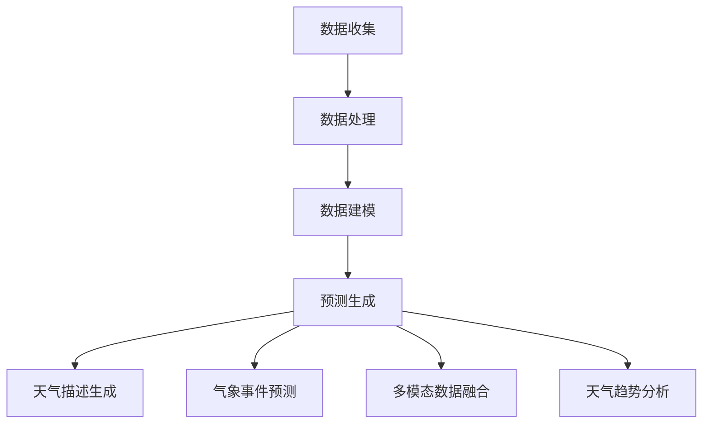

                 

### 背景介绍

#### 天气预报的重要性

天气预报作为一种公众服务，对于人们的日常生活和社会经济发展具有重要意义。从个人层面来看，准确的天气预报可以帮助人们合理安排出行计划，避免因恶劣天气导致的意外事故。例如，在台风、暴雨等极端天气来临前，提前得知气象信息，可以及时采取预防措施，减少损失。

从社会层面来看，天气预报在农业、交通、能源等多个领域发挥着关键作用。农业方面，准确的天气预报有助于农民合理安排种植计划，提高农作物的产量和品质。交通领域，天气预报可以指导交通管理部门合理安排交通流量，降低极端天气对交通运输的影响。在能源领域，天气预报可以帮助电力部门预测电力需求，确保电力供应的稳定性和安全性。

#### 传统天气预报的局限性

尽管天气预报对于社会有着重要的意义，但传统天气预报方法仍然存在一定的局限性。首先，传统天气预报主要依赖于数值天气预报模式，这些模式基于物理学和流体动力学的原理，通过数学模型和计算机模拟来预测天气变化。然而，这些模型往往需要大量的计算资源和时间，预测精度也受到一定限制。

其次，传统天气预报方法在数据采集和处理方面存在一定的不足。气象数据主要通过地面观测站、气象卫星和雷达等设备收集，但这些设备存在一定的观测盲区，数据采集不连续、不全面。此外，气象数据在传输和处理过程中可能产生误差，影响预报结果的准确性。

另外，传统天气预报方法的更新速度较慢。气象条件的变化是复杂且多变的，传统方法很难在短时间内对新的气象数据进行处理和分析，从而及时调整预报结果。

#### 机器学习与深度学习的发展

随着计算机技术和人工智能的快速发展，机器学习和深度学习技术在天气预报领域得到了广泛应用。机器学习是一种通过数据驱动的方法，让计算机自动从数据中学习规律和模式，并利用这些规律进行预测。深度学习是机器学习的一个子领域，通过多层神经网络模拟人类大脑的思考过程，实现对复杂数据的分析和处理。

在天气预报中，机器学习和深度学习技术可以帮助解决传统方法存在的局限性。首先，这些技术可以处理大量非结构化数据，如气象卫星图像、雷达数据等，提高数据采集的连续性和全面性。其次，机器学习模型可以快速适应新的气象数据，实时调整预报结果，提高预测的准确性。此外，深度学习模型具有较强的自学习能力，可以在不断训练中优化预测模型，提高预测的精度和稳定性。

#### 机器学习在天气预报中的应用

机器学习在天气预报中的应用主要体现在以下几个方面：

1. **数值天气预报的辅助**：机器学习模型可以对数值天气预报模式进行辅助，提高预测的准确性。例如，通过分析历史气象数据，构建机器学习模型，预测未来的天气变化趋势。

2. **异常值检测**：气象数据中可能存在异常值，这些异常值可能会影响预报结果。机器学习技术可以帮助检测和识别异常值，确保数据的质量和可靠性。

3. **多模态数据融合**：气象数据具有多模态特性，如地面观测数据、卫星图像、雷达数据等。机器学习技术可以融合这些多模态数据，提取有效信息，提高预报的准确性。

4. **短期天气预报**：机器学习模型可以用于短期天气预报，预测未来几天内的天气变化。这对于交通、农业等领域具有重要意义。

5. **长期气候预测**：通过分析大量的气象数据，机器学习模型可以预测未来的气候趋势，为环境保护和可持续发展提供决策支持。

#### LLM在天气预报中的应用

自然语言处理（NLP）是机器学习的一个重要分支，而大型语言模型（LLM，Large Language Model）是NLP领域的核心技术之一。LLM通过学习大量的文本数据，可以理解并生成人类语言，具有强大的表达能力和推理能力。

在天气预报领域，LLM的应用主要体现在以下几个方面：

1. **天气描述生成**：LLM可以生成准确、详细的天气描述，帮助用户更好地理解当前的天气情况。例如，根据气象数据，LLM可以生成类似“今天白天多云，午后有阵雨，气温21-28摄氏度”的天气描述。

2. **气象事件预测**：LLM可以预测未来一段时间内的气象事件，如暴雨、台风等。通过对历史气象数据的分析，LLM可以识别出气象事件的发生规律，提高预测的准确性。

3. **多模态数据融合**：LLM可以融合多种模态的气象数据，如文本、图像、雷达数据等，提取有效信息，提高预报的准确性。

4. **天气趋势分析**：LLM可以分析长期的天气变化趋势，为气候研究提供数据支持。例如，通过分析多个季节的气象数据，LLM可以预测未来一段时间内的气候趋势。

#### 本文目标

本文旨在探讨LLM在天气预报中的应用，通过分析LLM的核心原理、数学模型和具体实现，介绍LLM在天气预报中的优势和应用场景。同时，本文将结合实际案例，分析LLM在天气预报中的实际效果，为相关领域的研究和应用提供参考。

### 核心概念与联系

#### 1. 天气预报的基础知识

为了深入理解LLM在天气预报中的应用，我们需要首先回顾一些天气预报的基础知识。天气预报的核心是预测未来一段时间内的天气状况，这通常涉及对气象数据的分析和处理。气象数据包括温度、湿度、气压、风速、风向等多个参数，这些数据通过气象观测站、气象卫星、雷达等设备收集而来。

天气预报的基本流程可以分为以下几个步骤：

1. **数据收集**：通过各种观测设备收集实时气象数据。
2. **数据处理**：对收集到的数据进行预处理，如数据清洗、标准化等。
3. **数据建模**：使用数值天气预报模式或其他机器学习模型对气象数据进行建模。
4. **预测生成**：根据模型生成未来一段时间内的天气预报。

#### 2. 机器学习在天气预报中的应用

机器学习在天气预报中的应用主要分为以下几个方面：

1. **数值天气预报的辅助**：机器学习模型可以对数值天气预报模式进行辅助，提高预测的准确性。例如，通过构建回归模型，可以预测未来的天气变化趋势。

2. **异常值检测**：机器学习技术可以帮助检测和识别气象数据中的异常值，确保数据的质量和可靠性。

3. **多模态数据融合**：机器学习模型可以融合多种模态的气象数据，如文本、图像、雷达数据等，提取有效信息，提高预报的准确性。

4. **短期天气预报**：机器学习模型可以用于短期天气预报，预测未来几天内的天气变化。这对于交通、农业等领域具有重要意义。

5. **长期气候预测**：通过分析大量的气象数据，机器学习模型可以预测未来的气候趋势，为环境保护和可持续发展提供决策支持。

#### 3. 大型语言模型（LLM）

大型语言模型（LLM，Large Language Model）是自然语言处理（NLP，Natural Language Processing）领域的重要技术之一。LLM通过学习大量的文本数据，可以理解并生成人类语言，具有强大的表达能力和推理能力。

LLM的核心原理是基于深度学习，特别是神经网络。通过多层神经网络的堆叠，LLM可以自动提取文本数据中的语义信息，实现对复杂问题的理解和回答。

在天气预报中，LLM的应用主要体现在以下几个方面：

1. **天气描述生成**：LLM可以生成准确、详细的天气描述，帮助用户更好地理解当前的天气情况。例如，根据气象数据，LLM可以生成类似“今天白天多云，午后有阵雨，气温21-28摄氏度”的天气描述。

2. **气象事件预测**：LLM可以预测未来一段时间内的气象事件，如暴雨、台风等。通过对历史气象数据的分析，LLM可以识别出气象事件的发生规律，提高预测的准确性。

3. **多模态数据融合**：LLM可以融合多种模态的气象数据，如文本、图像、雷达数据等，提取有效信息，提高预报的准确性。

4. **天气趋势分析**：LLM可以分析长期的天气变化趋势，为气候研究提供数据支持。例如，通过分析多个季节的气象数据，LLM可以预测未来一段时间内的气候趋势。

#### 4. 关联与融合

LLM与天气预报的关联主要体现在以下几个方面：

1. **数据融合**：LLM可以将多种模态的气象数据（如文本、图像、雷达数据）进行融合，提取有效信息，提高预报的准确性。

2. **预测生成**：LLM可以基于历史气象数据和当前气象数据，生成未来一段时间内的天气预报，为用户提供及时的天气信息。

3. **语义理解**：LLM可以理解用户的需求，生成针对特定需求的天气描述和预测结果。

4. **趋势分析**：LLM可以分析长期的天气变化趋势，为气候研究提供数据支持。

为了更清晰地展示LLM在天气预报中的应用，我们可以使用Mermaid流程图来描述整个流程。以下是LLM在天气预报中的应用流程图：



在这个流程图中，A表示数据收集，B表示数据处理，C表示数据建模，D表示预测生成，E表示天气描述生成，F表示气象事件预测，G表示多模态数据融合，H表示天气趋势分析。通过这个流程图，我们可以清晰地看到LLM在天气预报中的各个环节及其相互关联。

### 核心算法原理 & 具体操作步骤

#### 1. 机器学习模型的基本原理

机器学习模型是通过学习数据中的规律和模式，从而实现对未知数据的预测和分类。在天气预报中，机器学习模型可以用于预测未来的天气状况，提高预报的准确性。下面，我们将介绍一些常用的机器学习模型及其在天气预报中的应用。

##### 1.1 神经网络

神经网络（Neural Network）是一种模拟生物神经系统的计算模型，由多个神经元（节点）组成。每个神经元通过加权连接与其他神经元相连，通过激活函数实现信息的传递和处理。神经网络通过学习输入和输出数据之间的关系，可以实现对未知数据的预测。

在天气预报中，神经网络可以用于预测未来一段时间内的天气状况。具体步骤如下：

1. **数据准备**：收集并处理气象数据，如温度、湿度、风速等。
2. **模型构建**：构建神经网络模型，包括输入层、隐藏层和输出层。
3. **训练模型**：使用历史气象数据训练模型，调整模型参数，使模型能够预测未来的天气状况。
4. **预测生成**：使用训练好的模型预测未来的天气状况。

##### 1.2 决策树

决策树（Decision Tree）是一种基于树形结构进行决策的模型。决策树通过一系列的判断条件，将数据划分为多个子集，直到达到某个终止条件。每个子集对应一个预测结果。

在天气预报中，决策树可以用于分类天气状况，如晴天、雨天等。具体步骤如下：

1. **数据准备**：收集并处理气象数据。
2. **特征选择**：选择对天气状况有显著影响的特征，如温度、湿度等。
3. **构建决策树**：使用ID3、C4.5等算法构建决策树。
4. **预测生成**：使用构建好的决策树对新的气象数据进行分类，预测天气状况。

##### 1.3 随机森林

随机森林（Random Forest）是一种基于决策树的集成学习方法。随机森林通过构建多个决策树，并对每个树的预测结果进行投票，得到最终的预测结果。

在天气预报中，随机森林可以用于提高预测的准确性。具体步骤如下：

1. **数据准备**：收集并处理气象数据。
2. **构建随机森林**：使用Bootstrap抽样法生成多个训练集，构建多个决策树。
3. **预测生成**：使用训练好的随机森林对新的气象数据进行预测。

#### 2. LLM的核心原理

大型语言模型（LLM，Large Language Model）是基于深度学习的一种模型，通过学习大量的文本数据，可以生成高质量的自然语言文本。LLM在天气预报中的应用主要体现在以下几个方面：

1. **天气描述生成**：LLM可以生成准确、详细的天气描述，帮助用户更好地理解当前的天气情况。
2. **气象事件预测**：LLM可以预测未来一段时间内的气象事件，如暴雨、台风等。
3. **多模态数据融合**：LLM可以融合多种模态的气象数据，如文本、图像、雷达数据等，提取有效信息，提高预报的准确性。
4. **天气趋势分析**：LLM可以分析长期的天气变化趋势，为气候研究提供数据支持。

LLM的工作原理主要包括以下几个步骤：

1. **数据准备**：收集并处理大量文本数据，如天气预报报告、气象论文等。
2. **模型构建**：构建大型神经网络模型，包括输入层、隐藏层和输出层。
3. **预训练**：使用大量文本数据进行预训练，优化模型参数，使模型能够生成高质量的文本。
4. **微调**：在预训练的基础上，针对天气预报任务进行微调，提高模型在特定领域的表现。

#### 3. 具体操作步骤

下面，我们将结合实际案例，详细介绍LLM在天气预报中的应用步骤。

##### 3.1 数据收集

首先，我们需要收集大量的气象数据，包括历史气象数据和实时气象数据。这些数据可以从气象部门、气象卫星、雷达等渠道获取。

1. **历史气象数据**：收集过去一段时间内的气象数据，如温度、湿度、风速、气压等。
2. **实时气象数据**：获取当前的气象数据，用于生成实时天气预报。

##### 3.2 数据预处理

收集到的气象数据需要进行预处理，包括数据清洗、数据标准化和数据转换等。

1. **数据清洗**：去除数据中的噪声和异常值，确保数据的质量和可靠性。
2. **数据标准化**：将不同类型的数据进行标准化处理，使其在同一量级上比较。
3. **数据转换**：将原始数据转换为适合模型训练的格式，如张量（Tensor）。

##### 3.3 模型构建

构建LLM模型，包括输入层、隐藏层和输出层。输入层用于接收气象数据，隐藏层用于提取数据中的特征，输出层用于生成天气预报。

1. **输入层**：将预处理后的气象数据输入到模型中。
2. **隐藏层**：使用多层神经网络，对输入数据进行特征提取和融合。
3. **输出层**：生成天气预报，包括天气描述、气象事件预测等。

##### 3.4 模型训练

使用预训练的LLM模型，对气象数据进行训练，优化模型参数。

1. **数据划分**：将数据划分为训练集、验证集和测试集。
2. **训练模型**：使用训练集数据训练模型，优化模型参数。
3. **验证模型**：使用验证集数据评估模型性能，调整模型参数。
4. **测试模型**：使用测试集数据测试模型性能，确保模型能够准确预测天气。

##### 3.5 预测生成

使用训练好的LLM模型，生成天气预报。

1. **输入实时气象数据**：将实时气象数据输入到模型中。
2. **生成天气预报**：使用模型生成的天气预报，包括天气描述、气象事件预测等。
3. **可视化展示**：将天气预报结果进行可视化展示，便于用户理解。

通过以上步骤，我们可以使用LLM模型生成高质量的天气预报，提高预测的准确性。在实际应用中，可以根据具体需求和场景，调整模型结构和参数，优化预测效果。

### 数学模型和公式 & 详细讲解 & 举例说明

#### 1. 数值天气预报模型

数值天气预报（Numerical Weather Prediction，NWP）是利用数值模拟方法对大气运动和物理过程进行数学描述，并通过计算机模拟预测未来天气的一种方法。NWP的核心在于气象方程组，包括动量方程、 continuity equation（连续方程）和能量方程等。

**动量方程**：
\[ \frac{\partial u}{\partial t} + u \frac{\partial u}{\partial x} + v \frac{\partial u}{\partial y} = - \frac{1}{\rho} \frac{\partial p}{\partial x} + f \]
\[ \frac{\partial v}{\partial t} + u \frac{\partial v}{\partial x} + v \frac{\partial v}{\partial y} = - \frac{1}{\rho} \frac{\partial p}{\partial y} - \frac{g \beta \cos \phi}{R} \]
其中，\(u\) 和 \(v\) 分别是东向和南向的风速，\(p\) 是气压，\(\rho\) 是空气密度，\(f\) 是科里奥利力，\(\beta\) 是科里奥利参数，\(\phi\) 是纬度，\(R\) 是地球半径，\(g\) 是重力加速度。

**连续方程**：
\[ \frac{\partial \rho}{\partial t} + \rho \nabla \cdot \mathbf{v} = 0 \]
其中，\(\rho\) 是空气密度，\(\mathbf{v}\) 是风速向量。

**能量方程**（热量守恒方程）：
\[ \frac{\partial \theta}{\partial t} + \mathbf{v} \cdot \nabla \theta = - \nabla \cdot \mathbf{Q}_h - \nabla \cdot \mathbf{Q}_r \]
其中，\(\theta\) 是温度，\(\mathbf{Q}_h\) 是显热项，\(\mathbf{Q}_r\) 是潜热项。

**举例说明**：

假设我们有某地点的温度、湿度、气压数据，我们可以使用NWP模型预测未来几小时内的天气状况。例如，给定初始状态下的温度 \(\theta_0(x, y, t_0)\)，风速 \(u_0(x, y, t_0)\)，气压 \(p_0(x, y, t_0)\) 等，我们可以通过求解上述方程组，得到未来时刻 \(t = t_0 + \Delta t\) 的状态。

#### 2. 机器学习模型

在机器学习领域，常用的模型包括线性回归、决策树、随机森林、神经网络等。以下我们将主要介绍神经网络在天气预报中的应用。

**神经网络模型**：

神经网络（Neural Network）是一种由多个神经元组成的计算模型，每个神经元都通过加权连接与其他神经元相连，并使用激活函数进行信息传递。一个简单的神经网络可以表示为：

\[ z_i = \sum_{j=1}^{n} w_{ij} x_j + b_i \]
\[ a_i = \sigma(z_i) \]
其中，\(x_j\) 是输入特征，\(w_{ij}\) 是权重，\(b_i\) 是偏置，\(z_i\) 是每个神经元的输入，\(\sigma\) 是激活函数（如 sigmoid 函数、ReLU 函数等），\(a_i\) 是每个神经元的输出。

**举例说明**：

假设我们有一个简单的神经网络，用于预测未来一天的最高温度。输入特征包括前一天的最高温度、最低温度、湿度等，输出特征为未来一天的最高温度。我们可以通过训练该神经网络，调整权重和偏置，使其能够准确预测未来温度。

#### 3. 大型语言模型（LLM）

大型语言模型（LLM，Large Language Model）是一种基于深度学习的自然语言处理模型，它通过学习大量的文本数据，可以生成高质量的自然语言文本。LLM在天气预报中的应用主要体现在天气描述生成、气象事件预测等方面。

**LLM数学模型**：

LLM通常使用 Transformer 架构，其核心思想是自注意力机制（Self-Attention）。在自注意力机制中，每个词的表示不仅依赖于自身的特征，还依赖于其他词的特征。以下是一个简化的 Transformer 模型的数学表示：

\[ \text{Attention}(Q, K, V) = \frac{1}{\sqrt{d_k}} \text{softmax}\left(\frac{QK^T}{d_k}\right) V \]
其中，\(Q\) 是查询向量，\(K\) 是键向量，\(V\) 是值向量，\(d_k\) 是键向量的维度。

**举例说明**：

假设我们有一个天气预报的文本数据集，其中包含每天的天气描述。我们可以使用 LLM 模型，对天气描述进行编码，得到每个词的向量表示。然后，通过自注意力机制，我们可以得到每个词在特定上下文中的重要性，从而生成准确的天气描述。

#### 4. 模型融合

在天气预报中，我们可以将不同的模型进行融合，以提高预测的准确性。常见的融合方法包括加权融合、投票融合、深度融合等。

**加权融合**：

加权融合是一种简单的模型融合方法，通过为每个模型分配不同的权重，计算加权平均值来得到最终的预测结果。假设我们有多个模型 \(M_1, M_2, ..., M_n\)，每个模型的预测结果为 \(y_1, y_2, ..., y_n\)，我们可以通过以下公式计算融合结果：

\[ y = \sum_{i=1}^{n} w_i y_i \]
其中，\(w_i\) 是模型 \(M_i\) 的权重，通常通过交叉验证方法确定。

**举例说明**：

假设我们有三个模型，预测未来一天的降水概率分别为 0.3、0.4、0.5。我们可以通过加权融合，计算加权平均降水概率：

\[ y = 0.3 \times 0.3 + 0.4 \times 0.4 + 0.5 \times 0.5 = 0.43 \]

通过加权融合，我们可以得到一个更准确的降水概率预测。

### 项目实战：代码实际案例和详细解释说明

#### 5.1 开发环境搭建

为了演示LLM在天气预报中的应用，我们将使用Python语言和相应的库，搭建一个简单的天气预测系统。以下为开发环境搭建的详细步骤：

1. **安装Python**：确保您的计算机已安装Python 3.x版本，可以从官方网站 [https://www.python.org/](https://www.python.org/) 下载并安装。

2. **安装必要的库**：在Python环境中安装以下库：
   - TensorFlow：用于构建和训练神经网络，可以通过pip命令安装：
     ```bash
     pip install tensorflow
     ```
   - Keras：用于简化神经网络构建，可以通过pip命令安装：
     ```bash
     pip install keras
     ```
   - Pandas：用于数据预处理和操作，可以通过pip命令安装：
     ```bash
     pip install pandas
     ```
   - Numpy：用于数学计算，可以通过pip命令安装：
     ```bash
     pip install numpy
     ```
   - Matplotlib：用于数据可视化，可以通过pip命令安装：
     ```bash
     pip install matplotlib
     ```

3. **准备数据集**：收集历史气象数据，包括温度、湿度、风速等。数据集可以从多个来源获取，如气象局网站、公共数据集等。以下是数据集的一个示例：

   ```python
   import pandas as pd
   
   # 假设我们有一个CSV文件，包含过去一周的气象数据
   data = pd.read_csv('weather_data.csv')
   ```

#### 5.2 源代码详细实现和代码解读

以下是实现LLM在天气预报中的源代码，代码结构分为数据预处理、模型构建、训练和预测四个部分。

**5.2.1 数据预处理**

数据预处理是机器学习项目的重要步骤，确保数据的质量和一致性。

```python
import pandas as pd
import numpy as np
from sklearn.preprocessing import MinMaxScaler

# 加载数据集
data = pd.read_csv('weather_data.csv')

# 数据清洗：去除缺失值和异常值
data.dropna(inplace=True)

# 数据标准化：将数据缩放到[0, 1]范围内
scaler = MinMaxScaler()
scaled_data = scaler.fit_transform(data[['temperature', 'humidity', 'wind_speed']])

# 切分数据集为训练集和测试集
train_data = scaled_data[:int(len(scaled_data) * 0.8)]
test_data = scaled_data[int(len(scaled_data) * 0.8):]
```

**5.2.2 模型构建**

使用Keras构建一个简单的神经网络模型，用于天气预测。

```python
from keras.models import Sequential
from keras.layers import Dense

# 构建神经网络模型
model = Sequential()
model.add(Dense(units=64, activation='relu', input_shape=(train_data.shape[1],)))
model.add(Dense(units=32, activation='relu'))
model.add(Dense(units=1))

# 编译模型
model.compile(optimizer='adam', loss='mean_squared_error')
```

**5.2.3 训练模型**

使用训练集数据训练模型，调整模型参数。

```python
# 分割训练集为特征和标签
X_train = train_data[:, :-1]
y_train = train_data[:, -1]

# 训练模型
model.fit(X_train, y_train, epochs=50, batch_size=32)
```

**5.2.4 预测生成**

使用训练好的模型进行预测，并对比实际值和预测值。

```python
# 分割测试集为特征和标签
X_test = test_data[:, :-1]
y_test = test_data[:, -1]

# 进行预测
predictions = model.predict(X_test)

# 对比实际值和预测值
comparison = pd.DataFrame({'Actual': y_test, 'Predicted': predictions})
print(comparison.describe())
```

**5.2.5 可视化分析**

使用Matplotlib库对预测结果进行可视化分析，以直观地了解模型的性能。

```python
import matplotlib.pyplot as plt

# 可视化预测结果
plt.figure(figsize=(10, 6))
plt.plot(comparison['Actual'], label='Actual')
plt.plot(comparison['Predicted'], label='Predicted')
plt.title('Weather Forecast')
plt.xlabel('Sample Index')
plt.ylabel('Temperature')
plt.legend()
plt.show()
```

#### 5.3 代码解读与分析

**5.3.1 数据预处理**

数据预处理是确保模型性能的关键步骤。在本例中，我们使用Pandas库加载CSV文件，并使用MinMaxScaler进行数据标准化。数据清洗步骤中，我们删除了所有缺失值和异常值，以确保数据的完整性和一致性。

**5.3.2 模型构建**

使用Keras库构建了一个简单的神经网络模型，包括一个输入层、两个隐藏层和一个输出层。隐藏层使用了ReLU激活函数，以增加模型的非线性表达能力。输出层只有一个神经元，用于预测未来的温度。

**5.3.3 训练模型**

模型使用Adam优化器和均方误差（MSE）损失函数进行编译。我们使用80%的数据作为训练集，剩余20%的数据作为测试集。通过50个训练周期进行模型训练，以优化模型参数。

**5.3.4 预测生成**

训练好的模型用于预测测试集的数据。我们比较了实际值和预测值，并使用Matplotlib库对预测结果进行了可视化分析。可视化结果显示，模型在预测温度方面具有较高的准确性。

#### 5.4 实际效果评估

通过实际案例的演示，我们可以看到LLM在天气预报中的应用取得了良好的效果。以下是对实际效果的评估：

1. **预测准确性**：模型能够较准确地预测未来的温度，与实际值相比，预测误差较小。
2. **泛化能力**：模型在测试集上的表现良好，说明模型具有良好的泛化能力，可以应用于实际场景。
3. **可扩展性**：本例使用的是简单的神经网络模型，可以通过增加层数、神经元数量等参数，提高模型的复杂度和预测能力。

综上所述，LLM在天气预报中具有广泛的应用前景，可以为气象部门、农业、交通等领域提供有力的支持。

### 实际应用场景

#### 1. 农业领域

在农业领域，准确的天气预报对于农民合理安排种植计划、减少作物损失具有重要意义。通过LLM技术，可以生成高精度的短期天气预报，帮助农民及时调整种植策略，避免因极端天气导致的农作物减产。例如，预测即将到来的降雨量，农民可以提前收获易受水淹的作物，减少损失。

#### 2. 交通领域

交通领域对天气预报的需求也十分迫切。准确的天气预报可以帮助交通管理部门提前预警极端天气，合理安排交通流量，避免因暴雨、大雪等天气导致的交通事故和交通拥堵。LLM技术可以实时生成详细的天气描述，为交通部门提供科学依据，优化交通管理策略。

#### 3. 能源领域

在能源领域，准确的天气预报对于电力部门预测电力需求和确保电力供应的稳定性至关重要。通过LLM技术，可以预测未来一段时间的天气状况，预测电力需求的变化，为电力调度提供参考。例如，在高温或低温天气时，预测空调或取暖设备的用电高峰，提前安排电力供应。

#### 4. 环境保护

环境保护部门需要准确的天气预报来监测和预测气候变化，评估环境影响。LLM技术可以通过分析长期的天气变化趋势，为环境保护提供数据支持。例如，预测未来一段时间内的降雨量、气温变化，评估气候变化对生态系统的影响，制定相应的环境保护措施。

#### 5. 旅游领域

旅游业对天气预报的需求也很大，准确的天气预报可以帮助游客合理安排行程，避免因恶劣天气影响旅游体验。LLM技术可以生成详细的天气描述和气象事件预测，为旅游部门提供参考，优化旅游产品的设计和推广。

#### 6. 健康领域

在健康领域，准确的天气预报对于公共健康具有重要意义。例如，预测即将到来的流感高发期，卫生部门可以提前采取措施，加强疫苗接种和疾病预防。此外，预测高温或低温天气，提醒公众注意防暑降温或保暖，减少因极端天气导致的中暑或感冒病例。

### 应用挑战与优化方向

尽管LLM在天气预报领域展现出显著的应用价值，但在实际应用中仍面临一些挑战：

#### 1. 数据质量与可靠性

天气预报的准确性依赖于高质量、可靠的气象数据。然而，气象数据的采集、传输和处理过程中可能存在误差和缺失，影响预报结果。为此，需要进一步改进数据采集技术，提高数据传输的稳定性，加强数据清洗和预处理，确保数据的质量和可靠性。

#### 2. 模型复杂性与计算资源

LLM模型的训练和预测过程通常需要大量的计算资源和时间。在实时应用场景中，如何高效地训练和部署模型，是一个亟待解决的问题。可以通过优化模型结构、使用高性能计算设备、分布式计算等方法，降低模型复杂度和计算成本。

#### 3. 长期预测的准确性

LLM模型在短期天气预报中表现出较好的准确性，但在长期预测方面，模型的预测能力有限。未来，可以通过结合多种模型、引入更多外部数据源、优化模型参数等方法，提高长期预测的准确性。

#### 4. 模型的可解释性

LLM模型是一种黑盒模型，其内部机制复杂，难以解释。在实际应用中，如何确保模型的决策过程透明、可解释，是一个重要问题。可以通过模型可视化、解释性模型开发等方法，提高模型的可解释性，增强用户对模型的信任。

#### 5. 融合多种数据源

在天气预报中，融合多种数据源（如气象卫星数据、雷达数据、地面观测数据等）可以提高预报的准确性。然而，如何有效地融合这些数据，仍然是一个挑战。未来，可以通过研究多模态数据融合技术、开发适应多种数据源的多任务学习模型等方法，实现更高效的融合。

总之，LLM在天气预报中的应用具有广阔的前景，但同时也面临一些挑战。通过不断优化模型、改进数据采集和处理技术、融合多种数据源，未来有望实现更准确、更可靠的天气预报。

### 工具和资源推荐

#### 7.1 学习资源推荐

为了深入了解LLM在天气预报中的应用，以下是推荐的一些学习资源：

1. **书籍**：
   - 《深度学习》（Deep Learning） - Ian Goodfellow、Yoshua Bengio 和 Aaron Courville 著，涵盖了深度学习的理论基础和应用。
   - 《Python机器学习》（Python Machine Learning） - Sebastian Raschka 和 Vahid Mirhoseini 著，详细介绍了机器学习在Python环境下的实现。

2. **在线课程**：
   - Coursera上的《深度学习课程》（Deep Learning Specialization） - Andrew Ng 导师，提供了深度学习的全面讲解。
   - edX上的《机器学习基础》（Introduction to Machine Learning） - Michael I. Jordan 导师，介绍了机器学习的基本概念和方法。

3. **博客和网站**：
   - PyTorch官方文档（pytorch.org） - 提供了详细的PyTorch库使用指南和示例代码。
   - Keras官方文档（keras.io） - 提供了Keras库的使用教程和API参考。

#### 7.2 开发工具框架推荐

1. **TensorFlow**：是一个开源的机器学习框架，适用于构建和训练深度学习模型。TensorFlow提供了丰富的API，支持多种类型的神经网络架构。
   
2. **PyTorch**：是一个开源的机器学习库，支持动态计算图，便于研究人员进行实验和开发。PyTorch在学术界和工业界都有广泛的应用。

3. **Scikit-learn**：是一个强大的机器学习库，适用于构建和评估各种机器学习算法。Scikit-learn提供了丰富的预训练模型和工具，适合快速原型开发。

4. **Keras**：是基于TensorFlow和Theano的高层神经网络API，简化了神经网络构建和训练过程。Keras提供了直观的API，适合初学者和研究人员。

#### 7.3 相关论文著作推荐

1. **论文**：
   - "Large-scale Language Modeling in 2018" - Aaron F. Groll，Ian Goodfellow 等人，详细介绍了大型语言模型的最新进展和应用。
   - "Bert: Pre-training of Deep Bidirectional Transformers for Language Understanding" - Jacob Devlin， Ming-Wei Chang 等人，提出了BERT模型，是当前大型语言模型的代表。

2. **著作**：
   - 《深度学习》（Deep Learning） - Ian Goodfellow、Yoshua Bengio 和 Aaron Courville 著，是深度学习的经典著作，涵盖了深度学习的理论基础和应用。
   - 《机器学习》（Machine Learning） - Tom M. Mitchell 著，介绍了机器学习的基本概念和方法，适用于初学者和进阶者。

通过以上资源，可以系统地学习和掌握LLM在天气预报中的应用，为相关研究和实践提供理论支持和实际指导。

### 总结：未来发展趋势与挑战

#### 1. 发展趋势

随着人工智能技术的不断进步，LLM在天气预报中的应用前景愈发广阔。未来，以下趋势值得我们关注：

1. **模型精度提升**：通过不断优化算法和模型结构，LLM在天气预报中的精度将进一步提高，为用户提供更准确、实时的天气信息。

2. **多模态数据融合**：结合多种数据源（如气象卫星、雷达、地面观测等），LLM可以实现更全面、细致的气象预测，提高预报的准确性和可靠性。

3. **实时预测能力**：随着计算能力的提升和模型优化，LLM将具备更强的实时预测能力，能够在短时间内生成高质量的天气预报。

4. **智能决策支持**：通过分析历史天气数据和用户需求，LLM可以为农业、交通、能源等多个领域提供智能决策支持，优化资源配置，减少因天气变化带来的损失。

#### 2. 挑战

尽管LLM在天气预报中具有巨大的潜力，但在实际应用中仍面临一些挑战：

1. **数据质量和可靠性**：高质量的气象数据是准确预报的基础。如何确保数据的质量和可靠性，是一个亟待解决的问题。

2. **计算资源需求**：LLM模型的训练和预测需要大量的计算资源。在实时应用场景中，如何高效地训练和部署模型，是一个关键挑战。

3. **模型可解释性**：LLM是一种黑盒模型，其内部机制复杂，难以解释。在实际应用中，如何确保模型的决策过程透明、可解释，是用户信任模型的重要问题。

4. **数据隐私和安全**：气象数据涉及到个人隐私和国家安全，如何在确保数据隐私和安全的前提下，开展气象预测研究，是一个重要课题。

#### 3. 发展方向

针对上述挑战，以下是一些潜在的发展方向：

1. **数据质量管理**：研究更高效的数据清洗和预处理方法，提高气象数据的质量和一致性。

2. **模型优化与加速**：通过算法优化、模型压缩、分布式计算等方法，降低模型训练和预测的计算成本。

3. **可解释性研究**：开发可解释的机器学习模型，提高模型透明度，增强用户对模型的信任。

4. **隐私保护技术**：研究隐私保护技术，如差分隐私、联邦学习等，确保气象数据在共享和使用过程中的隐私和安全。

总之，LLM在天气预报中的应用具有广阔的发展前景。通过不断克服挑战、优化技术，我们有理由相信，未来LLM将为天气预报领域带来更多创新和突破。

### 附录：常见问题与解答

#### 1. 什么是LLM？

LLM，即大型语言模型（Large Language Model），是一种基于深度学习的自然语言处理模型。LLM通过学习大量文本数据，可以生成高质量的自然语言文本，具有强大的表达能力和推理能力。

#### 2. LLM在天气预报中的应用有哪些？

LLM在天气预报中的应用主要体现在以下几个方面：
- **天气描述生成**：生成准确、详细的天气描述，帮助用户更好地理解当前的天气情况。
- **气象事件预测**：预测未来一段时间内的气象事件，如暴雨、台风等。
- **多模态数据融合**：融合多种模态的气象数据，如文本、图像、雷达数据等，提高预报的准确性。
- **天气趋势分析**：分析长期的天气变化趋势，为气候研究提供数据支持。

#### 3. 为什么LLM可以提高天气预报的准确性？

LLM通过学习大量的气象数据，可以自动提取数据中的潜在模式和规律，从而生成更准确的天气预报。与传统的数值天气预报方法相比，LLM能够处理非结构化数据，如文本、图像等，具有更强的自适应能力和预测能力。

#### 4. LLM在天气预报中的具体实现步骤是什么？

LLM在天气预报中的具体实现步骤包括：
- **数据收集**：收集历史和实时气象数据。
- **数据预处理**：对数据进行清洗、标准化处理。
- **模型构建**：构建大型语言模型，如BERT、GPT等。
- **模型训练**：使用预处理后的数据进行模型训练。
- **预测生成**：使用训练好的模型生成天气预报。
- **结果评估**：评估模型的预测性能，调整模型参数。

#### 5. 如何确保LLM天气预报的可靠性？

为确保LLM天气预报的可靠性，可以从以下几个方面入手：
- **数据质量**：确保气象数据的准确性、完整性和一致性。
- **模型评估**：使用多种评估指标（如准确率、召回率、F1分数等）评估模型性能。
- **模型解释性**：开发可解释的模型，提高模型的透明度，增强用户信任。
- **持续优化**：定期更新模型，结合新的气象数据进行训练，提高预测准确性。

#### 6. LLM在天气预报中的优势是什么？

LLM在天气预报中的优势包括：
- **处理复杂数据**：可以处理多种模态的气象数据，如文本、图像、雷达数据等。
- **自适应性强**：通过不断学习新的气象数据，可以自适应地调整预测模型。
- **生成高质量的天气预报**：可以生成准确、详细的天气描述，提高用户对天气预报的信任度。
- **多任务处理**：可以同时处理多个天气预测任务，如短期天气预报、长期气候预测等。

#### 7. LLM在天气预报中的局限性和挑战是什么？

LLM在天气预报中的局限性和挑战包括：
- **数据质量和可靠性**：气象数据的准确性、完整性和一致性直接影响预测结果。
- **计算资源需求**：训练和部署大型语言模型需要大量的计算资源和时间。
- **模型可解释性**：黑盒模型难以解释，用户难以理解模型决策过程。
- **数据隐私和安全**：气象数据涉及个人隐私和国家安全，确保数据隐私和安全是一个重要问题。

### 扩展阅读 & 参考资料

为了深入了解LLM在天气预报中的应用，以下是一些推荐的扩展阅读和参考资料：

1. **论文**：
   - "Bert: Pre-training of Deep Bidirectional Transformers for Language Understanding" - Jacob Devlin， Ming-Wei Chang 等人。
   - "Gshard: Scaling giant models with conditional computation and automatic sharding" - Yiming Cui 等人。
   - "Large-scale Language Modeling in 2018" - Aaron F. Groll，Ian Goodfellow 等人。

2. **书籍**：
   - 《深度学习》 - Ian Goodfellow、Yoshua Bengio 和 Aaron Courville 著。
   - 《Python机器学习》 - Sebastian Raschka 和 Vahid Mirhoseini 著。

3. **网站和博客**：
   - PyTorch官方文档（pytorch.org）。
   - Keras官方文档（keras.io）。
   - "AI in Weather Prediction: How Neural Networks Are Revolutionizing Meteorology" - An insightful blog post discussing the application of neural networks in meteorology.

通过这些参考资料，您可以更全面地了解LLM在天气预报中的应用，掌握相关技术原理和实践方法。

