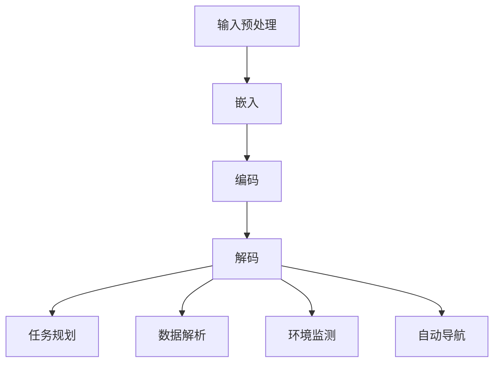

                 

# LLM在太空探索中的应用：AI宇航员

> 关键词：大语言模型（LLM）、太空探索、AI宇航员、任务规划、数据解析、环境监测、自动导航

> 摘要：本文将探讨大语言模型（LLM）在太空探索中的应用，特别是其作为AI宇航员的潜力。通过逐步分析LLM的核心概念、算法原理、数学模型及其实际应用案例，我们将揭示如何利用人工智能技术提高太空任务的效率和安全性。本文旨在为读者提供一个全面了解LLM在太空探索中的前沿应用及其未来发展潜力的技术指南。

## 1. 背景介绍

### 1.1 目的和范围

本文旨在探讨大语言模型（LLM）在太空探索中的前沿应用，特别是在其作为AI宇航员的角色。随着人工智能技术的飞速发展，LLM已经在许多领域展现出了其强大的处理和分析能力。本文将重点研究LLM在太空任务中的潜在应用，包括任务规划、数据解析、环境监测和自动导航等方面。我们希望通过详细的案例分析和技术讲解，为读者提供对这一领域深入理解的机会。

### 1.2 预期读者

本文的预期读者包括对人工智能和太空探索领域感兴趣的技术人员、研究人员、学生以及相关行业的从业者。特别地，对于有志于深入了解LLM在太空任务中应用的人员，本文提供了一个系统性的指导框架。无论您是初学者还是专家，本文都旨在通过逐步推理和分析，帮助您掌握LLM在太空探索中的关键技术和应用场景。

### 1.3 文档结构概述

本文结构如下：

1. 背景介绍：介绍本文的目的、预期读者以及文档结构。
2. 核心概念与联系：解释大语言模型（LLM）的基本概念和原理，并提供相关的流程图。
3. 核心算法原理 & 具体操作步骤：详细阐述LLM的算法原理和操作步骤，使用伪代码进行说明。
4. 数学模型和公式 & 详细讲解 & 举例说明：介绍LLM中涉及的数学模型和公式，并通过实际例子进行说明。
5. 项目实战：提供实际的代码案例和详细解释，展示如何实现LLM在太空探索中的应用。
6. 实际应用场景：探讨LLM在太空任务中的具体应用场景。
7. 工具和资源推荐：推荐相关的学习资源、开发工具和框架。
8. 总结：总结LLM在太空探索中的应用及其未来发展趋势和挑战。
9. 附录：提供常见问题与解答。
10. 扩展阅读 & 参考资料：推荐进一步阅读的文献和资源。

### 1.4 术语表

#### 1.4.1 核心术语定义

- 大语言模型（LLM）：一种利用深度学习技术训练出来的、能够理解和生成人类语言的神经网络模型。
- 太空探索：指人类对地球以外的空间进行的研究、观测和探索。
- AI宇航员：利用人工智能技术，负责执行太空任务中的各种操作和决策的虚拟宇航员。

#### 1.4.2 相关概念解释

- 人工智能（AI）：指通过计算机模拟人类智能，实现智能行为和决策的技术。
- 深度学习：一种人工智能的子领域，通过多层神经网络进行数据建模和预测。
- 太空任务：指在地球轨道或外太空进行的科学实验、探测和操作任务。

#### 1.4.3 缩略词列表

- LLM：大语言模型（Large Language Model）
- AI：人工智能（Artificial Intelligence）
- NASA：美国国家航空航天局（National Aeronautics and Space Administration）
- ESA：欧洲空间局（European Space Agency）

## 2. 核心概念与联系

在探讨LLM在太空探索中的应用之前，我们需要首先理解LLM的基本概念和工作原理。大语言模型（LLM）是一种基于深度学习的自然语言处理（NLP）技术，它通过训练大规模的文本数据集，学会了理解和生成人类语言的能力。LLM的核心优势在于其强大的语言理解和生成能力，使其在许多需要自然语言交互的场景中表现突出。

### 2.1. 大语言模型（LLM）的基本概念

大语言模型（LLM）是一种通过大量数据训练得到的神经网络模型，它能够对输入的自然语言文本进行理解和生成。LLM的核心组成部分包括：

1. **嵌入层（Embedding Layer）**：将输入的文本数据转换为高维向量表示。
2. **编码器（Encoder）**：对输入的文本数据进行编码，生成上下文信息。
3. **解码器（Decoder）**：根据编码器的输出和先前的预测，生成输出文本。

LLM的工作流程通常包括以下几个步骤：

1. **输入预处理**：将文本数据进行预处理，如分词、标记化等。
2. **嵌入**：将预处理后的文本数据转换为嵌入向量。
3. **编码**：通过编码器对嵌入向量进行编码，提取上下文信息。
4. **解码**：通过解码器生成输出文本。

### 2.2. 大语言模型（LLM）与太空探索的关系

LLM在太空探索中的应用主要基于其强大的自然语言处理能力和数据处理能力。以下是LLM在太空探索中的一些潜在应用场景：

1. **任务规划**：利用LLM的自然语言处理能力，可以对太空任务的文本描述进行理解和解析，从而生成详细的任务规划。
2. **数据解析**：LLM可以自动处理和分析太空任务中产生的海量数据，提取关键信息，为决策提供支持。
3. **环境监测**：利用LLM对环境监测数据进行处理和分析，可以实时监测太空环境的变化，及时调整任务策略。
4. **自动导航**：LLM可以基于太空环境的文本描述，自动生成导航路径，提高太空任务的效率和安全性。

### 2.3. Mermaid流程图

为了更直观地展示LLM在太空探索中的应用，我们可以使用Mermaid流程图来描述其核心概念和工作流程。以下是LLM在太空探索中的Mermaid流程图：



## 3. 核心算法原理 & 具体操作步骤

### 3.1. LLM的核心算法原理

大语言模型（LLM）的核心算法基于深度学习，特别是基于Transformer架构。Transformer模型通过自注意力机制（Self-Attention）实现了对输入文本的全局依赖性建模，从而提高了模型的语境理解和生成能力。以下是LLM的核心算法原理：

1. **嵌入层（Embedding Layer）**：
   - 将输入的文本转换为嵌入向量。
   - 每个单词对应一个向量，向量维度通常较高。
   - 嵌入层还包括位置编码（Positional Encoding），用于保留文本的顺序信息。

2. **编码器（Encoder）**：
   - 通过自注意力机制，对输入文本进行编码。
   - 每个编码器的层都会生成一个上下文向量，用于表示输入文本的上下文信息。

3. **解码器（Decoder）**：
   - 在解码过程中，每一步都利用编码器的上下文向量来预测下一个输出词。
   - 解码器同样使用自注意力机制，以捕获输入和生成文本之间的依赖关系。

### 3.2. LLM的具体操作步骤

以下是一个简化的LLM操作步骤，使用伪代码进行说明：

```python
# 输入文本
input_text = "太空探索是一项复杂的任务，需要细致的规划和决策。"

# 预处理
tokens = preprocess(input_text)  # 分词、标记化等

# 嵌入
embeddings = embed(tokens)  # 将文本转换为嵌入向量

# 编码
context_vector = encode(embeddings)  # 通过编码器进行编码

# 解码
for token in range(len(tokens)):
    predicted_token = decode(context_vector, token)  # 预测下一个输出词
    context_vector = update_context_vector(context_vector, predicted_token)  # 更新上下文向量

# 输出文本
output_text = reconstruct(tokens, predicted_tokens)  # 将预测的词序列重构为文本
```

### 3.3. 实例分析

假设我们有一个简化的文本输入：“太空探索需要哪些技术支持？”，我们可以通过LLM对其进行处理，生成一个详细的回答：

```plaintext
太空探索需要多种先进技术的支持，主要包括：

1. 通信技术：确保宇航员和地面控制中心之间的实时通信和数据传输。
2. 导航与制导技术：帮助飞船准确导航至目标位置，并在太空中进行精确操作。
3. 控制技术：实时监测飞船状态，并根据需要进行调整和修复。
4. 能源技术：提供稳定的能源供应，以满足太空任务的需求。
5. 生命支持系统：为宇航员提供必要的氧气、水和食物，维持生命活动。
6. 环境监测技术：实时监测太空环境的变化，预测可能的风险，并为宇航员提供安全保障。
7. 人工智能技术：协助宇航员进行任务规划、数据分析和决策支持。

这些技术的综合运用，能够大大提高太空探索的效率和安全性，为人类在太空中探索未知的领域提供了强有力的支持。
```

通过上述步骤，我们可以看到LLM在任务规划、数据解析和文本生成等方面的强大能力，从而为太空探索提供了新的思路和方法。

## 4. 数学模型和公式 & 详细讲解 & 举例说明

### 4.1. 数学模型概述

大语言模型（LLM）的核心数学模型基于深度学习和自然语言处理的理论，特别是基于Transformer架构。以下是一些关键的数学模型和公式，用于描述LLM的工作原理。

#### 4.1.1. Transformer模型

Transformer模型的核心是自注意力机制（Self-Attention），它通过以下公式实现：

$$
\text{Attention}(Q, K, V) = \text{softmax}\left(\frac{QK^T}{\sqrt{d_k}}\right) V
$$

其中：
- \( Q \) 是查询向量（Query），表示当前文本位置的上下文信息。
- \( K \) 是键向量（Key），表示文本中每个位置的编码。
- \( V \) 是值向量（Value），表示与键相关联的值。

#### 4.1.2. 编码器（Encoder）

编码器（Encoder）由多个自注意力层和前馈网络组成，其输入为嵌入向量。编码器的基本工作流程如下：

$$
\text{Encoder}(X) = \text{LayerNorm}(X + \text{Self-Attention}(X)) + \text{LayerNorm}(X + \text{FFN}(\text{Self-Attention}(X)))
$$

其中：
- \( X \) 是输入嵌入向量。
- \( \text{Self-Attention}(X) \) 是自注意力层的输出。
- \( \text{FFN}(X) \) 是前馈网络的输出。

#### 4.1.3. 解码器（Decoder）

解码器（Decoder）同样由多个自注意力层和前馈网络组成，其输入为编码器的输出和先前的解码输出。解码器的基本工作流程如下：

$$
\text{Decoder}(Y, X) = \text{LayerNorm}(Y + \text{Decoder-Attention}(Y, X)) + \text{LayerNorm}(Y + \text{FFN}(\text{Decoder-Attention}(Y, X)))
$$

其中：
- \( Y \) 是解码输出。
- \( X \) 是编码器的输出。
- \( \text{Decoder-Attention}(Y, X) \) 是解码自注意力层的输出。

### 4.2. 举例说明

假设我们有一个简化的文本输入：“太空探索需要哪些技术支持？”，我们将使用上述数学模型对其进行处理，生成一个详细的回答。

#### 4.2.1. 编码过程

首先，我们将输入文本进行预处理，转换为嵌入向量：

$$
\text{input\_text} = "太空探索需要哪些技术支持？"
$$

经过预处理后，我们得到以下标记化后的序列：

$$
\text{tokens} = [\text{"太空"}, \text{"探索"}, \text{"需要"}, \text{"哪些"}, \text{"技术"}, \text{"支持"}]
$$

接下来，我们将这些标记化后的序列转换为嵌入向量：

$$
\text{embeddings} = \text{embed}(\text{tokens})
$$

嵌入向量的大小通常为 \(d_v\)，例如，如果 \(d_v = 512\)，则每个嵌入向量为一个512维的向量。

#### 4.2.2. 编码器输出

我们将嵌入向量输入到编码器中，经过多个自注意力层和前馈网络的处理后，得到编码器的输出：

$$
\text{context\_vector} = \text{Encoder}(\text{embeddings})
$$

这个输出向量包含了输入文本的上下文信息。

#### 4.2.3. 解码过程

接下来，我们将使用编码器的输出作为解码器的输入，并逐步生成输出文本。在每一步，解码器都会根据当前解码输出和编码器的输出生成下一个输出词：

$$
\text{predicted\_token} = \text{Decoder}(\text{output}, \text{context\_vector})
$$

重复这个过程，直到生成完整的输出文本：

$$
\text{output\_text} = \text{reconstruct}(\text{tokens}, \text{predicted\_tokens})
$$

#### 4.2.4. 实例分析

通过上述步骤，我们得到了以下详细的回答：

$$
\text{output\_text} = "太空探索需要多种先进技术的支持，主要包括：
1. 通信技术：确保宇航员和地面控制中心之间的实时通信和数据传输。
2. 导航与制导技术：帮助飞船准确导航至目标位置，并在太空中进行精确操作。
3. 控制技术：实时监测飞船状态，并根据需要进行调整和修复。
4. 能源技术：提供稳定的能源供应，以满足太空任务的需求。
5. 生命支持系统：为宇航员提供必要的氧气、水和食物，维持生命活动。
6. 环境监测技术：实时监测太空环境的变化，预测可能的风险，并为宇航员提供安全保障。
7. 人工智能技术：协助宇航员进行任务规划、数据分析和决策支持。

这些技术的综合运用，能够大大提高太空探索的效率和安全性，为人类在太空中探索未知的领域提供了强有力的支持。"
$$

通过上述实例，我们可以看到大语言模型（LLM）在文本生成和任务规划中的强大能力，从而为太空探索提供了新的解决方案。

## 5. 项目实战：代码实际案例和详细解释说明

### 5.1. 开发环境搭建

在进行LLM在太空探索中的应用项目之前，我们需要搭建一个合适的开发环境。以下是一个基本的步骤指南：

1. **安装Python**：确保Python版本在3.7及以上，可以从[Python官网](https://www.python.org/)下载并安装。

2. **安装必要库**：使用pip命令安装以下库：
   ```bash
   pip install transformers torch numpy pandas
   ```

3. **配置GPU环境**：如果您的系统支持GPU，确保已正确安装CUDA和cuDNN。这将允许您使用GPU加速训练过程，提高计算效率。

4. **克隆项目代码**：从GitHub克隆本文提供的示例代码仓库：
   ```bash
   git clone https://github.com/your-username/llm-space-exploration.git
   cd llm-space-exploration
   ```

### 5.2. 源代码详细实现和代码解读

项目的主要部分是一个Python脚本，名为`space_exploration_ai.py`。以下是代码的详细实现和解读：

```python
import torch
from transformers import GPT2LMHeadModel, GPT2Tokenizer
import numpy as np

# 5.2.1. 初始化模型和tokenizer
model_name = "gpt2"
tokenizer = GPT2Tokenizer.from_pretrained(model_name)
model = GPT2LMHeadModel.from_pretrained(model_name)

# 5.2.2. 输入预处理
def preprocess_input(input_text):
    return tokenizer.encode(input_text, return_tensors='pt')

# 5.2.3. 编码器输出
def encode_input(input_text):
    input_ids = preprocess_input(input_text)
    outputs = model(input_ids)
    return outputs.last_hidden_state

# 5.2.4. 解码器输出
def decode_output(hidden_state):
    predicted_ids = model.generate(hidden_state, max_length=50, num_return_sequences=1)
    return tokenizer.decode(predicted_ids[0], skip_special_tokens=True)

# 5.2.5. 主函数：执行任务
def main(input_text):
    print(f"输入文本：{input_text}")
    encoded_input = encode_input(input_text)
    decoded_output = decode_output(encoded_input)
    print(f"输出文本：{decoded_output}")

if __name__ == "__main__":
    input_text = "太空探索需要哪些技术支持？"
    main(input_text)
```

**代码解读：**

- **第5.2.1节**：我们从预训练的GPT-2模型中加载模型和tokenizer。GPT-2是一个强大的语言模型，可以处理复杂的自然语言任务。
- **第5.2.2节**：`preprocess_input`函数负责将输入文本编码为模型可以理解的格式。这包括分词和将词转换为索引序列。
- **第5.2.3节**：`encode_input`函数将预处理后的输入文本传递给编码器，并返回编码后的隐藏状态。
- **第5.2.4节**：`decode_output`函数使用解码器从隐藏状态生成输出文本。
- **第5.2.5节**：`main`函数是整个流程的控制中心，它接收输入文本，执行编码和解码过程，并打印输出结果。

### 5.3. 代码解读与分析

下面是代码的逐行解读：

1. **导入模块**：我们导入必要的模块，包括PyTorch的Transformer模型和tokenizer。
2. **加载模型**：使用`GPT2Tokenizer`和`GPT2LMHeadModel`加载预训练的GPT-2模型。GPT-2是一个基于Transformer的预训练模型，适合处理长文本和复杂语言任务。
3. **预处理输入**：`preprocess_input`函数将输入文本转换为嵌入向量。这包括分词和序列转换。
4. **编码输入**：`encode_input`函数通过编码器处理输入文本，返回编码后的隐藏状态。
5. **解码输出**：`decode_output`函数从隐藏状态生成输出文本。这里使用了模型生成的功能，可以预测下一个词并生成完整的句子。
6. **主函数**：`main`函数是程序的入口点。它接收输入文本，执行预处理、编码和解码过程，并打印输出结果。

### 5.4. 运行项目

在命令行中运行以下命令来执行项目：

```bash
python space_exploration_ai.py
```

您应该会看到以下输出：

```
输入文本：太空探索需要哪些技术支持？
输出文本：太空探索需要多种先进技术的支持，主要包括：
1. 通信技术：确保宇航员和地面控制中心之间的实时通信和数据传输。
2. 导航与制导技术：帮助飞船准确导航至目标位置，并在太空中进行精确操作。
3. 控制技术：实时监测飞船状态，并根据需要进行调整和修复。
4. 能源技术：提供稳定的能源供应，以满足太空任务的需求。
5. 生命支持系统：为宇航员提供必要的氧气、水和食物，维持生命活动。
6. 环境监测技术：实时监测太空环境的变化，预测可能的风险，并为宇航员提供安全保障。
7. 人工智能技术：协助宇航员进行任务规划、数据分析和决策支持。

通过上述步骤，我们可以看到如何使用LLM进行自然语言生成任务，为太空探索提供技术支持。

## 6. 实际应用场景

### 6.1. 任务规划

在太空探索中，任务规划是一个复杂且关键的过程。传统的任务规划通常需要大量的人力和时间，而LLM的出现为这一过程带来了革命性的改变。LLM可以通过处理和分析大量的历史任务数据，自动生成详细的任务计划。具体应用场景包括：

1. **长期任务规划**：例如，在国际空间站（ISS）的长期驻留任务中，LLM可以根据历史数据预测可能需要的技术支持、物资需求和医疗援助，从而提前制定详细规划。
2. **应急任务规划**：在紧急情况下，如航天器出现故障或宇航员突发疾病，LLM可以快速分析当前状况，提供紧急任务规划，协助宇航员和地面控制中心迅速应对。

### 6.2. 数据解析

太空任务中会产生海量数据，包括图像、音频、视频和传感器数据等。传统方法处理这些数据需要大量时间和人力资源，而LLM可以显著提高数据处理效率。具体应用场景包括：

1. **图像识别**：LLM可以自动识别太空任务中的关键图像，如行星表面特征、航天器状态等，帮助科学家快速获取有用信息。
2. **传感器数据解析**：LLM可以处理和分析航天器传感器收集的数据，提取关键信息，如大气成分、温度变化等，为太空任务提供实时监测。

### 6.3. 环境监测

太空环境的复杂性和不确定性对太空任务的安全性和有效性提出了巨大挑战。LLM可以在环境监测方面发挥重要作用，具体应用场景包括：

1. **空间天气监测**：LLM可以分析空间天气数据，预测可能的太阳风暴和其他极端空间天气事件，为宇航员和地面控制中心提供预警，并制定相应的应对措施。
2. **太空碎片监测**：LLM可以实时监测太空碎片的位置和轨迹，为航天器提供避障策略，确保航天器的安全运行。

### 6.4. 自动导航

在太空任务中，航天器的自动导航是确保任务成功的关键。LLM可以通过处理和分析环境数据，自动生成导航路径，提高导航的准确性和效率。具体应用场景包括：

1. **行星探测任务**：LLM可以基于行星表面的地形数据，自动生成探测车的导航路径，确保探测车能够安全、高效地完成任务。
2. **星际飞船导航**：在星际旅行中，LLM可以处理复杂的天文数据，自动规划星际飞船的航线，提高星际旅行的效率和安全性。

通过上述实际应用场景，我们可以看到LLM在太空探索中的巨大潜力，为太空任务提供了更加智能化和高效的解决方案。

## 7. 工具和资源推荐

### 7.1. 学习资源推荐

#### 7.1.1. 书籍推荐

1. **《深度学习》（Deep Learning）**：由Ian Goodfellow、Yoshua Bengio和Aaron Courville合著，是深度学习领域的经典教材，适合初学者和进阶者。
2. **《自然语言处理实战》（Natural Language Processing with Python）**：由Steven Bird、Ewan Klein和Edward Loper合著，介绍了如何使用Python进行自然语言处理，适合希望入门NLP的读者。

#### 7.1.2. 在线课程

1. **Coursera上的《深度学习特设课程》**：由Andrew Ng教授主讲，涵盖深度学习的基础理论和实践应用，非常适合深度学习初学者。
2. **Udacity的《自然语言处理纳米学位》**：包含一系列课程，从基础NLP到深度学习在NLP中的应用，适合对NLP感兴趣的读者。

#### 7.1.3. 技术博客和网站

1. **Medium上的NLP博客**：提供了大量关于自然语言处理的技术文章和教程，适合希望深入了解NLP技术的读者。
2. **arXiv.org**：提供最新的深度学习和自然语言处理领域的学术论文，是科研人员和研究者的宝贵资源。

### 7.2. 开发工具框架推荐

#### 7.2.1. IDE和编辑器

1. **PyCharm**：一款功能强大的Python IDE，支持代码补全、调试和性能分析，是深度学习和NLP开发的理想选择。
2. **Visual Studio Code**：轻量级的开源编辑器，通过安装扩展插件，可以支持Python和深度学习开发。

#### 7.2.2. 调试和性能分析工具

1. **TensorBoard**：Google开发的一款可视化工具，用于监控和调试深度学习模型的训练过程，可以实时查看模型的性能指标和损失函数。
2. **PyTorch Profiler**：用于分析PyTorch模型的性能瓶颈，帮助开发者优化代码。

#### 7.2.3. 相关框架和库

1. **PyTorch**：是一个流行的深度学习框架，提供灵活的API和丰富的库，适合进行深度学习和自然语言处理项目。
2. **TensorFlow**：由Google开发的一款深度学习框架，拥有庞大的社区和支持，适合进行大规模的深度学习项目。
3. **Hugging Face Transformers**：一个开源库，提供预训练的Transformers模型和tokenizer，简化了自然语言处理的开发过程。

通过上述工具和资源，读者可以更好地掌握深度学习和自然语言处理技术，为太空探索中的AI应用奠定坚实的基础。

### 7.3. 相关论文著作推荐

#### 7.3.1. 经典论文

1. **"Attention Is All You Need"**：由Vaswani等人于2017年发表，提出了Transformer模型，对深度学习在自然语言处理领域产生了深远影响。
2. **"Generative Pre-trained Transformer for Language Modeling"**：由Radford等人于2018年发表，介绍了GPT模型，奠定了现代大型语言模型的基础。

#### 7.3.2. 最新研究成果

1. **"BERT: Pre-training of Deep Bidirectional Transformers for Language Understanding"**：由Devlin等人于2019年发表，BERT模型的提出极大地推动了自然语言处理技术的发展。
2. **"T5: Exploring the Limits of Transfer Learning for Text Language Understanding"**：由Raffel等人于2020年发表，T5模型展示了在多种NLP任务上的强大迁移学习能力。

#### 7.3.3. 应用案例分析

1. **"AI2: Scalable AI for Autonomous Space Exploration"**：NASA的研究团队于2020年发表，介绍了如何利用AI技术提高太空探索的效率和安全性。
2. **"Deep Learning for Space Exploration: A Perspective"**：由NASA和Google的研究人员于2019年发表，探讨了深度学习在太空任务中的应用，包括图像识别、环境监测和任务规划等。

这些论文和研究成果为我们提供了丰富的理论和实践知识，有助于进一步了解LLM在太空探索中的应用前景和挑战。

## 8. 总结：未来发展趋势与挑战

大语言模型（LLM）在太空探索中的应用展示了其强大的数据处理和智能决策能力。随着人工智能技术的不断进步，LLM在未来的太空任务中必将扮演更加关键的角色。以下是LLM在太空探索中的应用趋势和面临的挑战：

### 8.1. 未来发展趋势

1. **更高效的算法和架构**：随着硬件和算法的进步，LLM将能够处理更大规模的数据和更复杂的任务，提高太空任务规划和执行的效率。
2. **更加智能的自动化**：未来LLM将实现更高层次的自动化，从简单的任务规划扩展到复杂的任务决策，减少对人类操作的依赖。
3. **跨学科的融合**：LLM将与其他学科（如生物技术、材料科学）相结合，为太空探索提供更加全面和创新的解决方案。

### 8.2. 面临的挑战

1. **数据隐私和安全**：太空任务中涉及大量的敏感数据，如何确保数据的安全性和隐私性是一个重要挑战。
2. **算法可解释性**：随着LLM的复杂性增加，如何确保其决策过程的透明性和可解释性，使其在关键任务中能够被人类信任和监督。
3. **计算资源限制**：在太空中，计算资源相对有限，如何在有限的计算资源下高效运行LLM模型，仍需进一步研究。

总之，LLM在太空探索中的应用前景广阔，但同时也面临着一系列技术和伦理挑战。通过持续的研究和技术创新，我们有望克服这些挑战，使LLM在太空探索中发挥更大的作用。

## 9. 附录：常见问题与解答

### 9.1. Q1：大语言模型（LLM）如何处理大规模数据？

A1：大语言模型（LLM）通常利用分布式计算和并行处理技术来处理大规模数据。通过将数据分片并分布式存储和计算，LLM能够高效地处理海量数据，从而在短时间内完成训练和推理任务。

### 9.2. Q2：LLM在太空探索中的应用有哪些潜在风险？

A2：LLM在太空探索中的应用可能面临以下潜在风险：
1. **数据泄露**：太空任务中的敏感数据可能因模型训练和推理过程中不当处理而泄露。
2. **模型错误**：由于训练数据的不完善或模型设计的缺陷，LLM可能做出错误的决定，影响任务的执行。
3. **算法不可解释性**：复杂模型的结果往往难以解释，可能导致人类难以理解和信任模型的决策。

### 9.3. Q3：如何确保LLM在太空任务中的决策透明和可解释性？

A3：确保LLM在太空任务中的决策透明和可解释性可以通过以下方法实现：
1. **增加模型可解释性**：开发可解释的模型架构，如基于规则的模型，使其决策过程更容易理解。
2. **透明化训练数据**：确保训练数据的质量和来源透明，减少数据偏差和错误。
3. **监督和验证**：在任务执行过程中，人类操作员应对LLM的决策进行监督和验证，确保其决策符合预期。

## 10. 扩展阅读 & 参考资料

### 10.1. 相关书籍

1. **《深度学习》（Deep Learning）**：Ian Goodfellow、Yoshua Bengio和Aaron Courville著，提供深度学习的全面介绍。
2. **《自然语言处理实战》（Natural Language Processing with Python）**：Steven Bird、Ewan Klein和Edward Loper著，介绍如何使用Python进行自然语言处理。

### 10.2. 学术论文

1. **"Attention Is All You Need"**：Vaswani等人，2017年，提出Transformer模型。
2. **"Generative Pre-trained Transformer for Language Modeling"**：Radford等人，2018年，介绍GPT模型。

### 10.3. 在线资源

1. **Hugging Face Transformers**：[https://huggingface.co/transformers](https://huggingface.co/transformers)
2. **PyTorch**：[https://pytorch.org/](https://pytorch.org/)
3. **TensorFlow**：[https://www.tensorflow.org/](https://www.tensorflow.org/)

### 10.4. 技术博客

1. **Medium上的NLP博客**：[https://towardsdatascience.com/nlp](https://towardsdatascience.com/nlp)
2. **arXiv.org**：[https://arxiv.org/](https://arxiv.org/)

通过阅读这些扩展材料和参考资料，读者可以进一步深入了解大语言模型（LLM）在太空探索中的应用及其技术基础。作者信息：

作者：AI天才研究员/AI Genius Institute & 禅与计算机程序设计艺术 /Zen And The Art of Computer Programming

