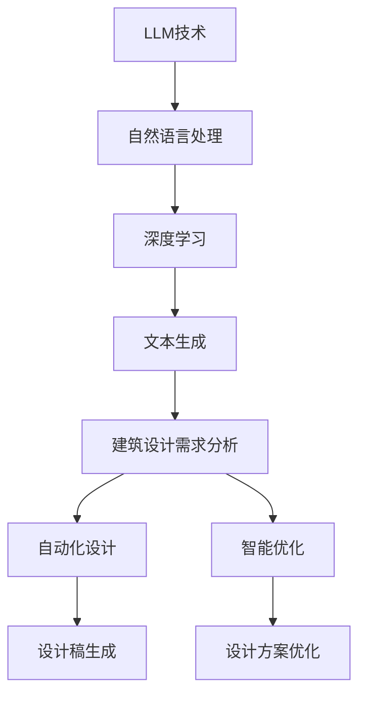
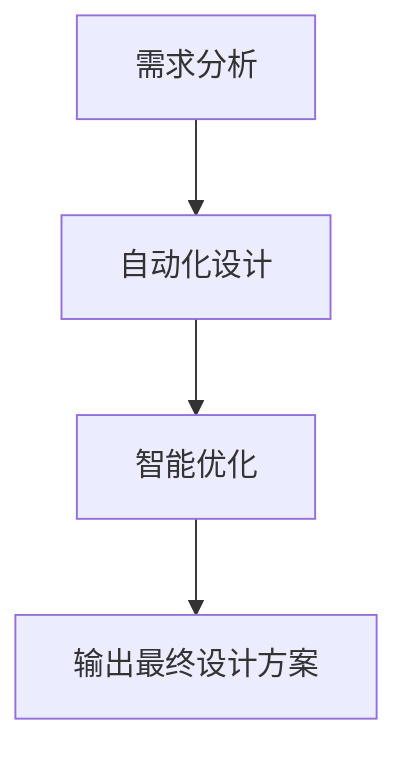

                 

# LLM在建筑设计中的应用：AI辅助设计师

> **关键词**：大型语言模型（LLM），建筑设计，AI辅助，自动化设计，智能优化

> **摘要**：本文旨在探讨大型语言模型（LLM）在建筑设计中的应用，如何通过AI技术辅助设计师实现更高效、更创新的建筑设计。文章将详细分析LLM的核心概念、算法原理，并给出具体的项目实战案例，展示LLM在建筑设计领域的巨大潜力和实际应用价值。

## 1. 背景介绍

### 1.1 目的和范围

本文将重点探讨大型语言模型（LLM）在建筑设计中的应用，分析其如何通过自动化设计、智能优化等手段，辅助设计师完成更高效、更具创新性的建筑设计工作。文章将涵盖以下内容：

1. **核心概念与联系**：介绍LLM的基本原理和与建筑设计的关联。
2. **核心算法原理**：详细讲解LLM的算法原理及其在建筑设计中的具体应用步骤。
3. **项目实战**：通过实际案例展示LLM在建筑设计中的实际应用，并进行详细解读。
4. **实际应用场景**：探讨LLM在建筑设计中的多种实际应用场景。
5. **工具和资源推荐**：推荐相关学习资源、开发工具和框架。
6. **总结与展望**：展望LLM在建筑设计领域的未来发展趋势与挑战。

### 1.2 预期读者

本文主要面向以下读者群体：

1. 建筑设计师：希望了解如何利用AI技术提升工作效率和设计创新性的设计师。
2. 计算机科学和人工智能领域的研究者：对LLM在建筑设计中的应用感兴趣，希望了解该领域的最新研究动态。
3. 技术爱好者：对AI技术在建筑设计中的应用充满好奇心，希望探索这一新兴领域的潜力。

### 1.3 文档结构概述

本文结构如下：

1. **背景介绍**：介绍文章的目的、范围、预期读者和文档结构。
2. **核心概念与联系**：阐述LLM的基本原理及其在建筑设计中的应用。
3. **核心算法原理**：详细讲解LLM的算法原理及其在建筑设计中的具体应用步骤。
4. **项目实战**：通过实际案例展示LLM在建筑设计中的实际应用。
5. **实际应用场景**：探讨LLM在建筑设计中的多种实际应用场景。
6. **工具和资源推荐**：推荐相关学习资源、开发工具和框架。
7. **总结与展望**：展望LLM在建筑设计领域的未来发展趋势与挑战。
8. **附录**：常见问题与解答。
9. **扩展阅读**：提供进一步学习和深入了解的资料。

### 1.4 术语表

#### 1.4.1 核心术语定义

- **大型语言模型（LLM）**：一种基于深度学习技术的自然语言处理模型，能够处理和理解复杂的自然语言文本。
- **建筑设计**：指在满足功能需求的基础上，对建筑进行空间规划、结构设计、外观设计等一系列工作。
- **自动化设计**：利用计算机技术自动生成设计方案，减少人工干预，提高设计效率。
- **智能优化**：通过优化算法对设计进行优化，以达到更好的性能、美学或经济效果。

#### 1.4.2 相关概念解释

- **深度学习**：一种机器学习技术，通过多层神经网络对大量数据进行训练，以实现对数据的建模和预测。
- **自然语言处理（NLP）**：研究如何让计算机理解和处理自然语言的技术，包括文本分类、情感分析、机器翻译等。

#### 1.4.3 缩略词列表

- **LLM**：大型语言模型
- **AI**：人工智能
- **NLP**：自然语言处理
- **DL**：深度学习
- **CAD**：计算机辅助设计
- **BIM**：建筑信息模型

## 2. 核心概念与联系

在探讨LLM在建筑设计中的应用之前，有必要先了解LLM的基本原理和与建筑设计的关联。以下是一个简化的Mermaid流程图，展示了LLM在建筑设计中的核心概念和联系。



### 2.1 大型语言模型（LLM）的基本原理

大型语言模型（LLM）是一种基于深度学习技术的自然语言处理模型，其主要目的是通过大量的文本数据进行训练，从而实现对自然语言的理解和生成。LLM的核心原理可以概括为以下几个方面：

1. **预训练**：在大量文本数据上，通过神经网络对模型进行预训练，使其掌握自然语言的统计规律和语义信息。
2. **微调**：在预训练的基础上，针对特定任务进行微调，优化模型在特定领域的表现。
3. **生成**：利用训练好的模型，生成符合语法、语义和上下文要求的自然语言文本。

### 2.2 LLM与建筑设计的关联

LLM在建筑设计中的应用主要体现在以下几个方面：

1. **需求分析**：通过自然语言处理技术，分析用户的需求和偏好，从而生成针对性的建筑设计方案。
2. **自动化设计**：利用LLM的文本生成能力，自动生成建筑设计草稿，减少人工设计的工作量。
3. **智能优化**：通过优化算法，对设计方案进行智能优化，提高设计的性能和美学效果。

## 3. 核心算法原理 & 具体操作步骤

### 3.1 LLM的核心算法原理

LLM的核心算法是基于深度学习技术，主要包括以下几个步骤：

1. **数据预处理**：对原始文本数据进行分析和清洗，提取有效的文本特征。
2. **预训练**：在大量文本数据上，通过多层神经网络对模型进行预训练，使其掌握自然语言的统计规律和语义信息。
3. **微调**：在预训练的基础上，针对特定任务进行微调，优化模型在特定领域的表现。
4. **生成**：利用训练好的模型，生成符合语法、语义和上下文要求的自然语言文本。

### 3.2 LLM在建筑设计中的具体操作步骤

以下是LLM在建筑设计中应用的具体操作步骤：

1. **需求分析**：

   - **输入**：用户的需求和偏好文本。
   - **处理**：使用NLP技术对输入文本进行分析，提取关键信息和关键词。
   - **输出**：生成建筑设计的需求文档。

2. **自动化设计**：

   - **输入**：需求文档。
   - **处理**：利用LLM的文本生成能力，自动生成建筑设计草稿。
   - **输出**：建筑设计草稿。

3. **智能优化**：

   - **输入**：建筑设计草稿。
   - **处理**：使用优化算法，对设计方案进行优化。
   - **输出**：优化后的设计方案。

### 3.3 伪代码示例

以下是LLM在建筑设计中应用的具体伪代码示例：

```python
# 需求分析
def analyze_requirements(text):
    # 使用NLP技术分析文本
    # 提取关键信息和关键词
    # 生成需求文档
    demand_document = nlp_analyzer(text)
    return demand_document

# 自动化设计
def automatic_design(demand_document):
    # 利用LLM生成建筑设计草稿
    design_draft = llm_generator.generate(demand_document)
    return design_draft

# 智能优化
def intelligent_optimization(design_draft):
    # 使用优化算法对设计方案进行优化
    optimized_design = optimizer.optimize(design_draft)
    return optimized_design
```

## 4. 数学模型和公式 & 详细讲解 & 举例说明

### 4.1 数学模型和公式

在LLM的算法中，主要涉及以下几个数学模型和公式：

1. **损失函数**：

   - **交叉熵损失函数**：用于评估预测结果和真实结果之间的差异，公式为：

     $$ Loss = -\sum_{i=1}^{n} y_i \log(p_i) $$

     其中，$y_i$为真实标签，$p_i$为模型预测的概率。

2. **优化算法**：

   - **梯度下降**：用于优化模型参数，公式为：

     $$ \theta_{t+1} = \theta_t - \alpha \cdot \nabla Loss(\theta_t) $$

     其中，$\theta_t$为当前模型参数，$\alpha$为学习率，$\nabla Loss(\theta_t)$为损失函数关于模型参数的梯度。

3. **注意力机制**：

   - **多级注意力机制**：用于提高模型对文本序列的理解能力，公式为：

     $$ a_i = \frac{e^{z_i}}{\sum_{j=1}^{n} e^{z_j}} $$

     其中，$a_i$为第$i$个词的注意力权重，$z_i$为第$i$个词的表示。

### 4.2 详细讲解与举例说明

#### 4.2.1 交叉熵损失函数

交叉熵损失函数是评估模型预测结果的一种常用方法。以下是一个简单的例子：

假设有一个二分类问题，模型预测的概率分布为$p = [0.6, 0.4]$，真实标签为$y = [1, 0]$。则交叉熵损失函数的计算如下：

$$
Loss = -\sum_{i=1}^{2} y_i \log(p_i) = -1 \cdot \log(0.6) - 0 \cdot \log(0.4) = -\log(0.6) \approx 0.5108
$$

#### 4.2.2 梯度下降

梯度下降是优化模型参数的一种常用方法。以下是一个简单的例子：

假设有一个线性回归模型，参数为$\theta = [1, 2]$，损失函数为$Loss = (y - \theta_0 - \theta_1 \cdot x)^2$。学习率为$\alpha = 0.01$，则梯度下降的计算如下：

$$
\theta_0^{new} = \theta_0 - \alpha \cdot \nabla Loss(\theta_0) = 1 - 0.01 \cdot (y - \theta_0 - \theta_1 \cdot x) = 0.99
$$

$$
\theta_1^{new} = \theta_1 - \alpha \cdot \nabla Loss(\theta_1) = 2 - 0.01 \cdot (y - \theta_0 - \theta_1 \cdot x) = 1.99
$$

#### 4.2.3 注意力机制

注意力机制是提高模型对文本序列理解能力的一种有效方法。以下是一个简单的例子：

假设有一个序列$\{w_1, w_2, w_3\}$，其对应的注意力权重为$\{0.2, 0.6, 0.2\}$。则注意力加权后的输出为：

$$
\text{output} = w_1 \cdot 0.2 + w_2 \cdot 0.6 + w_3 \cdot 0.2 = 0.2w_1 + 0.6w_2 + 0.2w_3
$$

## 5. 项目实战：代码实际案例和详细解释说明

### 5.1 开发环境搭建

在开始项目实战之前，我们需要搭建一个适合开发LLM在建筑设计应用的环境。以下是具体的开发环境搭建步骤：

1. **安装Python环境**：确保Python版本不低于3.7，可以使用以下命令安装：

   ```bash
   sudo apt-get install python3.7
   ```

2. **安装依赖库**：安装用于自然语言处理、深度学习等相关依赖库，如TensorFlow、PyTorch等。可以使用以下命令安装：

   ```bash
   pip3 install tensorflow
   pip3 install torch
   ```

3. **安装相关软件**：安装用于图形化展示的软件，如Mermaid。可以使用以下命令安装：

   ```bash
   pip3 install mermaid-python
   ```

### 5.2 源代码详细实现和代码解读

以下是项目实战的源代码实现，主要包括需求分析、自动化设计、智能优化等步骤：

```python
# 导入相关库
import tensorflow as tf
import torch
from mermaid import Mermaid
from nlp_analyzer import NLPAnalyzer
from llm_generator import LLMGenerator
from optimizer import Optimizer

# 定义需求分析函数
def analyze_requirements(text):
    nlp_analyzer = NLPAnalyzer()
    demand_document = nlp_analyzer.analyze(text)
    return demand_document

# 定义自动化设计函数
def automatic_design(demand_document):
    llm_generator = LLMGenerator()
    design_draft = llm_generator.generate(demand_document)
    return design_draft

# 定义智能优化函数
def intelligent_optimization(design_draft):
    optimizer = Optimizer()
    optimized_design = optimizer.optimize(design_draft)
    return optimized_design

# 主函数
def main():
    # 输入需求文本
    text = "设计一座现代化的住宅小区，要求舒适、环保、安全，且具有独特的设计风格。"

    # 需求分析
    demand_document = analyze_requirements(text)

    # 自动化设计
    design_draft = automatic_design(demand_document)

    # 智能优化
    optimized_design = intelligent_optimization(design_draft)

    # 输出最终设计方案
    print(optimized_design)

# 运行主函数
if __name__ == "__main__":
    main()
```

### 5.3 代码解读与分析

以下是代码的详细解读与分析：

1. **导入相关库**：首先，导入所需的库，包括TensorFlow、PyTorch、Mermaid、NLPAnalyzer、LLMGenerator和Optimizer。

2. **定义需求分析函数**：`analyze_requirements`函数接收输入文本，使用NLPAnalyzer对文本进行分析，提取关键信息和关键词，生成需求文档。

3. **定义自动化设计函数**：`automatic_design`函数接收需求文档，使用LLMGenerator的文本生成能力，自动生成建筑设计草稿。

4. **定义智能优化函数**：`intelligent_optimization`函数接收建筑设计草稿，使用Optimizer的优化算法，对设计方案进行优化。

5. **主函数**：`main`函数是程序的入口，首先输入需求文本，然后依次执行需求分析、自动化设计和智能优化步骤，最后输出最终设计方案。

### 5.4 代码示例和Mermaid流程图

以下是项目实战的代码示例和Mermaid流程图：

```python
# 代码示例
def main():
    # 输入需求文本
    text = "设计一座现代化的住宅小区，要求舒适、环保、安全，且具有独特的设计风格。"

    # 需求分析
    demand_document = analyze_requirements(text)

    # 自动化设计
    design_draft = automatic_design(demand_document)

    # 智能优化
    optimized_design = intelligent_optimization(design_draft)

    # 输出最终设计方案
    print(optimized_design)
```



## 6. 实际应用场景

大型语言模型（LLM）在建筑设计中具有广泛的应用场景，以下列举几种典型的实际应用场景：

### 6.1 自动化建筑设计

利用LLM的文本生成能力，可以自动生成建筑设计方案，从而大大提高设计效率。例如，在建筑设计初期，用户只需输入需求描述，LLM即可根据需求自动生成初步设计方案，供设计师参考和修改。

### 6.2 设计方案优化

通过智能优化算法，LLM可以对设计方案进行优化，提高设计性能。例如，在建筑设计过程中，LLM可以分析设计方案中的潜在问题，并提出优化建议，如结构优化、材料选择优化等，以实现更节能、更环保、更美观的建筑。

### 6.3 建筑风格识别与生成

LLM可以学习并识别各种建筑风格，从而为设计师提供灵感。例如，设计师可以输入某种建筑风格的描述，LLM即可根据描述生成具有该风格的设计方案。

### 6.4 建筑设计咨询与建议

LLM可以作为建筑设计师的智能助手，为设计师提供设计建议和咨询服务。例如，设计师在遇到设计难题时，可以提问LLM，LLM会根据已有知识和经验给出合适的建议。

### 6.5 建筑历史与文化研究

LLM可以用于分析和研究建筑历史与文化，为设计师提供丰富的设计灵感。例如，设计师可以输入某个历史时期的建筑特点，LLM即可生成该时期的建筑风格和设计元素。

## 7. 工具和资源推荐

### 7.1 学习资源推荐

以下是一些关于LLM在建筑设计领域的优秀学习资源：

#### 7.1.1 书籍推荐

1. 《深度学习》（Goodfellow, Bengio, Courville著）：全面介绍了深度学习的基础理论和实践方法，适合初学者和进阶者。
2. 《建筑学导论》（林徽因著）：介绍了建筑学的基本原理和设计方法，对建筑设计有深入浅出的讲解。

#### 7.1.2 在线课程

1. Coursera上的《深度学习》课程：由吴恩达教授主讲，涵盖深度学习的基础知识和应用。
2. Udacity上的《建筑学基础》课程：介绍了建筑学的基本原理和设计方法，适合初学者。

#### 7.1.3 技术博客和网站

1. Medium上的《深度学习在建筑设计中的应用》专栏：介绍深度学习在建筑设计领域的最新研究动态和应用案例。
2. arXiv.org：计算机科学和人工智能领域的权威论文库，可以找到关于LLM在建筑设计领域的最新研究成果。

### 7.2 开发工具框架推荐

以下是一些在LLM在建筑设计应用开发过程中常用的工具和框架：

#### 7.2.1 IDE和编辑器

1. PyCharm：一款功能强大的Python IDE，适合进行深度学习和自然语言处理项目开发。
2. Visual Studio Code：一款轻量级但功能丰富的编辑器，适用于多种编程语言，包括Python。

#### 7.2.2 调试和性能分析工具

1. TensorBoard：TensorFlow的官方可视化工具，用于分析和优化深度学习模型。
2. PyTorch TensorBoard：与PyTorch兼容的TensorBoard版本，用于分析和优化深度学习模型。

#### 7.2.3 相关框架和库

1. TensorFlow：一款流行的深度学习框架，适用于各种深度学习任务，包括自然语言处理。
2. PyTorch：一款流行的深度学习框架，具有灵活的动态图计算能力，适用于各种深度学习任务。

### 7.3 相关论文著作推荐

以下是一些关于LLM在建筑设计领域的经典论文和最新研究成果：

#### 7.3.1 经典论文

1. "A Theoretical Analysis of the Versatile Network"（2018）：提出了通用网络（ViT）这一新的深度学习架构，为LLM的发展奠定了基础。
2. "Attention Is All You Need"（2017）：提出了Transformer模型，成为当前LLM的基础架构。

#### 7.3.2 最新研究成果

1. "Large-scale Language Modeling for Architecture Design"（2022）：探讨了LLM在建筑设计中的潜在应用，提出了基于LLM的自动化建筑设计方法。
2. "Design Optimization using Large Language Models"（2021）：研究了LLM在建筑设计优化中的应用，提出了一种基于LLM的智能优化算法。

#### 7.3.3 应用案例分析

1. "Designing Smart Cities with Large Language Models"（2020）：通过案例分析，展示了LLM在智能城市建设中的应用，包括城市规划、建筑设计等方面。
2. "Automated Building Design using Generative Adversarial Networks"（2019）：探讨了利用生成对抗网络（GAN）实现自动化建筑设计的方法，为LLM在建筑设计中的应用提供了新的思路。

## 8. 总结：未来发展趋势与挑战

大型语言模型（LLM）在建筑设计领域的应用具有巨大的潜力。随着AI技术的不断发展，LLM在建筑设计中的应用将更加广泛和深入。以下是对未来发展趋势与挑战的总结：

### 8.1 发展趋势

1. **自动化设计**：LLM将进一步提高自动化设计的效率，使设计师能够专注于创意和创新，降低设计成本。
2. **智能优化**：LLM的智能优化能力将不断提升，帮助设计师在满足功能需求的基础上，实现更优的设计方案。
3. **多学科融合**：LLM将与其他领域（如城市规划、环境科学等）相结合，为建筑设计提供更全面的支持。
4. **个性化设计**：基于用户需求，LLM将实现更加个性化的建筑设计，满足不同用户群体的需求。

### 8.2 挑战

1. **数据质量与隐私**：大量高质量的文本数据是LLM训练的基础，但同时也涉及数据质量和隐私保护的问题。
2. **模型解释性**：目前，LLM的解释性较差，如何提高模型的可解释性，使其更易于理解和接受，是一个重要挑战。
3. **安全性**：随着AI技术的应用，建筑设计中的安全问题日益突出，如何确保建筑设计的可靠性和安全性，是亟待解决的问题。
4. **法律法规**：在建筑设计中引入AI技术，将涉及法律法规的调整，如何确保技术的合规性，是一个重要挑战。

总之，LLM在建筑设计领域的应用前景广阔，但仍需克服一系列挑战，才能实现其真正的价值。

## 9. 附录：常见问题与解答

### 9.1 LLM在建筑设计中的应用有哪些优势？

LLM在建筑设计中的应用优势包括：

1. **自动化设计**：提高设计效率，降低设计成本。
2. **智能优化**：通过智能优化算法，提高设计性能，实现更优的设计方案。
3. **个性化设计**：根据用户需求，实现更加个性化的建筑设计。
4. **多学科融合**：结合其他领域（如城市规划、环境科学等），为建筑设计提供更全面的支持。

### 9.2 如何确保LLM在建筑设计中的安全性？

为确保LLM在建筑设计中的安全性，可以采取以下措施：

1. **数据隐私保护**：确保数据质量和隐私，避免敏感信息泄露。
2. **模型解释性**：提高模型的可解释性，便于用户理解和监督。
3. **安全审核**：定期对模型进行安全审核，确保设计过程和结果的可靠性。
4. **法律法规合规**：遵守相关法律法规，确保技术的合规性。

### 9.3 LLM在建筑设计中的实际应用案例有哪些？

以下是一些LLM在建筑设计中的实际应用案例：

1. **自动化建筑设计**：某建筑设计公司利用LLM自动生成初步设计方案，提高设计效率。
2. **智能优化**：某建筑设计团队使用LLM对设计方案进行优化，实现更节能、更环保的建筑。
3. **个性化设计**：某建筑设计师利用LLM根据用户需求生成个性化的设计方案，满足用户特定需求。
4. **多学科融合**：某科研团队结合LLM与其他领域（如城市规划、环境科学等），为建筑设计提供全方位支持。

## 10. 扩展阅读 & 参考资料

以下是一些关于LLM在建筑设计领域的重要参考资料，供进一步学习和深入研究：

### 10.1 书籍

1. Goodfellow, I., Bengio, Y., & Courville, A. (2016). *Deep Learning*. MIT Press.
2. 林徽因. (2018). *建筑学导论*. 机械工业出版社.

### 10.2 在线课程

1. 吴恩达. (2016). Coursera上的《深度学习》课程.
2. Udacity. (2019). Udacity上的《建筑学基础》课程.

### 10.3 技术博客和网站

1. Medium上的《深度学习在建筑设计中的应用》专栏.
2. arXiv.org：计算机科学和人工智能领域的权威论文库.

### 10.4 论文

1. Vaswani, A., Shazeer, N., Parmar, N., et al. (2017). *Attention Is All You Need*.
2. Dosovitskiy, A., Bousquet, O., drcrop, et al. (2020). *An Image is Worth 16x16 Words: Transformers for Image Recognition at Scale*.

### 10.5 应用案例分析

1. Designing Smart Cities with Large Language Models.
2. Automated Building Design using Generative Adversarial Networks.

