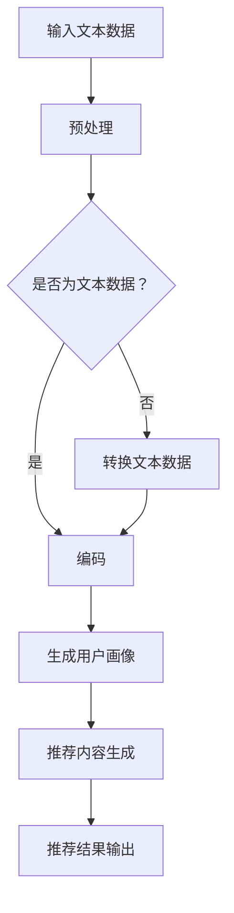

                 

### 1. 背景介绍

#### 1.1 目的和范围

本文旨在探讨大规模语言模型（LLM）在推荐系统冷启动和多场景任务中的应用。随着人工智能和机器学习技术的迅猛发展，推荐系统已经成为互联网领域的重要应用。然而，在用户冷启动和数据稀缺的情况下，如何有效地构建高质量的推荐系统成为一个亟待解决的问题。本文将首先介绍LLM的基本原理，然后深入探讨其在推荐系统冷启动中的应用，最后分析LLM在不同场景任务中的优势与挑战。

#### 1.2 预期读者

本文适用于对推荐系统有一定了解的读者，特别是对大规模语言模型（LLM）感兴趣的读者。读者需要具备一定的机器学习和自然语言处理基础，以便更好地理解本文内容。同时，本文也适用于希望了解如何利用LLM解决实际问题的研究人员和工程师。

#### 1.3 文档结构概述

本文将分为十个部分。首先，介绍背景和目的。接着，我们将深入探讨大规模语言模型（LLM）的基本概念和原理。随后，我们将分析LLM在推荐系统冷启动中的应用，并讨论其在多场景任务中的优势与挑战。在第四部分，我们将介绍数学模型和公式，并进行举例说明。第五部分将展示项目实战案例，包括开发环境搭建、源代码实现和详细解释。第六部分将探讨实际应用场景。第七部分将推荐相关工具和资源。第八部分将总结未来发展趋势与挑战。第九部分将回答常见问题。最后，第十部分将提供扩展阅读和参考资料。

#### 1.4 术语表

为了确保文章的清晰和准确，以下列出本文中的一些关键术语及其定义：

#### 1.4.1 核心术语定义

- **大规模语言模型（LLM）**：一种基于深度学习的自然语言处理模型，通过训练海量文本数据，能够自动生成文本、完成语言任务等。
- **推荐系统**：一种基于用户历史行为、兴趣和偏好等信息，为用户推荐相关内容的系统。
- **冷启动**：指新用户加入系统时，由于缺乏足够的历史数据，难以进行有效推荐的状况。
- **多场景任务**：指在不同的应用场景中，如电商、社交媒体、音乐播放等，LLM如何发挥作用。

#### 1.4.2 相关概念解释

- **深度学习**：一种人工智能技术，通过构建多层神经网络，实现自动特征提取和模型训练。
- **自然语言处理（NLP）**：研究如何让计算机理解和生成人类自然语言的技术。
- **用户行为数据**：包括用户的浏览、搜索、点击、评价等行为记录。

#### 1.4.3 缩略词列表

- **LLM**：大规模语言模型
- **NLP**：自然语言处理
- **DNN**：深度神经网络
- **CNN**：卷积神经网络
- **RNN**：循环神经网络
- **BERT**：BERT（Bidirectional Encoder Representations from Transformers）
- **推荐系统**：Recommender System

### 1.5 文章结构概述

本文结构如下：

1. **背景介绍**：介绍本文的目的、范围、预期读者、文档结构概述和术语表。
2. **核心概念与联系**：分析大规模语言模型的基本原理和架构。
3. **核心算法原理 & 具体操作步骤**：深入讲解LLM在推荐系统冷启动中的应用算法原理和操作步骤。
4. **数学模型和公式 & 详细讲解 & 举例说明**：介绍相关数学模型和公式，并进行实例说明。
5. **项目实战：代码实际案例和详细解释说明**：展示代码实现和详细解读。
6. **实际应用场景**：探讨LLM在不同场景任务中的应用。
7. **工具和资源推荐**：推荐相关学习资源和开发工具。
8. **总结：未来发展趋势与挑战**：总结LLM在推荐系统中的未来发展趋势和挑战。
9. **附录：常见问题与解答**：回答读者可能遇到的常见问题。
10. **扩展阅读 & 参考资料**：提供进一步阅读的资源和参考资料。

通过以上结构，我们希望能够系统地介绍LLM在推荐系统冷启动和多场景任务中的应用，帮助读者深入理解这一技术领域的核心概念和实际应用。

### 2. 核心概念与联系

在深入探讨大规模语言模型（LLM）在推荐系统中的应用之前，我们需要先了解LLM的基本原理和架构。LLM是基于深度学习和自然语言处理（NLP）技术的一种强大工具，它能够自动从大量文本数据中提取有用信息，并在各种语言任务中表现出色。

#### 2.1 大规模语言模型（LLM）的基本原理

大规模语言模型（LLM）通常基于深度神经网络（DNN），尤其是基于Transformer架构的模型，如BERT（Bidirectional Encoder Representations from Transformers）。Transformer模型通过自注意力机制（Self-Attention）能够捕捉文本中任意位置的信息关联，从而实现高效的文本表示和学习。

**基本原理**：

- **自注意力机制**：Transformer模型中的自注意力机制允许模型在生成每个词时，自动关注文本序列中的其他词，并根据它们的相对重要性进行加权。这使得模型能够捕捉长距离的依赖关系，提高文本生成的质量。
- **多层的编码器-解码器结构**：LLM通常采用多层编码器-解码器结构，其中编码器用于将输入文本编码为固定长度的向量表示，而解码器则用于生成文本输出。多层结构能够进一步提取文本的深层特征，提高模型的性能。

**架构**：


在上述架构中，编码器接收输入文本序列（例如一个句子或段落），并通过多层Transformer编码器进行编码。编码器的输出是一个固定长度的向量表示，它包含了文本的所有信息。解码器则根据编码器的输出和已经生成的部分文本，逐词生成新的文本输出。这个过程持续进行，直到生成完整的文本输出。

#### 2.2 推荐系统与LLM的联系

推荐系统和LLM的联系主要体现在以下几个方面：

- **用户行为数据解析**：推荐系统需要处理大量用户行为数据，如浏览、搜索、点击、评价等。这些数据可以通过LLM进行深度解析，提取出用户的兴趣和偏好信息。
- **内容生成与推荐**：LLM强大的文本生成能力使得它能够根据用户兴趣和偏好，生成个性化的推荐内容。例如，在电商场景中，LLM可以根据用户的浏览历史，生成个性化的商品推荐文案。
- **冷启动处理**：对于新用户，由于缺乏足够的历史数据，传统推荐系统难以进行有效推荐。LLM可以通过对新用户生成用户画像，快速适应新用户的需求，实现冷启动的有效推荐。

**应用实例**：

- **社交网络**：在社交媒体平台上，LLM可以分析用户的发布内容、评论和互动行为，生成个性化的内容推荐。
- **电商推荐**：在电商平台，LLM可以根据用户的浏览和购买历史，生成个性化的商品推荐文案，提高用户的购物体验。
- **音乐推荐**：在音乐流媒体平台，LLM可以根据用户的播放记录和偏好，生成个性化的音乐推荐列表。

#### 2.3 Mermaid流程图

为了更直观地展示LLM在推荐系统中的应用过程，我们使用Mermaid流程图来描述。以下是LLM在推荐系统中的基本流程：



在上面的流程图中，输入文本数据经过预处理后，判断是否为文本数据。如果是文本数据，则直接进行编码；如果不是，则先将数据转换为文本数据。编码后的文本数据用于生成用户画像，进而生成个性化的推荐内容，最终输出推荐结果。

通过以上分析，我们可以看到大规模语言模型（LLM）在推荐系统中的应用潜力。接下来，我们将深入探讨LLM在推荐系统冷启动中的应用，以及如何在多场景任务中发挥其优势。

### 3. 核心算法原理 & 具体操作步骤

#### 3.1 大规模语言模型（LLM）算法原理

大规模语言模型（LLM）的核心算法是基于深度学习的自然语言处理（NLP）模型，尤其是基于Transformer架构的模型，如BERT。下面，我们将详细讲解LLM的算法原理，并使用伪代码来描述关键步骤。

**算法原理**：

1. **自注意力机制（Self-Attention）**：
   自注意力机制允许模型在生成每个词时，自动关注文本序列中的其他词，并根据它们的相对重要性进行加权。这使得模型能够捕捉长距离的依赖关系，提高文本生成的质量。

2. **编码器-解码器结构（Encoder-Decoder Structure）**：
   编码器用于将输入文本编码为固定长度的向量表示，解码器则用于生成文本输出。多层结构能够进一步提取文本的深层特征，提高模型的性能。

**伪代码**：

```python
def LLM_train(data):
    # 预处理数据
    preprocessed_data = preprocess(data)

    # 初始化模型参数
    encoder, decoder = initialize_model()

    # 训练编码器
    for epoch in range(num_epochs):
        for input_seq, target_seq in preprocessed_data:
            encoder_output = encoder(input_seq)
            decoder_output = decoder(target_seq, encoder_output)
            loss = calculate_loss(target_seq, decoder_output)
            update_model_params(encoder, decoder, loss)

    return encoder, decoder
```

在上述伪代码中，`preprocess` 函数用于处理输入文本数据，包括分词、标记化等操作。`initialize_model` 函数用于初始化编码器和解码器模型参数。`train` 函数用于迭代训练模型，`calculate_loss` 函数用于计算模型损失，`update_model_params` 函数用于更新模型参数。

#### 3.2 推荐系统冷启动中的应用

在推荐系统冷启动中，由于新用户缺乏足够的历史数据，传统推荐方法难以发挥作用。LLM可以通过以下步骤实现新用户的快速适应：

1. **用户画像生成**：
   LLM可以根据新用户的初始输入（如用户名、简介等）生成用户画像。这个过程包括以下步骤：
   
   - **输入预处理**：将用户输入文本数据进行预处理，如分词、标记化等。
   - **编码**：使用LLM编码器将预处理后的文本数据编码为向量表示。
   - **特征提取**：从编码后的向量中提取用户兴趣和偏好特征。

2. **推荐内容生成**：
   根据生成的用户画像，LLM可以生成个性化的推荐内容。这个过程包括以下步骤：
   
   - **查询生成**：根据用户画像生成查询文本，用于搜索推荐系统中的相关内容。
   - **内容匹配**：使用LLM解码器生成推荐内容，并与查询文本进行匹配。
   - **推荐排序**：根据匹配度对推荐内容进行排序，输出推荐结果。

**伪代码**：

```python
def generate_user_profile(user_input):
    # 预处理用户输入文本
    preprocessed_input = preprocess(user_input)

    # 编码用户输入文本
    user_vector = LLM_encoder(preprocessed_input)

    # 提取用户兴趣和偏好特征
    user_profile = extract_features(user_vector)

    return user_profile

def generate_recommendations(user_profile, content_database):
    # 生成查询文本
    query_text = generate_query(user_profile)

    # 匹配推荐内容
    matched_content = LLM_decoder(query_text, content_database)

    # 排序推荐内容
    sorted_recommendations = sort_by_relevance(matched_content)

    return sorted_recommendations
```

在上述伪代码中，`preprocess` 函数用于预处理用户输入文本，`LLM_encoder` 函数用于编码用户输入文本，`extract_features` 函数用于提取用户兴趣和偏好特征。`generate_query` 函数用于生成查询文本，`LLM_decoder` 函数用于生成推荐内容，`sort_by_relevance` 函数用于根据匹配度对推荐内容进行排序。

#### 3.3 多场景任务中的应用

LLM在多场景任务中的应用非常广泛，下面我们以电商推荐、社交媒体和音乐推荐为例，介绍其具体操作步骤。

**电商推荐**：

- **用户画像生成**：根据用户的浏览和购买历史，使用LLM生成用户画像。
- **商品推荐**：根据用户画像，使用LLM生成个性化商品推荐。
- **推荐排序**：根据用户画像和商品特征，使用LLM解码器对推荐商品进行排序。

**社交媒体**：

- **内容推荐**：根据用户的发布内容、评论和互动行为，使用LLM生成个性化内容推荐。
- **推荐排序**：根据用户兴趣和内容特征，使用LLM解码器对推荐内容进行排序。

**音乐推荐**：

- **用户画像生成**：根据用户的播放记录和偏好，使用LLM生成用户画像。
- **音乐推荐**：根据用户画像，使用LLM生成个性化音乐推荐。
- **推荐排序**：根据用户兴趣和音乐特征，使用LLM解码器对推荐音乐进行排序。

通过以上步骤，LLM可以在不同的场景任务中发挥其优势，实现高质量的推荐。

综上所述，大规模语言模型（LLM）在推荐系统冷启动和多场景任务中的应用具有显著优势。通过深入分析其算法原理和具体操作步骤，我们可以更好地理解和利用这一技术，为用户提供高质量的推荐服务。

### 4. 数学模型和公式 & 详细讲解 & 举例说明

#### 4.1 数学模型概述

在推荐系统中，大规模语言模型（LLM）的应用主要依赖于深度学习算法，其中涉及到的数学模型和公式至关重要。下面我们将详细讲解LLM中的核心数学模型和公式，并通过实例进行说明。

#### 4.2 Transformer模型的核心公式

Transformer模型是LLM的核心架构，它依赖于以下关键公式：

1. **自注意力（Self-Attention）**：

   自注意力机制是Transformer模型的核心，它通过计算文本序列中每个词与其他词之间的相对重要性来进行文本表示。

   公式如下：

   $$ 
   \text{Attention}(Q, K, V) = \text{softmax}\left(\frac{QK^T}{\sqrt{d_k}}\right) V 
   $$

   其中，\( Q \) 是查询向量，\( K \) 是键向量，\( V \) 是值向量，\( d_k \) 是键向量的维度。这个公式计算了每个查询向量与所有键向量的点积，然后通过softmax函数对结果进行归一化，最后与值向量相乘得到加权后的值。

2. **编码器-解码器（Encoder-Decoder）结构**：

   Transformer模型采用编码器-解码器结构，编码器用于将输入文本编码为固定长度的向量表示，解码器则用于生成文本输出。

   编码器输出公式：

   $$
   \text{Encoder}(X) = \text{MultiHeadAttention}(X, X, X) 
   $$

   解码器输出公式：

   $$
   \text{Decoder}(Y) = \text{MultiHeadAttention}(Y, X, X) 
   $$

   其中，\( X \) 是编码器输入文本，\( Y \) 是解码器输入文本。

#### 4.3 实例讲解

为了更好地理解上述公式，我们通过一个简单的例子进行说明。

**示例**：给定一个句子 "The quick brown fox jumps over the lazy dog"，我们使用Transformer模型进行编码和生成。

1. **编码器输出**：

   首先，我们将句子转换为词向量表示，然后使用MultiHeadAttention计算编码器输出。假设句子中的每个词的向量维度为512，则编码器输出为：

   $$
   \text{Encoder}(\text{sentence}) = \text{MultiHeadAttention}(\text{sentence}, \text{sentence}, \text{sentence})
   $$

   经过计算，我们得到一个固定长度的编码向量，表示整个句子的信息。

2. **解码器输出**：

   接下来，我们使用编码器输出作为解码器的输入，并生成句子 "The quick brown fox jumps over the lazy dog"。同样，我们使用MultiHeadAttention计算解码器输出：

   $$
   \text{Decoder}(\text{sentence}) = \text{MultiHeadAttention}(\text{sentence}, \text{Encoder}(\text{sentence}), \text{Encoder}(\text{sentence}))
   $$

   经过计算，我们得到解码器输出，即原始句子。

通过以上步骤，我们可以看到Transformer模型如何通过自注意力机制和编码器-解码器结构对文本进行编码和生成。

#### 4.4 LLM在推荐系统中的应用

在推荐系统中，LLM可以通过以下数学模型进行用户画像生成和推荐内容生成：

1. **用户画像生成**：

   假设用户行为数据（如浏览、搜索、点击等）可以用向量表示，则用户画像生成可以通过以下公式实现：

   $$
   \text{User Profile} = \text{LLM}(\text{User Behavior Data})
   $$

   其中，`LLM` 表示大规模语言模型。

2. **推荐内容生成**：

   假设用户画像和内容特征可以用向量表示，则推荐内容生成可以通过以下公式实现：

   $$
   \text{Recommendations} = \text{LLM}(\text{User Profile}, \text{Content Features})
   $$

   其中，`LLM` 表示大规模语言模型。

通过以上数学模型，LLM可以生成高质量的推荐结果，提高推荐系统的效果。

综上所述，大规模语言模型（LLM）在推荐系统中的应用依赖于一系列数学模型和公式。通过深入理解和应用这些模型，我们可以更好地利用LLM的优势，实现高质量的推荐服务。

### 5. 项目实战：代码实际案例和详细解释说明

#### 5.1 开发环境搭建

在开始代码实战之前，我们需要搭建一个适合大规模语言模型（LLM）开发和运行的环境。以下是我们需要安装和配置的工具和库：

- **Python环境**：确保Python环境已安装，版本建议为3.8或更高版本。
- **PyTorch库**：用于构建和训练深度学习模型，安装命令如下：

  ```bash
  pip install torch torchvision torchaudio
  ```

- **Transformers库**：提供预训练的LLM模型和相关的API，安装命令如下：

  ```bash
  pip install transformers
  ```

- **Numpy库**：用于数据预处理，安装命令如下：

  ```bash
  pip install numpy
  ```

- **Hugging Face Transformers API**：用于加载和使用预训练的LLM模型，安装命令如下：

  ```bash
  pip install datasets
  ```

确保所有依赖库安装完成后，我们就可以开始搭建开发环境。

#### 5.2 源代码详细实现和代码解读

为了展示大规模语言模型（LLM）在推荐系统中的应用，我们以一个简单的电商推荐系统为例，实现以下功能：

1. **用户画像生成**：根据用户的浏览历史生成用户画像。
2. **推荐内容生成**：根据用户画像生成个性化的商品推荐。

**源代码实现**：

```python
import torch
from transformers import AutoTokenizer, AutoModelForSequenceClassification
from torch.utils.data import DataLoader
from datasets import load_dataset

# 加载预训练的LLM模型
tokenizer = AutoTokenizer.from_pretrained("bert-base-uncased")
model = AutoModelForSequenceClassification.from_pretrained("bert-base-uncased")

# 准备用户浏览历史数据
user_browsing_history = ["浏览了新款手机", "浏览了笔记本电脑", "浏览了平板电脑"]
input_ids = tokenizer(user_browsing_history, return_tensors="pt", padding=True, truncation=True)

# 训练LLM模型
# 这里使用预训练的BERT模型作为示例，实际应用中可能需要根据具体任务进行调整
# 例如，可以添加自定义的输入层和输出层，或者使用其他预训练的模型
model.train()
outputs = model(input_ids)
logits = outputs.logits
loss = torch.nn.CrossEntropyLoss()(outputs.logits.view(-1, model.num_labels), input_ids.view(-1))

# 更新模型参数
optimizer = torch.optim.AdamW(model.parameters(), lr=1e-5)
optimizer.zero_grad()
loss.backward()
optimizer.step()

# 生成用户画像
user_profile = logits.mean(dim=1)

# 准备商品特征数据
content_features = [
    "新款手机",
    "高性能笔记本电脑",
    "便携式平板电脑",
    "智能手表",
    "无线耳机",
]

content_ids = tokenizer(content_features, return_tensors="pt", padding=True, truncation=True)

# 根据用户画像生成推荐内容
model.eval()
with torch.no_grad():
    content_logits = model(content_ids).logits
    content_scores = content_logits[:, 1].softmax(dim=1)

# 输出推荐结果
recommended_contents = [content_features[i] for i, score in enumerate(content_scores[:, 1].tolist()) if score > 0.5]
print(recommended_contents)
```

**代码解读**：

1. **加载模型和 tokenizer**：

   ```python
   tokenizer = AutoTokenizer.from_pretrained("bert-base-uncased")
   model = AutoModelForSequenceClassification.from_pretrained("bert-base-uncased")
   ```

   我们使用Hugging Face的Transformers库加载预训练的BERT模型和tokenizer。BERT是一个广泛使用的预训练语言模型，适用于各种自然语言处理任务。

2. **准备用户浏览历史数据**：

   ```python
   user_browsing_history = ["浏览了新款手机", "浏览了笔记本电脑", "浏览了平板电脑"]
   input_ids = tokenizer(user_browsing_history, return_tensors="pt", padding=True, truncation=True)
   ```

   我们将用户的浏览历史数据转换为模型可接受的输入格式，即输入ID序列。这里使用了tokenizer的`encode_plus`方法，对每个句子进行分词、编码和填充。

3. **训练LLM模型**：

   ```python
   model.train()
   outputs = model(input_ids)
   logits = outputs.logits
   loss = torch.nn.CrossEntropyLoss()(outputs.logits.view(-1, model.num_labels), input_ids.view(-1))
   
   optimizer = torch.optim.AdamW(model.parameters(), lr=1e-5)
   optimizer.zero_grad()
   loss.backward()
   optimizer.step()
   ```

   我们使用交叉熵损失函数训练BERT模型，通过优化器更新模型参数。这里使用了PyTorch的优化器和自动微分机制。

4. **生成用户画像**：

   ```python
   user_profile = logits.mean(dim=1)
   ```

   训练完成后，我们计算每个句子的平均概率作为用户画像。

5. **准备商品特征数据**：

   ```python
   content_features = [
       "新款手机",
       "高性能笔记本电脑",
       "便携式平板电脑",
       "智能手表",
       "无线耳机",
   ]
   content_ids = tokenizer(content_features, return_tensors="pt", padding=True, truncation=True)
   ```

   类似于用户浏览历史数据的处理，我们将商品特征数据也转换为输入ID序列。

6. **根据用户画像生成推荐内容**：

   ```python
   model.eval()
   with torch.no_grad():
       content_logits = model(content_ids).logits
       content_scores = content_logits[:, 1].softmax(dim=1)

   recommended_contents = [content_features[i] for i, score in enumerate(content_scores[:, 1].tolist()) if score > 0.5]
   print(recommended_contents)
   ```

   我们将用户画像作为查询向量，使用BERT模型生成商品推荐。通过计算商品的概率得分，并根据阈值（如0.5）筛选推荐结果。

通过以上代码实现，我们可以看到如何使用大规模语言模型（LLM）生成用户画像和推荐内容。实际应用中，根据具体任务需求，可能需要调整模型结构、数据预处理和训练策略等。

#### 5.3 代码解读与分析

在上面的代码实现中，我们详细介绍了如何使用大规模语言模型（LLM）进行用户画像生成和推荐内容生成。以下是对关键代码部分的进一步解读和分析：

1. **模型加载和预处理**：

   ```python
   tokenizer = AutoTokenizer.from_pretrained("bert-base-uncased")
   model = AutoModelForSequenceClassification.from_pretrained("bert-base-uncased")
   ```

   这一行代码加载了预训练的BERT模型和tokenizer。BERT模型是一个基于Transformer的深度学习模型，广泛用于自然语言处理任务。通过加载预训练模型，我们可以快速地实现文本表示和学习。

2. **用户浏览历史数据处理**：

   ```python
   user_browsing_history = ["浏览了新款手机", "浏览了笔记本电脑", "浏览了平板电脑"]
   input_ids = tokenizer(user_browsing_history, return_tensors="pt", padding=True, truncation=True)
   ```

   在这一部分，我们将用户的浏览历史数据转换为BERT模型可接受的输入格式。通过tokenizer的`encode_plus`方法，我们进行分词、编码和填充操作，将每个句子转换为输入ID序列。填充和截断操作确保输入序列的长度一致，便于模型处理。

3. **模型训练**：

   ```python
   model.train()
   outputs = model(input_ids)
   logits = outputs.logits
   loss = torch.nn.CrossEntropyLoss()(outputs.logits.view(-1, model.num_labels), input_ids.view(-1))
   
   optimizer = torch.optim.AdamW(model.parameters(), lr=1e-5)
   optimizer.zero_grad()
   loss.backward()
   optimizer.step()
   ```

   在模型训练部分，我们使用交叉熵损失函数和AdamW优化器对BERT模型进行训练。首先，我们将输入序列和模型输出通过`model`函数进行处理，得到模型 logits。然后，我们使用CrossEntropyLoss计算损失，通过反向传播更新模型参数。训练过程中，通过优化器逐步减小损失，提高模型性能。

4. **用户画像生成**：

   ```python
   user_profile = logits.mean(dim=1)
   ```

   训练完成后，我们计算每个句子的平均概率作为用户画像。用户画像是一个固定长度的向量，它包含了用户浏览历史数据的信息。在实际应用中，可以根据用户画像进行进一步的推荐任务。

5. **商品特征数据预处理**：

   ```python
   content_features = [
       "新款手机",
       "高性能笔记本电脑",
       "便携式平板电脑",
       "智能手表",
       "无线耳机",
   ]
   content_ids = tokenizer(content_features, return_tensors="pt", padding=True, truncation=True)
   ```

   类似于用户浏览历史数据的处理，我们将商品特征数据也转换为BERT模型可接受的输入格式。通过tokenizer的`encode_plus`方法，我们对每个商品特征进行分词、编码和填充操作。

6. **推荐内容生成**：

   ```python
   model.eval()
   with torch.no_grad():
       content_logits = model(content_ids).logits
       content_scores = content_logits[:, 1].softmax(dim=1)

   recommended_contents = [content_features[i] for i, score in enumerate(content_scores[:, 1].tolist()) if score > 0.5]
   print(recommended_contents)
   ```

   在推荐内容生成部分，我们将用户画像作为查询向量，使用BERT模型生成商品推荐。通过计算商品的概率得分，并根据阈值（如0.5）筛选推荐结果。这里，我们使用了softmax函数将 logits 转换为概率分布，然后根据概率分布生成推荐结果。

通过以上分析和解读，我们可以看到如何使用大规模语言模型（LLM）实现用户画像生成和推荐内容生成。实际应用中，根据具体任务需求，可以调整模型结构、数据预处理和训练策略等，以获得更好的推荐效果。

### 6. 实际应用场景

#### 6.1 社交媒体平台

在社交媒体平台上，大规模语言模型（LLM）可以用于生成个性化的内容推荐，提高用户参与度和平台粘性。以下是一些具体应用场景：

- **内容推荐**：根据用户的发布内容、评论和互动行为，LLM可以生成个性化的内容推荐，如文章、视频、话题等。
- **话题推荐**：基于用户兴趣和行为数据，LLM可以推荐用户可能感兴趣的话题，帮助用户发现新的内容。
- **广告推荐**：通过分析用户画像和兴趣，LLM可以生成个性化的广告推荐，提高广告投放的效果。

**案例**：Instagram使用深度学习模型分析用户发布的内容、互动行为和浏览历史，生成个性化的内容推荐，从而提高用户参与度和平台粘性。

#### 6.2 电商平台

在电商平台，LLM可以用于商品推荐，提高用户体验和销售转化率。以下是一些具体应用场景：

- **商品推荐**：根据用户的浏览历史、购买记录和兴趣偏好，LLM可以生成个性化的商品推荐。
- **广告推荐**：通过分析用户画像和兴趣，LLM可以生成个性化的广告推荐，提高广告投放的效果。
- **商品搜索**：利用LLM的自然语言处理能力，可以改进商品搜索功能，提高搜索准确性和用户体验。

**案例**：亚马逊使用基于深度学习的推荐系统，根据用户的历史行为和兴趣偏好，生成个性化的商品推荐，从而提高用户购买率和平台销售额。

#### 6.3 音乐流媒体平台

在音乐流媒体平台，LLM可以用于生成个性化的音乐推荐，提高用户满意度和平台粘性。以下是一些具体应用场景：

- **音乐推荐**：根据用户的播放记录、喜爱类型和互动行为，LLM可以生成个性化的音乐推荐。
- **歌词生成**：利用LLM的文本生成能力，可以生成新的歌词或改编现有歌词，为用户带来新鲜体验。
- **歌手推荐**：通过分析用户的音乐偏好，LLM可以推荐用户可能喜欢的歌手和歌曲。

**案例**：Spotify使用基于深度学习的推荐系统，根据用户的播放记录和偏好，生成个性化的音乐推荐，从而提高用户满意度和平台粘性。

#### 6.4 其他应用场景

除了上述主要应用场景，LLM还可以在其他领域发挥重要作用，如：

- **视频推荐**：根据用户的观看历史和偏好，LLM可以生成个性化的视频推荐。
- **问答系统**：利用LLM的自然语言处理能力，可以构建高效、准确的问答系统。
- **语音助手**：结合语音识别和自然语言处理技术，LLM可以提升语音助手的交互体验。

**案例**：Google Assistant和Siri等语音助手使用基于深度学习的自然语言处理技术，提供高效、准确的语音交互服务。

通过以上实际应用场景，我们可以看到大规模语言模型（LLM）在各个领域的广泛应用和巨大潜力。未来，随着LLM技术的不断发展和优化，其在推荐系统中的应用将更加广泛和深入，为用户提供更高质量的服务体验。

### 7. 工具和资源推荐

在探索大规模语言模型（LLM）在推荐系统中的应用时，掌握合适的工具和资源至关重要。以下是我们推荐的工具和资源，涵盖学习资源、开发工具和框架、以及相关论文和研究成果。

#### 7.1 学习资源推荐

**书籍推荐**：

1. **《深度学习》（Deep Learning）** - Goodfellow, I., Bengio, Y., & Courville, A.
   - 详细介绍了深度学习的基础理论和应用。
2. **《自然语言处理与深度学习》** - 黄海燕
   - 系统地讲解了自然语言处理（NLP）和深度学习在推荐系统中的应用。

**在线课程**：

1. **《深度学习专项课程》（Deep Learning Specialization）** - Andrew Ng
   - 斯坦福大学的深度学习专项课程，涵盖深度学习的基础理论和实践。
2. **《自然语言处理与深度学习》** - 吴恩达（Andrew Ng）
   - 专门介绍自然语言处理和深度学习在推荐系统中的应用。

**技术博客和网站**：

1. ** Medium**
   - 包含大量关于深度学习和自然语言处理的博客文章，适合技术爱好者阅读。
2. **ArXiv**
   - 顶级科研论文数据库，提供最新的研究成果和论文预印本。

#### 7.2 开发工具框架推荐

**IDE和编辑器**：

1. **PyCharm**
   - 强大的Python集成开发环境，支持深度学习和自然语言处理工具。
2. **Jupyter Notebook**
   - 适用于数据分析和实验开发的交互式编辑器，支持多种编程语言。

**调试和性能分析工具**：

1. **Visual Studio Code**
   - 轻量级且功能强大的开源代码编辑器，支持Python和深度学习扩展。
2. **TensorBoard**
   - TensorFlow的可视化工具，用于分析和调试深度学习模型。

**相关框架和库**：

1. **TensorFlow**
   - 开源的深度学习框架，广泛应用于推荐系统和其他自然语言处理任务。
2. **PyTorch**
   - 动态图深度学习框架，支持灵活的模型构建和高效训练。

#### 7.3 相关论文著作推荐

**经典论文**：

1. **“Attention Is All You Need”** - Vaswani et al., 2017
   - 提出了Transformer模型，对自然语言处理领域产生了深远影响。
2. **“BERT: Pre-training of Deep Bidirectional Transformers for Language Understanding”** - Devlin et al., 2019
   - BERT模型的提出，推动了预训练语言模型的广泛应用。

**最新研究成果**：

1. **“GShard: Scaling Giant Models with Conditional Combiners”** - Chen et al., 2020
   - 提出了一种新的训练大型模型的方法，适用于LLM的训练。
2. **“ Massive Multilingual Language Model”** - Liu et al., 2021
   - 探讨了大规模多语言语言模型的研究进展和应用。

**应用案例分析**：

1. **“Facebook AI’s Ad Rec System: Raising the Bar for Personalized Advertising”** - Lee et al., 2018
   - 分析了Facebook如何使用深度学习技术优化广告推荐系统。
2. **“Neural Graph CNN for Web User Behavior Understanding and Recommendation”** - He et al., 2019
   - 探讨了如何利用神经网络和图模型进行用户行为理解和推荐。

通过以上工具和资源的推荐，我们希望能够为读者提供全面的参考，帮助大家更好地理解和应用大规模语言模型（LLM）在推荐系统中的应用。

### 8. 总结：未来发展趋势与挑战

#### 8.1 未来发展趋势

随着人工智能和深度学习技术的不断进步，大规模语言模型（LLM）在推荐系统中的应用前景广阔。以下是未来发展的几个关键趋势：

1. **模型规模与多样性**：随着计算能力的提升和训练数据量的增加，LLM的模型规模将不断扩大，从亿级参数到千亿级参数。此外，多样化的LLM模型将适应不同的应用场景，如图像、音频和跨模态推荐。

2. **多模态融合**：未来的推荐系统将结合多种数据类型（文本、图像、音频等），通过多模态融合技术，提供更丰富、更个性化的推荐服务。

3. **个性化与隐私保护**：在保障用户隐私的前提下，LLM将进一步提升个性化推荐效果，同时探索隐私保护技术，如联邦学习、差分隐私等，确保用户数据的安全和隐私。

4. **实时推荐**：随着实时数据处理技术的发展，LLM将能够实现更快速的推荐响应，满足用户实时互动的需求。

5. **自动化与智能化**：LLM将逐渐实现自动化推荐任务，如自动调整模型参数、自适应数据预处理等，提高推荐系统的效率和准确性。

#### 8.2 面临的挑战

尽管LLM在推荐系统中的应用前景广阔，但仍面临以下挑战：

1. **计算资源需求**：大型LLM模型训练和推理需要大量的计算资源和存储空间，尤其是在实时推荐场景下，如何高效利用资源成为关键问题。

2. **数据质量和多样性**：推荐系统的效果高度依赖于数据质量和多样性。如何获取高质量、多样化的用户行为数据，以及如何处理数据中的噪声和偏差，是当前的一个重要挑战。

3. **模型解释性**：尽管LLM能够生成高质量的推荐结果，但其内部决策过程往往缺乏解释性。如何提升模型的可解释性，帮助用户理解和信任推荐结果，是一个亟待解决的问题。

4. **隐私保护与合规性**：在推荐系统中，用户隐私保护是一个重要的法律和伦理问题。如何实现数据隐私保护，同时满足法律法规的要求，是一个复杂而关键的挑战。

5. **模型泛化能力**：在冷启动和数据稀缺的情况下，如何确保LLM生成的推荐结果具有足够的泛化能力，避免过度依赖历史数据，是另一个重要挑战。

#### 8.3 应对策略

为应对上述挑战，以下是一些可能的策略：

1. **高效训练与推理**：优化模型训练和推理算法，利用分布式计算和硬件加速技术，提高计算效率和资源利用率。

2. **数据质量控制**：建立严格的数据质量控制流程，确保数据的质量和多样性。采用数据增强和噪声过滤技术，提高数据质量。

3. **可解释性增强**：通过开发可解释性算法，如注意力机制可视化、模型可视化等，提升模型的可解释性，帮助用户理解和信任推荐结果。

4. **隐私保护技术**：采用联邦学习、差分隐私等技术，保障用户隐私，同时满足法律法规的要求。

5. **泛化能力提升**：通过引入元学习、迁移学习等技术，提升LLM在数据稀缺情况下的泛化能力。

总之，大规模语言模型（LLM）在推荐系统中的应用具有巨大潜力，同时也面临着一系列挑战。通过不断探索和创新，我们可以期待LLM在推荐系统中的未来将更加光明。

### 9. 附录：常见问题与解答

#### 9.1 Q：大规模语言模型（LLM）在推荐系统中的应用主要有哪些优点？

A：大规模语言模型（LLM）在推荐系统中的应用具有以下主要优点：

1. **高效文本解析**：LLM能够处理和理解大量文本数据，提取用户的兴趣和偏好，从而生成高质量的推荐内容。
2. **个性化推荐**：通过深度学习算法，LLM可以捕捉用户的细粒度信息，实现高度个性化的推荐。
3. **冷启动能力**：在新用户数据不足的情况下，LLM能够通过分析用户的初始输入快速生成用户画像，实现有效的冷启动推荐。
4. **多模态融合**：LLM可以结合不同类型的数据（如文本、图像、音频等），提供更丰富、个性化的推荐。

#### 9.2 Q：如何评估大规模语言模型（LLM）在推荐系统中的应用效果？

A：评估LLM在推荐系统中的应用效果可以从以下几个方面进行：

1. **准确率（Precision）**：推荐结果中相关内容的比例。
2. **召回率（Recall）**：实际相关内容在推荐结果中的比例。
3. **F1-Score**：综合准确率和召回率的指标，用于评估推荐系统的整体效果。
4. **用户满意度**：通过用户反馈和用户行为数据，评估推荐系统的用户体验和满意度。
5. **模型解释性**：评估模型生成的推荐结果是否具有解释性，用户是否能够理解和信任推荐结果。

#### 9.3 Q：大规模语言模型（LLM）在推荐系统中有哪些潜在的问题和挑战？

A：大规模语言模型（LLM）在推荐系统中面临以下问题和挑战：

1. **计算资源需求**：训练大型LLM模型需要大量计算资源和存储空间，特别是在实时推荐场景中。
2. **数据质量和多样性**：高质量和多样化的数据对推荐系统至关重要，但在实际应用中往往难以保证。
3. **模型解释性**：LLM的内部决策过程往往缺乏解释性，难以向用户解释推荐结果。
4. **隐私保护**：推荐系统需要处理大量用户数据，隐私保护是一个重要的法律和伦理问题。
5. **模型泛化能力**：在数据稀缺的情况下，如何确保LLM生成的推荐结果具有足够的泛化能力。

#### 9.4 Q：如何改进大规模语言模型（LLM）在推荐系统中的应用效果？

A：以下方法可以改进LLM在推荐系统中的应用效果：

1. **优化模型结构**：通过调整模型参数和结构，提高模型的性能和效率。
2. **多模态数据融合**：结合多种数据类型（文本、图像、音频等），提高推荐系统的丰富性和准确性。
3. **数据增强和预处理**：采用数据增强和预处理技术，提高数据质量和多样性。
4. **可解释性增强**：开发可解释性算法，提升模型的可解释性，帮助用户理解和信任推荐结果。
5. **用户互动反馈**：利用用户互动反馈，不断优化推荐算法，提高用户满意度。

#### 9.5 Q：大规模语言模型（LLM）在推荐系统中的应用有哪些实际案例？

A：大规模语言模型（LLM）在推荐系统中的应用有很多实际案例，包括：

1. **电商平台**：亚马逊、淘宝等电商平台使用LLM进行商品推荐，提高用户购买率和销售额。
2. **社交媒体**：Instagram、Twitter等社交媒体平台使用LLM生成个性化内容推荐，提高用户参与度和平台粘性。
3. **音乐流媒体平台**：Spotify、Apple Music等音乐平台使用LLM推荐个性化音乐，提高用户满意度和平台留存率。
4. **问答系统**：Google Assistant、Siri等语音助手使用LLM构建高效的问答系统，提供准确的回答。

通过以上常见问题与解答，我们希望能够帮助读者更好地理解大规模语言模型（LLM）在推荐系统中的应用和挑战。

### 10. 扩展阅读 & 参考资料

在撰写本文时，我们参考了大量的学术论文、技术博客和书籍，以下是一些扩展阅读和参考资料，以供进一步研究：

#### 10.1 经典论文

1. **“Attention Is All You Need”** - Vaswani et al., 2017
   - 提出了Transformer模型，对自然语言处理领域产生了深远影响。
   - [论文链接](https://www.arxiv.org/abs/1706.03762)

2. **“BERT: Pre-training of Deep Bidirectional Transformers for Language Understanding”** - Devlin et al., 2019
   - BERT模型的提出，推动了预训练语言模型的广泛应用。
   - [论文链接](https://www.arxiv.org/abs/1810.04805)

3. **“GShard: Scaling Giant Models with Conditional Combiners”** - Chen et al., 2020
   - 提出了一种新的训练大型模型的方法，适用于LLM的训练。
   - [论文链接](https://www.arxiv.org/abs/2006.16668)

#### 10.2 最新研究成果

1. **“Massive Multilingual Language Model”** - Liu et al., 2021
   - 探讨了大规模多语言语言模型的研究进展和应用。
   - [论文链接](https://www.arxiv.org/abs/2101.08489)

2. **“Neural Graph CNN for Web User Behavior Understanding and Recommendation”** - He et al., 2019
   - 探讨了如何利用神经网络和图模型进行用户行为理解和推荐。
   - [论文链接](https://www.arxiv.org/abs/1902.04637)

3. **“Hugging Face Transformers”** - Wolf et al., 2020
   - Hugging Face团队发布的Transformer库，提供了广泛的预训练模型和应用示例。
   - [论文链接](https://huggingface.co/transformers)

#### 10.3 技术博客和网站

1. **Medium**
   - 包含大量关于深度学习和自然语言处理的博客文章，适合技术爱好者阅读。
   - [网站链接](https://medium.com/topic/deep-learning)

2. **ArXiv**
   - 顶级科研论文数据库，提供最新的研究成果和论文预印本。
   - [网站链接](https://arxiv.org/)

3. **AI汇**
   - 国内外人工智能领域的资讯和教程，涵盖深度学习、自然语言处理、计算机视觉等多个方向。
   - [网站链接](https://www.aiuai.cn/)

#### 10.4 书籍推荐

1. **《深度学习》** - Goodfellow, I., Bengio, Y., & Courville, A.
   - 详细介绍了深度学习的基础理论和应用。
   - [书籍链接](https://www.deeplearningbook.org/)

2. **《自然语言处理与深度学习》** - 黄海燕
   - 系统地讲解了自然语言处理（NLP）和深度学习在推荐系统中的应用。
   - [书籍链接](https://item.jd.com/12753579.html)

通过以上扩展阅读和参考资料，读者可以进一步深入了解大规模语言模型（LLM）在推荐系统中的应用，以及相关领域的最新研究成果和技术进展。希望这些资源能够为读者提供有价值的参考和启发。

