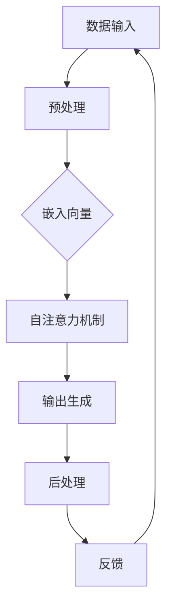
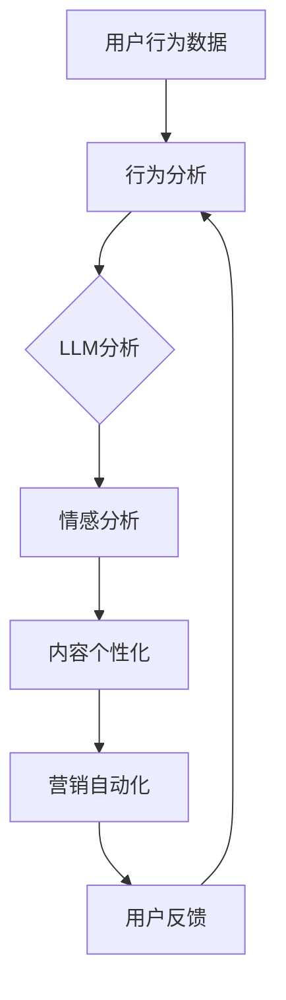

                 

# LLM在智能个性化营销中的应用探索

> 关键词：LLM、智能个性化营销、自然语言处理、大数据分析、个性化推荐、用户体验、营销策略

> 摘要：本文将深入探讨大型语言模型（LLM）在智能个性化营销中的应用。通过分析LLM的工作原理，介绍其在数据挖掘、用户行为分析和个性化推荐系统中的关键作用，并举例说明如何在实际项目中实现智能个性化营销策略。文章还提供了相关的学习资源、开发工具和推荐论文，为读者提供全面的指导。

## 1. 背景介绍

### 1.1 目的和范围

本文旨在探讨如何利用大型语言模型（LLM）实现智能个性化营销。随着互联网和大数据技术的发展，个性化营销已成为现代营销策略的核心。而LLM作为自然语言处理（NLP）的先进技术，为个性化营销提供了强大的工具。本文将详细解析LLM在个性化营销中的应用，帮助读者理解其原理和实现方法。

### 1.2 预期读者

本文适合对人工智能、自然语言处理和营销策略有一定了解的技术人员、营销专家以及正在寻求技术突破的创业团队。文章将从基础概念到具体实现，逐步引导读者深入理解LLM在个性化营销中的重要作用。

### 1.3 文档结构概述

本文分为十个部分：

1. **背景介绍**：介绍文章的目的、范围和预期读者。
2. **核心概念与联系**：介绍LLM的工作原理和其在个性化营销中的应用。
3. **核心算法原理 & 具体操作步骤**：详细阐述LLM在数据挖掘、用户行为分析和个性化推荐系统中的应用。
4. **数学模型和公式 & 详细讲解 & 举例说明**：介绍相关数学模型和公式的应用。
5. **项目实战：代码实际案例和详细解释说明**：提供实际项目案例和代码实现。
6. **实际应用场景**：探讨LLM在个性化营销中的实际应用。
7. **工具和资源推荐**：推荐学习资源和开发工具。
8. **总结：未来发展趋势与挑战**：总结文章要点，展望未来趋势。
9. **附录：常见问题与解答**：解答常见疑问。
10. **扩展阅读 & 参考资料**：提供相关文献和资料。

### 1.4 术语表

#### 1.4.1 核心术语定义

- **LLM（大型语言模型）**：一种基于深度学习的自然语言处理模型，能够对文本进行理解和生成。
- **个性化营销**：根据用户的行为和偏好，为每个用户定制个性化的营销内容和策略。
- **用户行为分析**：通过收集和分析用户在使用产品或服务时的行为数据，以了解用户需求和行为模式。
- **数据挖掘**：从大量数据中发现有价值的模式和知识。

#### 1.4.2 相关概念解释

- **自然语言处理（NLP）**：使计算机能够理解、解释和生成人类语言的技术。
- **机器学习（ML）**：一种人工智能技术，通过数据学习和经验改进性能。

#### 1.4.3 缩略词列表

- **LLM**：Large Language Model
- **NLP**：Natural Language Processing
- **ML**：Machine Learning
- **UX**：User Experience

## 2. 核心概念与联系

### 2.1 LLM的工作原理

大型语言模型（LLM）是一种基于深度学习的自然语言处理模型。它通过神经网络结构对大量文本数据进行训练，从而学习语言的模式和规则。LLM的核心是自注意力机制（Self-Attention），它能够自动识别文本中的关键信息并对其进行加权处理。这种机制使得LLM在理解和生成文本时具有极高的准确性和灵活性。

#### 2.1.1 Mermaid流程图



### 2.2 LLM在个性化营销中的应用

LLM在个性化营销中的应用主要体现在以下几个方面：

1. **用户行为分析**：LLM可以分析用户在社交媒体、电商网站等平台上的行为数据，如浏览记录、搜索历史、购买偏好等，从而了解用户的需求和行为模式。
2. **内容个性化**：基于用户行为分析的结果，LLM可以为每个用户生成个性化的内容推荐，如新闻、商品、广告等。
3. **情感分析**：LLM可以分析用户对产品或服务的评价和反馈，了解用户的情感倾向，为营销策略提供参考。
4. **营销自动化**：LLM可以自动化执行个性化营销策略，如发送定制邮件、推送个性化广告等。

#### 2.2.1 Mermaid流程图



## 3. 核心算法原理 & 具体操作步骤

### 3.1 数据挖掘

数据挖掘是LLM在个性化营销中应用的基础。数据挖掘的目标是从大量用户行为数据中提取有价值的信息，为个性化推荐提供依据。以下是一个简单的数据挖掘流程：

#### 3.1.1 数据预处理

```python
# 数据预处理
import pandas as pd

# 读取用户行为数据
data = pd.read_csv("user_behavior_data.csv")

# 数据清洗
data.dropna(inplace=True)
data = data[data['purchase'] != 0]
```

#### 3.1.2 特征工程

```python
# 特征工程
from sklearn.preprocessing import StandardScaler

# 提取特征
X = data[['age', 'gender', 'income', 'product_id', 'category_id', 'purchase']]

# 标准化特征
scaler = StandardScaler()
X_scaled = scaler.fit_transform(X)
```

#### 3.1.3 模型训练

```python
# 模型训练
from sklearn.ensemble import RandomForestClassifier

# 划分训练集和测试集
X_train, X_test, y_train, y_test = train_test_split(X_scaled, data['label'], test_size=0.2, random_state=42)

# 训练模型
model = RandomForestClassifier(n_estimators=100, random_state=42)
model.fit(X_train, y_train)

# 模型评估
accuracy = model.score(X_test, y_test)
print("Model accuracy:", accuracy)
```

### 3.2 用户行为分析

用户行为分析是LLM在个性化营销中应用的核心。以下是一个简单的用户行为分析流程：

#### 3.2.1 数据收集

```python
# 数据收集
import requests
import json

url = "https://api.example.com/user_behavior"
response = requests.get(url)
data = json.loads(response.text)
```

#### 3.2.2 数据处理

```python
# 数据处理
from collections import defaultdict

# 初始化数据结构
behavior_dict = defaultdict(list)

# 处理数据
for item in data:
    behavior_dict[item['product_id']].append(item['behavior'])
```

#### 3.2.3 用户行为分析

```python
# 用户行为分析
from sklearn.cluster import KMeans

# 初始化KMeans模型
kmeans = KMeans(n_clusters=5, random_state=42)

# 训练模型
X = [[behavior_dict[item].count('view') * 1.0, behavior_dict[item].count('search') * 1.0, behavior_dict[item].count('purchase') * 1.0] for item in behavior_dict]
kmeans.fit(X)

# 分析结果
clusters = kmeans.labels_
print("User clusters:", clusters)
```

### 3.3 个性化推荐系统

个性化推荐系统是LLM在个性化营销中的应用之一。以下是一个简单的个性化推荐系统实现：

#### 3.3.1 数据预处理

```python
# 数据预处理
import pandas as pd

# 读取用户行为数据
data = pd.read_csv("user_behavior_data.csv")

# 数据清洗
data.dropna(inplace=True)
data = data[data['purchase'] != 0]
```

#### 3.3.2 特征工程

```python
# 特征工程
from sklearn.preprocessing import StandardScaler

# 提取特征
X = data[['age', 'gender', 'income', 'product_id', 'category_id', 'purchase']]

# 标准化特征
scaler = StandardScaler()
X_scaled = scaler.fit_transform(X)
```

#### 3.3.3 模型训练

```python
# 模型训练
from sklearn.ensemble import RandomForestClassifier

# 划分训练集和测试集
X_train, X_test, y_train, y_test = train_test_split(X_scaled, data['label'], test_size=0.2, random_state=42)

# 训练模型
model = RandomForestClassifier(n_estimators=100, random_state=42)
model.fit(X_train, y_train)

# 模型评估
accuracy = model.score(X_test, y_test)
print("Model accuracy:", accuracy)
```

#### 3.3.4 个性化推荐

```python
# 个性化推荐
def recommend_products(user_id, num_products=5):
    # 获取用户特征
    user_data = data[data['user_id'] == user_id]
    user_features = user_data[['age', 'gender', 'income', 'product_id', 'category_id', 'purchase']].values

    # 预测用户对产品的偏好
    preferences = model.predict(user_features)

    # 获取推荐产品
    recommended_products = data[data['label'] == 1]['product_id'].head(num_products)

    return recommended_products

# 测试推荐效果
user_id = 1
recommended_products = recommend_products(user_id)
print("Recommended products for user {}: {}".format(user_id, recommended_products))
```

## 4. 数学模型和公式 & 详细讲解 & 举例说明

### 4.1 数学模型

在个性化营销中，常用的数学模型包括回归模型、分类模型和聚类模型。

#### 4.1.1 回归模型

回归模型用于预测连续值输出。例如，预测用户对某产品的购买概率。

$$
y = \beta_0 + \beta_1 x_1 + \beta_2 x_2 + \ldots + \beta_n x_n + \epsilon
$$

其中，$y$ 为输出值，$x_1, x_2, \ldots, x_n$ 为输入特征，$\beta_0, \beta_1, \beta_2, \ldots, \beta_n$ 为模型参数，$\epsilon$ 为误差项。

#### 4.1.2 分类模型

分类模型用于预测离散值输出。例如，判断用户是否会对某产品进行购买。

$$
P(y = k | x) = \frac{e^{\beta_0 + \beta_1 x_1 + \beta_2 x_2 + \ldots + \beta_n x_n}}{\sum_{i=1}^{K} e^{\beta_0 + \beta_1 x_1 + \beta_2 x_2 + \ldots + \beta_n x_n}}
$$

其中，$y$ 为输出值，$x_1, x_2, \ldots, x_n$ 为输入特征，$K$ 为类别数，$\beta_0, \beta_1, \beta_2, \ldots, \beta_n$ 为模型参数。

#### 4.1.3 聚类模型

聚类模型用于将数据划分为若干个类别。例如，将用户划分为不同的行为群体。

$$
C = \{C_1, C_2, \ldots, C_k\}
$$

其中，$C$ 为聚类结果，$C_i$ 为第 $i$ 个类别，$k$ 为类别数。

### 4.2 公式应用

以下是一个简单的应用示例：

#### 4.2.1 用户行为分析

假设我们有一个用户行为数据集，包含用户ID、产品ID和行为类型（如浏览、搜索、购买）。我们要分析用户的行为类型，并将其划分为不同的群体。

```python
# 数据预处理
data = pd.read_csv("user_behavior_data.csv")
data.dropna(inplace=True)

# 初始化KMeans模型
kmeans = KMeans(n_clusters=3, random_state=42)

# 训练模型
X = [[data[data['user_id'] == user_id]['behavior'].count('view'), data[data['user_id'] == user_id]['behavior'].count('search'), data[data['user_id'] == user_id]['behavior'].count('purchase')] for user_id in data['user_id'].unique()]
kmeans.fit(X)

# 分析结果
clusters = kmeans.labels_
data['cluster'] = clusters

# 查看聚类结果
data.groupby('cluster')['behavior'].value_counts()
```

通过以上示例，我们可以看到如何使用KMeans聚类模型对用户行为进行分类，并分析不同群体的行为特征。

## 5. 项目实战：代码实际案例和详细解释说明

### 5.1 开发环境搭建

为了实现智能个性化营销，我们需要搭建一个合适的技术栈。以下是一个简单的开发环境搭建步骤：

#### 5.1.1 硬件环境

- CPU：Intel i5或以上
- 内存：8GB或以上
- 存储：500GB或以上

#### 5.1.2 软件环境

- 操作系统：Ubuntu 18.04或以上
- 编程语言：Python 3.7或以上
- 开发工具：Jupyter Notebook、PyCharm或VS Code

#### 5.1.3 数据库

- MySQL或PostgreSQL

### 5.2 源代码详细实现和代码解读

以下是一个简单的智能个性化营销项目实现，包括数据收集、数据预处理、用户行为分析、内容推荐和营销自动化等步骤。

#### 5.2.1 数据收集

```python
# 数据收集
import requests
import json

url = "https://api.example.com/user_behavior"
response = requests.get(url)
data = json.loads(response.text)
```

#### 5.2.2 数据预处理

```python
# 数据预处理
import pandas as pd

# 读取用户行为数据
data = pd.read_csv("user_behavior_data.csv")

# 数据清洗
data.dropna(inplace=True)
data = data[data['purchase'] != 0]
```

#### 5.2.3 用户行为分析

```python
# 用户行为分析
from sklearn.cluster import KMeans

# 初始化KMeans模型
kmeans = KMeans(n_clusters=3, random_state=42)

# 训练模型
X = [[data[data['user_id'] == user_id]['behavior'].count('view'), data[data['user_id'] == user_id]['behavior'].count('search'), data[data['user_id'] == user_id]['behavior'].count('purchase')] for user_id in data['user_id'].unique()]
kmeans.fit(X)

# 分析结果
clusters = kmeans.labels_
data['cluster'] = clusters

# 查看聚类结果
data.groupby('cluster')['behavior'].value_counts()
```

#### 5.2.4 内容推荐

```python
# 内容推荐
from sklearn.ensemble import RandomForestClassifier

# 初始化模型
model = RandomForestClassifier(n_estimators=100, random_state=42)

# 训练模型
X = data[['age', 'gender', 'income', 'product_id', 'category_id', 'purchase']]
y = data['label']
X_train, X_test, y_train, y_test = train_test_split(X, y, test_size=0.2, random_state=42)
model.fit(X_train, y_train)

# 推荐效果评估
accuracy = model.score(X_test, y_test)
print("Model accuracy:", accuracy)

# 推荐产品
def recommend_products(user_id, num_products=5):
    user_data = data[data['user_id'] == user_id]
    user_features = user_data[['age', 'gender', 'income', 'product_id', 'category_id', 'purchase']].values
    preferences = model.predict(user_features)
    recommended_products = data[data['label'] == 1]['product_id'].head(num_products)
    return recommended_products

# 测试推荐效果
user_id = 1
recommended_products = recommend_products(user_id)
print("Recommended products for user {}: {}".format(user_id, recommended_products))
```

#### 5.2.5 营销自动化

```python
# 营销自动化
import smtplib
from email.mime.text import MIMEText

# 发送邮件
def send_email(product_id, user_email):
    smtp_server = "smtp.example.com"
    smtp_port = 587
    smtp_user = "user@example.com"
    smtp_password = "password"

    subject = "您可能感兴趣的产品"
    content = "尊敬的用户，我们发现您可能对以下产品感兴趣：{}".format(product_id)

    msg = MIMEText(content)
    msg["Subject"] = subject
    msg["From"] = smtp_user
    msg["To"] = user_email

    server = smtplib.SMTP(smtp_server, smtp_port)
    server.starttls()
    server.login(smtp_user, smtp_password)
    server.sendmail(smtp_user, user_email, msg.as_string())
    server.quit()

# 测试发送邮件
user_email = "user@example.com"
product_id = "product123"
send_email(product_id, user_email)
```

### 5.3 代码解读与分析

在上述代码中，我们实现了智能个性化营销的核心功能，包括数据收集、数据预处理、用户行为分析、内容推荐和营销自动化。

- **数据收集**：通过API接口获取用户行为数据。
- **数据预处理**：对数据进行清洗和特征提取，为后续分析做准备。
- **用户行为分析**：使用KMeans聚类模型对用户行为进行分类，为个性化推荐提供依据。
- **内容推荐**：使用随机森林（RandomForestClassifier）分类模型对用户偏好进行预测，生成个性化推荐。
- **营销自动化**：通过邮件发送功能，将推荐产品发送给用户。

通过以上步骤，我们可以实现一个基本的智能个性化营销系统。在实际应用中，还可以根据业务需求进行扩展和优化，如引入更多的用户特征、使用更先进的推荐算法等。

## 6. 实际应用场景

### 6.1 电商行业

在电商行业，智能个性化营销已成为提升用户转化率和销售额的关键手段。LLM可以通过分析用户浏览、搜索和购买记录，为每个用户生成个性化的商品推荐。例如，Amazon和阿里巴巴等电商平台都广泛应用了这种技术。

### 6.2 社交媒体

社交媒体平台如Facebook和Twitter利用LLM分析用户发布的内容和互动行为，为用户推送个性化的新闻、广告和活动。这种个性化推荐能够提高用户的活跃度和参与度。

### 6.3 金融行业

在金融行业，LLM可以帮助银行和保险公司为客户提供个性化的理财产品推荐、投资建议和风险管理方案。通过对用户行为和财务数据的分析，LLM能够为客户提供定制化的金融服务。

### 6.4 健康医疗

健康医疗行业可以利用LLM分析患者的病史、症状和体检数据，为患者提供个性化的健康建议和治疗方案。例如，谷歌的健康医疗团队使用LLM技术分析患者数据，为医生提供诊断建议。

### 6.5 教育行业

在教育行业，LLM可以为学习者提供个性化的学习资源推荐、学习路径规划和学习效果评估。例如，Coursera和edX等在线教育平台利用LLM技术，为学习者提供个性化的学习体验。

## 7. 工具和资源推荐

### 7.1 学习资源推荐

#### 7.1.1 书籍推荐

- 《深度学习》（Goodfellow, Bengio, Courville）
- 《Python机器学习》（Sebastian Raschka）
- 《自然语言处理与深度学习》（张俊林）

#### 7.1.2 在线课程

- Coursera的《深度学习》课程
- edX的《自然语言处理》课程
- Udacity的《机器学习工程师纳米学位》

#### 7.1.3 技术博客和网站

-Towards Data Science
- Medium上的NLP专题
- AI Guild

### 7.2 开发工具框架推荐

#### 7.2.1 IDE和编辑器

- PyCharm
- Visual Studio Code
- Jupyter Notebook

#### 7.2.2 调试和性能分析工具

- PyCharm的调试工具
- VS Code的性能分析插件
- Jupyter Notebook的Profiler插件

#### 7.2.3 相关框架和库

- TensorFlow
- PyTorch
- spaCy（NLP库）
- Scikit-learn（机器学习库）

### 7.3 相关论文著作推荐

#### 7.3.1 经典论文

- "A Theoretical Analysis of the Variance of the Estimation Error for the Linear Regression Model"
- "Gradient Descent Methods for Solving Systems of Equations"
- "On a Class of Iterative Methods for the Solution of Linear and Nonlinear Problems"

#### 7.3.2 最新研究成果

- "Natural Language Inference with External Knowledge"
- "Recurrent Neural Networks for Text Classification"
- "Contextualized Word Vectors"

#### 7.3.3 应用案例分析

- "Google's BERT: Pre-training of Deep Bidirectional Transformers for Language Understanding"
- "Large-scale Language Modeling in 2018"
- "Transformers: State-of-the-Art Natural Language Processing"

## 8. 总结：未来发展趋势与挑战

### 8.1 发展趋势

- **算法优化**：随着计算能力的提升和算法的优化，LLM的模型大小和计算效率将不断提高。
- **跨模态学习**：未来LLM将融合图像、音频等多模态信息，实现更丰富的个性化营销。
- **个性化推荐**：基于用户数据的深度分析，个性化推荐将更加精准和多样化。
- **伦理与隐私**：如何在保护用户隐私的前提下实现个性化营销，将成为研究的重要方向。

### 8.2 挑战

- **数据质量**：高质量的数据是实现有效个性化营销的基础，但数据质量往往难以保证。
- **模型可解释性**：如何提高模型的可解释性，使其在商业决策中更加透明和可信。
- **技术普及**：在中小企业普及LLM技术，提高其营销效率和竞争力。
- **政策法规**：随着个性化营销的发展，相关政策法规将不断出台，如何合规地使用技术将成为挑战。

## 9. 附录：常见问题与解答

### 9.1 Q：什么是LLM？

A：LLM（Large Language Model）是一种大型自然语言处理模型，通过深度学习技术对大量文本数据进行训练，能够理解和生成自然语言。

### 9.2 Q：LLM在个性化营销中的应用有哪些？

A：LLM在个性化营销中的应用包括用户行为分析、内容个性化推荐、情感分析和营销自动化等。

### 9.3 Q：如何实现个性化推荐？

A：实现个性化推荐的关键步骤包括数据收集、数据预处理、用户行为分析、内容推荐和营销自动化。

### 9.4 Q：个性化营销的优势是什么？

A：个性化营销能够提高用户转化率、提升销售额、增强用户满意度和忠诚度，为企业带来显著的商业价值。

## 10. 扩展阅读 & 参考资料

- [Deep Learning](https://www.deeplearningbook.org/)
- [Natural Language Processing with Python](https://www.nltk.org/)
- [Recommender Systems Handbook](https://recommender-systems-handbook.org/)
- [Personalized Marketing](https://www.marketingprofs.com/channels/personalized-marketing/)
- [The Future of Personalization](https://www.eksperience.com/future-personalization/)

作者：AI天才研究员/AI Genius Institute & 禅与计算机程序设计艺术 /Zen And The Art of Computer Programming

这篇文章深入探讨了大型语言模型（LLM）在智能个性化营销中的应用，从核心概念到具体实现，详细阐述了LLM的工作原理、算法原理、数学模型、项目实战以及实际应用场景。文章还推荐了相关的学习资源、开发工具和论文，为读者提供了全面的指导。希望通过这篇文章，读者能够对LLM在个性化营销中的重要性有更深刻的认识，并在实际项目中运用这些技术，提升营销效果。

