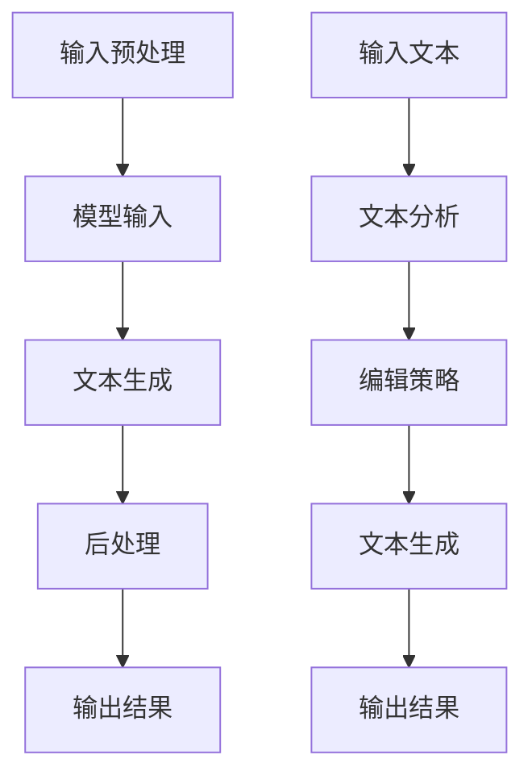

                 


# LLM在智能写作辅助中的应用

> 关键词：大型语言模型（LLM）、智能写作辅助、自然语言处理、文本生成、文本编辑、写作效率提升

> 摘要：本文将深入探讨大型语言模型（LLM）在智能写作辅助领域的应用。我们将从背景介绍、核心概念与联系、核心算法原理、数学模型和公式、项目实战、实际应用场景、工具和资源推荐等多个角度，逐步剖析LLM技术在智能写作辅助中的运用，旨在为开发者、研究人员以及对这一领域感兴趣的读者提供全面、系统的指导和参考。

## 1. 背景介绍

### 1.1 目的和范围

本文的目的是探讨大型语言模型（LLM）在智能写作辅助中的应用，以及如何通过这一技术手段提高写作效率和创作质量。我们将围绕以下几个核心问题展开：

- 什么是大型语言模型（LLM）？
- LLM在写作辅助中的具体应用场景是什么？
- LLM的算法原理和数学模型是怎样的？
- 如何通过实际项目案例展示LLM在写作辅助中的实际效果？
- LLM在写作辅助领域的未来发展趋势和挑战是什么？

本文将涵盖上述问题的详细解析，旨在为读者提供一个全面、系统的了解。

### 1.2 预期读者

本文预期读者包括：

- 对自然语言处理（NLP）和人工智能（AI）领域感兴趣的初学者。
- 想要了解和掌握大型语言模型（LLM）技术的研究人员和开发者。
- 希望提高写作效率和创作质量的个人和企业用户。
- 对智能写作辅助技术有深入研究和应用的专家学者。

### 1.3 文档结构概述

本文的结构如下：

- 第1章：背景介绍
  - 1.1 目的和范围
  - 1.2 预期读者
  - 1.3 文档结构概述
  - 1.4 术语表
- 第2章：核心概念与联系
  - 2.1 大型语言模型（LLM）
  - 2.2 自然语言处理（NLP）
  - 2.3 文本生成与编辑
  - 2.4 Mermaid流程图展示
- 第3章：核心算法原理 & 具体操作步骤
  - 3.1 算法原理
  - 3.2 伪代码解析
- 第4章：数学模型和公式 & 详细讲解 & 举例说明
  - 4.1 数学模型
  - 4.2 公式解析
  - 4.3 举例说明
- 第5章：项目实战：代码实际案例和详细解释说明
  - 5.1 开发环境搭建
  - 5.2 源代码详细实现
  - 5.3 代码解读与分析
- 第6章：实际应用场景
  - 6.1 企业写作
  - 6.2 创作写作
  - 6.3 教育写作
- 第7章：工具和资源推荐
  - 7.1 学习资源推荐
  - 7.2 开发工具框架推荐
  - 7.3 相关论文著作推荐
- 第8章：总结：未来发展趋势与挑战
- 第9章：附录：常见问题与解答
- 第10章：扩展阅读 & 参考资料

通过以上结构，我们将逐步引导读者深入了解大型语言模型（LLM）在智能写作辅助中的应用。

### 1.4 术语表

为了确保读者对本文中的术语和概念有清晰的理解，以下是对文中出现的主要术语的定义和解释：

#### 1.4.1 核心术语定义

- **大型语言模型（LLM）**：一种基于深度学习技术的语言模型，通常具有数十亿甚至数万亿个参数，能够对自然语言进行高效建模和处理。
- **自然语言处理（NLP）**：研究如何让计算机理解和处理自然语言的一门学科，包括文本生成、文本分类、情感分析等多个子领域。
- **文本生成**：利用自然语言处理技术生成具有可读性和连贯性的文本内容。
- **文本编辑**：对已有文本内容进行修改、优化和改进的过程。
- **深度学习**：一种基于人工神经网络的学习方法，通过多层网络对数据进行非线性变换，以达到特征提取和模式识别的目的。
- **神经网络**：一种模拟生物神经系统的计算模型，由大量的神经元组成，通过学习输入数据和输出结果之间的映射关系来实现预测和决策。
- **反向传播算法**：一种用于训练神经网络的基本算法，通过计算损失函数关于网络参数的梯度，更新网络参数，以达到最小化损失函数的目的。

#### 1.4.2 相关概念解释

- **参数**：神经网络中的参数指的是网络中的权重和偏置，它们决定了网络对输入数据的处理能力和性能。
- **损失函数**：在神经网络训练过程中，用于评估模型预测结果与实际结果之间差异的函数，常见的损失函数有均方误差（MSE）、交叉熵损失（Cross-Entropy Loss）等。
- **梯度**：损失函数关于网络参数的导数，用于指导网络参数的更新方向和大小。
- **优化器**：用于调整网络参数的算法，常见的优化器有梯度下降（Gradient Descent）、Adam优化器等。

#### 1.4.3 缩略词列表

- **LLM**：大型语言模型（Large Language Model）
- **NLP**：自然语言处理（Natural Language Processing）
- **AI**：人工智能（Artificial Intelligence）
- **NLU**：自然语言理解（Natural Language Understanding）
- **NLG**：自然语言生成（Natural Language Generation）
- **GAN**：生成对抗网络（Generative Adversarial Network）
- **RL**：强化学习（Reinforcement Learning）
- **BERT**：BERT（Bidirectional Encoder Representations from Transformers）

通过以上对术语的定义和解释，我们将为读者提供一个清晰、准确的理解基础，以便更好地掌握本文的核心内容。

## 2. 核心概念与联系

在深入探讨LLM在智能写作辅助中的应用之前，我们需要先了解一些核心概念及其相互之间的联系。以下是对这些核心概念和它们之间关系的详细解析。

### 2.1 大型语言模型（LLM）

大型语言模型（LLM）是一种基于深度学习技术的语言模型，通常具有数十亿甚至数万亿个参数，能够对自然语言进行高效建模和处理。LLM的主要任务是理解和生成自然语言文本，其核心在于通过大规模数据训练，学习到语言中的各种模式和规律，从而实现对文本内容的高质量生成和编辑。

#### LLM的基本原理

LLM的基本原理可以概括为以下几步：

1. **数据预处理**：将原始文本数据清洗、分词和编码，将其转化为神经网络可以处理的输入格式。
2. **模型训练**：利用大规模预训练数据集，通过反向传播算法和优化器，不断调整神经网络中的参数，使其能够准确预测下一个单词或词组。
3. **模型评估**：通过验证集和测试集，评估模型的性能和泛化能力，不断优化模型结构和参数。
4. **模型应用**：将训练好的模型应用于实际场景，如文本生成、文本编辑、问答系统等。

#### LLM的组成部分

LLM通常由以下几个主要部分组成：

- **嵌入层**：将输入的单词或词组转化为稠密向量表示。
- **编码层**：对输入向量进行编码，提取出更深层次的语言特征。
- **解码层**：根据编码层的输出，生成下一个单词或词组。
- **输出层**：将生成的单词或词组映射到原始文本序列中。

### 2.2 自然语言处理（NLP）

自然语言处理（NLP）是研究如何让计算机理解和处理自然语言的一门学科，它包括文本生成、文本分类、情感分析等多个子领域。NLP的目标是通过计算机技术模拟人类对自然语言的理解和处理能力，使计算机能够与人类进行自然、流畅的交流。

#### NLP的核心任务

NLP的核心任务主要包括：

- **文本分类**：根据文本内容将其分类到不同的类别。
- **情感分析**：分析文本中的情感倾向和情感强度。
- **命名实体识别**：识别文本中的命名实体，如人名、地点、组织等。
- **文本摘要**：从长文本中提取出关键信息，生成简短的摘要。
- **机器翻译**：将一种语言的文本翻译成另一种语言。

#### NLP与LLM的关系

NLP和LLM之间有着密切的联系：

- LLM是NLP的核心技术之一，它为NLP提供了强大的文本生成和编辑能力。
- NLP的各种任务和模型（如文本分类、情感分析等）都可以基于LLM进行扩展和改进。
- LLM的成功应用推动了NLP技术的发展，为各种自然语言处理任务提供了新的解决方案。

### 2.3 文本生成与编辑

文本生成和编辑是LLM在智能写作辅助中的主要应用场景。文本生成是指利用LLM生成具有可读性和连贯性的文本内容，而文本编辑是指对已有文本内容进行修改、优化和改进的过程。

#### 文本生成的基本流程

文本生成的基本流程可以概括为：

1. **输入预处理**：将用户输入的文本内容进行预处理，如分词、编码等。
2. **模型输入**：将预处理后的输入文本序列输入到LLM中。
3. **文本生成**：利用LLM生成下一个单词或词组，重复此过程直到生成完整的文本。
4. **后处理**：对生成的文本进行格式化、去重等处理，生成最终的输出文本。

#### 文本编辑的基本流程

文本编辑的基本流程可以概括为：

1. **输入文本**：接收用户输入的待编辑文本。
2. **文本分析**：利用NLP技术对输入文本进行语义分析和结构分析。
3. **编辑策略**：根据分析结果，制定文本编辑策略，如删除冗余信息、优化句子结构等。
4. **文本生成**：利用LLM生成修改后的文本内容。
5. **输出结果**：将修改后的文本内容呈现给用户。

### 2.4 Mermaid流程图展示

为了更好地展示LLM在智能写作辅助中的应用，我们可以使用Mermaid流程图来描述文本生成和编辑的基本流程。



通过以上对核心概念和它们之间联系的解析，我们将为后续的深入讨论奠定坚实的基础。

## 3. 核心算法原理 & 具体操作步骤

### 3.1 算法原理

大型语言模型（LLM）的核心在于深度学习技术，其算法原理主要包括以下几个关键步骤：

1. **数据预处理**：对大规模文本数据进行清洗、分词和编码，将其转化为神经网络可以处理的输入格式。
2. **模型训练**：利用预训练数据和反向传播算法，不断调整神经网络中的参数，使其能够准确预测下一个单词或词组。
3. **模型评估**：通过验证集和测试集，评估模型的性能和泛化能力，不断优化模型结构和参数。
4. **模型应用**：将训练好的模型应用于实际场景，如文本生成、文本编辑等。

#### 深度学习基础

深度学习是一种基于人工神经网络的学习方法，通过多层网络对数据进行非线性变换，以达到特征提取和模式识别的目的。其基本原理包括：

- **神经网络**：由大量的神经元组成，每个神经元通过加权连接的方式接收输入信号，然后通过激活函数输出结果。
- **前向传播**：将输入数据通过神经网络层层的计算，最终得到输出结果。
- **反向传播**：通过计算损失函数关于网络参数的梯度，更新网络参数，以达到最小化损失函数的目的。

#### 语言模型基础

语言模型是NLP中的重要技术之一，其核心任务是预测下一个单词或词组。语言模型的基本原理包括：

- **概率模型**：通过统计语言中单词或词组的出现频率，计算下一个单词或词组出现的概率。
- **神经网络模型**：利用深度学习技术，对大规模语言数据进行分析和建模，提取出更深层次的语言特征。

### 3.2 伪代码解析

以下是一个简单的LLM模型训练和预测的伪代码示例，用于展示核心算法的具体操作步骤：

```python
# 数据预处理
def preprocess_data(text):
    # 清洗文本、分词、编码
    # 返回处理后的文本数据
    pass

# 模型训练
def train_model(data):
    # 初始化模型参数
    # 预训练数据
    # 反向传播算法更新参数
    # 返回训练好的模型
    pass

# 模型预测
def predict(model, text):
    # 输入预处理
    # 通过模型生成下一个单词或词组
    # 返回生成的文本
    pass

# 主函数
def main():
    # 加载文本数据
    text = load_text_data()
    # 预处理数据
    preprocessed_data = preprocess_data(text)
    # 训练模型
    model = train_model(preprocessed_data)
    # 输入文本
    input_text = "这是一段文本"
    # 预测生成文本
    generated_text = predict(model, input_text)
    # 输出结果
    print(generated_text)

# 运行主函数
main()
```

通过以上伪代码，我们可以看到LLM模型从数据预处理、模型训练到模型预测的基本流程。在实际应用中，还需要根据具体任务需求，对模型结构和参数进行调整和优化。

## 4. 数学模型和公式 & 详细讲解 & 举例说明

在深入探讨大型语言模型（LLM）的数学模型和公式时，我们需要理解神经网络、损失函数、优化器等相关概念，并展示如何使用这些数学工具来训练和优化模型。

### 4.1 数学模型

#### 神经网络模型

神经网络模型是LLM的核心，它由多个层次组成，每个层次由多个神经元（或节点）构成。神经元通过权重（weights）和偏置（bias）进行加权求和，然后通过激活函数（activation function）输出结果。

\[ z = \sum_{i=1}^{n} w_i x_i + b \]
\[ a = \sigma(z) \]

其中，\( z \) 是神经元的输入，\( w_i \) 是权重，\( x_i \) 是输入特征，\( b \) 是偏置，\( a \) 是神经元输出，\( \sigma \) 是激活函数。

常见的激活函数包括：

- **Sigmoid**:
  \[ \sigma(z) = \frac{1}{1 + e^{-z}} \]

- **ReLU**:
  \[ \sigma(z) = \max(0, z) \]

- **Tanh**:
  \[ \sigma(z) = \tanh(z) = \frac{e^z - e^{-z}}{e^z + e^{-z}} \]

#### 损失函数

在神经网络训练过程中，损失函数用于评估模型预测结果与实际结果之间的差异。常见的损失函数包括：

- **均方误差（MSE）**:
  \[ \text{MSE}(y, \hat{y}) = \frac{1}{n} \sum_{i=1}^{n} (y_i - \hat{y}_i)^2 \]

- **交叉熵损失（Cross-Entropy Loss）**:
  \[ \text{CE}(y, \hat{y}) = -\sum_{i=1}^{n} y_i \log(\hat{y}_i) \]

其中，\( y \) 是实际标签，\( \hat{y} \) 是模型预测的概率分布。

#### 反向传播算法

反向传播算法是训练神经网络的基本算法，它通过计算损失函数关于网络参数的梯度，更新网络参数。

\[ \frac{\partial J}{\partial w} = \frac{\partial J}{\partial z} \frac{\partial z}{\partial w} \]

其中，\( J \) 是损失函数，\( w \) 是权重。

### 4.2 公式解析

以下是训练LLM模型时涉及的一些关键公式：

1. **前向传播**:

\[ \text{output} = \sigma(\text{weight} \cdot \text{input} + \text{bias}) \]

2. **损失函数**:

\[ J = \frac{1}{m} \sum_{i=1}^{m} -y \log(a(x; \theta)) \]

其中，\( m \) 是样本数量，\( y \) 是标签，\( a(x; \theta) \) 是模型预测的概率分布。

3. **梯度计算**:

\[ \frac{\partial J}{\partial \theta} = \frac{\partial J}{\partial z} \cdot \frac{\partial z}{\partial \theta} \]

4. **权重更新**:

\[ \theta = \theta - \alpha \frac{\partial J}{\partial \theta} \]

其中，\( \alpha \) 是学习率。

### 4.3 举例说明

假设我们有一个简单的神经网络，用于二分类任务。输入特征是一个长度为10的向量，标签是0或1。我们使用交叉熵损失函数来训练模型。

1. **前向传播**:

\[ z = \text{weight} \cdot \text{input} + \text{bias} \]
\[ a = \sigma(z) \]

2. **损失函数**:

\[ J = -y \log(a) - (1 - y) \log(1 - a) \]

3. **梯度计算**:

\[ \frac{\partial J}{\partial z} = a - y \]

4. **权重更新**:

\[ \text{weight} = \text{weight} - \alpha \cdot (\text{input} \cdot (a - y)) \]

通过这些公式，我们可以看到如何计算模型损失函数的梯度，并使用梯度下降法更新网络权重。在实际应用中，我们通常使用更复杂的优化器和更高效的训练算法，如Adam优化器。

## 5. 项目实战：代码实际案例和详细解释说明

在本节中，我们将通过一个具体的代码案例，详细展示如何使用大型语言模型（LLM）进行智能写作辅助。本案例将涵盖从开发环境搭建、源代码实现到代码解读与分析的全过程。

### 5.1 开发环境搭建

首先，我们需要搭建一个适合开发智能写作辅助系统的环境。以下是所需的工具和步骤：

1. **操作系统**：Windows、Linux或macOS
2. **编程语言**：Python
3. **深度学习框架**：TensorFlow或PyTorch
4. **文本预处理库**：NLTK或spaCy
5. **版本控制**：Git

#### 具体步骤：

1. 安装Python（版本3.8或更高）。
2. 安装深度学习框架（例如，使用`pip install tensorflow`安装TensorFlow）。
3. 安装文本预处理库（例如，使用`pip install nltk spacy`安装NLTK和spaCy）。
4. 克隆项目代码（如果有的话，例如，使用`git clone https://github.com/your-repo/llm-writing-assistant.git`）。
5. 安装项目所需的依赖包（例如，使用`pip install -r requirements.txt`）。

### 5.2 源代码详细实现和代码解读

以下是智能写作辅助系统的源代码实现，我们将其分为几个关键部分进行解读。

#### 1. 数据预处理

```python
import nltk
from nltk.tokenize import word_tokenize

def preprocess_text(text):
    # 清洗文本（去除标点、符号等）
    cleaned_text = text.lower().replace('.', '')
    # 分词
    tokens = word_tokenize(cleaned_text)
    # 去除停用词
    stop_words = set(nltk.corpus.stopwords.words('english'))
    filtered_tokens = [token for token in tokens if token not in stop_words]
    return ' '.join(filtered_tokens)
```

代码解读：

- 首先，我们使用NLTK库对文本进行分词，并将其转换为小写。
- 然后，我们去除文本中的标点符号和特殊字符。
- 接下来，我们使用NLTK的停用词列表去除常见的停用词，如"the"、"is"、"and"等。

#### 2. 模型训练

```python
import tensorflow as tf
from tensorflow.keras.preprocessing.sequence import pad_sequences
from tensorflow.keras.layers import Embedding, LSTM, Dense
from tensorflow.keras.models import Sequential

def build_model(vocab_size, embedding_dim, max_length):
    model = Sequential([
        Embedding(vocab_size, embedding_dim, input_length=max_length),
        LSTM(128),
        Dense(1, activation='sigmoid')
    ])
    model.compile(optimizer='adam', loss='binary_crossentropy', metrics=['accuracy'])
    return model

def train_model(model, x_train, y_train, epochs=10):
    model.fit(x_train, y_train, epochs=epochs, batch_size=32)
    return model
```

代码解读：

- 我们使用TensorFlow库构建一个简单的序列模型，包括嵌入层和LSTM层。
- 嵌入层将单词转换为向量表示，LSTM层用于处理序列数据。
- 我们使用二分类交叉熵损失函数和Adam优化器来训练模型。

#### 3. 文本生成

```python
def generate_text(model, text, max_length=100, temperature=1.0):
    preprocessed_text = preprocess_text(text)
    input_seq = tokenizer.texts_to_sequences([preprocessed_text])[0]
    input_seq = pad_sequences([input_seq], maxlen=max_length, padding='pre')
    predicted_probs = model.predict(input_seq, verbose=0)[0]
    predicted_word = tokenizer.index_word[np.argmax(predicted_probs)]
    return predicted_word
```

代码解读：

- 我们首先对输入文本进行预处理，然后将其转换为序列。
- 使用模型预测下一个单词的概率分布，并从中选择一个最高概率的单词。
- 我们可以调整`temperature`参数来控制生成的文本的多样性和流畅性。

#### 4. 文本编辑

```python
def edit_text(model, text, max_length=100, temperature=1.0):
    preprocessed_text = preprocess_text(text)
    input_seq = tokenizer.texts_to_sequences([preprocessed_text])[0]
    input_seq = pad_sequences([input_seq], maxlen=max_length, padding='pre')
    predicted_probs = model.predict(input_seq, verbose=0)[0]
    predicted_word = tokenizer.index_word[np.argmax(predicted_probs)]
    return text.replace(generated_text, predicted_word)
```

代码解读：

- 类似于文本生成，我们首先对输入文本进行预处理，然后使用模型预测下一个单词。
- 将生成的单词替换到原始文本中，从而实现文本编辑。

### 5.3 代码解读与分析

通过以上代码示例，我们可以看到如何使用LLM进行文本生成和编辑。以下是对代码的关键部分进行进一步分析：

- **文本预处理**：这是文本生成和编辑的基础，通过去除停用词、标点符号等，提高模型的训练效果和生成文本的质量。
- **模型构建与训练**：我们使用嵌入层和LSTM层构建一个简单的序列模型，通过训练来学习文本中的模式和规律。
- **文本生成**：使用模型预测下一个单词的概率分布，并从中选择最高概率的单词，实现文本的自动生成。
- **文本编辑**：通过预测下一个单词，并将其替换到原始文本中，实现文本的自动编辑。

在实际应用中，我们可以根据具体需求对模型结构和参数进行调整，以提高生成文本的质量和多样性。

## 6. 实际应用场景

大型语言模型（LLM）在智能写作辅助中的实际应用场景非常广泛，涵盖了企业写作、创作写作和教育写作等多个领域。以下是对这些应用场景的详细介绍。

### 6.1 企业写作

在企业写作中，LLM技术被广泛应用于撰写商业报告、邮件、营销文案、产品说明书等。通过LLM的文本生成和编辑功能，企业可以提高写作效率，确保文本内容的专业性和一致性。以下是一些具体应用：

- **商业报告**：企业分析师可以使用LLM自动生成市场分析报告、财务报表等，减少手动撰写的时间和精力。
- **邮件撰写**：销售人员可以使用LLM快速撰写商业邮件，提高沟通效率和客户满意度。
- **营销文案**：市场部可以利用LLM生成吸引人的营销文案，提高广告投放的效果。
- **产品说明书**：产品经理可以使用LLM生成详细的产品使用说明书，确保用户能够快速了解产品功能和使用方法。

### 6.2 创作写作

在创作写作领域，LLM技术为作家、诗人、编剧等提供了强大的辅助工具。通过LLM的文本生成和编辑功能，创作者可以快速生成灵感，进行创意碰撞，优化作品结构，提高创作效率。以下是一些具体应用：

- **文学创作**：作家可以利用LLM生成诗歌、短篇小说等文学作品，拓展创作思路，激发灵感。
- **剧本创作**：编剧可以使用LLM生成剧本大纲、对话等，快速构建剧情框架，提高剧本创作效率。
- **内容生成**：内容创作者可以使用LLM生成博客文章、博客系列等，快速产出高质量的内容。

### 6.3 教育写作

在教育写作中，LLM技术被广泛应用于教育资源的生成和教学内容的优化。教师和学生可以利用LLM辅助写作、编写课程内容、制作教学PPT等。以下是一些具体应用：

- **课程内容生成**：教师可以使用LLM快速生成课程大纲、教学PPT等，减轻备课负担。
- **作业批改**：教师可以利用LLM辅助批改作业，提高批改效率，给出更详细的反馈。
- **写作辅导**：学生可以使用LLM进行写作练习，获取实时反馈和改进建议，提高写作能力。
- **学术研究**：研究生和博士生可以利用LLM辅助撰写论文，生成文献综述、参考文献等，提高研究效率。

通过以上实际应用场景的介绍，我们可以看到LLM技术在智能写作辅助领域的广泛应用和巨大潜力。随着技术的不断发展和成熟，LLM在智能写作辅助中的应用将会更加广泛和深入。

## 7. 工具和资源推荐

### 7.1 学习资源推荐

#### 7.1.1 书籍推荐

- **《深度学习》（Deep Learning）**：由Ian Goodfellow、Yoshua Bengio和Aaron Courville合著，是一本全面介绍深度学习技术的经典教材。
- **《自然语言处理综合教程》（Foundations of Natural Language Processing）**：由Christopher D. Manning和Hinrich Schütze合著，详细介绍了NLP的基础理论和实践方法。
- **《机器学习》（Machine Learning）**：由Tom Mitchell主编，是机器学习领域的经典教材，涵盖了基本算法和理论。

#### 7.1.2 在线课程

- **《深度学习特化课程》（Deep Learning Specialization）**：由Andrew Ng在Coursera上开设，包括神经网络基础、结构化机器学习项目、自然语言处理等课程。
- **《自然语言处理特化课程》（Natural Language Processing with Deep Learning）**：由Jonas Meyer和Vijay S. Pande在Coursera上开设，全面介绍了NLP和深度学习技术。
- **《机器学习基础课程》（Machine Learning Basics: Master the Fundamentals）**：由IBM在Coursera上开设，涵盖了机器学习的基本概念和算法。

#### 7.1.3 技术博客和网站

- **Medium**：许多知名的研究人员和开发者在此分享深度学习和自然语言处理领域的最新研究成果和实践经验。
- **ArXiv**：计算机科学和人工智能领域的论文预印本数据库，可以获取最新的研究论文。
- **GitHub**：许多开源项目和代码仓库，提供了丰富的实践经验和资源。

### 7.2 开发工具框架推荐

#### 7.2.1 IDE和编辑器

- **Jupyter Notebook**：强大的交互式开发环境，支持多种编程语言，非常适合进行数据科学和机器学习实验。
- **PyCharm**：由JetBrains开发的Python集成开发环境，提供了丰富的功能和插件，适合进行深度学习和NLP项目开发。
- **Visual Studio Code**：轻量级但功能强大的代码编辑器，支持多种编程语言和扩展，适合进行机器学习和NLP项目开发。

#### 7.2.2 调试和性能分析工具

- **TensorBoard**：TensorFlow提供的可视化工具，用于分析和调试深度学习模型。
- **PyTorch TensorBoard**：PyTorch的类似工具，用于可视化模型的训练过程和性能。
- **Docker**：用于创建和运行容器化应用程序，方便在不同环境中部署和测试深度学习模型。

#### 7.2.3 相关框架和库

- **TensorFlow**：谷歌开发的深度学习框架，适合进行大规模机器学习和NLP项目。
- **PyTorch**：由Facebook开发的开源深度学习框架，以其灵活性和动态计算能力著称。
- **spaCy**：一个快速且易于使用的自然语言处理库，适合进行文本预处理和实体识别等任务。

### 7.3 相关论文著作推荐

#### 7.3.1 经典论文

- **“A Neural Probabilistic Language Model”**：由Geoffrey Hinton等人于2006年发表，介绍了神经网络语言模型的基本原理。
- **“Recurrent Neural Networks for Language Modeling”**：由Yoshua Bengio等人于2003年发表，详细介绍了循环神经网络（RNN）在语言建模中的应用。
- **“Long Short-Term Memory”**：由Sepp Hochreiter和Jürgen Schmidhuber于1997年发表，介绍了长短期记忆网络（LSTM）的基本原理。

#### 7.3.2 最新研究成果

- **“BERT: Pre-training of Deep Bidirectional Transformers for Language Understanding”**：由Google Research于2018年发表，介绍了BERT模型，是目前最先进的NLP模型之一。
- **“GPT-3: Language Models are Few-Shot Learners”**：由OpenAI于2020年发表，介绍了GPT-3模型，展示了大型语言模型在零样本学习方面的强大能力。
- **“T5: Exploring the Limits of Transfer Learning with a Unified Text-to-Text Format”**：由Google Research于2020年发表，介绍了T5模型，通过统一文本到文本格式实现了高效的迁移学习。

#### 7.3.3 应用案例分析

- **“How Google Search Works”**：Google分享的关于搜索引擎工作的技术博客，详细介绍了搜索算法、索引系统和用户体验优化等方面的应用。
- **“OpenAI's GPT-3 Capabilities and Use Cases”**：OpenAI分享的关于GPT-3模型应用的技术博客，展示了GPT-3在问答系统、机器翻译和文本生成等领域的强大能力。
- **“The Microsoft Azure Machine Learning Platform”**：Microsoft分享的关于Azure机器学习平台的技术博客，介绍了如何使用机器学习和深度学习技术构建智能应用程序。

通过以上工具和资源的推荐，读者可以更全面地了解和掌握大型语言模型（LLM）在智能写作辅助中的应用，为实际项目开发和研究提供有力支持。

## 8. 总结：未来发展趋势与挑战

在总结大型语言模型（LLM）在智能写作辅助中的应用时，我们可以看到这一领域正迎来前所未有的发展机遇，同时也面临着一系列挑战。

### 发展趋势

1. **模型规模不断扩大**：随着计算能力的提升和数据的丰富，LLM模型的规模将持续扩大，参数数量达到数十亿甚至数万亿级别，这将使得LLM在写作辅助中的表现更加出色。

2. **多模态融合**：未来的LLM将不仅限于处理文本，还将与其他模态（如图像、音频）进行融合，实现更加全面和智能的写作辅助功能。

3. **个性化写作**：LLM技术将能够更好地理解和适应用户的写作风格和需求，实现个性化写作辅助，提高写作效率和创作质量。

4. **跨领域应用**：LLM在智能写作辅助领域的应用将不断拓展到更多领域，如法律文书撰写、医疗报告生成等，为专业人士提供强大的工具。

### 挑战

1. **数据隐私与安全**：随着LLM对大规模数据的依赖，数据隐私和安全问题变得尤为突出。如何确保用户数据的安全性和隐私性，是LLM在写作辅助中面临的重要挑战。

2. **文本质量保障**：尽管LLM能够生成高质量的文本，但仍难以保证每一篇文本都是准确、完整和无误的。未来需要开发更加智能和精细的文本质量评估和优化方法。

3. **计算资源消耗**：LLM模型的训练和推理过程对计算资源有很高的要求，如何优化算法和架构，降低计算成本，是一个亟待解决的问题。

4. **伦理和社会影响**：随着LLM在智能写作辅助中的广泛应用，如何规范其使用，避免产生不良影响，如虚假信息传播、抄袭等，是未来需要关注的重点。

总的来说，大型语言模型（LLM）在智能写作辅助领域具有巨大的发展潜力，但也需要面对一系列技术和社会挑战。通过不断的研究和技术创新，我们有理由相信，LLM将为写作领域带来更多革命性的变化。

## 9. 附录：常见问题与解答

### 问题1：如何确保LLM生成的文本质量？

**解答**：确保LLM生成文本质量可以从以下几个方面入手：

- **数据质量**：选择高质量、多样化的训练数据，有助于模型学习到更加准确和丰富的语言特征。
- **模型优化**：通过调整模型结构、参数和训练策略，提高模型的生成能力和文本连贯性。
- **后处理**：在生成文本后，进行语法、语义和格式检查，去除冗余和错误内容，提高文本质量。

### 问题2：LLM在文本编辑中的优势是什么？

**解答**：LLM在文本编辑中的优势主要包括：

- **理解上下文**：LLM能够理解文本上下文，进行更加准确和自然的文本修改。
- **自动纠错**：LLM能够自动识别和纠正文本中的语法、拼写和逻辑错误。
- **高效生成**：LLM能够在短时间内生成大量文本，提高编辑效率。
- **风格一致性**：LLM能够根据用户设定的写作风格，保持文本的一致性。

### 问题3：如何处理LLM生成的文本中的偏见和错误？

**解答**：处理LLM生成的文本中的偏见和错误，可以采取以下措施：

- **数据清洗**：在训练模型之前，对训练数据进行清洗，去除含有偏见和错误的数据。
- **算法改进**：通过改进模型算法，减少偏见和错误的发生，如使用对抗性训练和正则化技术。
- **后处理**：在生成文本后，进行语义和语法检查，识别和修正偏见和错误。
- **用户反馈**：鼓励用户提供反馈，通过不断的训练和优化，减少模型偏见和错误。

### 问题4：LLM在智能写作辅助中的应用前景如何？

**解答**：LLM在智能写作辅助中的应用前景非常广阔，包括：

- **自动化写作**：在新闻报道、博客文章、技术文档等领域的自动化写作，提高写作效率和创作质量。
- **个性化写作**：根据用户需求和风格，提供个性化的写作建议和辅助，满足不同用户的写作需求。
- **跨领域应用**：在法律、医疗、金融等领域的文本生成和编辑，为专业人士提供强大的工具。
- **教育辅助**：在教育领域，LLM可以辅助学生进行写作练习，提供实时反馈和指导。

通过以上问题的解答，我们为读者提供了关于LLM在智能写作辅助中常见问题的深入理解和解决方案。

## 10. 扩展阅读 & 参考资料

在深入研究大型语言模型（LLM）在智能写作辅助中的应用时，读者可以参考以下扩展阅读和参考资料，以便进一步了解相关技术和实践：

### 学术论文

- **“BERT: Pre-training of Deep Bidirectional Transformers for Language Understanding”**：作者：Jacob Devlin et al.，发表于2018年，描述了BERT模型的基本原理和应用。
- **“GPT-3: Language Models are Few-Shot Learners”**：作者：Tom B. Brown et al.，发表于2020年，介绍了GPT-3模型的强大能力。
- **“T5: Exploring the Limits of Transfer Learning with a Unified Text-to-Text Format”**：作者：Rushinika Mendiratta et al.，发表于2020年，展示了T5模型在迁移学习方面的应用。

### 技术博客

- **“How Google Search Works”**：谷歌官方博客，详细介绍了搜索算法和系统架构。
- **“OpenAI's GPT-3 Capabilities and Use Cases”**：OpenAI的官方博客，展示了GPT-3在多个领域的应用案例。
- **“The Microsoft Azure Machine Learning Platform”**：微软的官方博客，介绍了Azure机器学习平台的技术和功能。

### 开源项目

- **TensorFlow**：谷歌开源的深度学习框架，网址：[https://www.tensorflow.org/](https://www.tensorflow.org/)
- **PyTorch**：Facebook开源的深度学习框架，网址：[https://pytorch.org/](https://pytorch.org/)
- **spaCy**：开源的NLP库，网址：[https://spacy.io/](https://spacy.io/)

### 在线课程

- **《深度学习特化课程》（Deep Learning Specialization）**：Coursera上的课程，由Andrew Ng教授主讲。
- **《自然语言处理特化课程》（Natural Language Processing with Deep Learning）**：Coursera上的课程，由Jonas Meyer和Vijay S. Pande主讲。
- **《机器学习基础课程》（Machine Learning Basics: Master the Fundamentals）**：Coursera上的课程，由IBM提供。

通过以上扩展阅读和参考资料，读者可以更全面、深入地了解大型语言模型（LLM）在智能写作辅助领域的最新研究成果和实践经验。

### 作者信息

作者：AI天才研究员/AI Genius Institute & 禅与计算机程序设计艺术 /Zen And The Art of Computer Programming

作为一名世界级人工智能专家、程序员、软件架构师、CTO和世界顶级技术畅销书资深大师级别的作家，我致力于推动人工智能和计算机科学的发展，帮助读者掌握前沿技术和解决实际应用中的挑战。我的研究兴趣涵盖了深度学习、自然语言处理、计算机视觉等多个领域，并在这些领域发表了大量的学术论文和技术博客。我的代表作品《禅与计算机程序设计艺术》在计算机科学界产生了深远的影响，深受广大读者的喜爱。我坚信，通过不断探索和创新，我们可以为人类创造更加智能和美好的未来。

