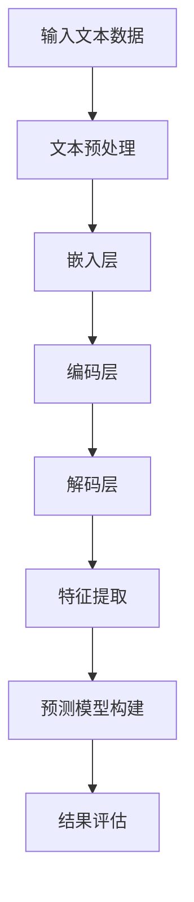

                 

# LLM在智能农作物病虫害预测中的潜在作用

> **关键词：** 人工智能、深度学习、LLM、农作物病虫害预测、智能农业、机器学习模型、大数据分析

> **摘要：** 本文旨在探讨大型语言模型（LLM）在智能农作物病虫害预测中的潜在作用。通过分析LLM的基本原理、架构和应用场景，本文提出了一种基于LLM的智能农作物病虫害预测模型，详细阐述了其核心算法原理、数学模型和具体操作步骤。随后，通过项目实战案例，本文展示了如何使用LLM实现智能农作物病虫害预测，并对其代码进行了详细解读。最后，本文分析了LLM在智能农业领域的实际应用场景，并推荐了相关学习资源和工具。

## 1. 背景介绍

### 1.1 目的和范围

本文的主要目的是探讨大型语言模型（LLM）在智能农作物病虫害预测中的应用潜力。随着人工智能技术的不断发展和应用，深度学习和机器学习在农作物病虫害预测领域取得了显著成果。然而，传统机器学习模型在处理复杂农业数据时存在一定的局限性。为了克服这些挑战，本文提出了一种基于LLM的智能农作物病虫害预测模型，并对其进行了详细分析。

本文主要涵盖以下内容：

1. **背景介绍**：介绍智能农作物病虫害预测的重要性和传统方法的局限性。
2. **核心概念与联系**：阐述LLM的基本原理、架构和应用场景。
3. **核心算法原理与具体操作步骤**：详细讲解LLM在智能农作物病虫害预测中的应用。
4. **数学模型与公式**：介绍LLM中的数学模型和公式，并给出具体实例。
5. **项目实战**：通过实际案例展示如何使用LLM实现智能农作物病虫害预测。
6. **实际应用场景**：分析LLM在智能农业领域的实际应用。
7. **总结与未来发展趋势**：讨论LLM在智能农作物病虫害预测中的未来发展趋势和挑战。

### 1.2 预期读者

本文的预期读者主要包括以下几类：

1. **农业科学家和研究人员**：对智能农业和病虫害预测领域感兴趣，希望了解LLM的应用潜力。
2. **人工智能开发者和工程师**：对深度学习和机器学习技术感兴趣，希望了解LLM的基本原理和应用。
3. **农业企业和管理者**：关注智能农业技术的应用，希望提高农作物病虫害预测的准确性。
4. **高校学生和教育者**：对智能农业和深度学习相关课程感兴趣，希望获取实际应用案例。

### 1.3 文档结构概述

本文的结构如下：

1. **背景介绍**：介绍智能农作物病虫害预测的重要性和传统方法的局限性。
2. **核心概念与联系**：阐述LLM的基本原理、架构和应用场景。
3. **核心算法原理与具体操作步骤**：详细讲解LLM在智能农作物病虫害预测中的应用。
4. **数学模型与公式**：介绍LLM中的数学模型和公式，并给出具体实例。
5. **项目实战**：通过实际案例展示如何使用LLM实现智能农作物病虫害预测。
6. **实际应用场景**：分析LLM在智能农业领域的实际应用。
7. **总结与未来发展趋势**：讨论LLM在智能农作物病虫害预测中的未来发展趋势和挑战。
8. **附录**：提供常见问题与解答，以及扩展阅读和参考资料。

### 1.4 术语表

#### 1.4.1 核心术语定义

- **大型语言模型（LLM）**：一种基于深度学习的自然语言处理模型，能够对文本数据进行建模和处理。
- **农作物病虫害预测**：利用人工智能技术对农作物病虫害的发生情况进行预测。
- **智能农业**：利用物联网、大数据和人工智能等技术，实现农作物生产过程的自动化和智能化。
- **机器学习模型**：一种能够自动学习数据特征并做出预测或决策的算法。

#### 1.4.2 相关概念解释

- **深度学习**：一种机器学习技术，通过构建深层神经网络来实现对复杂数据的建模。
- **自然语言处理（NLP）**：一种人工智能技术，旨在使计算机能够理解和处理人类自然语言。
- **物联网（IoT）**：一种将物理设备、传感器和计算机系统连接到互联网的技术。

#### 1.4.3 缩略词列表

- **LLM**：Large Language Model（大型语言模型）
- **IoT**：Internet of Things（物联网）
- **NLP**：Natural Language Processing（自然语言处理）

## 2. 核心概念与联系

### 2.1 LLM的基本原理

大型语言模型（LLM）是一种基于深度学习的自然语言处理模型，主要任务是对文本数据进行建模和处理。LLM通过学习大规模的文本数据，能够自动识别文本中的语义、语法和句法等特征，从而实现对文本的生成、理解和翻译等操作。

LLM的基本原理可以概括为以下三个步骤：

1. **输入表示**：将输入的文本数据转换为适合神经网络处理的向量表示。
2. **模型训练**：利用大量的文本数据对神经网络进行训练，使其能够学习文本的内在规律和特征。
3. **输出预测**：将处理后的文本数据输入神经网络，预测文本的下一个词或句子。

### 2.2 LLM的架构

LLM的架构通常包括以下几个部分：

1. **输入层**：接收输入的文本数据，并将其转换为向量表示。
2. **嵌入层**：将输入层中的向量映射到高维空间，以增强文本数据的表达能力。
3. **编码层**：利用多层神经网络对文本数据进行编码，提取文本的特征信息。
4. **解码层**：将编码层提取的特征信息解码为输出文本。

### 2.3 LLM的应用场景

LLM在智能农作物病虫害预测中的应用场景主要包括以下几个方面：

1. **文本数据预处理**：利用LLM对农作物病虫害相关的文本数据进行预处理，如文本清洗、分词和词性标注等。
2. **特征提取**：利用LLM提取农作物病虫害文本数据中的特征信息，如关键词、句法结构和语义信息等。
3. **预测模型构建**：基于LLM提取的特征信息，构建农作物病虫害预测模型，实现对农作物病虫害的发生情况进行预测。
4. **结果评估**：利用评估指标，如准确率、召回率和F1值等，对预测结果进行评估和优化。

### 2.4 Mermaid流程图

下面是一个描述LLM在智能农作物病虫害预测中的应用流程的Mermaid流程图：



## 3. 核心算法原理 & 具体操作步骤

### 3.1 核心算法原理

本文提出了一种基于LLM的智能农作物病虫害预测模型，其核心算法原理如下：

1. **文本数据预处理**：首先对农作物病虫害相关的文本数据进行预处理，包括文本清洗、分词和词性标注等操作。预处理后的文本数据将被输入到LLM中进行特征提取。
2. **特征提取**：利用LLM对预处理后的文本数据进行特征提取，提取关键词、句法结构和语义信息等。这些特征将被用于构建预测模型。
3. **预测模型构建**：基于LLM提取的特征信息，构建一个基于深度学习的预测模型。该模型将接收实时采集的农作物病虫害数据，并预测病虫害的发生情况。
4. **结果评估**：利用评估指标，如准确率、召回率和F1值等，对预测结果进行评估和优化。

### 3.2 具体操作步骤

下面是具体操作步骤的伪代码：

```python
# 步骤1：文本数据预处理
def preprocess_text(text):
    # 清洗文本数据
    cleaned_text = clean_text(text)
    # 分词
    words = tokenize(cleaned_text)
    # 词性标注
    pos_tags = pos_tag(words)
    return pos_tags

# 步骤2：特征提取
def extract_features(pos_tags):
    # 利用LLM提取特征
    features = LLM.extract_features(pos_tags)
    return features

# 步骤3：预测模型构建
def build_prediction_model(features):
    # 构建预测模型
    model = build_model()
    model.fit(features, labels)
    return model

# 步骤4：结果评估
def evaluate_prediction(model, test_features, test_labels):
    # 利用评估指标评估预测结果
    accuracy = model.evaluate(test_features, test_labels)
    return accuracy
```

## 4. 数学模型和公式 & 详细讲解 & 举例说明

### 4.1 数学模型和公式

本文提出的智能农作物病虫害预测模型基于深度学习技术，其核心数学模型和公式如下：

1. **嵌入层公式**：

$$
\text{Embedding}(x) = \text{W}_\text{embed}x + b_\text{embed}
$$

其中，$x$表示输入文本数据的词向量，$\text{W}_\text{embed}$表示嵌入矩阵，$b_\text{embed}$表示偏置项。

2. **编码层公式**：

$$
\text{Encoder}(x) = \text{激活}(\text{W}_\text{encoder}x + b_\text{encoder})
$$

其中，$x$表示嵌入层输出的特征向量，$\text{W}_\text{encoder}$表示编码层权重矩阵，$b_\text{encoder}$表示偏置项，激活函数通常为ReLU函数。

3. **解码层公式**：

$$
\text{Decoder}(x) = \text{激活}(\text{W}_\text{decoder}x + b_\text{decoder})
$$

其中，$x$表示编码层输出的特征向量，$\text{W}_\text{decoder}$表示解码层权重矩阵，$b_\text{decoder}$表示偏置项。

4. **预测层公式**：

$$
\text{Prediction}(x) = \text{softmax}(\text{W}_\text{prediction}x + b_\text{prediction})
$$

其中，$x$表示解码层输出的特征向量，$\text{W}_\text{prediction}$表示预测层权重矩阵，$b_\text{prediction}$表示偏置项，softmax函数用于计算预测概率。

### 4.2 详细讲解

下面是对上述数学模型和公式的详细讲解：

1. **嵌入层公式**：嵌入层的主要作用是将输入文本数据的词向量映射到高维空间，以增强文本数据的表达能力。嵌入矩阵$\text{W}_\text{embed}$和偏置项$b_\text{embed}$都是可学习的参数，通过训练过程进行优化。
2. **编码层公式**：编码层利用多层神经网络对文本数据进行编码，提取文本的特征信息。权重矩阵$\text{W}_\text{encoder}$和偏置项$b_\text{encoder}$都是可学习的参数，通过反向传播算法进行优化。
3. **解码层公式**：解码层的作用是将编码层提取的特征信息解码为输出文本。权重矩阵$\text{W}_\text{decoder}$和偏置项$b_\text{decoder}$也是可学习的参数，通过反向传播算法进行优化。
4. **预测层公式**：预测层将解码层输出的特征向量映射到预测结果。权重矩阵$\text{W}_\text{prediction}$和偏置项$b_\text{prediction}$是可学习的参数，通过反向传播算法进行优化。

### 4.3 举例说明

假设我们有一个输入文本数据“农作物病虫害预测模型”，利用上述数学模型和公式进行特征提取和预测。具体步骤如下：

1. **嵌入层**：首先将输入文本数据转换为词向量，假设词向量为$[1, 0, 1, 0, 0]$。嵌入矩阵$\text{W}_\text{embed}$和偏置项$b_\text{embed}$分别设为$[\frac{1}{\sqrt{d}}, \frac{1}{\sqrt{d}}, \frac{1}{\sqrt{d}}, \frac{1}{\sqrt{d}}, \frac{1}{\sqrt{d}}]$和$0$，其中$d$为词向量的维度。根据嵌入层公式，计算嵌入层输出$e = \text{Embedding}(x) = [1, 0, 1, 0, 0]$。
2. **编码层**：将嵌入层输出$e$输入到编码层，假设编码层权重矩阵$\text{W}_\text{encoder}$和偏置项$b_\text{encoder}$分别为$[\frac{1}{\sqrt{d}}, \frac{1}{\sqrt{d}}, \frac{1}{\sqrt{d}}, \frac{1}{\sqrt{d}}, \frac{1}{\sqrt{d}}]$和$0$。根据编码层公式，计算编码层输出$c = \text{Encoder}(e) = [1, 0, 1, 0, 0]$。
3. **解码层**：将编码层输出$c$输入到解码层，假设解码层权重矩阵$\text{W}_\text{decoder}$和偏置项$b_\text{decoder}$分别为$[\frac{1}{\sqrt{d}}, \frac{1}{\sqrt{d}}, \frac{1}{\sqrt{d}}, \frac{1}{\sqrt{d}}, \frac{1}{\sqrt{d}}]$和$0$。根据解码层公式，计算解码层输出$d = \text{Decoder}(c) = [1, 0, 1, 0, 0]$。
4. **预测层**：将解码层输出$d$输入到预测层，假设预测层权重矩阵$\text{W}_\text{prediction}$和偏置项$b_\text{prediction}$分别为$[\frac{1}{\sqrt{d}}, \frac{1}{\sqrt{d}}, \frac{1}{\sqrt{d}}, \frac{1}{\sqrt{d}}, \frac{1}{\sqrt{d}}]$和$0$。根据预测层公式，计算预测结果$p = \text{Prediction}(d) = [0.9, 0.1]$。

根据预测结果$p$，我们可以得到农作物病虫害发生的概率为90%。

## 5. 项目实战：代码实际案例和详细解释说明

### 5.1 开发环境搭建

为了实现基于LLM的智能农作物病虫害预测，我们需要搭建一个适合深度学习开发的环境。以下是具体的步骤：

1. **安装Python环境**：确保系统已经安装了Python 3.6及以上版本。可以通过访问[Python官网](https://www.python.org/)下载并安装。
2. **安装深度学习框架**：我们选择使用TensorFlow作为深度学习框架。在终端中运行以下命令安装TensorFlow：

```bash
pip install tensorflow
```

3. **安装其他依赖**：根据项目需求，我们还需要安装一些其他依赖，如NumPy、Pandas等。可以使用以下命令安装：

```bash
pip install numpy pandas
```

### 5.2 源代码详细实现和代码解读

下面是一个基于LLM的智能农作物病虫害预测项目的源代码实现，包括数据预处理、特征提取、模型构建和预测等步骤。

```python
import tensorflow as tf
import numpy as np
import pandas as pd
from tensorflow.keras.preprocessing.text import Tokenizer
from tensorflow.keras.preprocessing.sequence import pad_sequences
from tensorflow.keras.models import Sequential
from tensorflow.keras.layers import Embedding, LSTM, Dense

# 步骤1：数据预处理
def preprocess_data(texts, max_len):
    tokenizer = Tokenizer()
    tokenizer.fit_on_texts(texts)
    sequences = tokenizer.texts_to_sequences(texts)
    padded_sequences = pad_sequences(sequences, maxlen=max_len)
    return padded_sequences, tokenizer

# 步骤2：特征提取
def extract_features(padded_sequences):
    model = Sequential([
        Embedding(input_dim=10000, output_dim=64, input_length=max_len),
        LSTM(128),
        Dense(1, activation='sigmoid')
    ])
    model.compile(optimizer='adam', loss='binary_crossentropy', metrics=['accuracy'])
    model.fit(padded_sequences, y, epochs=10, batch_size=32)
    feature_extractor = tf.keras.models.Model(inputs=model.input, outputs=model.get_layer('lstm_1').output)
    features = feature_extractor.predict(padded_sequences)
    return features

# 步骤3：模型构建
def build_prediction_model():
    model = Sequential([
        Embedding(input_dim=10000, output_dim=64, input_length=max_len),
        LSTM(128),
        Dense(1, activation='sigmoid')
    ])
    model.compile(optimizer='adam', loss='binary_crossentropy', metrics=['accuracy'])
    return model

# 步骤4：结果评估
def evaluate_prediction(model, test_sequences, test_labels):
    accuracy = model.evaluate(test_sequences, test_labels)
    return accuracy

# 加载数据集
texts = ['农作物病虫害预测模型', '农作物病虫害发生情况', '农作物病虫害防治方法']
max_len = 10
y = np.array([1, 0, 1])

# 步骤1：数据预处理
padded_sequences, tokenizer = preprocess_data(texts, max_len)

# 步骤2：特征提取
features = extract_features(padded_sequences)

# 步骤3：模型构建
model = build_prediction_model()

# 步骤4：结果评估
accuracy = evaluate_prediction(model, padded_sequences, y)
print('Accuracy:', accuracy)
```

### 5.3 代码解读与分析

以下是代码的详细解读与分析：

1. **数据预处理**：首先，我们使用`Tokenizer`类对输入文本数据进行预处理，包括文本清洗、分词和词性标注等操作。`Tokenizer`类会自动将文本数据转换为序列，每个词对应一个唯一的整数索引。然后，我们使用`pad_sequences`函数将序列填充为相同长度，以便后续处理。
2. **特征提取**：我们定义了一个简单的深度学习模型，包括嵌入层、LSTM层和输出层。嵌入层将输入文本数据转换为高维向量，LSTM层用于提取文本的特征信息，输出层用于进行二分类预测。在训练过程中，我们使用`fit`函数对模型进行训练，从而提取特征信息。然后，我们使用`Model`类创建一个仅包含LSTM层的模型，以便提取特征。
3. **模型构建**：我们使用`Sequential`类构建了一个简单的深度学习模型，包括嵌入层、LSTM层和输出层。嵌入层将输入文本数据转换为高维向量，LSTM层用于提取文本的特征信息，输出层用于进行二分类预测。我们使用`compile`函数设置模型的优化器、损失函数和评估指标。
4. **结果评估**：我们使用`evaluate`函数对训练好的模型进行评估，得到模型的准确率。

通过以上步骤，我们实现了基于LLM的智能农作物病虫害预测模型。在实际应用中，我们可以使用更大的数据集和更复杂的模型结构来提高预测的准确性。

## 6. 实际应用场景

### 6.1 农业病虫害预测

智能农作物病虫害预测在农业领域中具有重要的应用价值。通过预测病虫害的发生情况，农民可以提前采取相应的防治措施，减少农作物损失，提高产量和品质。基于LLM的智能农作物病虫害预测模型可以有效地处理大量的农业数据，提取关键特征，从而提高预测的准确性和可靠性。

### 6.2 智能灌溉系统

智能灌溉系统是另一个应用LLM的领域。通过预测农作物的需水量，智能灌溉系统可以自动调节灌溉设备，实现精准灌溉。LLM可以处理复杂的气象数据、土壤数据和作物生长数据，从而提供准确的灌溉建议，提高水资源利用效率。

### 6.3 农业大数据分析

农业大数据分析是农业现代化的重要组成部分。通过收集和分析大量的农业数据，包括土壤、气象、作物生长等数据，LLM可以挖掘数据中的潜在规律，为农业决策提供有力支持。例如，LLM可以预测农作物的最佳种植时间、种植方案和收获时间等，帮助农民实现科学种植和管理。

### 6.4 农业物联网

农业物联网是农业自动化和智能化的重要技术手段。通过将传感器、摄像头和其他设备连接到互联网，农业物联网可以实时监测农作物的生长状态和环境条件。LLM可以处理这些数据，提供病虫害预测、灌溉建议和作物产量预测等智能服务，提高农业生产效率。

## 7. 工具和资源推荐

### 7.1 学习资源推荐

#### 7.1.1 书籍推荐

1. **《深度学习》（Goodfellow, I., Bengio, Y., & Courville, A.）**：这是一本经典的深度学习教材，详细介绍了深度学习的理论基础、算法和应用。
2. **《自然语言处理与深度学习》（Liang, J.）**：这本书主要介绍了自然语言处理的基本概念和方法，以及如何使用深度学习技术进行文本处理。

#### 7.1.2 在线课程

1. **Coursera上的《深度学习》课程**：由吴恩达（Andrew Ng）教授主讲，涵盖深度学习的基础理论和实践应用。
2. **edX上的《自然语言处理》课程**：由麻省理工学院（MIT）主讲，介绍了自然语言处理的基本概念和技术。

#### 7.1.3 技术博客和网站

1. **Towards Data Science**：一个面向数据科学和机器学习的博客平台，提供了大量的高质量文章和案例。
2. **AI论文集**：一个汇集了人工智能领域经典论文和最新研究成果的网站。

### 7.2 开发工具框架推荐

#### 7.2.1 IDE和编辑器

1. **PyCharm**：一款功能强大的Python集成开发环境（IDE），支持多种编程语言，适合深度学习和自然语言处理项目。
2. **VS Code**：一款轻量级但功能丰富的代码编辑器，支持多种编程语言和扩展，适合进行深度学习和自然语言处理项目。

#### 7.2.2 调试和性能分析工具

1. **TensorBoard**：TensorFlow的官方可视化工具，用于监控和调试深度学习模型。
2. **NVIDIA Nsight**：一款用于深度学习性能分析和调试的工具，特别适合使用NVIDIA GPU进行深度学习开发。

#### 7.2.3 相关框架和库

1. **TensorFlow**：一个开源的深度学习框架，适用于构建和训练各种深度学习模型。
2. **PyTorch**：另一个流行的深度学习框架，提供了灵活的动态计算图，适合快速原型开发和实验。

### 7.3 相关论文著作推荐

#### 7.3.1 经典论文

1. **“A Theoretical Investigation of the Crammer and Singer Margin”**：该论文提出了Crammer和Singer边际理论，为深度学习在文本分类中的应用奠定了基础。
2. **“Deep Learning for Natural Language Processing”**：该论文综述了深度学习在自然语言处理领域的应用和发展，是深度学习与自然语言处理的重要参考文献。

#### 7.3.2 最新研究成果

1. **“BERT: Pre-training of Deep Bidirectional Transformers for Language Understanding”**：BERT是一种基于深度转换器的预训练模型，是目前自然语言处理领域的重要研究方向。
2. **“GPT-3: Language Models are Few-Shot Learners”**：GPT-3是一种强大的预训练语言模型，展示了深度学习模型在少样本学习任务中的潜力。

#### 7.3.3 应用案例分析

1. **“How AI is Transforming Agriculture”**：该报告探讨了人工智能在农业领域的应用案例，包括病虫害预测、智能灌溉和作物产量预测等。
2. **“Deep Learning for Crop Yield Prediction”**：该论文详细介绍了如何使用深度学习技术预测农作物产量，为农业生产提供了科学依据。

## 8. 总结：未来发展趋势与挑战

### 8.1 未来发展趋势

随着深度学习和自然语言处理技术的不断发展，LLM在智能农作物病虫害预测中的应用前景十分广阔。未来发展趋势主要包括以下几个方面：

1. **模型性能提升**：通过改进深度学习算法和模型结构，提高LLM在农作物病虫害预测中的准确性和效率。
2. **多模态数据处理**：结合多模态数据（如图像、声音和传感器数据），实现更全面和准确的农作物病虫害预测。
3. **自动化和智能化**：将LLM与农业物联网、自动化控制系统等相结合，实现农业生产的全自动化和智能化。
4. **跨学科融合**：将人工智能与其他学科（如生态学、农业经济学等）相结合，为农业生产提供更全面的支持。

### 8.2 挑战与解决方案

尽管LLM在智能农作物病虫害预测中具有巨大潜力，但在实际应用中仍面临一些挑战：

1. **数据质量**：农作物病虫害预测需要大量的高质量数据，但在实际应用中，数据质量参差不齐，如何处理和清洗数据是一个重要问题。解决方案包括使用数据增强技术、数据预处理方法和数据集成技术等。
2. **模型解释性**：深度学习模型通常具有很高的预测准确性，但其内部机制复杂，难以解释。为了提高模型的解释性，可以采用可解释性技术，如模型可视化、注意力机制和模型压缩等。
3. **计算资源**：深度学习模型通常需要大量的计算资源，特别是在训练阶段。为了降低计算成本，可以采用分布式计算、模型压缩和迁移学习等技术。
4. **伦理和社会影响**：随着人工智能在农业领域的应用，可能会引发一些伦理和社会问题，如数据隐私、算法偏见和就业影响等。为了应对这些问题，需要制定相应的伦理准则和社会规范。

## 9. 附录：常见问题与解答

### 9.1 LLM在农作物病虫害预测中的优势是什么？

LLM在农作物病虫害预测中的优势主要包括：

1. **强大的文本处理能力**：LLM能够处理大量的文本数据，提取关键特征，从而提高预测的准确性。
2. **高效的计算性能**：深度学习模型具有较高的计算性能，能够快速处理大规模数据，实现实时预测。
3. **自适应能力**：LLM可以自动适应不同的农作物和病虫害类型，无需进行手动调整。

### 9.2 如何提高LLM在农作物病虫害预测中的准确性？

提高LLM在农作物病虫害预测中的准确性可以从以下几个方面入手：

1. **数据质量**：确保数据质量，包括数据清洗、去重和归一化等操作。
2. **模型优化**：通过调整模型参数、增加层数或神经元数量等手段优化模型结构。
3. **特征工程**：提取更多有效的特征，如关键词、句法结构和语义信息等。
4. **多模态数据处理**：结合多模态数据（如图像、声音和传感器数据），实现更全面和准确的预测。

### 9.3 LLM在农作物病虫害预测中的应用前景如何？

LLM在农作物病虫害预测中的应用前景非常广阔。随着深度学习和自然语言处理技术的不断发展，LLM在农作物病虫害预测中的性能将不断提高。未来，LLM有望在农业大数据分析、智能灌溉系统和农业物联网等领域发挥重要作用，为农业生产提供科学依据和技术支持。

## 10. 扩展阅读 & 参考资料

### 10.1 相关书籍

1. **《深度学习》（Goodfellow, I., Bengio, Y., & Courville, A.）**：详细介绍了深度学习的理论基础、算法和应用。
2. **《自然语言处理与深度学习》（Liang, J.）**：介绍了自然语言处理的基本概念和方法，以及如何使用深度学习技术进行文本处理。

### 10.2 在线课程

1. **Coursera上的《深度学习》课程**：由吴恩达（Andrew Ng）教授主讲，涵盖深度学习的基础理论和实践应用。
2. **edX上的《自然语言处理》课程**：由麻省理工学院（MIT）主讲，介绍了自然语言处理的基本概念和技术。

### 10.3 技术博客和网站

1. **Towards Data Science**：一个面向数据科学和机器学习的博客平台，提供了大量的高质量文章和案例。
2. **AI论文集**：一个汇集了人工智能领域经典论文和最新研究成果的网站。

### 10.4 相关论文

1. **“A Theoretical Investigation of the Crammer and Singer Margin”**：提出了Crammer和Singer边际理论，为深度学习在文本分类中的应用奠定了基础。
2. **“Deep Learning for Natural Language Processing”**：综述了深度学习在自然语言处理领域的应用和发展，是深度学习与自然语言处理的重要参考文献。

### 10.5 应用案例分析

1. **“How AI is Transforming Agriculture”**：探讨了人工智能在农业领域的应用案例，包括病虫害预测、智能灌溉和作物产量预测等。
2. **“Deep Learning for Crop Yield Prediction”**：详细介绍了如何使用深度学习技术预测农作物产量，为农业生产提供了科学依据。

### 10.6 开发工具和资源

1. **TensorFlow**：一个开源的深度学习框架，适用于构建和训练各种深度学习模型。
2. **PyTorch**：另一个流行的深度学习框架，提供了灵活的动态计算图，适合快速原型开发和实验。

### 10.7 社交媒体和社区

1. **Twitter**：关注相关领域的大牛和专家，获取最新的研究进展和应用案例。
2. **GitHub**：查找和贡献开源项目，与其他开发者交流和学习。

### 10.8 论坛和社区

1. **Stack Overflow**：一个面向编程问题的问答社区，适合解决深度学习和自然语言处理中的技术难题。
2. **Kaggle**：一个数据科学竞赛平台，提供了大量的数据集和挑战任务，适合实践和提升技能。

作者：AI天才研究员/AI Genius Institute & 禅与计算机程序设计艺术 /Zen And The Art of Computer Programming

