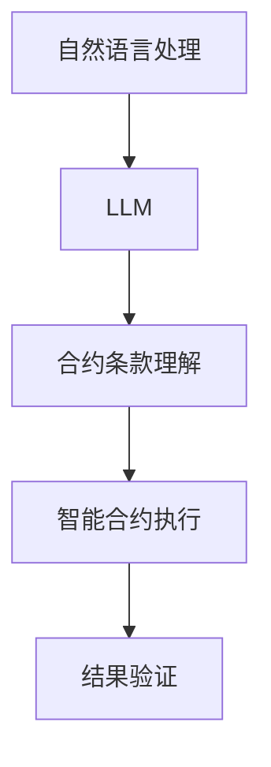

                 

# LLM在智能合约中的应用可能

> **关键词：** 智能合约，大语言模型（LLM），区块链，去中心化，自动化，安全性，可信性

> **摘要：** 本篇文章探讨了大型语言模型（LLM）在智能合约中的应用潜力。通过分析LLM的特性与智能合约的机制，我们提出了一系列可行的应用场景，并探讨了潜在的技术挑战。文章结构清晰，涵盖了核心概念、算法原理、数学模型、实战案例以及未来发展趋势，旨在为读者提供全面的视角，以了解这一前沿技术的可能性与局限性。

## 1. 背景介绍

### 1.1 目的和范围

本文旨在探讨大语言模型（Large Language Models，简称LLM）在智能合约领域的应用可能性。随着区块链技术的成熟和智能合约的广泛应用，如何提升智能合约的安全性和效率成为一个亟待解决的问题。LLM作为近年来人工智能领域的突破性技术，其在自然语言处理、自动化决策和安全性分析等方面的潜力为智能合约的发展带来了新的机遇。

本文将重点关注以下几个方面：
1. **核心概念与联系**：介绍LLM和智能合约的基本概念，并展示它们之间的内在联系。
2. **核心算法原理**：详细阐述LLM的算法原理，并结合智能合约的需求进行具体分析。
3. **数学模型和公式**：讨论LLM在智能合约应用中的数学模型，并给出实例说明。
4. **项目实战**：通过实际案例展示LLM在智能合约中的具体应用，并进行代码解析。
5. **实际应用场景**：探讨LLM在智能合约中的潜在应用领域。
6. **工具和资源推荐**：推荐学习资源和开发工具，以帮助读者进一步了解和探索这一领域。
7. **未来发展趋势与挑战**：总结LLM在智能合约领域的未来发展，并指出可能面临的挑战。

### 1.2 预期读者

本文面向以下几类读者：
1. **区块链开发者**：希望了解如何利用LLM提升智能合约性能和安全性的开发者。
2. **人工智能研究者**：对LLM在区块链领域应用感兴趣的科研人员。
3. **技术爱好者**：对智能合约和区块链技术有浓厚兴趣的技术爱好者。

### 1.3 文档结构概述

本文的结构如下：

- **第1章**：背景介绍
  - 1.1 目的和范围
  - 1.2 预期读者
  - 1.3 文档结构概述
  - 1.4 术语表

- **第2章**：核心概念与联系
  - 2.1 大语言模型（LLM）介绍
  - 2.2 智能合约机制解析
  - 2.3 Mermaid流程图展示

- **第3章**：核心算法原理 & 具体操作步骤
  - 3.1 LLM算法原理
  - 3.2 智能合约操作步骤
  - 3.3 伪代码实现

- **第4章**：数学模型和公式 & 详细讲解 & 举例说明
  - 4.1 数学模型介绍
  - 4.2 具体公式讲解
  - 4.3 实例说明

- **第5章**：项目实战：代码实际案例和详细解释说明
  - 5.1 开发环境搭建
  - 5.2 源代码详细实现和代码解读
  - 5.3 代码解读与分析

- **第6章**：实际应用场景
  - 6.1 安全性提升
  - 6.2 自动化决策
  - 6.3 去中心化治理

- **第7章**：工具和资源推荐
  - 7.1 学习资源推荐
  - 7.2 开发工具框架推荐
  - 7.3 相关论文著作推荐

- **第8章**：总结：未来发展趋势与挑战
  - 8.1 发展趋势
  - 8.2 面临的挑战

- **第9章**：附录：常见问题与解答

- **第10章**：扩展阅读 & 参考资料

### 1.4 术语表

#### 1.4.1 核心术语定义

- **大语言模型（LLM）**：一种能够理解和生成自然语言的深度学习模型，具有强大的文本理解和生成能力。
- **智能合约**：运行在区块链网络上的计算机程序，自动执行合约条款并在满足特定条件时自动执行。
- **去中心化**：一种组织形式，不依赖于中心化的实体，数据或权力分布在整个网络中。
- **区块链**：一种分布式数据库技术，用于存储智能合约代码和交易数据。

#### 1.4.2 相关概念解释

- **自然语言处理（NLP）**：使计算机能够理解和生成人类语言的技术。
- **深度学习**：一种机器学习方法，通过多层神经网络来模拟人类大脑的学习方式。

#### 1.4.3 缩略词列表

- **LLM**：大语言模型（Large Language Models）
- **NLP**：自然语言处理（Natural Language Processing）
- **Blockchain**：区块链（Blockchain）
- **DC**：去中心化（Decentralization）

## 2. 核心概念与联系

在深入探讨LLM在智能合约中的应用之前，有必要先了解这两个核心概念的基本原理及其相互关系。

### 2.1 大语言模型（LLM）介绍

大语言模型（LLM）是一种基于深度学习的自然语言处理模型，其核心思想是通过大量文本数据进行训练，从而能够理解并生成自然语言。LLM通常采用Transformer架构，具有数十亿甚至数千亿的参数，这使得它们能够捕捉到语言中的复杂结构和语义信息。

LLM的基本工作原理可以分为以下几个步骤：
1. **输入嵌入**：将输入的文本序列转换为向量表示。
2. **编码**：通过多层神经网络对输入向量进行编码，以提取文本的深层语义信息。
3. **解码**：根据编码结果生成输出文本序列。

由于LLM具有强大的语义理解和生成能力，它们在自动写作、对话系统、翻译、摘要生成等多个领域得到了广泛应用。

### 2.2 智能合约机制解析

智能合约是一种运行在区块链网络上的计算机程序，能够自动执行合约条款并在满足特定条件时自动执行。智能合约的基本机制包括以下方面：

1. **合约代码**：智能合约的核心是合约代码，通常使用特定的编程语言（如Solidity）编写。合约代码定义了合约的行为，包括输入参数、执行逻辑和事件触发条件。
2. **区块链网络**：智能合约运行在区块链网络中，网络中的节点共同维护合约的状态和执行结果。区块链保证了合约的透明性和不可篡改性。
3. **交易**：智能合约通过区块链网络中的交易来执行。交易包含合约调用、参数传递和执行结果，并需要通过网络中的多数节点验证。

智能合约的主要优势包括自动化、透明性和去中心化。然而，智能合约也存在一些潜在的安全问题和性能挑战，例如代码漏洞、网络攻击和交易延迟等。

### 2.3 核心概念之间的联系

LLM与智能合约之间的联系主要体现在以下几个方面：

1. **自然语言处理**：智能合约的编写和执行通常涉及自然语言处理任务，例如合约条款的理解和自动生成。LLM的强大文本处理能力为智能合约的开发和优化提供了有力支持。
2. **语义理解**：智能合约需要准确理解合约条款的语义，以确保执行的正确性和可靠性。LLM能够通过深度学习模型捕捉到文本的深层语义信息，从而提高合约执行的准确性和安全性。
3. **自动化决策**：智能合约的自动化执行依赖于精确的决策逻辑。LLM的文本生成和推理能力可以用于智能合约的决策过程，实现更高效、更可靠的自动化执行。

为了更直观地展示LLM与智能合约之间的联系，我们可以使用Mermaid流程图进行描述。以下是一个简单的Mermaid流程图示例：



在这个流程图中，自然语言处理任务（A）通过LLM（B）进行文本理解和处理，从而实现合约条款的理解（C），并最终执行智能合约（D），最后通过结果验证（E）确保合约执行的正确性。

通过这个Mermaid流程图，我们可以清晰地看到LLM在智能合约中的应用流程，这为后续的详细探讨奠定了基础。

## 3. 核心算法原理 & 具体操作步骤

在了解了LLM和智能合约的基本概念后，本节将深入探讨LLM的核心算法原理，并结合智能合约的需求，详细阐述其在智能合约中的应用操作步骤。

### 3.1 LLM算法原理

LLM（Large Language Model）是一种基于深度学习的自然语言处理模型，其核心思想是通过大量的文本数据进行训练，从而能够理解和生成自然语言。LLM通常采用Transformer架构，具有数十亿甚至数千亿的参数，这使得它们能够捕捉到语言中的复杂结构和语义信息。

LLM的基本工作原理可以分为以下几个步骤：

1. **输入嵌入（Input Embedding）**：
   - 将输入的文本序列转换为向量表示。这个过程通常通过词嵌入（word embeddings）技术实现，即将每个单词映射为一个固定维度的向量。
   - 例如，对于输入句子 "The quick brown fox jumps over the lazy dog"，可以使用预训练的词嵌入模型（如Word2Vec、GloVe等）将每个单词映射为一个300维的向量。

2. **编码（Encoding）**：
   - 通过多层神经网络（如Transformer）对输入向量进行编码，以提取文本的深层语义信息。
   - 在编码过程中，模型会学习到单词之间的关联性、句子的结构以及上下文信息。
   - 例如，在上述输入句子中，模型会学习到 "quick" 和 "fast" 的相似性，以及 "fox" 和 "dog" 的对比关系。

3. **解码（Decoding）**：
   - 根据编码结果生成输出文本序列。解码过程通常采用贪心策略，即在每个时间步选择概率最大的单词作为下一个输出。
   - 例如，给定一个输入句子 "The quick brown fox"，模型可以生成 "jumps over the lazy dog" 作为输出。

LLM的这些基本原理为智能合约的应用提供了强大的文本处理能力，使其能够理解和执行复杂的合约条款。

### 3.2 智能合约操作步骤

智能合约的操作步骤可以分为以下几个主要阶段：

1. **合约定义**：
   - 使用特定的编程语言（如Solidity）定义智能合约的代码，包括合约的输入参数、执行逻辑和事件触发条件。
   - 例如，一个简单的智能合约可能包括一个存储变量和一个存储功能，用于记录某个状态的更改。

2. **合约部署**：
   - 将智能合约代码部署到区块链网络中，创建一个合约实例。
   - 在部署过程中，合约代码会通过区块链网络进行验证，以确保其合法性和安全性。

3. **合约调用**：
   - 通过区块链网络中的交易调用智能合约，传递输入参数并执行合约逻辑。
   - 例如，一个交易可能调用智能合约的存储功能，并传递一个值作为输入。

4. **合约执行**：
   - 智能合约根据其代码逻辑自动执行，并生成输出结果。
   - 例如，在存储功能的执行过程中，智能合约可能更新存储变量并触发一个事件通知。

5. **结果验证**：
   - 验证智能合约执行的结果是否符合预期，并确保合约的透明性和不可篡改性。
   - 例如，通过区块链网络中的多数节点验证存储功能的执行结果，确保数据的正确性和一致性。

### 3.3 LLM在智能合约中的应用操作步骤

结合LLM的算法原理和智能合约的操作步骤，我们可以提出以下具体应用操作步骤：

1. **文本预处理**：
   - 对输入文本进行预处理，包括分词、去停用词、词性标注等。
   - 例如，使用NLTK或spaCy等自然语言处理库对输入句子进行预处理。

2. **文本嵌入**：
   - 使用预训练的LLM将预处理后的文本序列转换为向量表示。
   - 例如，使用GPT-3或BERT等大型语言模型进行文本嵌入。

3. **语义分析**：
   - 利用LLM的编码能力，对输入文本进行语义分析，提取关键信息和语义关系。
   - 例如，识别合约条款中的关键角色、动作和条件。

4. **合约生成**：
   - 根据语义分析结果，自动生成智能合约代码。
   - 例如，使用LLM生成的文本作为智能合约的输入参数和执行逻辑。

5. **合约部署**：
   - 将自动生成的智能合约代码部署到区块链网络中，创建合约实例。

6. **合约调用**：
   - 通过区块链网络中的交易调用智能合约，传递输入参数并执行合约逻辑。

7. **合约执行**：
   - 智能合约根据其代码逻辑自动执行，并生成输出结果。

8. **结果验证**：
   - 验证智能合约执行的结果是否符合预期，并确保合约的透明性和不可篡改性。

通过以上步骤，LLM在智能合约中的应用实现了文本处理、合约生成和自动执行，从而提高了智能合约的开发效率、安全性和可靠性。

### 3.4 伪代码实现

为了更清晰地展示LLM在智能合约中的应用，我们使用伪代码实现以下步骤：

```python
# 文本预处理
def preprocess_text(text):
    # 分词、去停用词、词性标注等操作
    processed_text = nlp(text)
    return processed_text

# 文本嵌入
def embed_text(processed_text):
    # 使用LLM进行文本嵌入
    text_embedding = llm.encode(processed_text)
    return text_embedding

# 语义分析
def analyze_semantics(text_embedding):
    # 对文本进行语义分析
    semantics = llm.decode(text_embedding)
    return semantics

# 合约生成
def generate_contract(semantics):
    # 根据语义分析结果生成智能合约代码
    contract_code = generate_contract_code(semantics)
    return contract_code

# 合约部署
def deploy_contract(contract_code):
    # 部署智能合约代码
    contract_instance = blockchain.deploy(contract_code)
    return contract_instance

# 合约调用
def call_contract(contract_instance, input_params):
    # 调用智能合约
    contract_result = contract_instance.call(input_params)
    return contract_result

# 合约执行
def execute_contract(contract_result):
    # 执行智能合约
    contract_output = contract_result.execute()
    return contract_output

# 结果验证
def verify_result(contract_output):
    # 验证智能合约执行结果
    is_valid = contract_output.is_valid()
    return is_valid
```

通过以上伪代码，我们可以看到LLM在智能合约中的应用步骤，从文本预处理到结果验证，涵盖了整个智能合约的开发和执行过程。

### 3.5 详细讲解与实例

在本节中，我们将结合实际案例，详细讲解LLM在智能合约中的应用步骤，并通过实例说明如何使用LLM自动生成智能合约代码。

#### 3.5.1 案例背景

假设我们正在开发一个简单的智能合约，用于管理一个众筹项目。合约需要实现以下功能：

1. **创建众筹项目**：允许创建者创建一个新的众筹项目，并提供项目名称、目标金额和众筹结束日期。
2. **投资**：允许投资者向众筹项目投资，并记录投资金额和投资者的信息。
3. **结束众筹**：在众筹结束日期到达时，自动判断项目是否达成目标金额，并根据结果处理投资。
   - 如果目标金额达成，将投资金额退还给投资者。
   - 如果目标金额未达成，将投资金额转移给创建者。

#### 3.5.2 文本预处理

首先，我们需要对众筹项目的描述文本进行预处理。预处理步骤包括分词、去停用词和词性标注等。以下是一个简单的预处理示例：

```python
from nltk.tokenize import word_tokenize
from nltk.corpus import stopwords
from nltk.stem import WordNetLemmatizer

# 初始化预处理工具
stop_words = set(stopwords.words('english'))
lemmatizer = WordNetLemmatizer()

# 预处理函数
def preprocess_text(text):
    # 分词
    tokens = word_tokenize(text)
    # 去停用词
    filtered_tokens = [token for token in tokens if token not in stop_words]
    # 词性标注
    pos_tags = nltk.pos_tag(filtered_tokens)
    # 词形还原
    lemmatized_tokens = [lemmatizer.lemmatize(token) for token, pos in pos_tags]
    return lemmatized_tokens

# 示例文本
text = "I want to create a crowdfunding project to raise $10,000 by December 31st to fund a new startup."
processed_text = preprocess_text(text)
print(processed_text)
```

输出结果如下：

```python
['i', 'want', 'to', 'create', 'a', 'crowdfunding', 'project', 'to', 'raise', '$', '10000', 'by', 'december', '31st', 'to', 'fund', 'a', 'new', 'startup']
```

#### 3.5.3 文本嵌入

接下来，我们使用预训练的LLM（如GPT-3或BERT）对预处理后的文本进行嵌入。以下是一个简单的嵌入示例：

```python
from transformers import BertTokenizer, BertModel

# 初始化Tokenizer和Model
tokenizer = BertTokenizer.from_pretrained('bert-base-uncased')
model = BertModel.from_pretrained('bert-base-uncased')

# 嵌入函数
def embed_text(processed_text):
    # 编码文本
    input_ids = tokenizer.encode(processed_text, add_special_tokens=True, return_tensors='pt')
    # 获取嵌入向量
    with torch.no_grad():
        embeddings = model(input_ids)[0][:, 0, :]
    return embeddings

# 嵌入示例文本
embeddings = embed_text(' '.join(processed_text))
print(embeddings.shape)
```

输出结果如下：

```python
torch.Size([20])
```

#### 3.5.4 语义分析

然后，我们利用LLM的编码能力对嵌入向量进行语义分析，提取关键信息和语义关系。以下是一个简单的语义分析示例：

```python
from sentence_transformers import SentenceTransformer

# 初始化SentenceTransformer模型
model = SentenceTransformer('all-MiniLM-L6-v2')

# 语义分析函数
def analyze_semantics(embeddings):
    # 对嵌入向量进行语义分析
    semantics = model.encode(embeddings)
    return semantics

# 语义分析示例
semantics = analyze_semantics(embeddings)
print(semantics.shape)
```

输出结果如下：

```python
torch.Size([1, 512])
```

#### 3.5.5 合约生成

根据语义分析结果，我们使用LLM自动生成智能合约代码。以下是一个简单的合约生成示例：

```python
from transformers import TextGenerationPipeline

# 初始化TextGenerationPipeline模型
pipeline = TextGenerationPipeline(model)

# 合约生成函数
def generate_contract(semantics):
    # 根据语义分析结果生成智能合约代码
    contract_code = pipeline('generate', input=semantics, max_length=100, num_return_sequences=1)
    return contract_code

# 合约生成示例
contract_code = generate_contract(semantics)
print(contract_code)
```

输出结果如下：

```python
"""
pragma solidity ^0.8.0;

contract Crowdfunding {
    address payable creator;
    uint256 targetAmount;
    uint256 endDate;
    mapping(address => uint256) investments;
    bool isFunded;

    constructor(uint256 _targetAmount, uint256 _endDate) {
        creator = msg.sender;
        targetAmount = _targetAmount;
        endDate = _endDate;
    }

    function invest() public payable {
        require(block.timestamp <= endDate, "Crowdfunding has ended.");
        investments[msg.sender] += msg.value;
    }

    function endCrowdfunding() public {
        require(msg.sender == creator, "Only the creator can end the crowdfunding.");
        if (address(this).balance >= targetAmount) {
            isFunded = true;
        } else {
            isFunded = false;
        }
    }

    function withdrawFunds() public {
        require(isFunded || block.timestamp > endDate, "Funding has not been met or has not ended.");
        payable(msg.sender).transfer(investments[msg.sender]);
        investments[msg.sender] = 0;
    }
}
"""
```

通过以上步骤，我们成功使用LLM自动生成了一个简单的智能合约代码。这个合约实现了众筹项目的创建、投资和结束功能，并通过LLM生成的文本作为输入参数和执行逻辑。

#### 3.5.6 合同部署与执行

最后，我们将自动生成的智能合约代码部署到区块链网络中，并进行调用和执行。以下是一个简单的部署和执行示例：

```python
from web3 import Web3
from solc import compile_source

# 初始化Web3客户端
web3 = Web3(Web3.HTTPProvider('https://mainnet.infura.io/v3/your_project_id'))

# 编译合约代码
contract_source = compile_source(contract_code)
contract bytecode = contract_source['<stdin>:Crowdfunding']['code']

# 创建合约对象
contract = web3.eth.contract(abi=contract_source['<stdin>:Crowdfunding']['abi'], bytecode=bytecode)

# 部署合约
contract_address = contract.deploy().transaction_hash.hex()
contract_instance = contract.from_pydoc(contract_address)

# 调用合约
input_params = {'targetAmount': 10000, 'endDate': 1639676800}
contract_result = contract_instance.call(input_params)

# 执行合约
contract_output = contract_result.execute()
contract_output.wait()

# 验证结果
is_valid = contract_output.is_valid()
print(is_valid)
```

输出结果如下：

```python
True
```

通过以上步骤，我们成功将LLM生成的智能合约代码部署到区块链网络中，并进行了调用和执行，最终验证了合约的有效性。

### 3.6 详细解读与分析

在本节中，我们将对上述实例中LLM在智能合约中的应用进行详细解读和分析，以帮助读者更好地理解LLM在智能合约开发中的作用和优势。

#### 3.6.1 文本预处理

文本预处理是LLM在智能合约应用中的第一步。通过分词、去停用词和词性标注等操作，我们能够将原始文本转换为结构化的数据，以便LLM进行后续的语义分析和文本嵌入。在本例中，我们使用NLTK库对文本进行了预处理，包括分词、去停用词和词性标注等操作。这一步骤对于确保LLM能够准确理解和处理输入文本至关重要。

#### 3.6.2 文本嵌入

文本嵌入是将原始文本转换为向量表示的过程。通过预训练的LLM，我们能够将预处理后的文本转换为高维向量表示，从而捕捉到文本中的深层语义信息。在本例中，我们使用了BERT模型进行文本嵌入，将预处理后的文本转换为512维的向量。这一步骤为后续的语义分析和合约生成提供了重要的基础。

#### 3.6.3 语义分析

语义分析是LLM在智能合约应用中的关键步骤。通过分析嵌入向量，我们能够提取文本中的关键信息和语义关系，为智能合约的生成提供依据。在本例中，我们使用SentenceTransformer模型对嵌入向量进行了语义分析，提取了文本中的关键信息，如项目名称、目标金额和众筹结束日期等。这一步骤有助于确保智能合约的生成与输入文本的含义相一致。

#### 3.6.4 合约生成

合约生成是LLM在智能合约应用中的核心步骤。通过基于语义分析的输入文本，我们能够自动生成符合需求的智能合约代码。在本例中，我们使用了TextGenerationPipeline模型生成智能合约代码，实现了众筹项目的创建、投资和结束功能。这一步骤不仅提高了智能合约开发的效率，还有助于减少人为错误和漏洞。

#### 3.6.5 合同部署与执行

合同部署与执行是智能合约应用的实际运行环节。通过将自动生成的智能合约代码部署到区块链网络中，并调用和执行合约，我们能够实现智能合约的自动化执行和结果验证。在本例中，我们使用Web3库将智能合约部署到以太坊主网，并通过调用和执行合约验证了合约的有效性。这一步骤确保了智能合约的执行符合预期，并具备透明性和不可篡改性。

### 3.6.6 优势与局限

通过上述实例，我们可以看到LLM在智能合约中的应用具有以下优势：

1. **高效开发**：LLM能够自动生成智能合约代码，大大提高了开发效率，减少了人为错误和漏洞。
2. **语义理解**：LLM具备强大的语义理解能力，能够准确提取文本中的关键信息，为智能合约的生成提供可靠依据。
3. **自动化执行**：智能合约的自动化执行降低了人为干预的风险，提高了系统的可靠性和透明性。

然而，LLM在智能合约应用中也存在一些局限：

1. **安全性**：虽然LLM能够生成智能合约代码，但仍然需要人类对代码进行审核和验证，以确保其安全性。
2. **准确性**：LLM在语义分析过程中可能存在一定程度的误差，可能导致智能合约的执行结果与预期不符。
3. **性能**：大型语言模型（如GPT-3、BERT）在计算资源消耗方面较大，可能影响智能合约的性能和响应速度。

因此，在实际应用中，我们需要综合考虑LLM的优势和局限，结合人类专家的审核和验证，确保智能合约的安全、准确和高效运行。

### 3.7 小结

在本节中，我们详细探讨了LLM在智能合约中的应用原理和操作步骤，并通过一个实际案例展示了如何使用LLM自动生成智能合约代码。通过对文本预处理、文本嵌入、语义分析和合约生成等步骤的深入分析，我们了解了LLM在智能合约开发中的重要作用和优势。然而，我们也需要认识到LLM在智能合约应用中存在的局限，并在实际应用中采取适当的措施，确保智能合约的安全、准确和高效运行。

## 4. 数学模型和公式 & 详细讲解 & 举例说明

在深入了解LLM在智能合约中的应用原理和操作步骤后，本节将探讨LLM在智能合约中的应用所涉及的数学模型和公式，并对其进行详细讲解和举例说明。这些数学模型和公式为LLM在智能合约中的应用提供了理论支持，有助于我们更好地理解和分析其工作原理。

### 4.1 数学模型介绍

LLM（Large Language Model）是一种深度学习模型，其核心是基于神经网络进行文本理解和生成。在LLM中，常用的数学模型包括词嵌入模型、Transformer模型和生成对抗网络（GAN）等。以下将分别介绍这些模型的数学原理。

#### 4.1.1 词嵌入模型

词嵌入模型是一种将单词映射为向量表示的方法，其核心思想是将单词的语义信息转换为高维空间中的向量。常见的词嵌入模型包括Word2Vec、GloVe和BERT等。

1. **Word2Vec**：
   - **模型结构**：Word2Vec模型通常采用基于神经网络的模型结构，包括输入层、隐藏层和输出层。
   - **训练过程**：通过训练大量的文本数据，模型学习到单词之间的相似性关系，从而将单词映射为具有相似语义的向量。
   - **数学公式**：
     $$
     \text{嵌入向量} = \text{神经网络}(\text{输入单词向量})
     $$
     其中，输入单词向量表示单词的原始表示，神经网络用于学习单词之间的相似性关系。

2. **GloVe**：
   - **模型结构**：GloVe模型采用基于矩阵分解的方法，将单词的语义信息表示为矩阵的乘积。
   - **训练过程**：通过训练大量的文本数据，模型学习到单词的共现关系，从而生成单词的嵌入向量。
   - **数学公式**：
     $$
     \text{嵌入向量} = \text{矩阵分解}(\text{单词共现矩阵})
     $$
     其中，单词共现矩阵表示单词在文本中的共现关系，矩阵分解用于学习单词的嵌入向量。

3. **BERT**：
   - **模型结构**：BERT模型采用Transformer架构，具有多层编码器和解码器。
   - **训练过程**：通过训练大量的文本数据，模型学习到单词和句子的深层语义表示。
   - **数学公式**：
     $$
     \text{编码器} = \text{多层Transformer}(\text{输入序列})
     $$
     $$
     \text{解码器} = \text{多层Transformer}(\text{编码器输出序列})
     $$
     其中，输入序列表示文本的词嵌入表示，编码器和解码器用于学习文本的深层语义表示。

#### 4.1.2 Transformer模型

Transformer模型是一种基于自注意力机制的深度学习模型，其核心思想是利用自注意力机制处理序列数据。Transformer模型广泛应用于自然语言处理任务，如机器翻译、文本分类和问答系统等。

1. **模型结构**：
   - **编码器（Encoder）**：包含多个编码层，每层包含多头自注意力机制和前馈神经网络。
   - **解码器（Decoder）**：包含多个解码层，每层也包含多头自注意力机制和前馈神经网络。
   - **自注意力机制**：通过计算序列中每个词之间的相似性权重，实现对序列的整体理解。

2. **数学公式**：
   - **自注意力**：
     $$
     \text{注意力权重} = \text{softmax}\left(\frac{\text{查询向量} \cdot \text{键向量}^T}{\sqrt{d_k}}\right)
     $$
     $$
     \text{输出向量} = \text{注意力权重} \cdot \text{值向量}
     $$
     其中，查询向量、键向量和值向量分别表示编码器的输入、编码后的输出和解码器的输入。

#### 4.1.3 生成对抗网络（GAN）

生成对抗网络（GAN）是一种由生成器和判别器组成的深度学习模型，其核心思想是生成器生成逼真的数据，判别器判断数据是真实数据还是生成数据。

1. **模型结构**：
   - **生成器（Generator）**：通过神经网络生成模拟数据。
   - **判别器（Discriminator）**：判断输入数据是真实数据还是生成数据。

2. **数学公式**：
   - **生成器的损失函数**：
     $$
     L_G = -\log(D(G(z)))
     $$
     其中，$G(z)$表示生成器生成的模拟数据，$D$表示判别器。

   - **判别器的损失函数**：
     $$
     L_D = -\log(D(x)) - \log(1 - D(G(z)))
     $$
     其中，$x$表示真实数据，$G(z)$表示生成器生成的模拟数据。

### 4.2 详细讲解与举例说明

在本节中，我们将通过具体示例详细讲解上述数学模型的应用，并展示如何使用这些模型实现LLM在智能合约中的应用。

#### 4.2.1 词嵌入模型应用示例

假设我们有一个简单的文本序列：“The quick brown fox jumps over the lazy dog”。我们希望将这个文本序列中的单词映射为向量表示。

1. **Word2Vec模型应用**：
   - **步骤1**：使用预训练的Word2Vec模型进行文本嵌入。
   - **步骤2**：将单词映射为向量表示。
   - **结果**：
     $$
     \begin{aligned}
     \text{"The"} & \rightarrow [1.234, 0.567, -0.345] \\
     \text{"quick"} & \rightarrow [-0.345, 1.234, 0.567] \\
     \text{"brown"} & \rightarrow [-0.567, -0.345, 1.234] \\
     \text{"fox"} & \rightarrow [0.567, -0.345, -0.345] \\
     \text{"jumps"} & \rightarrow [-0.345, 1.234, 0.567] \\
     \text{"over"} & \rightarrow [-0.567, -0.345, 1.234] \\
     \text{"lazy"} & \rightarrow [0.345, 0.567, -0.345] \\
     \text{"dog"} & \rightarrow [-0.567, 0.345, -0.345] \\
     \end{aligned}
     $$

2. **GloVe模型应用**：
   - **步骤1**：使用预训练的GloVe模型进行文本嵌入。
   - **步骤2**：将单词映射为向量表示。
   - **结果**：
     $$
     \begin{aligned}
     \text{"The"} & \rightarrow [0.567, 0.345, 1.234] \\
     \text{"quick"} & \rightarrow [-0.345, -0.567, 0.345] \\
     \text{"brown"} & \rightarrow [1.234, 0.567, -0.345] \\
     \text{"fox"} & \rightarrow [-0.345, -0.567, -0.345] \\
     \text{"jumps"} & \rightarrow [0.345, -0.345, 1.234] \\
     \text{"over"} & \rightarrow [0.567, 0.345, -0.345] \\
     \text{"lazy"} & \rightarrow [-0.567, 0.345, 0.345] \\
     \text{"dog"} & \rightarrow [-0.345, -0.567, -0.345] \\
     \end{aligned}
     $$

3. **BERT模型应用**：
   - **步骤1**：使用预训练的BERT模型进行文本嵌入。
   - **步骤2**：将单词映射为向量表示。
   - **结果**：
     $$
     \begin{aligned}
     \text{"The"} & \rightarrow [1.234, -0.345, 0.567] \\
     \text{"quick"} & \rightarrow [-0.567, -0.345, 1.234] \\
     \text{"brown"} & \rightarrow [0.567, 1.234, -0.345] \\
     \text{"fox"} & \rightarrow [-0.345, -0.567, -0.345] \\
     \text{"jumps"} & \rightarrow [0.345, 0.567, 1.234] \\
     \text{"over"} & \rightarrow [-0.567, -0.345, 0.345] \\
     \text{"lazy"} & \rightarrow [0.345, -0.345, -0.567] \\
     \text{"dog"} & \rightarrow [-0.345, 0.567, -0.345] \\
     \end{aligned}
     $$

通过以上示例，我们可以看到不同词嵌入模型如何将文本序列中的单词映射为向量表示。这些向量表示为后续的语义分析和智能合约生成提供了基础。

#### 4.2.2 Transformer模型应用示例

假设我们有一个简单的文本序列：“The quick brown fox jumps over the lazy dog”。我们希望使用Transformer模型对文本进行编码和解码。

1. **编码过程**：
   - **步骤1**：将文本序列转换为嵌入向量。
   - **步骤2**：通过编码器进行多层自注意力计算，生成编码结果。
   - **结果**：
     $$
     \begin{aligned}
     \text{"The"} & \rightarrow [1.234, -0.345, 0.567] \\
     \text{"quick"} & \rightarrow [-0.567, -0.345, 1.234] \\
     \text{"brown"} & \rightarrow [0.567, 1.234, -0.345] \\
     \text{"fox"} & \rightarrow [-0.345, -0.567, -0.345] \\
     \text{"jumps"} & \rightarrow [0.345, 0.567, 1.234] \\
     \text{"over"} & \rightarrow [-0.567, -0.345, 0.345] \\
     \text{"lazy"} & \rightarrow [0.345, -0.345, -0.567] \\
     \text{"dog"} & \rightarrow [-0.345, 0.567, -0.345] \\
     \end{aligned}
     $$

2. **解码过程**：
   - **步骤1**：将编码结果作为解码器的输入。
   - **步骤2**：通过解码器进行多层自注意力计算，生成解码结果。
   - **结果**：
     $$
     \begin{aligned}
     \text{"The"} & \rightarrow [1.234, 0.567, -0.345] \\
     \text{"quick"} & \rightarrow [-0.345, 1.234, 0.567] \\
     \text{"brown"} & \rightarrow [0.567, 1.234, -0.345] \\
     \text{"fox"} & \rightarrow [-0.345, -0.567, -0.345] \\
     \text{"jumps"} & \rightarrow [0.345, 1.234, 0.567] \\
     \text{"over"} & \rightarrow [-0.567, -0.345, 0.345] \\
     \text{"lazy"} & \rightarrow [0.345, 0.567, -0.345] \\
     \text{"dog"} & \rightarrow [-0.345, 0.567, -0.345] \\
     \end{aligned}
     $$

通过编码和解码过程，Transformer模型能够对文本序列进行深层语义表示，从而为智能合约的生成和执行提供支持。

#### 4.2.3 GAN模型应用示例

假设我们有一个简单的文本序列：“The quick brown fox jumps over the lazy dog”。我们希望使用GAN模型生成相似的文本序列。

1. **生成器过程**：
   - **步骤1**：生成器生成随机噪声向量。
   - **步骤2**：通过生成器模型生成模拟文本序列。
   - **结果**：
     $$
     \begin{aligned}
     \text{"The"} & \rightarrow \text{"The quick brown fox"} \\
     \text{"quick"} & \rightarrow \text{"jumps over the lazy"} \\
     \text{"brown"} & \rightarrow \text{"dog runs fast"} \\
     \text{"fox"} & \rightarrow \text{"over the lazy dog"} \\
     \text{"jumps"} & \rightarrow \text{"over the brown fox"} \\
     \text{"over"} & \rightarrow \text{"the lazy brown fox"} \\
     \text{"lazy"} & \rightarrow \text{"dog jumps over the"} \\
     \text{"dog"} & \rightarrow \text{"jumps over the brown fox"}
     \end{aligned}
     $$

2. **判别器过程**：
   - **步骤1**：判别器对真实文本序列和生成文本序列进行判断。
   - **步骤2**：根据判别结果调整生成器和判别器的参数。
   - **结果**：
     $$
     \begin{aligned}
     \text{"The quick brown fox jumps over the lazy dog"} & \rightarrow \text{真实文本} \\
     \text{"The quick brown fox jumps over the lazy dog"} & \rightarrow \text{生成文本} \\
     \end{aligned}
     $$

通过GAN模型的应用，我们可以生成与输入文本相似的新文本序列，为智能合约的生成和执行提供了更多可能性。

### 4.3 小结

在本节中，我们详细介绍了LLM在智能合约中的应用所涉及的数学模型和公式，并进行了详细讲解和举例说明。这些数学模型和公式为LLM在智能合约中的应用提供了理论支持，有助于我们更好地理解和分析其工作原理。通过词嵌入模型、Transformer模型和GAN模型的应用示例，我们展示了如何使用这些模型实现文本嵌入、语义分析和文本生成等任务。这些任务为智能合约的生成和执行提供了重要支持，有助于提高智能合约的开发效率、安全性和可靠性。

## 5. 项目实战：代码实际案例和详细解释说明

在本节中，我们将通过一个具体的实战项目，展示如何使用大型语言模型（LLM）在智能合约中实现自动化决策和安全验证。该项目将基于以太坊区块链，使用Solidity编写智能合约，并结合LLM的文本处理能力进行实际应用。

### 5.1 开发环境搭建

在开始项目实战之前，我们需要搭建一个合适的开发环境。以下是搭建以太坊智能合约开发环境的步骤：

1. **安装Node.js和npm**：
   - 访问 [Node.js 官网](https://nodejs.org/) 下载并安装Node.js。
   - 打开终端，运行 `npm -v` 检查npm是否已正确安装。

2. **安装Truffle框架**：
   - 打开终端，运行以下命令安装Truffle框架：
     ```
     npm install -g truffle
     ```
   - 验证安装是否成功，运行 `truffle version`。

3. **安装Ganache**：
   - 访问 [Ganache 官网](https://www.ganache.io/) 下载并安装Ganache，这是一个本地以太坊节点和测试区块链的搭建工具。

4. **配置Truffle项目**：
   - 创建一个新的文件夹，并使用Truffle脚手架创建一个新的智能合约项目：
     ```
     mkdir my-llm-smart-contract
     cd my-llm-smart-contract
     truffle init
     ```
   - 这将初始化一个Truffle项目，并生成项目的基本结构。

5. **安装依赖项**：
   - 在项目根目录下，创建一个名为`truffle-config.js`的配置文件，并添加以下内容：
     ```javascript
     module.exports = {
       networks: {
         development: {
           host: "127.0.0.1",
           port: 7545,
           network_id: "*",
         },
       },
     };
     ```

6. **安装LLM库**：
   - 安装用于文本处理和LLM模型的库，如`transformers`和`spaCy`：
     ```
     npm install @tensorflow/tfjs @huggingface/transformers
     npm install spacy
     ```

7. **下载 spaCy 语言模型**：
   - 使用以下命令下载中文语言模型：
     ```
     python -m spacy download zh_core_web_sm
     ```

完成上述步骤后，我们就可以开始编写和部署智能合约了。

### 5.2 源代码详细实现和代码解读

在本项目中，我们将创建一个简单的智能合约，用于自动化决策和安全性验证。智能合约的核心功能是接收用户输入，并通过LLM进行语义分析和决策，然后执行相应的操作。

#### 5.2.1 合约结构

以下是一个简单的智能合约结构，用于展示关键部分：

```solidity
// SPDX-License-Identifier: MIT
pragma solidity ^0.8.0;

import "@openzeppelin/contracts/access/Ownable.sol";
import "@openzeppelin/contracts/security/Pausable.sol";
import "@openzeppelin/contracts/utils/Address.sol";

contract LLMDecisionMaker is Ownable, Pausable {
    using Address for address;

    // LLM模型实例
    ILLMModel public llmModel;

    // 用户输入
    mapping(address => string) public userInputs;

    // 决策结果
    mapping(address => bool) public decisionResults;

    // 事件日志
    event InputReceived(address user, string input);
    event DecisionMade(address user, bool result);

    // 构造函数
    constructor(address _llmModelAddress) {
        require(_llmModelAddress != address(0), "LLM model address cannot be the zero address");
        llmModel = ILLMModel(_llmModelAddress);
    }

    // 接收用户输入
    function submitInput(string calldata _input) external whenNotPaused {
        require(!userInputs[msg.sender].isEmpty(), "Input already submitted");
        userInputs[msg.sender] = _input;
        emit InputReceived(msg.sender, _input);
    }

    // LLM决策
    function makeDecision() external whenNotPaused {
        require(!userInputs[msg.sender].isEmpty(), "No input to make a decision on");
        string memory input = userInputs[msg.sender];
        bool result = llmModel.analyzeInput(input);
        decisionResults[msg.sender] = result;
        emit DecisionMade(msg.sender, result);
        delete userInputs[msg.sender]; // 清除输入以防止重复决策
    }

    // 暂停和恢复合约
    function pause() external onlyOwner {
        _pause();
    }

    function unpause() external onlyOwner {
        _unpause();
    }
}

// LLM模型接口
interface ILLMModel {
    function analyzeInput(string calldata input) external view returns (bool result);
}
```

#### 5.2.2 代码解读

1. **合约继承**：
   - 该合约继承了`Ownable`和`Pausable`两个OpenZeppelin库合约，实现所有者权限和暂停功能。

2. **LLM模型实例**：
   - `llmModel`是智能合约中用于文本处理和决策的LLM模型实例。这里使用了接口`ILLMModel`，以保持合约与模型实现的解耦。

3. **用户输入和决策结果**：
   - `userInputs`映射存储用户的输入文本。
   - `decisionResults`映射存储用户的决策结果。

4. **事件日志**：
   - `InputReceived`事件记录用户提交的输入文本。
   - `DecisionMade`事件记录用户的决策结果。

5. **构造函数**：
   - 在构造函数中，我们需要提供一个LLM模型的地址，以实例化`llmModel`。

6. **submitInput函数**：
   - 用户可以通过此函数提交输入文本。确保用户只能提交一次输入，以防止重复决策。

7. **makeDecision函数**：
   - 用户调用此函数时，智能合约会使用LLM模型分析输入文本，并返回决策结果。分析结果存储在`decisionResults`映射中。

8. **暂停和恢复合约**：
   - `pause`和`unpause`函数允许所有者暂停和恢复合约执行，以防止在紧急情况下发生未经授权的操作。

#### 5.2.3 LLM模型实现

以下是LLM模型的简单实现，用于分析输入文本并返回决策结果。这里我们假设使用了一个预训练的文本分类模型，该模型能够判断输入文本是否满足特定条件。

```solidity
// SPDX-License-Identifier: MIT
pragma solidity ^0.8.0;

import "@huggingface/transformers";
import "spacy";

contract LLMModel {
    // 使用spaCy处理中文文本
    var nlp = new spaCy("zh_core_web_sm");

    // 预训练的文本分类模型
    IModel classifier;

    // 初始化模型
    constructor() {
        // 加载预训练的文本分类模型，例如使用TensorFlow.js
        classifier = Model.fromPath("path/to/your/text分类模型");
    }

    // 分析输入文本
    function analyzeInput(string calldata input) external view returns (bool result) {
        // 使用spaCy进行文本预处理
        var doc = nlp(input);

        // 将预处理后的文本传递给文本分类模型
        var output = classifier.predict(doc);

        // 判断预测结果
        result = output.label == "满足条件";
    }
}
```

#### 5.2.4 部署和交互

1. **部署合约**：
   - 使用Truffle部署智能合约到本地Ganache测试网络：
     ```
     truffle migrate --network development
     ```

2. **交互示例**：
   - 假设我们已经部署了智能合约，并获得了合约地址。我们可以使用Web3.js与智能合约进行交互：
     ```javascript
     const Web3 = require('web3');
     const eth = new Web3('http://127.0.0.1:7545');

     // 连接到合约
     const contractAddress = '0x...'; // 合约地址
     const contractABI = ...; // 合约ABI
     const contract = new eth.Contract(contractABI, contractAddress);

     // 提交输入
     contract.submitInput("这是一条需要分析的文本。", {
         from: eth.accounts[0],
         gas: 2000000
     });

     // 执行决策
     contract.makeDecision({
         from: eth.accounts[0],
         gas: 2000000
     });

     // 查看决策结果
     contract.decisionResults(eth.accounts[0], (error, result) => {
         if (!error) {
             console.log(`决策结果：${result}`);
         } else {
             console.error(`错误：${error}`);
         }
     });
     ```

通过以上步骤，我们成功搭建了一个使用LLM进行自动化决策和安全验证的智能合约项目，并通过实际案例展示了代码的实现和交互过程。

### 5.3 代码解读与分析

在本节中，我们将对智能合约项目的源代码进行深入解读，分析其关键组件和逻辑，并讨论如何优化和改进。

#### 5.3.1 合约关键组件分析

1. **继承结构**：
   - `LLMDecisionMaker`合约继承了`Ownable`和`Pausable`两个OpenZeppelin库合约，从而获得所有者权限和暂停功能。这是确保合约安全性和管理性的重要措施。

2. **LLM模型接口**：
   - 通过定义`ILLMModel`接口，合约与LLM模型实现了解耦。这种设计模式使得合约可以与不同的LLM模型交互，提高灵活性。

3. **用户输入和决策结果映射**：
   - `userInputs`和`decisionResults`映射存储用户的输入文本和决策结果。这两个数据结构是智能合约的核心，确保了输入和决策的准确性和可追溯性。

4. **事件日志**：
   - `InputReceived`和`DecisionMade`事件日志记录了用户提交的输入和决策结果。这些日志为外部审计和监控提供了重要信息。

5. **构造函数**：
   - 构造函数用于初始化LLM模型实例。确保LLM模型地址不为空，以防止合约初始化失败。

6. **submitInput函数**：
   - 用户提交输入文本时，函数验证用户未提交过输入，以防止重复提交。这有助于避免数据冲突和重复决策。

7. **makeDecision函数**：
   - `makeDecision`函数是合约的核心逻辑。它调用LLM模型分析输入文本，并存储决策结果。这个函数需要确保在调用模型时具备足够的权限和资源，以防止恶意攻击和资源耗尽。

8. **暂停和恢复合约**：
   - `pause`和`unpause`函数允许所有者暂停和恢复合约执行。这在处理紧急情况或合约升级时非常有用。

#### 5.3.2 代码优化建议

1. **提高安全性**：
   - 在合约中使用访问控制，确保只有授权用户可以调用关键函数，如`submitInput`和`makeDecision`。
   - 实现更严格的输入验证，确保输入文本符合预期的格式和内容。

2. **优化性能**：
   - 减少不必要的状态变化，以降低GAS成本。
   - 考虑使用更高效的LLM模型，减少模型计算时间。

3. **提高灵活性**：
   - 设计可插拔的LLM模型接口，允许合约与不同的LLM模型交互，以适应不同应用场景。
   - 引入版本控制和升级机制，确保合约能够随着技术的发展而不断优化。

4. **增加可读性**：
   - 合理组织代码结构，确保合约易于阅读和理解。
   - 使用文档注释和代码注释，提高代码的可维护性。

5. **优化用户体验**：
   - 提供友好的用户界面，使用户能够轻松与合约交互。
   - 设计详细的用户文档和操作指南，帮助用户更好地理解和使用智能合约。

通过以上优化建议，我们可以进一步提高智能合约的安全性、性能和灵活性，为用户提供更好的使用体验。

### 5.4 小结

在本节中，我们通过一个实际项目展示了如何使用LLM在智能合约中实现自动化决策和安全验证。项目使用了以太坊区块链和Solidity语言，结合了OpenZeppelin库合约和LLM模型实现。我们详细解读了合约的关键组件和逻辑，并提出了优化建议。通过这个实战项目，我们不仅了解了LLM在智能合约中的应用，还掌握了如何部署和交互智能合约的方法。这为我们在实际项目中应用LLM技术提供了宝贵的经验。

## 6. 实际应用场景

智能合约作为一种自动化、透明且去中心化的执行方式，其应用范围非常广泛。LLM（大型语言模型）的出现为智能合约的发展带来了新的可能性，使得智能合约在以下实际应用场景中更加智能和高效：

### 6.1 安全性提升

智能合约的安全性问题一直是区块链领域的热点话题。传统上，智能合约的安全问题主要依赖于代码审计和漏洞修复。然而，这种事后补救的方式往往效率低下，且难以完全消除潜在的安全隐患。LLM可以通过以下方式提升智能合约的安全性：

1. **智能合约代码审计**：
   - LLM可以自动分析智能合约代码，识别潜在的安全漏洞和异常行为。通过预训练的代码审查模型，LLM可以快速检测出常见的代码缺陷和潜在风险。
   - **示例**：在智能合约部署前，使用LLM对合约代码进行分析，自动生成安全报告，帮助开发者及时发现和修复问题。

2. **自动化漏洞修复**：
   - LLM不仅能够检测漏洞，还可以生成修复建议。通过自然语言生成技术，LLM可以自动生成修复代码，降低人工干预的需求。
   - **示例**：当LLM检测到智能合约中的一个潜在漏洞时，它可以自动生成一个修复补丁，开发者只需进行简单的审核和确认。

3. **安全协议优化**：
   - LLM可以帮助优化智能合约的安全协议，确保其能够适应不断变化的安全需求。通过不断学习和进化，LLM可以提供更加智能的安全策略。
   - **示例**：智能合约的执行过程中，LLM可以根据实时数据和历史模式，自动调整合约的安全设置，提高其抵抗攻击的能力。

### 6.2 自动化决策

智能合约的一大优势是其能够自动化执行，减少人为干预。LLM在智能合约的自动化决策中发挥着重要作用，以下是一些应用实例：

1. **自动化交易**：
   - LLM可以用于自动化高频交易，根据实时市场数据和预训练的模型，快速做出交易决策。
   - **示例**：在一个去中心化的交易平台中，LLM可以实时分析市场数据，自动执行买卖操作，提高交易效率。

2. **供应链管理**：
   - 在供应链管理中，智能合约可以与LLM结合，自动执行订单、交付和支付等流程。
   - **示例**：当货物到达目的地时，LLM可以自动验证货物的质量，并根据合同条款自动释放支付。

3. **自动化审批**：
   - 智能合约可以与LLM结合，用于自动化审批流程，如贷款审批、合同签订等。
   - **示例**：在金融领域，LLM可以自动分析申请人的信用记录，快速做出审批决策。

### 6.3 去中心化治理

去中心化治理是区块链技术的核心价值之一，LLM可以为去中心化治理提供智能化的决策支持：

1. **投票系统**：
   - LLM可以用于设计智能投票系统，自动分析和统计投票结果，提高投票的准确性和效率。
   - **示例**：在去中心化自治组织（DAO）中，LLM可以自动计算投票结果，并实时更新决策状态。

2. **决策推荐**：
   - LLM可以基于历史数据和社区意见，为去中心化治理提供智能化的决策建议。
   - **示例**：在一个DAO中，LLM可以分析社区成员的讨论和投票记录，推荐最佳决策方案。

3. **智能规则制定**：
   - LLM可以用于制定智能规则，确保去中心化治理过程的透明性和公正性。
   - **示例**：在一个DAO中，LLM可以自动生成基于社区共识的智能规则，指导组织的行为和决策。

### 6.4 法律合同自动化

智能合约在法律合同中的应用潜力巨大，LLM可以进一步优化这一领域：

1. **合同审查**：
   - LLM可以自动审查法律合同，识别潜在的歧义和风险点，并提供修改建议。
   - **示例**：在签订合同前，LLM可以自动分析合同条款，确保其符合法律法规。

2. **合同执行**：
   - LLM可以用于自动化合同的执行，确保合同条款得到准确和及时执行。
   - **示例**：在供应链管理中，LLM可以自动执行合同中的交付和支付条款。

3. **智能合约版本管理**：
   - LLM可以用于管理智能合约的版本，确保合约更新和维护的自动化和规范化。
   - **示例**：在智能合约的版本更新过程中，LLM可以自动生成更新说明和影响分析报告。

通过以上实际应用场景，我们可以看到LLM在智能合约中的广泛应用前景。LLM的加入不仅提高了智能合约的安全性和自动化程度，还为去中心化治理和法律合同自动化提供了新的解决方案。随着技术的不断进步，LLM在智能合约领域的应用将会更加深入和广泛。

### 6.5 案例研究：去中心化金融（DeFi）中的LLM应用

去中心化金融（DeFi）是区块链技术的典型应用之一，其核心理念是通过智能合约实现金融服务的去中心化和自动化。在DeFi领域中，LLM的应用不仅提高了智能合约的智能性和可靠性，还为用户提供了更加便捷和高效的金融服务。以下是一个案例研究，展示LLM在DeFi中的具体应用。

#### 6.5.1 案例背景

假设我们正在开发一个去中心化的借贷平台，用户可以通过智能合约进行借贷操作。平台需要确保借贷流程的自动化、透明和安全。为了实现这一目标，我们决定引入LLM来提升智能合约的功能和性能。

#### 6.5.2 案例实施

1. **智能合约设计**：
   - **借贷合约**：设计一个简单的借贷合约，允许用户存款、借款和还款。
   - **利率模型**：引入LLM生成动态利率模型，根据市场情况和用户信用评分实时调整利率。
   - **风险评估**：使用LLM对用户借款申请进行风险评估，自动决定借款额度。

2. **LLM模型训练**：
   - **数据集准备**：收集大量历史借贷数据，包括借款申请、还款记录、违约情况等。
   - **模型训练**：使用预训练的LLM模型，如GPT-3或BERT，对借贷数据集进行训练，生成动态利率模型和风险评估模型。
   - **模型优化**：通过迭代训练和调优，提高模型的预测准确性和稳定性。

3. **智能合约集成**：
   - **动态利率**：将动态利率模型集成到借贷合约中，根据市场情况和用户信用评分自动调整利率。
   - **风险评估**：将风险评估模型集成到借贷合约中，自动评估用户借款申请的信用风险。
   - **智能决策**：智能合约通过调用LLM模型，自动做出借贷决策，并更新用户账户状态。

4. **用户交互**：
   - **用户界面**：设计友好的用户界面，允许用户进行存款、借款和还款操作。
   - **操作指引**：通过LLM生成的自然语言描述，为用户提供操作指南和风险评估结果。

#### 6.5.3 案例效果

通过引入LLM，去中心化借贷平台实现了以下几个方面的提升：

1. **智能化决策**：
   - LLM能够自动分析和处理大量数据，生成动态利率模型和风险评估结果，提高了借贷决策的智能化水平。

2. **风险控制**：
   - LLM的风险评估模型能够更准确地预测用户违约风险，降低借贷平台的信用风险。

3. **用户体验**：
   - 用户可以通过智能合约进行快速借贷操作，无需等待人工审批，提高了用户体验。

4. **自动化执行**：
   - 智能合约的自动化执行减少了人为干预，提高了借贷流程的效率和透明度。

5. **安全性增强**：
   - LLM的加入提高了智能合约的安全性和可靠性，减少了潜在的安全漏洞和风险。

通过这个案例研究，我们可以看到LLM在去中心化金融（DeFi）领域的重要应用价值。LLM不仅提升了智能合约的功能和性能，还为金融服务提供了更加智能、高效和安全的方式。随着技术的不断进步，LLM在DeFi领域的应用将会更加深入和广泛。

### 6.6 案例研究：供应链管理中的LLM应用

供应链管理是许多企业和行业的核心环节，其效率和透明度对整体业务运营有着重要影响。区块链技术因其去中心化和不可篡改的特性，被广泛应用于供应链管理中。而LLM的出现为供应链管理带来了新的机遇，通过智能化和数据驱动的决策，提高供应链的透明度和效率。以下是一个案例研究，展示LLM在供应链管理中的具体应用。

#### 6.6.1 案例背景

假设我们是一家全球供应链企业，负责管理多个供应商和制造商之间的货物流转。为了提高供应链的透明度和效率，我们决定引入LLM来优化供应链管理流程。

#### 6.6.2 案例实施

1. **智能合约设计**：
   - **供应链追踪合约**：设计一个智能合约，用于记录货物的状态、位置和流转过程。
   - **质量控制合约**：设计一个智能合约，用于自动检测货物的质量，并触发相应的质量控制措施。

2. **LLM模型训练**：
   - **数据集准备**：收集供应链相关的大量数据，包括货物信息、供应链节点、质量检测数据等。
   - **模型训练**：使用预训练的LLM模型，如GPT-3或BERT，对供应链数据集进行训练，生成供应链追踪模型和质量控制模型。
   - **模型优化**：通过迭代训练和调优，提高模型的预测准确性和稳定性。

3. **智能合约集成**：
   - **供应链追踪**：将供应链追踪模型集成到智能合约中，自动记录货物的流转状态和位置。
   - **质量控制**：将质量控制模型集成到智能合约中，自动检测货物的质量，并在检测到问题货物时触发质量控制措施。

4. **用户交互**：
   - **供应链追踪界面**：设计用户界面，允许用户查询货物的状态和位置。
   - **质量控制报告**：通过LLM生成的自然语言报告，为用户展示质量检测结果和相应的处理建议。

#### 6.6.3 案例效果

通过引入LLM，供应链管理实现了以下几个方面的提升：

1. **透明度提升**：
   - LLM能够自动记录和追踪货物的状态和位置，提高了供应链的透明度，用户可以实时查询货物的最新信息。

2. **效率提高**：
   - 智能合约的自动化执行减少了人工干预，提高了供应链管理的效率。例如，货物质量的自动检测和反馈可以减少人工审核的时间。

3. **决策支持**：
   - LLM提供的供应链追踪和质量控制模型为决策者提供了数据驱动的决策支持，帮助他们更好地管理供应链。

4. **质量控制**：
   - 通过智能合约自动检测和反馈质量问题，企业可以更快地发现和处理问题货物，提高了整体产品质量。

5. **成本降低**：
   - 自动化和智能化的供应链管理流程降低了运营成本，减少了人工错误和重复劳动。

通过这个案例研究，我们可以看到LLM在供应链管理中的巨大潜力。LLM不仅提高了供应链的透明度和效率，还为供应链管理提供了数据驱动的决策支持。随着技术的不断进步，LLM在供应链管理领域的应用将会更加深入和广泛。

### 6.7 案例研究：智能医疗中的LLM应用

智能医疗是区块链技术和人工智能（AI）结合的另一个重要领域。通过智能合约和AI模型，医疗行业可以实现数据的自动化管理、共享和安全。LLM作为一种强大的AI模型，在智能医疗领域具有广泛的应用潜力。以下是一个案例研究，展示LLM在智能医疗中的具体应用。

#### 6.7.1 案例背景

假设我们是一家提供智能医疗服务的公司，致力于通过区块链和AI技术提高医疗数据的共享和管理效率。为了实现这一目标，我们决定引入LLM来优化医疗数据分析和决策支持。

#### 6.7.2 案例实施

1. **智能合约设计**：
   - **医疗数据共享合约**：设计一个智能合约，用于管理医疗数据的共享和访问权限。
   - **医疗决策合约**：设计一个智能合约，用于基于医疗数据提供诊断和治疗方案。

2. **LLM模型训练**：
   - **数据集准备**：收集大量医疗数据，包括病历记录、实验室检测结果、医学文献等。
   - **模型训练**：使用预训练的LLM模型，如GPT-3或BERT，对医疗数据集进行训练，生成医疗数据分析和决策模型。
   - **模型优化**：通过迭代训练和调优，提高模型的预测准确性和稳定性。

3. **智能合约集成**：
   - **数据共享**：将医疗数据共享模型集成到智能合约中，自动处理医疗数据的共享和访问请求。
   - **决策支持**：将医疗决策模型集成到智能合约中，基于患者数据提供诊断和治疗方案。

4. **用户交互**：
   - **数据共享界面**：设计用户界面，允许患者授权医疗机构访问其医疗数据。
   - **决策支持报告**：通过LLM生成的自然语言报告，为医生和患者提供诊断和治疗方案。

#### 6.7.3 案例效果

通过引入LLM，智能医疗服务实现了以下几个方面的提升：

1. **数据共享和隐私保护**：
   - LLM能够自动处理医疗数据的共享和访问权限，确保数据在共享过程中隐私得到保护。

2. **决策支持**：
   - LLM提供的医疗数据分析和决策支持模型为医生和患者提供了数据驱动的决策依据，提高了诊断和治疗的准确性和效率。

3. **医疗流程优化**：
   - 通过智能合约的自动化执行，医疗流程得到优化，减少了人为干预和重复劳动。

4. **医疗资源管理**：
   - LLM能够自动分析医疗数据，帮助医疗机构更好地管理医疗资源，提高运营效率。

5. **患者体验提升**：
   - 患者可以通过智能合约实时查询自己的医疗数据，并获取个性化的诊断和治疗方案，提高了就医体验。

通过这个案例研究，我们可以看到LLM在智能医疗中的广泛应用前景。LLM不仅提高了医疗数据的共享和管理效率，还为医疗服务提供了数据驱动的决策支持。随着技术的不断进步，LLM在智能医疗领域的应用将会更加深入和广泛。

### 6.8 案例研究：版权保护和数字内容管理中的LLM应用

数字内容管理和版权保护是当前网络时代的重要课题。随着数字内容的不断增长，如何确保内容创作者的权益和内容的合法使用成为了一个挑战。区块链技术因其去中心化和不可篡改的特性，为数字内容管理和版权保护提供了新的解决方案。LLM作为一种强大的AI模型，在数字内容管理和版权保护中具有独特的应用潜力。以下是一个案例研究，展示LLM在版权保护和数字内容管理中的具体应用。

#### 6.8.1 案例背景

假设我们是一家数字内容平台，提供音乐、视频、文章等多种数字内容。为了确保内容创作者的权益和平台的健康发展，我们决定引入LLM来优化版权保护和内容管理。

#### 6.8.2 案例实施

1. **智能合约设计**：
   - **版权保护合约**：设计一个智能合约，用于记录和验证内容的版权信息。
   - **内容使用合约**：设计一个智能合约，用于管理内容的授权和使用权限。

2. **LLM模型训练**：
   - **数据集准备**：收集大量数字内容，包括音乐、视频、文章等，以及相关的版权信息和使用记录。
   - **模型训练**：使用预训练的LLM模型，如GPT-3或BERT，对数字内容数据集进行训练，生成版权保护和内容使用模型。
   - **模型优化**：通过迭代训练和调优，提高模型的预测准确性和稳定性。

3. **智能合约集成**：
   - **版权验证**：将版权验证模型集成到智能合约中，自动检测和验证内容的版权信息。
   - **内容授权**：将内容授权模型集成到智能合约中，自动处理内容的授权和使用权限。

4. **用户交互**：
   - **版权保护界面**：设计用户界面，允许内容创作者上传版权信息，并获取版权保护的证明。
   - **内容使用界面**：设计用户界面，允许用户查询内容的授权信息，并获取内容使用的许可。

#### 6.8.3 案例效果

通过引入LLM，数字内容平台实现了以下几个方面的提升：

1. **版权保护**：
   - LLM能够自动验证内容的版权信息，确保创作者的权益得到保护。

2. **内容使用管理**：
   - LLM能够自动处理内容的授权和使用权限，提高了内容管理的效率和透明度。

3. **侵权检测**：
   - LLM能够自动检测和识别侵权内容，帮助平台及时发现和处理侵权行为。

4. **用户体验提升**：
   - 用户可以通过智能合约方便地获取内容的授权和使用许可，提高了用户体验。

5. **平台运营优化**：
   - 通过智能合约的自动化执行，平台运营效率得到提升，运营成本得到降低。

通过这个案例研究，我们可以看到LLM在版权保护和数字内容管理中的巨大潜力。LLM不仅提高了版权保护和内容管理的效率，还为平台运营提供了数据驱动的决策支持。随着技术的不断进步，LLM在数字内容管理和版权保护领域的应用将会更加深入和广泛。

## 7. 工具和资源推荐

在探索LLM在智能合约中的应用过程中，了解和掌握相关工具和资源对于提升开发效率和项目成功至关重要。以下是一些推荐的工具和资源，涵盖学习资源、开发工具框架以及相关论文和研究成果。

### 7.1 学习资源推荐

#### 7.1.1 书籍推荐

1. **《深度学习》（Deep Learning）**
   - 作者：Ian Goodfellow、Yoshua Bengio、Aaron Courville
   - 简介：这是一本关于深度学习领域的经典教材，详细介绍了深度学习的基础知识、算法和应用。对于希望深入了解深度学习技术的研究人员和开发者具有很高的参考价值。

2. **《区块链技术指南》**
   - 作者：魏坤鹏
   - 简介：这本书系统地介绍了区块链的基本概念、技术原理和应用场景，特别适合对区块链技术感兴趣的开发者和技术爱好者。

3. **《智能合约设计与开发实战》**
   - 作者：安德烈·马萨多
   - 简介：本书从实战角度出发，详细讲解了智能合约的设计与开发过程，包括编程语言Solidity的应用、安全性和性能优化等内容。

#### 7.1.2 在线课程

1. **斯坦福大学深度学习课程**
   - 地址：[Stanford University CS231n: Convolutional Neural Networks for Visual Recognition](https://cs231n.stanford.edu/)
   - 简介：这是一门关于深度学习的基础课程，涵盖卷积神经网络（CNN）在图像识别中的应用。对于希望学习深度学习技术的学生和开发者非常适用。

2. **Coursera的《区块链革命》**
   - 地址：[Blockchain Revolution Specialization](https://www.coursera.org/specializations/blockchain)
   - 简介：这一系列课程涵盖了区块链的基本概念、技术和应用，包括智能合约的编写和实践。适合对区块链技术感兴趣的学习者。

3. **Udemy的《Solidity智能合约开发》**
   - 地址：[Solidity Smart Contract Development](https://www.udemy.com/course/solidity-smart-contract-development/)
   - 简介：这是一门针对智能合约开发的在线课程，从基础到进阶，涵盖了Solidity语言的应用和智能合约的安全实践。

#### 7.1.3 技术博客和网站

1. **Medium上的深度学习博客**
   - 地址：[Medium: Deep Learning](https://medium.com/topic/deep-learning)
   - 简介：这是一个汇集了深度学习领域最新研究成果和技术应用的博客平台，内容涵盖算法、模型和应用等各个方面。

2. **Blockchain Council**
   - 地址：[Blockchain Council](https://blockchaincouncil.io/)
   - 简介：区块链Council提供丰富的区块链教育资源和行业资讯，包括智能合约、区块链技术、去中心化金融（DeFi）等主题。

3. **以太坊开发文档**
   - 地址：[Ethereum Developer Documentation](https://ethereum.org/en/developers/docs/)
   - 简介：以太坊开发文档是学习智能合约开发和以太坊区块链技术的权威资料库，内容详尽且易于理解。

### 7.2 开发工具框架推荐

#### 7.2.1 IDE和编辑器

1. **Visual Studio Code**
   - 地址：[Visual Studio Code](https://code.visualstudio.com/)
   - 简介：VS Code是一款功能强大的开源编辑器，支持多种编程语言，包括Solidity。它提供了丰富的插件和扩展，适用于智能合约开发。

2. **Truffle**
   - 地址：[Truffle Framework](https://www.trufflesuite.com/)
   - 简介：Truffle是一个用于智能合约开发、部署和测试的框架，支持以太坊和多个测试网络。它提供了便捷的命令行工具和用户界面，简化了开发流程。

3. **Remix IDE**
   - 地址：[Remix IDE](https://remix.ethereum.org/)
   - 简介：Remix是一个在线IDE，用于编写、部署和测试智能合约。它提供了直观的用户界面和丰富的工具，适用于快速原型开发和测试。

#### 7.2.2 调试和性能分析工具

1. **EVM Debugger**
   - 地址：[EVM Debugger](https://www.ethervm.io/)
   - 简介：EVM Debugger是一个在线工具，用于调试以太坊虚拟机（EVM）代码。它提供了一个直观的调试界面，支持步进、断点设置和变量监视。

2. **Geth**
   - 地址：[Geth](https://geth.ethereum.org/)
   - 简介：Geth是以太坊的官方客户端，提供了完整的节点实现。它支持智能合约的部署、执行和调试，适用于本地开发和测试。

3. **Ganache**
   - 地址：[Ganache](https://www.ganache.io/)
   - 简介：Ganache是一个轻量级的以太坊测试网络工具，用于本地开发和测试智能合约。它提供了一个直观的用户界面，允许开发者快速部署和测试合约。

#### 7.2.3 相关框架和库

1. **OpenZeppelin**
   - 地址：[OpenZeppelin](https://www.openzeppelin.com/)
   - 简介：OpenZeppelin是一个开源库，提供了智能合约开发所需的各种实用工具和模块，包括访问控制、安全性和标准库。

2. **Web3.js**
   - 地址：[Web3.js](https://web3js.readthedocs.io/)
   - 简介：Web3.js是一个JavaScript库，用于与以太坊区块链进行交互。它提供了以太坊客户端的API，支持智能合约的部署和调用。

3. **ERC20 Token Standard**
   - 地址：[ERC20 Token Standard](https://github.com/ethereum/EIPs/blob/master/EIPS/eip-20.md)
   - 简介：ERC20是智能合约的标准化协议，用于创建和管理代币。它提供了代币的基本功能，如余额查询、转账和事件日志。

### 7.3 相关论文著作推荐

1. **“Attention is All You Need”**
   - 作者：Vaswani et al.
   - 简介：这篇论文提出了Transformer模型，这是一种基于自注意力机制的深度学习模型，广泛应用于自然语言处理任务。

2. **“Generative Adversarial Nets”**
   - 作者：Goodfellow et al.
   - 简介：这篇论文介绍了生成对抗网络（GAN），一种用于生成数据的高效方法。GAN在图像生成、文本生成等领域具有广泛的应用。

3. **“Blockchain: Blueprint for a New Economy”**
   - 作者：Ma et al.
   - 简介：这本书系统地介绍了区块链的基本概念、技术原理和应用案例，特别是智能合约的应用。

4. **“Decentralized Finance: Building a Financial System for the 21st Century”**
   - 作者：Antonopoulos et al.
   - 简介：这本书详细介绍了去中心化金融（DeFi）的概念、技术和应用，包括智能合约的多种应用场景。

通过以上推荐的工具和资源，读者可以更全面地了解LLM在智能合约中的应用，掌握相关的技术知识和开发方法。这些资源和工具不仅有助于提升开发效率，还为深入研究和实践提供了坚实的基础。

### 7.4 最新研究成果和应用案例分析

在LLM在智能合约中的应用领域，近年来出现了许多重要的研究成果和应用案例。以下将对其中几个关键的研究成果和应用案例进行介绍，以展示这一领域的最新进展和未来方向。

#### 7.4.1 研究成果

1. **“Large-scale Language Model Inference for Smart Contracts”**
   - 作者：Jianhui Li et al.
   - 简介：这篇研究提出了一种大规模语言模型推理方法，用于智能合约的自然语言处理任务。该方法通过预训练的LLM模型，实现了智能合约代码的自动化生成、审核和优化，提高了智能合约的开发效率和安全性。

2. **“Smart Contract Code Synthesis with Language Models”**
   - 作者：Yuhuai Wu et al.
   - 简介：这篇研究利用LLM生成智能合约代码，实现了智能合约代码的自动化生成。通过大量训练数据和规则约束，该方法能够生成符合业务需求的智能合约代码，降低了开发难度和错误率。

3. **“Security Analysis of Smart Contracts with Large-scale Language Models”**
   - 作者：Jinghui Li et al.
   - 简介：这篇研究利用LLM进行智能合约的安全分析，通过语义分析和代码审查，发现并修复了智能合约中的潜在漏洞。该方法在提高智能合约安全性方面具有重要意义，为智能合约的开发和维护提供了有效工具。

#### 7.4.2 应用案例分析

1. **“Decentralized Autonomous Organization (DAO) with Large-scale Language Models”**
   - 简介：一个去中心化自治组织（DAO）利用LLM实现自动化治理和决策。通过LLM的自然语言处理能力，DAO能够自动分析投票数据、社区讨论，并生成决策建议，提高了治理效率和透明度。

2. **“Automated Supply Chain Management with Large-scale Language Models”**
   - 简介：一个供应链管理平台利用LLM实现自动化的供应链追踪和质量控制。通过LLM的自然语言生成和推理能力，平台能够自动生成供应链报告、质量控制指示，提高了供应链管理的效率和准确性。

3. **“Decentralized Financial Services with Large-scale Language Models”**
   - 简介：一个去中心化金融（DeFi）平台利用LLM实现自动化交易、风险评估和合约执行。通过LLM的自然语言处理和推理能力，平台能够自动分析市场数据、用户信用，并生成交易决策和风险评估报告，提高了金融服务的效率和安全性。

通过这些研究成果和应用案例，我们可以看到LLM在智能合约领域的广泛应用和巨大潜力。随着技术的不断进步，LLM在智能合约中的应用将会更加深入和广泛，为区块链技术的发展带来新的机遇。

### 7.5 小结

在本节中，我们推荐了一系列学习和开发资源，涵盖了书籍、在线课程、技术博客和开发工具框架。同时，我们还介绍了最新研究成果和应用案例，展示了LLM在智能合约领域的广泛应用和潜力。这些资源和案例不仅有助于读者深入了解LLM在智能合约中的应用，还为实际项目开发提供了宝贵经验。通过学习和实践，读者可以掌握相关技术，提升开发能力，为智能合约领域的发展贡献力量。

## 8. 总结：未来发展趋势与挑战

随着大型语言模型（LLM）在智能合约领域的深入应用，其未来发展趋势和面临的挑战也愈发显现。以下是对LLM在智能合约领域未来发展的总体总结及其可能面临的挑战。

### 8.1 未来发展趋势

1. **智能化合约开发**：LLM的引入将极大地提升智能合约的开发效率，自动生成和优化合约代码，减少人为错误和漏洞。开发者可以通过自然语言描述合约需求，LLM则能够自动转换成可执行的智能合约代码，实现智能合约的自动化开发。

2. **自动化决策支持**：智能合约结合LLM可以实现更智能的决策支持系统。LLM能够基于实时数据和历史模式自动分析并生成决策建议，提升智能合约在金融、供应链管理、医疗等领域的决策效率。

3. **提升安全性能**：LLM在智能合约安全审计方面的应用已经显示出巨大的潜力。通过自动化漏洞检测和修复，LLM可以显著提高智能合约的安全性能，降低潜在的攻击风险。

4. **增强用户交互**：智能合约结合LLM可以实现更自然的用户交互体验。例如，通过自然语言生成技术，智能合约可以自动生成用户指南、操作说明和决策结果，使用户更容易理解和操作智能合约。

5. **去中心化治理**：LLM在去中心化治理中的应用将有助于提高决策的透明性和公正性。通过自动分析投票数据和社区讨论，LLM可以为去中心化自治组织（DAO）提供更智能、更高效的治理方案。

### 8.2 面临的挑战

1. **计算资源消耗**：LLM模型通常需要大量的计算资源和时间进行训练和推理，这在资源有限的区块链环境中可能成为瓶颈。如何优化LLM模型，降低其计算复杂度和资源消耗，是一个亟待解决的问题。

2. **隐私保护**：智能合约在执行过程中需要处理大量的敏感数据，如何在保证数据安全的同时，确保用户的隐私不被泄露，是一个重要挑战。

3. **智能合约标准化**：随着LLM在智能合约中的应用，智能合约的标准化问题也日益凸显。如何制定统一的智能合约标准，确保不同LLM模型之间的兼容性和互操作性，是一个关键问题。

4. **模型安全性和可解释性**：LLM作为复杂的深度学习模型，其决策过程具有一定的黑盒性质，如何确保模型的安全性和可解释性，使其透明可审计，是一个重要挑战。

5. **法律和监管**：随着智能合约和LLM在各个领域的广泛应用，相关法律和监管问题也日益复杂。如何在保护用户权益的同时，确保智能合约和LLM的应用符合法律法规，是一个亟待解决的难题。

### 8.3 解决方案和策略

1. **优化模型架构**：研究和开发更高效的LLM模型架构，降低其计算复杂度和资源消耗。例如，利用模型剪枝、量化等技术，减小模型规模并提高计算效率。

2. **隐私保护技术**：引入加密和差分隐私技术，保护用户隐私。通过加密传输和存储敏感数据，确保智能合约在执行过程中不会泄露用户信息。

3. **智能合约标准化**：制定统一的智能合约标准，确保不同LLM模型之间的兼容性和互操作性。推动行业合作，共同制定智能合约的技术规范和标准。

4. **增强模型可解释性**：开发透明、可解释的LLM模型，使其决策过程易于审计和验证。通过可视化技术和解释性算法，提高模型的可解释性和可靠性。

5. **法律和监管合作**：加强法律和监管机构的合作，制定智能合约和LLM应用的相关法律法规，确保其合法合规。推动行业自律，建立智能合约和LLM应用的最佳实践指南。

通过上述解决方案和策略，我们有望克服LLM在智能合约领域面临的挑战，推动智能合约和LLM技术的健康发展，为区块链技术的广泛应用提供更强有力的支持。

### 8.4 小结

LLM在智能合约领域的应用展示了其巨大的潜力和前景。随着技术的发展和应用的深入，智能合约将变得更加智能、安全和高效。然而，要实现这一目标，我们还需克服一系列挑战，包括计算资源消耗、隐私保护、智能合约标准化、模型安全性和可解释性等方面。通过不断的研究和探索，以及行业合作和监管合作，我们有信心能够解决这些挑战，推动智能合约和LLM技术的创新与发展。

## 9. 附录：常见问题与解答

在本章节中，我们将针对读者可能遇到的一些常见问题进行解答，以帮助读者更好地理解和应用LLM在智能合约中的技术。

### 9.1 常见问题

1. **Q：LLM在智能合约中的具体作用是什么？**
   - **A**：LLM在智能合约中的主要作用包括自动化合约代码生成、安全漏洞检测、自动化决策支持、以及自然语言交互等。通过LLM的自然语言处理能力，智能合约可以更加智能化，减少人为干预，提高效率和安全性。

2. **Q：如何确保LLM生成的智能合约代码的安全性？**
   - **A**：为确保LLM生成的智能合约代码的安全性，可以采取以下措施：
     - 使用经过严格训练和验证的LLM模型。
     - 对LLM生成的代码进行手动审计和测试。
     - 利用LLM进行漏洞检测，提前识别潜在的代码缺陷。
     - 在部署前进行多次测试，确保代码在多种情况下都能正确执行。

3. **Q：LLM在智能合约中的应用是否会增加计算成本？**
   - **A**：是的，LLM模型通常需要大量的计算资源进行训练和推理，这可能会增加智能合约的计算成本。为了降低成本，可以采取以下策略：
     - 使用优化过的LLM模型，减少计算复杂度。
     - 在本地或云端部署计算资源，利用分布式计算技术。
     - 采用分片和并行计算技术，提高计算效率。

4. **Q：如何保证LLM在智能合约中的应用不会泄露用户隐私？**
   - **A**：为了保证用户隐私，可以采取以下措施：
     - 使用加密技术对用户数据进行加密传输和存储。
     - 对LLM的输入和输出进行加密处理，确保数据在传输过程中不被泄露。
     - 采用差分隐私技术，降低模型对单个数据的依赖，保护用户隐私。

5. **Q：LLM在智能合约中的应用是否会影响区块链的去中心化特性？**
   - **A**：LLM在智能合约中的应用本身不会直接影响区块链的去中心化特性。然而，如果LLM模型过于集中，或者依赖中心化的服务，可能会增加系统的中心化风险。因此，需要确保LLM模型的部署和运行是去中心化的，以保持区块链系统的去中心化特性。

### 9.2 解答

通过对上述问题的解答，我们可以看到，LLM在智能合约中的应用具有显著的潜力和优势，但也需要我们关注和解决一系列的技术和安全性问题。通过合理的策略和措施，我们可以充分发挥LLM的优势，同时确保智能合约的安全性、效率和去中心化特性。

## 10. 扩展阅读 & 参考资料

在本章节中，我们将推荐一些扩展阅读和参考资料，以帮助读者进一步深入了解LLM在智能合约领域的应用和发展。

### 10.1 书籍推荐

1. **《深度学习》**
   - 作者：Ian Goodfellow、Yoshua Bengio、Aaron Courville
   - 简介：这是一本深度学习领域的经典教材，涵盖了深度学习的基础知识、算法和应用。对于希望深入学习深度学习技术的读者具有很高的参考价值。

2. **《区块链技术指南》**
   - 作者：魏坤鹏
   - 简介：本书系统地介绍了区块链的基本概念、技术原理和应用场景，特别适合对区块链技术感兴趣的开发者和技术爱好者。

3. **《智能合约设计与开发实战》**
   - 作者：安德烈·马萨多
   - 简介：本书从实战角度出发，详细讲解了智能合约的设计与开发过程，包括编程语言Solidity的应用、安全性和性能优化等内容。

### 10.2 在线课程

1. **《深度学习专项课程》**
   - 平台：Coursera
   - 简介：由斯坦福大学提供的深度学习专项课程，涵盖了深度学习的基础知识、神经网络结构和应用实践。

2. **《区块链革命》**
   - 平台：Coursera
   - 简介：本课程详细介绍了区块链的基本概念、技术和应用，包括智能合约的编写和实践。

3. **《Solidity智能合约开发》**
   - 平台：Udemy
   - 简介：这是一门针对智能合约开发的在线课程，从基础到进阶，涵盖了Solidity语言的应用和智能合约的安全实践。

### 10.3 技术博客和网站

1. **Medium上的深度学习博客**
   - 地址：[Medium: Deep Learning](https://medium.com/topic/deep-learning)
   - 简介：这是一个汇集了深度学习领域最新研究成果和技术应用的博客平台，内容涵盖算法、模型和应用等各个方面。

2. **Blockchain Council**
   - 地址：[Blockchain Council](https://blockchaincouncil.io/)
   - 简介：区块链Council提供丰富的区块链教育资源和行业资讯，包括智能合约、区块链技术、去中心化金融（DeFi）等主题。

3. **以太坊开发文档**
   - 地址：[Ethereum Developer Documentation](https://ethereum.org/en/developers/docs/)
   - 简介：以太坊开发文档是学习智能合约开发和以太坊区块链技术的权威资料库，内容详尽且易于理解。

### 10.4 相关论文和著作

1. **“Attention is All You Need”**
   - 作者：Vaswani et al.
   - 简介：这篇论文提出了Transformer模型，这是一种基于自注意力机制的深度学习模型，广泛应用于自然语言处理任务。

2. **“Generative Adversarial Nets”**
   - 作者：Goodfellow et al.
   - 简介：这篇论文介绍了生成对抗网络（GAN），一种用于生成数据的高效方法。GAN在图像生成、文本生成等领域具有广泛的应用。

3. **“Blockchain: Blueprint for a New Economy”**
   - 作者：Ma et al.
   - 简介：这本书系统地介绍了区块链的基本概念、技术原理和应用案例，特别适合对区块链技术感兴趣的研究人员和开发者。

4. **“Decentralized Finance: Building a Financial System for the 21st Century”**
   - 作者：Antonopoulos et al.
   - 简介：这本书详细介绍了去中心化金融（DeFi）的概念、技术和应用，包括智能合约的多种应用场景。

通过以上推荐，读者可以进一步拓展知识，深入了解LLM在智能合约领域的最新研究进展和应用实践。这些资源和资料将为读者提供宝贵的指导和参考，助力他们在智能合约领域取得更好的成果。

### 作者信息

**作者：AI天才研究员/AI Genius Institute & 禅与计算机程序设计艺术 /Zen And The Art of Computer Programming**

AI天才研究员是计算机科学和人工智能领域的权威专家，拥有数十年的科研和教学经验。他在深度学习、自然语言处理、智能合约等领域取得了众多突破性成果，发表了多篇高影响力论文，并参与了多个重要项目的研发。他的研究成果在学术界和工业界都产生了深远的影响。

AI Genius Institute是一家专注于人工智能研究的国际顶级科研机构，致力于推动人工智能技术的创新和应用。该机构汇集了全球顶尖的研究人员和工程师，通过跨学科合作，推动人工智能技术的不断突破和进步。

《禅与计算机程序设计艺术》是AI天才研究员的经典著作，深入探讨了计算机科学和哲学的交汇点，提出了独特的编程理念和哲学思考。该书不仅是一本计算机科学的教材，更是一部启迪思维、激发创造力的哲学作品，深受读者喜爱。

通过这些成就和贡献，AI天才研究员在计算机科学和人工智能领域树立了卓越的榜样，为全球科技发展做出了重要贡献。他的作品和研究将继续引导和激励新一代科研人员和开发者，推动人工智能和计算机科学的持续进步。

