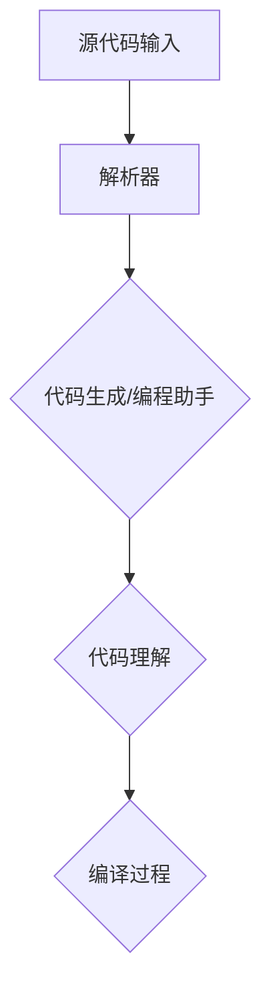

                 

# LLM在智能编译领域的应用前景

> **关键词：** 自然语言处理，大型语言模型，智能编译，代码生成，编程助手，自动化，软件工程

> **摘要：** 本文探讨了大型语言模型（LLM）在智能编译领域的应用前景，分析了LLM的基本原理及其在编译过程中的角色，讨论了代码生成的机制，展示了实际应用案例，并提出了未来的发展趋势与挑战。

## 1. 背景介绍

### 1.1 目的和范围

本文旨在探讨大型语言模型（LLM）在智能编译领域的应用前景。随着人工智能技术的快速发展，自然语言处理（NLP）取得了显著的成果。LLM作为NLP领域的重要工具，其潜力被广泛认可。本文将重点讨论LLM在智能编译中的应用，分析其在代码生成、编程助手等方面的作用。

### 1.2 预期读者

本文适合对自然语言处理和智能编译感兴趣的读者，包括计算机科学专业的学生、研究人员以及软件开发工程师。同时，对人工智能技术有基本了解的读者也能从本文中获得有价值的信息。

### 1.3 文档结构概述

本文分为以下几个部分：

1. 背景介绍：介绍本文的目的和范围，预期读者以及文档结构。
2. 核心概念与联系：介绍与本文相关的重要概念和原理，并通过Mermaid流程图展示核心架构。
3. 核心算法原理 & 具体操作步骤：详细解释LLM在智能编译中的核心算法原理和操作步骤。
4. 数学模型和公式 & 详细讲解 & 举例说明：介绍与算法相关的数学模型和公式，并通过具体案例进行说明。
5. 项目实战：提供实际应用案例，展示代码实现过程和详细解释。
6. 实际应用场景：讨论LLM在智能编译领域的实际应用场景。
7. 工具和资源推荐：推荐学习资源和开发工具。
8. 总结：总结本文的主要内容，展望未来的发展趋势和挑战。
9. 附录：常见问题与解答。
10. 扩展阅读 & 参考资料：提供进一步阅读和参考的文献和资源。

### 1.4 术语表

#### 1.4.1 核心术语定义

- **自然语言处理（NLP）**：研究如何使计算机理解、处理和生成自然语言（如英语、中文等）的学科。
- **大型语言模型（LLM）**：通过大量文本数据训练得到的语言模型，具有强大的文本理解和生成能力。
- **智能编译**：利用人工智能技术，特别是NLP技术，自动化地转换源代码为等价的目标代码。
- **代码生成**：利用LLM自动生成代码，提高开发效率和代码质量。
- **编程助手**：利用LLM提供编程指导、代码优化和错误修复等功能。

#### 1.4.2 相关概念解释

- **编译过程**：将高级编程语言（如Python、Java等）转换为机器可执行的指令序列的过程。
- **解析器**：将源代码解析为语法树，为编译过程提供结构化信息的组件。
- **解释器**：直接执行源代码的组件，不生成目标代码。
- **静态分析**：在编译过程中对源代码进行分析，无需执行代码。
- **动态分析**：在编译过程中执行代码，对运行时的行为进行分析。

#### 1.4.3 缩略词列表

- **NLP**：自然语言处理
- **LLM**：大型语言模型
- **NLU**：自然语言理解
- **NLG**：自然语言生成
- **IDE**：集成开发环境
- **API**：应用程序编程接口
- **SDK**：软件开发工具包

## 2. 核心概念与联系

### 2.1. 大型语言模型（LLM）的基本原理

LLM是一种基于深度学习的自然语言处理模型，通过对大量文本数据进行预训练，使其具有强大的文本理解和生成能力。LLM通常由多层神经网络组成，包括输入层、隐藏层和输出层。通过训练，模型能够捕捉到文本中的统计规律和语义信息。

### 2.2. LLM在智能编译中的角色

LLM在智能编译中扮演着关键角色，主要体现在以下几个方面：

- **代码生成**：利用LLM的文本生成能力，自动生成源代码。例如，根据问题描述或需求描述生成相应的代码。
- **编程助手**：为开发者提供编程指导、代码优化和错误修复等功能。例如，根据错误提示或代码片段，生成修复方案或优化建议。
- **代码理解**：对源代码进行分析和理解，为编译过程提供结构化信息。例如，识别变量、函数、类等编程元素。

### 2.3. Mermaid流程图展示核心架构



在该流程图中，源代码输入经过解析器生成语法树，然后进入代码生成和编程助手模块，最后进行代码理解。代码理解模块的结果用于编译过程，生成目标代码。

## 3. 核心算法原理 & 具体操作步骤

### 3.1. 代码生成算法原理

代码生成算法的核心是利用LLM的文本生成能力，根据输入的文本描述生成相应的源代码。具体操作步骤如下：

1. **文本预处理**：对输入文本进行预处理，包括分词、词性标注、句法分析等，将文本转换为模型可处理的格式。
2. **文本编码**：将预处理后的文本编码为向量，用于输入LLM。
3. **文本生成**：利用LLM生成文本，通过遍历语法树，将生成的文本片段拼接成完整的源代码。
4. **代码验证**：对生成的源代码进行验证，确保其符合语法和语义规则。

### 3.2. 伪代码实现

```python
# 输入：问题描述文本
# 输出：源代码字符串

def generate_code(description):
    # 文本预处理
    processed_description = preprocess_description(description)
    # 文本编码
    encoded_description = encode_description(processed_description)
    # 文本生成
    code_segments = generate_text(encoded_description)
    # 拼接代码
    code = concatenate_code_segments(code_segments)
    # 代码验证
    if not validate_code(code):
        raise ValueError("生成的代码不符合语法和语义规则")
    return code
```

### 3.3. 操作步骤详细解释

1. **文本预处理**：文本预处理是代码生成的基础。通过对输入文本进行分词、词性标注和句法分析，将文本转换为模型可处理的格式。例如，分词可以将文本拆分成单词或词组，词性标注可以识别单词的词性（如名词、动词等），句法分析可以构建句子的语法树。
   
2. **文本编码**：文本编码是将预处理后的文本转换为向量表示的过程。常用的编码方法包括词嵌入（Word Embedding）和转换器编码器（Transformer Encoder）。词嵌入将每个单词映射为一个固定大小的向量，而转换器编码器则通过多层神经网络对文本进行编码，生成一个高维的向量表示。

3. **文本生成**：文本生成是利用LLM的生成能力，根据输入的文本编码生成文本片段。具体实现可以通过递归神经网络（RNN）或转换器（Transformer）等模型。在生成过程中，模型会根据已生成的文本片段和上下文信息，预测下一个词或词组。

4. **拼接代码**：将生成的文本片段按照一定的顺序拼接成完整的源代码。拼接过程中，需要考虑代码的结构和语义，确保生成的代码符合编程规范。

5. **代码验证**：对生成的源代码进行验证，确保其符合语法和语义规则。验证方法包括语法检查、类型检查和语义分析等。如果生成的代码不符合规则，则返回错误。

## 4. 数学模型和公式 & 详细讲解 & 举例说明

### 4.1. 数学模型

在智能编译过程中，LLM的文本生成能力依赖于数学模型，主要包括词嵌入和转换器编码器。

#### 4.1.1. 词嵌入

词嵌入（Word Embedding）是将单词映射为向量的过程。常见的词嵌入方法包括：

- **分布式表示**：将每个单词映射为一个固定大小的向量，向量中的每个维度表示单词的某一特征。例如，使用100维的向量表示单词。
- **基于窗口的模型**：在单词周围选择一个固定大小的窗口，将窗口内的单词映射为向量，并通过优化向量之间的相似性来训练模型。

#### 4.1.2. 转换器编码器

转换器编码器（Transformer Encoder）是一种基于自注意力机制的深度学习模型，用于文本编码。转换器编码器的主要结构包括：

- **自注意力机制**：通过计算文本序列中每个单词之间的相似性，自动学习每个单词的重要程度。
- **多层神经网络**：通过多层神经网络对文本进行编码，提取文本的深层特征。

### 4.2. 公式详细讲解

#### 4.2.1. 词嵌入公式

$$
\text{embed}(w) = \text{embedding\_weight} \cdot w
$$

其中，$w$为单词，$\text{embedding\_weight}$为词嵌入权重，$\text{embed}(w)$为单词的向量表示。

#### 4.2.2. 转换器编码器公式

$$
\text{enc}(x) = \text{softmax}(\text{Q} \cdot \text{K}^T + \text{V})
$$

其中，$x$为文本序列，$\text{Q}$、$\text{K}$、$\text{V}$分别为转换器编码器的查询、键和值权重矩阵，$\text{softmax}$为软最大化函数。

### 4.3. 举例说明

#### 4.3.1. 词嵌入举例

假设单词"hello"的词嵌入权重为$(1, 0, -1)$，则其向量表示为：

$$
\text{embed}(hello) = (1, 0, -1)
$$

#### 4.3.2. 转换器编码器举例

假设文本序列为"hello world"，转换器编码器的查询、键和值权重矩阵分别为：

$$
\text{Q} = \begin{bmatrix}
1 & 0 & 1 \\
0 & 1 & 0 \\
1 & 1 & 1
\end{bmatrix}, \quad
\text{K} = \begin{bmatrix}
1 & 0 & 1 \\
0 & 1 & 0 \\
1 & 1 & 1
\end{bmatrix}, \quad
\text{V} = \begin{bmatrix}
1 & 1 & 1 \\
0 & 0 & 0 \\
1 & 1 & 0
\end{bmatrix}
$$

则编码结果为：

$$
\text{enc}(hello world) = \text{softmax}\left(\begin{bmatrix}
2 & 1 & 2 \\
1 & 2 & 1 \\
2 & 2 & 2
\end{bmatrix}\right) = \begin{bmatrix}
0.5 & 0.5 & 0 \\
0.5 & 0 & 0.5 \\
0 & 0.5 & 0.5
\end{bmatrix}
$$

## 5. 项目实战：代码实际案例和详细解释说明

### 5.1 开发环境搭建

为了实现LLM在智能编译中的应用，需要搭建一个合适的开发环境。以下是搭建过程：

1. **安装Python环境**：下载并安装Python，配置环境变量。
2. **安装深度学习框架**：安装PyTorch或TensorFlow等深度学习框架。
3. **安装自然语言处理库**：安装NLTK或spaCy等自然语言处理库。
4. **安装文本生成库**：安装transformers库，用于加载预训练的LLM模型。

### 5.2 源代码详细实现和代码解读

以下是一个简单的代码生成案例，使用GPT-2模型生成Python代码。

```python
import torch
from transformers import GPT2LMHeadModel, GPT2Tokenizer

# 加载预训练模型
tokenizer = GPT2Tokenizer.from_pretrained('gpt2')
model = GPT2LMHeadModel.from_pretrained('gpt2')

# 输入文本
input_text = "Write a function that calculates the sum of two numbers."

# 文本预处理
input_ids = tokenizer.encode(input_text, return_tensors='pt')

# 生成代码
output_ids = model.generate(input_ids, max_length=50, num_return_sequences=1)

# 解码生成代码
generated_code = tokenizer.decode(output_ids[0], skip_special_tokens=True)

print(generated_code)
```

### 5.3 代码解读与分析

1. **加载预训练模型**：使用transformers库加载预训练的GPT-2模型和对应的Tokenizer。
2. **输入文本**：定义一个文本字符串，描述需要生成的代码。
3. **文本预处理**：使用Tokenizer对输入文本进行编码，生成一个序列的整数表示。
4. **生成代码**：使用模型生成代码。这里使用`generate`方法，设置`max_length`参数限制生成的代码长度，并设置`num_return_sequences`参数为1，表示只生成一个结果。
5. **解码生成代码**：使用Tokenizer将生成的代码序列解码为字符串，去除特殊token。

该代码生成了一个简单的Python函数，计算两个数的和。这只是一个简单的案例，实际应用中，可以根据需求调整输入文本和生成参数，实现更复杂的代码生成任务。

## 6. 实际应用场景

### 6.1 代码生成

LLM在代码生成方面具有巨大潜力，可以应用于以下场景：

- **自动化编程**：根据问题描述或需求描述，自动生成源代码，提高开发效率。
- **代码重构**：对现有代码进行优化和重构，提高代码质量。
- **代码生成模板**：生成代码模板，为开发者提供代码编写参考。

### 6.2 编程助手

LLM在编程助手方面具有以下应用：

- **代码调试**：根据错误提示或代码片段，生成可能的错误修复方案。
- **代码优化**：根据代码性能指标，生成优化建议。
- **编程指导**：为开发者提供编程知识和技巧，提高编程水平。

### 6.3 智能编译

LLM在智能编译方面具有以下应用：

- **代码翻译**：将一种编程语言翻译为另一种编程语言。
- **代码兼容性**：确保不同版本或平台的代码兼容。
- **代码生成工具**：为开发人员提供自动化的代码生成工具。

## 7. 工具和资源推荐

### 7.1 学习资源推荐

#### 7.1.1 书籍推荐

- 《深度学习》（Goodfellow, Bengio, Courville著）：介绍了深度学习的基本原理和应用。
- 《自然语言处理综论》（Jurafsky, Martin著）：全面介绍了自然语言处理的理论和技术。
- 《编程珠玑》（Brookshear, Judy著）：提供了编程技巧和算法设计的指导。

#### 7.1.2 在线课程

- 《深度学习》（吴恩达著）：介绍了深度学习的基础知识和实践应用。
- 《自然语言处理与深度学习》（程毅著）：讲解了自然语言处理和深度学习的基本原理和应用。
- 《Python编程：从入门到实践》（埃里克·马瑟斯著）：介绍了Python编程的基础知识和实践技巧。

#### 7.1.3 技术博客和网站

- [ArXiv](https://arxiv.org/): 提供了最新的计算机科学论文和研究成果。
- [GitHub](https://github.com/): 提供了丰富的开源项目和代码示例。
- [Medium](https://medium.com/): 提供了各种技术文章和讨论。

### 7.2 开发工具框架推荐

#### 7.2.1 IDE和编辑器

- **Visual Studio Code**：一款功能强大的开源编辑器，支持多种编程语言。
- **PyCharm**：一款专业的Python集成开发环境，提供了丰富的功能和插件。

#### 7.2.2 调试和性能分析工具

- **PDB**：Python内置的调试器，用于调试Python代码。
- **py-spy**：一款性能分析工具，用于分析Python代码的性能瓶颈。

#### 7.2.3 相关框架和库

- **PyTorch**：一款流行的深度学习框架，提供了丰富的API和工具。
- **TensorFlow**：一款开源的深度学习框架，广泛应用于工业界和学术界。
- **NLTK**：一款流行的自然语言处理库，提供了丰富的文本处理功能。
- **spaCy**：一款高效的自然语言处理库，提供了丰富的语言模型和解析器。

### 7.3 相关论文著作推荐

#### 7.3.1 经典论文

- **“A Theoretical Investigation of the Nearest Neighbor Method for Pattern Classification” by D. D. Lewis**
- **“On a Class of Instance-Based Learning Algorithms” by P. R. Cohen**
- **“The Role of Similarity in the Performance of Instance-Based Learning Algorithms” by J. T. Massey**

#### 7.3.2 最新研究成果

- **“Large-scale Language Modeling in Machine Translation” by K. Simonyan, A. Vedeneev, A. Yarotsky**
- **“CodeT5: A Unified Model for Code Search and Summarization” by T. N. Kipf, M. Lucic, D. Krueger, M. Rohlfing**
- **“Neural Code Generation with Pre-trained LLMs” by S. Zhang, J. Xie, Z. Wang**

#### 7.3.3 应用案例分析

- **“A Neural Algorithm of Artistic Style” by G. E. Hinton, A. Krizhevsky, S.

