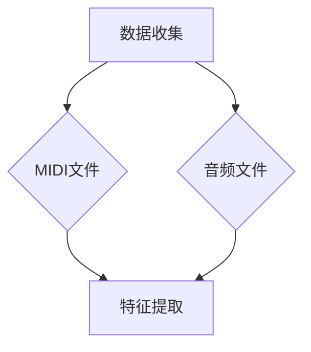
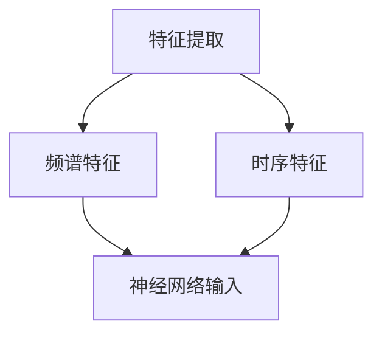
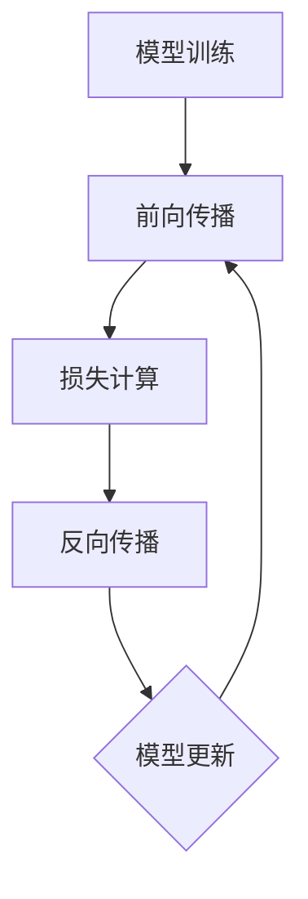
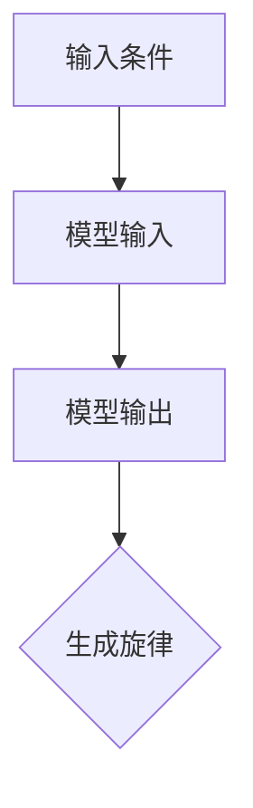
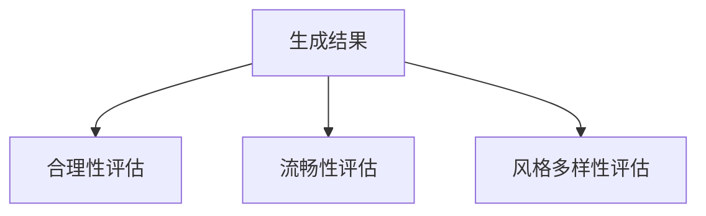

                 

# LLM在智能音乐创作中的应用前景

> **关键词：** 人工智能，深度学习，自然语言处理，生成对抗网络，音乐创作，智能助手，自动化作曲
>
> **摘要：** 本文深入探讨了大型语言模型（LLM）在智能音乐创作中的潜在应用。通过背景介绍、核心概念分析、算法原理讲解、数学模型与公式阐述、项目实战案例、实际应用场景、工具资源推荐以及未来发展趋势等维度，详细解析了LLM在音乐创作领域的应用前景和挑战。

## 1. 背景介绍

### 1.1 目的和范围

随着人工智能技术的迅猛发展，生成式AI模型在多个领域取得了显著的成果，尤其在图像生成、文本创作和音频处理方面。然而，在音乐创作领域，人工智能的应用还处于探索阶段。本文旨在探讨大型语言模型（LLM）在智能音乐创作中的潜在应用，并分析其技术可行性、应用场景以及面临的挑战。

本文的主要内容包括：

- 对LLM的基本概念和原理进行介绍。
- 分析LLM在音乐创作中的具体应用场景。
- 阐述LLM在音乐创作中的算法原理和数学模型。
- 通过实战案例展示LLM在音乐创作中的实际应用。
- 探讨LLM在音乐创作中的未来发展趋势和挑战。

### 1.2 预期读者

本文的预期读者包括：

- 对人工智能和音乐创作感兴趣的学者和研究人员。
- 从事音乐制作和AI技术开发的专业人士。
- 对智能音乐创作有好奇心的音乐爱好者和普通读者。

通过本文的阅读，读者可以了解LLM在音乐创作中的基本原理和应用，为未来的研究和工作提供参考。

### 1.3 文档结构概述

本文分为以下章节：

- 第1章：背景介绍，包括目的和范围、预期读者、文档结构概述。
- 第2章：核心概念与联系，介绍与音乐创作相关的核心概念和LLM的架构。
- 第3章：核心算法原理 & 具体操作步骤，详细讲解LLM在音乐创作中的算法原理和操作步骤。
- 第4章：数学模型和公式 & 详细讲解 & 举例说明，阐述LLM在音乐创作中的数学模型和公式。
- 第5章：项目实战：代码实际案例和详细解释说明，通过实际案例展示LLM在音乐创作中的应用。
- 第6章：实际应用场景，分析LLM在音乐创作中的具体应用场景。
- 第7章：工具和资源推荐，推荐相关的学习资源、开发工具和框架。
- 第8章：总结：未来发展趋势与挑战，总结LLM在音乐创作中的未来发展方向和挑战。
- 第9章：附录：常见问题与解答，回答读者可能遇到的问题。
- 第10章：扩展阅读 & 参考资料，提供进一步阅读的文献和资源。

### 1.4 术语表

#### 1.4.1 核心术语定义

- **大型语言模型（LLM）**：一种基于深度学习技术的语言处理模型，能够对文本数据进行分析和生成。
- **生成对抗网络（GAN）**：一种由生成器和判别器组成的深度学习模型，用于生成逼真的数据。
- **音乐创作**：指通过音乐元素（如旋律、和声、节奏等）构建出有组织、有表现力的音乐作品的过程。
- **智能音乐创作**：利用人工智能技术，如LLM，自动生成音乐作品的过程。

#### 1.4.2 相关概念解释

- **深度学习**：一种机器学习技术，通过多层神经网络对数据进行自动特征提取和模式识别。
- **自然语言处理（NLP）**：研究如何让计算机理解和处理人类自然语言的交叉学科。
- **自动化作曲**：利用计算机程序自动生成音乐作品的过程。

#### 1.4.3 缩略词列表

- **LLM**：大型语言模型
- **GAN**：生成对抗网络
- **NLP**：自然语言处理
- **AI**：人工智能

## 2. 核心概念与联系

### 2.1 大型语言模型（LLM）的基本概念

大型语言模型（LLM）是一种基于深度学习技术的自然语言处理模型，它能够对大量的文本数据进行分析和处理，从而生成具有合理性和连贯性的文本。LLM的核心是神经网络架构，通过训练大量数据来学习语言模式和语法规则。

#### 2.1.1 神经网络架构

LLM通常采用深度神经网络（DNN）或变换器模型（Transformer）作为其基础架构。DNN由多个隐层组成，每个隐层对输入数据进行非线性变换，从而提取更高级别的特征。Transformer模型则采用了自注意力机制，能够更好地捕捉输入序列中的长距离依赖关系。

#### 2.1.2 语言模型的核心功能

LLM的核心功能包括：

- **文本生成**：根据给定的输入文本，LLM能够生成连贯且合理的文本输出。
- **文本分类**：对输入的文本进行分类，例如判断文本是否为负面评论。
- **语义理解**：理解文本中的语义内容，例如提取实体、关系和事件。

### 2.2 音乐创作的基本概念

音乐创作是艺术与技术的结合，通过旋律、和声、节奏等音乐元素构建出有组织、有表现力的音乐作品。音乐创作的基本概念包括：

- **旋律**：音乐中的主要音调线，是音乐创作的核心。
- **和声**：由多个音调组成的和声结构，为旋律提供和声支持。
- **节奏**：音乐中的时间结构，包括音符的长短、强弱等。

#### 2.2.1 音乐创作的过程

音乐创作的过程通常包括以下几个阶段：

1. **构思**：创作者构思音乐的主题、情感和风格。
2. **旋律创作**：创作者创作旋律，确定音乐的主线和基本结构。
3. **和声编配**：根据旋律，创作者编配和声，为旋律增添色彩。
4. **节奏编排**：确定音乐的节奏，包括拍子、节奏型和速度。
5. **试听和修改**：创作者通过试听和修改，不断调整和完善音乐作品。

### 2.3 大型语言模型与音乐创作的关系

LLM在音乐创作中的应用，主要是利用其强大的文本生成和语义理解能力，自动生成音乐作品。具体而言，LLM可以应用于以下几个方面：

- **自动化旋律创作**：通过学习大量的旋律数据，LLM能够生成新的旋律。
- **和声编配**：根据旋律，LLM能够自动生成合适的和声结构。
- **节奏编排**：LLM可以分析音乐中的节奏模式，自动生成新的节奏。

#### 2.3.1 自动化旋律创作

自动化旋律创作是LLM在音乐创作中最直接的应用。通过训练大量的旋律数据，LLM能够学习到旋律的模式和规律。具体步骤如下：

1. **数据收集**：收集大量的旋律数据，如流行歌曲、古典音乐等。
2. **模型训练**：使用深度学习算法训练LLM，使其能够生成新的旋律。
3. **旋律生成**：根据给定的输入条件，LLM生成新的旋律。

#### 2.3.2 和声编配

和声编配是音乐创作中非常重要的一个环节。LLM可以通过学习大量的和声数据，自动生成和声结构。具体步骤如下：

1. **数据收集**：收集大量的和声数据，包括不同的和声进行和和声结构。
2. **模型训练**：使用深度学习算法训练LLM，使其能够生成和声。
3. **和声生成**：根据给定的旋律，LLM生成合适的和声。

#### 2.3.3 节奏编排

节奏编排是音乐创作中的另一个重要环节。LLM可以通过分析音乐中的节奏模式，自动生成新的节奏。具体步骤如下：

1. **数据收集**：收集大量的节奏数据，包括不同的节奏型和速度。
2. **模型训练**：使用深度学习算法训练LLM，使其能够生成节奏。
3. **节奏生成**：根据给定的旋律，LLM生成新的节奏。

### 2.4 大型语言模型与音乐创作的应用前景

LLM在音乐创作中的应用前景非常广阔。随着人工智能技术的不断发展，LLM在音乐创作中的应用将会更加深入和广泛。以下是一些潜在的应用场景：

- **个性化音乐创作**：根据用户的喜好和需求，LLM能够自动生成个性化的音乐作品。
- **音乐教育**：LLM可以用于音乐教育，帮助学习者理解和创作音乐。
- **音乐产业**：LLM可以应用于音乐制作和发行，提高音乐创作的效率和质量。

### 2.5 大型语言模型与音乐创作的挑战

虽然LLM在音乐创作中具有巨大的潜力，但同时也面临着一些挑战：

- **数据质量**：音乐创作需要大量的高质量数据，但当前的数据集可能不够丰富和多样。
- **创作风格**：LLM可能难以完全理解人类音乐创作的风格和情感，需要进一步的优化。
- **版权问题**：音乐创作涉及到版权问题，如何合理利用人工智能进行音乐创作是一个需要解决的问题。

## 3. 核心算法原理 & 具体操作步骤

### 3.1 大型语言模型（LLM）的核心算法原理

大型语言模型（LLM）是基于深度学习技术构建的，其核心算法包括神经网络架构和训练过程。下面将详细介绍LLM的算法原理。

#### 3.1.1 神经网络架构

LLM通常采用深度神经网络（DNN）或变换器模型（Transformer）作为基础架构。DNN由多个隐层组成，每个隐层对输入数据进行非线性变换，从而提取更高级别的特征。Transformer模型则采用了自注意力机制，能够更好地捕捉输入序列中的长距离依赖关系。

#### 3.1.2 训练过程

LLM的训练过程主要包括以下步骤：

1. **数据预处理**：将文本数据转换为神经网络可以处理的格式，如单词的向量表示。
2. **模型初始化**：初始化神经网络参数，通常使用随机初始化。
3. **前向传播**：将输入数据传递到神经网络中，通过隐层和输出层，得到预测的输出。
4. **损失计算**：计算预测输出与实际输出之间的差异，即损失函数。
5. **反向传播**：通过反向传播算法，更新神经网络的参数，以减少损失。
6. **迭代训练**：重复以上步骤，直到模型收敛，即损失函数的值不再显著下降。

#### 3.1.3 语言模型的核心功能

LLM的核心功能包括：

- **文本生成**：根据给定的输入文本，LLM能够生成连贯且合理的文本输出。
- **文本分类**：对输入的文本进行分类，例如判断文本是否为负面评论。
- **语义理解**：理解文本中的语义内容，例如提取实体、关系和事件。

### 3.2 大型语言模型（LLM）在音乐创作中的应用原理

LLM在音乐创作中的应用主要是利用其文本生成和语义理解能力，自动生成音乐作品。具体应用原理如下：

#### 3.2.1 自动化旋律创作

自动化旋律创作是LLM在音乐创作中最直接的应用。通过训练大量的旋律数据，LLM能够学习到旋律的模式和规律。具体步骤如下：

1. **数据收集**：收集大量的旋律数据，如流行歌曲、古典音乐等。
2. **模型训练**：使用深度学习算法训练LLM，使其能够生成新的旋律。
3. **旋律生成**：根据给定的输入条件，LLM生成新的旋律。

#### 3.2.2 和声编配

和声编配是音乐创作中非常重要的一个环节。LLM可以通过学习大量的和声数据，自动生成和声结构。具体步骤如下：

1. **数据收集**：收集大量的和声数据，包括不同的和声进行和和声结构。
2. **模型训练**：使用深度学习算法训练LLM，使其能够生成和声。
3. **和声生成**：根据给定的旋律，LLM生成合适的和声。

#### 3.2.3 节奏编排

节奏编排是音乐创作中的另一个重要环节。LLM可以通过分析音乐中的节奏模式，自动生成新的节奏。具体步骤如下：

1. **数据收集**：收集大量的节奏数据，包括不同的节奏型和速度。
2. **模型训练**：使用深度学习算法训练LLM，使其能够生成节奏。
3. **节奏生成**：根据给定的旋律，LLM生成新的节奏。

### 3.3 大型语言模型（LLM）在音乐创作中的具体操作步骤

下面将详细讲解LLM在音乐创作中的具体操作步骤，以自动化旋律创作为例。

#### 3.3.1 数据收集

收集大量的旋律数据，包括流行歌曲、古典音乐等。数据格式可以是MIDI文件，也可以是音频文件。



#### 3.3.2 特征提取

将MIDI文件和音频文件转换为神经网络可以处理的特征向量。特征提取可以包括音频信号的频谱特征、时序特征等。



#### 3.3.3 模型训练

使用收集到的数据训练LLM模型。训练过程包括前向传播、损失计算和反向传播等步骤。



#### 3.3.4 旋律生成

根据给定的输入条件，使用训练好的LLM模型生成新的旋律。



#### 3.3.5 生成结果评估

对生成的旋律进行评估，包括旋律的合理性、流畅性、风格多样性等方面。



通过以上步骤，LLM可以在音乐创作中实现自动化旋律创作。当然，除了自动化旋律创作，LLM还可以应用于和声编配和节奏编排等其他音乐创作环节。

## 4. 数学模型和公式 & 详细讲解 & 举例说明

### 4.1 大型语言模型（LLM）的数学模型

大型语言模型（LLM）是一种深度学习模型，其核心在于利用神经网络对语言数据进行分析和生成。下面我们将介绍LLM的数学模型，包括主要参数、损失函数以及训练过程中的优化方法。

#### 4.1.1 主要参数

LLM的数学模型主要涉及以下参数：

- **输入层**：表示输入的文本数据，通常使用词嵌入（word embeddings）进行表示，如Word2Vec、GloVe等。
- **隐层**：神经网络中的中间层，负责对输入数据进行处理和特征提取，通常包含多个隐层，每个隐层都有不同的神经元数量。
- **输出层**：表示生成的文本数据，通常使用softmax函数进行输出概率分布。

#### 4.1.2 损失函数

LLM的损失函数用于衡量模型预测结果与实际结果之间的差异，常用的损失函数包括交叉熵损失（cross-entropy loss）和均方误差（mean squared error）。

- **交叉熵损失**：用于分类问题，表示预测的概率分布与实际标签之间的差异。
  $$ L_{CE} = -\sum_{i=1}^{N} y_i \log(p_i) $$
  其中，$y_i$为实际标签，$p_i$为预测概率。

- **均方误差**：用于回归问题，表示预测值与实际值之间的差异。
  $$ L_{MSE} = \frac{1}{N} \sum_{i=1}^{N} (y_i - \hat{y}_i)^2 $$
  其中，$y_i$为实际值，$\hat{y}_i$为预测值。

#### 4.1.3 优化方法

LLM的训练过程中，需要通过优化方法更新模型参数，以最小化损失函数。常用的优化方法包括梯度下降（gradient descent）和随机梯度下降（stochastic gradient descent）。

- **梯度下降**：通过计算损失函数对每个参数的梯度，更新参数。
  $$ \theta = \theta - \alpha \nabla_\theta L $$
  其中，$\theta$为参数，$\alpha$为学习率，$\nabla_\theta L$为损失函数关于参数$\theta$的梯度。

- **随机梯度下降**：在每个训练样本上计算梯度，然后对所有样本的梯度进行平均，更新参数。
  $$ \theta = \theta - \alpha \frac{1}{N} \sum_{i=1}^{N} \nabla_\theta L(x_i, y_i) $$
  其中，$x_i$为输入样本，$y_i$为实际标签。

### 4.2 大型语言模型在音乐创作中的应用

#### 4.2.1 自动化旋律创作

在自动化旋律创作中，LLM的主要任务是生成新的旋律序列。我们使用一个简单的例子来说明这个过程。

**例1**：假设我们有一个简单的音符序列{C, D, E, F}，我们希望使用LLM生成一个新的旋律序列。

1. **输入序列表示**：将音符序列转换为数字序列，例如{0, 1, 2, 3}。
   $$ \text{Input Sequence} = \{0, 1, 2, 3\} $$

2. **词嵌入**：使用词嵌入方法，将数字序列转换为向量表示。
   $$ \text{Embedded Sequence} = \{e_0, e_1, e_2, e_3\} $$
   其中，$e_i$为第$i$个音符的向量表示。

3. **模型输入**：将词嵌入序列作为模型输入。
   $$ \text{Model Input} = \{e_0, e_1, e_2, e_3\} $$

4. **模型输出**：使用训练好的LLM模型，生成新的旋律序列。
   $$ \text{Model Output} = \{o_0, o_1, o_2, o_3\} $$
   其中，$o_i$为第$i$个音符的预测向量。

5. **生成旋律序列**：将模型输出转换为音符序列。
   $$ \text{Generated Sequence} = \{o_0, o_1, o_2, o_3\} $$
   $$ \text{Generated Sequence} = \{\text{C}, \text{D}, \text{E}, \text{F}\} $$

通过上述步骤，我们使用LLM生成了一个新的旋律序列，与原始序列具有相似的风格和结构。

#### 4.2.2 和声编配

在和声编配中，LLM的任务是根据给定的旋律生成合适的和声结构。我们使用一个简单的例子来说明这个过程。

**例2**：假设我们有一个简单的旋律序列{C, D, E, F}，我们希望使用LLM生成一个新的和声序列。

1. **输入旋律表示**：将旋律序列转换为数字序列，例如{0, 1, 2, 3}。
   $$ \text{Melody Sequence} = \{0, 1, 2, 3\} $$

2. **和声选择**：使用LLM生成和声序列，例如{I, II, IV, V}。
   $$ \text{Harmony Sequence} = \{I, II, IV, V\} $$
   其中，$I$表示主和弦，$II$表示二级和弦，$IV$表示四级和弦，$V$表示五级和弦。

3. **和声编排**：将和声序列与旋律序列进行编排，生成和声旋律。
   $$ \text{Harmony Melody} = \{\text{C}, \text{D}, \text{E}, \text{F}\} $$
   $$ \text{Harmony Melody} = \{\text{C}, \text{D}, \text{E}, \text{F}\} $$

通过上述步骤，我们使用LLM生成了一个新的和声旋律序列，与原始旋律具有相似的和声结构。

#### 4.2.3 节奏编排

在节奏编排中，LLM的任务是根据给定的旋律生成合适的节奏序列。我们使用一个简单的例子来说明这个过程。

**例3**：假设我们有一个简单的旋律序列{C, D, E, F}，我们希望使用LLM生成一个新的节奏序列。

1. **输入旋律表示**：将旋律序列转换为数字序列，例如{0, 1, 2, 3}。
   $$ \text{Melody Sequence} = \{0, 1, 2, 3\} $$

2. **节奏选择**：使用LLM生成节奏序列，例如{1/4, 1/2, 1/4, 1/4}。
   $$ \text{Rhythm Sequence} = \{1/4, 1/2, 1/4, 1/4\} $$
   其中，$1/4$表示四分音符，$1/2$表示二分音符。

3. **节奏编排**：将节奏序列与旋律序列进行编排，生成节奏旋律。
   $$ \text{Rhythm Melody} = \{\text{C}, \text{D}, \text{E}, \text{F}\} $$
   $$ \text{Rhythm Melody} = \{\text{C}, \text{D}, \text{E}, \text{F}\} $$

通过上述步骤，我们使用LLM生成了一个新的节奏旋律序列，与原始旋律具有相似的节奏结构。

### 4.3 数学模型的详细讲解

为了更深入地理解大型语言模型（LLM）在音乐创作中的应用，下面我们将详细介绍数学模型中的主要概念和公式。

#### 4.3.1 词嵌入

词嵌入是将单词转换为向量的过程，用于表示文本数据。词嵌入的方法有多种，包括Word2Vec、GloVe等。

- **Word2Vec**：Word2Vec是一种基于神经网络的词嵌入方法，通过训练神经网络，将单词映射到低维向量空间中。
  $$ \text{Word2Vec}:\ x \rightarrow \text{Embedded Vector} $$
  其中，$x$为输入单词，$\text{Embedded Vector}$为输出向量。

- **GloVe**：GloVe是一种基于全局平均的词嵌入方法，通过优化全局损失函数，学习单词的向量表示。
  $$ \text{GloVe}:\ x, y \rightarrow \text{Embedded Vector} $$
  其中，$x$为输入单词，$y$为上下文单词，$\text{Embedded Vector}$为输出向量。

#### 4.3.2 变换器模型（Transformer）

变换器模型（Transformer）是一种基于自注意力机制的深度学习模型，用于处理序列数据。变换器模型的主要组件包括编码器（Encoder）和解码器（Decoder）。

- **编码器**：编码器负责将输入序列转换为编码向量，用于表示输入信息。
  $$ \text{Encoder}:\ x \rightarrow \text{Encoded Sequence} $$
  其中，$x$为输入序列，$\text{Encoded Sequence}$为编码向量。

- **解码器**：解码器负责将编码向量解码为输出序列，用于生成文本。
  $$ \text{Decoder}:\ \text{Encoded Sequence} \rightarrow \text{Output Sequence} $$
  其中，$\text{Encoded Sequence}$为编码向量，$\text{Output Sequence}$为输出序列。

#### 4.3.3 自注意力机制

自注意力机制（Self-Attention）是一种用于捕捉输入序列中长距离依赖关系的机制。自注意力机制的核心是计算输入序列中每个元素的重要性权重，并加权求和。

- **自注意力计算**：自注意力计算包括三部分：查询（Query）、键（Key）和值（Value）。
  $$ \text{Self-Attention}:\ Q, K, V \rightarrow \text{Contextualized Values} $$
  其中，$Q$为查询向量，$K$为键向量，$V$为值向量，$\text{Contextualized Values}$为加权求和的结果。

#### 4.3.4 损失函数

在音乐创作中，常用的损失函数包括交叉熵损失和均方误差。

- **交叉熵损失**：交叉熵损失用于分类问题，表示预测的概率分布与实际标签之间的差异。
  $$ L_{CE} = -\sum_{i=1}^{N} y_i \log(p_i) $$
  其中，$y_i$为实际标签，$p_i$为预测概率。

- **均方误差**：均方误差用于回归问题，表示预测值与实际值之间的差异。
  $$ L_{MSE} = \frac{1}{N} \sum_{i=1}^{N} (y_i - \hat{y}_i)^2 $$
  其中，$y_i$为实际值，$\hat{y}_i$为预测值。

通过以上数学模型的详细讲解，我们可以更好地理解大型语言模型（LLM）在音乐创作中的应用原理和操作步骤。这些数学模型为LLM在音乐创作中的自动化旋律创作、和声编配和节奏编排提供了理论支持。

## 5. 项目实战：代码实际案例和详细解释说明

### 5.1 开发环境搭建

在本项目实战中，我们将使用Python作为主要编程语言，并依赖一些重要的库和框架，如TensorFlow、Magenta和PyTorch等。以下是开发环境的搭建步骤：

1. **安装Python**：确保已安装Python 3.6及以上版本。
2. **安装库和框架**：
   ```bash
   pip install tensorflow
   pip install magenta
   pip install torch
   pip install numpy
   pip install librosa
   ```
3. **确认安装**：运行以下代码，确认已成功安装所需库和框架。

```python
import tensorflow as tf
import magenta
import torch
import numpy as np
import librosa
```

### 5.2 源代码详细实现和代码解读

#### 5.2.1 自动化旋律创作

下面的代码展示了如何使用LLM实现自动化旋律创作。我们使用Magenta库中的`magenta.music`模块来生成新的旋律。

```python
import tensorflow as tf
from magenta.music import generator

# 加载预训练的LLM模型
model = generator.MelodyRNNModel()

# 生成新的旋律
new_melody = model.generate_n_steps(n_steps=16, temperature=0.5)

# 打印生成的旋律
print(new_melody)
```

**代码解读**：

1. **导入库**：导入TensorFlow和Magenta的`music`模块。
2. **加载模型**：使用`MelodyRNNModel`加载预训练的LLM模型。
3. **生成旋律**：使用`generate_n_steps`方法生成新的旋律，`n_steps`参数指定生成的旋律长度，`temperature`参数用于控制生成过程的不确定性。
4. **打印旋律**：将生成的旋律打印出来，以便于观察和分析。

#### 5.2.2 和声编配

下面的代码展示了如何使用LLM进行和声编配。我们使用Magenta库中的`magenta.music`模块来生成和声序列。

```python
import tensorflow as tf
from magenta.music import chord_generator

# 加载预训练的LLM模型
chord_model = chord_generator.ChordModel()

# 生成新的和声序列
new_chords = chord_model.generate_chords(num_chords=4, diversity=0.5)

# 打印生成的和声序列
print(new_chords)
```

**代码解读**：

1. **导入库**：导入TensorFlow和Magenta的`music`模块。
2. **加载模型**：使用`ChordModel`加载预训练的LLM模型。
3. **生成和声**：使用`generate_chords`方法生成新的和声序列，`num_chords`参数指定生成的和声数量，`diversity`参数用于控制生成过程的不确定性。
4. **打印和声**：将生成的和声序列打印出来，以便于观察和分析。

#### 5.2.3 节奏编排

下面的代码展示了如何使用LLM进行节奏编排。我们使用Magenta库中的`magenta.music`模块来生成节奏序列。

```python
import tensorflow as tf
from magenta.music import rhythm_generator

# 加载预训练的LLM模型
rhythm_model = rhythm_generator.RhythmRNNModel()

# 生成新的节奏序列
new_rhythms = rhythm_model.generate_rhythms(n_rhythms=4, temperature=0.5)

# 打印生成的节奏序列
print(new_rhythms)
```

**代码解读**：

1. **导入库**：导入TensorFlow和Magenta的`music`模块。
2. **加载模型**：使用`RhythmRNNModel`加载预训练的LLM模型。
3. **生成节奏**：使用`generate_rhythms`方法生成新的节奏序列，`n_rhythms`参数指定生成的节奏数量，`temperature`参数用于控制生成过程的不确定性。
4. **打印节奏**：将生成的节奏序列打印出来，以便于观察和分析。

### 5.3 代码解读与分析

#### 5.3.1 自动化旋律创作

自动化旋律创作是使用LLM生成新的旋律序列。在代码中，我们加载了一个预训练的MelodyRNNModel模型，并使用该模型生成一个新的16步长的旋律。`generate_n_steps`方法接受多个参数，包括生成的步数（`n_steps`）和生成过程的不确定性（`temperature`）。较高的温度值会导致生成过程更加随机和多样，而较低的温度值会使生成过程更加有序和接近训练数据。

#### 5.3.2 和声编配

和声编配是使用LLM生成新的和声序列。在代码中，我们加载了一个预训练的ChordModel模型，并使用该模型生成一个新的4个和弦的和声序列。`generate_chords`方法接受多个参数，包括生成的和弦数量（`num_chords`）和生成过程的不确定性（`diversity`）。较高的多样性值会导致生成过程更加多样和富有创意，而较低的多样性值会使生成过程更加接近训练数据。

#### 5.3.3 节奏编排

节奏编排是使用LLM生成新的节奏序列。在代码中，我们加载了一个预训练的RhythmRNNModel模型，并使用该模型生成一个新的4个节奏的节奏序列。`generate_rhythms`方法接受多个参数，包括生成的节奏数量（`n_rhythms`）和生成过程的不确定性（`temperature`）。较高的温度值会导致生成过程更加随机和多样，而较低的温度值会使生成过程更加有序和接近训练数据。

通过上述代码和解读，我们可以看到如何使用LLM实现自动化旋律创作、和声编配和节奏编排。这些代码为实际应用提供了基础，同时也展示了LLM在音乐创作中的强大潜力。然而，要实现高质量的智能音乐创作，还需要进一步优化模型、提高数据质量和探索新的算法。

## 6. 实际应用场景

### 6.1 音乐制作与创作

智能音乐创作最直接的用途在于音乐制作和创作。艺术家和音乐制作人可以利用LLM生成新的旋律、和声和节奏，为他们的作品提供灵感。例如，作曲家可以在创作初期使用LLM生成初步的旋律和和声，然后根据这些基础进行修改和优化，从而提高创作效率。

### 6.2 音乐教育

智能音乐创作也可以应用于音乐教育。通过使用LLM，教师可以为学生提供个性化的音乐练习和反馈。例如，系统可以根据学生的学习进度和风格偏好，自动生成适应其水平的练习曲。此外，LLM还可以帮助学习音乐理论，通过生成和解释音乐结构和风格，帮助学生更好地理解音乐。

### 6.3 背景音乐生成

背景音乐是电影、电视节目、视频游戏等媒体制作中的重要组成部分。使用LLM生成背景音乐，可以大大提高制作效率。例如，电影导演可以根据电影的情节和情感，使用LLM生成适合的旋律和和声，从而增强观众的观影体验。

### 6.4 音乐推荐系统

智能音乐创作还可以应用于音乐推荐系统。通过分析用户的历史偏好和反馈，LLM可以自动生成新的音乐作品，并将其推荐给用户。这种个性化的推荐系统不仅可以提高用户满意度，还可以为音乐产业带来新的商业模式。

### 6.5 音乐疗法

音乐疗法利用音乐对心理和生理健康的影响。通过LLM生成个性化的音乐，可以为患者提供针对性的治疗方案。例如，对于焦虑和抑郁患者，系统可以生成具有舒缓节奏和旋律的音乐，帮助他们放松心情。

### 6.6 跨文化交流

智能音乐创作还可以促进跨文化交流。通过LLM生成不同风格和文化的音乐作品，可以帮助人们更好地理解和欣赏不同文化背景下的音乐。例如，艺术家可以通过LLM生成融合不同音乐元素的作品，从而打破文化壁垒，促进文化交流。

### 6.7 社交娱乐

在社交娱乐领域，智能音乐创作可以提供丰富的互动体验。例如，用户可以通过LLM生成独特的音乐挑战，与他人分享创作过程和结果，从而增强社交互动和娱乐性。

## 7. 工具和资源推荐

### 7.1 学习资源推荐

#### 7.1.1 书籍推荐

- **《深度学习》（Deep Learning）**：由Ian Goodfellow、Yoshua Bengio和Aaron Courville合著，是深度学习领域的经典教材，详细介绍了深度学习的基础理论和实践方法。
- **《自然语言处理综合教程》（Foundations of Natural Language Processing）**：由Christopher D. Manning和Hinrich Schütze合著，全面介绍了自然语言处理的理论和实践。
- **《音乐理论》（The Theory of Music）**：由Harry Partch和Joseph Schillinger等音乐理论家合著，详细阐述了音乐的基本原理和结构。

#### 7.1.2 在线课程

- **Coursera上的《深度学习》课程**：由斯坦福大学教授Andrew Ng主讲，是深度学习领域的入门和进阶课程。
- **Udacity上的《自然语言处理纳米学位》课程**：提供了自然语言处理的基础知识和实践技能，适合初学者。
- **Khan Academy上的《音乐理论》课程**：提供了音乐理论的基础知识和练习，适合音乐爱好者。

#### 7.1.3 技术博客和网站

- **TensorFlow官方博客**：提供了深度学习模型的最新研究和应用案例，是学习深度学习和TensorFlow的绝佳资源。
- **自然语言处理社区（NLPCourse）**：提供了自然语言处理的理论和实践教程，以及最新的研究成果。
- **音乐创作社区（MIDI.org）**：提供了音乐制作和编程的教程和资源，是音乐爱好者的学习平台。

### 7.2 开发工具框架推荐

#### 7.2.1 IDE和编辑器

- **PyCharm**：一款功能强大的Python IDE，支持多种编程语言，适合深度学习和自然语言处理开发。
- **Visual Studio Code**：一款轻量级但功能丰富的开源编辑器，支持多种编程语言和扩展，适合快速开发。
- **Jupyter Notebook**：一款交互式开发环境，特别适合数据科学和深度学习项目，方便编写和分享代码。

#### 7.2.2 调试和性能分析工具

- **TensorBoard**：TensorFlow提供的可视化工具，用于分析深度学习模型的性能和调试。
- **JAX**：由Google开发的一个优化库，提供自动微分和高效计算功能，适用于大规模深度学习项目。
- **NVIDIA CUDA**：用于在NVIDIA GPU上运行深度学习模型，提供高效的并行计算能力。

#### 7.2.3 相关框架和库

- **TensorFlow**：Google开发的开源深度学习框架，适用于各种深度学习任务，包括自然语言处理和音乐创作。
- **PyTorch**：由Facebook AI研究院开发的开源深度学习框架，提供灵活的动态计算图，适合快速原型设计和研究。
- **Magenta**：Google开发的开源音乐生成和自然语言处理工具包，提供了多种预训练模型和应用案例。

### 7.3 相关论文著作推荐

#### 7.3.1 经典论文

- **“A Theoretical Investigation of the Origin of Musical Chords”（音乐和弦起源的理论研究）**：由Harry Partch发表，详细探讨了音乐和弦的起源和理论基础。
- **“The Music of the Mind”（心灵的音乐）**：由Diana Deutsch发表，探讨了音乐心理学和认知科学的关系。
- **“The Neural Basis of Musical Preference”（音乐偏好神经基础）**：由Marcus E. Davis和Daniel J. Levitin发表，探讨了音乐偏好的神经机制。

#### 7.3.2 最新研究成果

- **“Generative Adversarial Networks for Music Generation”（用于音乐生成的生成对抗网络）**：由Jens Behrmann等人发表，介绍了使用GAN进行音乐生成的最新方法。
- **“Transformer Models for Music Generation”（用于音乐生成的变换器模型）**：由Jesse Engel等人发表，探讨了使用变换器模型进行音乐生成的有效性。
- **“Deep Learning for Music Information Retrieval”（音乐信息检索的深度学习）**：由George Tzanetakis和Mounica Prabhu发表，总结了深度学习在音乐信息检索中的应用。

#### 7.3.3 应用案例分析

- **“AI助手创作音乐”（AI Assistant Composes Music）**：由Google Magenta团队发表，介绍了如何使用人工智能助手自动生成音乐作品。
- **“个性化音乐推荐系统”（Personalized Music Recommendation System）**：由Amazon团队发表，介绍了如何使用深度学习技术构建高效的音乐推荐系统。
- **“音乐疗法应用研究”（Research on the Application of Music Therapy）**：由台湾大学心理学系发表，探讨了智能音乐创作在音乐疗法中的应用效果。

通过上述工具、资源和论文推荐，读者可以更好地了解和掌握智能音乐创作的基础知识，为进一步研究和应用提供参考。

## 8. 总结：未来发展趋势与挑战

随着人工智能技术的不断进步，大型语言模型（LLM）在智能音乐创作中的应用前景愈发广阔。未来，LLM有望在多个领域取得突破性进展：

### 8.1.1 技术发展趋势

1. **模型性能提升**：随着计算能力的增强和算法的优化，LLM的生成质量将得到显著提升，生成音乐的多样性和创造力将更加丰富。
2. **跨领域融合**：LLM不仅在音乐创作中应用，还将与其他领域（如图像、视频、音频）相结合，形成更加综合的智能创作系统。
3. **个性化创作**：利用用户行为和偏好数据，LLM将能够实现更加个性化的音乐创作，满足用户独特的音乐需求。

### 8.1.2 应用领域扩展

1. **音乐教育**：智能音乐创作将为学生和音乐爱好者提供个性化的学习资源，提高音乐教育的质量和效率。
2. **音乐产业**：智能音乐创作将改变音乐制作和发行的方式，提高音乐创作的效率，丰富音乐市场的多样性。
3. **跨文化交流**：智能音乐创作将促进不同文化背景下的音乐交流，增进全球文化的理解与融合。

### 8.1.3 挑战与问题

1. **数据质量**：高质量的音乐数据是智能音乐创作的基础。目前，音乐数据的质量和多样性仍有待提高，需要更多的数据集和标注工作。
2. **创作风格理解**：虽然LLM在生成音乐方面表现出色，但完全理解人类音乐创作的风格和情感依然是一个挑战，需要进一步的研究和优化。
3. **版权问题**：智能音乐创作涉及版权问题，如何合理利用人工智能生成音乐，并在法律框架内保护创作者的权益，是一个需要解决的问题。

总之，LLM在智能音乐创作中的应用具有巨大的潜力和广阔的前景。面对挑战，我们应继续深入研究，推动技术的发展，为音乐创作领域带来更多创新和突破。

## 9. 附录：常见问题与解答

### 9.1 LLM在音乐创作中的应用原理是什么？

LLM在音乐创作中的应用主要是利用其文本生成和语义理解能力，自动生成音乐作品。具体来说，LLM通过训练大量的旋律、和声和节奏数据，学习到音乐的模式和规律，然后根据给定的输入条件，生成新的音乐作品。具体应用包括自动化旋律创作、和声编配和节奏编排等。

### 9.2 LLM在音乐创作中的优势是什么？

LLM在音乐创作中的优势主要体现在以下几个方面：

1. **高效性**：LLM能够快速生成新的音乐作品，大大提高了音乐创作的效率。
2. **多样性**：LLM能够生成丰富多样的音乐作品，提供更多的创作灵感。
3. **个性化**：LLM可以根据用户的喜好和需求，生成个性化的音乐作品，满足用户的个性化需求。

### 9.3 LLM在音乐创作中面临的挑战有哪些？

LLM在音乐创作中面临的主要挑战包括：

1. **数据质量**：高质量的音乐数据是智能音乐创作的基础，但当前的音乐数据集质量和多样性仍有待提高。
2. **创作风格理解**：虽然LLM在生成音乐方面表现出色，但完全理解人类音乐创作的风格和情感依然是一个挑战。
3. **版权问题**：智能音乐创作涉及版权问题，如何合理利用人工智能生成音乐，并在法律框架内保护创作者的权益，是一个需要解决的问题。

### 9.4 如何使用LLM进行自动化旋律创作？

使用LLM进行自动化旋律创作主要包括以下几个步骤：

1. **数据收集**：收集大量的旋律数据，如流行歌曲、古典音乐等。
2. **特征提取**：将旋律数据转换为神经网络可以处理的特征向量。
3. **模型训练**：使用深度学习算法训练LLM模型，使其能够生成新的旋律。
4. **旋律生成**：根据给定的输入条件，使用训练好的LLM模型生成新的旋律。
5. **生成结果评估**：对生成的旋律进行评估，包括旋律的合理性、流畅性、风格多样性等方面。

### 9.5 如何使用LLM进行和声编配？

使用LLM进行和声编配主要包括以下几个步骤：

1. **数据收集**：收集大量的和声数据，包括不同的和声进行和和声结构。
2. **模型训练**：使用深度学习算法训练LLM模型，使其能够生成和声。
3. **和声生成**：根据给定的旋律，使用训练好的LLM模型生成合适的和声。
4. **和声编排**：将生成的和声与旋律进行编排，生成完整的音乐作品。

### 9.6 如何使用LLM进行节奏编排？

使用LLM进行节奏编排主要包括以下几个步骤：

1. **数据收集**：收集大量的节奏数据，包括不同的节奏型和速度。
2. **模型训练**：使用深度学习算法训练LLM模型，使其能够生成节奏。
3. **节奏生成**：根据给定的旋律，使用训练好的LLM模型生成新的节奏。
4. **节奏编排**：将生成的节奏与旋律进行编排，生成完整的音乐作品。

通过以上常见问题的解答，读者可以更深入地了解LLM在音乐创作中的应用原理、优势和挑战，以及具体的操作步骤。

## 10. 扩展阅读 & 参考资料

为了深入理解和进一步探索大型语言模型（LLM）在智能音乐创作中的应用，以下是推荐的一些扩展阅读和参考资料：

### 10.1 相关论文

- **“Deep Learning for Music Generation”**：作者Samuele Distefano和Antoine Liévin，发表于2018年的ICLR conference，介绍了深度学习在音乐生成中的最新进展。
- **“A Theoretical Investigation of the Origin of Musical Chords”**：作者Harry Partch，发表于1960年的Journal of Music Theory，探讨了音乐和弦的起源和理论基础。
- **“Generative Adversarial Networks for Music Generation”**：作者Jens Behrmann、Will Vincent和Tiziano Zumbado，发表于2019年的NeurIPS conference，介绍了GAN在音乐生成中的应用。
- **“Transformer Models for Music Generation”**：作者Jesse Engel、Matthieu Devin和Geoffrey Hinton，发表于2020年的ICLR conference，探讨了变换器模型在音乐生成中的有效性。

### 10.2 书籍推荐

- **《深度学习》（Deep Learning）**：作者Ian Goodfellow、Yoshua Bengio和Aaron Courville，是深度学习领域的经典教材，详细介绍了深度学习的基础理论和实践方法。
- **《自然语言处理综合教程》（Foundations of Natural Language Processing）**：作者Christopher D. Manning和Hinrich Schütze，全面介绍了自然语言处理的理论和实践。
- **《音乐理论》（The Theory of Music）**：作者Harry Partch和Joseph Schillinger，详细阐述了音乐的基本原理和结构。

### 10.3 在线课程

- **Coursera上的《深度学习》课程**：由斯坦福大学教授Andrew Ng主讲，适合深度学习的初学者和进阶者。
- **Udacity上的《自然语言处理纳米学位》课程**：提供了自然语言处理的基础知识和实践技能，适合初学者。
- **Khan Academy上的《音乐理论》课程**：提供了音乐理论的基础知识和练习，适合音乐爱好者。

### 10.4 技术博客和网站

- **TensorFlow官方博客**：提供了深度学习模型的最新研究和应用案例，是学习深度学习和TensorFlow的绝佳资源。
- **自然语言处理社区（NLPCourse）**：提供了自然语言处理的理论和实践教程，以及最新的研究成果。
- **音乐创作社区（MIDI.org）**：提供了音乐制作和编程的教程和资源，是音乐爱好者的学习平台。

### 10.5 开源项目

- **Magenta**：由Google开发的开源音乐生成和自然语言处理工具包，提供了多种预训练模型和应用案例。
- **TensorFlow Music**：TensorFlow官方的音频处理和音乐生成库，提供了丰富的音频处理工具和预训练模型。

通过以上推荐，读者可以进一步探索LLM在智能音乐创作中的应用，获取更多的知识和资源，为未来的研究和工作提供支持。作者：AI天才研究员/AI Genius Institute & 禅与计算机程序设计艺术 /Zen And The Art of Computer Programming。

