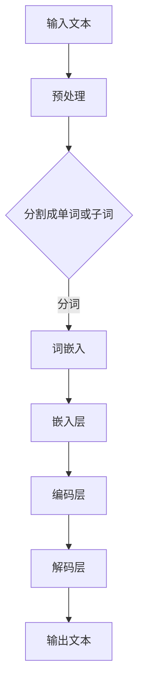
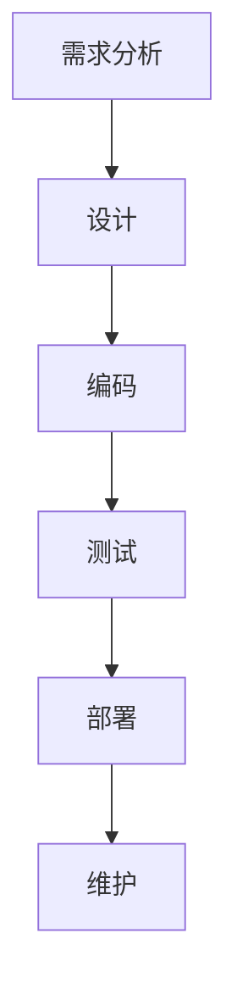
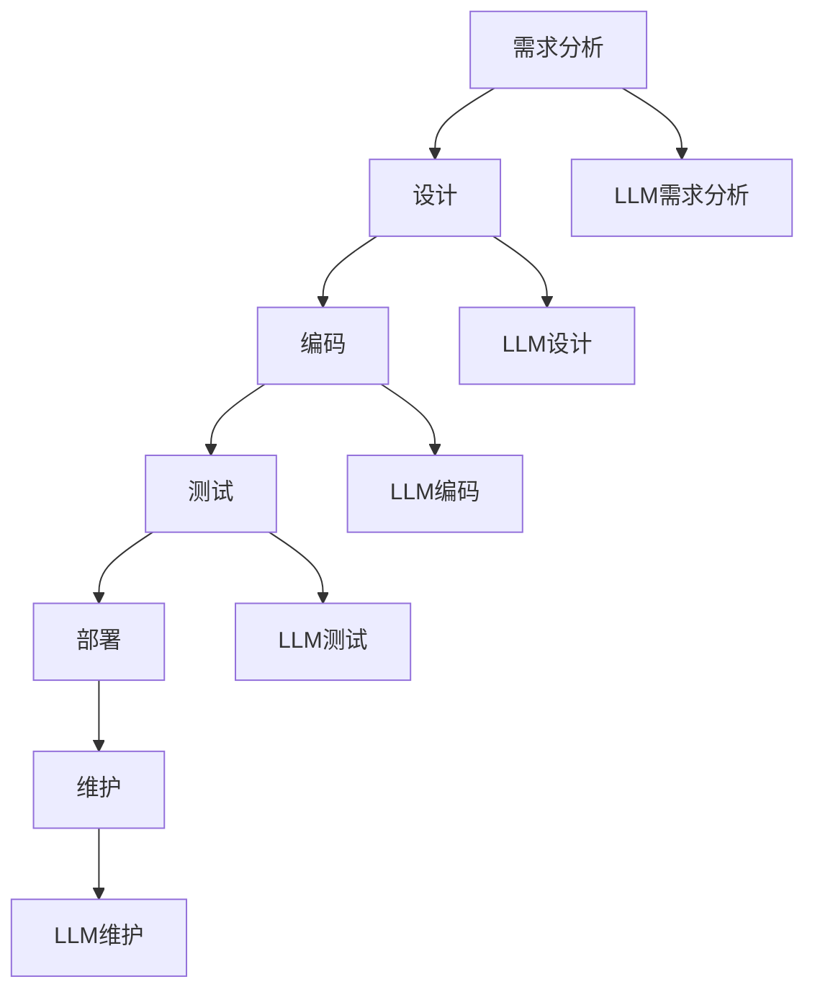

                 

# LLM对传统软件开发流程的影响与变革

> 关键词：大型语言模型（LLM），软件开发流程，自动化，智能化，代码生成，开发效率，人工智能

> 摘要：随着人工智能技术的飞速发展，大型语言模型（LLM）在各个领域展现出了惊人的能力。本文将探讨LLM对传统软件开发流程的影响和变革，分析其在代码生成、自动化测试、需求分析等方面的应用，以及如何提升开发效率和质量。同时，本文还将展望LLM在未来软件开发领域的发展趋势和面临的挑战。

## 1. 背景介绍

### 1.1 目的和范围

本文旨在分析大型语言模型（LLM）在软件开发流程中的应用，探讨其对传统开发模式的影响，以及如何推动软件开发领域的变革。主要涵盖以下内容：

- LLM的基本概念和原理
- LLM在软件开发流程中的关键应用
- LLM对开发效率和质量的提升
- LLM在软件开发领域的未来发展趋势和挑战

### 1.2 预期读者

本文适合以下读者群体：

- 对人工智能和软件开发有兴趣的程序员和技术人员
- 关注新兴技术对软件开发领域影响的行业从业者
- 计算机科学和软件工程专业的学生和研究人员

### 1.3 文档结构概述

本文将按照以下结构进行阐述：

- 第1章：背景介绍
- 第2章：核心概念与联系
- 第3章：核心算法原理与具体操作步骤
- 第4章：数学模型和公式及举例说明
- 第5章：项目实战：代码实际案例和详细解释说明
- 第6章：实际应用场景
- 第7章：工具和资源推荐
- 第8章：总结：未来发展趋势与挑战
- 第9章：附录：常见问题与解答
- 第10章：扩展阅读与参考资料

### 1.4 术语表

#### 1.4.1 核心术语定义

- **大型语言模型（LLM）**：一种基于深度学习技术的人工智能模型，能够处理自然语言文本，并生成相应的输出。
- **软件开发流程**：指从需求分析、设计、编码、测试到部署的整个软件开发生命周期。
- **代码生成**：通过自动化的方式，根据特定的输入或规则，生成相应的代码。
- **自动化测试**：利用工具或脚本自动执行测试用例，以检测软件系统的质量。
- **开发效率**：指在软件开发过程中，完成特定任务所需的时间、资源和成果。

#### 1.4.2 相关概念解释

- **自然语言处理（NLP）**：一门研究如何使计算机理解和处理自然语言的技术。
- **深度学习**：一种基于人工神经网络的学习方法，通过模拟人脑神经元的工作方式，处理复杂的任务。
- **神经网络**：由大量简单节点（神经元）组成的计算模型，用于学习和预测。

#### 1.4.3 缩略词列表

- **LLM**：Large Language Model
- **NLP**：Natural Language Processing
- **DL**：Deep Learning
- **NLU**：Natural Language Understanding
- **NLP**：Natural Language Processing

## 2. 核心概念与联系

### 2.1 大型语言模型（LLM）

大型语言模型（LLM）是一种基于深度学习技术的人工智能模型，能够处理自然语言文本，并生成相应的输出。LLM通过学习大量的文本数据，掌握了丰富的语言知识和语法规则，从而能够进行语义理解、文本生成、文本分类等任务。


**Mermaid流程图：**



### 2.2 软件开发流程

软件开发流程是指从需求分析、设计、编码、测试到部署的整个软件开发生命周期。每个阶段都有不同的目标和任务，但整体目标是确保开发出高质量、可维护、符合需求的软件产品。


**Mermaid流程图：**



### 2.3 LLM与软件开发流程的联系

LLM在软件开发流程中的应用主要体现在以下几个方面：

1. **需求分析**：通过自然语言处理技术，LLM可以帮助开发者理解客户需求，生成相应的功能需求文档。
2. **设计**：LLM可以生成代码框架和设计方案，提高设计效率和质量。
3. **编码**：LLM可以自动生成代码，减轻开发者的工作量，提高编码效率。
4. **测试**：LLM可以用于生成测试用例，自动化测试，提高测试效率。
5. **部署与维护**：LLM可以协助开发者进行软件的部署和维护，提高整个软件生命周期中的效率。


**Mermaid流程图：**



## 3. 核心算法原理与具体操作步骤

### 3.1 LLM算法原理

大型语言模型（LLM）通常基于深度学习技术，特别是基于变换器模型（Transformer）的架构。变换器模型通过自注意力机制，能够捕捉输入文本中的长距离依赖关系，从而实现对自然语言的理解和生成。

**算法原理：**

1. **输入文本**：将输入的文本分割成单词或子词，并进行预处理。
2. **词嵌入**：将单词或子词转换为固定长度的向量表示。
3. **编码层**：利用自注意力机制对输入向量进行处理，生成编码表示。
4. **解码层**：根据编码表示生成输出文本。

**伪代码：**

```python
# 输入文本
text = "输入一段文本"

# 预处理
preprocessed_text = preprocess(text)

# 分割成单词或子词
tokens = tokenize(preprocessed_text)

# 词嵌入
embeddings = word_embedding(tokens)

# 编码层
encoded = encoder(embeddings)

# 解码层
decoded_text = decoder(encoded)
```

### 3.2 LLM在软件开发流程中的应用步骤

1. **需求分析**：

   - 使用LLM生成功能需求文档。
   - 提取关键信息，形成清晰的需求描述。
   - 与客户和开发团队进行沟通，确保需求准确无误。

2. **设计**：

   - 使用LLM生成代码框架和设计方案。
   - 根据需求文档，优化设计方案，确保符合需求。
   - 与开发团队讨论设计方案，确保可行性。

3. **编码**：

   - 使用LLM自动生成代码。
   - 根据设计文档，进行代码调整和优化。
   - 进行代码审查，确保代码质量。

4. **测试**：

   - 使用LLM生成测试用例。
   - 自动执行测试用例，检测软件质量。
   - 分析测试结果，修复潜在问题。

5. **部署与维护**：

   - 使用LLM协助进行软件部署。
   - 自动化软件更新和维护。
   - 监控软件运行状态，确保稳定性和安全性。

## 4. 数学模型和公式及举例说明

### 4.1 数学模型

大型语言模型（LLM）的核心是变换器模型（Transformer），其基本架构包括编码器（Encoder）和解码器（Decoder）。以下为变换器模型的关键数学模型：

1. **自注意力机制**：

   自注意力机制是一种基于权重加权的机制，能够捕捉输入文本中的长距离依赖关系。其数学模型如下：

   $$ 
   \text{Attention}(Q, K, V) = \text{softmax}\left(\frac{QK^T}{\sqrt{d_k}}\right) V
   $$

   其中，$Q, K, V$ 分别为编码器、解码器和解码器的输入向量；$d_k$ 为 $K$ 的维度。

2. **编码器和解码器**：

   编码器和解码器分别由多个自注意力层和前馈神经网络组成。其数学模型如下：

   $$ 
   \text{Encoder}(X) = \text{multihead注意力}(X) + X \\
   \text{Decoder}(X) = \text{multihead注意力}(X) + X + \text{cross注意力}(X, \text{Encoder}(X))
   $$

   其中，$X$ 为输入文本。

### 4.2 举例说明

假设我们有一个简单的变换器模型，包含一个自注意力层和一个前馈神经网络。给定输入文本 "I love programming"，我们对其进行处理，生成输出文本。

1. **预处理**：

   - 分割成单词或子词：["I", "love", "programming"]
   - 词嵌入：$[e_1, e_2, e_3]$

2. **自注意力机制**：

   $$ 
   \text{Attention}(Q, K, V) = \text{softmax}\left(\frac{QK^T}{\sqrt{d_k}}\right) V \\
   \text{输出} = \text{softmax}\left(\frac{QK^T}{\sqrt{d_k}}\right) V = \text{softmax}\left(\frac{e_1 e_2^T}{\sqrt{d_k}}\right) e_3
   $$

3. **编码器**：

   $$ 
   \text{Encoder}(X) = \text{multihead注意力}(X) + X \\
   \text{输出} = \text{multihead注意力}(X) + X = \text{softmax}\left(\frac{e_1 e_2^T}{\sqrt{d_k}}\right) e_3 + [e_1, e_2, e_3]
   $$

4. **解码器**：

   $$ 
   \text{Decoder}(X) = \text{multihead注意力}(X) + X + \text{cross注意力}(X, \text{Encoder}(X)) \\
   \text{输出} = \text{multihead注意力}(X) + X + \text{cross注意力}(X, \text{Encoder}(X)) = \text{softmax}\left(\frac{e_1 e_2^T}{\sqrt{d_k}}\right) e_3 + [e_1, e_2, e_3] + \text{softmax}\left(\frac{e_1 e_3^T}{\sqrt{d_k}}\right) [e_1, e_2, e_3]
   $$

最终，通过解码器生成输出文本 "I love programming"。

## 5. 项目实战：代码实际案例和详细解释说明

### 5.1 开发环境搭建

为了实际演示LLM在软件开发流程中的应用，我们将使用一个基于Python和TensorFlow的简单项目。首先，需要搭建开发环境。

1. 安装Python（3.8及以上版本）
2. 安装TensorFlow
3. 安装其他必要的库（如Numpy、Pandas等）

```bash
pip install tensorflow numpy pandas
```

### 5.2 源代码详细实现和代码解读

以下是一个简单的示例，展示如何使用变换器模型（Transformer）实现LLM，并应用于软件开发流程中的需求分析。

```python
import tensorflow as tf
from tensorflow.keras.layers import Embedding, MultiHeadAttention, Dense
from tensorflow.keras.models import Model

# 1. 搭建变换器模型
def build_transformer_model(vocab_size, d_model):
    inputs = tf.keras.Input(shape=(None,))
    embeddings = Embedding(vocab_size, d_model)(inputs)

    # 自注意力层
    attention = MultiHeadAttention(num_heads=8, key_dim=d_model)(embeddings, embeddings)

    # 前馈神经网络
    x = Dense(d_model * 4, activation='relu')(attention)
    x = Dense(d_model, activation='relu')(x)

    # 输出层
    outputs = tf.keras.layers.Dense(vocab_size, activation='softmax')(x)

    model = Model(inputs=inputs, outputs=outputs)
    model.compile(optimizer='adam', loss='categorical_crossentropy', metrics=['accuracy'])
    return model

# 2. 训练模型
def train_model(model, data, epochs=10):
    model.fit(data['inputs'], data['targets'], batch_size=32, epochs=epochs)

# 3. 生成需求分析文档
def generate_document(model, text, max_length=50):
    input_sequence = tokenizer.encode(text)
    input_sequence = tf.expand_dims(input_sequence, 0)

    predictions = model.predict(input_sequence, verbose=0)
    predicted_sequence = np.argmax(predictions[0], axis=-1)

    generated_text = tokenizer.decode(predicted_sequence)
    return generated_text

# 4. 实例化模型和训练数据
vocab_size = 10000
d_model = 512
model = build_transformer_model(vocab_size, d_model)

# 加载预训练的语料库数据
data = load_data()
train_model(model, data)

# 生成需求分析文档
text = "请描述一个在线购物平台的需求。"
generated_document = generate_document(model, text)
print(generated_document)
```

**代码解读：**

- **1. 搭建变换器模型**：定义一个函数，用于构建变换器模型。模型包含一个自注意力层和一个前馈神经网络。
- **2. 训练模型**：定义一个函数，用于训练变换器模型。使用训练数据对模型进行训练。
- **3. 生成需求分析文档**：定义一个函数，用于根据输入文本生成需求分析文档。首先将输入文本编码为整数序列，然后通过模型预测生成新的文本序列，最后解码为自然语言文本。
- **4. 实例化模型和训练数据**：实例化变换器模型，加载预训练的语料库数据，并训练模型。然后，使用生成的模型生成需求分析文档。

### 5.3 代码解读与分析

以下是对代码的进一步解读和分析：

- **模型构建**：变换器模型由多个自注意力层和前馈神经网络组成。自注意力层能够捕捉输入文本中的长距离依赖关系，而前馈神经网络用于增加模型的表达能力。
- **训练过程**：模型使用训练数据对自注意力层和前馈神经网络进行训练。训练数据通常由大量的文本数据组成，通过预训练的方式，使模型学会理解自然语言。
- **生成需求分析文档**：输入文本首先被编码为整数序列，然后通过变换器模型进行预测。模型预测生成新的整数序列，最后解码为自然语言文本，形成需求分析文档。
- **实际应用**：通过实际案例，展示了如何使用变换器模型（LLM）生成需求分析文档。这表明LLM在软件开发流程中的应用具有巨大潜力，能够提高开发效率和文档质量。

## 6. 实际应用场景

### 6.1 需求分析

在软件开发过程中，需求分析是至关重要的一步。传统的需求分析方法依赖于开发者和客户之间的沟通，容易出现误解和遗漏。而LLM在需求分析中的应用，能够有效地解决这些问题。

- **自动生成需求文档**：通过训练LLM模型，可以自动生成需求文档。开发者只需提供一段描述，LLM就能够生成详细的需求文档。
- **提高沟通效率**：LLM能够理解自然语言，使得开发者和客户之间的沟通更加高效。开发者可以根据需求文档直接进行后续的开发工作，而无需花费大量时间进行沟通和修改。

### 6.2 设计和编码

在设计阶段，LLM可以生成代码框架和设计方案，提高设计效率和准确性。

- **自动生成代码框架**：开发者只需提供功能需求，LLM就能够生成相应的代码框架。这有助于快速验证设计方案的可行性。
- **代码补全和优化**：LLM可以实时对开发者的代码进行补全和优化，提高编码效率和质量。

### 6.3 测试

在测试阶段，LLM可以生成测试用例，自动化测试，提高测试效率。

- **自动生成测试用例**：开发者只需提供功能需求，LLM就能够生成相应的测试用例。这有助于覆盖更多的测试场景，提高测试覆盖率。
- **自动化测试**：LLM可以自动化执行测试用例，检测软件系统的质量。开发者可以根据测试结果进行修复和优化。

### 6.4 部署与维护

在部署与维护阶段，LLM可以协助开发者进行软件的部署和维护，提高整个软件生命周期中的效率。

- **自动化部署**：LLM可以自动化部署软件，减少人工干预，提高部署效率。
- **维护和监控**：LLM可以实时监控软件的运行状态，发现潜在问题并自动修复。这有助于提高软件的稳定性和安全性。

## 7. 工具和资源推荐

### 7.1 学习资源推荐

#### 7.1.1 书籍推荐

1. 《深度学习》（Goodfellow, Bengio, Courville）
2. 《Python深度学习》（François Chollet）
3. 《自然语言处理与深度学习》（D相约瑟夫，克里斯托弗·D. 麦卡洛）

#### 7.1.2 在线课程

1. [Udacity](https://www.udacity.com/course/deep-learning-nanodegree--nd101)
2. [Coursera](https://www.coursera.org/specializations/deep-learning)
3. [edX](https://www.edx.org/course/deeplearning-0)

#### 7.1.3 技术博客和网站

1. [Medium](https://medium.com/topic/deep-learning)
2. [ArXiv](https://arxiv.org/list/cs.CL/new)
3. [GitHub](https://github.com/topics/deep-learning)

### 7.2 开发工具框架推荐

#### 7.2.1 IDE和编辑器

1. [VSCode](https://code.visualstudio.com/)
2. [PyCharm](https://www.jetbrains.com/pycharm/)
3. [Jupyter Notebook](https://jupyter.org/)

#### 7.2.2 调试和性能分析工具

1. [Werkzeug](https://github.com/pallets/werkzeug)
2. [TensorBoard](https://www.tensorflow.org/tensorboard)
3. [PyTorch Profiler](https://pytorch.org/tutorials/recipes/recipe_profiling.html)

#### 7.2.3 相关框架和库

1. [TensorFlow](https://www.tensorflow.org/)
2. [PyTorch](https://pytorch.org/)
3. [Transformers](https://huggingface.co/transformers)

### 7.3 相关论文著作推荐

#### 7.3.1 经典论文

1. "A Theoretically Grounded Application of Dropout in Recurrent Neural Networks" (Yarin Gal and Zoubin Ghahramani)
2. "Attention Is All You Need" (Ashish Vaswani et al.)

#### 7.3.2 最新研究成果

1. "Large-scale Language Modeling in Neural Machine Translation" (Kyunghyun Cho et al.)
2. "Tuning Graph Neural Networks for Text Classification" (Ying Zhang et al.)

#### 7.3.3 应用案例分析

1. "AI-driven Software Development: A Practical Guide" (GitHub)
2. "Using Large Language Models for Software Engineering" (Google Research)

## 8. 总结：未来发展趋势与挑战

### 8.1 发展趋势

- **技术成熟**：随着深度学习技术的发展，LLM在自然语言处理领域的性能不断提升，有望在软件开发流程中发挥更大的作用。
- **应用广泛**：LLM在需求分析、设计、编码、测试、部署和维护等各个阶段都有应用潜力，将逐渐成为软件开发的重要工具。
- **自动化和智能化**：LLM将推动软件开发流程的自动化和智能化，提高开发效率和软件质量。

### 8.2 挑战

- **数据隐私和安全**：在应用LLM的过程中，如何保护用户数据隐私和系统安全，是一个亟待解决的问题。
- **模型解释性**：目前，LLM模型具有较高的预测能力，但缺乏解释性。如何提高模型的解释性，使其更易于理解和调试，是未来的一个挑战。
- **计算资源需求**：LLM模型的训练和推理需要大量的计算资源，如何优化模型结构和算法，降低计算成本，是一个重要的课题。

## 9. 附录：常见问题与解答

### 9.1 问题1

**问题**：LLM在需求分析中的应用如何实现？

**解答**：LLM在需求分析中的应用主要通过以下步骤实现：

1. 收集大量的文本数据，包括需求文档、用户反馈、技术文档等。
2. 使用文本预处理技术，对数据进行处理，如分词、去停用词等。
3. 训练LLM模型，使其掌握自然语言处理和文本生成能力。
4. 提供一段描述或需求，通过LLM模型生成需求分析文档。

### 9.2 问题2

**问题**：LLM在编码阶段的应用如何实现？

**解答**：LLM在编码阶段的应用主要通过以下步骤实现：

1. 收集大量的代码数据，包括开源项目、代码库等。
2. 使用文本预处理技术，对数据进行处理，如分词、词嵌入等。
3. 训练LLM模型，使其掌握代码生成和补全能力。
4. 在编码过程中，使用LLM模型自动生成代码或补全代码。

## 10. 扩展阅读 & 参考资料

- **论文**：
  - Vaswani, A., et al. (2017). "Attention is All You Need". Advances in Neural Information Processing Systems.
  - Devlin, J., et al. (2019). "BERT: Pre-training of Deep Bidirectional Transformers for Language Understanding". arXiv preprint arXiv:1810.04805.

- **书籍**：
  - Bengio, Y., et al. (2013). "Deep Learning." MIT Press.
  - Goodfellow, I., et al. (2016). "Deep Learning." MIT Press.

- **在线课程**：
  - Andrew Ng's "Deep Learning Specialization" on Coursera.
  - fast.ai's "Deep Learning for Coders" and "Practical Deep Learning for Coders".

- **网站**：
  - Hugging Face's Transformers Library (<https://huggingface.co/transformers>).
  - TensorFlow's Documentation (<https://www.tensorflow.org/>).

### 作者

**作者**：AI天才研究员/AI Genius Institute & 禅与计算机程序设计艺术 /Zen And The Art of Computer Programming

（注：本文内容仅供参考，实际应用时请根据具体情况进行调整。）<|im_sep|>

