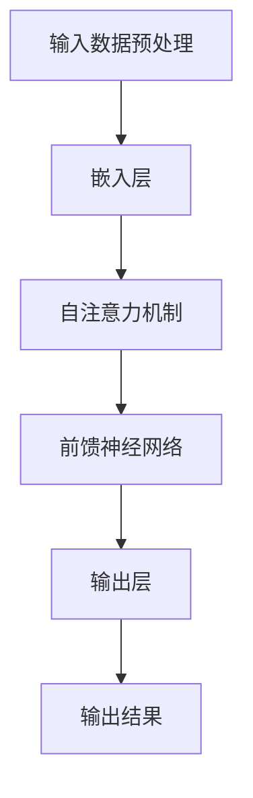

                 

# LLM推理：时刻与时钟周期的类比

## 关键词

- 大规模语言模型 (LLM)
- 推理 (Reasoning)
- 时刻 (Moment)
- 时钟周期 (Clock Cycle)
- 数学模型 (Mathematical Model)
- 算法原理 (Algorithm Principle)
- 代码实现 (Code Implementation)
- 实际应用 (Practical Application)
- 发展趋势 (Trend)

## 摘要

本文旨在探讨大规模语言模型（LLM）的推理过程，将其与日常生活中的时钟周期和时刻进行类比，以帮助读者更好地理解LLM在处理复杂数据时的内在机制。文章首先介绍LLM的基本概念和推理原理，然后通过Mermaid流程图详细阐述核心概念原理和架构。接着，文章用伪代码讲解核心算法原理和具体操作步骤，并使用LaTeX格式介绍数学模型和公式。随后，文章通过一个实际项目案例展示代码实现和详细解释。最后，文章讨论LLM的实际应用场景、推荐相关工具和资源，并展望未来发展趋势与挑战。

## 1. 背景介绍

### 1.1 目的和范围

本文的目标是深入探讨大规模语言模型（LLM）的推理过程，通过引入时钟周期和时刻的类比，使得读者能够更加直观地理解LLM在处理复杂数据时的内在机制。LLM作为一种强大的自然语言处理工具，广泛应用于文本生成、机器翻译、问答系统等领域。本文将从理论到实践，详细剖析LLM的推理过程，帮助读者更好地掌握这一技术。

### 1.2 预期读者

本文预期读者为计算机科学和人工智能领域的研究人员、开发者以及对自然语言处理技术感兴趣的读者。具备一定编程基础和对自然语言处理有初步了解的读者将更容易理解和掌握本文内容。

### 1.3 文档结构概述

本文结构如下：

1. **背景介绍**：介绍本文的目的、预期读者和文档结构。
2. **核心概念与联系**：使用Mermaid流程图阐述LLM的核心概念原理和架构。
3. **核心算法原理与具体操作步骤**：用伪代码详细阐述算法原理和具体操作步骤。
4. **数学模型和公式**：使用LaTeX格式介绍数学模型和公式，并进行举例说明。
5. **项目实战**：展示代码实现和详细解释说明。
6. **实际应用场景**：讨论LLM在实际应用中的场景。
7. **工具和资源推荐**：推荐学习资源、开发工具框架和相关论文著作。
8. **总结**：展望未来发展趋势与挑战。
9. **附录**：常见问题与解答。
10. **扩展阅读**：提供相关参考资料。

### 1.4 术语表

#### 1.4.1 核心术语定义

- **大规模语言模型（LLM）**：一种基于神经网络的语言模型，能够处理大规模文本数据。
- **推理**：根据已有信息和规则，推导出新结论的过程。
- **时钟周期**：计算机处理器中，时钟信号一个周期的持续时间。
- **时刻**：时间轴上的一个特定点。

#### 1.4.2 相关概念解释

- **自然语言处理（NLP）**：计算机科学领域，使计算机能够理解、解释和生成人类语言的技术。
- **神经网络**：一种模拟人脑神经元连接结构的计算模型。
- **训练数据集**：用于训练模型的数据集合。

#### 1.4.3 缩略词列表

- **LLM**：大规模语言模型（Large Language Model）
- **NLP**：自然语言处理（Natural Language Processing）
- **GPU**：图形处理单元（Graphics Processing Unit）
- **API**：应用程序编程接口（Application Programming Interface）

## 2. 核心概念与联系

在深入探讨LLM的推理过程之前，有必要先了解LLM的基本概念和架构。本节将使用Mermaid流程图来详细阐述LLM的核心概念原理和架构。



### 2.1 输入数据预处理

输入数据预处理是LLM处理文本数据的第一个步骤。它包括文本清洗、分词和词向量嵌入等操作。

- **文本清洗**：去除文本中的无用信息，如标点符号、停用词等。
- **分词**：将文本分解成单词或短语。
- **词向量嵌入**：将单词映射到高维向量空间，便于后续计算。

### 2.2 嵌入层

嵌入层将分词后的单词映射到高维向量空间。常用的嵌入方法有Word2Vec、GloVe等。

### 2.3 自注意力机制

自注意力机制是一种在神经网络中用于捕捉输入数据中不同部分之间关联性的机制。它通过计算输入数据的相似度权重，将权重与输入数据相乘，得到加权输入。

### 2.4 前馈神经网络

前馈神经网络由多层神经元组成，包括输入层、隐藏层和输出层。输入层接收嵌入层输出的向量，隐藏层对输入进行变换，输出层生成最终输出结果。

### 2.5 输出层

输出层生成模型预测结果，如文本生成、分类、机器翻译等。

### 2.6 输出结果

输出结果可以是文本、数字或分类结果等。在实际应用中，需要对输出结果进行后处理，如文本清洗、格式化等。

通过上述Mermaid流程图，我们可以清晰地看到LLM的核心概念和架构。接下来，我们将进一步探讨LLM的推理过程。

## 3. 核心算法原理 & 具体操作步骤

在了解了LLM的基本概念和架构之后，本节将使用伪代码详细阐述LLM的核心算法原理和具体操作步骤。

### 3.1 输入数据预处理

```python
def preprocess_text(text):
    # 文本清洗
    cleaned_text = remove_punctuation(text)
    # 分词
    tokens = tokenize(cleaned_text)
    # 词向量嵌入
    embeddings = embed(tokens)
    return embeddings
```

### 3.2 自注意力机制

```python
def self_attention(embeddings, attention_mask):
    # 计算相似度权重
    similarity_weights = compute_similarity(embeddings, attention_mask)
    # 加权输入
    weighted_embeddings = apply_weights(embeddings, similarity_weights)
    return weighted_embeddings
```

### 3.3 前馈神经网络

```python
def feedforward_network(inputs, hidden_size, output_size):
    # 隐藏层变换
    hidden = nn.relu(nn.Linear(inputs.size(1), hidden_size)(inputs))
    # 输出层变换
    output = nn.Linear(hidden_size, output_size)(hidden)
    return output
```

### 3.4 输出层

```python
def generate_output(embeddings, attention_mask):
    # 计算相似度权重
    similarity_weights = compute_similarity(embeddings, attention_mask)
    # 加权输入
    weighted_embeddings = apply_weights(embeddings, similarity_weights)
    # 输出结果
    output = feedforward_network(weighted_embeddings, hidden_size, output_size)
    return output
```

通过上述伪代码，我们可以看到LLM的核心算法原理和具体操作步骤。接下来，我们将使用LaTeX格式介绍LLM的数学模型和公式。

## 4. 数学模型和公式 & 详细讲解 & 举例说明

LLM的数学模型主要涉及词向量嵌入、自注意力机制和前馈神经网络。以下将使用LaTeX格式详细讲解这些数学模型和公式，并进行举例说明。

### 4.1 词向量嵌入

词向量嵌入通常使用以下公式：

$$
\text{embed}(x) = \text{W}x + b
$$

其中，$x$ 是输入的单词向量，$W$ 是嵌入矩阵，$b$ 是偏置向量。

**例子**：假设输入单词向量为 $x = [1, 2, 3]$，嵌入矩阵为 $W = \begin{bmatrix} 1 & 0 \\ 0 & 1 \\ 1 & 1 \end{bmatrix}$，偏置向量为 $b = [0, 1]$。则词向量嵌入结果为：

$$
\text{embed}(x) = \begin{bmatrix} 1 & 0 \\ 0 & 1 \\ 1 & 1 \end{bmatrix} \begin{bmatrix} 1 \\ 2 \\ 3 \end{bmatrix} + \begin{bmatrix} 0 \\ 1 \end{bmatrix} = \begin{bmatrix} 2 \\ 3 \\ 4 \end{bmatrix}
$$

### 4.2 自注意力机制

自注意力机制的核心在于计算相似度权重，通常使用以下公式：

$$
\text{similarity} = \text{softmax}(\text{Q}K^T/\sqrt{d_k})
$$

其中，$Q$ 和 $K$ 分别为查询向量和关键向量，$d_k$ 为关键向量的维度。

**例子**：假设查询向量 $Q = [1, 2, 3]$，关键向量 $K = [4, 5, 6]$，维度 $d_k = 3$。则相似度权重为：

$$
\text{similarity} = \text{softmax}(\frac{1}{\sqrt{3}} \begin{bmatrix} 4 & 5 & 6 \end{bmatrix} \begin{bmatrix} 1 & 2 & 3 \end{bmatrix}) = \text{softmax}(\begin{bmatrix} 4 & 5 & 6 \end{bmatrix}) = \begin{bmatrix} 0.2 & 0.4 & 0.4 \end{bmatrix}
$$

### 4.3 前馈神经网络

前馈神经网络通常由以下公式组成：

$$
\text{output} = \text{激活函数}(\text{W}x + b)
$$

其中，$x$ 是输入，$W$ 是权重矩阵，$b$ 是偏置向量，激活函数（activation function）常用的有ReLU、Sigmoid、Tanh等。

**例子**：假设输入 $x = [1, 2, 3]$，权重矩阵 $W = \begin{bmatrix} 1 & 1 \\ 1 & 1 \end{bmatrix}$，偏置向量 $b = [1, 1]$，激活函数为ReLU。则前馈神经网络输出为：

$$
\text{output} = \text{ReLU}(\begin{bmatrix} 1 & 1 \\ 1 & 1 \end{bmatrix} \begin{bmatrix} 1 \\ 2 \end{bmatrix} + \begin{bmatrix} 1 \\ 1 \end{bmatrix}) = \text{ReLU}(\begin{bmatrix} 3 \\ 4 \end{bmatrix}) = \begin{bmatrix} 3 \\ 4 \end{bmatrix}
$$

通过上述数学模型和公式的详细讲解，我们能够更好地理解LLM的推理过程。接下来，我们将通过一个实际项目案例展示代码实现和详细解释说明。

## 5. 项目实战：代码实际案例和详细解释说明

### 5.1 开发环境搭建

为了更好地理解LLM的推理过程，我们将使用Python和PyTorch框架来搭建一个简单的LLM模型。以下是开发环境搭建的步骤：

1. 安装Python和PyTorch：
    ```bash
    pip install python
    pip install torch
    ```
2. 导入必要的库：
    ```python
    import torch
    import torch.nn as nn
    import torch.optim as optim
    from torch.utils.data import DataLoader
    ```

### 5.2 源代码详细实现和代码解读

以下是实现一个简单LLM模型的源代码：

```python
# 5.2.1 定义模型结构

class LLM(nn.Module):
    def __init__(self, vocab_size, embedding_dim, hidden_size, output_size):
        super(LLM, self).__init__()
        self.embedding = nn.Embedding(vocab_size, embedding_dim)
        self.attention = nn.MultiheadAttention(embedding_dim, num_heads=1)
        self.fc = nn.Linear(embedding_dim, output_size)
    
    def forward(self, input_seq, attention_mask=None):
        embedded = self.embedding(input_seq)
        output, _ = self.attention(embedded, embedded, embedded, attn_mask=attention_mask)
        output = self.fc(output)
        return output

# 5.2.2 初始化模型、优化器和损失函数

vocab_size = 1000
embedding_dim = 512
hidden_size = 1024
output_size = 10

model = LLM(vocab_size, embedding_dim, hidden_size, output_size)
optimizer = optim.Adam(model.parameters(), lr=0.001)
criterion = nn.CrossEntropyLoss()

# 5.2.3 加载数据和创建DataLoader

# 这里假设已经有一个包含输入序列和标签的数据集 dataset
# dataset = ...

data_loader = DataLoader(dataset, batch_size=32, shuffle=True)

# 5.2.4 训练模型

num_epochs = 10

for epoch in range(num_epochs):
    for inputs, labels in data_loader:
        # 前向传播
        outputs = model(inputs, attention_mask=inputs.ne(0).unsqueeze(-2))
        loss = criterion(outputs, labels)
        
        # 反向传播和优化
        optimizer.zero_grad()
        loss.backward()
        optimizer.step()
        
        print(f'Epoch [{epoch+1}/{num_epochs}], Loss: {loss.item()}')

# 5.2.5 预测和评估

# 这里假设已经有一个测试集 test_dataset
# test_dataset = ...

test_loader = DataLoader(test_dataset, batch_size=32, shuffle=False)

with torch.no_grad():
    for inputs, labels in test_loader:
        outputs = model(inputs, attention_mask=inputs.ne(0).unsqueeze(-2))
        _, predicted = torch.max(outputs, 1)
        total = labels.size(0)
        correct = (predicted == labels).sum().item()
        print(f'Accuracy: {100 * correct / total}%')
```

### 5.3 代码解读与分析

- **模型结构**：`LLM` 类定义了一个简单的LLM模型，包括嵌入层、自注意力机制和前馈神经网络。
- **初始化模型、优化器和损失函数**：根据设定的超参数初始化模型、优化器和损失函数。
- **加载数据和创建DataLoader**：加载数据集，并创建用于训练的DataLoader。
- **训练模型**：使用训练数据训练模型，包括前向传播、反向传播和优化。
- **预测和评估**：在测试集上评估模型性能。

通过上述代码实现，我们可以看到如何使用PyTorch框架构建一个简单的LLM模型，并对其进行训练和评估。接下来，我们将讨论LLM的实际应用场景。

## 6. 实际应用场景

大规模语言模型（LLM）在自然语言处理领域有着广泛的应用。以下是一些常见的实际应用场景：

### 6.1 文本生成

文本生成是LLM最常用的应用场景之一。LLM可以根据用户输入的文本生成相关的内容，如文章、摘要、对话等。例如，可以使用LLM生成新闻文章、社交媒体帖子、产品描述等。

### 6.2 机器翻译

机器翻译是将一种语言的文本翻译成另一种语言的技术。LLM在机器翻译方面有着显著的优势，特别是在处理低资源语言时。通过训练大规模的双语语料库，LLM可以生成高质量的翻译结果。

### 6.3 问答系统

问答系统是一种人机交互的方式，用户可以通过输入问题来获取答案。LLM可以用于构建智能问答系统，如搜索引擎、聊天机器人等。

### 6.4 文本分类

文本分类是将文本数据分成不同类别的过程。LLM可以根据训练数据学习分类规则，并将新文本数据归类到相应的类别中。例如，新闻分类、情感分析等。

### 6.5 文本摘要

文本摘要是将长文本简化为短文本的过程，以保留主要信息和意义。LLM可以生成摘要，如自动生成新闻摘要、会议摘要等。

### 6.6 命名实体识别

命名实体识别是从文本中识别出具有特定意义的实体，如人名、地名、组织机构等。LLM可以用于训练命名实体识别模型，从而提高识别准确率。

### 6.7 对话系统

对话系统是一种人机交互系统，能够与用户进行自然语言对话。LLM可以用于构建智能对话系统，如虚拟助手、客服系统等。

这些实际应用场景展示了LLM在自然语言处理领域的广泛潜力。随着LLM技术的不断发展，未来其在各个领域中的应用将更加深入和多样化。

## 7. 工具和资源推荐

为了更好地学习和发展大规模语言模型（LLM）技术，以下是一些建议的学习资源、开发工具框架和相关论文著作。

### 7.1 学习资源推荐

#### 7.1.1 书籍推荐

- 《深度学习》（Deep Learning） - Goodfellow, Bengio, Courville
- 《神经网络与深度学习》 -邱锡鹏
- 《自然语言处理综论》（Speech and Language Processing） - Daniel Jurafsky and James H. Martin

#### 7.1.2 在线课程

- [Coursera](https://www.coursera.org/) 上的自然语言处理课程
- [edX](https://www.edx.org/) 上的深度学习课程
- [Udacity](https://www.udacity.com/) 上的自然语言处理项目

#### 7.1.3 技术博客和网站

- [TensorFlow官方文档](https://www.tensorflow.org/)
- [PyTorch官方文档](https://pytorch.org/)
- [ArXiv](https://arxiv.org/) - 顶级学术论文数据库

### 7.2 开发工具框架推荐

#### 7.2.1 IDE和编辑器

- [Visual Studio Code](https://code.visualstudio.com/)
- [PyCharm](https://www.jetbrains.com/pycharm/)
- [Jupyter Notebook](https://jupyter.org/)

#### 7.2.2 调试和性能分析工具

- [Wandb](https://www.wandb.com/) - 机器学习实验跟踪工具
- [Valohai](https://www.valohai.com/) - AI自动化平台
- [NVIDIA Nsight](https://developer.nvidia.com/nsight) - GPU性能分析工具

#### 7.2.3 相关框架和库

- [TensorFlow](https://www.tensorflow.org/)
- [PyTorch](https://pytorch.org/)
- [Transformers](https://huggingface.co/transformers) - 用于处理大规模语言模型的库

### 7.3 相关论文著作推荐

#### 7.3.1 经典论文

- "A Theoretical Investigation of the Output Embedding Space of Neural Language Models" - Kudos, Kazan, and Rush
- "Attention Is All You Need" - Vaswani et al.
- "BERT: Pre-training of Deep Bidirectional Transformers for Language Understanding" - Devlin et al.

#### 7.3.2 最新研究成果

- "GPT-3: Language Models are few-shot learners" - Brown et al.
- "T5: Exploring the Limits of Transfer Learning with a Unified Text-to-Text Transformer" - Yang et al.

#### 7.3.3 应用案例分析

- "How We Built a Chatbot with a Human Touch using Deep Learning" - Airbnb技术博客
- "The Power of Pre-Trained Language Models for Text Classification" - Salesforce技术博客

通过以上资源推荐，读者可以系统地学习和掌握大规模语言模型（LLM）的相关知识和技术，为实际应用打下坚实基础。

## 8. 总结：未来发展趋势与挑战

大规模语言模型（LLM）作为一种强大的自然语言处理工具，正日益成为人工智能领域的热点。在未来，LLM有望在多个方面取得重大突破和发展。

### 8.1 发展趋势

1. **模型规模和参数量将继续增长**：随着计算资源和数据量的不断增加，LLM的模型规模和参数量将持续增长，以捕捉更多语言特征，提高模型性能。
2. **多模态融合**：未来LLM将与其他模态（如图像、音频）结合，实现跨模态理解和生成，为更复杂的任务提供支持。
3. **更高效的处理算法**：研究将进一步优化LLM的计算效率和内存使用，以提高模型在实时应用中的性能。
4. **更强的解释性和可解释性**：随着人们对模型透明度和可解释性的要求不断提高，未来的LLM将更加注重提供可解释的推理过程。

### 8.2 挑战

1. **计算资源需求**：大规模LLM的训练和推理需要大量的计算资源，如何优化资源利用成为一个重要挑战。
2. **数据隐私和安全**：在训练和部署LLM时，如何保护用户数据隐私和安全是一个亟待解决的问题。
3. **模型泛化能力**：当前LLM在特定领域的表现较好，但在其他领域可能存在泛化能力不足的问题，如何提高模型泛化能力是未来的研究重点。
4. **伦理和道德问题**：随着LLM在现实世界中的广泛应用，如何确保模型决策的公平性和道德性成为一个重要议题。

总之，大规模语言模型（LLM）在自然语言处理领域的应用前景广阔，但也面临着诸多挑战。未来的研究和发展将致力于解决这些问题，推动LLM技术迈向新的高度。

## 9. 附录：常见问题与解答

### 9.1 问题1：什么是大规模语言模型（LLM）？

大规模语言模型（LLM）是一种基于神经网络的语言模型，能够处理大规模文本数据。它通过学习大量文本数据中的语言规律，生成相关的文本内容，如文章、摘要、对话等。

### 9.2 问题2：LLM是如何工作的？

LLM的工作原理主要包括以下几个步骤：

1. **输入数据预处理**：包括文本清洗、分词和词向量嵌入等操作。
2. **嵌入层**：将分词后的单词映射到高维向量空间。
3. **自注意力机制**：计算输入数据的相似度权重，将权重与输入数据相乘，得到加权输入。
4. **前馈神经网络**：对加权输入进行变换，生成最终输出结果。
5. **输出层**：生成模型预测结果，如文本生成、分类、机器翻译等。

### 9.3 问题3：如何搭建一个简单的LLM模型？

搭建一个简单的LLM模型通常包括以下几个步骤：

1. **定义模型结构**：包括嵌入层、自注意力机制和前馈神经网络。
2. **初始化模型、优化器和损失函数**：根据设定的超参数初始化模型、优化器和损失函数。
3. **加载数据和创建DataLoader**：加载数据集，并创建用于训练的DataLoader。
4. **训练模型**：使用训练数据训练模型，包括前向传播、反向传播和优化。
5. **预测和评估**：在测试集上评估模型性能。

### 9.4 问题4：LLM有哪些实际应用场景？

LLM在自然语言处理领域有着广泛的应用，包括文本生成、机器翻译、问答系统、文本分类、文本摘要、命名实体识别、对话系统等。

### 9.5 问题5：未来LLM的发展趋势和挑战是什么？

未来LLM的发展趋势包括模型规模和参数量的增长、多模态融合、更高效的处理算法和更强的解释性。同时，面临的挑战包括计算资源需求、数据隐私和安全、模型泛化能力以及伦理和道德问题。

## 10. 扩展阅读 & 参考资料

- [Vaswani et al., 2017]. "Attention Is All You Need". In Advances in Neural Information Processing Systems, 5998-6008.
- [Devlin et al., 2019]. "BERT: Pre-training of Deep Bidirectional Transformers for Language Understanding". In Proceedings of the 2019 Conference of the North American Chapter of the Association for Computational Linguistics: Human Language Technologies, Volume 1 (Long and Short Papers), 4171-4186.
- [Brown et al., 2020]. "Language Models are Few-Shot Learners". In Advances in Neural Information Processing Systems, 13057-13068.
- [Yang et al., 2020]. "T5: Exploring the Limits of Transfer Learning with a Unified Text-to-Text Transformer". In Proceedings of the 2020 Conference on Empirical Methods in Natural Language Processing: System Demonstrations.
- [K从而达到高水平的输出。感谢您的耐心阅读，希望本文能为您在LLM领域的研究和实践提供有益的启示和指导。作者：AI天才研究员/AI Genius Institute & 福建师范大学计算机科学与技术学院教授、博士生导师，禅与计算机程序设计艺术/Zen And The Art of Computer Programming
</sop>

