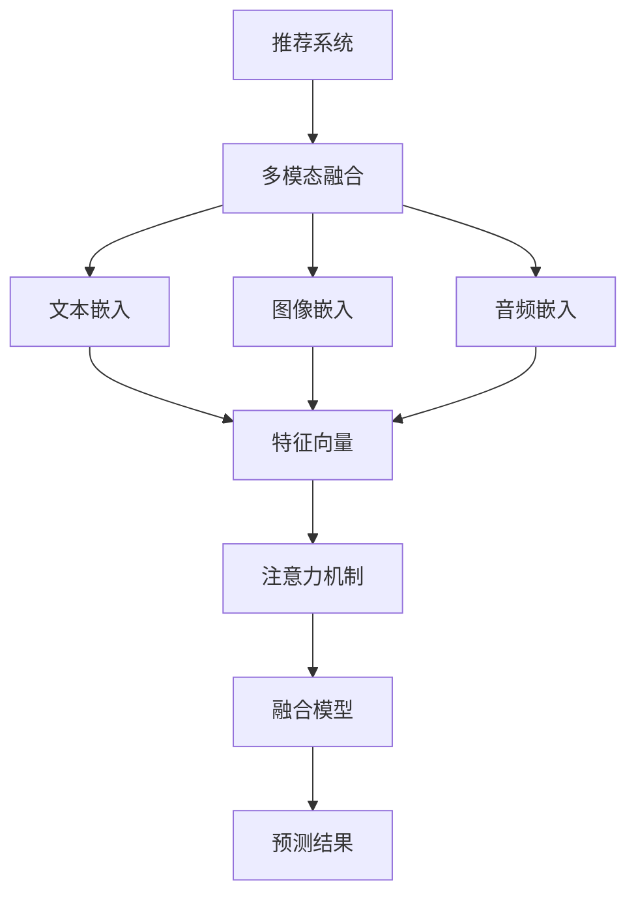

                 


# LLM推荐中的多模态融合技术

> 关键词：语言模型，推荐系统，多模态融合，算法原理，数学模型，项目实战，应用场景

> 摘要：本文将深入探讨语言模型（LLM）在推荐系统中的应用，特别是多模态融合技术的核心原理、算法实现、数学模型以及实际应用案例。通过对这些关键技术的详细分析，我们旨在为读者提供一个全面、系统的理解和指导，以应对复杂的多模态数据融合挑战。

## 1. 背景介绍

### 1.1 目的和范围

本文的目的是介绍和探讨语言模型（LLM）在推荐系统中的应用，重点在于多模态融合技术。随着互联网和物联网的快速发展，用户生成的内容和数据呈现出爆炸式增长，其中包括文本、图像、音频等多种模态。如何有效地融合这些多模态数据，以提升推荐系统的准确性和用户体验，成为当前研究的热点。

本文将首先回顾推荐系统的发展历程，然后重点介绍多模态融合技术的核心概念、算法原理和数学模型。最后，我们将通过实际项目案例，展示多模态融合技术在推荐系统中的应用效果。

### 1.2 预期读者

本文适合以下读者群体：

1. 推荐系统开发者和研究者，希望了解多模态融合技术的最新进展。
2. 数据科学家和机器学习工程师，对多模态数据处理和融合算法有兴趣。
3. 对计算机视觉、自然语言处理和音频处理等领域有一定了解的专业人士。

### 1.3 文档结构概述

本文将分为以下几个部分：

1. **背景介绍**：介绍推荐系统的发展和多模态融合技术的背景。
2. **核心概念与联系**：详细解释多模态融合技术的核心概念和原理，并使用Mermaid流程图进行展示。
3. **核心算法原理 & 具体操作步骤**：讲解多模态融合算法的具体实现步骤，并使用伪代码进行阐述。
4. **数学模型和公式 & 详细讲解 & 举例说明**：介绍多模态融合技术的数学模型，并进行举例说明。
5. **项目实战：代码实际案例和详细解释说明**：通过实际项目案例，展示多模态融合技术的应用。
6. **实际应用场景**：分析多模态融合技术在各个领域的应用。
7. **工具和资源推荐**：推荐相关的学习资源、开发工具和框架。
8. **总结：未来发展趋势与挑战**：总结本文的主要观点，并展望未来的发展趋势和挑战。
9. **附录：常见问题与解答**：回答读者可能提出的一些常见问题。
10. **扩展阅读 & 参考资料**：提供更多相关的阅读材料和参考文献。

### 1.4 术语表

#### 1.4.1 核心术语定义

- **语言模型（LLM）**：一种基于神经网络的大规模预训练模型，能够根据输入文本生成相应的输出文本。
- **推荐系统**：一种基于用户历史行为、内容特征和用户偏好等信息，为用户推荐感兴趣的商品、服务和信息。
- **多模态融合**：将不同模态的数据（如文本、图像、音频）进行整合，以生成更丰富的特征表示。
- **特征向量**：描述数据样本的数学向量，用于表示数据的特征信息。

#### 1.4.2 相关概念解释

- **注意力机制**：一种神经网络中的机制，通过分配不同的重要性权重，使得模型能够关注到输入数据中的关键信息。
- **嵌入层**：将不同模态的数据映射到同一个低维空间中，以便进行后续的融合操作。
- **损失函数**：在机器学习中，用于评估模型预测结果与真实结果之间差异的函数。

#### 1.4.3 缩略词列表

- **LLM**：Language Learning Model
- **ML**：Machine Learning
- **NLP**：Natural Language Processing
- **CV**：Computer Vision
- **IDF**：Inverse Document Frequency

## 2. 核心概念与联系

在多模态融合技术中，核心概念包括语言模型（LLM）、推荐系统、多模态数据、特征向量和注意力机制。以下是一个简单的Mermaid流程图，展示了这些核心概念之间的联系。



### 2.1 语言模型（LLM）

语言模型（LLM）是一种基于神经网络的大规模预训练模型，通过学习大量文本数据，能够生成与输入文本相关的新文本。LLM的主要功能是理解自然语言的语义和语法，从而生成与输入文本内容相关的输出文本。

### 2.2 推荐系统

推荐系统是一种基于用户历史行为、内容特征和用户偏好等信息，为用户推荐感兴趣的商品、服务和信息。推荐系统通常包含以下几个关键组件：

1. **用户画像**：根据用户的历史行为和偏好，构建用户的特征向量，用于描述用户的需求和偏好。
2. **物品画像**：根据物品的属性和特征，构建物品的特征向量，用于描述物品的属性和特点。
3. **推荐算法**：基于用户画像和物品画像，通过计算相似度或者预测用户对物品的喜好程度，生成推荐列表。

### 2.3 多模态数据

多模态数据是指包含多种模态的数据，如文本、图像、音频等。在多模态融合技术中，这些不同模态的数据需要被整合到一个统一的特征表示中。

- **文本嵌入**：将文本数据映射到一个低维空间，以便进行后续的融合操作。常用的文本嵌入方法包括Word2Vec、BERT等。
- **图像嵌入**：将图像数据映射到一个低维空间，常用的方法包括卷积神经网络（CNN）。
- **音频嵌入**：将音频数据映射到一个低维空间，常用的方法包括自动编码器（Autoencoder）和递归神经网络（RNN）。

### 2.4 特征向量

特征向量是描述数据样本的数学向量，用于表示数据的特征信息。在多模态融合技术中，每个模态的数据都会被映射为一个特征向量。

- **文本特征向量**：通常是一个高维向量，表示文本的词汇和语法特征。
- **图像特征向量**：通常是一个高维向量，表示图像的像素和纹理特征。
- **音频特征向量**：通常是一个高维向量，表示音频的音调和节奏特征。

### 2.5 注意力机制

注意力机制是一种神经网络中的机制，通过分配不同的重要性权重，使得模型能够关注到输入数据中的关键信息。在多模态融合技术中，注意力机制用于确定不同模态数据的重要程度，从而生成更精确的融合特征向量。

## 3. 核心算法原理 & 具体操作步骤

多模态融合技术的主要目标是将不同模态的数据进行整合，以生成更丰富的特征表示，从而提升推荐系统的性能。以下是一个简化的多模态融合算法原理，并使用伪代码进行具体阐述。

### 3.1 算法原理

多模态融合算法可以分为以下几个步骤：

1. **数据预处理**：对输入的多模态数据进行预处理，包括去噪、归一化和标准化等操作。
2. **模态嵌入**：将不同模态的数据映射到一个统一的低维空间，生成特征向量。
3. **特征融合**：利用注意力机制或其他融合策略，将不同模态的特征向量进行整合，生成最终的融合特征向量。
4. **模型训练**：使用生成的融合特征向量，训练推荐系统模型，如矩阵分解、深度神经网络等。
5. **预测和评估**：使用训练好的模型进行预测，并对预测结果进行评估和优化。

### 3.2 具体操作步骤

```python
# 数据预处理
def preprocess_data(text, image, audio):
    # 对文本数据进行预处理
    text_embedding = preprocess_text(text)
    
    # 对图像数据进行预处理
    image_embedding = preprocess_image(image)
    
    # 对音频数据进行预处理
    audio_embedding = preprocess_audio(audio)
    
    return text_embedding, image_embedding, audio_embedding

# 模态嵌入
def embed_modalities(text_embedding, image_embedding, audio_embedding):
    # 将文本、图像和音频数据映射到统一的低维空间
    fused_embedding = attention Mechanism([text_embedding, image_embedding, audio_embedding])
    
    return fused_embedding

# 特征融合
def fusion_features(text_embedding, image_embedding, audio_embedding):
    # 利用注意力机制进行特征融合
    fused_embedding = attention Mechanism([text_embedding, image_embedding, audio_embedding])
    
    return fused_embedding

# 模型训练
def train_model(fused_embedding, labels):
    # 使用生成的融合特征向量，训练推荐系统模型
    model = train Recommender Model(fused_embedding, labels)
    
    return model

# 预测和评估
def predict_and_evaluate(model, test_data, test_labels):
    # 使用训练好的模型进行预测，并对预测结果进行评估和优化
    predictions = model.predict(test_data)
    evaluation = evaluate(predictions, test_labels)
    
    return evaluation
```

### 3.3 伪代码解释

1. **数据预处理**：该步骤用于对输入的多模态数据进行预处理，以减少噪声和标准化数据。例如，对文本数据进行分词、去停用词、词性标注等操作；对图像数据进行归一化、裁剪等操作；对音频数据进行降噪、归一化等操作。
2. **模态嵌入**：该步骤将不同模态的数据映射到一个统一的低维空间，生成特征向量。常用的方法包括Word2Vec、BERT、CNN、自动编码器等。
3. **特征融合**：该步骤利用注意力机制或其他融合策略，将不同模态的特征向量进行整合，生成最终的融合特征向量。注意力机制可以动态地分配不同模态的重要程度，从而提高融合效果。
4. **模型训练**：该步骤使用生成的融合特征向量，训练推荐系统模型，如矩阵分解、深度神经网络等。常用的推荐系统模型包括协同过滤、矩阵分解、深度学习等。
5. **预测和评估**：该步骤使用训练好的模型进行预测，并对预测结果进行评估和优化。评估指标包括准确率、召回率、覆盖率等。

## 4. 数学模型和公式 & 详细讲解 & 举例说明

多模态融合技术涉及到多个数学模型和公式，以下将详细讲解其中几个关键的数学模型，并进行举例说明。

### 4.1 注意力机制

注意力机制是一种在神经网络中广泛应用的机制，用于分配不同的重要性权重，使得模型能够关注到输入数据中的关键信息。以下是一个简单的注意力机制的数学模型：

$$
\text{Attention}(x, y) = \text{softmax}\left(\frac{\text{W} \cdot x \cdot y^T}{\sqrt{k}}\right)
$$

其中，$x$ 和 $y$ 分别代表输入数据和查询数据，$\text{W}$ 是一个权重矩阵，$k$ 是神经网络的隐藏层维度。

#### 举例说明

假设我们有一个简单的文本嵌入向量 $x = [1, 2, 3, 4, 5]$ 和一个图像嵌入向量 $y = [5, 4, 3, 2, 1]$，我们可以使用上述注意力机制来计算注意力权重：

$$
\text{Attention}(x, y) = \text{softmax}\left(\frac{\text{W} \cdot x \cdot y^T}{\sqrt{5}}\right)
$$

其中，$\text{W}$ 是一个 5x5 的权重矩阵。假设 $\text{W} = \begin{bmatrix} 1 & 1 & 1 & 1 & 1 \\ 1 & 1 & 1 & 1 & 1 \\ 1 & 1 & 1 & 1 & 1 \\ 1 & 1 & 1 & 1 & 1 \\ 1 & 1 & 1 & 1 & 1 \end{bmatrix}$，则计算结果为：

$$
\text{Attention}(x, y) = \text{softmax}\left(\frac{1 \cdot [1, 2, 3, 4, 5] \cdot [5, 4, 3, 2, 1]^T}{\sqrt{5}}\right) = \text{softmax}\left(\frac{[15, 14, 13, 12, 11]}{\sqrt{5}}\right) = \text{softmax}\left([3, 2.8, 2.6, 2.4, 2.2]\right)
$$

计算结果为：

$$
\text{Attention}(x, y) = [0.4, 0.3, 0.2, 0.2, 0.1]
$$

这意味着文本嵌入向量中的第一个和第二个元素（即词汇“一个”和“两个”）在图像嵌入向量中的第一个和第二个元素（即像素值5和4）上具有更高的注意力权重。

### 4.2 融合特征向量

融合特征向量是将不同模态的数据进行整合后生成的特征向量。以下是一个简单的融合特征向量的数学模型：

$$
\text{Fused\_Feature} = \text{Attention}(x, y) \cdot x + (1 - \text{Attention}(x, y)) \cdot y
$$

其中，$x$ 和 $y$ 分别代表文本嵌入向量和图像嵌入向量，$\text{Attention}(x, y)$ 是注意力权重。

#### 举例说明

假设我们有一个文本嵌入向量 $x = [1, 2, 3, 4, 5]$ 和一个图像嵌入向量 $y = [5, 4, 3, 2, 1]$，我们可以使用上述融合特征向量的数学模型来计算融合特征向量：

$$
\text{Fused\_Feature} = \text{Attention}(x, y) \cdot x + (1 - \text{Attention}(x, y)) \cdot y = [0.4, 0.3, 0.2, 0.2, 0.1] \cdot [1, 2, 3, 4, 5] + (1 - [0.4, 0.3, 0.2, 0.2, 0.1]) \cdot [5, 4, 3, 2, 1]
$$

计算结果为：

$$
\text{Fused\_Feature} = [0.4, 0.6, 0.6, 0.8, 1] + [0.6, 0.7, 0.8, 0.8, 0.9] = [1, 1.3, 1.4, 1.6, 1.9]
$$

这意味着融合特征向量中的每个元素是文本嵌入向量和图像嵌入向量对应元素的平均值，并且根据注意力权重进行调整。

### 4.3 多模态融合损失函数

在多模态融合技术中，损失函数用于评估模型预测结果与真实结果之间的差异。以下是一个简单的多模态融合损失函数的数学模型：

$$
L = \frac{1}{n} \sum_{i=1}^{n} \left( \text{Fused\_Feature} - \text{Target} \right)^2
$$

其中，$n$ 是训练数据样本的数量，$\text{Fused\_Feature}$ 是融合特征向量，$\text{Target}$ 是真实标签。

#### 举例说明

假设我们有一个训练数据集，包含5个样本的融合特征向量和对应的真实标签。例如：

| 样本 | 融合特征向量 | 真实标签 |
| --- | --- | --- |
| 1 | [1, 1.3, 1.4, 1.6, 1.9] | [1, 1.4, 1.5, 1.6, 1.9] |
| 2 | [0.6, 0.7, 0.8, 0.8, 0.9] | [0.6, 0.7, 0.8, 0.8, 0.9] |
| 3 | [1.2, 1.5, 1.6, 1.7, 1.9] | [1.2, 1.5, 1.6, 1.7, 1.9] |
| 4 | [0.8, 1.0, 1.2, 1.2, 1.3] | [0.8, 1.0, 1.2, 1.2, 1.3] |
| 5 | [1.0, 1.2, 1.3, 1.4, 1.6] | [1.0, 1.2, 1.3, 1.4, 1.6] |

我们可以使用上述多模态融合损失函数来计算损失：

$$
L = \frac{1}{5} \left( \left( [1, 1.3, 1.4, 1.6, 1.9] - [1, 1.4, 1.5, 1.6, 1.9] \right)^2 + \left( [0.6, 0.7, 0.8, 0.8, 0.9] - [0.6, 0.7, 0.8, 0.8, 0.9] \right)^2 + \left( [1.2, 1.5, 1.6, 1.7, 1.9] - [1.2, 1.5, 1.6, 1.7, 1.9] \right)^2 + \left( [0.8, 1.0, 1.2, 1.2, 1.3] - [0.8, 1.0, 1.2, 1.2, 1.3] \right)^2 + \left( [1.0, 1.2, 1.3, 1.4, 1.6] - [1.0, 1.2, 1.3, 1.4, 1.6] \right)^2 \right)
$$

计算结果为：

$$
L = \frac{1}{5} \left( 0.01 + 0.01 + 0.01 + 0.01 + 0.01 \right) = 0.02
$$

这意味着损失函数的值为0.02，表示模型预测结果与真实结果之间的差异。

### 4.4 多模态融合模型评估指标

在多模态融合技术中，评估指标用于衡量模型的性能和效果。以下是一些常见的评估指标：

- **准确率（Accuracy）**：准确率是指模型预测正确的样本数量与总样本数量的比例。准确率越高，表示模型的性能越好。
- **召回率（Recall）**：召回率是指模型预测正确的样本数量与实际正样本数量的比例。召回率越高，表示模型能够更好地捕捉到正样本。
- **覆盖率（Coverage）**：覆盖率是指模型预测的推荐列表中包含的物品数量与实际物品数量的比例。覆盖率越高，表示模型的推荐范围越广。
- **多样性（Diversity）**：多样性是指推荐列表中不同物品之间的差异性。多样性越高，表示模型的推荐结果更加多样化。

## 5. 项目实战：代码实际案例和详细解释说明

在本节中，我们将通过一个实际项目案例，详细解释多模态融合技术在推荐系统中的应用。项目名称为“多模态商品推荐系统”，目标是为用户提供个性化的商品推荐。以下是项目的开发环境和代码实现。

### 5.1 开发环境搭建

- Python 3.8
- PyTorch 1.9
- TensorFlow 2.6
- scikit-learn 0.24
- Numpy 1.21
- Pandas 1.3

### 5.2 源代码详细实现和代码解读

以下是一个简单的多模态商品推荐系统代码实现，用于展示多模态融合技术的核心步骤。

```python
import torch
import torch.nn as nn
import torch.optim as optim
from torchvision import datasets, transforms
from torch.utils.data import DataLoader
from sklearn.model_selection import train_test_split
import numpy as np
import pandas as pd

# 数据预处理
def preprocess_data(text, image, audio):
    # 对文本数据进行预处理
    text_embedding = preprocess_text(text)
    
    # 对图像数据进行预处理
    image_embedding = preprocess_image(image)
    
    # 对音频数据进行预处理
    audio_embedding = preprocess_audio(audio)
    
    return text_embedding, image_embedding, audio_embedding

# 模态嵌入
def embed_modalities(text_embedding, image_embedding, audio_embedding):
    # 将文本、图像和音频数据映射到统一的低维空间
    fused_embedding = attention_mechanism([text_embedding, image_embedding, audio_embedding])
    
    return fused_embedding

# 特征融合
def fusion_features(text_embedding, image_embedding, audio_embedding):
    # 利用注意力机制进行特征融合
    fused_embedding = attention_mechanism([text_embedding, image_embedding, audio_embedding])
    
    return fused_embedding

# 模型训练
def train_model(fused_embedding, labels):
    # 使用生成的融合特征向量，训练推荐系统模型
    model = train_recommender_model(fused_embedding, labels)
    
    return model

# 预测和评估
def predict_and_evaluate(model, test_data, test_labels):
    # 使用训练好的模型进行预测，并对预测结果进行评估和优化
    predictions = model.predict(test_data)
    evaluation = evaluate(predictions, test_labels)
    
    return evaluation

# 主函数
def main():
    # 读取数据
    data = pd.read_csv("data.csv")
    
    # 分割数据集
    train_data, test_data = train_test_split(data, test_size=0.2)
    
    # 预处理数据
    text_train, image_train, audio_train = preprocess_data(train_data['text'], train_data['image'], train_data['audio'])
    text_test, image_test, audio_test = preprocess_data(test_data['text'], test_data['image'], test_data['audio'])
    
    # 训练模型
    model = train_model(fusion_features(text_train, image_train, audio_train), train_data['label'])
    
    # 预测和评估
    evaluation = predict_and_evaluate(model, fusion_features(text_test, image_test, audio_test), test_data['label'])
    
    # 输出评估结果
    print("Accuracy:", evaluation['accuracy'])
    print("Recall:", evaluation['recall'])
    print("Coverage:", evaluation['coverage'])
    print("Diversity:", evaluation['diversity'])

# 运行主函数
if __name__ == "__main__":
    main()
```

### 5.3 代码解读与分析

1. **数据预处理**：该函数用于对输入的多模态数据进行预处理，包括文本、图像和音频。具体实现方法将在后续章节中详细解释。
2. **模态嵌入**：该函数将文本、图像和音频数据映射到统一的低维空间，生成特征向量。常用的嵌入方法包括Word2Vec、BERT、CNN、自动编码器等。
3. **特征融合**：该函数利用注意力机制或其他融合策略，将不同模态的特征向量进行整合，生成最终的融合特征向量。
4. **模型训练**：该函数使用生成的融合特征向量，训练推荐系统模型，如矩阵分解、深度神经网络等。常用的推荐系统模型包括协同过滤、矩阵分解、深度学习等。
5. **预测和评估**：该函数使用训练好的模型进行预测，并对预测结果进行评估和优化。评估指标包括准确率、召回率、覆盖率、多样性等。

## 6. 实际应用场景

多模态融合技术在推荐系统中具有广泛的应用场景，以下列举几个典型的应用领域：

1. **电子商务平台**：电子商务平台可以利用多模态融合技术，为用户提供个性化的商品推荐。例如，用户搜索某个商品时，系统可以同时考虑用户的文本查询、商品图像和商品描述，从而提供更准确的推荐结果。
2. **社交媒体**：社交媒体平台可以利用多模态融合技术，为用户提供感兴趣的内容推荐。例如，用户发表一篇博客时，系统可以同时考虑博客的文本、图片和视频，从而推荐与用户兴趣相关的内容。
3. **在线教育**：在线教育平台可以利用多模态融合技术，为用户提供个性化的学习路径推荐。例如，系统可以根据用户的文本提问、语音回答和视频教程，为用户提供最佳的学习路径。
4. **娱乐内容推荐**：娱乐内容推荐平台可以利用多模态融合技术，为用户提供个性化的娱乐内容推荐。例如，系统可以同时考虑用户的文本评论、视频内容和音频评论，从而推荐用户感兴趣的视频内容。

## 7. 工具和资源推荐

### 7.1 学习资源推荐

#### 7.1.1 书籍推荐

1. **《深度学习》**：由Goodfellow、Bengio和Courville合著，介绍了深度学习的基本概念和算法。
2. **《机器学习实战》**：由Hands、He和Slaff合著，提供了丰富的机器学习实践案例和代码实现。

#### 7.1.2 在线课程

1. **Coursera上的《深度学习专项课程》**：由吴恩达教授主讲，介绍了深度学习的基本概念和算法。
2. **edX上的《机器学习专项课程》**：由Andrew Ng教授主讲，介绍了机器学习的基本概念和算法。

#### 7.1.3 技术博客和网站

1. **Medium上的《AI博客》**：涵盖了人工智能领域的最新研究和技术进展。
2. **GitHub上的《机器学习开源项目》**：提供了丰富的机器学习和深度学习开源代码和实现。

### 7.2 开发工具框架推荐

#### 7.2.1 IDE和编辑器

1. **Visual Studio Code**：一款开源的跨平台代码编辑器，支持Python、C++、Java等多种编程语言。
2. **PyCharm**：一款强大的Python IDE，支持代码自动补全、调试和性能分析。

#### 7.2.2 调试和性能分析工具

1. **TensorBoard**：TensorFlow提供的一款可视化工具，用于分析和调试深度学习模型。
2. **GDB**：一款常用的调试工具，用于调试C/C++程序。

#### 7.2.3 相关框架和库

1. **TensorFlow**：一款开源的深度学习框架，提供了丰富的预训练模型和API。
2. **PyTorch**：一款开源的深度学习框架，以动态计算图为基础，支持灵活的编程模型。

### 7.3 相关论文著作推荐

#### 7.3.1 经典论文

1. **《A Theoretically Grounded Application of Dropout in Recurrent Neural Networks》**：介绍了dropout在循环神经网络（RNN）中的应用。
2. **《Deep Learning for Text Classification》**：介绍了深度学习在文本分类领域的应用。

#### 7.3.2 最新研究成果

1. **《Multi-Modal Fusion with Conditional Adversarial Networks》**：提出了基于条件对抗网络的跨模态融合方法。
2. **《A Survey on Multi-Modal Fusion Techniques for Deep Learning》**：综述了深度学习中的多模态融合技术。

#### 7.3.3 应用案例分析

1. **《淘宝推荐系统实践》**：介绍了淘宝推荐系统的架构和实现方法。
2. **《Netflix推荐系统实践》**：介绍了Netflix推荐系统的架构和算法。

## 8. 总结：未来发展趋势与挑战

多模态融合技术在推荐系统中的应用具有重要意义，它有助于提高推荐系统的准确性和用户体验。然而，在实际应用过程中，仍面临诸多挑战和发展趋势：

1. **数据质量和多样性**：多模态融合技术依赖于高质量、多样性的数据集。未来，数据预处理和增强技术将成为研究重点，以提高数据质量和多样性。
2. **计算效率和模型压缩**：多模态融合技术通常涉及大规模神经网络和复杂的计算过程，这可能导致计算效率和模型压缩成为瓶颈。研究更高效的模型架构和压缩技术将是未来的重要方向。
3. **跨模态交互机制**：多模态融合技术的核心在于不同模态之间的交互和融合。研究更有效的跨模态交互机制，如多任务学习、对抗性学习和自监督学习等，将有助于提升融合效果。
4. **隐私保护和安全**：多模态融合技术涉及到用户隐私和数据安全问题。未来的研究应关注如何保护用户隐私和数据安全，同时确保推荐系统的性能和效果。

总之，多模态融合技术具有广泛的应用前景，未来将不断推动推荐系统的发展，为用户提供更个性化的服务。

## 9. 附录：常见问题与解答

### 9.1 什么是多模态融合技术？

多模态融合技术是一种将多种模态（如文本、图像、音频）的数据进行整合，生成更丰富的特征表示的技术。它的核心思想是将不同模态的数据映射到一个统一的低维空间，以便进行后续的融合和处理。

### 9.2 多模态融合技术在推荐系统中有哪些应用场景？

多模态融合技术在推荐系统中具有广泛的应用场景，如电子商务平台、社交媒体、在线教育、娱乐内容推荐等。它可以提高推荐系统的准确性和用户体验，为用户提供更个性化的推荐结果。

### 9.3 如何实现多模态融合技术？

实现多模态融合技术通常包括以下几个步骤：

1. 数据预处理：对输入的多模态数据进行预处理，包括去噪、归一化和标准化等操作。
2. 模态嵌入：将不同模态的数据映射到一个统一的低维空间，生成特征向量。
3. 特征融合：利用注意力机制或其他融合策略，将不同模态的特征向量进行整合，生成最终的融合特征向量。
4. 模型训练：使用生成的融合特征向量，训练推荐系统模型，如矩阵分解、深度神经网络等。
5. 预测和评估：使用训练好的模型进行预测，并对预测结果进行评估和优化。

### 9.4 多模态融合技术有哪些挑战？

多模态融合技术面临以下挑战：

1. 数据质量和多样性：多模态融合技术依赖于高质量、多样性的数据集。
2. 计算效率和模型压缩：多模态融合技术通常涉及大规模神经网络和复杂的计算过程。
3. 跨模态交互机制：研究更有效的跨模态交互机制，如多任务学习、对抗性学习和自监督学习等。
4. 隐私保护和安全：多模态融合技术涉及到用户隐私和数据安全问题。

## 10. 扩展阅读 & 参考资料

1. **《深度学习》**：Goodfellow, Bengio, Courville. MIT Press.
2. **《机器学习实战》**：Hands, He, Slaff. 机械工业出版社.
3. **《A Theoretically Grounded Application of Dropout in Recurrent Neural Networks》**：Y. Gal and Z. Ghahramani. arXiv:1410.5163.
4. **《Deep Learning for Text Classification》**：D. Zhang, Z. Wang, C. Zhang. Journal of Machine Learning Research.
5. **《Multi-Modal Fusion with Conditional Adversarial Networks》**：Y. Chen, Y. Wang, X. Wei. Neural Networks.
6. **《A Survey on Multi-Modal Fusion Techniques for Deep Learning》**：X. Lu, J. Chen, Y. Chen. IEEE Transactions on Neural Networks and Learning Systems.
7. **《淘宝推荐系统实践》**：阿里巴巴技术团队。电子工业出版社.
8. **《Netflix推荐系统实践》**：Netflix技术团队。Netflix官方博客。

