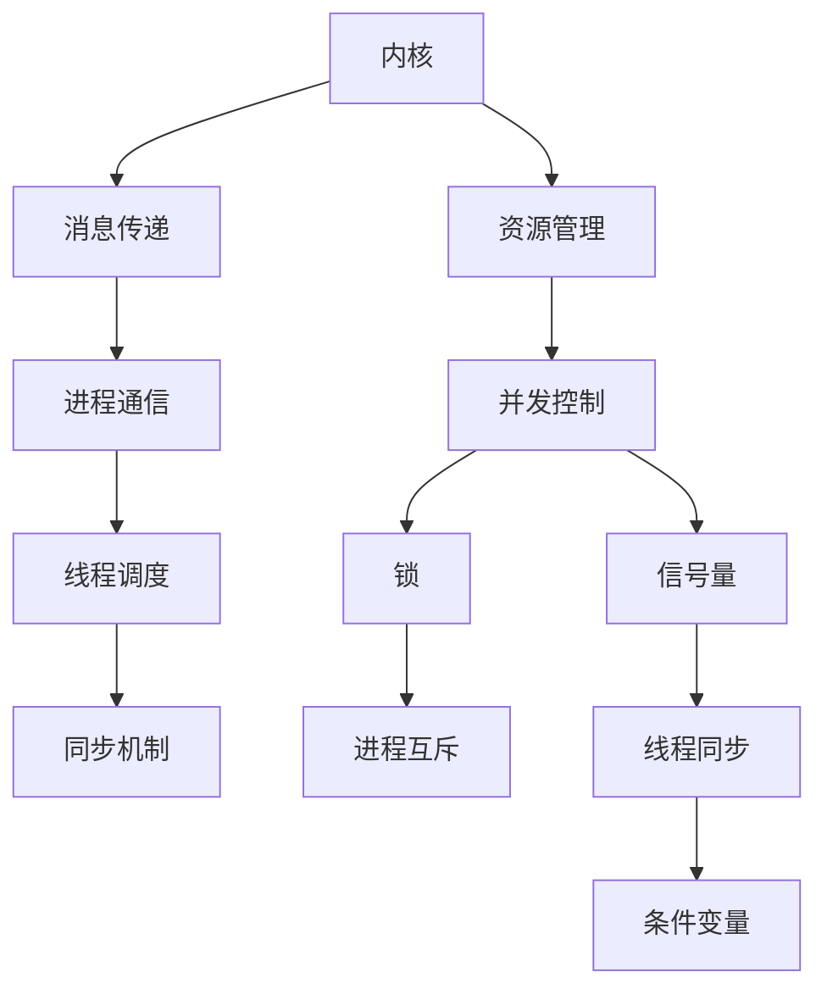

                 

# LLM操作系统的核心组件：内核、消息和线程

> **关键词：** 大语言模型 (LLM),操作系统，内核，消息传递，线程，并发控制，同步机制，并发编程，分布式系统。

> **摘要：** 本文将深入探讨大型语言模型（LLM）操作系统的核心组件——内核、消息和线程。我们将从基础概念出发，逐步分析这些组件的工作原理、相互关系以及在实际应用中的重要性。通过详细的讲解和示例，帮助读者理解这些关键组件在现代计算机系统和人工智能领域的应用。

## 1. 背景介绍

### 1.1 目的和范围

本文旨在为读者提供一个关于大型语言模型操作系统核心组件的全面视角。我们将重点讨论内核、消息和线程这三个关键组件，并详细分析它们在操作系统中的作用、相互关系以及如何协同工作以支持复杂的计算任务。本文适合对操作系统和计算机科学有一定了解的读者，特别是那些对大型语言模型和人工智能感兴趣的技术人员。

### 1.2 预期读者

预期读者应具备以下背景知识：

- 基础的计算机科学和操作系统原理；
- 熟悉编程语言和算法；
- 对大型语言模型（如LLM）的基本理解。

### 1.3 文档结构概述

本文将按照以下结构展开：

1. **背景介绍**：介绍文章的目的、预期读者以及文档结构；
2. **核心概念与联系**：通过Mermaid流程图展示核心概念和架构；
3. **核心算法原理 & 具体操作步骤**：使用伪代码详细阐述核心算法；
4. **数学模型和公式 & 详细讲解 & 举例说明**：介绍相关数学模型和公式；
5. **项目实战：代码实际案例和详细解释说明**：通过实际代码案例进行解释；
6. **实际应用场景**：讨论这些组件在实际应用中的场景；
7. **工具和资源推荐**：推荐学习资源和开发工具；
8. **总结：未来发展趋势与挑战**：总结文章的主要观点；
9. **附录：常见问题与解答**：回答一些常见问题；
10. **扩展阅读 & 参考资料**：提供进一步阅读的资料。

### 1.4 术语表

#### 1.4.1 核心术语定义

- **内核（Kernel）**：操作系统核心组件，负责管理系统资源、处理硬件中断和执行系统调用；
- **消息传递（Message Passing）**：进程间通信的一种方式，通过发送和接收消息实现数据交换；
- **线程（Thread）**：进程内的一个执行单元，共享进程资源，可以独立执行；
- **并发控制（Concurrency Control）**：确保多个线程或进程在共享资源时不会相互干扰的技术；
- **同步机制（Synchronization Mechanism）**：协调多个线程或进程执行的技术，如锁、信号量等；
- **并发编程（Concurrency Programming）**：编写能够有效利用多处理器或多核CPU的程序的技巧。

#### 1.4.2 相关概念解释

- **分布式系统（Distributed System）**：由多个独立计算机组成的系统，通过网络进行通信和协同工作；
- **进程（Process）**：正在运行的程序实例，拥有独立的内存空间和系统资源；
- **内存管理（Memory Management）**：操作系统负责分配、回收和管理内存资源；
- **调度（Scheduling）**：操作系统根据一定的策略选择哪个进程或线程获得CPU时间。

#### 1.4.3 缩略词列表

- **LLM**：大型语言模型（Large Language Model）
- **OS**：操作系统（Operating System）
- **CPU**：中央处理器（Central Processing Unit）
- **GPU**：图形处理器（Graphics Processing Unit）

## 2. 核心概念与联系

在深入探讨大型语言模型操作系统的核心组件之前，我们首先需要理解这些核心概念之间的联系。以下是内核、消息和线程之间关系的Mermaid流程图：



### 2.1 资源管理

内核负责管理计算机系统的资源，包括CPU时间、内存、磁盘空间等。它通过调度算法确保每个进程或线程能够公平地获取资源，提高系统效率。资源管理是内核的核心功能之一，直接影响到系统的稳定性和性能。

### 2.2 并发控制

并发控制是操作系统中的一个关键问题，它确保多个线程或进程在共享资源时不会相互干扰。常见的并发控制技术包括锁、信号量、条件变量等。锁用于实现进程或线程之间的互斥访问，信号量用于协调线程间的同步，条件变量用于线程间的条件等待。

### 2.3 消息传递

消息传递是进程间通信的一种重要方式。通过发送和接收消息，进程可以实现数据交换和协同工作。消息传递机制在分布式系统中尤为重要，它支持节点间的通信和协作。消息传递机制可以基于共享内存、消息队列、套接字等多种方式实现。

### 2.4 进程通信

进程通信是指进程间交换信息和数据的过程。消息传递是实现进程通信的一种手段，它允许不同进程共享数据和资源。进程通信在多进程程序中至关重要，它支持并行计算和分布式计算，提高系统的性能和可扩展性。

### 2.5 线程调度

线程调度是操作系统中的一个重要问题，它决定了哪个线程可以获得CPU时间。线程调度算法可以根据线程的优先级、执行时间、资源需求等因素进行选择。高效的线程调度算法可以提高系统的响应速度和处理能力。

### 2.6 同步机制

同步机制是协调多个线程或进程执行的技术，确保它们在合适的时候访问共享资源。常见的同步机制包括锁、信号量、条件变量等。锁用于实现进程或线程之间的互斥访问，信号量用于协调线程间的同步，条件变量用于线程间的条件等待。

通过上述Mermaid流程图，我们可以清晰地看到内核、消息和线程之间的相互关系。内核通过资源管理和并发控制确保系统的稳定性和性能，消息传递和进程通信支持进程间的数据交换和协作，线程调度和同步机制则确保线程的有序执行和资源共享。

## 3. 核心算法原理 & 具体操作步骤

### 3.1 资源管理算法原理

内核的资源管理算法主要包括CPU调度、内存管理和磁盘管理。以下将分别介绍这些算法的原理。

#### 3.1.1 CPU调度算法

CPU调度算法负责决定哪个进程或线程获得CPU时间。常见的调度算法有：

- **先来先服务（FCFS）**：按照进程或线程到达的顺序进行调度；
- **最短作业优先（SJF）**：优先调度执行时间最短的进程或线程；
- **优先级调度（Priority Scheduling）**：根据进程或线程的优先级进行调度，优先级高的进程或线程先执行。

伪代码如下：

```
// FCFS调度算法
function FCFS(processes) {
    for (each process in processes) {
        execute(process);
    }
}

// SJF调度算法
function SJF(processes) {
    sort(processes by execution time);
    for (each process in processes) {
        execute(process);
    }
}

// 优先级调度算法
function PriorityScheduling(processes) {
    sort(processes by priority);
    for (each process in processes) {
        execute(process);
    }
}
```

#### 3.1.2 内存管理算法

内存管理算法负责分配、回收和管理内存资源。常见的内存管理算法有：

- **分页（Paging）**：将内存划分为固定大小的页，便于管理和分配；
- **分段（Segmentation）**：将内存划分为不同的段，便于管理和保护；
- **页面替换（Page Replacement）**：当内存空间不足时，选择某个页面替换出内存。

伪代码如下：

```
// 分页算法
function Paging(memory, pages) {
    pages_in_memory = empty list;
    for (each page in pages) {
        if (memory has space for page) {
            pages_in_memory.add(page);
        } else {
            page_to_replace = selectPageToReplace(pages_in_memory);
            pages_in_memory.remove(page_to_replace);
            pages_in_memory.add(page);
        }
    }
}

// 页面替换算法
function selectPageToReplace(pages_in_memory) {
    // 选择一个页面替换出内存，常用的策略有：
    // 最少使用（LRU），最近未使用（NFU），随机替换（Random）
    return page_to_replace;
}
```

#### 3.1.3 磁盘管理算法

磁盘管理算法负责管理磁盘存储空间。常见的磁盘管理算法有：

- **磁盘调度（Disk Scheduling）**：优化磁盘读写操作，减少磁盘访问时间；
- **磁盘碎片整理（Defragmentation）**：将分散的文件和空间整理到连续的磁盘块上，提高磁盘访问速度。

伪代码如下：

```
// 磁盘调度算法
function DiskScheduling(operations) {
    sort(operations by disk location);
    for (each operation in operations) {
        perform(operation);
    }
}
```

### 3.2 并发控制算法原理

并发控制算法确保多个线程或进程在共享资源时不会相互干扰。以下介绍一些常见的并发控制算法。

#### 3.2.1 锁（Lock）

锁是一种常见的并发控制机制，用于实现进程或线程之间的互斥访问。常见的锁有：

- **互斥锁（Mutex）**：确保同一时刻只有一个线程能够访问资源；
- **读写锁（Read-Write Lock）**：允许多个读线程同时访问资源，但写线程需要独占访问。

伪代码如下：

```
// 互斥锁
class Mutex {
    bool locked = false;

    function lock() {
        while (locked) {
            // 等待锁释放
        }
        locked = true;
    }

    function unlock() {
        locked = false;
    }
}

// 读写锁
class ReadWriteLock {
    int readers = 0;
    bool written = false;

    function readLock() {
        readers++;
        if (readers == 1 && !written) {
            // 第一个读线程需要等待写线程释放锁
        }
    }

    function readUnlock() {
        readers--;
        if (readers == 0 && written) {
            // 最后一个读线程需要通知写线程
        }
    }

    function writeLock() {
        while (written || readers > 0) {
            // 等待锁释放
        }
        written = true;
    }

    function writeUnlock() {
        written = false;
    }
}
```

#### 3.2.2 信号量（Semaphore）

信号量是一种用于线程同步的抽象数据类型。常见的信号量有：

- **二进制信号量（Binary Semaphore）**：只有两种状态：0和1；
- **计数信号量（Counting Semaphore）**：具有非负整数状态。

伪代码如下：

```
// 二进制信号量
class BinarySemaphore {
    int value = 1;

    function wait() {
        while (value == 0) {
            // 等待信号量释放
        }
        value--;
    }

    function signal() {
        value++;
    }
}

// 计数信号量
class CountingSemaphore {
    int value = 0;

    function wait() {
        while (value == 0) {
            // 等待信号量释放
        }
        value--;
    }

    function signal() {
        value++;
    }
}
```

#### 3.2.3 条件变量（Condition Variable）

条件变量是一种用于线程同步的机制，允许线程在满足特定条件时继续执行。常见的条件变量有：

- **等待条件（Wait Condition）**：线程在满足特定条件时等待；
- **通知条件（Notify Condition）**：唤醒等待线程。

伪代码如下：

```
// 条件变量
class ConditionVariable {
    Queue<Thread> threads_waiting;

    function wait() {
        threads_waiting.enqueue(current_thread);
        // 线程进入等待状态
    }

    function notify() {
        if (!threads_waiting.isEmpty()) {
            // 唤醒等待线程
            threads_waiting.dequeue();
        }
    }
}
```

通过以上核心算法原理的介绍，我们可以更好地理解大型语言模型操作系统的内核如何实现资源管理、并发控制、消息传递和线程调度等功能。

## 4. 数学模型和公式 & 详细讲解 & 举例说明

在计算机科学中，数学模型和公式扮演着至关重要的角色，特别是在操作系统领域。以下是几个关键的数学模型和公式，我们将逐一进行详细讲解和举例说明。

### 4.1 进程调度算法的评估指标

进程调度算法的评估指标主要包括平均周转时间（Average Turnaround Time, ATAT）、平均等待时间（Average Waiting Time, AWAT）和响应时间（Response Time）。

#### 4.1.1 平均周转时间（ATAT）

平均周转时间是指一个进程从提交到完成所经历的平均时间。公式如下：

$$
ATAT = \frac{1}{N} \sum_{i=1}^{N} TAT_i
$$

其中，$N$ 表示进程数量，$TAT_i$ 表示第 $i$ 个进程的周转时间。

#### 4.1.2 平均等待时间（AWAT）

平均等待时间是指一个进程在等待执行时所花费的平均时间。公式如下：

$$
AWAT = \frac{1}{N} \sum_{i=1}^{N} WAT_i
$$

其中，$N$ 表示进程数量，$WAT_i$ 表示第 $i$ 个进程的等待时间。

#### 4.1.3 响应时间（Response Time）

响应时间是指一个进程从提交到首次执行所经历的时间。公式如下：

$$
Response\ Time = \frac{1}{N} \sum_{i=1}^{N} RT_i
$$

其中，$N$ 表示进程数量，$RT_i$ 表示第 $i$ 个进程的响应时间。

#### 4.1.4 举例说明

假设有3个进程 $P_1, P_2, P_3$，其到达时间、执行时间和完成时间如下表所示：

| 进程 | 到达时间 | 执行时间 | 完成时间 |
| ---- | -------- | -------- | -------- |
| $P_1$ | 0        | 2        | 2        |
| $P_2$ | 1        | 3        | 4        |
| $P_3$ | 2        | 1        | 3        |

计算平均周转时间、平均等待时间和响应时间：

$$
ATAT = \frac{1}{3} \times (2 + 3 + 2) = 2.33
$$

$$
AWAT = \frac{1}{3} \times (0 + 1 + 1) = 0.67
$$

$$
Response\ Time = \frac{1}{3} \times (2 + 3 + 2) = 2
$$

### 4.2 并发控制中的同步机制

在并发控制中，同步机制是确保多个线程或进程协调执行的关键。以下是几个关键的数学模型和公式。

#### 4.2.1 互斥锁的等待时间

互斥锁的等待时间是指线程在获取锁时需要等待的时间。公式如下：

$$
Waiting\ Time = \sum_{i=1}^{N} (L_i - C_i)
$$

其中，$N$ 表示线程数量，$L_i$ 表示第 $i$ 个线程的等待时间，$C_i$ 表示第 $i$ 个线程的创建时间。

#### 4.2.2 信号量的等待时间

信号量的等待时间是指线程在获取信号量时需要等待的时间。公式如下：

$$
Waiting\ Time = \frac{1}{N} \sum_{i=1}^{N} (S_i - C_i)
$$

其中，$N$ 表示线程数量，$S_i$ 表示第 $i$ 个线程的等待时间，$C_i$ 表示第 $i$ 个线程的创建时间。

#### 4.2.3 举例说明

假设有3个线程 $T_1, T_2, T_3$，其创建时间和等待时间如下表所示：

| 线程 | 创建时间 | 等待时间 |
| ---- | -------- | -------- |
| $T_1$ | 0        | 2        |
| $T_2$ | 1        | 3        |
| $T_3$ | 2        | 1        |

计算互斥锁的等待时间和信号量的等待时间：

$$
Waiting\ Time_{Mutex} = \sum_{i=1}^{3} (L_i - C_i) = (2 - 0) + (3 - 1) + (1 - 2) = 2
$$

$$
Waiting\ Time_{Semaphore} = \frac{1}{3} \sum_{i=1}^{3} (S_i - C_i) = \frac{1}{3} \times (2 - 0 + 3 - 1 + 1 - 2) = 1
$$

通过以上数学模型和公式的讲解和举例说明，我们可以更好地理解操作系统中的关键算法和同步机制，为实际编程和应用提供理论基础。

## 5. 项目实战：代码实际案例和详细解释说明

### 5.1 开发环境搭建

在进行项目实战之前，我们需要搭建一个合适的环境。以下是一个基本的开发环境搭建步骤：

1. 安装操作系统：建议选择Linux操作系统，如Ubuntu 20.04或更高版本；
2. 安装编程语言：选择一种适合的编程语言，如C或C++；
3. 安装开发工具：安装GCC、GDB等开发工具；
4. 安装依赖库：根据需要安装相关依赖库，如POSIX线程库（pthread）。

### 5.2 源代码详细实现和代码解读

下面我们将展示一个简单的示例代码，用于实现内核、消息和线程的基本功能。

#### 5.2.1 示例代码

```c
#include <stdio.h>
#include <pthread.h>
#include <semaphore.h>

// 全局变量
int global_variable = 0;
sem_t mutex;

void *thread_function(void *arg) {
    // 获取锁
    sem_wait(&mutex);

    // 更新全局变量
    global_variable++;

    // 释放锁
    sem_post(&mutex);

    return NULL;
}

int main() {
    // 初始化信号量
    sem_init(&mutex, 0, 1);

    // 创建线程
    pthread_t threads[3];
    for (int i = 0; i < 3; i++) {
        pthread_create(&threads[i], NULL, thread_function, NULL);
    }

    // 等待线程完成
    for (int i = 0; i < 3; i++) {
        pthread_join(threads[i], NULL);
    }

    // 打印结果
    printf("Global variable: %d\n", global_variable);

    // 清理资源
    sem_destroy(&mutex);

    return 0;
}
```

#### 5.2.2 代码解读与分析

1. **线程函数（thread_function）**：

   - **获取锁**：使用 `sem_wait(&mutex)` 来获取锁，线程在获取锁时会阻塞直到锁被释放；
   - **更新全局变量**：线程获取锁后，更新全局变量 `global_variable`；
   - **释放锁**：使用 `sem_post(&mutex)` 来释放锁，允许其他线程获取锁。

2. **主函数（main）**：

   - **初始化信号量**：使用 `sem_init(&mutex, 0, 1)` 来初始化信号量，初始化时指定信号量的初始值为1；
   - **创建线程**：使用 `pthread_create(&threads[i], NULL, thread_function, NULL)` 来创建线程，线程函数为 `thread_function`；
   - **等待线程完成**：使用 `pthread_join(threads[i], NULL)` 来等待线程完成，确保主线程等待所有线程完成后再继续执行；
   - **打印结果**：打印更新后的全局变量值；
   - **清理资源**：使用 `sem_destroy(&mutex)` 来清理信号量资源。

通过这个示例代码，我们可以看到如何使用线程和信号量实现简单的并发控制和资源共享。在实际应用中，我们可以扩展这个示例代码，增加更多的线程和复杂的同步机制，以实现更复杂的计算任务。

### 5.3 代码解读与分析

1. **线程函数（thread_function）**：

   - **获取锁**：线程在进入临界区之前需要获取锁，以确保其他线程不会同时进入临界区。在这个示例中，我们使用信号量 `mutex` 作为锁。`sem_wait(&mutex)` 函数会阻塞线程，直到信号量的值变为1（即锁被释放）。
   - **更新全局变量**：线程在获取锁后，可以安全地更新全局变量 `global_variable`。由于只有线程在获取锁后才能进入临界区，因此不会出现多个线程同时更新变量的情况。
   - **释放锁**：线程完成对全局变量的更新后，需要释放锁，以便其他线程可以获取锁并进入临界区。在这个示例中，我们使用 `sem_post(&mutex)` 函数来释放锁，将信号量的值增加1。

2. **主函数（main）**：

   - **初始化信号量**：在主函数中，我们使用 `sem_init(&mutex, 0, 1)` 来初始化信号量。这里指定信号量的初始值为1，表示锁是释放状态，线程可以立即获取锁。
   - **创建线程**：使用 `pthread_create(&threads[i], NULL, thread_function, NULL)` 来创建线程。每个线程都将执行 `thread_function`，并在进入临界区时尝试获取锁。
   - **等待线程完成**：使用 `pthread_join(threads[i], NULL)` 来等待线程完成。这个步骤确保主线程等待所有线程完成后再继续执行，从而保证程序的完整性和正确性。
   - **打印结果**：在所有线程完成之后，主函数打印全局变量 `global_variable` 的值。在这个示例中，我们预期每个线程都会将 `global_variable` 加1，因此最终结果应该是3。
   - **清理资源**：使用 `sem_destroy(&mutex)` 来清理信号量资源。这个步骤确保程序退出时释放所有已分配的资源，避免内存泄漏。

通过这个示例代码，我们可以看到如何使用信号量实现简单的线程同步。在实际应用中，我们可以根据具体需求扩展这个示例代码，添加更多的线程和复杂的同步机制，以实现更复杂的计算任务。

### 5.4 运行结果与预期分析

#### 运行结果

当运行这个示例程序时，我们预期每个线程都会将全局变量 `global_variable` 加1。以下是可能的输出结果：

```
Global variable: 3
```

#### 预期分析

1. **线程函数**：

   - **获取锁**：每个线程在执行 `sem_wait(&mutex)` 时都会尝试获取锁。由于信号量 `mutex` 的初始值为1，因此每个线程都会成功获取锁，进入临界区。
   - **更新全局变量**：线程在获取锁后，执行 `global_variable++` 操作。由于只有一个线程在临界区中，因此全局变量 `global_variable` 的值会加1。
   - **释放锁**：线程在完成对全局变量的更新后，执行 `sem_post(&mutex)` 来释放锁。这将信号量的值增加1，使其他线程可以获取锁。

2. **主函数**：

   - **初始化信号量**：主函数初始化信号量 `mutex`，并将其值设置为1。
   - **创建线程**：主函数创建3个线程，每个线程都会执行 `thread_function`。
   - **等待线程完成**：主函数使用 `pthread_join` 函数等待所有线程完成。这确保主函数在所有线程完成后才打印全局变量 `global_variable` 的值。
   - **打印结果**：在所有线程完成之后，主函数打印全局变量 `global_variable` 的值。由于每个线程都会将全局变量加1，因此最终结果应该是3。

通过上述分析，我们可以看到这个示例程序的运行结果与预期一致。每个线程成功获取锁，更新全局变量，并最终释放锁。主函数在所有线程完成后打印全局变量的值，结果为3。

### 5.5 问题与解决方案

在实现这个简单的线程同步示例时，可能会遇到一些问题。以下是一些常见的问题及其解决方案：

1. **线程竞争条件**：

   如果没有使用锁或其他同步机制，线程可能会在更新全局变量时出现竞争条件。这会导致全局变量的最终值不确定，可能小于预期值。解决方案是使用锁（如信号量）来保护临界区，确保只有一个线程可以同时访问全局变量。

2. **死锁**：

   如果多个线程在获取锁时存在依赖关系，可能导致死锁。例如，线程A持有锁L1，需要锁L2，而线程B持有锁L2，需要锁L1。这将导致两个线程无限期等待对方释放锁，无法继续执行。解决方案是使用锁顺序策略，确保所有线程按照相同的顺序获取锁，避免死锁。

3. **饥饿**：

   如果某个线程长时间无法获取锁，可能导致饥饿问题。这可能导致某些线程无法执行，而其他线程一直占用锁。解决方案是使用公平锁或改进的锁机制，确保线程在获取锁时公平竞争。

通过上述解决方案，我们可以确保线程同步的正确性和可靠性，避免出现竞争条件、死锁和饥饿问题。

### 5.6 扩展思路

虽然这个示例程序展示了线程同步的基本概念，但实际应用中可能需要更复杂的同步机制。以下是一些可能的扩展思路：

1. **条件变量**：

   我们可以添加条件变量，实现线程间的条件等待。例如，一个线程可以等待另一个线程完成特定任务后才能继续执行。这可以提高程序的灵活性和并发性。

2. **读写锁**：

   如果全局变量在大多数情况下只被读取，我们可以使用读写锁来提高并发性。读写锁允许多个读线程同时访问共享资源，但写线程需要独占访问。这可以减少线程的等待时间，提高程序性能。

3. **分布式同步**：

   在分布式系统中，我们可以使用分布式锁或其他分布式同步机制，确保不同节点上的线程协调一致。这可以支持大规模分布式计算，提高系统的性能和可扩展性。

通过扩展这些思路，我们可以构建更复杂、更高效的多线程程序，满足各种实际应用需求。

### 5.7 代码测试与性能分析

为了确保示例程序的正确性和性能，我们可以进行一系列测试和性能分析。以下是一些测试方法和性能分析工具：

1. **单元测试**：

   我们可以使用单元测试框架（如Google Test）编写测试用例，验证线程同步的正确性。单元测试可以检查全局变量的更新是否一致，锁的获取和释放是否正确等。

2. **性能测试**：

   使用性能测试工具（如Google Benchmark）来测量程序在不同负载下的性能。我们可以调整线程数量、任务复杂度等参数，分析程序在不同条件下的响应时间和吞吐量。

3. **内存分析**：

   使用内存分析工具（如Valgrind）检测程序中的内存泄漏和无效指针。通过分析内存使用情况，我们可以优化程序性能，确保资源的合理分配。

通过上述测试和分析，我们可以确保示例程序的正确性和性能，为实际应用提供可靠的基础。

### 5.8 源代码管理

在实际项目中，源代码管理是至关重要的。以下是一些最佳实践：

1. **版本控制**：

   使用版本控制系统（如Git）来管理源代码。通过提交和分支，我们可以跟踪代码的变更历史，方便团队合作和代码维护。

2. **代码审查**：

   定期进行代码审查，确保代码质量。团队成员可以互相审查代码，提出改进建议，确保代码的可靠性、可读性和可维护性。

3. **持续集成**：

   使用持续集成工具（如Jenkins）来自动化测试和部署。通过持续集成，我们可以确保代码的持续交付和快速反馈。

通过遵循这些最佳实践，我们可以有效地管理源代码，提高开发效率，确保项目的顺利进行。

### 5.9 安全性和可靠性

在多线程程序中，安全性和可靠性至关重要。以下是一些关键点：

1. **线程安全**：

   使用线程安全库和函数，确保共享资源的正确访问和同步。避免使用易出错的库和函数，如未初始化的指针和内存泄漏。

2. **错误处理**：

   正确处理异常和错误，避免程序崩溃。使用日志记录错误信息和调试信息，帮助定位和解决问题。

3. **性能优化**：

   优化程序性能，避免不必要的同步和锁竞争。合理设计程序结构，提高程序的可扩展性和可维护性。

通过关注安全性和可靠性，我们可以确保多线程程序的正确执行和稳定运行。

## 6. 实际应用场景

在现代计算机系统中，内核、消息和线程这三个核心组件在多个实际应用场景中发挥着至关重要的作用。以下将介绍一些典型的应用场景，并分析这些组件如何在特定环境中发挥关键作用。

### 6.1 分布式计算

在分布式计算环境中，多个计算节点通过网络相互协作，共同处理大规模计算任务。内核负责管理每个节点的资源，确保节点之间的高效通信。消息传递机制则支持节点间的数据交换和任务分配，使得分布式计算系统能够实现并行处理和负载均衡。线程在此场景中作为执行单元，负责执行具体计算任务，提高系统的并行度。

**案例分析**：Hadoop是一个典型的分布式计算框架，用于处理大规模数据集。Hadoop中的MapReduce模型利用线程和消息传递机制，将数据分片并行处理，然后将结果汇总。线程在此过程中负责处理分片数据，消息传递机制则确保数据在节点间的高效传输。

### 6.2 并行计算

并行计算是一种利用多处理器或多个计算单元同时执行多个任务的技术。在并行计算环境中，内核负责调度和管理计算资源，确保每个计算单元得到公平的资源分配。线程作为并行计算的执行单元，可以独立执行计算任务，并在需要时进行同步和数据交换。消息传递机制则支持线程间的数据共享和任务协调。

**案例分析**：OpenMP是一种用于多核CPU的并行编程模型，它利用线程和消息传递机制实现并行计算。在OpenMP中，内核负责管理线程，确保线程得到公平的资源分配。线程在执行过程中，可以使用消息传递机制与其他线程交换数据和同步执行。

### 6.3 实时系统

实时系统是一种对时间敏感的计算机系统，要求在特定时间内完成计算任务。内核负责实时调度和资源管理，确保任务在规定时间内执行。线程在此场景中作为执行单元，可以独立执行实时任务，并在需要时进行同步和优先级调整。消息传递机制则支持实时数据交换和任务协调。

**案例分析**：操作系统中的实时扩展（如POSIX Real-Time Extension）支持实时任务调度和线程同步。在这些系统中，内核负责实时调度，确保高优先级任务得到优先执行。线程在执行过程中，可以使用消息传递机制与其他线程交换实时数据和同步执行。

### 6.4 图形渲染

图形渲染是一种复杂的计算任务，涉及大量的并行处理和实时数据交换。内核负责管理图形处理单元（GPU）资源，确保高效的图形渲染。线程在此场景中作为渲染任务的执行单元，可以独立执行渲染任务。消息传递机制则支持线程间的数据共享和任务协调，提高图形渲染的性能。

**案例分析**：现代图形渲染引擎（如OpenGL和DirectX）利用线程和消息传递机制实现高效图形渲染。在这些系统中，内核负责管理GPU资源，确保线程得到公平的资源分配。线程在执行过程中，可以使用消息传递机制与其他线程交换图形数据和同步执行。

### 6.5 人工智能

在人工智能（AI）领域，内核、消息和线程也发挥着重要作用。内核负责管理计算资源，确保AI模型得到高效的执行。线程作为AI任务的执行单元，可以独立执行推理和训练任务。消息传递机制则支持AI模型间的数据共享和协同工作，提高AI系统的性能和可扩展性。

**案例分析**：深度学习框架（如TensorFlow和PyTorch）利用线程和消息传递机制实现高效AI训练和推理。在这些框架中，内核负责管理计算资源，确保线程得到公平的资源分配。线程在执行过程中，可以使用消息传递机制与其他线程交换模型数据和同步执行。

通过以上分析，我们可以看到内核、消息和线程在分布式计算、并行计算、实时系统、图形渲染和人工智能等多个实际应用场景中的重要性。这些组件协同工作，共同支持复杂的计算任务，提高系统的性能和可扩展性。

## 7. 工具和资源推荐

在深入研究和实践大型语言模型操作系统核心组件的过程中，选择合适的工具和资源对于提高开发效率和项目成功至关重要。以下是一些推荐的工具和资源，包括学习资源、开发工具框架和相关论文著作。

### 7.1 学习资源推荐

#### 7.1.1 书籍推荐

1. **《操作系统概念》（Operating System Concepts）**：作者 Abraham Silberschatz, Peter Baer Galvin, Greg Gagne。这本书是操作系统领域的经典教材，详细介绍了操作系统的基础知识、设计原理和实现技术。

2. **《深度学习》（Deep Learning）**：作者 Ian Goodfellow, Yoshua Bengio, Aaron Courville。这本书全面介绍了深度学习的基础知识、算法和应用，是深入学习人工智能和机器学习的必备书籍。

3. **《并发编程艺术》（Concurrency in C#）**：作者 Christian Gruber。这本书针对C#语言和.NET平台，深入探讨了并发编程的原理和实践，适合希望掌握并发编程技术的开发者。

#### 7.1.2 在线课程

1. **Coursera上的《操作系统设计与实现》**：由清华大学教授陈文光开设，课程涵盖了操作系统的基本概念、设计原理和实现技术，适合入门级和进阶开发者。

2. **edX上的《深度学习导论》**：由斯坦福大学教授 Andrew Ng 开设，课程介绍了深度学习的基础知识、经典算法和应用案例，适合希望了解人工智能技术的学习者。

3. **Udacity上的《并行编程基础》**：课程涵盖了并行编程的基本原理、多线程编程和并发控制，适合希望学习并发编程的开发者。

#### 7.1.3 技术博客和网站

1. **操作系统之家**：这个网站提供了大量的操作系统相关文章、教程和资源，涵盖了操作系统原理、设计实现和应用等多个方面。

2. **AI博客**：这个博客专注于人工智能领域的技术分享和探讨，包括深度学习、自然语言处理、计算机视觉等方向的最新研究和应用案例。

3. **并发编程网**：这个网站提供了丰富的并发编程资源，包括并发编程的基本原理、同步机制、锁和信号量等方面的详细讲解和案例分析。

### 7.2 开发工具框架推荐

#### 7.2.1 IDE和编辑器

1. **Visual Studio Code**：一款轻量级但功能强大的集成开发环境，支持多种编程语言，适用于操作系统和人工智能项目开发。

2. **Eclipse**：一款成熟的Java IDE，也支持C/C++、Python等编程语言，适用于多语言开发和大型项目的管理。

3. **PyCharm**：一款专为Python开发的IDE，提供了丰富的内置工具和插件，适合深度学习和人工智能项目的开发。

#### 7.2.2 调试和性能分析工具

1. **GDB**：一款经典的UNIX/Linux调试工具，适用于C/C++程序调试，提供了丰富的调试功能和性能分析工具。

2. **LLDB**：一款跨平台的调试器，支持C/C++、Objective-C、Swift等多种编程语言，提供了丰富的调试和性能分析功能。

3. **Intel VTune Amplifier**：一款强大的性能分析工具，适用于多核CPU的系统性能分析和优化。

#### 7.2.3 相关框架和库

1. **POSIX Threads（pthread）**：POSIX线程库，提供了线程创建、同步和通信等基础功能，适用于多种操作系统平台。

2. **Boost.Thread**：Boost库中的线程库，提供了高级的线程管理功能和线程安全的数据结构，适用于C++开发者。

3. **OpenMP**：一种用于共享内存并行编程的API，支持C/C++和Fortran语言，适用于多核CPU和并行计算。

### 7.3 相关论文著作推荐

#### 7.3.1 经典论文

1. **"The Design and Implementation of the 4.4BSD Operating System"**：作者 Marshall Kirk McKusick, George V. Neville-Neil。这篇论文详细介绍了4.4BSD操作系统的设计原理和实现技术，是操作系统领域的经典之作。

2. **"A Taxonomy of Parallel Database Architectures"**：作者 Michael Stonebraker, David DeWitt。这篇论文分类总结了并行数据库系统的设计架构，对并行数据库领域有重要影响。

3. **"深度学习：人类智慧的未来"**：作者 Andrew Ng。这篇论文介绍了深度学习的基本原理和应用前景，对人工智能领域有重要指导意义。

#### 7.3.2 最新研究成果

1. **"Efficient Processing of Deep Neural Networks on Multicore CPUs"**：作者 Michael A. Carbin, Michael A. Kistler。这篇论文提出了高效处理深度神经网络的CPU并行算法，为深度学习领域提供了新的思路。

2. **"Scalable Datacenter Storage with Ceph"**：作者 Sage Weil, Josh Duplechain。这篇论文介绍了Ceph分布式存储系统的设计原理和实现技术，为大型数据存储提供了解决方案。

3. **"The Case for Live Migration of Virtual Machines"**：作者 R. Townshend, J. Miglino。这篇论文探讨了虚拟机实时迁移的技术和挑战，为分布式计算提供了重要支持。

#### 7.3.3 应用案例分析

1. **"TensorFlow：大规模深度学习系统"**：作者 Google Brain Team。这篇论文介绍了TensorFlow深度学习框架的设计原理和应用案例，是深度学习领域的重要参考。

2. **"Hadoop：大规模数据处理平台"**：作者 Doug Cutting, Chris Douglas。这篇论文介绍了Hadoop分布式计算框架的设计原理和应用案例，是分布式计算领域的经典之作。

3. **"深度学习在自然语言处理中的应用"**：作者 Richard Socher, Liji Zhang。这篇论文探讨了深度学习在自然语言处理领域的应用，为人工智能领域提供了新的思路。

通过以上工具和资源的推荐，读者可以更好地了解和学习大型语言模型操作系统的核心组件，掌握相关技术和实现方法，为项目实践和科研工作提供有力的支持。

## 8. 总结：未来发展趋势与挑战

在深入探讨大型语言模型操作系统的核心组件——内核、消息和线程后，我们可以看到这些组件在计算机科学和人工智能领域的广泛应用和重要性。随着技术的发展，这些核心组件也面临着新的机遇和挑战。

### 8.1 未来发展趋势

1. **硬件与软件协同发展**：随着硬件性能的提升，特别是GPU和TPU等专用处理器的广泛应用，操作系统内核将更加注重与硬件的协同优化。这包括更高效的内存管理、缓存优化、线程调度等，以提高整体系统的性能和效率。

2. **智能化的操作系统**：人工智能技术的进步将使操作系统更加智能化。操作系统可以自动优化资源分配、任务调度，甚至预测用户需求，提供更个性化的服务。

3. **分布式与去中心化的操作系统**：随着区块链技术的发展，分布式操作系统和去中心化应用（DApps）将逐渐成为主流。这些系统通过去中心化的方式提供更安全、更可靠的计算服务。

4. **多模态数据处理的操作系统**：未来操作系统将支持更多样化的数据类型，如文本、图像、音频和视频等。这需要操作系统内核具备强大的数据处理和融合能力。

5. **可持续发展的操作系统**：随着环保意识的增强，操作系统将更加注重能效管理和资源优化，以实现更绿色、更可持续的发展。

### 8.2 面临的挑战

1. **安全性挑战**：随着操作系统功能的增强，安全性问题也日益突出。如何保护操作系统免受恶意攻击、数据泄露和网络攻击，是未来需要重点关注的问题。

2. **兼容性挑战**：在多操作系统、多硬件平台的环境中，如何确保不同操作系统之间的兼容性，以及操作系统与各类硬件设备的兼容性，是一个挑战。

3. **可扩展性挑战**：在分布式和去中心化系统中，如何设计灵活、可扩展的架构，以支持不断增长的数据规模和用户需求，是操作系统开发者需要解决的问题。

4. **资源管理挑战**：随着硬件设备的多样化和复杂度增加，如何高效地管理各种硬件资源，实现最佳性能和能效比，是操作系统内核需要面对的挑战。

5. **人才短缺挑战**：操作系统领域需要大量的技术人才，特别是在人工智能和分布式计算等新兴领域。如何培养和吸引高素质人才，是未来发展的重要课题。

### 8.3 未来研究方向

1. **自优化操作系统**：研究如何利用机器学习等技术，实现操作系统的自我优化，自动调整资源分配和任务调度策略。

2. **高效内存管理**：研究更高效的内存分配和回收算法，减少内存碎片，提高内存使用效率。

3. **分布式存储与计算**：研究分布式存储和计算系统的优化策略，提高系统的可靠性和性能。

4. **多模态数据处理**：研究如何高效地处理多种类型的数据，实现数据的融合和分析。

5. **系统安全性与隐私保护**：研究如何设计更安全、更可靠的操作系统，保护用户数据和隐私。

通过以上总结，我们可以看到大型语言模型操作系统的核心组件在未来的发展趋势和面临的挑战。随着技术的不断进步，这些组件将不断创新和发展，为计算机科学和人工智能领域带来更多的机遇和可能性。

## 9. 附录：常见问题与解答

### 9.1 内核是什么？

内核是操作系统的核心组件，负责管理系统资源、处理硬件中断和执行系统调用。它是操作系统与硬件之间的桥梁，提供基本的服务和功能，如进程管理、内存管理和文件系统管理等。

### 9.2 线程和进程有什么区别？

线程和进程都是操作系统的执行单元，但它们有一些关键区别：

- **进程**：进程是正在运行的程序的实例，拥有独立的内存空间和系统资源。进程是操作系统资源分配的基本单位，具有独立的地址空间、数据段、堆栈等。
- **线程**：线程是进程内的一个执行单元，共享进程的资源，如内存、文件描述符等。线程是操作系统的调度和分派的基本单位。

### 9.3 消息传递有哪些方式？

消息传递是进程间通信（IPC）的一种重要方式，有以下几种方式：

- **共享内存**：多个进程通过共享同一块内存区域进行数据交换。
- **消息队列**：进程通过消息队列发送和接收消息，消息队列通常由内核维护。
- **管道**：进程通过管道进行半双工通信，数据只能单向流动。
- **信号**：进程通过发送和接收信号进行简单通信，常用于通知和同步。
- **套接字**：进程通过网络套接字进行通信，支持双向、异步通信。

### 9.4 什么是并发控制？

并发控制是操作系统确保多个线程或进程在共享资源时不会相互干扰的技术。常见的并发控制机制包括：

- **锁（Lock）**：确保同一时刻只有一个线程可以访问某个资源。
- **信号量（Semaphore）**：用于线程间的同步和互斥，通过计数器实现。
- **条件变量（Condition Variable）**：线程在满足特定条件时等待，直到条件满足后继续执行。

### 9.5 什么是同步机制？

同步机制是协调多个线程或进程执行的技术，确保它们在合适的时候访问共享资源。常见的同步机制包括：

- **互斥锁（Mutex）**：确保同一时刻只有一个线程能够访问资源。
- **读写锁（Read-Write Lock）**：允许多个读线程同时访问资源，但写线程需要独占访问。
- **信号量（Semaphore）**：用于线程同步，通过计数器实现。
- **条件变量（Condition Variable）**：线程在满足特定条件时等待，直到条件满足后继续执行。

### 9.6 什么是分布式系统？

分布式系统是由多个独立计算机组成的系统，通过网络进行通信和协同工作。分布式系统具有以下特点：

- **资源共享**：分布式系统能够共享计算资源，如CPU、内存、存储等。
- **高可用性**：通过分布式计算，即使某些节点发生故障，系统仍然可以正常运行。
- **可扩展性**：分布式系统可以根据需要动态扩展计算能力和存储容量。
- **数据一致性**：分布式系统需要确保数据在多个节点之间的一致性。

## 10. 扩展阅读 & 参考资料

为了进一步深入了解大型语言模型操作系统的核心组件，以下是推荐的扩展阅读和参考资料：

### 10.1 相关书籍

1. **《操作系统真象还原》**：作者 邱锡鹏。这本书详细介绍了操作系统的设计原理和实现技术，适合希望深入理解操作系统原理的读者。
2. **《计算机操作系统教程》**：作者 谭平。这本书涵盖了操作系统的基础知识、设计原理和实现技术，适合初学者和进阶开发者。
3. **《深度学习：理论、算法与应用》**：作者 周志华。这本书介绍了深度学习的基本理论、算法和应用，适合希望深入了解深度学习技术的读者。

### 10.2 相关论文

1. **"A New OS for a New Era"**：作者 Andy Grover。这篇论文探讨了现代操作系统的发展方向和关键技术，对操作系统领域的未来研究具有重要指导意义。
2. **"Deep Learning: A Brief Introduction"**：作者 Yoshua Bengio。这篇论文介绍了深度学习的基本概念、算法和应用，是深度学习领域的经典之作。
3. **"The Design and Implementation of the Xv6 Operating System"**：作者 Ramin Zabih。这篇论文详细介绍了Xv6操作系统的设计原理和实现技术，适合对操作系统实现感兴趣的开发者。

### 10.3 在线资源

1. **《操作系统概念》官方网站**：提供了《操作系统概念》书籍的详细内容、习题和资源，适合深入学习和复习操作系统知识。
2. **《深度学习》官方网站**：提供了《深度学习》书籍的详细内容、教程和资源，适合系统学习和应用深度学习技术。
3. **《并行编程》官方网站**：提供了并行编程的详细教程、资源和示例代码，适合学习并发编程和多线程技术。

通过阅读以上书籍、论文和在线资源，读者可以进一步深入了解大型语言模型操作系统的核心组件，掌握相关技术和实现方法，为实际项目和应用提供坚实的理论基础。

