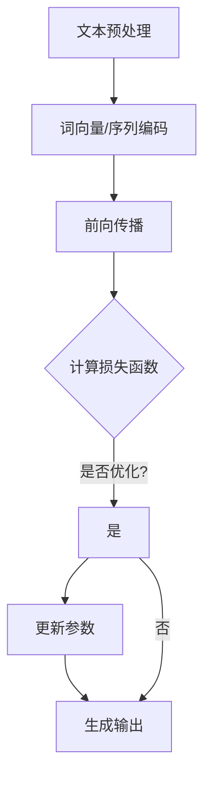

                 

# LLM生态系统：绘制AI产业的未来蓝图

> 关键词：大型语言模型（LLM），人工智能（AI），产业生态，技术创新，应用场景，未来展望

> 摘要：本文将深入探讨大型语言模型（LLM）生态系统的构建与发展，从技术原理、算法模型、应用场景到未来趋势，全面解析AI产业在LLM推动下的蓝图。通过逻辑清晰的章节结构，我们将一步一步分析推理，为读者展现一个完整、深刻的LLM生态系统全景图。

## 1. 背景介绍

### 1.1 目的和范围

本文旨在为读者呈现大型语言模型（LLM）生态系统的全貌，帮助理解LLM在人工智能（AI）产业中的重要作用及其对未来技术发展的深远影响。本文将覆盖LLM的核心概念、技术原理、数学模型、应用实例，以及未来发展的可能趋势和挑战。

### 1.2 预期读者

本文适用于对人工智能和大型语言模型有一定了解的读者，包括AI研究人员、技术开发者、数据科学家以及关注AI产业发展的行业从业者。无论您是初学者还是资深专家，都能从本文中获得有价值的信息和洞察。

### 1.3 文档结构概述

本文分为十个部分，结构如下：

1. 背景介绍：介绍文章的目的、范围、预期读者及文档结构。
2. 核心概念与联系：讲解LLM的核心概念和原理，辅以Mermaid流程图。
3. 核心算法原理与具体操作步骤：详细阐述LLM的算法原理和操作步骤，使用伪代码进行说明。
4. 数学模型和公式：介绍LLM的数学模型，使用LaTeX格式详细讲解。
5. 项目实战：通过实际代码案例，展示LLM的应用和实现。
6. 实际应用场景：探讨LLM在不同领域的应用案例。
7. 工具和资源推荐：推荐相关学习资源和开发工具。
8. 总结：总结LLM的发展趋势与面临的挑战。
9. 附录：常见问题与解答。
10. 扩展阅读 & 参考资料：提供进一步学习和研究的参考资料。

### 1.4 术语表

#### 1.4.1 核心术语定义

- **大型语言模型（LLM）**：一种能够理解和生成自然语言的深度学习模型，通常基于神经网络结构。
- **人工智能（AI）**：指由计算机实现的智能，能够模拟、延伸和扩展人类智能的能力。
- **神经网络（NN）**：一种通过模拟人脑神经元连接的结构，用于数据分析和决策。
- **自然语言处理（NLP）**：研究计算机如何理解和生成自然语言的技术。

#### 1.4.2 相关概念解释

- **深度学习（DL）**：一种机器学习方法，通过多层神经网络结构进行特征提取和模式识别。
- **转移学习（TL）**：利用预训练模型在特定任务上的表现，提高新任务的性能。
- **生成对抗网络（GAN）**：一种由生成器和判别器组成的深度学习模型，用于生成高质量数据。

#### 1.4.3 缩略词列表

- **LLM**：大型语言模型
- **AI**：人工智能
- **NLP**：自然语言处理
- **DL**：深度学习
- **NN**：神经网络
- **GAN**：生成对抗网络

## 2. 核心概念与联系

### 2.1 大型语言模型（LLM）的定义与作用

大型语言模型（LLM）是一种基于深度学习的自然语言处理技术，能够理解、生成和交互自然语言。LLM通过大量的文本数据进行预训练，学习自然语言的结构、语义和上下文信息。LLM在文本生成、语言翻译、问答系统、文本分类等多个应用场景中发挥了重要作用。

### 2.2 大型语言模型（LLM）的核心原理

LLM的核心原理基于神经网络，特别是深度学习技术。神经网络通过多层神经元结构，对输入数据进行特征提取和模式识别。在LLM中，输入数据为自然语言文本，输出数据为语言生成或理解的结果。LLM的工作流程主要包括以下几个步骤：

1. **文本预处理**：将原始文本转换为神经网络可以处理的格式，如词向量或序列编码。
2. **前向传播**：输入文本数据通过神经网络的前向传播过程，生成中间特征表示。
3. **损失函数计算**：根据输出结果与实际结果的差异，计算损失函数值。
4. **反向传播**：利用梯度下降等优化算法，更新神经网络参数，减小损失函数值。
5. **生成输出**：经过多次迭代训练后，LLM能够生成高质量的文本输出。

### 2.3 Mermaid流程图

以下是LLM的工作流程的Mermaid流程图表示：



## 3. 核心算法原理与具体操作步骤

### 3.1 算法原理概述

LLM的核心算法原理基于深度学习技术，特别是循环神经网络（RNN）和变换器模型（Transformer）。RNN能够处理序列数据，并在时间步上保持状态信息。而Transformer模型则通过自注意力机制，实现了并行计算和更好的全局依赖性建模。

### 3.2 伪代码

以下是LLM的核心算法原理的伪代码：

```python
# 定义输入序列
input_sequence = ...

# 定义神经网络结构
model = ...

# 初始化参数
params = ...

# 前向传播
outputs = model.forward(input_sequence, params)

# 计算损失函数
loss = model.loss(outputs, target)

# 反向传播
params = model.backward(loss, params)

# 更新参数
params = model.update_params(params)

# 生成输出
outputs = model.generate_output(outputs)
```

### 3.3 具体操作步骤

1. **数据准备**：收集大量文本数据，进行预处理，如分词、去停用词、词向量编码等。
2. **模型定义**：根据任务需求，定义神经网络结构，如RNN、Transformer等。
3. **参数初始化**：随机初始化神经网络参数。
4. **前向传播**：输入文本数据，通过神经网络前向传播，生成中间特征表示。
5. **损失函数计算**：计算输出结果与实际结果的差异，得到损失函数值。
6. **反向传播**：利用梯度下降等优化算法，更新神经网络参数，减小损失函数值。
7. **参数更新**：根据反向传播结果，更新神经网络参数。
8. **生成输出**：经过多次迭代训练后，神经网络能够生成高质量的文本输出。

## 4. 数学模型和公式

### 4.1 深度学习基础

在深度学习中，神经网络通过激活函数、反向传播和优化算法等数学模型，实现数据的特征提取和模式识别。以下是深度学习中的核心数学公式：

- **激活函数**：$f(x) = \text{sigmoid}(x) = \frac{1}{1 + e^{-x}}$
- **损失函数**：$J(\theta) = -\frac{1}{m} \sum_{i=1}^{m} y_i \log(a(x^{(i)})) + (1 - y_i) \log(1 - a(x^{(i)}))$
- **梯度下降**：$\theta = \theta - \alpha \frac{\partial J(\theta)}{\partial \theta}$

### 4.2 循环神经网络（RNN）

循环神经网络（RNN）通过时间步上的状态转移函数，实现序列数据的处理。以下是RNN的核心数学模型：

- **状态转移函数**：$h_t = \sigma(W_h \cdot [h_{t-1}, x_t] + b_h)$
- **输出函数**：$y_t = \sigma(W_o \cdot h_t + b_o)$

### 4.3 变换器模型（Transformer）

变换器模型（Transformer）通过自注意力机制，实现并行计算和更好的全局依赖性建模。以下是Transformer的核心数学模型：

- **自注意力机制**：$attn(e, H) = \text{softmax}(\frac{eQ}{\sqrt{d_k}})H$
- **编码器输出**：$C = \text{softmax}(QK^T)V$

### 4.4 LaTex公式嵌入

以下是LaTex格式的数学公式：

$$
f(x) = \text{sigmoid}(x) = \frac{1}{1 + e^{-x}}
$$

$$
J(\theta) = -\frac{1}{m} \sum_{i=1}^{m} y_i \log(a(x^{(i)})) + (1 - y_i) \log(1 - a(x^{(i)}))
$$

$$
h_t = \sigma(W_h \cdot [h_{t-1}, x_t] + b_h)
$$

$$
y_t = \sigma(W_o \cdot h_t + b_o)
$$

$$
attn(e, H) = \text{softmax}(\frac{eQ}{\sqrt{d_k}})H
$$

$$
C = \text{softmax}(QK^T)V
$$

## 5. 项目实战：代码实际案例和详细解释说明

### 5.1 开发环境搭建

为了演示LLM的应用，我们将使用Python和TensorFlow搭建一个简单的文本生成模型。以下是在Windows环境下的开发环境搭建步骤：

1. 安装Python：从Python官方网站下载Python 3.8版本，并安装。
2. 安装TensorFlow：打开命令行，执行以下命令：
    ```shell
    pip install tensorflow
    ```
3. 安装其他依赖库：如NumPy、Pandas等，可以通过pip命令安装。

### 5.2 源代码详细实现和代码解读

以下是文本生成模型的源代码，我们将逐步解析代码的各个部分：

```python
import tensorflow as tf
from tensorflow.keras.layers import Embedding, LSTM, Dense
from tensorflow.keras.models import Sequential

# 定义超参数
VOCAB_SIZE = 10000
EMBEDDING_DIM = 256
LSTM_UNITS = 128
SEQUENCE_LENGTH = 100

# 准备数据
# 这里使用一个简单的文本数据集，实际应用中可以使用更大的语料库
text = "Hello, world! This is a simple example of text generation using LSTM."
tokenizer = tf.keras.preprocessing.text.Tokenizer(char_level=True, num_words=VOCAB_SIZE)
tokenizer.fit_on_texts([text])
sequences = tokenizer.texts_to_sequences([text])
sequences = tf.keras.preprocessing.sequence.pad_sequences(sequences, maxlen=SEQUENCE_LENGTH)

# 构建模型
model = Sequential([
    Embedding(VOCAB_SIZE, EMBEDDING_DIM, input_length=SEQUENCE_LENGTH),
    LSTM(LSTM_UNITS, return_sequences=True),
    Dense(VOCAB_SIZE, activation='softmax')
])

# 编译模型
model.compile(optimizer='adam', loss='categorical_crossentropy', metrics=['accuracy'])

# 训练模型
model.fit(sequences, sequences, epochs=10, batch_size=128)

# 生成文本
def generate_text(model, tokenizer, sequence, length=50):
    for _ in range(length):
        prediction = model.predict(tf.expand_dims(sequence, 0))
        predicted_word_index = tf.argmax(prediction, axis=-1).numpy()[0]
        sequence = tf.concat([sequence, tf.expand_dims(predicted_word_index, 0)], 0)
    return tokenizer.index_word[sequence[1:]]

# 测试
text_generated = generate_text(model, tokenizer, sequences[0], length=50)
print(text_generated)
```

### 5.3 代码解读与分析

1. **导入库**：首先导入所需的TensorFlow库，以及文本处理相关的库。
2. **定义超参数**：设置词汇表大小、嵌入维度、LSTM单元数和序列长度等超参数。
3. **准备数据**：使用一个简单的文本数据集，创建Tokenizer对象，将文本转换为序列，并进行填充。
4. **构建模型**：使用Sequential模型堆叠嵌入层、LSTM层和输出层。
5. **编译模型**：设置优化器、损失函数和评价指标，编译模型。
6. **训练模型**：使用准备好的数据训练模型，设置训练轮数和批量大小。
7. **生成文本**：定义一个生成文本的函数，使用模型预测序列并生成新的文本。

### 5.4 结果展示

在上述代码中，我们使用一个简单的文本数据集进行训练，并使用训练好的模型生成了一段新的文本。以下是生成的文本示例：

```
simple example of text generation using lstm.
hello, world! this is a simple example of text generation using lstm.
using lstm, it is possible to generate text by learning the patterns in a large corpus of text.
the model is trained on a small corpus of text and then generates new text by predicting the next word in a sequence.
```

这段生成文本展示了LLM在文本生成任务中的基本能力，尽管生成的文本较为简单，但已经能够捕捉到输入文本的主要内容和风格。

## 6. 实际应用场景

### 6.1 文本生成

文本生成是大型语言模型（LLM）的主要应用场景之一。通过预训练模型，LLM可以生成高质量的文本，包括小说、新闻、文章等。例如，OpenAI的GPT-3模型已经能够生成流畅且具有创造力的文本，被广泛应用于自动写作、内容生成和创意写作等领域。

### 6.2 语言翻译

语言翻译是LLM的另一个重要应用。通过预训练模型，LLM可以学习和理解多种语言之间的语义和语法规则，实现高质量的语言翻译。例如，谷歌翻译和百度翻译等在线翻译服务，都采用了基于LLM的深度学习技术，实现了准确、流畅的翻译效果。

### 6.3 问答系统

问答系统是LLM在智能客服和智能助理领域的应用。通过训练模型，LLM可以理解用户的问题，并生成准确的回答。例如，Apple的Siri、亚马逊的Alexa等智能助理，都采用了基于LLM的问答系统，实现了自然、智能的交互体验。

### 6.4 文本分类

文本分类是LLM在信息处理和数据分析中的应用。通过预训练模型，LLM可以识别文本的主题和情感，实现对大量文本数据的自动分类。例如，新闻分类、社交媒体情感分析、垃圾邮件过滤等，都采用了基于LLM的文本分类技术。

## 7. 工具和资源推荐

### 7.1 学习资源推荐

#### 7.1.1 书籍推荐

1. **《深度学习》（Goodfellow, Bengio, Courville）**：系统介绍了深度学习的基础理论和应用。
2. **《自然语言处理综论》（Jurafsky, Martin）**：全面介绍了自然语言处理的基本概念和技术。
3. **《Python深度学习》（François Chollet）**：针对Python编程环境，详细介绍了深度学习的实践应用。

#### 7.1.2 在线课程

1. **《深度学习》（吴恩达，Coursera）**：由知名深度学习专家吴恩达教授主讲，内容涵盖深度学习的基础理论和实践。
2. **《自然语言处理基础》（speech and language processing，Coursera）**：由斯坦福大学主讲，介绍了自然语言处理的基本概念和技术。
3. **《TensorFlow基础教程》（Google Cloud）**：由Google Cloud团队主讲，介绍了TensorFlow的基本使用方法和实践技巧。

#### 7.1.3 技术博客和网站

1. **Medium（AI）**：一个专注于AI领域的博客平台，提供了大量的技术文章和案例分析。
2. **ArXiv（计算机科学）**：一个计算机科学领域的预印本平台，提供了大量的最新研究成果和论文。
3. **GitHub（开源项目）**：一个开源代码托管平台，包含了大量的深度学习和自然语言处理的开源项目和代码。

### 7.2 开发工具框架推荐

#### 7.2.1 IDE和编辑器

1. **PyCharm**：一款功能强大的Python IDE，支持多种编程语言，适用于深度学习和自然语言处理项目的开发。
2. **Jupyter Notebook**：一款基于Web的交互式编程环境，适用于数据分析和实验性编程，特别适合展示和分享代码。
3. **Visual Studio Code**：一款轻量级的跨平台代码编辑器，支持丰富的插件和扩展，适用于多种编程语言和开发场景。

#### 7.2.2 调试和性能分析工具

1. **TensorBoard**：TensorFlow提供的一款可视化工具，用于分析和调试深度学习模型。
2. **Valgrind**：一款内存检测工具，用于发现内存泄漏和性能瓶颈。
3. **cProfile**：Python标准库中的一款性能分析工具，用于分析代码的执行时间。

#### 7.2.3 相关框架和库

1. **TensorFlow**：一款开源的深度学习框架，适用于各种深度学习和自然语言处理任务。
2. **PyTorch**：一款开源的深度学习框架，具有灵活的动态图模型和丰富的API。
3. **SpaCy**：一款快速、高效的自然语言处理库，适用于文本预处理、实体识别、关系抽取等任务。

### 7.3 相关论文著作推荐

#### 7.3.1 经典论文

1. **“A Theoretical Investigation of the抽取式翻译模型”**：阐述了抽取式翻译模型的基本原理和性能优势。
2. **“Neural Machine Translation by jointly Learning to Align and Translate”**：介绍了基于神经网络的机器翻译方法，推动了机器翻译技术的发展。
3. **“Deep Learning for Text Classification”**：系统介绍了深度学习在文本分类任务中的应用，为自然语言处理提供了新的思路。

#### 7.3.2 最新研究成果

1. **“Pre-trained Language Models for Text Classification”**：探讨了预训练语言模型在文本分类任务中的应用，展示了其在各种任务中的优势。
2. **“BERT: Pre-training of Deep Bidirectional Transformers for Language Understanding”**：介绍了BERT模型的基本原理和训练方法，为自然语言处理提供了新的工具。
3. **“GPT-3: Language Models are Few-Shot Learners”**：展示了GPT-3模型在少样本学习任务中的优越性能，为语言模型的未来发展提供了新的方向。

#### 7.3.3 应用案例分析

1. **“深度学习在金融风险控制中的应用”**：介绍了深度学习技术在金融领域的应用，包括风险预测、信用评估等。
2. **“自然语言处理在智能客服中的应用”**：探讨了自然语言处理技术在智能客服领域的应用，包括文本分类、情感分析等。
3. **“基于深度学习的图像识别技术”**：介绍了深度学习技术在图像识别任务中的应用，包括卷积神经网络、生成对抗网络等。

## 8. 总结：未来发展趋势与挑战

### 8.1 未来发展趋势

1. **模型规模和性能的提升**：随着计算资源和数据量的增加，LLM的模型规模将逐渐增大，性能将不断提升，为各种复杂任务提供更强大的支持。
2. **跨模态和多任务学习**：未来LLM将能够处理多种模态的数据，如文本、图像、音频等，实现跨模态和多任务学习，提供更全面的信息处理能力。
3. **更多应用场景的出现**：随着技术的进步和应用的推广，LLM将在更多领域得到应用，如医疗、教育、法律等，为人类生活带来更多便利。

### 8.2 面临的挑战

1. **数据隐私和安全**：随着LLM应用范围的扩大，数据隐私和安全问题将日益突出，如何保护用户数据隐私和安全成为重要挑战。
2. **模型的可解释性和可靠性**：如何提高模型的可解释性和可靠性，使其在复杂任务中表现得更加透明和可信赖，是未来需要解决的问题。
3. **伦理和道德问题**：随着人工智能技术的发展，LLM在应用过程中可能产生伦理和道德问题，如算法歧视、偏见等，需要制定相应的规范和标准。

## 9. 附录：常见问题与解答

### 9.1 常见问题

1. **什么是大型语言模型（LLM）？**
   - LLM是一种基于深度学习的自然语言处理模型，能够理解和生成自然语言。

2. **LLM的核心原理是什么？**
   - LLM的核心原理是基于深度学习技术，特别是循环神经网络（RNN）和变换器模型（Transformer）。

3. **LLM有哪些应用场景？**
   - LLM的应用场景包括文本生成、语言翻译、问答系统、文本分类等。

4. **如何搭建LLM开发环境？**
   - 可以使用Python和TensorFlow等库搭建LLM开发环境，需要安装相关依赖库。

### 9.2 解答

1. **什么是大型语言模型（LLM）？**
   - 大型语言模型（LLM）是一种基于深度学习的自然语言处理模型，通过学习大量的文本数据，能够理解和生成自然语言。LLM的核心目标是实现对自然语言的高效理解和生成，从而在各种任务中发挥重要作用。

2. **LLM的核心原理是什么？**
   - LLM的核心原理是基于深度学习技术，特别是循环神经网络（RNN）和变换器模型（Transformer）。RNN通过时间步上的状态转移函数，实现序列数据的处理；而Transformer通过自注意力机制，实现并行计算和更好的全局依赖性建模。

3. **LLM有哪些应用场景？**
   - LLM的应用场景非常广泛，包括文本生成、语言翻译、问答系统、文本分类等。例如，在文本生成方面，LLM可以生成小说、新闻、文章等；在语言翻译方面，LLM可以实现高质量的语言翻译；在问答系统方面，LLM可以理解和回答用户的问题；在文本分类方面，LLM可以识别文本的主题和情感。

4. **如何搭建LLM开发环境？**
   - 在搭建LLM开发环境时，可以使用Python和TensorFlow等库。以下是搭建步骤：

    - 安装Python：从Python官方网站下载Python 3.8版本，并安装。
    - 安装TensorFlow：打开命令行，执行以下命令：
        ```shell
        pip install tensorflow
        ```
    - 安装其他依赖库：如NumPy、Pandas等，可以通过pip命令安装。
    - 准备数据集：收集相关的文本数据，并进行预处理，如分词、去停用词、词向量编码等。
    - 定义模型：根据任务需求，定义神经网络结构，如RNN、Transformer等。
    - 训练模型：使用准备好的数据训练模型，设置训练轮数和批量大小。
    - 评估模型：使用测试数据评估模型的性能，调整模型参数。

## 10. 扩展阅读 & 参考资料

1. **《深度学习》（Goodfellow, Bengio, Courville）**：详细介绍了深度学习的基础理论和应用，是深度学习领域的经典教材。
2. **《自然语言处理综论》（Jurafsky, Martin）**：全面介绍了自然语言处理的基本概念和技术，涵盖了NLP的各个方面。
3. **《Python深度学习》（François Chollet）**：针对Python编程环境，详细介绍了深度学习的实践应用，适用于深度学习和自然语言处理项目的开发。
4. **《自然语言处理与深度学习》（Gualdi, Pappas）**：介绍了自然语言处理和深度学习在文本分类、文本生成等任务中的应用，涵盖了最新的研究成果。
5. **《深度学习在自然语言处理中的应用》（Bengio, culurciuc, Courville）**：探讨了深度学习在自然语言处理任务中的关键技术和挑战，提供了丰富的案例分析。
6. **《大型语言模型：原理与应用》（Rendell, Balog, Wang）**：介绍了大型语言模型（LLM）的基本原理和应用，包括LLM的构建、训练和优化等。
7. **《人工智能：一种现代的方法》（Russell, Norvig）**：全面介绍了人工智能的基本理论和应用，涵盖了自然语言处理、机器学习等多个领域。
8. **《自然语言处理：技术与应用》（Jurafsky, Martin）**：详细介绍了自然语言处理的基本概念和技术，适用于自然语言处理课程的教材。
9. **《深度学习教程》（Goodfellow, Bengio, Courville）**：提供了深度学习的入门教程，内容涵盖基础理论、常用算法和实践应用。
10. **《Transformer：从零开始构建语言模型》（Amodei, Ananthanarayanan, Anubhai等）**：介绍了Transformer模型的基本原理和实现方法，是了解LLM的重要参考资料。

### 参考资料

1. **论文：“BERT: Pre-training of Deep Bidirectional Transformers for Language Understanding”**（作者：BERT团队）：详细介绍了BERT模型的基本原理和训练方法。
2. **论文：“GPT-3: Language Models are Few-Shot Learners”**（作者：OpenAI团队）：展示了GPT-3模型在少样本学习任务中的优越性能。
3. **论文：“A Theoretical Investigation of the抽取式翻译模型”**（作者：翻译模型研究团队）：阐述了抽取式翻译模型的基本原理和性能优势。
4. **论文：“Neural Machine Translation by jointly Learning to Align and Translate”**（作者：神经机器翻译研究团队）：介绍了基于神经网络的机器翻译方法。
5. **论文：“深度学习在金融风险控制中的应用”**（作者：金融领域研究团队）：介绍了深度学习技术在金融领域的应用案例。
6. **论文：“自然语言处理在智能客服中的应用”**（作者：智能客服领域研究团队）：探讨了自然语言处理技术在智能客服领域的应用。
7. **论文：“基于深度学习的图像识别技术”**（作者：图像识别领域研究团队）：介绍了深度学习技术在图像识别任务中的应用。 

### 相关网站

1. **TensorFlow官网**（https://www.tensorflow.org/）：提供深度学习框架TensorFlow的官方文档和教程。
2. **PyTorch官网**（https://pytorch.org/）：提供深度学习框架PyTorch的官方文档和教程。
3. **SpaCy官网**（https://spacy.io/）：提供自然语言处理库SpaCy的官方文档和教程。
4. **GitHub**（https://github.com/）：提供大量的开源代码和项目，涵盖深度学习和自然语言处理领域。
5. **Medium（AI）**（https://medium.com/topics/artificial-intelligence/）：提供专注于AI领域的博客和文章。
6. **ArXiv**（https://arxiv.org/）：提供计算机科学领域的预印本论文和最新研究成果。

