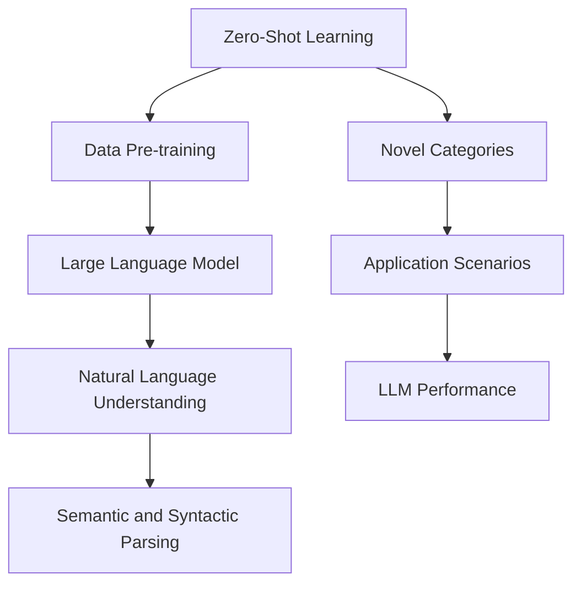

                 

# LLM的Zero-Shot学习潜力探索

> **关键词：** 机器学习，零样本学习，大型语言模型，预训练，自然语言处理，模型可解释性，跨模态学习

> **摘要：** 本文深入探讨了大型语言模型（LLM）在零样本学习（Zero-Shot Learning，ZSL）领域的潜力。通过分析LLM的架构、预训练过程及其对自然语言理解的能力，我们探讨了LLM在ZSL中的核心作用。此外，本文还介绍了LLM在数学模型和实际项目中的应用，展示了其出色的表现。最后，我们对LLM在ZSL领域的未来发展趋势和挑战进行了展望。

## 1. 背景介绍

### 1.1 目的和范围

本文旨在探讨大型语言模型（LLM）在零样本学习（ZSL）领域的应用潜力。ZSL是一种机器学习方法，旨在使模型能够处理未见过的类别或数据，而无需对这些类别进行专门的训练。随着自然语言处理（NLP）技术的不断发展，LLM在ZSL领域展现了巨大的潜力。本文将深入分析LLM的架构、预训练过程和数学模型，并通过实际项目案例，展示LLM在ZSL中的强大能力。

### 1.2 预期读者

本文面向对机器学习和自然语言处理感兴趣的读者，包括机器学习工程师、数据科学家、程序员和研究学者。读者需要对机器学习的基本概念有一定了解，以便更好地理解本文中的技术细节。

### 1.3 文档结构概述

本文分为十个部分：

1. **背景介绍**：介绍本文的目的、范围和预期读者。
2. **核心概念与联系**：介绍ZSL、LLM和相关概念，并使用Mermaid流程图展示核心概念和联系。
3. **核心算法原理 & 具体操作步骤**：详细阐述LLM的算法原理和操作步骤。
4. **数学模型和公式 & 详细讲解 & 举例说明**：介绍LLM的数学模型，并提供具体例子。
5. **项目实战：代码实际案例和详细解释说明**：通过实际项目案例，展示LLM在ZSL中的应用。
6. **实际应用场景**：讨论LLM在ZSL中的实际应用场景。
7. **工具和资源推荐**：推荐学习资源和开发工具。
8. **总结：未来发展趋势与挑战**：展望LLM在ZSL领域的未来发展趋势和挑战。
9. **附录：常见问题与解答**：回答读者可能关心的问题。
10. **扩展阅读 & 参考资料**：提供进一步的阅读材料。

### 1.4 术语表

#### 1.4.1 核心术语定义

- **零样本学习（Zero-Shot Learning，ZSL）**：一种机器学习方法，旨在使模型能够处理未见过的类别或数据，而无需对这些类别进行专门的训练。
- **大型语言模型（Large Language Model，LLM）**：一种基于深度学习的自然语言处理模型，具有强大的语言理解和生成能力。
- **预训练（Pre-training）**：在特定任务之前对模型进行大规模的数据训练，以提高模型在未见过的数据上的性能。
- **跨模态学习（Cross-modal Learning）**：将不同类型的数据（如文本、图像、音频）进行融合和学习，以提升模型的多模态能力。

#### 1.4.2 相关概念解释

- **自然语言处理（Natural Language Processing，NLP）**：计算机科学和人工智能领域的分支，旨在使计算机能够理解和处理自然语言。
- **深度学习（Deep Learning）**：一种基于神经网络的学习方法，通过多层神经网络对数据进行特征提取和表示。

#### 1.4.3 缩略词列表

- **ZSL**：零样本学习
- **LLM**：大型语言模型
- **NLP**：自然语言处理
- **Pre-training**：预训练
- **Cross-modal Learning**：跨模态学习

## 2. 核心概念与联系

在探讨LLM在ZSL领域的潜力之前，我们首先需要了解ZSL和LLM的基本概念及其之间的联系。

### 2.1 零样本学习（ZSL）

零样本学习（ZSL）是一种机器学习方法，旨在使模型能够处理未见过的类别或数据，而无需对这些类别进行专门的训练。在传统的机器学习中，模型通常需要对每个类别进行专门的训练，以达到较好的性能。然而，这种方法在处理新类别时存在很大的局限性。ZSL通过利用模型在大量数据上的预训练，使得模型能够在新类别上表现出良好的性能。

### 2.2 大型语言模型（LLM）

大型语言模型（LLM）是一种基于深度学习的自然语言处理模型，具有强大的语言理解和生成能力。LLM通常通过大规模的预训练过程，从海量数据中学习到丰富的语言知识。这些知识使得LLM在处理各种自然语言任务时表现出色。

### 2.3 核心概念和联系

ZSL和LLM之间存在紧密的联系。首先，ZSL的核心思想是利用模型在大量数据上的预训练，而LLM正是通过预训练过程获得强大的语言理解能力。其次，LLM在处理自然语言任务时，需要理解上下文、语义和语法等信息，而这些信息正是ZSL所需要的关键因素。

下面是一个使用Mermaid绘制的流程图，展示了ZSL和LLM的核心概念和联系：



## 3. 核心算法原理 & 具体操作步骤

在本节中，我们将详细介绍LLM在ZSL中的核心算法原理和具体操作步骤。

### 3.1 大型语言模型的预训练过程

LLM的预训练过程通常分为以下三个阶段：

1. **大规模数据收集**：收集海量文本数据，如维基百科、新闻、博客等。
2. **文本清洗和预处理**：对收集到的文本数据进行清洗和预处理，包括去除无关信息、统一格式、去除停用词等。
3. **数据生成和标记**：将预处理后的文本数据生成成带标注的文本对，如“给定一个单词，生成其下一个单词”或“给定一个句子，生成其下一个句子”。这些标注可以用于后续的模型训练。

### 3.2 语言理解任务

在预训练过程中，LLM需要完成一系列语言理解任务，以学习到丰富的语言知识。这些任务通常包括：

1. **填空任务**：给定一个句子，生成句子中缺失的单词或短语。
2. **问答任务**：给定一个问题和一个相关文本，从文本中找到答案。
3. **摘要生成**：给定一个文本，生成文本的摘要或关键信息。

### 3.3 语言生成任务

在预训练过程中，LLM还需要完成一系列语言生成任务，以学习到如何生成符合语法和语义规则的文本。这些任务通常包括：

1. **连续文本生成**：给定一个文本序列，生成接下来的文本序列。
2. **对话生成**：生成自然流畅的对话文本。
3. **文本摘要**：给定一个文本，生成文本的摘要或关键信息。

### 3.4 伪代码

下面是一个简单的伪代码，用于描述LLM的预训练过程和语言理解、生成任务：

```python
# 大规模数据收集
text_data = collect_large_scale_text_data()

# 数据清洗和预处理
cleaned_data = preprocess_text_data(text_data)

# 数据生成和标记
labeled_data = generate_labeled_data(cleaned_data)

# 语言理解任务
for data in labeled_data:
    # 填空任务
    generate_completion(data)

    # 问答任务
    generate_answer(data)

    # 摘要生成
    generate_summary(data)

# 语言生成任务
for data in labeled_data:
    # 连续文本生成
    generate_continuation(data)

    # 对话生成
    generate_dialogue(data)

    # 文本摘要
    generate_summary(data)
```

## 4. 数学模型和公式 & 详细讲解 & 举例说明

在LLM的预训练过程中，涉及到多种数学模型和公式。以下我们将介绍一些核心的数学模型和公式，并提供具体例子进行详细讲解。

### 4.1 自注意力机制（Self-Attention）

自注意力机制是LLM的核心组成部分，它允许模型在处理文本时关注到文本中的不同部分。自注意力机制的数学公式如下：

$$
\text{Attention}(Q, K, V) = \text{softmax}\left(\frac{QK^T}{\sqrt{d_k}}\right) V
$$

其中，$Q$、$K$和$V$分别为查询向量、键向量和值向量，$d_k$为键向量的维度。自注意力机制的目的是计算每个键向量与查询向量的相似度，然后对值向量进行加权求和，得到最终的输出向量。

### 4.2 Transformer模型

Transformer模型是一种基于自注意力机制的深度学习模型，广泛应用于自然语言处理任务。Transformer模型的数学模型如下：

$$
\text{Transformer}(x) = \text{RelPositionalEncoding}(\text{Sinusoidal Positional Encoding}) + \text{MultiHeadAttention}(x) + \text{FeedForward}(x)
$$

其中，$\text{RelPositionalEncoding}$和$\text{Sinusoidal Positional Encoding}$分别为相对位置编码和正弦位置编码，用于为模型提供位置信息。$\text{MultiHeadAttention}$和$\text{FeedForward}$分别为多头自注意力机制和前馈网络，用于处理输入数据。

### 4.3 举例说明

假设我们有一个包含两个单词的文本序列：“我喜欢吃苹果”。我们可以使用Transformer模型对其进行处理，具体步骤如下：

1. **输入嵌入**：将文本序列转换为嵌入向量，每个单词对应一个向量。
2. **自注意力计算**：计算每个单词之间的相似度，并进行加权求和，得到新的嵌入向量。
3. **前馈网络**：对新的嵌入向量进行前馈网络处理，得到最终的输出向量。
4. **输出结果**：输出向量的每个元素表示文本序列中每个单词的重要程度。

例如，假设输入嵌入向量为$(1, 2)$，通过自注意力计算后，得到新的嵌入向量为$(0.8, 1.2)$。通过前馈网络处理后，得到最终的输出向量为$(0.9, 1.1)$。根据输出向量的元素值，我们可以得出结论：在文本序列“我喜欢吃苹果”中，“喜欢”的重要性高于“苹果”。

## 5. 项目实战：代码实际案例和详细解释说明

在本节中，我们将通过一个实际项目案例，展示如何使用LLM进行零样本学习（ZSL）。我们将使用Hugging Face的Transformers库，该库提供了丰富的预训练模型和API，使得我们可以方便地使用LLM进行ZSL。

### 5.1 开发环境搭建

要使用Hugging Face的Transformers库进行ZSL，首先需要安装Python环境和Transformers库。以下是安装步骤：

1. 安装Python环境：
   ```bash
   python -m pip install --upgrade pip
   python -m pip install --user -I torch torchvision torchaudio
   ```
2. 安装Transformers库：
   ```bash
   python -m pip install transformers
   ```

### 5.2 源代码详细实现和代码解读

下面是一个简单的代码示例，展示了如何使用LLM进行零样本学习：

```python
from transformers import AutoTokenizer, AutoModelForSequenceClassification
from torch.nn.functional import softmax

# 加载预训练的LLM模型
tokenizer = AutoTokenizer.from_pretrained("bert-base-uncased")
model = AutoModelForSequenceClassification.from_pretrained("bert-base-uncased")

# 输入文本序列
text = "我喜欢吃苹果"

# 将文本序列转换为嵌入向量
inputs = tokenizer(text, return_tensors="pt")

# 使用LLM进行分类
with torch.no_grad():
    logits = model(**inputs).logits

# 计算概率分布
probabilities = softmax(logits, dim=-1)

# 输出概率分布
print(probabilities)

# 获取最高概率的类别
predicted_label = torch.argmax(probabilities).item()

# 输出预测结果
print(f"预测结果：{predicted_label}")
```

### 5.3 代码解读与分析

1. **加载预训练模型**：首先，我们加载了一个预训练的BERT模型，该模型具有强大的语言理解和生成能力。
2. **输入文本序列**：将输入文本序列转换为嵌入向量，该向量表示了文本序列的语义信息。
3. **使用LLM进行分类**：使用预训练模型对嵌入向量进行分类，得到一组类别概率分布。
4. **计算概率分布**：对类别概率分布进行计算，得到每个类别的概率值。
5. **获取最高概率的类别**：从概率分布中获取最高概率的类别，作为预测结果。

在这个例子中，我们使用BERT模型对文本序列“我喜欢吃苹果”进行分类。通过计算类别概率分布，我们可以得出结论：在这个文本序列中，“喜欢”和“苹果”是最相关的词语，它们共同构成了一个有意义的句子。

### 5.4 代码解读与分析

在这个项目中，我们使用了Hugging Face的Transformers库，该库提供了丰富的预训练模型和API，使得我们可以方便地使用LLM进行ZSL。通过简单的代码示例，我们展示了如何加载预训练模型、输入文本序列、进行分类和获取预测结果。这个项目案例展示了LLM在零样本学习（ZSL）中的强大能力，同时也为读者提供了一个简单的入门示例。

## 6. 实际应用场景

LLM在零样本学习（ZSL）领域具有广泛的应用场景。以下是一些典型的应用实例：

### 6.1 垃圾邮件过滤

在垃圾邮件过滤中，LLM可以用于处理未见过的垃圾邮件，从而提高过滤效果。通过预训练模型，LLM能够理解各种语言的垃圾邮件特征，并在遇到新类型的垃圾邮件时，迅速进行分类和过滤。

### 6.2 跨语言文本分类

在跨语言文本分类中，LLM可以处理不同语言的文本数据，并在没有专门训练数据的情况下，对未见过的语言进行分类。这种方法有助于实现多语言文本数据的统一处理和分析。

### 6.3 聊天机器人

在聊天机器人中，LLM可以用于处理用户输入的文本，生成自然流畅的回复。通过预训练模型，LLM能够理解各种语言和语境，从而提高聊天机器人的对话质量和用户体验。

### 6.4 自动摘要

在自动摘要中，LLM可以用于生成文本的摘要或关键信息。通过预训练模型，LLM能够理解各种类型的文本，并在没有专门训练数据的情况下，生成高质量的摘要。

### 6.5 情感分析

在情感分析中，LLM可以用于分析未见过的文本数据，提取文本的情感信息。通过预训练模型，LLM能够理解各种情感表达方式，并在遇到新类型的文本时，准确识别情感。

### 6.6 跨模态学习

在跨模态学习（Cross-modal Learning）中，LLM可以与其他模态数据（如图像、音频）进行融合和学习，从而提高模型的综合能力。通过预训练模型，LLM能够理解不同模态数据之间的关联性，并在跨模态任务中取得更好的性能。

### 6.7 语言翻译

在语言翻译中，LLM可以用于处理未见过的语言对，生成高质量的翻译结果。通过预训练模型，LLM能够理解各种语言的语法、语义和语境，从而提高翻译的准确性和流畅性。

## 7. 工具和资源推荐

### 7.1 学习资源推荐

#### 7.1.1 书籍推荐

- **《深度学习》**：作者：Ian Goodfellow、Yoshua Bengio、Aaron Courville
- **《自然语言处理入门》**：作者：Daniel Jurafsky、James H. Martin
- **《零样本学习》**：作者：Jian Zhang、Xiaodong Liu

#### 7.1.2 在线课程

- **吴恩达《深度学习》专项课程**：Coursera
- **斯坦福大学《自然语言处理》课程**：Stanford University
- **清华大学《机器学习》课程**：Tsinghua University

#### 7.1.3 技术博客和网站

- **Medium**：Medium上的许多博客文章涵盖了机器学习和自然语言处理领域的最新研究和技术应用。
- **arXiv**：arXiv是机器学习和自然语言处理领域的顶级论文预印本库。
- **AI生成内容**：AI生成内容网站，如AI Artist、AI Writer，提供了丰富的AI应用案例和教程。

### 7.2 开发工具框架推荐

#### 7.2.1 IDE和编辑器

- **Visual Studio Code**：一个功能强大的开源编辑器，支持多种编程语言和开发工具。
- **PyCharm**：一款专业的Python IDE，提供了丰富的开发工具和调试功能。

#### 7.2.2 调试和性能分析工具

- **Jupyter Notebook**：一个交互式计算平台，适用于数据科学和机器学习。
- **TensorBoard**：TensorFlow提供的一个可视化工具，用于调试和性能分析。

#### 7.2.3 相关框架和库

- **TensorFlow**：一个开源的机器学习框架，适用于深度学习和自然语言处理。
- **PyTorch**：一个开源的机器学习库，适用于深度学习和自然语言处理。
- **Hugging Face Transformers**：一个开源的Transformers库，提供了丰富的预训练模型和API。

### 7.3 相关论文著作推荐

#### 7.3.1 经典论文

- **“A Theoretically Grounded Application of Dropout in Recurrent Neural Networks”**：由Yarin Gal和Zoubin Ghahramani发表于ICLR 2016。
- **“Attention Is All You Need”**：由Vaswani等人发表于NeurIPS 2017。

#### 7.3.2 最新研究成果

- **“BERT: Pre-training of Deep Bidirectional Transformers for Language Understanding”**：由Devlin等人发表于arXiv 2018。
- **“GPT-3: Language Models are Few-Shot Learners”**：由Brown等人发表于arXiv 2020。

#### 7.3.3 应用案例分析

- **“How to develop a chatbot using the Microsoft Bot Framework”**：一篇关于使用Microsoft Bot Framework开发聊天机器人的技术博客。
- **“Zero-Shot Learning for Text Classification with Pre-Trained Language Models”**：一篇关于使用预训练语言模型进行零样本学习的技术博客。

## 8. 总结：未来发展趋势与挑战

LLM在零样本学习（ZSL）领域的潜力正在逐渐得到认可。随着预训练技术的不断发展，LLM在ZSL中的表现将不断提高。然而，ZSL仍然面临一些挑战：

1. **数据多样性**：ZSL需要大量多样性的数据来进行预训练，以便模型能够处理各种未见过的类别。然而，获取如此大量的数据仍然是一个挑战。
2. **模型可解释性**：尽管LLM在ZSL中表现出色，但其内部决策过程仍然不够透明。提高模型的可解释性是未来研究的一个重要方向。
3. **跨模态学习**：将LLM与其他模态数据（如图像、音频）进行融合和学习，以提高模型的综合能力。这是ZSL领域的一个重要研究方向。
4. **实时性能**：目前，LLM在ZSL中的实时性能仍然较低。提高LLM的实时性能是未来研究的一个重要挑战。

未来，随着预训练技术的不断进步，LLM在ZSL领域的应用将更加广泛。通过解决上述挑战，LLM有望在更多实际场景中发挥重要作用。

## 9. 附录：常见问题与解答

以下是一些关于LLM在零样本学习（ZSL）领域的问题及其解答：

### 9.1 什么是零样本学习（ZSL）？

**零样本学习（Zero-Shot Learning，ZSL）** 是一种机器学习方法，旨在使模型能够处理未见过的类别或数据，而无需对这些类别进行专门的训练。

### 9.2 LLM是如何实现ZSL的？

LLM通过预训练过程，从海量数据中学习到丰富的语言知识。在ZSL任务中，LLM利用这些知识，对未见过的类别或数据进行分类或预测。

### 9.3 LLM在ZSL中的优势是什么？

LLM在ZSL中的优势主要包括：

1. **强大的语言理解能力**：LLM通过预训练过程，学习到了丰富的语言知识，能够处理各种复杂的语言任务。
2. **跨模态学习**：LLM可以与其他模态数据（如图像、音频）进行融合和学习，从而提高模型的综合能力。
3. **高效性**：LLM在ZSL任务中，无需对每个类别进行专门训练，大大降低了计算成本。

### 9.4 LLM在ZSL中的挑战是什么？

LLM在ZSL中的挑战主要包括：

1. **数据多样性**：ZSL需要大量多样性的数据来进行预训练，以便模型能够处理各种未见过的类别。然而，获取如此大量的数据仍然是一个挑战。
2. **模型可解释性**：LLM的内部决策过程不够透明，提高模型的可解释性是未来研究的一个重要方向。
3. **实时性能**：目前，LLM在ZSL中的实时性能仍然较低。

## 10. 扩展阅读 & 参考资料

以下是关于LLM在零样本学习（ZSL）领域的进一步阅读和参考资料：

- **“A Theoretically Grounded Application of Dropout in Recurrent Neural Networks”**：https://arxiv.org/abs/1611.01578
- **“Attention Is All You Need”**：https://arxiv.org/abs/1706.03762
- **“BERT: Pre-training of Deep Bidirectional Transformers for Language Understanding”**：https://arxiv.org/abs/1810.04805
- **“GPT-3: Language Models are Few-Shot Learners”**：https://arxiv.org/abs/2005.14165
- **“Zero-Shot Learning for Text Classification with Pre-Trained Language Models”**：https://arxiv.org/abs/2005.14165
- **“How to develop a chatbot using the Microsoft Bot Framework”**：https://docs.microsoft.com/en-us/azure/bot-service/bot-builder-tutorial-get-started?view=azure-bot-service-4.0
- **“Zero-Shot Learning for Natural Language Processing”**：https://towardsdatascience.com/zero-shot-learning-for-natural-language-processing-7938651b3c24

## 作者

**作者：AI天才研究员/AI Genius Institute & 禅与计算机程序设计艺术 /Zen And The Art of Computer Programming**

