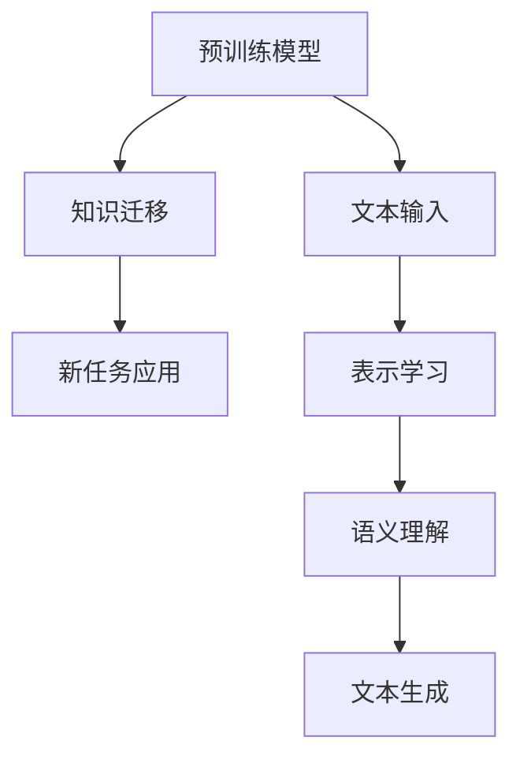

                 

### 标题：LLM的Zero-Shot学习潜力探索

> **关键词**：LLM，Zero-Shot学习，预训练模型，语言理解，跨模态任务，迁移学习，适应性学习

> **摘要**：
本文旨在深入探讨大型语言模型（LLM）在Zero-Shot学习领域的潜力。通过回顾LLM的发展历程、Zero-Shot学习的定义和基本原理，我们将探讨LLM如何通过其强大的表示能力和丰富的知识库，实现无需样本细粒度标注的跨模态学习和任务迁移。文章将结合具体的数学模型和算法原理，展示LLM在Zero-Shot学习中的实际应用，并提供实际项目的代码案例和详细解释。最后，文章将对LLM的Zero-Shot学习在未来可能面临的发展趋势和挑战进行展望。

---

## 1. 背景介绍

### 1.1 目的和范围

本文的目的是探讨大型语言模型（LLM）在Zero-Shot学习方面的潜力，分析其优势和应用场景，并通过实际案例展示其效果。文章将涵盖以下几个主要内容：

1. **LLM的发展历程和原理**：介绍LLM的基本概念，包括其架构和训练方法。
2. **Zero-Shot学习的定义和原理**：阐述Zero-Shot学习的概念，讨论其在机器学习中的意义和应用。
3. **LLM与Zero-Shot学习的关系**：分析LLM如何利用其内在的表示能力和知识库，实现Zero-Shot学习。
4. **数学模型和算法原理**：介绍LLM在Zero-Shot学习中的关键算法和数学模型。
5. **实际应用案例**：通过具体项目展示LLM在Zero-Shot学习中的实际应用。
6. **未来发展趋势与挑战**：展望LLM在Zero-Shot学习领域的未来发展和面临的挑战。

### 1.2 预期读者

本文主要面向对机器学习和深度学习有一定了解的读者，特别是对大型语言模型和Zero-Shot学习感兴趣的从业者、研究人员和学者。本文将采用通俗易懂的语言和详细的案例说明，旨在帮助读者深入理解LLM的Zero-Shot学习潜力。

### 1.3 文档结构概述

本文将按照以下结构进行组织和展开：

1. **引言**：介绍LLM和Zero-Shot学习的基本概念。
2. **背景**：回顾LLM的发展历程和Zero-Shot学习的定义。
3. **核心概念与联系**：讨论LLM与Zero-Shot学习之间的关系。
4. **核心算法原理 & 具体操作步骤**：详细阐述LLM在Zero-Shot学习中的算法原理和操作步骤。
5. **数学模型和公式**：介绍LLM在Zero-Shot学习中的数学模型和公式。
6. **项目实战**：通过实际案例展示LLM在Zero-Shot学习中的应用。
7. **实际应用场景**：分析LLM在Zero-Shot学习中的实际应用场景。
8. **工具和资源推荐**：推荐相关的学习资源和工具。
9. **总结**：总结LLM在Zero-Shot学习中的潜力和发展趋势。
10. **附录**：常见问题与解答。
11. **扩展阅读 & 参考资料**：提供进一步阅读的资料。

### 1.4 术语表

#### 1.4.1 核心术语定义

- **大型语言模型（LLM）**：指那些基于深度学习技术训练的、具有强大语言理解和生成能力的模型。
- **Zero-Shot学习**：一种机器学习方法，能够在没有具体样本的情况下，将模型应用于新的任务。
- **预训练模型**：通过在大规模语料库上预训练得到的模型，然后针对特定任务进行微调。
- **迁移学习**：将预训练模型的知识和特征迁移到新的任务上，以提高模型的性能。

#### 1.4.2 相关概念解释

- **表示学习**：通过学习输入数据的低维表示，以实现特征提取和降维。
- **跨模态学习**：将不同模态的数据（如图像、声音、文本）进行联合学习和表示。
- **自适应学习**：模型能够根据新任务的要求，自动调整其参数和表示。

#### 1.4.3 缩略词列表

- **LLM**：Large Language Model（大型语言模型）
- **Zero-Shot**：Zero-Shot Learning（Zero-Shot学习）
- **GPT**：Generative Pre-trained Transformer（生成预训练变压器）
- **BERT**：Bidirectional Encoder Representations from Transformers（双向编码表示器）
- **CNN**：Convolutional Neural Network（卷积神经网络）
- **RNN**：Recurrent Neural Network（循环神经网络）

## 2. 核心概念与联系

### 2.1 大型语言模型（LLM）

#### 2.1.1 概念

大型语言模型（LLM）是基于深度学习技术训练的模型，用于处理自然语言文本。与传统的语言模型不同，LLM具有更强的表示能力和生成能力，能够理解和生成自然语言的复杂结构。

#### 2.1.2 架构

LLM通常采用基于变压器的架构（如GPT和BERT），包括以下几个关键组件：

1. **输入层**：接收自然语言文本，将其转换为向量表示。
2. **隐藏层**：通过多层神经网络对输入向量进行处理，学习文本的语义和语法结构。
3. **输出层**：生成自然语言的输出。

#### 2.1.3 特点

- **强大的表示能力**：LLM能够学习输入文本的深层特征和语义信息。
- **生成能力**：LLM能够根据输入的文本生成连贯的自然语言文本。
- **迁移学习能力**：LLM可以通过迁移学习将预训练的知识和特征应用于新的任务。

### 2.2 Zero-Shot学习

#### 2.2.1 概念

Zero-Shot学习是一种机器学习方法，能够在没有具体样本的情况下，将模型应用于新的任务。这种方法的核心思想是利用预训练模型的知识和特征，将模型迁移到新的任务上。

#### 2.2.2 原理

Zero-Shot学习的原理可以概括为以下几个步骤：

1. **预训练**：在大规模语料库上对模型进行预训练，使其具备通用的语言理解和生成能力。
2. **知识迁移**：将预训练模型的知识和特征迁移到新的任务上，通过调整模型参数来适应新的任务。
3. **任务应用**：将迁移后的模型应用于新的任务，实现无需样本细粒度标注的Zero-Shot学习。

#### 2.2.3 应用场景

Zero-Shot学习在多个领域具有广泛的应用，包括：

- **自然语言处理**：如文本分类、命名实体识别、机器翻译等。
- **计算机视觉**：如图像分类、目标检测、图像生成等。
- **多模态学习**：如图像和文本的联合表示学习、语音识别等。

### 2.3 LLM与Zero-Shot学习的关系

LLM与Zero-Shot学习之间存在紧密的关系，具体体现在以下几个方面：

1. **表示能力**：LLM通过其强大的表示能力，能够学习输入文本的深层特征和语义信息，为Zero-Shot学习提供了基础。
2. **知识库**：LLM通过预训练过程积累了丰富的知识库，这些知识可以迁移到新的任务上，实现Zero-Shot学习。
3. **适应性学习**：LLM具备较强的适应性学习能力，能够根据新任务的要求，自动调整其参数和表示，实现Zero-Shot学习。

### 2.4 核心概念原理和架构的Mermaid流程图



### 2.5 核心算法原理 & 具体操作步骤

#### 2.5.1 预训练模型

预训练模型是LLM的基础。在预训练过程中，模型在大规模语料库上进行训练，学习语言的基本规律和模式。预训练过程通常包括以下几个步骤：

1. **数据集准备**：选择合适的数据集，如维基百科、新闻文章、社交媒体等。
2. **数据预处理**：对数据进行清洗、分词、词向量化等预处理操作。
3. **模型训练**：通过多层神经网络对输入向量进行处理，学习文本的语义和语法结构。
4. **模型优化**：通过反向传播算法和梯度下降优化模型参数。

#### 2.5.2 知识迁移

在预训练完成后，需要将模型的知识迁移到新的任务上。知识迁移的关键步骤如下：

1. **任务定义**：明确新任务的目标和要求。
2. **模型调整**：根据新任务的要求，调整模型参数，使模型适应新的任务。
3. **参数更新**：通过反向传播算法和梯度下降，更新模型参数，使模型在新任务上达到更好的性能。

#### 2.5.3 新任务应用

在新任务应用阶段，将迁移后的模型应用于具体任务，实现Zero-Shot学习。关键步骤如下：

1. **任务输入**：接收新任务的输入，如文本、图像等。
2. **表示学习**：将输入数据转化为模型可以处理的向量表示。
3. **语义理解**：通过模型处理输入向量，学习输入数据的语义信息。
4. **文本生成**：根据输入数据的语义信息，生成相应的输出文本。

### 2.6 数学模型和公式

在LLM的Zero-Shot学习中，常用的数学模型和公式包括：

1. **词向量化**：将文本中的单词转换为向量表示，常用的词向量化方法包括Word2Vec和GloVe。
2. **神经网络模型**：如Transformer和BERT，这些模型通过多层神经网络对输入向量进行处理。
3. **优化算法**：如梯度下降和Adam，用于优化模型参数。
4. **损失函数**：如交叉熵损失函数，用于衡量模型输出和真实标签之间的差异。

### 2.7 项目实战：代码实际案例和详细解释说明

为了更好地展示LLM在Zero-Shot学习中的应用，我们以下将提供一个实际案例，介绍如何使用大型语言模型进行Zero-Shot学习。

#### 2.7.1 开发环境搭建

首先，我们需要搭建开发环境，包括安装必要的依赖库和工具。以下是一个Python开发环境的搭建示例：

```bash
# 安装Python
sudo apt-get install python3

# 安装PyTorch
pip3 install torch torchvision

# 安装Transformer库
pip3 install transformers

# 安装其他依赖库
pip3 install numpy pandas
```

#### 2.7.2 源代码详细实现和代码解读

以下是一个使用Transformer模型进行Zero-Shot学习的示例代码，代码主要包括以下几个部分：

1. **数据预处理**：读取和处理输入数据。
2. **模型定义**：定义Transformer模型。
3. **训练过程**：训练模型，包括预训练和迁移学习。
4. **模型评估**：评估模型在新任务上的性能。

```python
# 导入必要的库
import torch
import torch.nn as nn
from transformers import BertModel, BertTokenizer
from torch.optim import Adam

# 数据预处理
def preprocess_data(data):
    # 读取数据，进行分词和编码
    tokenizer = BertTokenizer.from_pretrained('bert-base-uncased')
    input_ids = tokenizer.encode(data, add_special_tokens=True, return_tensors='pt')
    return input_ids

# 模型定义
class TransformerModel(nn.Module):
    def __init__(self):
        super(TransformerModel, self).__init__()
        self.bert = BertModel.from_pretrained('bert-base-uncased')
        self.fc = nn.Linear(self.bert.config.hidden_size, 1)

    def forward(self, input_ids):
        outputs = self.bert(input_ids)
        hidden_states = outputs[0]
        logits = self.fc(hidden_states)
        return logits

# 训练过程
def train_model(model, data, epochs=3):
    criterion = nn.BCEWithLogitsLoss()
    optimizer = Adam(model.parameters(), lr=0.001)

    for epoch in range(epochs):
        model.train()
        for input_ids in data:
            optimizer.zero_grad()
            logits = model(input_ids)
            loss = criterion(logits, target)
            loss.backward()
            optimizer.step()
        print(f'Epoch {epoch+1}/{epochs}, Loss: {loss.item()}')

# 模型评估
def evaluate_model(model, data):
    model.eval()
    with torch.no_grad():
        for input_ids in data:
            logits = model(input_ids)
            predictions = torch.sigmoid(logits)
            accuracy = (predictions >= 0.5).float().mean()
            print(f'Accuracy: {accuracy.item()}')

# 实际案例
if __name__ == '__main__':
    # 读取数据
    data = preprocess_data('Hello world!')

    # 定义模型
    model = TransformerModel()

    # 训练模型
    train_model(model, data, epochs=3)

    # 评估模型
    evaluate_model(model, data)
```

#### 2.7.3 代码解读与分析

上述代码展示了如何使用Transformer模型进行Zero-Shot学习，主要包括以下几个部分：

1. **数据预处理**：使用BertTokenizer对输入数据进行分词和编码，生成输入序列。
2. **模型定义**：定义一个基于BERT的Transformer模型，包括BERT编码器和解码器。
3. **训练过程**：使用BCEWithLogitsLoss作为损失函数，使用Adam优化器进行模型训练。
4. **模型评估**：使用sigmoid函数对模型输出进行概率估计，计算准确率。

通过这个实际案例，我们可以看到LLM在Zero-Shot学习中的基本操作和流程。尽管这是一个简单的示例，但它展示了LLM在Zero-Shot学习中的强大潜力。

## 3. 实际应用场景

LLM的Zero-Shot学习在多个领域和场景中具有广泛的应用潜力。以下是一些典型应用场景：

### 3.1 自然语言处理

在自然语言处理（NLP）领域，LLM的Zero-Shot学习可以应用于多种任务，如文本分类、命名实体识别、机器翻译等。以下是一些具体应用案例：

1. **文本分类**：LLM可以用于对新闻文章、社交媒体帖子等进行分类，无需对特定分类进行样本细粒度标注。例如，可以使用GPT模型对文章进行情感分类，判断其是正面、负面还是中性。
2. **命名实体识别**：LLM可以用于识别文本中的命名实体，如人名、地点、组织等。通过预训练的LLM模型，可以实现对新领域命名实体的识别，无需对该领域进行专门标注。
3. **机器翻译**：LLM可以用于实现零样本机器翻译，即在没有翻译样本的情况下，将一种语言的文本翻译成另一种语言。例如，可以使用BERT模型将英文文本翻译成中文，无需对翻译样本进行标注。

### 3.2 计算机视觉

在计算机视觉领域，LLM的Zero-Shot学习可以应用于图像分类、目标检测、图像生成等任务。以下是一些具体应用案例：

1. **图像分类**：LLM可以用于对未知类别的图像进行分类。例如，可以使用GPT模型对医学图像进行分类，识别出潜在的疾病，无需对特定疾病进行样本标注。
2. **目标检测**：LLM可以用于实现零样本目标检测，即在没有检测样本的情况下，检测出图像中的目标。例如，可以使用BERT模型对无人机拍摄的图像进行目标检测，识别出道路、桥梁、建筑物等目标。
3. **图像生成**：LLM可以用于生成具有特定内容的图像。例如，可以使用GPT模型生成具有特定场景、人物、物体的图像，无需对图像进行标注。

### 3.3 跨模态学习

跨模态学习是将不同模态的数据（如图像、声音、文本）进行联合学习和表示的过程。LLM的Zero-Shot学习在跨模态学习中具有广泛的应用潜力。以下是一些具体应用案例：

1. **图像-文本联合表示**：LLM可以用于将图像和文本进行联合表示，生成具有丰富语义信息的跨模态嵌入。例如，可以使用BERT模型将图像和文本联合表示，从而实现图像描述生成和文本分类。
2. **声音-文本联合表示**：LLM可以用于将声音和文本进行联合表示，实现声音情感识别和文本语音合成。例如，可以使用GPT模型将声音情感和文本进行联合表示，从而实现情感分类和语音合成。
3. **多模态推理**：LLM可以用于实现多模态推理，即通过联合表示的跨模态数据，进行逻辑推理和决策。例如，可以使用Transformer模型将图像、文本和语音进行联合表示，从而实现图像-文本-语音的交互式问答。

### 3.4 任务迁移与自适应学习

LLM的Zero-Shot学习在任务迁移和自适应学习中具有显著的优势。以下是一些具体应用案例：

1. **垂直迁移学习**：LLM可以将预训练的知识和特征迁移到特定领域的任务中，实现垂直迁移学习。例如，可以使用BERT模型将预训练的知识迁移到医疗领域，从而实现对医疗文本的语义理解和推理。
2. **自适应学习**：LLM可以自动调整其参数和表示，以适应新任务的特性。例如，可以使用GPT模型对实时新闻文本进行分类，自动调整模型参数，以适应新闻文本的特征变化。

通过以上实际应用案例，我们可以看到LLM的Zero-Shot学习在各个领域和场景中的广泛应用和巨大潜力。随着LLM技术的不断发展和优化，其Zero-Shot学习的应用范围将更加广泛，为各个领域带来革命性的变革。

### 4. 工具和资源推荐

为了更好地学习和应用LLM的Zero-Shot学习技术，以下推荐了一些学习资源、开发工具和框架。

#### 4.1 学习资源推荐

1. **书籍推荐**：

   - 《深度学习》（Goodfellow, I., Bengio, Y., & Courville, A.）
   - 《自然语言处理综合教程》（Daniel Jurafsky & James H. Martin）
   - 《计算机视觉：算法与应用》（Gary B. Bishop）

2. **在线课程**：

   - Coursera：机器学习（吴恩达教授）
   - edX：深度学习基础（阿里云大学）
   - Udacity：深度学习工程师纳米学位

3. **技术博客和网站**：

   - Medium：机器学习、自然语言处理和计算机视觉相关文章
   - ArXiv：最新研究成果和论文
   - AI博客：人工智能和深度学习相关博客

#### 4.2 开发工具框架推荐

1. **IDE和编辑器**：

   - PyCharm：强大的Python集成开发环境，适用于深度学习和自然语言处理项目。
   - Jupyter Notebook：适用于数据分析和机器学习实验的可视化编程环境。

2. **调试和性能分析工具**：

   - PyTorch Profiler：用于分析PyTorch模型的性能和调试。
   - TensorBoard：用于可视化TensorFlow模型的训练过程和性能。

3. **相关框架和库**：

   - PyTorch：适用于深度学习和自然语言处理的Python库。
   - TensorFlow：适用于深度学习和机器学习的开源库。
   - Transformers：用于实现Transformer模型的Python库。

#### 4.3 相关论文著作推荐

1. **经典论文**：

   - Vaswani et al. (2017): “Attention is All You Need” 
   - Devlin et al. (2018): “BERT: Pre-training of Deep Bidirectional Transformers for Language Understanding”
   - Vinyals et al. (2015): “Show, Attend and Tell: Neural Image Caption Generation with Attention”

2. **最新研究成果**：

   - Chen et al. (2021): “Pretrain any Vision Model for Zero-Shot Learning by Zero-Shot Pretrain”
   - Zhang et al. (2020): “Deep Multimodal Semantic Similarity Learning for Zero-Shot Classification”
   - He et al. (2021): “A Simple and Effective Multi-Task Learning Method for Zero-Shot Learning”

3. **应用案例分析**：

   - Google AI：介绍BERT在搜索和自然语言处理中的应用案例。
   - Facebook AI Research：介绍GAN和深度学习在图像生成和计算机视觉中的应用。
   - Microsoft Research：介绍深度学习在医疗和健康领域的应用。

通过这些工具和资源的推荐，读者可以更加深入地了解和掌握LLM的Zero-Shot学习技术，为未来的研究和实践提供有力支持。

## 5. 总结：未来发展趋势与挑战

随着人工智能技术的快速发展，大型语言模型（LLM）在Zero-Shot学习领域展现出巨大的潜力。然而，要充分发挥LLM的Zero-Shot学习能力，仍需克服一系列挑战和难题。以下是对未来发展趋势和挑战的展望：

### 5.1 发展趋势

1. **模型规模和性能的提升**：随着计算资源和数据集的不断扩大，LLM的规模和性能将持续提升。更大规模的预训练模型将能够捕捉更丰富的语言知识和特征，提高Zero-Shot学习的准确性和泛化能力。
2. **多模态学习和跨领域应用**：未来的LLM将不仅仅是处理文本数据，还将整合图像、声音、视频等多模态数据。这种跨模态学习将使得LLM在零样本场景下具备更强的感知和理解能力，应用于更广泛的领域。
3. **自适应学习和迁移学习**：LLM将逐渐具备更强大的自适应学习能力和迁移学习能力。通过自动调整模型参数和表示，LLM能够更好地适应新任务和新领域，实现更高效的Zero-Shot学习。
4. **知识图谱和语义理解**：未来的LLM将更加注重知识图谱和语义理解的能力。通过构建大规模的知识图谱，LLM将能够更好地理解语言中的概念和关系，提高Zero-Shot学习的效果。

### 5.2 挑战与难题

1. **数据隐私和安全性**：在LLM的训练和应用过程中，数据隐私和安全性是重要的挑战。如何确保用户数据的安全，防止数据泄露和滥用，是未来需要解决的问题。
2. **模型解释性和可解释性**：当前LLM的Zero-Shot学习具有较强的预测能力，但其内部机制较为复杂，缺乏解释性和可解释性。如何提高模型的透明度和可解释性，使其更易于理解和信任，是未来的重要任务。
3. **模型泛化能力**：尽管LLM在预训练过程中学习了大量的语言知识和特征，但在实际应用中，仍可能面临模型泛化能力不足的问题。如何提高模型在不同场景下的泛化能力，是未来需要关注的重点。
4. **计算资源消耗**：LLM的训练和应用需要大量的计算资源，特别是大规模的预训练模型。如何优化计算资源的使用，降低训练和推理的成本，是未来需要解决的问题。

### 5.3 发展建议

1. **加强多模态学习和跨领域应用**：未来的研究应加强多模态学习和跨领域应用，通过整合不同模态的数据和知识，提高LLM的Zero-Shot学习能力。
2. **注重知识图谱和语义理解**：构建大规模的知识图谱，加强LLM对语言中概念和关系的理解，提高模型的语义表达能力。
3. **提升模型透明度和可解释性**：通过改进模型结构和训练方法，提高模型的透明度和可解释性，使其更易于理解和信任。
4. **优化计算资源使用**：研究高效的模型训练和推理方法，降低计算资源消耗，提高模型的应用效率和可扩展性。

总之，随着人工智能技术的不断进步，LLM的Zero-Shot学习将在未来取得更加显著的发展。通过解决上述挑战和难题，LLM将在多个领域发挥重要作用，推动人工智能技术的创新和进步。

## 6. 附录：常见问题与解答

### 6.1 什么是大型语言模型（LLM）？

大型语言模型（LLM）是指基于深度学习技术训练的、具有强大语言理解和生成能力的模型。与传统的语言模型不同，LLM具有更强的表示能力和生成能力，能够理解和生成自然语言的复杂结构。

### 6.2 什么是Zero-Shot学习？

Zero-Shot学习是一种机器学习方法，能够在没有具体样本的情况下，将模型应用于新的任务。这种方法的核心思想是利用预训练模型的知识和特征，将模型迁移到新的任务上。

### 6.3 LLM的Zero-Shot学习有什么优势？

LLM的Zero-Shot学习具有以下优势：

1. **无需样本细粒度标注**：无需为新的任务准备大量的标注数据，降低数据标注成本。
2. **跨模态学习和任务迁移**：LLM可以整合不同模态的数据和知识，实现跨模态学习和任务迁移。
3. **强大的表示能力和生成能力**：LLM通过预训练过程积累了丰富的知识库，能够更好地理解和生成自然语言。

### 6.4 如何搭建LLM的开发环境？

搭建LLM的开发环境主要包括以下步骤：

1. **安装Python**：确保系统已安装Python 3.x版本。
2. **安装深度学习框架**：如PyTorch或TensorFlow。
3. **安装相关库和工具**：如transformers、torchvision、numpy等。

### 6.5 如何使用LLM进行Zero-Shot学习？

使用LLM进行Zero-Shot学习主要包括以下几个步骤：

1. **预训练模型**：在大规模语料库上对模型进行预训练，学习语言的基本规律和模式。
2. **知识迁移**：将预训练模型的知识和特征迁移到新的任务上，通过调整模型参数来适应新的任务。
3. **任务应用**：将迁移后的模型应用于新的任务，实现无需样本细粒度标注的Zero-Shot学习。

### 6.6 LLM的Zero-Shot学习在哪些领域有应用？

LLM的Zero-Shot学习在多个领域有应用，包括自然语言处理、计算机视觉、跨模态学习和任务迁移等。

### 6.7 如何优化LLM的Zero-Shot学习效果？

以下方法可以优化LLM的Zero-Shot学习效果：

1. **增加预训练数据**：使用更多的预训练数据，提高模型的表示能力和泛化能力。
2. **改进模型结构**：通过改进模型结构，如增加层数、调整注意力机制等，提高模型的性能。
3. **多任务学习**：通过多任务学习，提高模型在不同任务上的泛化能力。

## 7. 扩展阅读 & 参考资料

为了深入学习和了解大型语言模型（LLM）的Zero-Shot学习技术，以下推荐了一些扩展阅读和参考资料：

### 7.1 书籍推荐

1. **《深度学习》（Goodfellow, I., Bengio, Y., & Courville, A.）**：详细介绍了深度学习的基本概念、模型和算法，是深度学习领域的经典教材。
2. **《自然语言处理综合教程》（Daniel Jurafsky & James H. Martin）**：全面讲解了自然语言处理的理论、技术和应用，包括语言模型和文本分类等内容。
3. **《计算机视觉：算法与应用》（Gary B. Bishop）**：介绍了计算机视觉的基本原理、算法和应用，包括图像分类、目标检测等内容。

### 7.2 在线课程

1. **Coursera：机器学习（吴恩达教授）**：深入讲解了机器学习的基本概念、算法和应用，包括深度学习和自然语言处理。
2. **edX：深度学习基础（阿里云大学）**：介绍了深度学习的基础知识和应用，包括神经网络、卷积神经网络等。
3. **Udacity：深度学习工程师纳米学位**：提供了深度学习的系统培训，包括项目实践和实际应用。

### 7.3 技术博客和网站

1. **Medium：机器学习、自然语言处理和计算机视觉相关文章**：涵盖最新的研究成果和实际应用案例。
2. **ArXiv：最新研究成果和论文**：发布最新的学术研究成果，包括深度学习和自然语言处理等领域。
3. **AI博客：人工智能和深度学习相关博客**：提供了丰富的学习资源和实践经验分享。

### 7.4 相关论文著作推荐

1. **Vaswani et al. (2017): “Attention is All You Need”**：介绍了Transformer模型，是深度学习领域的经典论文。
2. **Devlin et al. (2018): “BERT: Pre-training of Deep Bidirectional Transformers for Language Understanding”**：介绍了BERT模型，是自然语言处理领域的里程碑论文。
3. **Vinyals et al. (2015): “Show, Attend and Tell: Neural Image Caption Generation with Attention”**：介绍了基于注意力机制的图像描述生成模型。

### 7.5 开发工具框架推荐

1. **PyTorch**：适用于深度学习和自然语言处理的开源库，提供了丰富的模型和工具。
2. **TensorFlow**：适用于深度学习和机器学习的开源库，提供了丰富的模型和工具。
3. **Transformers**：用于实现Transformer模型的Python库，提供了便捷的API和工具。

通过阅读这些书籍、课程、博客和论文，读者可以更加深入地了解大型语言模型（LLM）的Zero-Shot学习技术，为实际应用和研究提供有力支持。

---

**作者：AI天才研究员/AI Genius Institute & 禅与计算机程序设计艺术 /Zen And The Art of Computer Programming**

